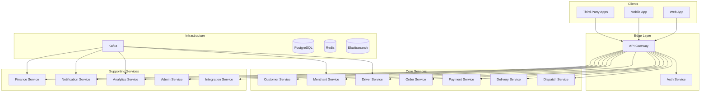

# Software Architecture Document (SAD)

## Executive Summary

**Platform:** [Nexus]
**Version:** 1.0.0
**Status:** Final
**Date:** 2026-06-30

---

## 1. Purpose

This Executive Summary provides a high-level overview of the **[Nexus]** software architecture. It describes the architectural vision, key principles, technology choices, and system boundaries.

---

## 2. Architectural Vision

The **[Platform Name]** is architected as an **API-first, event-driven, cloud-native platform** designed to power a world-class multi-sided commerce and logistics ecosystem. The architecture is built on the following pillars:

| Pillar | Description |
| :--- | :--- |
| **API-First** | All capabilities are exposed via well-defined, versioned APIs. |
| **Event-Driven** | Asynchronous communication via domain events for loose coupling. |
| **Microservices** | Independently deployable services aligned with business capabilities. |
| **Cloud-Native** | Designed for elasticity, resilience, and automation. |
| **Zero-Trust Security** | Security integrated at every layer. |
| **Observability** | Comprehensive metrics, logs, and traces. |

---

## 3. Key Requirements

### Functional Overview

The platform serves four primary personas:

| Persona | Primary Capability | Key Services |
| :--- | :--- | :--- |
| **Customer** | Order placement, tracking, payments | Customer, Order, Payment |
| **Merchant** | Store management, order fulfillment | Merchant, Order |
| **Driver** | Delivery execution, earnings | Driver, Delivery, Dispatch |
| **Admin** | Platform operations, analytics | Admin, Analytics |

### Non-Functional Requirements

| Requirement | Target |
| :--- | :--- |
| **Availability** | 99.95% (≤ 4.38 hours/year downtime) |
| **Latency (P95)** | < 500ms |
| **Throughput** | 10,000+ orders/second |
| **RTO** | < 15 minutes |
| **RPO** | < 5 minutes |

---

## 4. Architecture Overview

### High-Level Architecture

### Key Architecture Decisions

| Decision | Rationale |
| :--- | :--- |
| **Go for Core Services** | Performance, concurrency, simplicity |
| **PostgreSQL for OLTP** | ACID compliance, reliability, ecosystem |
| **Kafka for Event Streaming** | Durability, scalability, ecosystem |
| **Kubernetes for Orchestration** | Portability, ecosystem, scalability |
| **Event-Driven Architecture** | Loose coupling, scalability, resilience |

---

## 5. Service Inventory

| # | Service | Context | Type | Priority |
| :--- | :--- | :--- | :--- | :--- |
| 1 | **API Gateway** | Infrastructure | Edge | High |
| 2 | **Auth Service** | Identity & Access | Core | High |
| 3 | **Customer Service** | Customer | Core | High |
| 4 | **Merchant Service** | Merchant | Core | High |
| 5 | **Driver Service** | Driver | Core | High |
| 6 | **Order Service** | Order | Core | High |
| 7 | **Payment Service** | Payment | Core | High |
| 8 | **Delivery Service** | Delivery | Core | High |
| 9 | **Dispatch Service** | Dispatch | Core | High |
| 10 | **Finance Service** | Finance | Supporting | High |
| 11 | **Notification Service** | Notification | Supporting | High |
| 12 | **Analytics Service** | Analytics | Supporting | Medium |
| 13 | **Admin Service** | Admin | Supporting | High |
| 14 | **Integration Service** | Integration | Supporting | High |
| 15 | **Search Service** | Search | Supporting | Medium |

---

## 6. Technology Stack Summary

| Layer | Technologies |
| :--- | :--- |
| **Backend** | Go, Java, Python, Node.js |
| **Frontend** | React, TypeScript, Next.js |
| **Mobile** | Flutter, Dart |
| **Database** | PostgreSQL, Redis, Elasticsearch |
| **Messaging** | Apache Kafka |
| **Infrastructure** | Kubernetes, Docker, Terraform |
| **Monitoring** | Prometheus, Grafana, Jaeger, ELK |
| **CI/CD** | GitHub Actions, Argo CD |
| **Security** | OAuth 2.1, OIDC, SAML 2.0 |

---

## 7. Deployment & Scalability

### Deployment Strategy
- **Multi-Region:** Primary (us-east-1), Secondary (us-west-2)
- **Kubernetes Clusters:** Edge, Core, Support, Infrastructure, Monitoring
- **Deployment Strategy:** Blue/Green for zero-downtime deployments

### Scalability
| Dimension | Strategy |
| :--- | :--- |
| **Horizontal** | Horizontal Pod Autoscaler (HPA) |
| **Vertical** | Vertical scaling (instance types) |
| **Database** | Read replicas, connection pooling |
| **Cache** | Redis Cluster |

---

## 8. Security & Compliance

| Layer | Controls |
| :--- | :--- |
| **Edge** | WAF, DDoS Protection, TLS 1.3 |
| **API** | Authentication, Authorization, Rate Limiting |
| **Service** | mTLS, Service Mesh |
| **Data** | Encryption at Rest (AES-256), Encryption in Transit (TLS 1.3) |
| **Compliance** | PCI DSS, SOC 2, ISO 27001, GDPR, CCPA |

---

## 9. Operational Considerations

### SLO Targets
| SLO | Target |
| :--- | :--- |
| **API Availability** | 99.95% |
| **API Latency (P95)** | < 500ms |
| **API Error Rate** | < 1% |
| **RTO** | < 15 minutes |
| **RPO** | < 5 minutes |

### Observability Stack
- **Metrics:** Prometheus
- **Dashboards:** Grafana
- **Logs:** ELK Stack
- **Traces:** Jaeger
- **Alerting:** AlertManager

---

## 10. Next Steps

| Document | Description |
| :--- | :--- |
| [02_Architectural_Principles.md](02_Architectural_Principles.md) | Detailed architectural principles and patterns |
| [03_System_Context_Diagram.md](03_System_Context_Diagram.md) | C4 Level 1 System Context Diagram |
| [../02_Architecture_Models/01_C4_Model/](../02_Architecture_Models/01_C4_Model/) | Complete C4 Model diagrams |

---

## 11. Version History

| Version | Date | Author | Changes |
| :--- | :--- | :--- | :--- |
| 1.0.0 | 2026-06-30 | [Author] | Initial executive summary |
