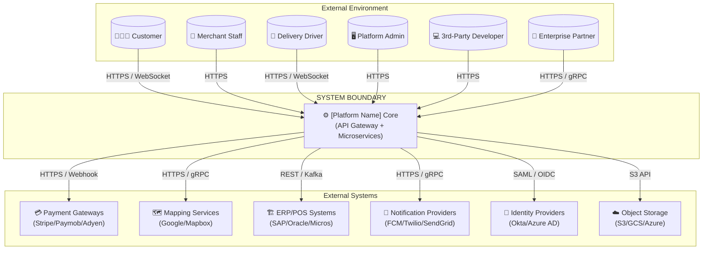

# Software Architecture Document (SAD)

## System Context Diagram

**Platform:** [Nexus]
**Version:** 1.0.0
**Status:** Final
**Date:** 2026-06-30

---

## 1. Purpose

The System Context Diagram (SCD) provides the highest-level view of the **[Nexus]** platform, showing the system boundaries and its interactions with external actors and systems. This is the Level 1 view of the C4 Model.

---

## 2. System Context Overview

**[Platform Name]** is a cloud-native, API-driven platform that orchestrates multi-sided commerce and logistics.

---

## 3. External Actors

| Actor | Description | Primary Touchpoint |
| :--- | :--- | :--- |
| **Customer** | End consumer placing orders | Mobile App / PWA |
| **Merchant Staff** | Store manager managing orders | Web Dashboard / KDS |
| **Delivery Driver** | Courier accepting and completing deliveries | Driver App |
| **Platform Admin** | Internal operations team | Admin Portal |
| **3rd-Party Developer** | External developers building on APIs | Developer Portal |
| **Enterprise Partner** | Enterprise partners using white-label SDKs | Private APIs / SDKs |

---

## 4. External Systems

| System | Criticality | Purpose |
| :--- | :--- | :--- |
| **Payment Gateways** | Tier 0 | Process payments, refunds, subscriptions |
| **Mapping Services** | Tier 0 | Geocoding, routing, ETA, navigation |
| **ERP/POS Systems** | Tier 1 | Inventory, menu, order synchronization |
| **Notification Providers** | Tier 1 | Push, email, SMS delivery |
| **Identity Providers** | Tier 2 | SSO, federation (Okta, Azure AD) |
| **Object Storage** | Tier 2 | Static assets (images, logos, receipts) |

---

## 5. Communication Protocols

| Interface | Direction | Protocol | Format |
| :--- | :--- | :--- | :--- |
| **Mobile/Web Clients** | Inbound | HTTPS / WSS | JSON / Protobuf |
| **Public API** | Inbound | HTTPS | JSON |
| **Webhooks** | Outbound | HTTPS | JSON |
| **Payment Gateway** | Outbound | HTTPS | JSON |
| **Mapping Services** | Outbound | HTTPS / gRPC | JSON / Protobuf |
| **ERP/POS Sync** | Bidirectional | HTTPS / Kafka | JSON / XML |

---

## 6. Trust Boundaries

| Zone | Description | Security Controls |
| :--- | :--- | :--- |
| **Public Internet** | External actors | HTTPS, TLS 1.3, Rate Limiting, WAF |
| **DMZ** | API Gateway | Authentication (JWT/API Key), DDoS Protection |
| **Internal Corporate** | Admin users | VPN, RBAC, MFA |
| **Backend Infrastructure** | Services, Databases | mTLS, Network Policies, Private Subnets |

---

## 7. Version History

| Version | Date | Author | Changes |
| :--- | :--- | :--- | :--- |
| 1.0.0 | 2026-06-30 | [Author] | Initial system context diagram |

