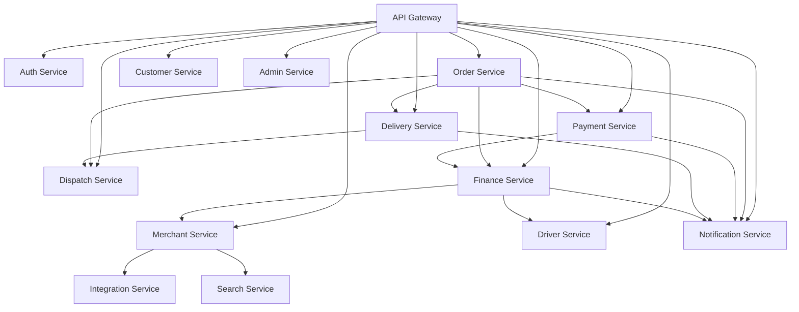

# Software Architecture Document (SAD)

## Service Decomposition

**Platform:** Nexus
**Version:** 1.0.0
**Status:** Final
**Date:** 2026-07-05
**Author:** Ahmed Abdullah Mohamed

---

## 1. Purpose

This document provides a comprehensive service decomposition for the **Nexus** platform, defining each microservice's responsibilities, boundaries, and dependencies.

---

## 2. Service Inventory

| # | Service | Context | Type | Team | Priority |
| :--- | :--- | :--- | :--- | :--- | :--- |
| 1 | **API Gateway** | Infrastructure | Edge | Platform | High |
| 2 | **Auth Service** | Identity | Core | Platform | High |
| 3 | **Customer Service** | Customer | Core | Customer | High |
| 4 | **Merchant Service** | Merchant | Core | Merchant | High |
| 5 | **Driver Service** | Driver | Core | Driver | High |
| 6 | **Order Service** | Order | Core | Order | High |
| 7 | **Payment Service** | Payment | Core | Payment | High |
| 8 | **Delivery Service** | Delivery | Core | Delivery | High |
| 9 | **Dispatch Service** | Dispatch | Core | Dispatch | High |
| 10 | **Finance Service** | Finance | Supporting | Finance | High |
| 11 | **Notification Service** | Notification | Supporting | Platform | High |
| 12 | **Analytics Service** | Analytics | Supporting | Data | Medium |
| 13 | **Admin Service** | Admin | Supporting | Platform | High |
| 14 | **Integration Service** | Integration | Supporting | Platform | High |
| 15 | **Search Service** | Search | Supporting | Platform | Medium |

---

## 3. Service Details

### 3.1 API Gateway

| Attribute | Description |
| :--- | :--- |
| **Responsibility** | Routing, authentication, rate limiting, caching, logging |
| **Technology** | Kong / KrakenD |
| **Database** | None (Redis for config) |
| **Dependencies** | Auth Service, Redis |

### 3.2 Auth Service

| Attribute | Description |
| :--- | :--- |
| **Responsibility** | Authentication, authorization, MFA, SSO, token management |
| **Technology** | Go / Spring Boot |
| **Database** | PostgreSQL |
| **Dependencies** | User Database, Redis, Identity Providers |

### 3.3 Customer Service

| Attribute | Description |
| :--- | :--- |
| **Responsibility** | Customer profiles, addresses, loyalty, wallet |
| **Technology** | Go / Spring Boot |
| **Database** | PostgreSQL |
| **Dependencies** | Loyalty Service, Wallet Service |
| **Events** | `CustomerRegistered`, `CustomerUpdated` |

### 3.4 Merchant Service

| Attribute | Description |
| :--- | :--- |
| **Responsibility** | Onboarding, stores, menus, catalog, inventory |
| **Technology** | Go / Spring Boot |
| **Database** | PostgreSQL |
| **Dependencies** | Search Service, Integration Service |
| **Events** | `MerchantRegistered`, `StoreCreated`, `MenuItemUpdated` |

### 3.5 Order Service

| Attribute | Description |
| :--- | :--- |
| **Responsibility** | Order lifecycle, state machine, orchestration |
| **Technology** | Go / Spring Boot |
| **Database** | PostgreSQL |
| **Dependencies** | Payment Service, Delivery Service, Dispatch Service |
| **Events** | `OrderCreated`, `OrderConfirmed`, `OrderDelivered` |

---

## 4. Service Dependencies Map

---

## 5. Scaling & Resource Allocation

| Service | Replicas (Prod) | CPU Request | Memory Request |
| :--- | :--- | :--- | :--- |
| **API Gateway** | 5 | 100m | 256Mi |
| **Auth Service** | 5 | 200m | 512Mi |
| **Order Service** | 5 | 200m | 512Mi |
| **Payment Service** | 5 | 200m | 512Mi |
| **Delivery Service** | 5 | 200m | 512Mi |
| **Dispatch Service** | 5 | 200m | 512Mi |
| **Notification Service** | 3 | 100m | 256Mi |
| **Analytics Service** | 2 | 200m | 1Gi |

---

## 6. Version History

| Version | Date | Author | Changes |
| :--- | :--- | :--- | :--- |
| 1.0.0 | 2026-07-05 | Ahmed Abdullah Mohamed | Initial service decomposition |

