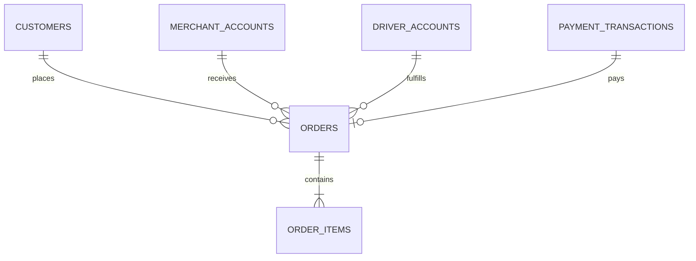

# Software Architecture Document (SAD)

## Database Schema Overview

**Platform:** Nexus
**Version:** 1.0.0
**Status:** Final
**Date:** 2026-07-05
**Author:** Ahmed Abdullah Mohamed

---

## 1. Purpose

This document provides an overview of the database schemas for the **Nexus** platform. Each service manages its own database (Database per Service pattern).

---

## 2. Core Tables

### 2.1 Customers Service

**Table: customers**

| Column | Type | Description |
| :--- | :--- | :--- |
| `customer_id` | UUID | PRIMARY KEY |
| `first_name` | VARCHAR(100) | NOT NULL |
| `last_name` | VARCHAR(100) | NOT NULL |
| `email` | VARCHAR(255) | UNIQUE, NOT NULL |
| `phone` | VARCHAR(20) | UNIQUE, NOT NULL |
| `password_hash` | VARCHAR(255) | |
| `status` | VARCHAR(20) | DEFAULT 'PENDING_VERIFICATION' |
| `created_at` | TIMESTAMP | DEFAULT NOW() |

**Table: customer_addresses**

| Column | Type | Description |
| :--- | :--- | :--- |
| `address_id` | UUID | PRIMARY KEY |
| `customer_id` | UUID | FOREIGN KEY |
| `label` | VARCHAR(50) | NOT NULL |
| `address_line_1` | VARCHAR(255) | NOT NULL |
| `city` | VARCHAR(100) | NOT NULL |
| `latitude` | DECIMAL(10,8) | |
| `longitude` | DECIMAL(11,8) | |
| `is_default` | BOOLEAN | DEFAULT FALSE |

### 2.2 Orders Service

**Table: orders**

| Column | Type | Description |
| :--- | :--- | :--- |
| `order_id` | UUID | PRIMARY KEY |
| `customer_id` | UUID | FOREIGN KEY |
| `merchant_id` | UUID | FOREIGN KEY |
| `driver_id` | UUID | FOREIGN KEY |
| `order_reference` | VARCHAR(50) | UNIQUE, NOT NULL |
| `status` | VARCHAR(20) | NOT NULL |
| `subtotal` | DECIMAL(12,2) | NOT NULL |
| `total` | DECIMAL(12,2) | NOT NULL |
| `currency` | VARCHAR(3) | NOT NULL |
| `delivery_address` | JSONB | NOT NULL |
| `created_at` | TIMESTAMP | DEFAULT NOW() |

**Table: order_items**

| Column | Type | Description |
| :--- | :--- | :--- |
| `order_item_id` | UUID | PRIMARY KEY |
| `order_id` | UUID | FOREIGN KEY |
| `item_name` | VARCHAR(255) | NOT NULL |
| `price` | DECIMAL(12,2) | NOT NULL |
| `quantity` | INTEGER | NOT NULL |
| `modifiers` | JSONB | |

### 2.3 Payments Service

**Table: payment_transactions**

| Column | Type | Description |
| :--- | :--- | :--- |
| `transaction_id` | UUID | PRIMARY KEY |
| `order_id` | UUID | FOREIGN KEY |
| `gateway_name` | VARCHAR(50) | NOT NULL |
| `gateway_transaction_id` | VARCHAR(255) | |
| `amount` | DECIMAL(12,2) | NOT NULL |
| `currency` | VARCHAR(3) | NOT NULL |
| `status` | VARCHAR(20) | NOT NULL |
| `created_at` | TIMESTAMP | DEFAULT NOW() |

### 2.4 Merchant Service

**Table: merchant_accounts**

| Column | Type | Description |
| :--- | :--- | :--- |
| `merchant_id` | UUID | PRIMARY KEY |
| `business_legal_name` | VARCHAR(255) | NOT NULL |
| `tax_id` | VARCHAR(50) | UNIQUE |
| `commission_rate` | DECIMAL(5,2) | DEFAULT 20.00 |
| `status` | VARCHAR(20) | DEFAULT 'PENDING' |

**Table: menu_items**

| Column | Type | Description |
| :--- | :--- | :--- |
| `item_id` | UUID | PRIMARY KEY |
| `store_id` | UUID | FOREIGN KEY |
| `name` | VARCHAR(255) | NOT NULL |
| `description` | TEXT | |
| `price` | DECIMAL(12,2) | NOT NULL |
| `is_available` | BOOLEAN | DEFAULT TRUE |

---

## 3. Relationships Diagram (Conceptual)

---

## 4. Version History

| Version | Date | Author | Changes |
| :--- | :--- | :--- | :--- |
| 1.0.0 | 2026-07-05 | Ahmed Abdullah Mohamed | Initial schema overview |

