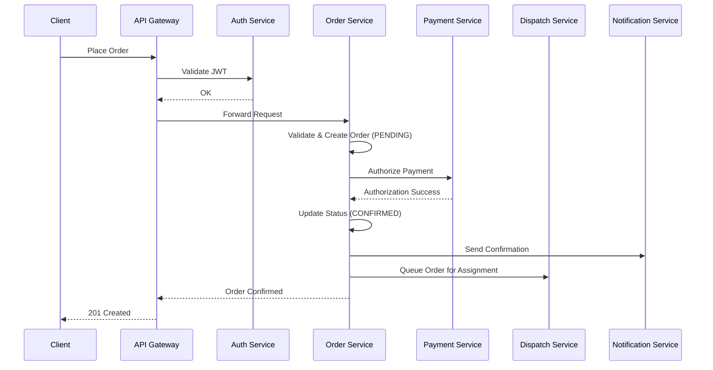
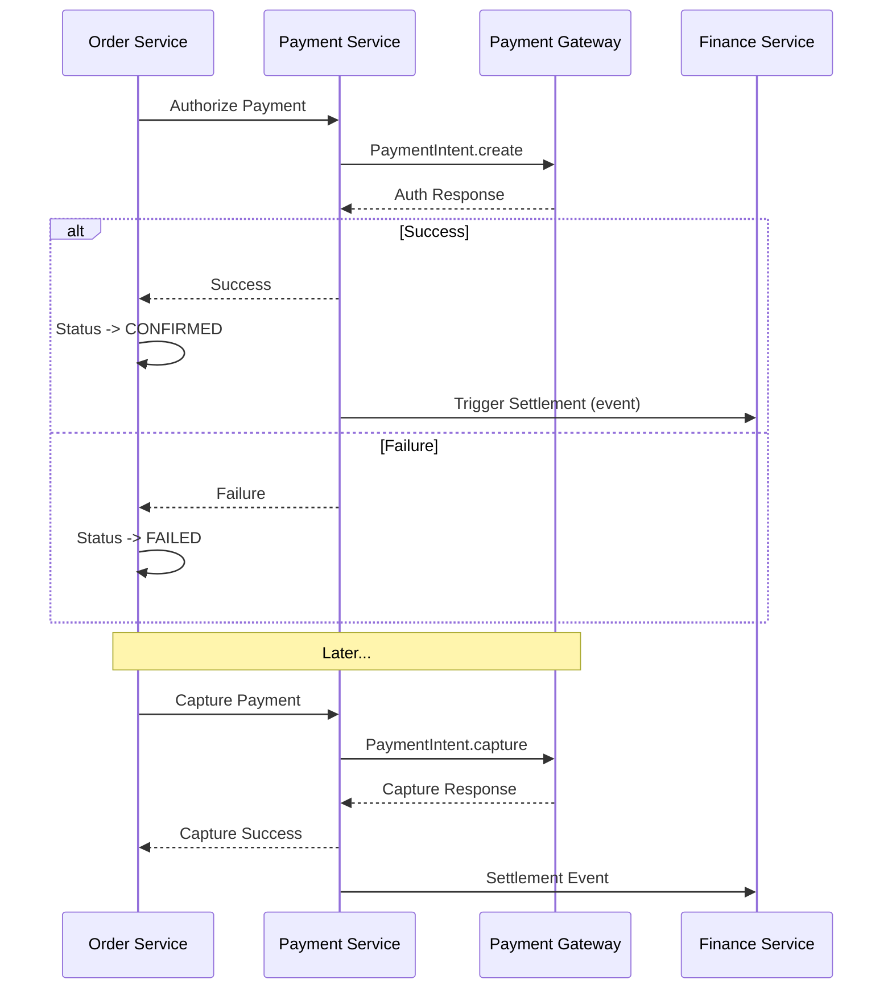
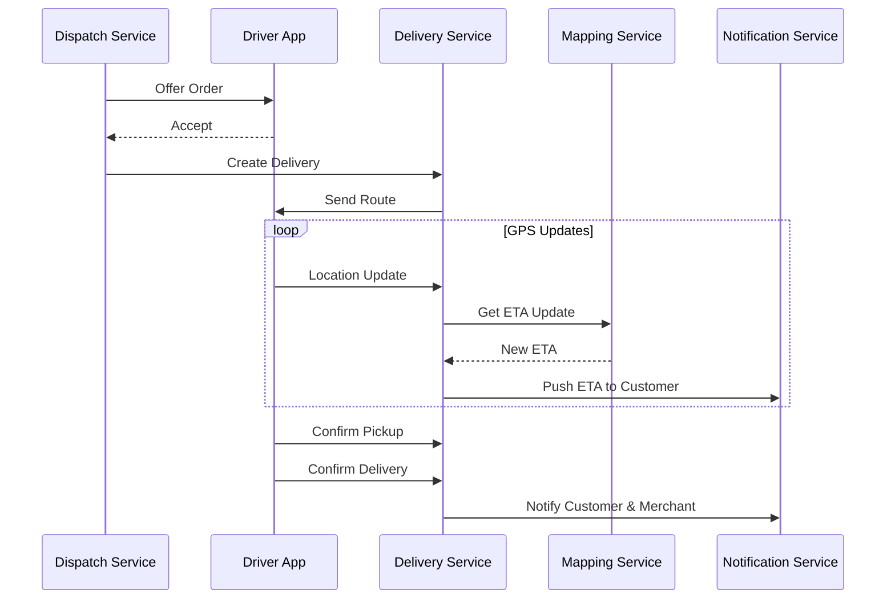

# Software Architecture Document (SAD)

## Data Flow & Sequence Diagrams

**Platform:** Nexus
**Version:** 1.0.0
**Status:** Final
**Date:** 2026-07-05
**Author:** Ahmed Abdullah Mohamed

---

## 1. Purpose

This document illustrates the key data flows and interaction sequences between services for the **Nexus** platform.

---

## 2. Order Placement Flow

---

## 3. Payment Authorization & Capture Flow

---

## 4. Delivery Execution Flow

---

## 5. Version History

| Version | Date | Author | Changes |
| :--- | :--- | :--- | :--- |
| 1.0.0 | 2026-07-05 | Ahmed Abdullah Mohamed | Initial flow diagrams |
