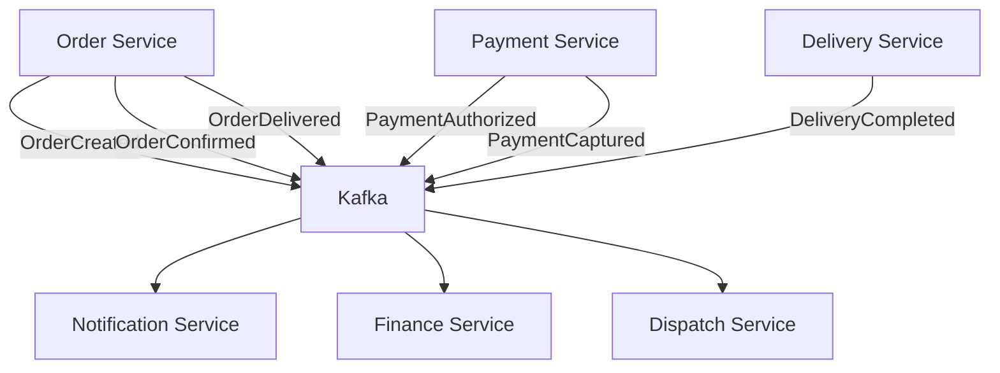

# Software Architecture Document (SAD)

## Event Catalog

**Platform:** Nexus
**Version:** 1.0.0
**Status:** Final
**Date:** 2026-07-05
**Author:** Ahmed Abdullah Mohamed

---

## 1. Purpose

This document catalogs all domain events used across the **Nexus** platform for event-driven communication.

---

## 2. Event Summary

| Event | Source Context | Consumers |
| :--- | :--- | :--- |
| **Order Events** | | |
| `OrderCreated` | Order | Payment, Dispatch, Notification, Analytics |
| `OrderConfirmed` | Order | Notification, Analytics |
| `OrderReady` | Order | Dispatch, Notification |
| `OrderDelivered` | Order | Payment, Finance, Notification, Merchant |
| `OrderCancelled` | Order | Payment, Delivery, Notification, Finance |
| **Payment Events** | | |
| `PaymentAuthorized` | Payment | Order, Notification |
| `PaymentCaptured` | Payment | Order, Finance, Notification |
| `PaymentFailed` | Payment | Order, Notification |
| `PaymentRefunded` | Payment | Order, Finance, Notification |
| **Delivery Events** | | |
| `DeliveryAssigned` | Dispatch | Order, Driver, Notification |
| `DeliveryCompleted` | Delivery | Order, Finance, Notification |
| `DeliveryFailed` | Delivery | Order, Notification, Finance |
| **Finance Events** | | |
| `SettlementCalculated` | Finance | Merchant, Notification |
| `PayoutProcessed` | Finance | Driver, Notification |
| **Customer Events** | | |
| `CustomerRegistered` | Customer | Notification, Analytics, Loyalty |
| `LoyaltyPointsEarned` | Loyalty | Customer, Notification |

---

## 3. Event Structure Example

### OrderCreated Event

```json
{
  "event_id": "550e8400-e29b-41d4-a716-446655440000",
  "event_type": "OrderCreated",
  "event_version": "1.0",
  "aggregate_id": "550e8400-e29b-41d4-a716-446655440001",
  "aggregate_type": "Order",
  "timestamp": "2026-07-05T14:30:45.123Z",
  "correlation_id": "550e8400-e29b-41d4-a716-446655440002",
  "data": {
    "order_id": "550e8400-e29b-41d4-a716-446655440001",
    "customer_id": "550e8400-e29b-41d4-a716-446655440003",
    "merchant_id": "550e8400-e29b-41d4-a716-446655440004",
    "total": 53.50,
    "currency": "USD",
    "items": [
      { "item_id": "550e8400-e29b-41d4-a716-446655440005", "name": "Pizza", "quantity": 1, "price": 45.00 }
    ]
  }
}
```

---

## 4. Event Flow: Order Lifecycle



---

## 5. Version History

| Version | Date | Author | Changes |
| :--- | :--- | :--- | :--- |
| 1.0.0 | 2026-07-05 | Ahmed Abdullah Mohamed | Initial event catalog |

