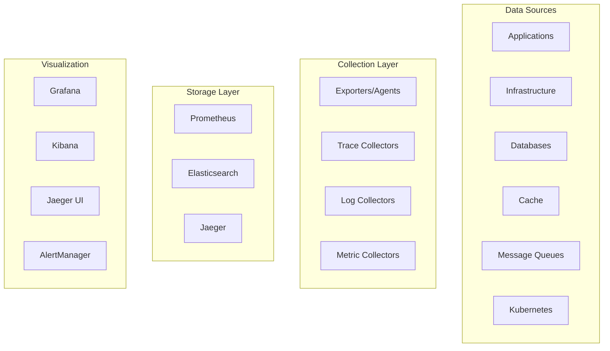

# Software Architecture Document (SAD)

## Observability & Monitoring

**Platform:** Nexus
**Version:** 1.0.0
**Status:** Final
**Date:** 2026-07-05
**Author:** Ahmed Abdullah Mohamed

---

## 1. Purpose

This document defines the observability and monitoring capabilities for the **Nexus** platform, including metrics collection, log aggregation, distributed tracing, alerting, and dashboards.

---

## 2. Observability Architecture



---

## 3. Metrics

### Key Metrics

| Category | Metric | Description | Alert Threshold |
| :--- | :--- | :--- | :--- |
| **Infrastructure** | CPU Utilization | CPU usage percentage | > 80% |
| | Memory Utilization | Memory usage percentage | > 85% |
| | Disk Utilization | Disk usage percentage | > 80% |
| | Network I/O | Network traffic | Monitor |
| **Application** | Request Rate | Requests per second | Monitor |
| | Error Rate | Percentage of errors | > 2% |
| | Latency (p50, p95, p99) | Request latency | P95 > 500ms |
| | Service Availability | Uptime percentage | < 99.95% |
| **Business** | Order Rate | Orders per minute | Monitor |
| | Payment Success Rate | Payment success percentage | < 99% |
| | Delivery Completion Rate | Delivery completion percentage | < 95% |
| | Active Users | Concurrent users | Monitor |
| **Database** | Query Rate | Queries per second | Monitor |
| | Connection Count | Active connections | > 80% pool |
| | Cache Hit Rate | Cache hit percentage | < 80% |
| **Messaging** | Queue Depth | Message queue depth | > 1000 |
| | Consumer Lag | Consumer processing lag | > 10000 |

### Prometheus Configuration

```yaml
global:
  scrape_interval: 15s
  evaluation_interval: 15s
  external_labels:
    cluster: 'nexus-prod'

scrape_configs:
  - job_name: 'kubernetes-pods'
    kubernetes_sd_configs:
      - role: pod
    relabel_configs:
      - source_labels: [__meta_kubernetes_pod_annotation_prometheus_io_scrape]
        action: keep
        regex: true
      - source_labels: [__meta_kubernetes_pod_annotation_prometheus_io_path]
        action: replace
        target_label: __metrics_path__
        regex: (.+)
      - source_labels: [__address__, __meta_kubernetes_pod_annotation_prometheus_io_port]
        action: replace
        regex: (.+):(?:\d+);(\d+)
        replacement: $1:$2
        target_label: __address__

  - job_name: 'kubernetes-nodes'
    scheme: https
    tls_config:
      ca_file: /var/run/secrets/kubernetes.io/serviceaccount/ca.crt
    bearer_token_file: /var/run/secrets/kubernetes.io/serviceaccount/token
    kubernetes_sd_configs:
      - role: node

  - job_name: 'postgresql'
    static_configs:
      - targets: ['postgres-exporter:9187']
        labels:
          service: 'postgresql'

  - job_name: 'redis'
    static_configs:
      - targets: ['redis-exporter:9121']
        labels:
          service: 'redis'

  - job_name: 'kafka'
    static_configs:
      - targets: ['kafka-exporter:9308']
        labels:
          service: 'kafka'
```

### Metrics Retention

| Data Type | Retention | Storage Estimate |
| :--- | :--- | :--- |
| **Metrics** | 30 days | 500 GB |
| **Logs** | 30 days | 2,000 GB |
| **Traces** | 7 days | 500 GB |

---

## 4. Logging

### Log Types

| Type | Description | Source |
| :--- | :--- | :--- |
| **Application Logs** | Service application logs | All services |
| **Access Logs** | API gateway and load balancer logs | API Gateway, ALB |
| **System Logs** | Operating system logs | Nodes |
| **Security Logs** | Security and audit logs | Auth Service, Audit |
| **Database Logs** | Database query logs | PostgreSQL |
| **Kubernetes Logs** | Container and pod logs | EKS |

### Log Structure

```json
{
  "timestamp": "2026-07-05T14:30:45.123Z",
  "level": "INFO",
  "trace_id": "550e8400-e29b-41d4-a716-446655440000",
  "span_id": "123e4567-e89b-12d3-a456-426614174000",
  "service": "order-service",
  "environment": "production",
  "message": "Order created successfully",
  "fields": {
    "order_id": "550e8400-e29b-41d4-a716-446655440001",
    "customer_id": "550e8400-e29b-41d4-a716-446655440002",
    "total": 53.50,
    "currency": "USD"
  },
  "host": "order-service-pod-12345",
  "namespace": "nexus"
}
```

### ELK Configuration

```yaml
# filebeat.yml
filebeat.inputs:
  - type: container
    paths:
      - /var/log/containers/*.log
    processors:
      - add_kubernetes_metadata:
          host: ${NODE_NAME}
          matchers:
          - logs_path:
              logs_path: "/var/log/containers/"

  - type: log
    paths:
      - /var/log/nexus/*.log
    fields:
      log_type: application
    fields_under_root: true

output.elasticsearch:
  hosts: ['${ELASTICSEARCH_HOST:elasticsearch}:${ELASTICSEARCH_PORT:9200}']
  username: ${ELASTICSEARCH_USERNAME}
  password: ${ELASTICSEARCH_PASSWORD}
  index: "nexus-logs-%{+yyyy.MM.dd}"

setup.kibana:
  host: '${KIBANA_HOST:kibana}:${KIBANA_PORT:5601}'
```

---

## 5. Distributed Tracing

### Jaeger Configuration

| Parameter | Value |
| :--- | :--- |
| **Sampling Rate** | 10% (configurable) |
| **Trace Retention** | 7 days |
| **Service Maps** | Enabled |
| **Trace Search** | Enabled |
| **Storage Type** | Elasticsearch |

### Jaeger Deployment

```yaml
# jaeger-agent.yaml
apiVersion: apps/v1
kind: DaemonSet
metadata:
  name: jaeger-agent
  namespace: observability
spec:
  selector:
    matchLabels:
      app: jaeger-agent
  template:
    metadata:
      labels:
        app: jaeger-agent
    spec:
      containers:
      - name: jaeger-agent
        image: jaegertracing/jaeger-agent:1.35
        ports:
        - containerPort: 5775
          protocol: UDP
        - containerPort: 6831
          protocol: UDP
        - containerPort: 6832
          protocol: UDP
        - containerPort: 5778
          protocol: TCP
        args:
        - --reporter.grpc.host-port=dns:///jaeger-collector:14250
        - --reporter.type=grpc
        - --agent.tags=cluster=nexus-prod
        resources:
          limits:
            memory: 128Mi
            cpu: 100m
          requests:
            memory: 64Mi
            cpu: 50m
```

### Trace Data Model

| Field | Type | Description |
| :--- | :--- | :--- |
| `trace_id` | UUID | Unique trace identifier |
| `span_id` | UUID | Span identifier |
| `parent_span_id` | UUID | Parent span identifier |
| `service_name` | String | Service name |
| `operation_name` | String | Operation name |
| `start_time` | Timestamp | Start time |
| `duration_ms` | Integer | Duration in milliseconds |
| `status` | String | OK/ERROR |
| `tags` | JSON | Span tags |

---

## 6. Dashboards

### Dashboard Types

| Dashboard | Description | Purpose |
| :--- | :--- | :--- |
| **Infrastructure** | CPU, memory, disk, network | System health |
| **Application** | Request rate, error rate, latency | Service health |
| **Business** | Orders, revenue, users | Business metrics |
| **Database** | Query rate, connections, replication | Database health |
| **Messaging** | Queue depth, consumer lag | Kafka health |
| **Kubernetes** | Pod status, resource usage | Cluster health |
| **SLO Dashboard** | Service level objective status | Reliability |
| **Incident** | Incident response dashboard | Incident management |

### Grafana Dashboard Example

```json
{
  "title": "Nexus Infrastructure",
  "panels": [
    {
      "title": "CPU Utilization",
      "type": "graph",
      "targets": [
        {
          "expr": "avg(rate(container_cpu_usage_seconds_total[5m])) by (pod)"
        }
      ]
    },
    {
      "title": "Memory Utilization",
      "type": "graph",
      "targets": [
        {
          "expr": "avg(container_memory_usage_bytes) by (pod)"
        }
      ]
    },
    {
      "title": "Request Rate",
      "type": "graph",
      "targets": [
        {
          "expr": "sum(rate(http_requests_total[5m])) by (service)"
        }
      ]
    },
    {
      "title": "Error Rate",
      "type": "graph",
      "targets": [
        {
          "expr": "sum(rate(http_requests_total{status=~\"5..\"}[5m])) / sum(rate(http_requests_total[5m]))"
        }
      ]
    },
    {
      "title": "Latency (P95)",
      "type": "graph",
      "targets": [
        {
          "expr": "histogram_quantile(0.95, sum(rate(http_request_duration_seconds_bucket[5m])) by (le, service))"
        }
      ]
    }
  ]
}
```

---

## 7. Alerting

### Alert Rules

| Rule | Severity | Threshold | Condition | Action |
| :--- | :--- | :--- | :--- | :--- |
| **Service Down** | Critical | > 1 min | Service unavailable | PagerDuty |
| **High Error Rate** | Critical | > 5% > 2 min | Error rate exceeds | PagerDuty |
| **High Latency** | High | P95 > 1s > 5 min | Latency exceeds | Slack |
| **CPU High** | High | > 90% > 5 min | CPU utilization | Slack |
| **Memory High** | High | > 90% > 5 min | Memory utilization | Slack |
| **Disk Full** | High | > 85% > 5 min | Disk utilization | Slack |
| **Queue Depth** | High | > 1000 > 5 min | Queue depth | Slack |
| **Consumer Lag** | High | > 10000 | Consumer lag | Slack |
| **Certificate Expiry** | High | < 30 days | Certificate expiry | Slack |

### AlertManager Configuration

```yaml
route:
  group_by: ['alertname', 'cluster', 'service']
  group_wait: 30s
  group_interval: 5m
  repeat_interval: 4h
  receiver: 'pagerduty'
  routes:
  - match:
      severity: 'critical'
    receiver: 'pagerduty'
    continue: true
  - match:
      severity: 'high'
    receiver: 'slack'
    continue: true
  - match:
      severity: 'medium'
    receiver: 'email'
    continue: true
  - match:
      severity: 'low'
    receiver: 'email'

receivers:
- name: 'pagerduty'
  pagerduty_configs:
  - service_key: 'your-pagerduty-service-key'
    send_resolved: true
- name: 'slack'
  slack_configs:
  - api_url: 'https://hooks.slack.com/services/...'
    channel: '#alerts'
    send_resolved: true
- name: 'email'
  email_configs:
  - to: 'alerts@nexus.com'
    send_resolved: true
```

---

## 8. Service Level Objectives (SLOs)

| SLO | Target | Error Budget | Window |
| :--- | :--- | :--- | :--- |
| **API Availability** | 99.95% | 0.05% (21.9 min/month) | 30 days |
| **API Latency (P95)** | < 500ms | N/A | 30 days |
| **API Error Rate** | < 1% | N/A | 30 days |
| **Order Creation Success** | > 99.9% | 0.1% | 30 days |
| **Payment Success** | > 99.9% | 0.1% | 30 days |
| **Delivery Completion** | > 95% | 5% | 30 days |

---

## 9. Version History

| Version | Date | Author | Changes |
| :--- | :--- | :--- | :--- |
| 1.0.0 | 2026-07-05 | Ahmed Abdullah Mohamed | Initial observability and monitoring |

