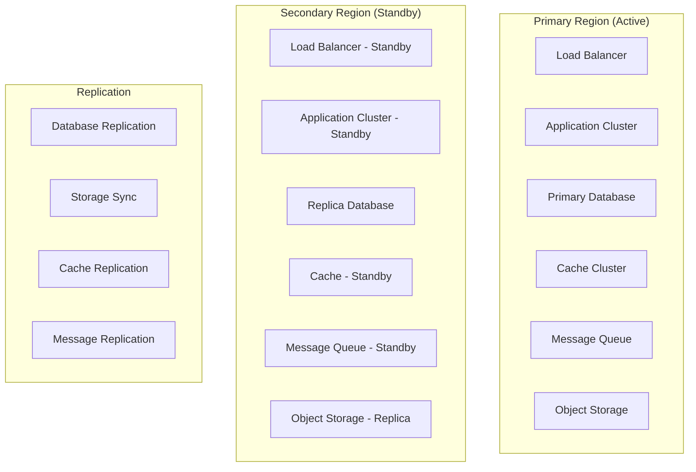
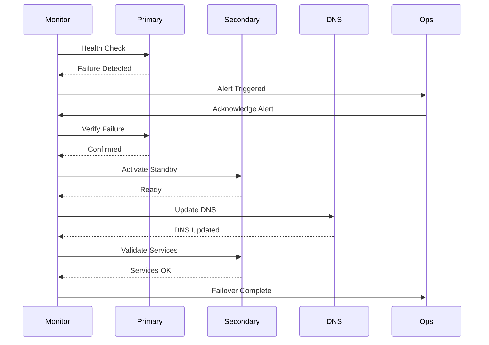

# Software Architecture Document (SAD)

## Disaster Recovery

**Platform:** Nexus
**Version:** 1.0.0
**Status:** Final
**Date:** 2026-07-05
**Author:** Ahmed Abdullah Mohamed

---

## 1. Purpose

This document defines the disaster recovery and business continuity strategy for the **Nexus** platform.

---

## 2. Recovery Objectives

| Objective | Target | Priority |
| :--- | :--- | :--- |
| **Recovery Time Objective (RTO)** | < 15 minutes | Required |
| **Recovery Point Objective (RPO)** | < 5 minutes | Required |
| **Availability Target** | 99.95% uptime | Required |
| **Data Durability** | 99.999999999% (11 nines) | Required |

---

## 3. Disaster Recovery Architecture

---

## 4. Recovery Strategies

| Strategy | Description | RTO | RPO | Priority |
| :--- | :--- | :--- | :--- | :--- |
| **Active-Active** | Multiple active regions | < 5 min | < 1 min | Required |
| **Active-Passive** | Primary with standby region | < 15 min | < 5 min | Required |
| **Pilot Light** | Minimal resources in standby | < 30 min | < 15 min | Required |
| **Warm Standby** | Partially running standby | < 15 min | < 5 min | Required |
| **Backup and Restore** | Restore from backups | < 1 hour | < 30 min | Required |

---

## 5. Backup Strategy

### Backup Schedule

| Data Type | Backup Type | Frequency | Retention |
| :--- | :--- | :--- | :--- |
| **Database** | Continuous | Real-time | 7 days |
| **Database** | Full Snapshot | Daily | 30 days |
| **Database** | Weekly Backup | Weekly | 90 days |
| **Database** | Monthly Backup | Monthly | 1 year |
| **Object Storage** | Continuous | Real-time | 30 days |
| **Application Logs** | Full Backup | Daily | 30 days |
| **Configuration** | Full Backup | On change | 90 days |
| **Transaction Logs** | Continuous | Real-time | 7 days |

### Backup Storage

| Storage Type | Location | Encryption | Priority |
| :--- | :--- | :--- | :--- |
| **Primary Storage** | Same region | AES-256 | Required |
| **Secondary Storage** | Different region | AES-256 | Required |
| **Tertiary Storage** | Different cloud provider | AES-256 | Required |
| **Offline Storage** | Physical media | AES-256 | Required |

### Backup Validation

| Activity | Frequency | Owner |
| :--- | :--- | :--- |
| **Backup Integrity Check** | Daily | Operations |
| **Restore Test** | Weekly | Operations |
| **Full DR Drill** | Quarterly | Operations |

---

## 6. Failover Process

### Failover Triggers

| Trigger | Response | RTO |
| :--- | :--- | :--- |
| **Region Outage** | Failover to secondary | < 15 min |
| **Service Outage** | Failover service | < 5 min |
| **Database Failure** | Failover to replica | < 5 min |
| **Network Failure** | Failover to alternate | < 10 min |
| **Security Incident** | Isolate and failover | < 15 min |
| **Maintenance** | Graceful failover | Scheduled |

### Failover Types

| Type | Description | Automation |
| :--- | :--- | :--- |
| **Automatic Failover** | Automated on failure detection | 100% |
| **Manual Failover** | Operator-initiated failover | Semi-automated |
| **Planned Failover** | Scheduled maintenance failover | Manual |
| **Emergency Failover** | Emergency incident failover | Manual |

### Failover Process

---

## 7. Disaster Recovery Scenarios

### Scenario 1: Database Failure

| Aspect | Description |
| :--- | :--- |
| **Trigger** | Primary database unreachable or corrupted |
| **Impact** | All write operations fail, read operations affected |
| **RTO** | < 5 minutes |
| **RPO** | < 1 minute |
| **Response** | Promote replica to primary, update connection strings |
| **Recovery** | Restore from standby, verify data integrity |
| **Prevention** | Automated failover, replication monitoring |

### Scenario 2: Regional Outage

| Aspect | Description |
| :--- | :--- |
| **Trigger** | Complete region unavailable (AWS outage) |
| **Impact** | Full service outage in region |
| **RTO** | < 15 minutes |
| **RPO** | < 5 minutes |
| **Response** | Failover to secondary region, update DNS |
| **Recovery** | Restore services in secondary region |
| **Prevention** | Multi-region deployment, warm standby |

### Scenario 3: Service Outage

| Aspect | Description |
| :--- | :--- |
| **Trigger** | Critical microservice failure |
| **Impact** | Affected service unavailable |
| **RTO** | < 5 minutes |
| **RPO** | < 1 minute |
| **Response** | Restart service, failover to healthy instances |
| **Recovery** | Restore service, verify functionality |
| **Prevention** | Circuit breakers, retries, health checks |

### Scenario 4: Security Incident

| Aspect | Description |
| :--- | :--- |
| **Trigger** | Security breach detected |
| **Impact** | Potential data exposure, service compromise |
| **RTO** | < 15 minutes |
| **RPO** | < 5 minutes |
| **Response** | Isolate affected systems, failover to clean environment |
| **Recovery** | Investigate incident, restore from clean backups |
| **Prevention** | Security monitoring, vulnerability scanning |

### Scenario 5: Data Corruption

| Aspect | Description |
| :--- | :--- |
| **Trigger** | Data corruption detected |
| **Impact** | Data integrity compromised |
| **RTO** | < 15 minutes |
| **RPO** | < 5 minutes |
| **Response** | Stop writes, restore from last known good state |
| **Recovery** | Validate data integrity, resume operations |
| **Prevention** | Data validation, checksums, immutability |

---

## 8. Disaster Recovery Testing

### Test Types

| Test Type | Frequency | Scope | Owner |
| :--- | :--- | :--- | :--- |
| **Tabletop Exercise** | Monthly | Plan walkthrough | Operations |
| **Simulation** | Quarterly | Simulated disaster | Operations |
| **Partial Failover** | Quarterly | Non-critical services | Operations |
| **Full Failover** | Annually | Complete failover | Operations |
| **Backup Restore** | Monthly | Restore from backups | Operations |
| **Chaos Engineering** | Weekly | Random failure injection | SRE |

### Test Process

1. **Planning:** Define test scope, objectives, and success criteria
2. **Preparation:** Prepare environment, notify stakeholders
3. **Execution:** Execute disaster recovery test
4. **Monitoring:** Monitor test execution and metrics
5. **Validation:** Validate recovery success
6. **Fallback:** Return to normal operations
7. **Review:** Document results and lessons learned
8. **Improvement:** Update DR plan based on findings

---

## 9. Business Continuity

### Communication Plan

| Stakeholder | Communication | Channel | Timing |
| :--- | :--- | :--- | :--- |
| **Customers** | Service disruption notification | Email, Status Page | Immediate |
| **Merchants** | Service disruption notification | Email, Dashboard | Immediate |
| **Drivers** | Service disruption notification | Push, SMS | Immediate |
| **Employees** | Internal communication | Slack, Email | Immediate |
| **Executives** | Executive briefing | Phone, Email | < 15 min |
| **Investors** | Investor communication | Email | < 1 hour |
| **Regulators** | Regulatory notification | Formal letter | < 72 hours |

### Business Continuity Plan Components

| Component | Description | Owner |
| :--- | :--- | :--- |
| **Incident Response** | Immediate response to incidents | SRE |
| **Crisis Management** | Executive crisis management | Executive |
| **Communication** | Stakeholder communication | Communications |
| **IT Recovery** | Technical system recovery | Operations |
| **Business Recovery** | Business function recovery | Operations |
| **Post-Incident Review** | Lessons learned and improvements | SRE |

---

## 10. Version History

| Version | Date | Author | Changes |
| :--- | :--- | :--- | :--- |
| 1.0.0 | 2026-07-05 | Ahmed Abdullah Mohamed | Initial disaster recovery |
