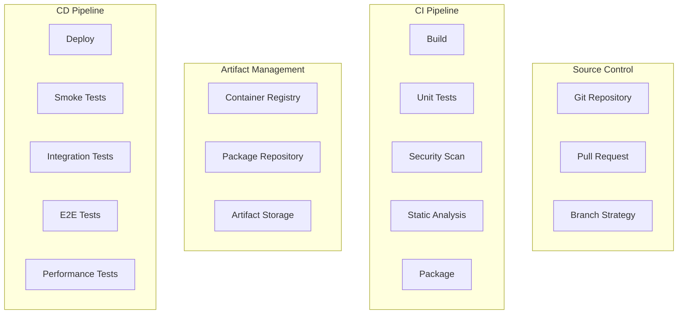
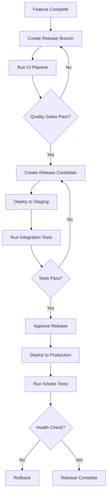

# Software Architecture Document (SAD)

## CI/CD & Deployment

**Platform:** Nexus
**Version:** 1.0.0
**Status:** Final
**Date:** 2026-07-05
**Author:** Ahmed Abdullah Mohamed

---

## 1. Purpose

This document defines the Continuous Integration, Continuous Deployment, and deployment strategy for the **Nexus** platform.

---

## 2. CI/CD Architecture



---

## 3. CI Pipeline

### CI Pipeline Stages

| Stage | Description | Duration |
| :--- | :--- | :--- |
| **Code Checkout** | Fetch source code from repository | < 30s |
| **Dependency Installation** | Install project dependencies | < 2 min |
| **Linting** | Static code analysis | < 1 min |
| **Unit Tests** | Execute unit tests | < 3 min |
| **Test Coverage** | Report test coverage | < 1 min |
| **Security Scan** | SAST, dependency scanning | < 2 min |
| **Secret Scan** | Scan for exposed secrets | < 1 min |
| **Build** | Compile and build artifacts | < 2 min |
| **Container Build** | Build Docker images | < 2 min |
| **Container Scan** | Scan container images | < 2 min |
| **Artifact Upload** | Upload to artifact registry | < 1 min |

**Total CI Time:** < 15 minutes

### Build Triggers

| Trigger | Description | Priority |
| :--- | :--- | :--- |
| **Pull Request** | Run on pull request creation | Required |
| **Push to Main** | Run on merge to main branch | Required |
| **Push to Release Branch** | Run on release branch updates | Required |
| **Scheduled** | Scheduled builds (daily) | Required |
| **Manual** | Manual trigger | Required |

### Build Matrix

| Component | Build Time | Artifact Type |
| :--- | :--- | :--- |
| **Backend Services** | < 5 min | Docker Image |
| **Frontend Application** | < 3 min | Static Assets |
| **Mobile Apps** | < 10 min | APK/IPA |
| **Infrastructure** | < 5 min | Terraform Plan |
| **Documentation** | < 2 min | Static Site |

---

## 4. Quality Gates

| Gate | Criteria | Action on Fail | Owner |
| :--- | :--- | :--- | :--- |
| **Lint** | No linting errors | Fail pipeline | Engineering |
| **Unit Tests** | > 90% coverage, all passing | Fail pipeline | QA |
| **Security Scan** | No critical/high vulnerabilities | Fail pipeline | Security |
| **Secret Scan** | No secrets exposed | Fail pipeline | Security |
| **Container Scan** | No critical/high vulnerabilities | Fail pipeline | Security |
| **Integration Tests** | All passing | Fail pipeline | QA |
| **E2E Tests** | All passing | Fail pipeline | QA |
| **Performance Tests** | Meet SLA targets | Fail pipeline | Performance |

### Quality Gate Dashboard

| Gate | Status | Last Run | Coverage |
| :--- | :--- | :--- | :--- |
| **Lint** | ✅ Pass | 2026-07-05 | 0 errors |
| **Unit Tests** | ✅ Pass | 2026-07-05 | 94% |
| **Security Scan** | ✅ Pass | 2026-07-05 | 0 critical |
| **Secret Scan** | ✅ Pass | 2026-07-05 | 0 secrets |
| **Container Scan** | ✅ Pass | 2026-07-05 | 0 critical |
| **Integration Tests** | ✅ Pass | 2026-07-05 | 100% |
| **E2E Tests** | ✅ Pass | 2026-07-05 | 100% |
| **Performance Tests** | ✅ Pass | 2026-07-05 | All targets met |

---

## 5. CD Pipeline

### CD Pipeline Stages

| Stage | Description | Duration |
| :--- | :--- | :--- |
| **Artifact Download** | Download artifacts from registry | < 1 min |
| **Deploy to Dev** | Deploy to development environment | < 2 min |
| **Smoke Tests** | Basic sanity tests | < 2 min |
| **Integration Tests** | Service integration tests | < 5 min |
| **E2E Tests** | End-to-end tests | < 10 min |
| **Deploy to Staging** | Deploy to staging environment | < 3 min |
| **Performance Tests** | Load and performance tests | < 10 min |
| **Security Tests** | DAST security tests | < 5 min |
| **Deploy to Production** | Deploy to production environment | < 5 min |
| **Canary Deployment** | Gradual production rollout | < 10 min |

**Total CD Time:** < 45 minutes

### Deployment Strategies

| Strategy | Description | Priority |
| :--- | :--- | :--- |
| **Rolling Update** | Gradual instance replacement | Required |
| **Blue/Green** | Zero-downtime switch | Required |
| **Canary** | Gradual traffic shift | Required |
| **A/B Testing** | Traffic split for testing | Required |
| **Feature Flags** | Controlled feature rollout | Required |
| **Rollback** | Immediate rollback on failure | Required |

### Deployment Configuration

```yaml
# Deployment Strategy Configuration
apiVersion: apps/v1
kind: Deployment
metadata:
  name: order-service
  namespace: core
spec:
  replicas: 5
  strategy:
    type: RollingUpdate
    rollingUpdate:
      maxSurge: 1
      maxUnavailable: 0
  selector:
    matchLabels:
      app: order-service
  template:
    metadata:
      labels:
        app: order-service
    spec:
      containers:
      - name: order-service
        image: nexus/order-service:latest
        ports:
        - containerPort: 8081
        resources:
          requests:
            memory: "512Mi"
            cpu: "200m"
          limits:
            memory: "1Gi"
            cpu: "1000m"
        livenessProbe:
          httpGet:
            path: /health/live
            port: 8081
          initialDelaySeconds: 30
          periodSeconds: 10
        readinessProbe:
          httpGet:
            path: /health/ready
            port: 8081
          initialDelaySeconds: 10
          periodSeconds: 5
```

---

## 6. Release Management

### Release Types

| Type | Description | Version Bump |
| :--- | :--- | :--- |
| **Major** | Breaking changes, new major version | X.0.0 |
| **Minor** | New features, no breaking changes | 0.X.0 |
| **Patch** | Bug fixes, no breaking changes | 0.0.X |
| **Hotfix** | Emergency production fix | 0.0.X-hotfix |
| **Rollback** | Revert to previous version | Rollback |

### Release Process



### Release Calendar

| Phase | Day | Activity |
| :--- | :--- | :--- |
| **Monday** | Feature Freeze | No new features merged |
| **Tuesday** | Release Candidate | RC created and deployed to staging |
| **Wednesday** | Testing | Full test suite execution |
| **Thursday** | Approval | Stakeholder approval |
| **Friday** | Production | Release to production |

---

## 7. Pipeline Governance

| Control | Description | Owner |
| :--- | :--- | :--- |
| **Approval Gates** | Manual approval for production deployment | Engineering Lead |
| **Change Requests** | Formal change request process | Product |
| **Audit Logs** | Full pipeline audit trail | Security |
| **Access Control** | Role-based pipeline access | Security |
| **Compliance Checks** | Regulatory compliance validation | Compliance |
| **Release Calendar** | Scheduled release windows | Operations |

### Approval Process

| Step | Action | Approver |
| :--- | :--- | :--- |
| **1** | Code Review | 2 Engineers |
| **2** | QA Sign-off | QA Lead |
| **3** | Security Sign-off | Security Lead |
| **4** | Product Sign-off | Product Manager |
| **5** | Release Approval | Engineering Lead |

---

## 8. Kubernetes Deployment

### Resource Limits

| Service | CPU Request | CPU Limit | Memory Request | Memory Limit |
| :--- | :--- | :--- | :--- | :--- |
| **API Gateway** | 100m | 500m | 256Mi | 512Mi |
| **Auth Service** | 200m | 1000m | 512Mi | 1Gi |
| **Customer Service** | 200m | 1000m | 512Mi | 1Gi |
| **Merchant Service** | 200m | 1000m | 512Mi | 1Gi |
| **Driver Service** | 200m | 1000m | 512Mi | 1Gi |
| **Order Service** | 200m | 1000m | 512Mi | 1Gi |
| **Payment Service** | 200m | 1000m | 512Mi | 1Gi |
| **Delivery Service** | 200m | 1000m | 512Mi | 1Gi |
| **Dispatch Service** | 200m | 1000m | 512Mi | 1Gi |
| **Finance Service** | 200m | 500m | 512Mi | 1Gi |
| **Notification Service** | 100m | 500m | 256Mi | 512Mi |
| **Analytics Service** | 200m | 1000m | 1Gi | 2Gi |
| **Admin Service** | 100m | 500m | 256Mi | 512Mi |
| **Integration Service** | 200m | 500m | 512Mi | 1Gi |
| **Search Service** | 200m | 1000m | 1Gi | 2Gi |

---

## 9. Version History

| Version | Date | Author | Changes |
| :--- | :--- | :--- | :--- |
| 1.0.0 | 2026-07-05 | Ahmed Abdullah Mohamed | Initial CI/CD and deployment |

