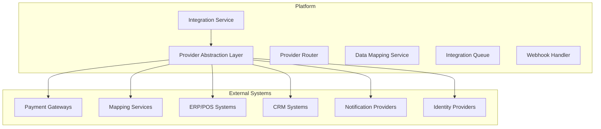

# Software Architecture Document (SAD)

## Integration Strategy

**Platform:** Nexus
**Version:** 1.0.0
**Status:** Final
**Date:** 2026-07-05
**Author:** Ahmed Abdullah Mohamed

---

## 1. Purpose

This document defines the integration strategy for the **Nexus** platform, including integration patterns, API management, and third-party integration approach.

---

## 2. Integration Principles

| Principle | Description |
| :--- | :--- |
| **API-First** | All integrations use well-defined APIs |
| **Decoupling** | Minimize direct dependencies between systems |
| **Asynchronous First** | Prefer event-driven communication where possible |
| **Resilience** | Handle failures gracefully with retries and circuit breakers |
| **Observability** | All integrations are monitored and logged |
| **Security** | All integrations use secure authentication and encryption |

---

## 3. Integration Patterns

| Pattern | Description | Used For |
| :--- | :--- | :--- |
| **API Gateway** | Single entry point for all API requests | All external integrations |
| **Event-Driven** | Asynchronous communication via events | Payment, Notification, Analytics |
| **Webhooks** | Outbound callbacks for events | Third-party integrations |
| **Anti-Corruption Layer** | Protect internal domains from external changes | ERP, POS, CRM integrations |
| **Circuit Breaker** | Prevent cascading failures | All external calls |
| **Idempotency** | Prevent duplicate operations | Payment processing |

---

## 4. Integration Architecture

---

## 5. Integration Patterns by System

### Payment Gateway Integration

| Pattern | Description | Implementation |
| :--- | :--- | :--- |
| **Provider Abstraction** | Unified interface for all payment providers | Payment Service |
| **Webhook Handling** | Process incoming payment events | Webhook Handler |
| **Idempotency** | Prevent duplicate payments | Idempotency Keys |
| **Fallback** | Automatic failover to secondary provider | Provider Router |
| **Retry** | Exponential backoff retry | Retry Engine |

### Mapping Services Integration

| Pattern | Description | Implementation |
| :--- | :--- | :--- |
| **Provider Abstraction** | Unified interface for mapping providers | Location Service |
| **Caching** | Cache geocode and distance results | Redis Cache |
| **Batching** | Batch geocoding and distance requests | Batch Processor |
| **Fallback** | Automatic failover to secondary provider | Provider Router |
| **Rate Limiting** | Respect provider rate limits | Rate Limiter |

### ERP/POS Integration

| Pattern | Description | Implementation |
| :--- | :--- | :--- |
| **Bidirectional Sync** | Sync data both ways | Sync Engine |
| **Conflict Resolution** | Handle data conflicts | Conflict Resolver |
| **Batch Processing** | Process large data sets | Batch Processor |
| **Error Handling** | Retry and error logging | Error Handler |
| **Data Mapping** | Map fields between systems | Data Mapper |

### CRM Integration

| Pattern | Description | Implementation |
| :--- | :--- | :--- |
| **Customer Sync** | Sync customer profiles | Sync Engine |
| **Event-Driven** | Sync on customer changes | Event Handler |
| **Webhook Handling** | Process CRM events | Webhook Handler |
| **Data Mapping** | Map fields between systems | Data Mapper |

---

## 6. Data Integration Patterns

| Pattern | Description | Use Case | Priority |
| :--- | :--- | :--- | :--- |
| **Request-Response** | Synchronous API calls | Payment authorization | Required |
| **Event-Driven** | Asynchronous events | Order lifecycle, notifications | Required |
| **Batch Processing** | Scheduled data sync | Settlement reconciliation | Required |
| **Streaming** | Real-time data flow | GPS location tracking | Required |

---

## 7. Error Handling Strategy

### Error Types

| Error Type | Handling | Retry |
| :--- | :--- | :--- |
| **Transient Failure** | Retry with exponential backoff | Yes |
| **Permanent Failure** | Log error, alert, manual intervention | No |
| **Timeout** | Retry with increased timeout | Yes |
| **Rate Limit** | Backoff and retry | Yes |
| **Validation Error** | Return error, fix data | No |
| **Authentication Error** | Refresh credentials, retry | Yes |

### Retry Policy

| Attempt | Delay | Backoff |
| :--- | :--- | :--- |
| 1 | 0 seconds | - |
| 2 | 5 seconds | 5s |
| 3 | 30 seconds | 6x |
| 4 | 5 minutes | 10x |
| 5 | 30 minutes | 6x |
| 6 | 2 hours | 4x |
| 7 | 6 hours | 3x |
| 8 | 24 hours | 4x |

### Circuit Breaker Configuration

| Parameter | Value |
| :--- | :--- |
| **Failure Threshold** | 50% |
| **Window Size** | 100 requests |
| **Half-Open Attempts** | 10 |
| **Open Duration** | 30 seconds |

---

## 8. Monitoring & Observability

### Integration Metrics

| Metric | Description | Alert Threshold |
| :--- | :--- | :--- |
| **Success Rate** | % of successful integrations | < 95% |
| **Latency (P95)** | Integration response time | > 5s |
| **Error Rate** | % of failed integrations | > 2% |
| **Retry Rate** | % requiring retry | > 10% |
| **Queue Depth** | Integration queue depth | > 1000 |

### Integration Dashboard

| Widget | Description |
| :--- | :--- |
| **Integration Status** | Status of all integrations |
| **Success Rate** | Success rate by integration |
| **Error Distribution** | Errors by type and integration |
| **Latency** | Latency by integration |
| **Queue Depth** | Current queue depth |
| **Retry Status** | Active retry status |

---

## 9. Version History

| Version | Date | Author | Changes |
| :--- | :--- | :--- | :--- |
| 1.0.0 | 2026-07-05 | Ahmed Abdullah Mohamed | Initial integration strategy |
