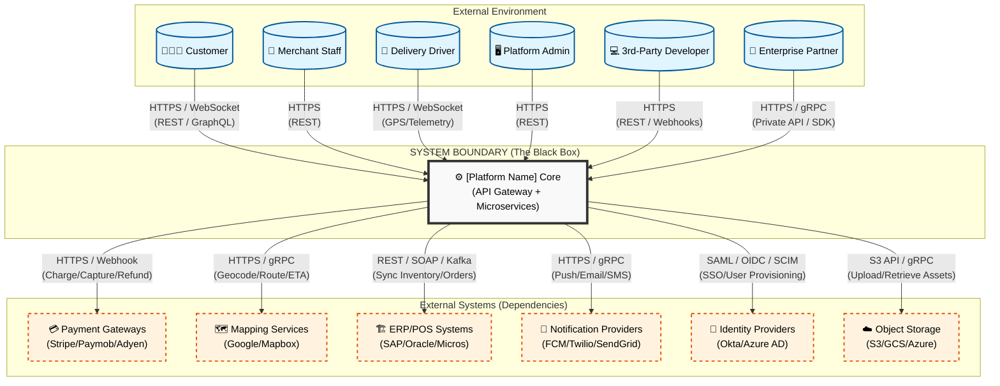

# Software Requirements Specification (SRS)

## Part 06: System Context Diagram

**Module:** Core Overview
**Version:** 1.0.0
**Status:** Final / For Review
**Date:** 2026-06-30

---

## 1. Purpose

The System Context Diagram (SCD) provides a high-level visual and textual representation of **[Platform Name]** and its relationships with external entities. It establishes the system boundaries, identifying:

- **External Actors:** The humans and automated systems that interact with the platform.
- **External Systems:** The third-party dependencies the platform relies upon.
- **Communication Protocols:** How data flows between the platform and the outside world.

This diagram serves as the foundational architecture artifact. Every microservice, API, and database defined in subsequent parts of the SRS must fit within the boundaries established here.

---

## 2. System Context Overview

**[Platform Name]** is an API-driven, cloud-native platform. It acts as a central orchestration engine for multi-sided commerce. The platform itself is depicted as a single "Black Box" (the **Core Platform**) to external observers, abstracting away the internal complexity of microservices, event buses, and data lakes.

All external interactions occur through the **Public API Gateway** or the **Internal Admin UI** (which consumes the same internal APIs).

---

## 3. External Actors (Human)

These are the human users who interact with the platform via its interfaces (Mobile Apps, Web Dashboards, or Admin Portals).

| Actor | Icon | Description | Primary Touchpoint (SRS Module) |
| :--- | :--- | :--- | :--- |
| **End Customer** | 🧑‍🤝‍🧑 | The consumer placing orders, tracking deliveries, and making payments. | Mobile App / PWA (Part 02) |
| **Merchant Staff** | 🏪 | The store manager or kitchen staff managing menus, accepting orders, and updating inventory. | Web Dashboard / KDS (Part 03) |
| **Delivery Driver** | 🛵 | The courier accepting deliveries, navigating routes, and completing drop-offs. | Mobile Driver App (Part 04) |
| **Platform Admin** | 🖥️ | Internal operations, finance, marketing, and support teams managing the ecosystem. | Admin Web Portal (Part 09) |
| **Third-Party Developer** | 💻 | External software engineers building apps on top of our APIs. | Developer Portal (Part 13) |
| **Enterprise Partner** | 🤝 | Large businesses integrating our White-Label SDKs or Bulk APIs. | Private APIs / SDKs (Part 13 & 16) |

---

## 4. External Systems (Machine / Dependencies)

These are the third-party services that the platform depends on for core functionality. The platform does not control these systems but consumes their APIs.

| External System | Description | Criticality | SRS Dependencies |
| :--- | :--- | :--- | :--- |
| **Payment Gateways** | Process payments, refunds, and subscription billing. (Stripe, Paymob, Adyen) | **Critical (Tier 0)** | Part 07B, Part 07E |
| **Mapping & Geocoding** | Provide location data, distance matrices, ETA calculation, and navigation. (Google Maps, Mapbox) | **Critical (Tier 0)** | Part 04C, Part 04F |
| **ERP / POS Systems** | Synchronize merchant inventory, menus, and sales. (SAP, Oracle, Micros, Square) | **High (Tier 1)** | Part 16C |
| **CRM Systems** | Synchronize customer profiles, loyalty, and marketing campaigns. (Salesforce, HubSpot) | **Medium (Tier 2)** | Part 16D |
| **Notification Providers** | Deliver push notifications, SMS, and transactional emails. (FCM, Twilio, SendGrid) | **High (Tier 1)** | Part 11 (Part 10B/C/D) |
| **Cloud Object Storage** | Store static assets (images, logos, receipts). (AWS S3, Azure Blob, GCS) | **Medium (Tier 2)** | Part 16 (Storage) |
| **Identity Providers (IdP)** | Enable Single Sign-On (SSO) for enterprise admins. (Okta, Azure AD) | **Medium (Tier 2)** | Part 10A, Part 16E |
| **Data Warehouse / BI** | Store and aggregate analytical data. (Snowflake, BigQuery, Redshift) | **Medium (Tier 2)** | Part 12 (Analytics) |
| **Monitoring / SIEM** | External logging, alerting, and security event management. (Datadog, Splunk, ELK) | **High (Tier 1)** | Part 14E (Observability) |
| **CDN** | Accelerate static content delivery (images, CSS, JS). (Cloudflare, Akamai) | **Medium (Tier 2)** | Infrastructure Layer |

---

## 5. System Context Diagram (Mermaid)

> *Note: This diagram represents the C4 Model Level 1 view (System Context). It shows the platform as the central entity, with all external actors and systems interacting via defined protocols.*

---

## 6. Communication Protocol Summary

This table details the technical standards governing the lines shown in the diagram.

| Interface | Direction | Protocol | Data Format | Key Characteristics |
| :--- | :--- | :--- | :--- | :--- |
| **Customer/Merchant/Driver Apps** | Inbound | HTTPS / WSS | JSON / Protobuf | RESTful APIs or GraphQL for queries; WebSockets for real-time GPS tracking. |
| **Public API / Developer SDKs** | Inbound | HTTPS | JSON | Versioned REST APIs (Part 13). Requires OAuth 2.1 or API Key. |
| **Webhooks (Outbound)** | Outbound | HTTPS | JSON | Async event delivery to partners (Order Created, Delivered). HMAC signed for security. |
| **Payment Gateway** | Outbound | HTTPS | JSON | Mutual TLS (mTLS) recommended for PCI compliance. Idempotency keys required. |
| **Mapping/Geocoding** | Outbound | HTTPS / gRPC | JSON / Protobuf | High throughput for bulk distance matrix calculations. |
| **ERP/POS Sync** | Bidirectional | HTTPS / Kafka | JSON / XML | Asynchronous event streaming for high-volume inventory updates. |
| **Identity Federation** | Outbound | HTTPS | SAML / OIDC | Standard SSO flows for enterprise admin users. |
| **Cloud Storage** | Outbound | HTTPS (S3 API) | Binary | Direct upload via presigned URLs to offload bandwidth. |

---

## 7. Data Flow (Key Interactions)

While the diagram shows static connections, this section highlights the *critical data flows* that drive the business.

1.  **Order Placement Flow:**
    - Customer → Platform (Order Request)
    - Platform → Payment (Authorization)
    - Platform → ERP/POS (Inventory Check / Hold)
    - Platform → Notification (Order Confirmation to Merchant/Customer)

2.  **Dispatch Flow:**
    - Driver → Platform (Live GPS Location)
    - Platform → Maps (Distance Matrix for nearby drivers)
    - Platform → Driver (Assignment Payload with optimized route)

3.  **Merchant Integration Flow (Bidirectional):**
    - ERP/POS → Platform (Menu/Price Sync)
    - Platform → ERP/POS (Order Sync, Settlement Data)

4.  **Settlement Flow:**
    - Platform → Payment (Capture Settlement)
    - Platform → Notification (Financial Report to Merchant/Driver)

---

## 8. Trust Boundaries (Security Zones)

The System Context Diagram defines three distinct trust zones that the security model must enforce (Part 10).

| Zone | Description | Security Controls |
| :--- | :--- | :--- |
| **Zone 1: Public Internet** | Actors (Customer, Driver, Developer) connecting from untrusted networks. | Strict HTTPS, TLS 1.3, CORS policies, Rate Limiting, WAF (Web Application Firewall). |
| **Zone 2: Demilitarized Zone (DMZ)** | The API Gateway layer. The only publicly exposed endpoint. | Authentication (JWT/API Key), Request Validation, DDoS Protection. |
| **Zone 3: Internal Corporate** | Admin users and internal network (Internal dashboards). | VPN / Zero-Trust Network Access (ZTNA), RBAC (Role-Based Access Control), MFA. |
| **Zone 4: Backend Infrastructure** | Microservices, Databases, and external dependencies. | Network policies (Kubernetes NetworkPolicies), mTLS (Service Mesh), Private Subnets, restricted outbound access (allowlists). |

> **Critical Principle:** The platform treats *all* incoming traffic (even from internal admins) as potentially hostile. The "Zero-Trust" principle applies across all zones.

---

## 9. Key Assumptions & Constraints

| # | Assumption / Constraint | Details |
| :--- | :--- | :--- |
| **SC-001** | **Internet Connectivity:** Assumes consistent 4G/5G/Wi-Fi availability for end-users. Offline mode is limited (e.g., caching menus) but not fully supported for transactional flows. |
| **SC-002** | **Third-Party SLA:** We assume external providers (Google Maps, Stripe) have uptime ≥ 99.95%. The platform must handle their failures gracefully (Circuit Breakers). |
| **SC-003** | **Data Residency:** Data must remain in specific geographical regions based on compliance. This context influences where external systems (like S3 buckets) are configured. |
| **SC-004** | **Rate Limits:** We are subject to the API rate limits of our external dependencies (e.g., Google Maps QPS limits). Internal queuing and caching are required to manage this. |
| **SC-005** | **Internal Network:** The CI/CD pipeline and monitoring stack (Prometheus/Grafana) are considered internal systems and are not shown here, but they are critical for supporting the platform's existence. |

---

## 10. Conclusion

The System Context Diagram clarifies **what the platform talks to** and **who uses it**. It defines the perimeter of the system.

By establishing this contract up front, we ensure:
- **Scalability:** We know the sources of load (Actors) and can design throttling accordingly.
- **Security:** We identify attack surfaces and trust boundaries early.
- **Resilience:** We identify critical dependencies (Tier 0) that require redundancy and fallback strategies.
- **Focus:** Engineers know exactly what is *inside* the boundary (microservices to be built) and what is *outside* (third-party services to integrate with).

Every subsequent document in the SRS—from the API specifications (Part 13) to the Infrastructure as Code (Part 14D)—must align with the boundaries and flows defined in this System Context Diagram.

---

**Next Document:**

`02_Customer_Module/Part_01A_Customer_User_Management.md`