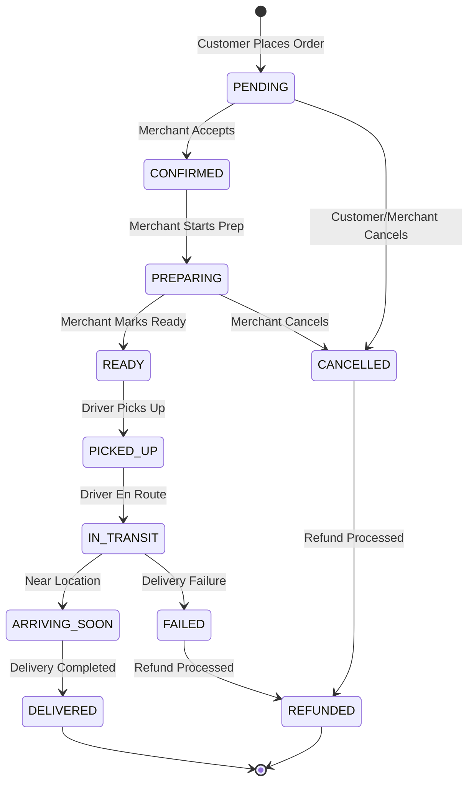

# Software Requirements Specification (SRS)

## Part 01B: Customer Order Management

**Module:** Customer Module (Part 02)
**Version:** 1.0.0
**Status:** Final / For Review
**Date:** 2026-06-30

---

## Chapter 1 – Overview

### Purpose

The Customer Order Management module governs the complete shopping and ordering experience for end consumers. This encompasses everything from discovering merchants and products, building a cart, and completing checkout, through to order tracking, history, and post-delivery feedback.

This module is the primary revenue engine of the platform. Every successful order represents the culmination of the customer's intent and the beginning of the fulfillment chain that engages merchants, drivers, and the dispatch system.

### Objectives

- Intuitive and fast product discovery (search, browse, recommendations)
- Frictionless cart and checkout experience
- Transparent order tracking and status visibility
- Robust order lifecycle management (state machine)
- Seamless integration with payments, dispatch, and merchant modules
- Post-purchase engagement (ratings, reordering, feedback)

---

## Chapter 2 – Product Discovery

### CUS-020 Merchant Discovery

The platform shall provide multiple ways for customers to discover merchants.

| Discovery Method | Description | Priority |
| :--- | :--- | :--- |
| **Search** | Free-text search by merchant name, cuisine, dish, or category. | **Required** |
| **Browse Categories** | Curated categories (e.g., Pizza, Sushi, Burgers, Grocery). | **Required** |
| **Nearby Merchants** | List merchants sorted by proximity to customer location. | **Required** |
| **Personalized Recommendations** | AI-driven suggestions based on order history, preferences, and trends. | **Required** |
| **Editorial Collections** | Curated lists (e.g., "New Restaurants", "Trending", "Hidden Gems"). | **Medium** |
| **Saved Favorites** | Quick access to previously ordered or bookmarked merchants. | **Medium** |
| **Search Suggestions** | Autocomplete with popular searches and merchant names. | **Required** |

### CUS-021 Search Capabilities

| Search Feature | Description |
| :--- | :--- |
| **Free-Text Search** | Support for partial matches, typos, and synonyms (elasticsearch/OpenSearch). |
| **Filtering** | Filter by cuisine, rating, delivery time, price range, dietary preferences (halal, vegan, gluten-free). |
| **Sorting** | Sort by relevance, rating, delivery time, popularity, distance. |
| **Location-Aware** | Results filtered to the customer's delivery zone. |
| **Real-Time Availability** | Show only merchants that are currently open and accepting orders. |
| **Faceted Search** | Drill down by multiple filters simultaneously. |

### CUS-022 Merchant Profile View

| Information Displayed | Description |
| :--- | :--- |
| **Merchant Name & Logo** | Brand identity. |
| **Cuisine Type** | Primary cuisine category. |
| **Rating & Review Count** | Aggregated customer feedback. |
| **Estimated Delivery Time** | Real-time ETA based on current conditions. |
| **Minimum Order Value** | Threshold for delivery (if applicable). |
| **Delivery Fee** | Current delivery charge for the location. |
| **Opening Hours** | Current operational status (Open/Closed). |
| **Categories/Menu** | Organized menu with items, descriptions, and prices. |
| **Popular Items** | Highlighted best-sellers. |
| **Promotions** | Active discounts or offers. |
| **Photo Gallery** | Images of the store and dishes. |

---

## Chapter 3 – Menu Browsing & Selection

### CUS-023 Menu Structure

| Element | Description |
| :--- | :--- |
| **Categories** | Logical grouping of menu items (e.g., "Appetizers", "Mains", "Desserts", "Beverages"). |
| **Menu Items** | Individual sellable products. |
| **Item Name** | Descriptive product name. |
| **Item Description** | Ingredients, preparation details, dietary tags. |
| **Item Price** | Current price in the customer's preferred currency. |
| **Item Image** | High-quality product photo. |
| **Dietary Tags** | Vegetarian, Vegan, Gluten-Free, Halal, etc. |
| **Add-Ons/Modifiers** | Customization options (e.g., "Extra Cheese", "No Onions", "Spice Level"). |
| **Availability** | In-stock / Out-of-stock (real-time). |
| **Popularity Badge** | "Best Seller" or "Popular" indicator. |
| **Prep Time** | Estimated preparation time for the item. |

### CUS-024 Menu Customization

Customers shall be able to customize menu items with modifiers:

| Modifier Type | Description | Example |
| :--- | :--- | :--- |
| **Radio (Single Select)** | Choose exactly one option. | "Size: Small/Medium/Large" |
| **Checkbox (Multi-Select)** | Choose any combination. | "Extra Cheese", "Extra Sauce" |
| **Quantity** | Specify number of servings. | "2x Chicken Wings" |
| **Free-Text** | Special instructions. | "No onions, please" |
| **Price Modifiers** | Some options may add or subtract from base price. | "+$2.00 for Extra Cheese" |

---

## Chapter 4 – Shopping Cart

### CUS-025 Cart Operations

| Operation | Description |
| :--- | :--- |
| **Add Item** | Add a menu item to the cart with selected modifiers. |
| **Update Quantity** | Increase or decrease item quantity. |
| **Remove Item** | Remove a specific item from the cart. |
| **Clear Cart** | Remove all items from the cart. |
| **View Cart** | Display all items with quantities, modifiers, and subtotal. |
| **Apply Promotion** | Enter promo code or apply automatic discount. |
| **Estimate Delivery** | Calculate delivery fee and total cost. |
| **Persist Cart** | Save cart across sessions (server-side persistence). |

### CUS-026 Cart Business Rules

| Rule | Description |
| :--- | :--- |
| **Single Merchant Rule** | Cart can only contain items from a single merchant. Adding items from another merchant clears the existing cart with confirmation. |
| **Minimum Order Value** | Display warning if cart total is below merchant's minimum order value. |
| **Availability Check** | Real-time validation that all items remain available at checkout. |
| **Price Update** | Cart reflects the latest prices (auto-update if merchant changes pricing). |
| **Promo Validation** | Promo codes validated for eligibility (minimum spend, merchant-specific, single-use). |
| **Cart Expiry** | Abandoned carts expire after 7 days (configurable). |

### CUS-027 Cart Data Model (Server-Side)

| Field | Type | Description |
| :--- | :--- | :--- |
| `cart_id` | UUID | Primary identifier |
| `customer_id` | UUID | Owner of the cart |
| `merchant_id` | UUID | Merchant associated with cart |
| `items` | JSON | Array of cart items with modifiers |
| `promo_code` | String | Applied promotion code (if any) |
| `discount_amount` | Decimal | Applied discount value |
| `subtotal` | Decimal | Total before fees and discounts |
| `delivery_fee` | Decimal | Calculated delivery fee |
| `total` | Decimal | Final total (subtotal - discount + delivery) |
| `status` | Enum | `ACTIVE`, `ABANDONED`, `CONVERTED` |
| `created_at` | Timestamp | Cart creation timestamp |
| `updated_at` | Timestamp | Last update timestamp |
| `expires_at` | Timestamp | Cart expiration timestamp |

---

## Chapter 5 – Checkout

### CUS-028 Checkout Flow

The checkout process shall be a multi-step wizard designed for clarity and conversion:

```
Step 1: Delivery Address
    ↓
Step 2: Delivery Time (ASAP or Scheduled)
    ↓
Step 3: Payment Method
    ↓
Step 4: Review & Confirm
    ↓
Step 5: Order Confirmation
```

### CUS-029 Delivery Address Selection

| Feature | Description |
| :--- | :--- |
| **Saved Addresses** | Select from saved address book (Part 01A). |
| **New Address** | Add new delivery address with geocoding validation. |
| **GPS Location** | Use current GPS location for nearest search. |
| **Address Validation** | Validate address against geocoding service (real-time). |
| **Delivery Zone Check** | Verify address is within merchant's delivery zone. |

### CUS-030 Delivery Time Options

| Option | Description |
| :--- | :--- |
| **ASAP** | Immediate delivery (estimated time shown). |
| **Scheduled** | Choose future date/time slot (if merchant supports). |
| **Time Slot Availability** | Show available time slots with merchant capacity. |
| **Estimated Delivery Window** | Display ETA for ASAP orders. |

### CUS-031 Payment Method Selection

| Feature | Description |
| :--- | :--- |
| **Saved Payment Methods** | Select from stored cards/digital wallets. |
| **New Payment Method** | Add new card or wallet. |
| **Cash on Delivery (COD)** | Available in select markets. |
| **Split Payment** | Not in MVP (future capability). |
| **Wallet Balance** | Use platform wallet balance (Part 01D). |

### CUS-032 Order Review & Confirmation

| Displayed Information | Description |
| :--- | :--- |
| **Order Items** | Itemized list with quantities, modifiers, and prices. |
| **Subtotal** | Sum of item prices. |
| **Delivery Fee** | Calculated delivery charge. |
| **Service Fee** | Platform service fee (if applicable). |
| **Tax** | Applicable tax (configurable per region). |
| **Discount** | Applied promo code discount. |
| **Total** | Final amount to be charged. |
| **Delivery Address** | Confirmation of delivery location. |
| **Delivery Time** | Estimated delivery time. |
| **Payment Method** | Confirmation of payment method. |

### CUS-033 Checkout Business Rules

| Rule | Description |
| :--- | :--- |
| **Availability Check** | Verify all items are still available before final submission. |
| **Price Validation** | Verify prices have not changed since cart creation. |
| **Minimum Order** | Validate against merchant's minimum order value. |
| **Promotion Validity** | Re-validate promo code at checkout. |
| **Payment Authorization** | Pre-authorize payment (not capture). |
| **Address Validation** | Ensure delivery address is within zone. |
| **Merchant Open Status** | Verify merchant is open for orders. |
| **Duplicate Order Prevention** | Prevent duplicate submissions (idempotency key). |

---

## Chapter 6 – Order Lifecycle

### CUS-034 Order Statuses

The order passes through the following states in its lifecycle:

| Status | Description | Visible To |
| :--- | :--- | :--- |
| `PENDING` | Order received, awaiting merchant confirmation. | Customer, Merchant |
| `CONFIRMED` | Merchant accepted the order. | Customer, Merchant |
| `PREPARING` | Merchant is preparing the food/items. | Customer, Merchant |
| `READY` | Order is ready for pickup by driver. | Customer, Merchant, Driver |
| `PICKED_UP` | Driver has picked up the order. | Customer, Merchant, Driver |
| `IN_TRANSIT` | Driver is en route to customer. | Customer, Driver |
| `ARRIVING_SOON` | Driver is within 2 minutes of delivery location. | Customer, Driver |
| `DELIVERED` | Order successfully delivered. | Customer, Merchant, Driver |
| `CANCELLED` | Order cancelled (by customer or merchant/platform). | Customer, Merchant, Admin |
| `REFUNDED` | Order refunded (full/partial). | Customer, Merchant, Admin |
| `FAILED` | Delivery failed (e.g., driver couldn't locate address). | Customer, Merchant, Admin |

### CUS-035 Order Status Transitions



### CUS-036 Order Timeline Events

Each order status change shall be recorded as a timeline event:

| Event | Timestamp | Description |
| :--- | :--- | :--- |
| `order_placed` | T0 | Customer confirmed order. |
| `order_confirmed` | T1 | Merchant confirmed (if auto-confirm, time is near T0). |
| `preparation_started` | T2 | Merchant started preparation. |
| `order_ready` | T3 | Merchant marked as ready. |
| `driver_assigned` | T3.5 | Driver assigned to pickup. |
| `order_picked_up` | T4 | Driver picked up order. |
| `in_transit` | T5 | Driver en route. |
| `arriving_soon` | T6 | Driver near destination. |
| `order_delivered` | T7 | Order delivered to customer. |

---

## Chapter 7 – Real-Time Order Tracking

### CUS-037 Tracking Features

| Feature | Description |
| :--- | :--- |
| **Live Map View** | GPS tracking of driver's location on a map. |
| **ETA Updates** | Real-time estimated arrival time updates. |
| **Status Timeline** | Chronological list of order milestones. |
| **Driver Information** | Driver name, photo, vehicle, and rating. |
| **Contact Driver** | In-app communication with driver (call/SMS). |
| **Push Notifications** | Real-time updates via push notifications. |
| **Estimated Arrival** | Dynamic ETA based on current traffic and location. |
| **Driver Route** | Visual display of driver's planned route. |

### CUS-038 Tracking Architecture

```
Customer App
    │ (WebSocket / SSE)
    ▼
Tracking Service
    │ (Kafka / Redis)
    ▼
Driver Location Updates
    │ (GPS from Driver App)
    ▼
Dispatch Service
    │
    ▼
Order Service (Status Updates)
```

### CUS-039 Tracking Data Model

| Field | Type | Description |
| :--- | :--- | :--- |
| `tracking_id` | UUID | Primary identifier |
| `order_id` | UUID | Associated order |
| `driver_id` | UUID | Assigned driver |
| `current_latitude` | Decimal | Current driver location |
| `current_longitude` | Decimal | Current driver location |
| `last_updated` | Timestamp | Last GPS update timestamp |
| `estimated_arrival` | Timestamp | Predicted arrival time |
| `distance_remaining` | Decimal | Distance to destination (meters) |
| `status` | Enum | `PENDING`, `PICKED_UP`, `IN_TRANSIT`, `ARRIVING_SOON`, `DELIVERED` |

---

## Chapter 8 – Order Management (Customer)

### CUS-040 Order History

| Feature | Description |
| :--- | :--- |
| **View All Orders** | Paginated list of historical orders. |
| **Filter** | Filter by status, date range, merchant. |
| **Search** | Search by merchant name or item. |
| **Order Details** | View full order details including items, prices, timeline. |
| **Re-order** | One-click reorder of previous order (with optional modifications). |
| **Download Receipt** | PDF/CSV receipt download. |

### CUS-041 Order Detail View

| Displayed Information | Description |
| :--- | :--- |
| **Order ID** | Unique order identifier. |
| **Order Status** | Current status with visual indicator. |
| **Timeline** | Chronological list of all status changes. |
| **Items** | Itemized list with quantities and prices. |
| **Payment Summary** | Subtotal, fees, tax, discount, total. |
| **Payment Method** | Masked payment method details. |
| **Delivery Address** | Complete delivery address. |
| **Merchant Information** | Merchant name, address, contact. |
| **Driver Information** | Driver name, photo, rating (if delivered). |
| **Estimated Delivery** | Original ETA and actual delivery time. |
| **Actions** | Re-order, Support, Rate/Review. |

### CUS-042 Order Cancellation

| Scenario | Policy |
| :--- | :--- |
| **Before Confirmation** | Customer may cancel without penalty. |
| **After Confirmation (Pre-Preparation)** | Customer may cancel; merchant approval required. |
| **During Preparation** | Customer cannot cancel; must contact support. |
| **After Ready/Picked-Up** | Customer cannot cancel; order is in fulfillment. |
| **Merchant Cancellation** | Order cancelled by merchant; automatic refund initiated. |
| **Platform Cancellation** | Admin-initiated cancellation for policy violations or operational issues. |

---

## Chapter 9 – Post-Delivery

### CUS-043 Ratings & Reviews

| Feature | Description |
| :--- | :--- |
| **Merchant Rating** | 1-5 star rating for the merchant. |
| **Review Text** | Optional text feedback. |
| **Driver Rating** | 1-5 star rating for the driver. |
| **Food Quality Rating** | 1-5 star rating for food quality. |
| **Delivery Experience** | 1-5 star rating for delivery experience. |
| **Photo Upload** | Upload photos of the received order. |
| **Moderation** | Admin review of flagged reviews. |

### CUS-044 Feedback & Support

| Feature | Description |
| :--- | :--- |
| **Report Issue** | Report missing items, wrong items, quality issues. |
| **Refund Request** | Initiate refund claim for issues. |
| **Contact Support** | Open support ticket (Part 09). |
| **Feedback Survey** | Optional post-delivery survey. |

### CUS-045 Re-Order

1.  User selects previous order from history.
2.  System recreates cart with identical items and modifiers.
3.  User reviews cart and makes modifications.
4.  User proceeds through standard checkout.
5.  Promotions that were valid at original order time may not apply (new validation).

---

## Chapter 10 – Scheduled Orders

### CUS-046 Scheduling Capabilities

| Feature | Description |
| :--- | :--- |
| **Advance Ordering** | Place orders for future date/time slots. |
| **Available Slots** | Display merchant availability (30-min intervals). |
| **Cutoff Time** | Orders must be placed X hours before scheduled time. |
| **Modification** | Modify scheduled order up to 2 hours before delivery. |
| **Cancellation** | Cancel scheduled order up to 2 hours before delivery. |
| **Repeating Orders** | Weekly/monthly recurring orders (future capability). |

### CUS-047 Scheduled Order Data Model

| Field | Type | Description |
| :--- | :--- | :--- |
| `scheduled_order_id` | UUID | Primary identifier |
| `order_id` | UUID | Associated order |
| `scheduled_time` | Timestamp | Requested delivery time |
| `time_slot` | String | e.g., "12:00-12:30" |
| `status` | Enum | `SCHEDULED`, `IN_PROGRESS`, `COMPLETED`, `CANCELLED` |
| `created_at` | Timestamp | Creation timestamp |
| `modified_at` | Timestamp | Last modification timestamp |

---

## Chapter 11 – Database Tables

### orders

| Column | Type | Constraints | Description |
| :--- | :--- | :--- | :--- |
| `order_id` | UUID | PRIMARY KEY | Unique order identifier |
| `customer_id` | UUID | FOREIGN KEY (customers.customer_id) | Customer who placed the order |
| `merchant_id` | UUID | FOREIGN KEY (merchants.merchant_id) | Merchant fulfilling the order |
| `driver_id` | UUID | FOREIGN KEY (drivers.driver_id) | Assigned driver (nullable) |
| `cart_id` | UUID | | Reference to cart at checkout |
| `order_reference` | VARCHAR(20) | UNIQUE, NOT NULL | Human-readable order number (e.g., "ORD-2024-001") |
| `status` | VARCHAR(20) | NOT NULL | Order status (state machine) |
| `items` | JSONB | NOT NULL | Snapshot of cart items at checkout |
| `subtotal` | DECIMAL(12, 2) | NOT NULL | Sum of item prices |
| `delivery_fee` | DECIMAL(12, 2) | DEFAULT 0 | Delivery charge |
| `service_fee` | DECIMAL(12, 2) | DEFAULT 0 | Platform service fee |
| `tax` | DECIMAL(12, 2) | DEFAULT 0 | Applicable tax |
| `discount` | DECIMAL(12, 2) | DEFAULT 0 | Promo code discount |
| `total` | DECIMAL(12, 2) | NOT NULL | Final total charged to customer |
| `currency` | VARCHAR(3) | NOT NULL | ISO 4217 currency code |
| `promo_code_id` | UUID | | Applied promotion (nullable) |
| `payment_method_id` | UUID | | Payment method used |
| `payment_status` | VARCHAR(20) | DEFAULT 'PENDING' | PENDING/AUTHORIZED/CAPTURED/REFUNDED/FAILED |
| `delivery_address` | JSONB | NOT NULL | Snapshot of delivery address |
| `customer_notes` | TEXT | | Customer-provided instructions |
| `is_scheduled` | BOOLEAN | DEFAULT FALSE | Scheduled order flag |
| `scheduled_time` | TIMESTAMP | | Requested delivery time |
| `estimated_prep_time` | INTEGER | | Estimated prep time in minutes |
| `estimated_delivery_time` | INTEGER | | Estimated delivery time in minutes |
| `actual_prep_time` | INTEGER | | Actual prep time in minutes |
| `actual_delivery_time` | INTEGER | | Actual delivery time in minutes |
| `idempotency_key` | VARCHAR(255) | UNIQUE | Prevent duplicate submissions |
| `created_at` | TIMESTAMP | DEFAULT NOW() | Order placement timestamp |
| `updated_at` | TIMESTAMP | DEFAULT NOW() | Last status update timestamp |
| `delivered_at` | TIMESTAMP | | Delivery completion timestamp |

### order_status_history

| Column | Type | Constraints | Description |
| :--- | :--- | :--- | :--- |
| `history_id` | UUID | PRIMARY KEY | Unique history entry |
| `order_id` | UUID | FOREIGN KEY (orders.order_id) | Associated order |
| `status` | VARCHAR(20) | NOT NULL | Status at this point |
| `source` | VARCHAR(20) | NOT NULL | customer/merchant/driver/system/admin |
| `reason` | TEXT | | Optional reason for status change |
| `metadata` | JSONB | | Additional context (e.g., location, timestamps) |
| `created_at` | TIMESTAMP | DEFAULT NOW() | When status was recorded |

### order_reviews

| Column | Type | Constraints | Description |
| :--- | :--- | :--- | :--- |
| `review_id` | UUID | PRIMARY KEY | Unique review identifier |
| `order_id` | UUID | UNIQUE, FOREIGN KEY (orders.order_id) | Associated order (one review per order) |
| `customer_id` | UUID | FOREIGN KEY (customers.customer_id) | Reviewer customer |
| `merchant_rating` | INTEGER | CHECK (1-5) | Merchant star rating |
| `driver_rating` | INTEGER | CHECK (1-5) | Driver star rating |
| `food_quality_rating` | INTEGER | CHECK (1-5) | Food quality rating |
| `delivery_rating` | INTEGER | CHECK (1-5) | Delivery experience rating |
| `review_text` | TEXT | | Written review |
| `photos` | TEXT[] | | Array of photo URLs (CDN) |
| `is_public` | BOOLEAN | DEFAULT TRUE | Visibility toggle |
| `is_flagged` | BOOLEAN | DEFAULT FALSE | Moderator flagged content |
| `created_at` | TIMESTAMP | DEFAULT NOW() | Review submission timestamp |
| `updated_at` | TIMESTAMP | DEFAULT NOW() | Last update timestamp |

### carts

| Column | Type | Constraints | Description |
| :--- | :--- | :--- | :--- |
| `cart_id` | UUID | PRIMARY KEY | Unique cart identifier |
| `customer_id` | UUID | FOREIGN KEY (customers.customer_id) | Cart owner |
| `merchant_id` | UUID | FOREIGN KEY (merchants.merchant_id) | Associated merchant |
| `items` | JSONB | NOT NULL | Array of cart items |
| `promo_code_id` | UUID | | Applied promotion |
| `discount_amount` | DECIMAL(12, 2) | DEFAULT 0 | Calculated discount |
| `subtotal` | DECIMAL(12, 2) | DEFAULT 0 | Sum of items |
| `delivery_fee` | DECIMAL(12, 2) | DEFAULT 0 | Calculated delivery fee |
| `total` | DECIMAL(12, 2) | DEFAULT 0 | Final total |
| `status` | VARCHAR(20) | DEFAULT 'ACTIVE' | ACTIVE/ABANDONED/CONVERTED |
| `created_at` | TIMESTAMP | DEFAULT NOW() | Cart creation timestamp |
| `updated_at` | TIMESTAMP | DEFAULT NOW() | Last update timestamp |
| `expires_at` | TIMESTAMP | | Cart expiration timestamp |

### scheduled_orders

| Column | Type | Constraints | Description |
| :--- | :--- | :--- | :--- |
| `scheduled_id` | UUID | PRIMARY KEY | Unique scheduled order identifier |
| `order_id` | UUID | UNIQUE, FOREIGN KEY (orders.order_id) | Associated order |
| `customer_id` | UUID | FOREIGN KEY (customers.customer_id) | Customer who scheduled |
| `scheduled_time` | TIMESTAMP | NOT NULL | Requested delivery time |
| `time_slot` | VARCHAR(20) | | Time slot label |
| `status` | VARCHAR(20) | DEFAULT 'SCHEDULED' | SCHEDULED/IN_PROGRESS/COMPLETED/CANCELLED |
| `notified_reminder` | BOOLEAN | DEFAULT FALSE | Reminder notification sent |
| `created_at` | TIMESTAMP | DEFAULT NOW() | Creation timestamp |
| `modified_at` | TIMESTAMP | DEFAULT NOW() | Last modification timestamp |
| `cancelled_at` | TIMESTAMP | | Cancellation timestamp |

---

## Chapter 12 – REST APIs

### Search & Discovery APIs

| Method | Endpoint | Description |
| :--- | :--- | :--- |
| `GET` | `/api/v1/merchants/search` | Search merchants with query parameters |
| `GET` | `/api/v1/merchants/nearby` | Get merchants near location |
| `GET` | `/api/v1/merchants/{id}` | Get merchant profile details |
| `GET` | `/api/v1/merchants/{id}/menu` | Get merchant menu with categories and items |
| `GET` | `/api/v1/categories` | List all categories |
| `GET` | `/api/v1/search/suggestions` | Autocomplete search suggestions |

### Cart APIs

| Method | Endpoint | Description |
| :--- | :--- | :--- |
| `GET` | `/api/v1/cart` | Get current cart |
| `POST` | `/api/v1/cart/items` | Add item to cart |
| `PUT` | `/api/v1/cart/items/{id}` | Update item quantity |
| `DELETE` | `/api/v1/cart/items/{id}` | Remove item from cart |
| `DELETE` | `/api/v1/cart` | Clear cart |
| `POST` | `/api/v1/cart/promo` | Apply promo code |
| `DELETE` | `/api/v1/cart/promo` | Remove promo code |
| `GET` | `/api/v1/cart/estimate` | Get cost estimate (delivery fee, total) |

### Checkout & Order APIs

| Method | Endpoint | Description |
| :--- | :--- | :--- |
| `POST` | `/api/v1/checkout` | Place order (checkout) |
| `GET` | `/api/v1/checkout/availability` | Check merchant availability for time slot |
| `GET` | `/api/v1/orders` | List customer's orders (paginated) |
| `GET` | `/api/v1/orders/{id}` | Get order details |
| `GET` | `/api/v1/orders/{id}/status` | Get current order status |
| `GET` | `/api/v1/orders/{id}/timeline` | Get order timeline events |
| `DELETE` | `/api/v1/orders/{id}` | Cancel order (conditions apply) |
| `POST` | `/api/v1/orders/{id}/reorder` | Recreate cart from previous order |
| `PUT` | `/api/v1/orders/{id}/scheduled` | Update scheduled time |
| `DELETE` | `/api/v1/orders/{id}/scheduled` | Cancel scheduled order |

### Tracking APIs

| Method | Endpoint | Description |
| :--- | :--- | :--- |
| `GET` | `/api/v1/orders/{id}/tracking` | Get real-time tracking information |
| `GET` | `/api/v1/orders/{id}/tracking/websocket` | WebSocket endpoint for live updates |

### Review APIs

| Method | Endpoint | Description |
| :--- | :--- | :--- |
| `POST` | `/api/v1/orders/{id}/review` | Submit order review |
| `GET` | `/api/v1/orders/{id}/review` | Get review for order |
| `PUT` | `/api/v1/orders/{id}/review` | Update review |
| `DELETE` | `/api/v1/orders/{id}/review` | Delete review |

---

## Chapter 13 – Business Rules

| Rule ID | Rule Description | Priority |
| :--- | :--- | :--- |
| **BR-ORD-001** | Cart can contain items from only one merchant at a time. | **High** |
| **BR-ORD-002** | Orders must meet merchant's minimum order value to be placed. | **High** |
| **BR-ORD-003** | All items in an order must be available at checkout. | **High** |
| **BR-ORD-004** | Promo codes must be validated for eligibility and expiration. | **High** |
| **BR-ORD-005** | Orders cannot be placed if merchant is closed. | **High** |
| **BR-ORD-006** | Delivery addresses must be within the merchant's delivery zone. | **High** |
| **BR-ORD-007** | Each order requires a unique idempotency key to prevent duplicates. | **High** |
| **BR-ORD-008** | Orders in `PENDING` status can be cancelled by the customer. | **High** |
| **BR-ORD-009** | Orders in `CONFIRMED` or `PREPARING` status require merchant approval for cancellation. | **High** |
| **BR-ORD-010** | Cancellations after `READY` status are not permitted (customer must contact support). | **High** |
| **BR-ORD-011** | Reviews can only be submitted after order is `DELIVERED`. | **High** |
| **BR-ORD-012** | Scheduled orders must be placed at least 2 hours before delivery (configurable). | **Medium** |
| **BR-ORD-013** | Abandoned carts expire after 7 days. | **Medium** |
| **BR-ORD-014** | Customers may rate merchants and drivers once per order. | **Medium** |
| **BR-ORD-015** | Reordering uses current menu prices, not historical prices. | **Medium** |

---

## Chapter 14 – Acceptance Tests

| Test ID | Test Description | Priority |
| :--- | :--- | :--- |
| **TEST-ORD-001** | Search for merchants by name and view results. | **High** |
| **TEST-ORD-002** | Filter merchants by cuisine and rating. | **High** |
| **TEST-ORD-003** | View merchant menu with categories and item details. | **High** |
| **TEST-ORD-004** | Add item to cart with modifiers and see cart update. | **High** |
| **TEST-ORD-005** | Update quantity of cart item. | **High** |
| **TEST-ORD-006** | Remove item from cart. | **High** |
| **TEST-ORD-007** | Apply valid promo code to cart and see discount applied. | **High** |
| **TEST-ORD-008** | Try applying invalid/expired promo code (error message). | **High** |
| **TEST-ORD-009** | Add items from different merchants to cart (clear confirmation). | **High** |
| **TEST-ORD-010** | Place order with saved address and payment method. | **High** |
| **TEST-ORD-011** | Place order with new address (geocoding validation). | **High** |
| **TEST-ORD-012** | Place order with COD payment method. | **High** |
| **TEST-ORD-013** | Place scheduled order for future time slot. | **High** |
| **TEST-ORD-014** | View order confirmation with order ID and timeline. | **High** |
| **TEST-ORD-015** | View order status and timeline progress in real-time. | **High** |
| **TEST-ORD-016** | Cancel order before merchant confirmation. | **High** |
| **TEST-ORD-017** | Attempt cancellation after order is in preparation (error). | **High** |
| **TEST-ORD-018** | View order history with filtering and pagination. | **High** |
| **TEST-ORD-019** | View detailed order information including items and payment. | **High** |
| **TEST-ORD-020** | Reorder previous order and verify cart is recreated. | **High** |
| **TEST-ORD-021** | Submit merchant review after delivery. | **High** |
| **TEST-ORD-022** | Submit driver rating after delivery. | **High** |
| **TEST-ORD-023** | Track driver location on live map. | **High** |
| **TEST-ORD-024** | Receive push notifications at order milestones. | **High** |
| **TEST-ORD-025** | Update scheduled order time before cutoff. | **High** |
| **TEST-ORD-026** | Cancel scheduled order before cutoff. | **High** |
| **TEST-ORD-027** | Verify duplicate order protection (idempotency). | **High** |
| **TEST-ORD-028** | Report issue with order (missing/wrong items). | **Medium** |

---

## Chapter 15 – Traceability Matrix

| Requirement | Database Table | API Endpoint(s) | Acceptance Test |
| :--- | :--- | :--- | :--- |
| CUS-020 | merchants | GET /api/v1/merchants/search | TEST-ORD-001, TEST-ORD-002 |
| CUS-022 | merchants | GET /api/v1/merchants/{id} | TEST-ORD-003 |
| CUS-025 | carts | POST/GET/PUT/DELETE /api/v1/cart/* | TEST-ORD-004, TEST-ORD-005, TEST-ORD-006 |
| CUS-026 | carts | POST/DELETE /api/v1/cart/promo | TEST-ORD-007, TEST-ORD-008 |
| CUS-029 | orders | POST /api/v1/checkout | TEST-ORD-010, TEST-ORD-011, TEST-ORD-012 |
| CUS-034 | orders, order_status_history | GET /api/v1/orders/{id}/status | TEST-ORD-014, TEST-ORD-015 |
| CUS-035 | order_status_history | Internal (state machine) | TEST-ORD-014, TEST-ORD-015 |
| CUS-038 | orders | GET /api/v1/orders/{id}/tracking | TEST-ORD-023 |
| CUS-040 | orders | GET /api/v1/orders | TEST-ORD-018, TEST-ORD-019 |
| CUS-042 | orders | DELETE /api/v1/orders/{id} | TEST-ORD-016, TEST-ORD-017 |
| CUS-045 | carts | POST /api/v1/orders/{id}/reorder | TEST-ORD-020 |
| CUS-043 | order_reviews | POST /api/v1/orders/{id}/review | TEST-ORD-021, TEST-ORD-022 |
| CUS-044 | orders | POST /api/v1/orders/{id}/issue | TEST-ORD-028 |
| CUS-046 | scheduled_orders | POST /api/v1/checkout (scheduled) | TEST-ORD-013, TEST-ORD-025, TEST-ORD-026 |

---

## Chapter 16 – Summary

This document establishes the complete customer order management capability for the **[Platform Name]** platform. Key takeaways:

- **Comprehensive Discovery:** Multi-faceted search, filtering, and recommendations enable customers to find what they want quickly.
- **Frictionless Cart & Checkout:** Intuitive cart management with real-time validation and a streamlined multi-step checkout.
- **Complete Order Lifecycle:** Well-defined state machine with clear transitions and timeline visibility.
- **Real-Time Tracking:** Live GPS tracking with push notifications keeps customers informed throughout the delivery journey.
- **Post-Purchase Engagement:** Ratings, reviews, and reorder functionality drive retention and platform improvement.
- **Flexible Scheduling:** Support for immediate and scheduled orders to accommodate diverse customer needs.

This module is the revenue engine of the platform. Every other module—merchant operations, dispatch, driver management, payments—is designed to serve the orders generated here.

---

**Next Document:**

`Part_01C_Customer_Delivery_Experience.md`

*(This builds on order management to detail the real-time delivery experience, including tracking, driver communication, and delivery completion.)*
