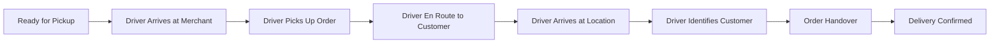

# Software Requirements Specification (SRS)

## Part 01C: Customer Delivery Experience

**Module:** Customer Module (Part 02)
**Version:** 1.0.0
**Status:** Final / For Review
**Date:** 2026-06-30

---

## Chapter 1 – Overview

### Purpose

The Customer Delivery Experience module governs the real-time journey of an order from the moment a driver is assigned through to successful delivery at the customer's doorstep. This is the most emotionally charged phase of the customer journey—anticipation, visibility, and trust are built or broken here.

This module defines the requirements for live tracking, driver-customer communication, delivery confirmation, and exception handling during the final mile. It represents the primary point of differentiation between **[Platform Name]** and competitors, as superior delivery experiences directly correlate with customer retention and Net Promoter Score (NPS).

### Objectives

- Provide real-time, accurate visibility into delivery status and ETA
- Enable seamless communication between customers and drivers
- Ensure successful, frictionless delivery completion
- Handle delivery exceptions gracefully (missed deliveries, incorrect addresses)
- Collect delivery feedback to improve future experiences

---

## Chapter 2 – Real-Time Delivery Tracking

### CUS-048 Live Map Tracking

The platform shall provide real-time visual tracking of the delivery driver on an interactive map.

| Feature | Description |
| :--- | :--- |
| **Driver Location** | Real-time GPS position of the driver displayed on a map. |
| **Route Visualization** | Planned route from merchant to customer, with actual path highlighted. |
| **ETA Countdown** | Dynamic estimated time of arrival with real-time recalculation. |
| **Status Badge** | Visual indicator of current status (e.g., "Picked Up", "En Route", "Arriving Soon"). |
| **Merchant Location** | Pin showing the merchant's store location (for pickup confirmation). |
| **Customer Location** | Pin showing the delivery destination. |
| **Zoom Controls** | Pinch/zoom to inspect route and surroundings. |
| **Refresh Rate** | Location updates every 3-5 seconds during active delivery. |

### CUS-049 Map Integration Requirements

| Requirement | Description |
| :--- | :--- |
| **Map Provider** | Integration with Google Maps, Mapbox, or equivalent (Part 16B). |
| **Offline Caching** | Basic map tiles cached for areas with poor connectivity. |
| **Satellite View** | Optional satellite view for better navigation context. |
| **Traffic Layer** | Real-time traffic overlay for understanding ETAs. |
| **Night Mode** | Map adapted for low-light conditions. |

### CUS-050 Estimated Time of Arrival (ETA)

The ETA calculation shall consider multiple factors to provide accurate predictions:

| Factor | Description |
| :--- | :--- |
| **Distance** | Remaining distance from driver to customer. |
| **Traffic Conditions** | Real-time traffic data from mapping provider. |
| **Time of Day** | Historical traffic patterns for the specific time. |
| **Weather** | Current weather conditions affecting driving speed. |
| **Route Type** | Highway vs. city streets vs. pedestrian-only areas. |
| **Driver Performance** | Historical speed patterns of the specific driver. |
| **Parking Time** | Estimated time to find parking at destination. |

**ETA Display Format:** "Arriving in approximately 8-12 minutes" (range to account for uncertainty).

---

## Chapter 3 – Driver-Customer Communication

### CUS-051 In-App Communication

| Feature | Description |
| :--- | :--- |
| **In-App Chat** | Real-time text chat between customer and driver. |
| **Voice Call** | Masked phone number for voice calls (privacy-preserving). |
| **Pre-Set Messages** | Quick messages for common scenarios (e.g., "I'm here", "Please wait"). |
| **Call Masking** | Both parties see a temporary platform number, not the actual phone number. |
| **Call Logging** | Call duration and time logged (not content). |
| **Chat Persistence** | Chat history available for the duration of the delivery. |
| **Language Translation** | Optional translation for cross-language communication (future). |

### CUS-052 Communication Use Cases

| Scenario | Recommended Communication |
| :--- | :--- |
| **Driver Arrived at Merchant** | Driver sends "Arrived at restaurant" (auto or manual). |
| **Driver Waiting for Order** | Driver sends "Waiting for order to be ready" (if delay). |
| **Driver En Route** | Driver sends "On my way!" (auto). |
| **Driver Near Destination** | Driver sends "Arriving in 2 minutes" (auto). |
| **Driver Cannot Find Address** | Customer provides directions/instructions. |
| **Customer Needs to Delay** | Customer messages driver about delay. |
| **Driver Has Issue** | Driver reports issue (e.g., gate code not working). |

### CUS-053 Driver Profile Visibility

During the delivery, the customer shall see the following driver information:

| Information | Description |
| :--- | :--- |
| **Driver Name** | First name and last initial for privacy. |
| **Driver Photo** | Profile photo for identification. |
| **Vehicle Details** | Vehicle type, make, model, color, license plate. |
| **Driver Rating** | Average rating from previous deliveries. |
| **Total Deliveries** | Total number of deliveries completed. |
| **Languages Spoken** | Languages the driver speaks (if relevant). |

---

## Chapter 4 – Delivery Process

### CUS-054 Delivery Stages

### CUS-055 Delivery Confirmation Methods

| Method | Description | Priority |
| :--- | :--- | :--- |
| **QR Code Scanning** | Customer scans driver's QR code or vice versa. | **Required** |
| **OTP (One-Time Password)** | Driver enters OTP provided to customer. | **Required** |
| **Photo Confirmation** | Driver takes photo of delivered order at door. | **Required** |
| **GPS Verification** | Driver must be within 50m of delivery address to confirm. | **Required** |
| **Signature (Digital)** | Customer signs on driver's device (legacy/regulatory). | **Optional** |
| **Voice Confirmation** | "I have received my order" (voice recognition). | **Future** |

### CUS-056 QR Code Delivery Flow

1.  Driver arrives at delivery location.
2.  Customer opens the app and navigates to order tracking.
3.  A unique, time-sensitive QR code is displayed for the order.
4.  Driver scans the QR code using the driver app's camera.
5.  System validates the QR code (correct order, not expired).
6.  Upon successful validation, delivery is confirmed.
7.  Order status transitions to `DELIVERED`.
8.  Both parties receive confirmation.

### CUS-057 OTP Delivery Flow

1.  Driver arrives at delivery location.
2.  Customer receives a 4-6 digit OTP via push notification/SMS.
3.  Customer verbally provides the OTP to the driver.
4.  Driver enters OTP into the driver app.
5.  System validates the OTP.
6.  Upon success, delivery is confirmed.
7.  Order status transitions to `DELIVERED`.

### CUS-058 Photo Confirmation Flow

1.  Driver arrives at delivery location.
2.  Driver takes a photo of the delivered order (at the door).
3.  Optionally includes a photo of the door/house number.
4.  Photo is uploaded to the platform (CDN) and associated with the order.
5.  Customer can view the photo in their order history.
6.  Photo provides evidence in case of disputes ("Order not delivered").

### CUS-059 Contactless Delivery

| Feature | Description |
| :--- | :--- |
| **Drop-off Instruction** | Customer specifies: "Leave at door", "Leave with reception", etc. |
| **Photo Proof** | Driver uploads photo of dropped order. |
| **Touchless Verification** | QR code/OTP verification without physical handoff. |
| **Default Preference** | Customer can set contactless as default in profile settings. |

---

## Chapter 5 – Delivery Exceptions & Issue Handling

### CUS-060 Failed Delivery Scenarios

| Scenario | Description | Mitigation Flow |
| :--- | :--- | :--- |
| **Customer Not Reachable** | Driver cannot reach customer by phone/chat. | Driver waits 5 minutes, attempts contact, escalates to support. |
| **Wrong Address** | Address is incorrect or incomplete. | Driver contacts customer for correction; support may escalate. |
| **Customer Not Home** | Customer is not at the address. | Driver attempts contact; if unavailable, order returned to merchant. |
| **Address Unclear** | Building number/gate code missing. | Driver contacts customer for instructions. |
| **Security Issue** | Driver feels unsafe at location. | Driver cancels delivery, returns to merchant. |
| **Order Damaged** | Order is damaged during transit. | Driver reports damage; customer notified; refund/replacement offered. |
| **Wrong Order** | Driver realizes order is incorrect. | Driver contacts support; appropriate resolution. |

### CUS-061 Driver Waiting Policy

| Stage | Waiting Period | Action |
| :--- | :--- | :--- |
| **At Merchant (Ready)** | 10 minutes | Driver waits; if order not ready, may leave and return. |
| **At Customer Location** | 5 minutes | Driver attempts contact; if unreachable, support escalation. |
| **At Customer Location (Contactless)** | 2 minutes | Drop and confirm; no waiting required. |

### CUS-062 Undelivered Order Escalation

1.  Driver attempts delivery and fails (per scenario above).
2.  Driver marks order as `FAILED_DELIVERY` in driver app.
3.  System notifies customer via push notification and email.
4.  Customer has options:
    - Reschedule delivery (if possible).
    - Cancel order and request refund.
    - Contact support for assistance.
5.  Support team investigates and resolves.
6.  Order status transitions to `CANCELLED` or `REFUNDED`.

### CUS-063 Dispute Management

| Dispute Type | Resolution Path |
| :--- | :--- |
| **Order Not Delivered** | Customer claims they didn't receive order. Driver photo evidence reviewed. Refund if unsubstantiated. |
| **Missing Items** | Customer reports items missing. Merchant review of packing checklist. Partial refund. |
| **Wrong Items** | Customer received incorrect items. Refund/redelivery. |
| **Order Damaged** | Customer reports damaged items. Photo evidence. Refund/redelivery. |
| **Driver Misconduct** | Customer reports inappropriate driver behavior. Investigation, potential driver suspension. |
| **Delay Compensation** | Customer complains about excessive delay. Platform may offer compensation (voucher/discount). |

---

## Chapter 6 – Delivery Analytics

### CUS-064 Delivery Metrics

The platform shall track and report on delivery performance metrics:

| Metric | Description | Target |
| :--- | :--- | :--- |
| **On-Time Delivery Rate** | Percentage of orders delivered within ETA window. | > 95% |
| **Average Delivery Time** | Average time from order placement to delivery. | < 30 minutes |
| **Driver Arrival Time at Merchant** | Time from assignment to arrival. | < 10 minutes |
| **Customer Wait Time at Door** | Time from driver arrival to handoff. | < 2 minutes |
| **Failed Delivery Rate** | Percentage of orders undelivered on first attempt. | < 2% |
| **Contactless Delivery Rate** | Percentage of deliveries completed contactless. | > 40% |
| **Customer Satisfaction (Delivery)** | Post-delivery rating for delivery experience. | > 4.5/5 |
| **Communication Response Time** | Average time for driver to respond to customer. | < 60 seconds |

### CUS-065 Customer Feedback Collection

| Timing | Feedback Type | Method |
| :--- | :--- | :--- |
| **Immediate (Post-Delivery)** | Quick rating (1-5 stars) for delivery. | In-app push notification. |
| **Next Session** | Detailed review of delivery experience. | App screen on next login. |
| **Email Follow-up** | Survey link sent 24 hours post-delivery. | Automated email. |
| **In-App Prompt** | "How was your delivery experience?" | Optional pop-up. |

---

## Chapter 7 – Customer Delivery Preferences

### CUS-066 Delivery Preferences

Customers shall be able to set and update delivery preferences in their profile:

| Preference | Options | Description |
| :--- | :--- | :--- |
| **Default Delivery Instructions** | Free text | Instructions for all deliveries (e.g., "Gate code: 1234"). |
| **Contactless Default** | Yes/No | Prefer contactless delivery for all orders. |
| **Ring Doorbell** | Yes/No | Whether driver should ring the doorbell. |
| **Notification Preferences** | Push/SMS/Email | Channels for delivery notifications. |
| **Preferred Time Slots** | Selected time slots | Preferred delivery times (for scheduled orders). |

---

## Chapter 8 – Database Tables

### deliveries

| Column | Type | Constraints | Description |
| :--- | :--- | :--- | :--- |
| `delivery_id` | UUID | PRIMARY KEY | Unique delivery identifier |
| `order_id` | UUID | UNIQUE, FOREIGN KEY (orders.order_id) | Associated order (one delivery per order) |
| `driver_id` | UUID | FOREIGN KEY (drivers.driver_id) | Assigned driver |
| `status` | VARCHAR(20) | NOT NULL | ASSIGNED/PICKED_UP/IN_TRANSIT/ARRIVING/COMPLETED/FAILED |
| `assigned_at` | TIMESTAMP | | Driver assignment timestamp |
| `picked_up_at` | TIMESTAMP | | Driver pickup timestamp |
| `in_transit_at` | TIMESTAMP | | Start of transit timestamp |
| `arriving_soon_at` | TIMESTAMP | | Within 2-minute ETA timestamp |
| `delivered_at` | TIMESTAMP | | Delivery completion timestamp |
| `failed_at` | TIMESTAMP | | Delivery failure timestamp |
| `failure_reason` | VARCHAR(50) | | Reason for delivery failure |
| `qr_code` | VARCHAR(100) | | QR code for delivery verification |
| `otp_code` | VARCHAR(10) | | OTP for delivery verification (encrypted) |
| `verification_method` | VARCHAR(20) | | QR/OTP/PHOTO/GPS/SIGNATURE |
| `verification_status` | VARCHAR(20) | DEFAULT 'PENDING' | PENDING/VERIFIED/FAILED |
| `customer_contacted` | BOOLEAN | DEFAULT FALSE | Whether driver contacted customer |
| `instructions_used` | TEXT | | Delivery instructions applied |
| `route_data` | JSONB | | Encoded route polyline |
| `total_distance` | DECIMAL(10, 2) | | Total distance driven (km) |
| `total_time` | INTEGER | | Total time from pickup to delivery (seconds) |
| `created_at` | TIMESTAMP | DEFAULT NOW() | Delivery record creation timestamp |
| `updated_at` | TIMESTAMP | DEFAULT NOW() | Last update timestamp |

### delivery_location_history

| Column | Type | Constraints | Description |
| :--- | :--- | :--- | :--- |
| `history_id` | UUID | PRIMARY KEY | Unique location history entry |
| `delivery_id` | UUID | FOREIGN KEY (deliveries.delivery_id) | Associated delivery |
| `latitude` | DECIMAL(10, 8) | NOT NULL | GPS latitude |
| `longitude` | DECIMAL(11, 8) | NOT NULL | GPS longitude |
| `accuracy` | DECIMAL(5, 2) | | GPS accuracy (meters) |
| `speed` | DECIMAL(5, 2) | | Speed (km/h) |
| `heading` | DECIMAL(5, 2) | | Heading direction (degrees) |
| `recorded_at` | TIMESTAMP | DEFAULT NOW() | When location was recorded |
| `created_at` | TIMESTAMP | DEFAULT NOW() | Record creation timestamp |

### delivery_communications

| Column | Type | Constraints | Description |
| :--- | :--- | :--- | :--- |
| `communication_id` | UUID | PRIMARY KEY | Unique communication identifier |
| `delivery_id` | UUID | FOREIGN KEY (deliveries.delivery_id) | Associated delivery |
| `sender_type` | VARCHAR(10) | NOT NULL | customer/driver/system |
| `sender_id` | UUID | | Customer or driver identifier |
| `message_type` | VARCHAR(20) | NOT NULL | text/image/audio/call |
| `message_content` | TEXT | | Message content (encrypted if PII) |
| `content_url` | VARCHAR(500) | | URL for media content |
| `is_read` | BOOLEAN | DEFAULT FALSE | Read receipt |
| `read_at` | TIMESTAMP | | When message was read |
| `created_at` | TIMESTAMP | DEFAULT NOW() | Message creation timestamp |

### delivery_photos

| Column | Type | Constraints | Description |
| :--- | :--- | :--- | :--- |
| `photo_id` | UUID | PRIMARY KEY | Unique photo identifier |
| `delivery_id` | UUID | FOREIGN KEY (deliveries.delivery_id) | Associated delivery |
| `photo_url` | VARCHAR(500) | NOT NULL | CDN URL for the photo |
| `photo_type` | VARCHAR(20) | NOT NULL | delivery_proof/order_damage/address_verification |
| `latitude` | DECIMAL(10, 8) | | GPS coordinates at photo capture |
| `longitude` | DECIMAL(11, 8) | | GPS coordinates at photo capture |
| `uploaded_at` | TIMESTAMP | DEFAULT NOW() | Photo upload timestamp |
| `created_at` | TIMESTAMP | DEFAULT NOW() | Record creation timestamp |

### delivery_feedback

| Column | Type | Constraints | Description |
| :--- | :--- | :--- | :--- |
| `feedback_id` | UUID | PRIMARY KEY | Unique feedback identifier |
| `delivery_id` | UUID | FOREIGN KEY (deliveries.delivery_id) | Associated delivery |
| `customer_id` | UUID | FOREIGN KEY (customers.customer_id) | Customer providing feedback |
| `driver_rating` | INTEGER | CHECK (1-5) | Driver star rating |
| `delivery_experience_rating` | INTEGER | CHECK (1-5) | Overall delivery experience |
| `communication_rating` | INTEGER | CHECK (1-5) | Driver communication rating |
| `timeliness_rating` | INTEGER | CHECK (1-5) | Punctuality rating |
| `feedback_text` | TEXT | | Written feedback |
| `issues_reported` | TEXT[] | | Reported issues (e.g., late, cold, damaged) |
| `created_at` | TIMESTAMP | DEFAULT NOW() | Feedback submission timestamp |
| `updated_at` | TIMESTAMP | DEFAULT NOW() | Last update timestamp |

---

## Chapter 9 – REST APIs

### Tracking APIs

| Method | Endpoint | Description |
| :--- | :--- | :--- |
| `GET` | `/api/v1/deliveries/{id}/tracking` | Get real-time delivery tracking data |
| `GET` | `/api/v1/deliveries/{id}/route` | Get full delivery route (polyline) |
| `GET` | `/api/v1/deliveries/{id}/eta` | Get current ETA calculation |
| `GET` | `/api/v1/deliveries/{id}/locations` | Get historical location history |

### Communication APIs

| Method | Endpoint | Description |
| :--- | :--- | :--- |
| `GET` | `/api/v1/deliveries/{id}/messages` | Get chat history for delivery |
| `POST` | `/api/v1/deliveries/{id}/messages` | Send message to driver |
| `POST` | `/api/v1/deliveries/{id}/call` | Request masked call connection |
| `PUT` | `/api/v1/deliveries/{id}/messages/{id}/read` | Mark message as read |

### Delivery Confirmation APIs

| Method | Endpoint | Description |
| :--- | :--- | :--- |
| `GET` | `/api/v1/deliveries/{id}/qr` | Generate QR code for delivery verification |
| `GET` | `/api/v1/deliveries/{id}/otp` | Generate OTP for delivery verification |
| `POST` | `/api/v1/deliveries/{id}/verify/qr` | Verify delivery via QR code |
| `POST` | `/api/v1/deliveries/{id}/verify/otp` | Verify delivery via OTP |
| `POST` | `/api/v1/deliveries/{id}/verify/photo` | Verify delivery via photo proof |
| `POST` | `/api/v1/deliveries/{id}/confirm` | Confirm delivery completion |

### Issue Management APIs

| Method | Endpoint | Description |
| :--- | :--- | :--- |
| `POST` | `/api/v1/deliveries/{id}/issue` | Report delivery issue |
| `GET` | `/api/v1/deliveries/{id}/issue` | Get issue status |
| `PUT` | `/api/v1/deliveries/{id}/issue` | Update issue report |

### Feedback APIs

| Method | Endpoint | Description |
| :--- | :--- | :--- |
| `POST` | `/api/v1/deliveries/{id}/feedback` | Submit delivery feedback |
| `GET` | `/api/v1/deliveries/{id}/feedback` | Get existing delivery feedback |

---

## Chapter 10 – WebSocket/SSE Events

### CUS-067 Real-Time Event Stream

The platform shall provide real-time events via WebSocket or Server-Sent Events (SSE) for live tracking:

| Event | Payload | Description |
| :--- | :--- | :--- |
| `delivery.status.changed` | `{ delivery_id, status, timestamp }` | Delivery status changed |
| `delivery.location.updated` | `{ delivery_id, latitude, longitude, accuracy, timestamp }` | Driver location updated |
| `delivery.eta.updated` | `{ delivery_id, eta_seconds, distance_remaining, timestamp }` | ETA recalculated |
| `delivery.message.received` | `{ delivery_id, message, sender, timestamp }` | New message received |
| `delivery.driver.updated` | `{ delivery_id, driver_name, driver_photo, vehicle }` | Driver details updated |
| `delivery.arriving.soon` | `{ delivery_id, eta_minutes }` | Driver arriving soon notification |

---

## Chapter 11 – Business Rules

| Rule ID | Rule Description | Priority |
| :--- | :--- | :--- |
| **BR-DEL-001** | Delivery can only be confirmed when driver GPS is within 50m of delivery address (unless overridden by admin). | **High** |
| **BR-DEL-002** | QR codes expire 5 minutes after generation. | **High** |
| **BR-DEL-003** | OTPs expire 5 minutes after generation and are invalid after 3 failed attempts. | **High** |
| **BR-DEL-004** | Driver must attempt contact customer before marking delivery failed (attempt logged). | **High** |
| **BR-DEL-005** | Customers must rate delivery experience within 7 days; after that, rating is disabled. | **Medium** |
| **BR-DEL-006** | Photo proof is mandatory for contactless deliveries. | **High** |
| **BR-DEL-007** | Call masking must hide both parties' actual phone numbers. | **High** |
| **BR-DEL-008** | Delivery feedback cannot be edited after submission. | **Medium** |
| **BR-DEL-009** | A failed delivery due to customer unavailability does not count against driver rating. | **Medium** |
| **BR-DEL-010** | Customer may rate delivery even if order was refunded (except fraudulent cases). | **Low** |
| **BR-DEL-011** | Location history must be retained for 90 days for audit and dispute resolution. | **High** |
| **BR-DEL-012** | If driver has not moved for 5+ minutes during transit, system triggers alert. | **Medium** |

---

## Chapter 12 – Acceptance Tests

| Test ID | Test Description | Priority |
| :--- | :--- | :--- |
| **TEST-DEL-001** | Driver picks up order; customer sees status update to "Picked Up". | **High** |
| **TEST-DEL-002** | Driver location updates on map in real-time (3-5 second intervals). | **High** |
| **TEST-DEL-003** | ETA updates dynamically as driver moves and traffic conditions change. | **High** |
| **TEST-DEL-004** | Customer can view driver profile (name, photo, vehicle, rating). | **High** |
| **TEST-DEL-005** | Customer sends chat message to driver; driver receives notification. | **High** |
| **TEST-DEL-006** | Driver sends chat message to customer; customer receives push notification. | **High** |
| **TEST-DEL-007** | Customer initiates masked voice call to driver; call connects without exposing numbers. | **High** |
| **TEST-DEL-008** | Driver arrives at location; customer receives "Arriving Soon" notification. | **High** |
| **TEST-DEL-009** | Delivery confirmed via QR code scanning; status updates to "Delivered". | **High** |
| **TEST-DEL-010** | Delivery confirmed via OTP entry; status updates to "Delivered". | **High** |
| **TEST-DEL-011** | Delivery confirmed via photo proof (contactless); status updates to "Delivered". | **High** |
| **TEST-DEL-012** | Customer cannot confirm delivery if GPS location is >50m from address. | **High** |
| **TEST-DEL-013** | Driver attempts delivery but customer unreachable; after 5 minutes, delivery fails. | **High** |
| **TEST-DEL-014** | Failed delivery triggers customer notification and support escalation. | **High** |
| **TEST-DEL-015** | Customer reports "Order Not Delivered" issue; support ticket created. | **High** |
| **TEST-DEL-016** | Customer submits delivery rating (1-5 stars) for driver. | **High** |
| **TEST-DEL-017** | Customer submits detailed delivery feedback with text. | **High** |
| **TEST-DEL-018** | Driver with low rating triggers review by operations team (alert). | **Medium** |
| **TEST-DEL-019** | Contactless delivery instruction ("Leave at door") is visible to driver. | **High** |
| **TEST-DEL-020** | Customer receives push notification at each delivery milestone. | **High** |
| **TEST-DEL-021** | Location history for delivery is stored and retrievable for dispute resolution. | **Medium** |
| **TEST-DEL-022** | QR code expires after 5 minutes; expired code cannot be used. | **High** |
| **TEST-DEL-023** | OTP expires after 5 minutes and after 3 failed attempts. | **High** |
| **TEST-DEL-024** | Driver stationary alert triggers after 5 minutes of inactivity. | **Medium** |

---

## Chapter 13 – Traceability Matrix

| Requirement | Database Table | API Endpoint(s) | Acceptance Test |
| :--- | :--- | :--- | :--- |
| CUS-048 | delivery_location_history | GET /api/v1/deliveries/{id}/tracking | TEST-DEL-001, TEST-DEL-002 |
| CUS-050 | deliveries | GET /api/v1/deliveries/{id}/eta | TEST-DEL-003 |
| CUS-053 | deliveries | GET /api/v1/deliveries/{id}/tracking | TEST-DEL-004 |
| CUS-051 | delivery_communications | GET/POST /api/v1/deliveries/{id}/messages | TEST-DEL-005, TEST-DEL-006 |
| CUS-051 | deliveries | POST /api/v1/deliveries/{id}/call | TEST-DEL-007 |
| CUS-054 | deliveries | WS/SSE events | TEST-DEL-008 |
| CUS-055 | deliveries | POST /api/v1/deliveries/{id}/verify/* | TEST-DEL-009, TEST-DEL-010, TEST-DEL-011 |
| CUS-058 | delivery_photos | POST /api/v1/deliveries/{id}/verify/photo | TEST-DEL-011 |
| CUS-055 | deliveries | POST /api/v1/deliveries/{id}/confirm | TEST-DEL-012 |
| CUS-060 | deliveries | POST /api/v1/deliveries/{id}/issue | TEST-DEL-013, TEST-DEL-014, TEST-DEL-015 |
| CUS-065 | delivery_feedback | POST /api/v1/deliveries/{id}/feedback | TEST-DEL-016, TEST-DEL-017 |
| CUS-066 | deliveries | GET /api/v1/deliveries/{id}/tracking | TEST-DEL-019 |
| CUS-060 | deliveries | GET /api/v1/deliveries/{id}/issue | TEST-DEL-015 |

---

## Chapter 14 – Summary

This document establishes the complete customer delivery experience for the **[Platform Name]** platform. Key takeaways:

- **Real-Time Visibility:** Live GPS tracking with dynamic ETA provides customers with peace of mind and transparency.
- **Seamless Communication:** In-app chat and masked calling enable frictionless driver-customer coordination.
- **Secure Verification:** Multiple verification methods (QR code, OTP, photo proof) ensure successful, accountable delivery.
- **Graceful Exception Handling:** Clear escalation paths for failed deliveries, disputes, and issues protect all parties.
- **Continuous Improvement:** Post-delivery feedback and delivery analytics drive operational excellence.

The delivery experience is the moment of truth for the platform—where brand trust is either reinforced or eroded. This module ensures that every delivery is a positive, memorable experience that drives customer loyalty and repeat business.

---

**Next Document:**

`Part_01D_Customer_Payments.md`

*(This builds on the delivery experience to define how customers pay for orders, manage wallets, and handle financial transactions.)*
