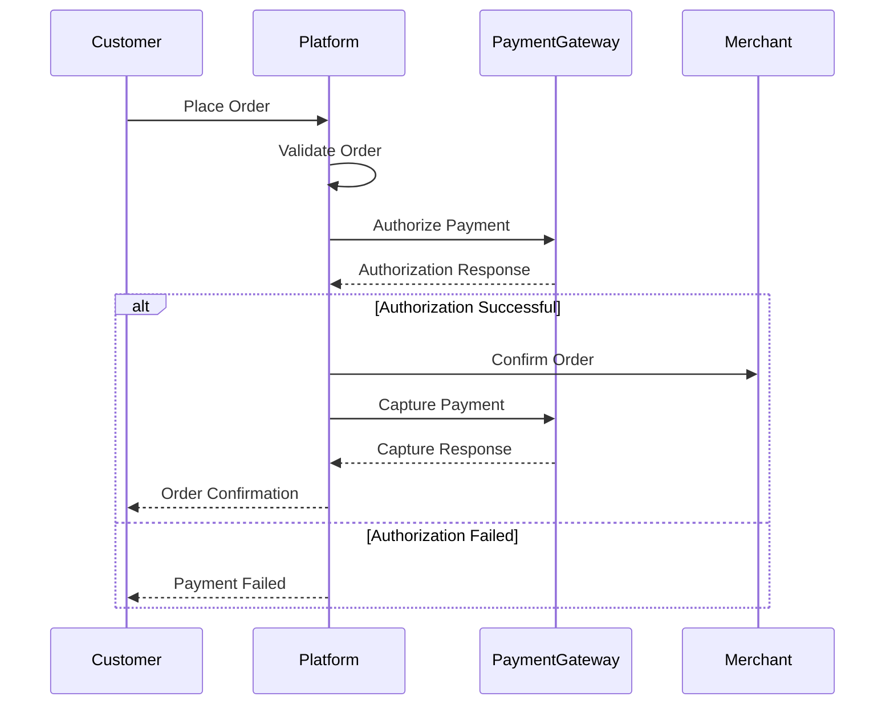

# Software Requirements Specification (SRS)

## Part 01D: Customer Payments

**Module:** Customer Module (Part 02)
**Version:** 1.0.0
**Status:** Final / For Review
**Date:** 2026-06-30

---

## Chapter 1 – Overview

### Purpose

The Customer Payments module governs all financial transactions initiated by end consumers on the **[Platform Name]** platform. This encompasses payment method management, transaction processing, digital wallet functionality, refund handling, and financial reconciliation from the customer's perspective.

This module is the financial engine of the customer experience. It must be secure (PCI DSS compliant), reliable (high availability), and flexible (supporting diverse payment methods across multiple regions). Every successful order culminates in a payment transaction that must be processed accurately, securely, and transparently.

### Objectives

- Support diverse payment methods (cards, wallets, COD, regional alternatives)
- Enable secure, PCI-compliant payment processing
- Provide a seamless, frictionless checkout experience
- Support refunds, chargebacks, and disputes
- Enable digital wallet functionality (top-ups, balance checks, payments)
- Provide transaction transparency and history
- Support multi-currency operations

---

## Chapter 2 – Payment Methods

### CUS-068 Supported Payment Methods

| Payment Method | Description | Priority |
| :--- | :--- | :--- |
| **Credit/Debit Cards** | Visa, Mastercard, American Express, local schemes (e.g., Mada in KSA). | **Required** |
| **Digital Wallets** | Platform wallet (prepaid balance). | **Required** |
| **Cash on Delivery (COD)** | Pay cash upon delivery. | **Required** |
| **Mobile Wallets** | Apple Pay, Google Pay, Samsung Pay. | **Required** |
| **Local Payment Methods** | Regional alternatives (e.g., STC Pay in KSA, Paymob in Egypt). | **Required** |
| **Buy Now, Pay Later (BNPL)** | Installment payments (e.g., Tabby, Tamara, Klarna). | **Medium** |
| **Bank Transfers** | Direct bank transfer (offline). | **Optional** |
| **Cryptocurrency** | Bitcoin, stablecoins (future capability). | **Future** |

### CUS-069 Payment Method Management

| Capability | Description |
| :--- | :--- |
| **Add Payment Method** | Securely add new card or wallet. |
| **View Payment Methods** | List saved payment methods (masked). |
| **Set Default** | Designate primary payment method for checkout. |
| **Remove Payment Method** | Delete saved payment method. |
| **Update Payment Method** | Update expiration date, billing address. |
| **Payment Method Validation** | Real-time validation of card details (Luhn check, expiry). |

### CUS-070 Payment Method Data Model

| Field | Type | Description |
| :--- | :--- | :--- |
| `payment_method_id` | UUID | Primary identifier |
| `customer_id` | UUID | Owner of the payment method |
| `method_type` | String | CARD/WALLET/MOBILE_WALLET/COD/BNPL |
| `provider` | String | stripe/paymob/adyen/tabby/tamara |
| `provider_payment_token` | String | Token from payment provider (reusable) |
| `last_four` | String | Last 4 digits (for cards) |
| `card_brand` | String | visa/mastercard/amex/mada |
| `expiry_month` | Integer | Card expiry month (MM) |
| `expiry_year` | Integer | Card expiry year (YYYY) |
| `cardholder_name` | String | Name on card |
| `billing_address` | JSONB | Billing address for the payment method |
| `is_default` | Boolean | Primary payment method |
| `is_active` | Boolean | Active status (soft delete) |
| `created_at` | Timestamp | Method addition timestamp |
| `updated_at` | Timestamp | Last update timestamp |

---

## Chapter 3 – Digital Wallet

### CUS-071 Wallet Features

| Feature | Description | Priority |
| :--- | :--- | :--- |
| **Wallet Balance** | Display current available balance. | **Required** |
| **Top-Up** | Add funds via linked card or bank transfer. | **Required** |
| **Instant Top-Up** | Auto-top-up when balance falls below threshold. | **Medium** |
| **Wallet Payment** | Use wallet balance for order payment. | **Required** |
| **Wallet History** | Transaction history (credits, debits, refunds). | **Required** |
| **Withdraw** | Transfer wallet balance to bank account. | **Medium** |
| **Wallet Statement** | Monthly PDF statement. | **Medium** |
| **Referral Credits** | Earn credits for referrals. | **Medium** |

### CUS-072 Wallet Transaction Types

| Transaction Type | Description | Impact on Balance |
| :--- | :--- | :--- |
| `TOP_UP` | Customer adds funds to wallet. | **Increases** |
| `PAYMENT` | Customer pays for order using wallet. | **Decreases** |
| `REFUND` | Refund credited back to wallet. | **Increases** |
| `PROMO_CREDIT` | Promotional credit added. | **Increases** |
| `WITHDRAWAL` | Customer withdraws funds. | **Decreases** |
| `FEE_ADJUSTMENT` | Platform fee adjustment. | **Decreases** |

### CUS-073 Wallet Business Rules

| Rule | Description |
| :--- | :--- |
| **Minimum Top-Up** | Minimum top-up amount: $5 (configurable). |
| **Maximum Balance** | Maximum wallet balance: $500 (configurable). |
| **Expiration** | Promotional credits expire after 30/60/90 days. |
| **Payment Priority** | Wallet balance used before charging card (if enabled). |
| **Partial Payment** | Customer can use wallet balance + card for single order. |
| **Refund Policy** | Refunds go to wallet (instant) unless requested to original payment method. |

### CUS-074 Wallet Data Model

| Column | Type | Constraints | Description |
| :--- | :--- | :--- | :--- |
| `wallet_id` | UUID | PRIMARY KEY | Unique wallet identifier |
| `customer_id` | UUID | UNIQUE, FOREIGN KEY (customers.customer_id) | Wallet owner |
| `balance` | DECIMAL(12, 2) | DEFAULT 0 | Current available balance |
| `pending_balance` | DECIMAL(12, 2) | DEFAULT 0 | Pending transactions |
| `total_credited` | DECIMAL(12, 2) | DEFAULT 0 | Lifetime credits |
| `total_debited` | DECIMAL(12, 2) | DEFAULT 0 | Lifetime debits |
| `currency` | VARCHAR(3) | NOT NULL | ISO 4217 currency code |
| `auto_top_up_enabled` | BOOLEAN | DEFAULT FALSE | Auto top-up preference |
| `auto_top_up_threshold` | DECIMAL(12, 2) | | Minimum balance trigger |
| `auto_top_up_amount` | DECIMAL(12, 2) | | Amount to top up |
| `status` | VARCHAR(20) | DEFAULT 'ACTIVE' | ACTIVE/SUSPENDED/CLOSED |
| `created_at` | TIMESTAMP | DEFAULT NOW() | Wallet creation timestamp |
| `updated_at` | TIMESTAMP | DEFAULT NOW() | Last update timestamp |

### wallet_transactions

| Column | Type | Constraints | Description |
| :--- | :--- | :--- | :--- |
| `transaction_id` | UUID | PRIMARY KEY | Unique transaction identifier |
| `wallet_id` | UUID | FOREIGN KEY (wallets.wallet_id) | Associated wallet |
| `customer_id` | UUID | FOREIGN KEY (customers.customer_id) | Associated customer |
| `order_id` | UUID | FOREIGN KEY (orders.order_id) | Associated order (if applicable) |
| `transaction_type` | VARCHAR(20) | NOT NULL | TOP_UP/PAYMENT/REFUND/PROMO_CREDIT/WITHDRAWAL |
| `amount` | DECIMAL(12, 2) | NOT NULL | Transaction amount |
| `balance_before` | DECIMAL(12, 2) | NOT NULL | Balance before transaction |
| `balance_after` | DECIMAL(12, 2) | NOT NULL | Balance after transaction |
| `currency` | VARCHAR(3) | NOT NULL | ISO 4217 currency code |
| `payment_provider` | VARCHAR(50) | | Payment provider used |
| `provider_transaction_id` | VARCHAR(255) | | Reference from payment provider |
| `status` | VARCHAR(20) | DEFAULT 'PENDING' | PENDING/COMPLETED/FAILED/REVERSED |
| `description` | TEXT | | Transaction description |
| `metadata` | JSONB | | Additional transaction context |
| `created_at` | TIMESTAMP | DEFAULT NOW() | Transaction timestamp |
| `settled_at` | TIMESTAMP | | Settlement timestamp |

---

## Chapter 4 – Payment Processing

### CUS-075 Payment Flow

### CUS-076 Payment Statuses

| Status | Description |
| :--- | :--- |
| `PENDING` | Payment initiated, awaiting response. |
| `AUTHORIZED` | Payment authorized (funds reserved). |
| `CAPTURED` | Payment captured (funds transferred). |
| `FAILED` | Payment failed (declined, timeout, error). |
| `REFUNDED` | Full refund processed. |
| `PARTIALLY_REFUNDED` | Partial refund processed. |
| `CHARGEBACK` | Customer disputed charge. |
| `REVERSED` | Payment reversed (rare). |

### CUS-077 Idempotency

All payment requests shall include an idempotency key to prevent duplicate processing:

| Attribute | Description |
| :--- | :--- |
| **Idempotency Key** | Unique key generated by client (UUID). |
| **Key Storage** | Stored with payment record for reference. |
| **Deduplication Window** | 24 hours (any duplicate request within window returns original response). |
| **Key Format** | `idempotency-{order_id}-{timestamp}` (or random UUID). |

### CUS-078 Payment Security

| Security Measure | Description |
| :--- | :--- |
| **PCI DSS Compliance** | Full compliance with PCI DSS Level 1. |
| **Tokenization** | Payment methods tokenized; raw PAN never stored. |
| **Encryption** | All payment data encrypted at rest (AES-256) and in transit (TLS 1.3). |
| **3D Secure** | Support for 3DS2 for card payments (authentication step). |
| **CVV Handling** | CVV never stored; must be provided for each transaction. |
| **Rate Limiting** | Rate limiting on payment endpoints to prevent abuse. |
| **Fraud Detection** | Real-time fraud detection (Part 07D). |

---

## Chapter 5 – Refunds & Disputes

### CUS-079 Refund Types

| Refund Type | Description | Priority |
| :--- | :--- | :--- |
| **Full Refund** | Complete reversal of payment. | **Required** |
| **Partial Refund** | Refund of a portion of payment. | **Required** |
| **Wallet Refund** | Refund credited to platform wallet. | **Required** |
| **Original Payment Method** | Refund reversed to original card/wallet. | **Required** |
| **Voucher/Credit** | Refund issued as platform voucher. | **Medium** |

### CUS-080 Refund Flow

1.  Customer initiates refund request (via order issue reporting).
2.  Customer support or automated system reviews the request.
3.  If approved, refund is initiated:
    - System validates refund eligibility.
    - System determines refund method (wallet or original payment).
    - System initiates refund with payment provider.
4.  Payment provider processes refund (immediate or batch).
5.  Customer receives confirmation.
6.  Order status updates to `REFUNDED` or `PARTIALLY_REFUNDED`.

### CUS-081 Refund Business Rules

| Rule | Description |
| :--- | :--- |
| **Refund Window** | Refund requests must be made within 7 days of delivery. |
| **Condition** | Refunds require proof of issue (photo, description). |
| **Method** | Refunds go to wallet (instant) unless explicitly requested to original payment method. |
| **Partial Refunds** | Merchant may approve partial refund for missing items. |
| **Voucher Alternative** | Customer may accept voucher credit + 10% bonus. |
| **Fraud Prevention** | Excessive refunds trigger fraud review. |

### CUS-082 Chargeback Handling

| Scenario | Description |
| :--- | :--- |
| **Customer Dispute** | Customer disputes charge with bank/card issuer. |
| **Notification** | Platform receives chargeback notification from payment provider. |
| **Investigation** | Platform investigates (order data, delivery proof, communications). |
| **Representment** | Platform may submit evidence to dispute chargeback. |
| **Resolution** | Chargeback is either successful (customer wins) or unsuccessful (platform wins). |
| **Cost** | Platform bears chargeback fees and penalties. |

---

## Chapter 6 – Payment Integration

### CUS-083 Payment Gateway Integration

The platform shall integrate with multiple payment gateways to ensure redundancy and regional coverage.

| Gateway | Regions | Priority |
| :--- | :--- | :--- |
| **Stripe** | Global | **Required** |
| **Paymob** | MENA (Egypt, KSA, UAE) | **Required** |
| **Adyen** | Global (Enterprise) | **Required** |
| **Checkout.com** | Global | **Medium** |
| **Local Gateways** | Per region (e.g., Fawry in Egypt) | **Medium** |

### CUS-084 Gateway Abstraction

| Feature | Description |
| :--- | :--- |
| **Unified API** | Single platform API for all payment operations. |
| **Gateway Router** | Intelligently route transactions to optimal gateway (region, currency, availability). |
| **Failover** | Automatic failover to secondary gateway if primary fails. |
| **Fallback** | Fallback to alternative payment method if card fails. |
| **Callback Handling** | Consistent webhook handling for all gateways. |

### CUS-085 Webhook Events

| Event | Description | Priority |
| :--- | :--- | :--- |
| `payment.succeeded` | Payment successfully captured. | **Required** |
| `payment.failed` | Payment failed. | **Required** |
| `payment.refunded` | Refund processed. | **Required** |
| `payment.disputed` | Chargeback initiated. | **Required** |
| `payment.dispute.resolved` | Chargeback resolved. | **Required** |
| `payment.authorized` | Payment authorized (pre-capture). | **Medium** |

---

## Chapter 7 – Transaction History

### CUS-086 Customer Transaction History

Customers shall be able to view all financial transactions associated with their account:

| Feature | Description |
| :--- | :--- |
| **Transaction List** | Paginated list of all transactions (payments, refunds, wallet operations). |
| **Filtering** | Filter by date range, type, status. |
| **Transaction Details** | View full transaction details including amount, status, payment method. |
| **Order Link** | Link transaction to associated order. |
| **Download Statement** | Download CSV/PDF statement. |
| **Export** | Export transaction data (for personal finance tools). |

### CUS-087 Transaction Data Model

| Column | Type | Constraints | Description |
| :--- | :--- | :--- | :--- |
| `transaction_id` | UUID | PRIMARY KEY | Unique transaction identifier |
| `customer_id` | UUID | FOREIGN KEY (customers.customer_id) | Associated customer |
| `order_id` | UUID | FOREIGN KEY (orders.order_id) | Associated order (if applicable) |
| `payment_method_id` | UUID | FOREIGN KEY (payment_methods.payment_method_id) | Payment method used |
| `transaction_type` | VARCHAR(20) | NOT NULL | PAYMENT/REFUND/AUTHORIZATION/CAPTURE/CHARGEBACK |
| `amount` | DECIMAL(12, 2) | NOT NULL | Transaction amount |
| `currency` | VARCHAR(3) | NOT NULL | ISO 4217 currency code |
| `status` | VARCHAR(20) | NOT NULL | PENDING/AUTHORIZED/CAPTURED/FAILED/REFUNDED/CHARGEBACK |
| `provider` | VARCHAR(50) | | Payment provider |
| `provider_transaction_id` | VARCHAR(255) | | Provider transaction reference |
| `provider_status` | VARCHAR(50) | | Provider-specific status |
| `idempotency_key` | VARCHAR(255) | UNIQUE | Deduplication key |
| `description` | TEXT | | Transaction description |
| `metadata` | JSONB | | Additional transaction context |
| `created_at` | TIMESTAMP | DEFAULT NOW() | Transaction creation timestamp |
| `updated_at` | TIMESTAMP | DEFAULT NOW() | Last update timestamp |
| `settled_at` | TIMESTAMP | | Settlement timestamp |
| `refunded_at` | TIMESTAMP | | Refund processing timestamp |

---

## Chapter 8 – Multi-Currency Support

### CUS-088 Multi-Currency Features

| Feature | Description |
| :--- | :--- |
| **Customer Currency** | Customer sees prices in their preferred currency. |
| **Merchant Settlement** | Merchant settles in their local currency. |
| **Exchange Rate** | Real-time exchange rate integration (Part 06F). |
| **Display Format** | Proper currency formatting (symbol, decimal places). |
| **Currency Conversion** | Automatic conversion at point of payment. |
| **Wallet Currencies** | Support multiple currency wallets (future). |

### CUS-089 Currency Business Rules

| Rule | Description |
| :--- | :--- |
| **Base Currency** | Platform base currency: USD or AED (configurable). |
| **Conversion Time** | Exchange rates applied at order confirmation. |
| **Rate Source** | Rates from provider (e.g., OpenExchangeRates, fixer.io). |
| **Rounding** | Final amounts rounded to 2 decimal places. |
| **Display** | Show both original and converted amounts (if relevant). |

---

## Chapter 9 – Database Tables

### payment_methods

| Column | Type | Constraints | Description |
| :--- | :--- | :--- | :--- |
| `payment_method_id` | UUID | PRIMARY KEY | Unique payment method identifier |
| `customer_id` | UUID | FOREIGN KEY (customers.customer_id) | Owner of the payment method |
| `method_type` | VARCHAR(20) | NOT NULL | CARD/WALLET/MOBILE_WALLET/COD |
| `provider` | VARCHAR(50) | NOT NULL | stripe/paymob/adyen/apple_pay/google_pay |
| `provider_token` | VARCHAR(255) | | Token from payment provider |
| `last_four` | VARCHAR(4) | | Last 4 digits (for cards) |
| `card_brand` | VARCHAR(20) | | visa/mastercard/amex/mada |
| `expiry_month` | INTEGER | | Expiry month (MM) |
| `expiry_year` | INTEGER | | Expiry year (YYYY) |
| `cardholder_name` | VARCHAR(100) | | Name on card |
| `billing_address` | JSONB | | Billing address JSON |
| `is_default` | BOOLEAN | DEFAULT FALSE | Primary payment method |
| `is_active` | BOOLEAN | DEFAULT TRUE | Active status (soft delete) |
| `created_at` | TIMESTAMP | DEFAULT NOW() | Creation timestamp |
| `updated_at` | TIMESTAMP | DEFAULT NOW() | Last update timestamp |

### customer_transactions

| Column | Type | Constraints | Description |
| :--- | :--- | :--- | :--- |
| `transaction_id` | UUID | PRIMARY KEY | Unique transaction identifier |
| `customer_id` | UUID | FOREIGN KEY (customers.customer_id) | Associated customer |
| `order_id` | UUID | FOREIGN KEY (orders.order_id) | Associated order |
| `payment_method_id` | UUID | FOREIGN KEY (payment_methods.payment_method_id) | Payment method used |
| `transaction_type` | VARCHAR(20) | NOT NULL | PAYMENT/REFUND/AUTHORIZATION/CAPTURE/CHARGEBACK |
| `amount` | DECIMAL(12, 2) | NOT NULL | Transaction amount |
| `currency` | VARCHAR(3) | NOT NULL | ISO 4217 currency code |
| `exchange_rate` | DECIMAL(10, 4) | | Exchange rate applied |
| `base_amount` | DECIMAL(12, 2) | | Amount in base currency |
| `status` | VARCHAR(20) | NOT NULL | PENDING/AUTHORIZED/CAPTURED/FAILED/REFUNDED/CHARGEBACK |
| `provider` | VARCHAR(50) | | Payment provider |
| `provider_transaction_id` | VARCHAR(255) | | Provider reference |
| `provider_status` | VARCHAR(50) | | Provider-specific status |
| `idempotency_key` | VARCHAR(255) | UNIQUE | Deduplication key |
| `description` | TEXT | | Transaction description |
| `metadata` | JSONB | | Additional transaction context |
| `created_at` | TIMESTAMP | DEFAULT NOW() | Creation timestamp |
| `updated_at` | TIMESTAMP | DEFAULT NOW() | Last update timestamp |
| `settled_at` | TIMESTAMP | | Settlement timestamp |
| `refunded_at` | TIMESTAMP | | Refund processing timestamp |

### refund_requests

| Column | Type | Constraints | Description |
| :--- | :--- | :--- | :--- |
| `refund_id` | UUID | PRIMARY KEY | Unique refund identifier |
| `order_id` | UUID | FOREIGN KEY (orders.order_id) | Associated order |
| `customer_id` | UUID | FOREIGN KEY (customers.customer_id) | Requesting customer |
| `transaction_id` | UUID | FOREIGN KEY (customer_transactions.transaction_id) | Original transaction |
| `refund_amount` | DECIMAL(12, 2) | NOT NULL | Refund amount |
| `refund_reason` | VARCHAR(100) | NOT NULL | MISSING_ITEMS/WRONG_ITEMS/DAMAGED/LATE/CANCELLED/OTHER |
| `refund_method` | VARCHAR(20) | NOT NULL | WALLET/ORIGINAL_PAYMENT/VOUCHER |
| `status` | VARCHAR(20) | DEFAULT 'PENDING' | PENDING/APPROVED/REJECTED/PROCESSING/COMPLETED/FAILED |
| `reviewed_by` | UUID | | Admin who reviewed (admin_users.id) |
| `reviewed_at` | TIMESTAMP | | Review timestamp |
| `admin_notes` | TEXT | | Internal notes from admin |
| `processed_at` | TIMESTAMP | | Refund processing timestamp |
| `completed_at` | TIMESTAMP | | Refund completion timestamp |
| `created_at` | TIMESTAMP | DEFAULT NOW() | Request creation timestamp |
| `updated_at` | TIMESTAMP | DEFAULT NOW() | Last update timestamp |

---

## Chapter 10 – REST APIs

### Payment Method APIs

| Method | Endpoint | Description |
| :--- | :--- | :--- |
| `GET` | `/api/v1/customers/me/payment-methods` | List saved payment methods |
| `POST` | `/api/v1/customers/me/payment-methods` | Add new payment method |
| `GET` | `/api/v1/customers/me/payment-methods/{id}` | Get payment method details |
| `PUT` | `/api/v1/customers/me/payment-methods/{id}` | Update payment method |
| `DELETE` | `/api/v1/customers/me/payment-methods/{id}` | Remove payment method |
| `PUT` | `/api/v1/customers/me/payment-methods/{id}/default` | Set as default |

### Wallet APIs

| Method | Endpoint | Description |
| :--- | :--- | :--- |
| `GET` | `/api/v1/customers/me/wallet` | Get wallet balance |
| `GET` | `/api/v1/customers/me/wallet/transactions` | List wallet transactions |
| `POST` | `/api/v1/customers/me/wallet/topup` | Top up wallet |
| `POST` | `/api/v1/customers/me/wallet/withdraw` | Withdraw wallet balance |
| `PUT` | `/api/v1/customers/me/wallet/auto-topup` | Configure auto top-up |

### Payment Processing APIs

| Method | Endpoint | Description |
| :--- | :--- | :--- |
| `POST` | `/api/v1/payments/authorize` | Authorize payment |
| `POST` | `/api/v1/payments/capture` | Capture authorized payment |
| `POST` | `/api/v1/payments/refund` | Process refund |
| `GET` | `/api/v1/payments/{id}` | Get payment details |
| `GET` | `/api/v1/payments/order/{order_id}` | Get payment for order |

### Refund APIs

| Method | Endpoint | Description |
| :--- | :--- | :--- |
| `POST` | `/api/v1/refunds` | Request refund |
| `GET` | `/api/v1/refunds` | List refund requests |
| `GET` | `/api/v1/refunds/{id}` | Get refund details |
| `PUT` | `/api/v1/refunds/{id}/status` | Update refund status (admin only) |

### Webhook APIs

| Method | Endpoint | Description |
| :--- | :--- | :--- |
| `POST` | `/api/v1/webhooks/payments` | Payment provider webhook endpoint |
| `POST` | `/api/v1/webhooks/refunds` | Refund provider webhook endpoint |

---

## Chapter 11 – Business Rules

| Rule ID | Rule Description | Priority |
| :--- | :--- | :--- |
| **BR-PAY-001** | All card numbers must be tokenized; raw PAN never stored. | **High** |
| **BR-PAY-002** | CVV must never be logged or stored. | **High** |
| **BR-PAY-003** | All payment requests must include an idempotency key. | **High** |
| **BR-PAY-004** | Wallet balance cannot go negative. | **High** |
| **BR-PAY-005** | Minimum wallet top-up amount is $5 (or equivalent). | **Medium** |
| **BR-PAY-006** | Maximum wallet balance is $500 (or equivalent). | **Medium** |
| **BR-PAY-007** | Refunds to wallet are instant; refunds to card take 3-5 business days. | **High** |
| **BR-PAY-008** | Refund requests must be submitted within 7 days of delivery. | **High** |
| **BR-PAY-009** | Promotional credits expire after 30 days (configurable). | **Medium** |
| **BR-PAY-010** | Wallet can be used for partial payment; remaining amount charged to card. | **Medium** |
| **BR-PAY-011** | Chargeback disputes must be responded to within 5 business days. | **High** |
| **BR-PAY-012** | Payment gateway failover must occur within 5 seconds. | **High** |

---

## Chapter 12 – Acceptance Tests

| Test ID | Test Description | Priority |
| :--- | :--- | :--- |
| **TEST-PAY-001** | Add credit card as payment method with valid details. | **High** |
| **TEST-PAY-002** | Add payment method with invalid card details (validation error). | **High** |
| **TEST-PAY-003** | Set default payment method; verify default selection. | **High** |
| **TEST-PAY-004** | Remove saved payment method. | **High** |
| **TEST-PAY-005** | Pay for order using saved credit card. | **High** |
| **TEST-PAY-006** | Pay for order using new credit card (not saved). | **High** |
| **TEST-PAY-007** | Pay for order using digital wallet balance. | **High** |
| **TEST-PAY-008** | Pay for order using Cash on Delivery. | **High** |
| **TEST-PAY-009** | Pay for order using Apple Pay/Google Pay. | **High** |
| **TEST-PAY-010** | Insufficient wallet balance when attempting wallet payment (fallback to card). | **High** |
| **TEST-PAY-011** | Payment authorization fails due to insufficient funds (error message). | **High** |
| **TEST-PAY-012** | Wallet top-up using credit card. | **High** |
| **TEST-PAY-013** | View wallet transaction history with filtering. | **High** |
| **TEST-PAY-014** | View payment transaction history with filtering. | **High** |
| **TEST-PAY-015** | Request full refund; verify refund processed. | **High** |
| **TEST-PAY-016** | Request partial refund; verify partial amount processed. | **High** |
| **TEST-PAY-017** | Refund credited to wallet (instant). | **High** |
| **TEST-PAY-018** | Refund credited to original payment method. | **High** |
| **TEST-PAY-019** | Refund request rejected due to policy violation. | **Medium** |
| **TEST-PAY-020** | Duplicate payment request with same idempotency key returns original response. | **High** |
| **TEST-PAY-021** | Payment gateway failover (primary down, secondary used). | **High** |
| **TEST-PAY-022** | Auto top-up triggers when balance below threshold. | **Medium** |
| **TEST-PAY-023** | Promotional credit applied to wallet and used for order. | **Medium** |
| **TEST-PAY-024** | Multi-currency display: prices shown in customer's currency. | **Medium** |
| **TEST-PAY-025** | 3D Secure authentication flow for card payment. | **High** |
| **TEST-PAY-026** | Chargeback initiated; platform processes dispute. | **Medium** |
| **TEST-PAY-027** | Wallet withdrawal to bank account. | **Medium** |
| **TEST-PAY-028** | Download transaction statement (CSV/PDF). | **Medium** |

---

## Chapter 13 – Traceability Matrix

| Requirement | Database Table | API Endpoint(s) | Acceptance Test |
| :--- | :--- | :--- | :--- |
| CUS-068 | payment_methods | GET/POST /api/v1/customers/me/payment-methods | TEST-PAY-001, TEST-PAY-005, TEST-PAY-006 |
| CUS-069 | payment_methods | PUT/DELETE /api/v1/customers/me/payment-methods/{id} | TEST-PAY-002, TEST-PAY-003, TEST-PAY-004 |
| CUS-071 | wallets, wallet_transactions | GET /api/v1/customers/me/wallet | TEST-PAY-007, TEST-PAY-012 |
| CUS-071 | wallet_transactions | GET /api/v1/customers/me/wallet/transactions | TEST-PAY-013 |
| CUS-076 | customer_transactions | POST /api/v1/payments/authorize | TEST-PAY-011 |
| CUS-079 | refund_requests | POST /api/v1/refunds | TEST-PAY-015, TEST-PAY-016 |
| CUS-080 | refund_requests | GET /api/v1/refunds/{id} | TEST-PAY-017, TEST-PAY-018 |
| CUS-077 | customer_transactions | POST /api/v1/payments/authorize | TEST-PAY-020 |
| CUS-083 | customer_transactions | POST /api/v1/payments/authorize | TEST-PAY-021 |
| CUS-071 | wallets | PUT /api/v1/customers/me/wallet/auto-topup | TEST-PAY-022 |
| CUS-088 | wallets, customer_transactions | GET /api/v1/customers/me/wallet | TEST-PAY-024 |
| CUS-086 | customer_transactions | GET /api/v1/customers/me/transactions | TEST-PAY-014 |

---

## Chapter 14 – Summary

This document establishes the complete customer payment capability for the **[Platform Name]** platform. Key takeaways:

- **Diverse Payment Methods:** Support for cards, digital wallets, COD, mobile wallets, and regional alternatives ensures broad accessibility.
- **Digital Wallet:** Prepaid wallet with top-up, payment, and transaction history provides flexibility and loyalty.
- **Secure Processing:** PCI-compliant, tokenized, encrypted payment processing with 3D Secure and fraud detection.
- **Refund Management:** Structured refund workflows with support for full, partial, wallet, and original payment method refunds.
- **Multi-Currency:** Support for multiple currencies with real-time exchange rates.
- **Idempotency:** Duplicate payment prevention ensures data integrity and customer trust.
- **Gateway Abstraction:** Multiple payment gateway integration with automatic failover ensures high availability.

The payments module is the financial cornerstone of the customer experience. Its reliability, security, and flexibility directly impact customer trust, conversion rates, and platform revenue.

---

**Next Document:**

`Part_01E_Customer_Loyalty.md`

*(This builds on payments to define the loyalty program, rewards, gamification, and retention mechanics that drive repeat business.)*
