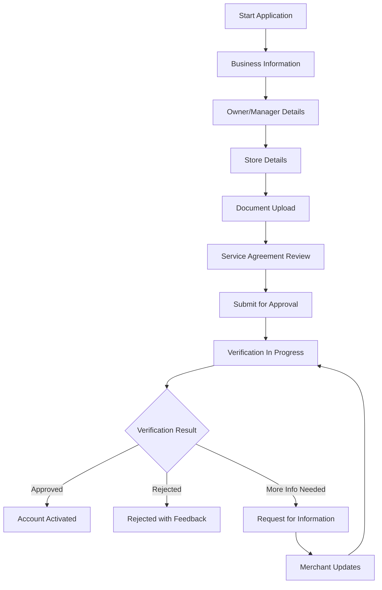

# Software Requirements Specification (SRS)

## Part 02A: Merchant Registration

**Module:** Merchant Module (Part 03)
**Version:** 1.0.0
**Status:** Final / For Review
**Date:** 2026-06-30

---

## Chapter 1 – Overview

### Purpose

The Merchant Registration module governs the complete lifecycle of merchant onboarding onto the **[Platform Name]** platform. This encompasses everything from initial application and document submission, through verification and approval, to account activation and first-store setup.

Merchants are the supply-side foundation of the marketplace. A frictionless, transparent, and efficient registration process directly impacts the platform's ability to acquire and retain merchants, ultimately determining the breadth and quality of offerings available to customers.

### Objectives

- Provide a low-friction, self-service merchant application process
- Enable thorough verification of merchant identity, business legitimacy, and operational readiness
- Support multiple merchant types (individual restaurants, chains, grocery stores, pharmacies, etc.)
- Ensure compliance with regional regulatory and tax requirements
- Provide transparent application status tracking
- Enable scalable merchant acquisition through automated and manual verification workflows

---

## Chapter 2 – Merchant Application

### MER-001 Application Process Overview

### MER-002 Application Steps

| Step | Description | Priority |
| :--- | :--- | :--- |
| **Step 1: Business Information** | Legal business name, registration details, tax ID, business type. | **Required** |
| **Step 2: Owner/Manager Details** | Primary contact, owner identity, authorized signatory. | **Required** |
| **Step 3: Store Details** | Store name, location, contact, cuisine/category, operational hours. | **Required** |
| **Step 4: Document Upload** | Business license, ID proofs, bank account, tax certificates. | **Required** |
| **Step 5: Service Agreement** | Review and accept platform terms, commission structure, payment terms. | **Required** |
| **Step 6: Bank Account Verification** | Verify merchant bank account for settlements. | **Required** |
| **Step 7: Menu Setup** | Initial menu/catalog setup (can be completed post-activation). | **Medium** |

### MER-003 Application Data Collection

| Field | Type | Required | Description |
| :--- | :--- | :--- | :--- |
| `business_legal_name` | String | Yes | Registered legal business name |
| `business_trading_name` | String | Yes | Name displayed to customers |
| `business_registration_number` | String | Yes | Company registration/CRL number |
| `tax_id` | String | Yes | VAT/GST/EIN/TIN number |
| `business_type` | Enum | Yes | SOLE_PROPRIETORSHIP/LLC/CORPORATION/PARTNERSHIP |
| `business_category` | Enum | Yes | RESTAURANT/CAFE/FAST_FOOD/BAKERY/GROCERY/PHARMACY/RETAIL |
| `primary_cuisine` | String | Yes | Primary cuisine type (if restaurant) |
| `merchant_owner_name` | String | Yes | Full name of owner/authorized signatory |
| `merchant_owner_email` | Email | Yes | Owner's email address |
| `merchant_owner_phone` | String | Yes | Owner's phone number |
| `merchant_owner_id_type` | Enum | Yes | PASSPORT/NATIONAL_ID/DRIVING_LICENSE |
| `merchant_owner_id_number` | String | Yes | ID document number |
| `manager_name` | String | No | Store manager name (if different from owner) |
| `manager_email` | Email | No | Manager's email |
| `manager_phone` | String | No | Manager's phone |
| `store_name` | String | Yes | Name displayed to customers |
| `store_description` | Text | No | Description of the business |
| `store_address_line_1` | String | Yes | Street address |
| `store_address_line_2` | String | No | Building/apartment/suite |
| `store_city` | String | Yes | City |
| `store_state` | String | Yes | State/province |
| `store_postal_code` | String | Yes | ZIP/Postal code |
| `store_country` | String | Yes | Country |
| `store_latitude` | Decimal | Yes | Geocoded location |
| `store_longitude` | Decimal | Yes | Geocoded location |
| `store_phone` | String | Yes | Store contact number |
| `store_email` | Email | Yes | Store contact email |
| `store_website` | String | No | Store website URL |
| `store_operating_days` | JSON | Yes | Days of operation |
| `store_operating_hours` | JSON | Yes | Opening/closing times |
| `delivery_zone` | JSON | No | Custom delivery zone polygon |
| `delivery_radius` | Integer | Yes | Maximum delivery distance in meters |
| `minimum_order_value` | Decimal | Yes | Minimum order value for delivery |
| `estimated_prep_time` | Integer | Yes | Average preparation time in minutes |
| `commission_rate` | Decimal | No | Agreed commission rate (set by sales/admin) |
| `settlement_frequency` | Enum | No | DAILY/WEEKLY/BIWEEKLY/MONTHLY |
| `bank_account_name` | String | Yes | Account holder name |
| `bank_account_number` | String | Yes | Bank account number |
| `bank_name` | String | Yes | Bank name |
| `bank_branch` | String | Yes | Bank branch |
| `bank_country` | String | Yes | Bank country |
| `bank_currency` | String | Yes | Settlement currency |
| `bank_iban` | String | No | IBAN (if applicable) |
| `bank_swift_code` | String | No | SWIFT/BIC code |

---

## Chapter 3 – Document Management

### MER-004 Required Documents

| Document Type | Description | Purpose | Priority |
| :--- | :--- | :--- | :--- |
| **Business License** | Commercial registration or trade license. | Verify legal business existence. | **Required** |
| **Owner ID Proof** | Passport, national ID, or driving license. | Verify identity of owner/signatory. | **Required** |
| **Owner Address Proof** | Utility bill, bank statement, or lease agreement. | Verify owner's residential address. | **Required** |
| **Bank Account Proof** | Voided cheque or bank confirmation letter. | Verify settlement bank account. | **Required** |
| **Tax Registration** | VAT/GST certificate or tax registration document. | Verify tax compliance. | **Required** |
| **Trade Mark/Certificate** | Brand registration (if applicable). | Verify brand authenticity. | **Optional** |
| **Health/Safety Certificate** | Food safety/hygiene certification (if applicable). | Verify food safety compliance. | **Required** |
| **Premises Photos** | Storefront, interior, kitchen photos. | Verify operational readiness. | **Required** |
| **Menu/Product List** | Initial menu or product catalog. | Verify product offerings. | **Required** |

### MER-005 Document Upload Specifications

| Attribute | Specification |
| :--- | :--- |
| **Supported Formats** | PDF, JPG, JPEG, PNG, DOC, DOCX |
| **Maximum File Size** | 10 MB per document |
| **Maximum Documents** | 10 per merchant application |
| **Compression** | Images automatically compressed for storage |
| **Storage** | Encrypted at rest in cloud object storage (S3/GCS/Azure) |
| **Retention** | Documents retained for 7 years (regulatory requirement) |
| **Access Control** | Access restricted to authorized admin and compliance teams |

### MER-006 Document Verification Status

| Status | Description |
| :--- | :--- |
| `PENDING` | Document uploaded, awaiting verification. |
| `UNDER_REVIEW` | Document is being reviewed manually. |
| `VERIFIED` | Document verified and accepted. |
| `REJECTED` | Document rejected (reason provided). |
| `EXPIRED` | Document has expired (e.g., business license renewal). |
| `ACTION_REQUIRED` | Additional information or resubmission needed. |

---

## Chapter 4 – Verification & Approval

### MER-007 Verification Workflow

| Step | Action | Responsible Party |
| :--- | :--- | :--- |
| **1. Application Submitted** | Merchant completes and submits application. | Merchant |
| **2. Automated Checks** | System validates format, completeness, and basic fraud checks. | System |
| **3. Document Verification** | Uploaded documents are reviewed for authenticity and completeness. | Operations Team |
| **4. Background Check** | KYC/KYB checks (sanctions, AML, watchlists). | Compliance Team |
| **5. Bank Account Verification** | Bank account validated (nominal deposit/micro-amount verification). | Finance Team |
| **6. Site Visit (Optional)** | Physical inspection of the premises (for high-value/enterprise merchants). | Operations Team |
| **7. Approval/Rejection** | Final decision communicated to merchant. | Operations Manager |

### MER-008 Auto-Verification Rules

| Rule | Action | Priority |
| :--- | :--- | :--- |
| **Business License Validity** | Auto-verify if license number matches government database (where available). | **High** |
| **ID Verification** | Auto-verify ID if document can be validated against government database. | **High** |
| **Bank Account Verification** | Auto-verify via micro-deposit or bank API (where available). | **High** |
| **Address Validation** | Auto-validate address against geocoding service and postal database. | **High** |
| **Fraud/Sanctions Check** | Auto-check against global sanctions and PEP lists. | **High** |
| **Document Authenticity** | AI-assisted document authenticity check (forgery detection). | **Medium** |
| **Duplicate Check** | Auto-check for duplicate applications (same business/TIN). | **High** |

### MER-009 Approval/Rejection Criteria

| Criteria | Approval | Rejection |
| :--- | :--- | :--- |
| **Business Legitimacy** | Valid, active business license. | Invalid, expired, or fraudulent license. |
| **Owner Identity** | Verified owner ID matches business registration. | Unverified identity, ID mismatch. |
| **Sanctions Check** | No matches on watchlists/sanctions lists. | Match on sanctions list or PEP list. |
| **Financial Health** | No adverse financial history. | History of fraud, bankruptcy, or defaults. |
| **Operational Readiness** | Store exists and is operational. | Store doesn't exist or is not operational. |
| **Platform Suitability** | Fits platform categories and quality standards. | Unsuitable for platform (e.g., prohibited category). |
| **Commission Agreement** | Accepts the agreed commission structure. | Does not accept commission terms. |

### MER-010 Application Statuses

| Status | Description | Next Action |
| :--- | :--- | :--- |
| `DRAFT` | Application started but not submitted. | Merchant completes and submits. |
| `SUBMITTED` | Application submitted, awaiting review. | System/team verifies documents. |
| `UNDER_REVIEW` | Application is being reviewed. | Compliance/Operations reviews. |
| `ACTION_REQUIRED` | Additional information needed from merchant. | Merchant provides missing info. |
| `APPROVED` | Application approved. Account being activated. | System activates account. |
| `ACTIVE` | Account activated; merchant can start onboarding. | Merchant sets up store and menu. |
| `REJECTED` | Application rejected (with reason). | Merchant appeals or reapplies. |
| `SUSPENDED` | Account suspended pending investigation. | Investigation and resolution. |

---

## Chapter 5 – Merchant Account Activation

### MER-011 Activation Workflow

1.  Application approved.
2.  System creates merchant account.
3.  System sends welcome email with login credentials (or set-password link).
4.  Merchant receives notification and logs into Merchant Dashboard.
5.  Merchant completes store profile setup (if not completed during application).
6.  Merchant sets up menu/catalog (if not completed during application).
7.  Merchant configures delivery settings (zones, pricing, prep time).
8.  Merchant reviews and accepts final service agreement (digital signature).
9.  Account transitions to `ACTIVE` status.
10. Merchant can start accepting orders.

### MER-012 Welcome Communication

| Communication | Content | Channel |
| :--- | :--- | :--- |
| **Welcome Email** | Account activation, login instructions, next steps, support contact. | Email |
| **SMS Notification** | Brief welcome with link to login. | SMS |
| **In-App Notification** | Welcome message in Merchant Dashboard (post-login). | Dashboard |
| **Onboarding Checklist** | List of steps to complete before first order. | Dashboard |
| **Training Materials** | Video tutorials, user guides, FAQ. | Dashboard/Portal |

### MER-013 Onboarding Checklist

| Task | Description | Deadline |
| :--- | :--- | :--- |
| **Complete Store Profile** | Upload logo, description, photos, categories. | Within 7 days |
| **Setup Menu/Catalog** | Add all products with prices, descriptions, images. | Within 7 days |
| **Configure Delivery Settings** | Set delivery zones, fees, prep times. | Within 7 days |
| **Set Payment Method** | Configure payout method (bank account verification). | Within 7 days |
| **Accept Service Agreement** | Digitally sign the service agreement. | Within 3 days |
| **Setup POS Integration** | Connect POS system (if applicable). | Within 14 days |
| **Provide Staff Training** | Train staff on order acceptance and preparation workflows. | Within 14 days |

---

## Chapter 6 – Merchant Types & Segmentation

### MER-014 Merchant Segmentation

| Segment | Description | Characteristics | Requirements |
| :--- | :--- | :--- | :--- |
| **Individual Restaurant** | Single-location restaurant or café. | One store, one menu. | Basic verification, single store registration. |
| **Multi-Store Chain** | Multiple locations of the same brand. | Multiple stores, centralized management. | Centralized brand management, individual store verification. |
| **Grocery/Retail** | Supermarket, convenience store, pharmacy. | Large catalog, inventory management. | Enhanced catalog management, POS integration. |
| **Enterprise/Chain** | Large national or international chain. | Complex operations, multiple locations, custom agreements. | Advanced integration, custom commission rates, dedicated account management. |
| **Dark Store/Virtual Brand** | Delivery-only kitchen or virtual brand. | No dine-in, delivery only. | Kitchen verification, virtual brand details. |
| **Third-Party Aggregator** | Platform that aggregates multiple brands. | Complex fulfillment, multiple sub-merchants. | Advanced API integration, multiple settlement profiles. |

---

## Chapter 7 – Database Tables

### merchant_accounts

| Column | Type | Constraints | Description |
| :--- | :--- | :--- | :--- |
| `merchant_id` | UUID | PRIMARY KEY | Unique merchant identifier |
| `business_legal_name` | VARCHAR(255) | NOT NULL | Registered legal business name |
| `business_trading_name` | VARCHAR(255) | NOT NULL | Name displayed to customers |
| `business_registration_number` | VARCHAR(100) | UNIQUE, NOT NULL | Company registration number |
| `tax_id` | VARCHAR(50) | UNIQUE | VAT/GST/EIN/TIN number |
| `business_type` | VARCHAR(50) | NOT NULL | SOLE_PROPRIETORSHIP/LLC/CORPORATION/PARTNERSHIP |
| `business_category` | VARCHAR(50) | NOT NULL | RESTAURANT/CAFE/FAST_FOOD/BAKERY/GROCERY/PHARMACY/RETAIL |
| `primary_cuisine` | VARCHAR(50) | | Primary cuisine type |
| `segment` | VARCHAR(50) | DEFAULT 'INDIVIDUAL' | INDIVIDUAL/MULTI_STORE/GROCERY/ENTERPRISE/DARK_STORE |
| `commission_rate` | DECIMAL(5, 2) | DEFAULT 20.00 | Agreed commission percentage |
| `settlement_frequency` | VARCHAR(20) | DEFAULT 'WEEKLY' | DAILY/WEEKLY/BIWEEKLY/MONTHLY |
| `settlement_day_of_week` | INTEGER | DEFAULT 1 | Day of week for settlements (if weekly) |
| `minimum_order_value` | DECIMAL(10, 2) | DEFAULT 0 | Minimum order value for delivery |
| `delivery_radius` | INTEGER | DEFAULT 5000 | Maximum delivery distance in meters |
| `estimated_prep_time` | INTEGER | DEFAULT 15 | Average preparation time in minutes |
| `status` | VARCHAR(20) | DEFAULT 'PENDING' | DRAFT/SUBMITTED/UNDER_REVIEW/ACTION_REQUIRED/APPROVED/ACTIVE/REJECTED/SUSPENDED |
| `application_data` | JSONB | | Full application data snapshot |
| `verified_at` | TIMESTAMP | | Verification completion timestamp |
| `activated_at` | TIMESTAMP | | Account activation timestamp |
| `suspended_at` | TIMESTAMP | | Account suspension timestamp |
| `suspension_reason` | TEXT | | Reason for suspension |
| `created_at` | TIMESTAMP | DEFAULT NOW() | Account creation timestamp |
| `updated_at` | TIMESTAMP | DEFAULT NOW() | Last update timestamp |

### merchant_stores

| Column | Type | Constraints | Description |
| :--- | :--- | :--- | :--- |
| `store_id` | UUID | PRIMARY KEY | Unique store identifier |
| `merchant_id` | UUID | FOREIGN KEY (merchant_accounts.merchant_id) | Parent merchant account |
| `store_name` | VARCHAR(255) | NOT NULL | Store name displayed to customers |
| `store_description` | TEXT | | Store description |
| `store_category` | VARCHAR(50) | NOT NULL | Primary category |
| `store_subcategory` | VARCHAR(50) | | Subcategory (if applicable) |
| `address_line_1` | VARCHAR(255) | NOT NULL | Street address |
| `address_line_2` | VARCHAR(255) | | Apartment/suite/floor |
| `city` | VARCHAR(100) | NOT NULL | City |
| `state` | VARCHAR(100) | NOT NULL | State/province |
| `postal_code` | VARCHAR(20) | NOT NULL | ZIP/Postal code |
| `country` | VARCHAR(5) | NOT NULL | ISO country code |
| `latitude` | DECIMAL(10, 8) | NOT NULL | Geocoded latitude |
| `longitude` | DECIMAL(11, 8) | NOT NULL | Geocoded longitude |
| `store_phone` | VARCHAR(20) | NOT NULL | Store contact number |
| `store_email` | VARCHAR(255) | NOT NULL | Store contact email |
| `store_website` | VARCHAR(255) | | Store website URL |
| `logo_url` | VARCHAR(500) | | Store logo URL |
| `cover_image_url` | VARCHAR(500) | | Cover/hero image URL |
| `store_images` | TEXT[] | | Gallery image URLs |
| `operating_days` | JSONB | NOT NULL | Days of operation (JSON) |
| `operating_hours` | JSONB | NOT NULL | Opening/closing times (JSON) |
| `is_delivery_enabled` | BOOLEAN | DEFAULT TRUE | Delivery enabled status |
| `is_pickup_enabled` | BOOLEAN | DEFAULT TRUE | Pickup enabled status |
| `is_active` | BOOLEAN | DEFAULT FALSE | Store active status |
| `is_verified` | BOOLEAN | DEFAULT FALSE | Store verification status |
| `created_at` | TIMESTAMP | DEFAULT NOW() | Store creation timestamp |
| `updated_at` | TIMESTAMP | DEFAULT NOW() | Last update timestamp |

### merchant_documents

| Column | Type | Constraints | Description |
| :--- | :--- | :--- | :--- |
| `document_id` | UUID | PRIMARY KEY | Unique document identifier |
| `merchant_id` | UUID | FOREIGN KEY (merchant_accounts.merchant_id) | Associated merchant |
| `document_type` | VARCHAR(50) | NOT NULL | BUSINESS_LICENSE/OWNER_ID/ADDRESS_PROOF/BANK_PROOF/TAX_CERTIFICATE/HEALTH_SAFETY/PREMISES_PHOTOS/MENU |
| `document_name` | VARCHAR(255) | NOT NULL | Original filename |
| `document_url` | VARCHAR(500) | NOT NULL | CDN/document storage URL |
| `document_size` | INTEGER | | File size in bytes |
| `document_mime_type` | VARCHAR(50) | | MIME type |
| `verification_status` | VARCHAR(20) | DEFAULT 'PENDING' | PENDING/UNDER_REVIEW/VERIFIED/REJECTED/EXPIRED/ACTION_REQUIRED |
| `rejection_reason` | TEXT | | Reason if rejected |
| `expiry_date` | DATE | | Document expiry date (if applicable) |
| `uploaded_at` | TIMESTAMP | DEFAULT NOW() | Upload timestamp |
| `verified_at` | TIMESTAMP | | Verification timestamp |
| `verified_by` | UUID | | Admin who verified (admin_users.id) |
| `created_at` | TIMESTAMP | DEFAULT NOW() | Record creation timestamp |
| `updated_at` | TIMESTAMP | DEFAULT NOW() | Last update timestamp |

### merchant_contacts

| Column | Type | Constraints | Description |
| :--- | :--- | :--- | :--- |
| `contact_id` | UUID | PRIMARY KEY | Unique contact identifier |
| `merchant_id` | UUID | FOREIGN KEY (merchant_accounts.merchant_id) | Associated merchant |
| `contact_type` | VARCHAR(20) | NOT NULL | OWNER/MANAGER/ACCOUNTING/OPERATIONS/TECHNICAL |
| `first_name` | VARCHAR(100) | NOT NULL | First name |
| `last_name` | VARCHAR(100) | NOT NULL | Last name |
| `email` | VARCHAR(255) | NOT NULL | Email address |
| `phone` | VARCHAR(20) | NOT NULL | Phone number |
| `role` | VARCHAR(50) | | Job title/role |
| `is_primary` | BOOLEAN | DEFAULT FALSE | Primary contact for this type |
| `is_active` | BOOLEAN | DEFAULT TRUE | Active status |
| `created_at` | TIMESTAMP | DEFAULT NOW() | Creation timestamp |
| `updated_at` | TIMESTAMP | DEFAULT NOW() | Last update timestamp |

### merchant_bank_accounts

| Column | Type | Constraints | Description |
| :--- | :--- | :--- | :--- |
| `bank_account_id` | UUID | PRIMARY KEY | Unique bank account identifier |
| `merchant_id` | UUID | FOREIGN KEY (merchant_accounts.merchant_id) | Associated merchant |
| `account_holder_name` | VARCHAR(255) | NOT NULL | Name on the bank account |
| `account_number` | VARCHAR(50) | NOT NULL | Bank account number (encrypted) |
| `iban` | VARCHAR(50) | | IBAN (encrypted) |
| `swift_code` | VARCHAR(20) | | SWIFT/BIC code |
| `bank_name` | VARCHAR(100) | NOT NULL | Bank name |
| `bank_branch` | VARCHAR(100) | | Bank branch/address |
| `bank_country` | VARCHAR(5) | NOT NULL | Bank country |
| `currency` | VARCHAR(3) | NOT NULL | Settlement currency |
| `is_primary` | BOOLEAN | DEFAULT TRUE | Primary settlement account |
| `is_verified` | BOOLEAN | DEFAULT FALSE | Bank account verification status |
| `verification_method` | VARCHAR(20) | | MICRO_DEPOSIT/BANK_API/MANUAL |
| `verified_at` | TIMESTAMP | | Verification timestamp |
| `created_at` | TIMESTAMP | DEFAULT NOW() | Creation timestamp |
| `updated_at` | TIMESTAMP | DEFAULT NOW() | Last update timestamp |

### merchant_verification_logs

| Column | Type | Constraints | Description |
| :--- | :--- | :--- | :--- |
| `log_id` | UUID | PRIMARY KEY | Unique log identifier |
| `merchant_id` | UUID | FOREIGN KEY (merchant_accounts.merchant_id) | Associated merchant |
| `verification_type` | VARCHAR(50) | NOT NULL | BUSINESS_LICENSE/OWNER_ID/ADDRESS/BANK/TAX/COMPLIANCE/SITE_VISIT |
| `status` | VARCHAR(20) | NOT NULL | PASS/FAIL/ACTION_REQUIRED |
| `message` | TEXT | | Description of verification event |
| `metadata` | JSONB | | Additional verification context |
| `performed_by` | UUID | | Admin who performed verification (admin_users.id) |
| `created_at` | TIMESTAMP | DEFAULT NOW() | Log creation timestamp |

---

## Chapter 8 – REST APIs

### Merchant Application APIs

| Method | Endpoint | Description |
| :--- | :--- | :--- |
| `POST` | `/api/v1/merchant/application` | Start/Submit merchant application |
| `GET` | `/api/v1/merchant/application/{id}` | Get application status and data |
| `PUT` | `/api/v1/merchant/application/{id}` | Update application |
| `POST` | `/api/v1/merchant/application/{id}/submit` | Submit application for review |
| `GET` | `/api/v1/merchant/application/{id}/status` | Get current application status |
| `POST` | `/api/v1/merchant/application/{id}/documents` | Upload document |
| `DELETE` | `/api/v1/merchant/application/{id}/documents/{doc_id}` | Delete document |

### Merchant Account APIs (Post-Activation)

| Method | Endpoint | Description |
| :--- | :--- | :--- |
| `GET` | `/api/v1/merchant/account` | Get merchant account details |
| `PUT` | `/api/v1/merchant/account` | Update merchant account details |
| `GET` | `/api/v1/merchant/stores` | List merchant stores |
| `POST` | `/api/v1/merchant/stores` | Create new store |
| `GET` | `/api/v1/merchant/stores/{id}` | Get store details |
| `PUT` | `/api/v1/merchant/stores/{id}` | Update store details |
| `GET` | `/api/v1/merchant/contacts` | List merchant contacts |
| `POST` | `/api/v1/merchant/contacts` | Add contact |
| `PUT` | `/api/v1/merchant/contacts/{id}` | Update contact |
| `DELETE` | `/api/v1/merchant/contacts/{id}` | Remove contact |
| `GET` | `/api/v1/merchant/bank-accounts` | List bank accounts |
| `POST` | `/api/v1/merchant/bank-accounts` | Add bank account |
| `PUT` | `/api/v1/merchant/bank-accounts/{id}` | Update bank account |
| `DELETE` | `/api/v1/merchant/bank-accounts/{id}` | Remove bank account |

### Admin APIs

| Method | Endpoint | Description |
| :--- | :--- | :--- |
| `GET` | `/api/v1/admin/merchant/applications` | List merchant applications (admin only) |
| `GET` | `/api/v1/admin/merchant/applications/{id}` | Get application details (admin only) |
| `PUT` | `/api/v1/admin/merchant/applications/{id}/verify` | Verify application (admin only) |
| `PUT` | `/api/v1/admin/merchant/applications/{id}/approve` | Approve application (admin only) |
| `PUT` | `/api/v1/admin/merchant/applications/{id}/reject` | Reject application (admin only) |
| `PUT` | `/api/v1/admin/merchant/applications/{id}/request-info` | Request additional information (admin only) |
| `GET` | `/api/v1/admin/merchant/applications/{id}/documents` | Get merchant documents (admin only) |
| `PUT` | `/api/v1/admin/merchant/applications/{id}/documents/{doc_id}/verify` | Verify document (admin only) |
| `POST` | `/api/v1/admin/merchant/applications/{id}/activate` | Activate merchant account (admin only) |
| `POST` | `/api/v1/admin/merchant/{id}/suspend` | Suspend merchant account (admin only) |
| `POST` | `/api/v1/admin/merchant/{id}/reactivate` | Reactivate merchant account (admin only) |

---

## Chapter 9 – Business Rules

| Rule ID | Rule Description | Priority |
| :--- | :--- | :--- |
| **BR-MER-001** | Each merchant must have a unique business registration number within the platform. | **High** |
| **BR-MER-002** | Each merchant must have a unique tax ID within the platform. | **High** |
| **BR-MER-003** | Merchant applications cannot be submitted without all required documents. | **High** |
| **BR-MER-004** | Business license must be valid (not expired) for application approval. | **High** |
| **BR-MER-005** | Owner ID must match the business registration (name verification). | **High** |
| **BR-MER-006** | Bank account must be verified before any settlement can be processed. | **High** |
| **BR-MER-007** | Commission rates are agreed during approval and cannot exceed system maximum (configurable). | **High** |
| **BR-MER-008** | Merchant accounts suspended for compliance reasons cannot be reactivated without review. | **High** |
| **BR-MER-009** | Applications remain active for 90 days; after that, they expire and must be resubmitted. | **Medium** |
| **BR-MER-010** | New merchants have a 30-day grace period before performance metrics are evaluated. | **Medium** |
| **BR-MER-011** | Merchants must have at least one store to be activated. | **High** |
| **BR-MER-012** | Document verification must be completed within 5 business days (SLA). | **Medium** |

---

## Chapter 10 – Acceptance Tests

| Test ID | Test Description | Priority |
| :--- | :--- | :--- |
| **TEST-MER-001** | Merchant starts new application and saves as draft. | **High** |
| **TEST-MER-002** | Merchant completes all application steps and submits for review. | **High** |
| **TEST-MER-003** | Merchant uploads required documents (business license, ID, etc.). | **High** |
| **TEST-MER-004** | System validates document format and size limits. | **High** |
| **TEST-MER-005** | Merchant updates application after action required. | **High** |
| **TEST-MER-006** | Admin views pending merchant application list. | **High** |
| **TEST-MER-007** | Admin views merchant application details. | **High** |
| **TEST-MER-008** | Admin verifies merchant documents. | **High** |
| **TEST-MER-009** | Admin approves merchant application. | **High** |
| **TEST-MER-010** | Approved merchant receives welcome email and credentials. | **High** |
| **TEST-MER-011** | Admin rejects merchant application with reason. | **High** |
| **TEST-MER-012** | Admin requests additional information from merchant. | **High** |
| **TEST-MER-013** | Merchant receives notification of approval/rejection. | **High** |
| **TEST-MER-014** | Merchant sets up store profile after activation. | **High** |
| **TEST-MER-015** | Merchant adds bank account and verifies. | **High** |
| **TEST-MER-016** | Merchant completes onboarding checklist. | **High** |
| **TEST-MER-017** | Admin suspends merchant account (valid reason). | **High** |
| **TEST-MER-018** | Admin reactivates suspended merchant account. | **High** |
| **TEST-MER-019** | System prevents duplicate business registration numbers. | **High** |
| **TEST-MER-020** | System prevents duplicate tax IDs. | **High** |
| **TEST-MER-021** | Application expires after 90 days of inactivity. | **Medium** |
| **TEST-MER-022** | Merchant views application status throughout the process. | **High** |
| **TEST-MER-023** | Merchant uploads document and sees verification status. | **High** |
| **TEST-MER-024** | Admin performs site visit verification (mark as verified). | **Medium** |
| **TEST-MER-025** | Bank account verification via micro-deposit flow. | **High** |

---

## Chapter 11 – Traceability Matrix

| Requirement | Database Table | API Endpoint(s) | Acceptance Test |
| :--- | :--- | :--- | :--- |
| MER-002 | merchant_accounts | POST /api/v1/merchant/application | TEST-MER-001, TEST-MER-002 |
| MER-003 | merchant_accounts | PUT /api/v1/merchant/application/{id} | TEST-MER-005 |
| MER-004 | merchant_documents | POST /api/v1/merchant/application/{id}/documents | TEST-MER-003, TEST-MER-004 |
| MER-005 | merchant_documents | POST /api/v1/merchant/application/{id}/documents | TEST-MER-004 |
| MER-007 | merchant_accounts, merchant_documents | PUT /api/v1/admin/merchant/applications/{id}/verify | TEST-MER-008 |
| MER-009 | merchant_accounts | PUT /api/v1/admin/merchant/applications/{id}/approve | TEST-MER-009, TEST-MER-010 |
| MER-010 | merchant_accounts | GET /api/v1/merchant/application/{id}/status | TEST-MER-022 |
| MER-011 | merchant_accounts | PUT /api/v1/admin/merchant/applications/{id}/activate | TEST-MER-014, TEST-MER-016 |
| MER-012 | merchant_accounts | POST /api/v1/admin/merchant/{id}/suspend | TEST-MER-017 |
| MER-006 | merchant_documents | PUT /api/v1/admin/merchant/applications/{id}/documents/{doc_id}/verify | TEST-MER-023 |
| MER-009 | merchant_accounts | PUT /api/v1/admin/merchant/applications/{id}/reject | TEST-MER-011 |
| MER-007 | merchant_accounts | PUT /api/v1/admin/merchant/applications/{id}/request-info | TEST-MER-012 |
| MER-013 | merchant_bank_accounts | POST /api/v1/merchant/bank-accounts | TEST-MER-015 |

---

## Chapter 12 – Summary

This document establishes the complete merchant registration capability for the **[Platform Name]** platform. Key takeaways:

- **Structured Application Flow:** Multi-step application process (Business → Owner → Store → Documents → Agreement → Submission) ensures complete data collection.
- **Document Management:** Comprehensive document upload and verification workflow with support for multiple document types and statuses.
- **Verification & Approval:** Clear approval/rejection criteria with automated checks and manual review workflows.
- **Account Activation:** Structured onboarding and welcome process with a clear checklist for new merchants.
- **Merchant Segmentation:** Support for different merchant types with tailored requirements.
- **Compliance-Ready:** KYC/KYB checks, document retention, and audit trails for regulatory compliance.

The merchant registration module is the gateway for businesses joining the platform. A smooth, transparent, and efficient onboarding process is essential for building a robust merchant network that provides customers with diverse and high-quality offerings.

---

**Next Document:**

`Part_02B_Merchant_Dashboard.md`

*(This defines the core dashboard experience that merchants use to manage their operations, view performance, and interact with the platform.)*