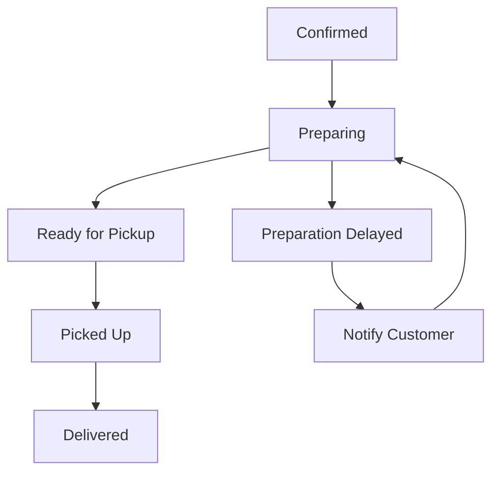

# Software Requirements Specification (SRS)

## Part 02D: Merchant Order Management

**Module:** Merchant Module (Part 03)
**Version:** 1.0.0
**Status:** Final / For Review
**Date:** 2026-06-30

---

## Chapter 1 – Overview

### Purpose

The Merchant Order Management module defines the complete workflow for merchants to receive, process, fulfill, and manage customer orders on the **[Platform Name]** platform. This encompasses order intake, confirmation, preparation tracking, fulfillment coordination, and post-order actions such as cancellations, refunds, and customer communication.

Order management is the operational core of the merchant experience. Efficient, intuitive, and reliable order processing directly impacts merchant satisfaction, customer experience, and platform economics. Delays, errors, or confusion in order management cascade into poor customer ratings, refunds, and lost revenue.

### Objectives

- Enable real-time order intake with visual and audible alerts
- Provide intuitive workflows for order confirmation, preparation, and readiness
- Support Kitchen Display System (KDS) for efficient kitchen operations
- Enable seamless coordination with drivers for pickup and delivery
- Provide comprehensive order history and search capabilities
- Support cancellation and refund workflows with clear business rules
- Enable customer communication directly from order management
- Provide operational insights and performance metrics

---

## Chapter 2 – Order Intake

### MER-061 Order Receipt Methods

| Method | Description | Priority |
| :--- | :--- | :--- |
| **Automated Acceptance** | Orders automatically accepted (for high-volume merchants). | **Required** |
| **Manual Acceptance** | Merchant confirms each order before preparation. | **Required** |
| **Scheduled Orders** | Orders placed for future delivery. | **Required** |
| **Pre-Orders** | Advance orders with specific preparation time. | **Required** |
| **POS Integration Orders** | Orders synced directly from POS system. | **Required** |
| **API Orders** | Orders placed via third-party integrations. | **Medium** |

### MER-062 Order Alert System

| Alert Type | Description | Priority |
| :--- | :--- | :--- |
| **Visual Alert** | New order card appears in dashboard. | **Required** |
| **Audible Alert** | Distinct sound for new orders. | **Required** |
| **Push Notification** | Mobile notification to merchant app. | **Required** |
| **Email Alert** | Email notification for new orders (optional). | **Low** |
| **KDS Alert** | Order appears on Kitchen Display System. | **Required** |
| **POS Alert** | Order notification in POS system (if integrated). | **Required** |

### MER-063 Order Alert Configuration

| Configuration | Options | Priority |
| :--- | :--- | :--- |
| **Sound Selection** | Multiple sound options for alerts. | **Medium** |
| **Alert Volume** | Volume control for audible alerts. | **Medium** |
| **Alert Channels** | Dashboard, SMS, Email, Push, KDS, POS. | **Required** |
| **Quiet Hours** | Silence alerts during specific hours. | **Medium** |
| **Priority Orders** | Different alert for high-value or VIP orders. | **Low** |

### MER-064 Incoming Order Card

| Displayed Information | Description |
| :--- | :--- |
| **Order ID** | Unique identifier with human-readable format. |
| **Customer Name** | Name of the customer. |
| **Order Time** | Time the order was placed. |
| **Scheduled Time** | If scheduled, the requested delivery time. |
| **Item Summary** | List of ordered items with quantities. |
| **Order Total** | Total value of the order. |
| **Delivery Address** | Customer's delivery address. |
| **Customer Instructions** | Special instructions from customer. |
| **Preparation Timer** | Countdown for expected prep time. |
| **Actions** | Confirm, Decline, View Details, Contact Customer. |

---

## Chapter 3 – Order Confirmation & Acceptance

### MER-065 Manual Order Acceptance Workflow

1.  New order arrives (visual/audible alert).
2.  Merchant views order details:
    - Items ordered with modifiers
    - Customer delivery address
    - Special instructions
    - Order total and payment method
3.  Merchant evaluates:
    - Are all items available?
    - Can the order be fulfilled within estimated time?
    - Is delivery address within service area?
4.  Merchant selects one of the following:
    - **Confirm Order:** Order proceeds to preparation.
    - **Decline Order:** Order rejected with reason.
    - **Contact Customer:** Clarify details before confirming.
    - **View Details:** Full order view before decision.

### MER-066 Order Confirmation Rules

| Rule | Description |
| :--- | :--- |
| **Confirmation Timeout** | Orders not confirmed within X minutes (configurable) are automatically declined or escalated. |
| **Availability Check** | Merchant must confirm all items are available. |
| **Preparation Time** | Merchant confirms estimated preparation time. |
| **Payment Validation** | Payment method must be validated. |
| **Delivery Zone** | Address must be within merchant's delivery zone. |
| **Minimum Order** | Order total must meet minimum order value. |
| **Duplicate Check** | Idempotency check ensures no duplicate confirmations. |

### MER-067 Auto-Acceptance Rules

| Rule | Description | Priority |
| :--- | :--- | :--- |
| **Business Hours** | Auto-accept only during operating hours. | **Required** |
| **Preparation Capacity** | Auto-accept if order volume is within capacity. | **Required** |
| **Inventory Availability** | Auto-accept only if all items are in stock. | **Required** |
| **Order Value** | Auto-accept if order meets minimum value. | **Required** |
| **VIP Customers** | Auto-accept for VIP/repeat customers. | **Medium** |
| **Time-Based** | Auto-accept during specific times of day. | **Medium** |

---

## Chapter 4 – Order Preparation

### MER-068 Preparation Status Workflow

### MER-069 Preparation Status Transitions

| Transition | Trigger | Description |
| :--- | :--- | :--- |
| **Confirmed → Preparing** | Merchant starts preparation. | Kitchen begins working on the order. |
| **Preparing → Ready** | Merchant marks order as ready. | Order is packed and ready for pickup. |
| **Ready → Picked Up** | Driver picks up the order. | Automatic transition (driver action). |
| **Preparing → Delayed** | Merchant reports delay. | Notification sent to customer. |
| **Delayed → Preparing** | Merchant resumes preparation. | Delay resolved, preparation continues. |

### MER-070 Preparation Management Features

| Feature | Description | Priority |
| :--- | :--- | :--- |
| **Preparation Timer** | Track time from confirmation to readiness. | **Required** |
| **Priority Ordering** | VIP/large orders marked as priority. | **Required** |
| **Preparation Notes** | Internal notes for kitchen staff. | **Required** |
| **Item Substitution** | Suggest substitute if item is unavailable. | **Medium** |
| **Batch Preparation** | Group similar orders for efficiency. | **Low** |
| **Preparation Progress** | Mark individual items as prepared. | **Medium** |

### MER-071 Order Delay Handling

| Scenario | Action | Priority |
| :--- | :--- | :--- |
| **Minor Delay** (< 5 mins) | No action; status remains "Preparing". | **Required** |
| **Moderate Delay** (5-15 mins) | Merchant marks "Preparation Delayed"; customer notified. | **Required** |
| **Major Delay** (> 15 mins) | Customer notified; platform may offer compensation. | **Required** |
| **Unavoidable Delay** | Merchant contacts customer directly via chat/call. | **Required** |
| **Item Unavailability** | Merchant contacts customer to suggest substitutes. | **Required** |

---

## Chapter 5 – Kitchen Display System (KDS)

### MER-072 KDS Features

| Feature | Description | Priority |
| :--- | :--- | :--- |
| **Order Queue** | Real-time list of orders in progress. | **Required** |
| **Order Cards** | Visual cards showing order details. | **Required** |
| **Status Colors** | Color-coded status (New, In Progress, Ready). | **Required** |
| **Prep Timer** | Countdown timer for each order. | **Required** |
| **Order Bumping** | Staff moves order through stages. | **Required** |
| **Sound Alerts** | Audible alerts for new orders. | **Required** |
| **Kitchen Notes** | Internal notes displayed on order card. | **Required** |
| **Re-order Display** | Substitution suggestions for unavailable items. | **Medium** |
| **Printer Integration** | Print order tickets/labels. | **Required** |
| **Pause Orders** | Temporarily pause incoming orders. | **Medium** |

### MER-073 KDS Order Card

| Element | Description |
| :--- | :--- |
| **Order Number** | Human-readable order ID. |
| **Time Since Order** | Time elapsed since order placement. |
| **Customer Name** | Name of the customer. |
| **Items** | List of items with quantities. |
| **Modifiers** | Customization details for each item. |
| **Special Instructions** | Customer-provided instructions. |
| **Prep Timer** | Countdown showing remaining prep time. |
| **Status** | New, In Progress, Ready, Delayed. |
| **Actions** | Start Prep, Mark Ready, Delay Report. |

### MER-074 KDS Configuration

| Configuration | Options | Priority |
| :--- | :--- | :--- |
| **Display Layout** | Grid vs. List vs. Kanban. | **Medium** |
| **Order Sorting** | Sort by time, priority, or status. | **Required** |
| **Sound Settings** | Customize new order sounds. | **Medium** |
| **Auto-Bump** | Auto-mark orders after prep time elapses. | **Low** |
| **Printer Mapping** | Map order types to specific printers. | **Medium** |
| **Kitchen Stations** | Assign orders to specific kitchen stations. | **Medium** |

---

## Chapter 6 – Order Fulfillment

### MER-075 Fulfillment Coordination

| Feature | Description | Priority |
| :--- | :--- | :--- |
| **Driver Assignment** | Driver automatically assigned to ready orders. | **Required** |
| **Pickup Notification** | Driver notified when order is ready. | **Required** |
| **Driver Arrival** | Driver marks arrival at merchant location. | **Required** |
| **Order Handoff** | Driver confirms pickup from merchant. | **Required** |
| **Handoff Verification** | Merchant confirms order handoff to driver. | **Required** |
| **Driver Communication** | Merchant can contact driver via chat/call. | **Required** |

### MER-076 Order Handoff Process

1.  Merchant marks order as "Ready for Pickup".
2.  System notifies available drivers.
3.  Driver accepts the order assignment.
4.  Driver navigates to merchant location.
5.  Driver arrives and notifies merchant.
6.  Merchant hands over the order to driver.
7.  Driver verifies order items against ticket.
8.  Driver confirms pickup in driver app.
9.  Merchant sees order status "Picked Up".
10. Order tracking begins for customer.

### MER-077 Handoff Verification Methods

| Method | Description | Priority |
| :--- | :--- | :--- |
| **QR Code Scan** | Driver scans merchant QR code to confirm pickup. | **Required** |
| **GPS Verification** | Driver GPS must be at merchant location. | **Required** |
| **Manual Confirmation** | Merchant clicks "Handed to Driver" button. | **Required** |
| **Photo Proof** | Driver takes photo of order with merchant. | **Medium** |
| **Code Entry** | Driver enters merchant-provided pickup code. | **Medium** |

---

## Chapter 7 – Order History & Search

### MER-078 Order History Features

| Feature | Description | Priority |
| :--- | :--- | :--- |
| **Order List** | Paginated list of historical orders. | **Required** |
| **Date Range Filter** | Filter orders by date range. | **Required** |
| **Status Filter** | Filter by order status (Confirmed, Preparing, Ready, Delivered, Cancelled). | **Required** |
| **Search** | Search by order ID, customer name, or items. | **Required** |
| **Sorting** | Sort by date, total, customer, or status. | **Required** |
| **Order Export** | Export order data to CSV/Excel. | **Required** |
| **Order Analytics** | Aggregated metrics from order history. | **Required** |
| **Customer Lookup** | View all orders for a specific customer. | **Required** |

### MER-079 Order Detail View (Historical)

| Section | Displayed Information |
| :--- | :--- |
| **Order Header** | Order ID, status, customer name, order time, total. |
| **Order Timeline** | Chronological status changes with timestamps. |
| **Item Details** | All items with quantities, modifiers, and prices. |
| **Financial Summary** | Subtotal, delivery fee, tax, discount, total. |
| **Customer Information** | Name, phone, delivery address, instructions. |
| **Driver Information** | Driver name, pickup time, delivery time. |
| **Settlement Details** | Commission, net earnings, settlement status. |
| **Actions** | Re-order, Contact Customer, Print Receipt. |

---

## Chapter 8 – Order Cancellation & Refunds

### MER-080 Cancellation Scenarios

| Scenario | Initiator | Description |
| :--- | :--- | :--- |
| **Pre-Confirmation** | Customer | Customer cancels before merchant confirmation. |
| **Pre-Confirmation** | Merchant | Merchant declines the order. |
| **Post-Confirmation** | Merchant | Merchant cancels after confirming (out of stock, etc.). |
| **Post-Confirmation** | Customer | Customer requests cancellation (merchant approval required). |
| **Preparation** | Merchant | Merchant cancels during preparation (unavoidable issue). |
| **Post-Ready** | Merchant | Merchant cancels after marking ready (rare, driver not assigned). |
| **Platform** | Admin | Admin-initiated cancellation (policy violation, fraud). |

### MER-081 Cancellation Workflow

1.  Cancellation request initiated.
2.  System validates cancellation eligibility.
3.  If eligible, cancellation proceeds:
    - Order status updated to `CANCELLED`.
    - Customer notified via push/email.
    - Refund initiated (if payment was captured).
    - Inventory restored (if items were deducted).
4.  If not eligible, request escalated to support.
5.  Cancellation reason recorded for analytics.
6.  Merchant receives confirmation.

### MER-082 Cancellation Business Rules

| Rule | Description |
| :--- | :--- |
| **Pre-Confirmation** | Customer can cancel without penalty (auto-approved). |
| **Post-Confirmation, Pre-Preparation** | Cancellation requires merchant approval; customer may incur fee. |
| **During Preparation** | Cancellation requires merchant approval; full refund may not be available. |
| **Post-Ready** | Cancellation not permitted (order is in fulfillment pipeline). |
| **Merchant Cancellation** | Full refund required if merchant cancels (no fault of customer). |
| **Fee Retention** | Platform may retain delivery/service fees for cancellations. |
| **Refund Timeline** | Wallet refunds: instant; Card refunds: 3-5 business days. |

### MER-083 Refund Management

| Feature | Description | Priority |
| :--- | :--- | :--- |
| **Full Refund** | Complete refund of order total. | **Required** |
| **Partial Refund** | Refund of specific items (missing/wrong items). | **Required** |
| **Wallet Refund** | Refund to platform wallet (instant). | **Required** |
| **Card Refund** | Refund to original payment method. | **Required** |
| **Voucher Refund** | Refund as platform voucher (with bonus). | **Medium** |
| **Refund Tracking** | Track refund status and timeline. | **Required** |
| **Refund History** | Historical refund records. | **Required** |

---

## Chapter 9 – Customer Communication

### MER-084 Communication Channels

| Channel | Description | Priority |
| :--- | :--- | :--- |
| **In-App Chat** | Real-time text chat with customer. | **Required** |
| **Voice Call** | Masked phone call to customer. | **Required** |
| **In-App Notifications** | Status updates sent to customer app. | **Required** |
| **Email** | Transactional emails (confirmation, updates). | **Required** |
| **SMS** | SMS notifications (if customer opted-in). | **Required** |

### MER-085 Communication Use Cases

| Scenario | Message Type | Trigger |
| :--- | :--- | :--- |
| **Order Confirmation** | Automated | Order confirmed by merchant. |
| **Preparation Started** | Automated | Merchant starts preparation. |
| **Order Ready** | Automated | Merchant marks order ready. |
| **Delay Notification** | Automated/Semi-Automated | Merchant reports delay. |
| **Item Substitution** | Manual | Item unavailable; merchant offers alternative. |
| **Cancellation** | Automated | Order cancelled. |
| **Customer Inquiry** | Manual | Customer asks a question. |
| **Issue Resolution** | Manual | Customer reports issue with order. |

### MER-086 Chat Features

| Feature | Description | Priority |
| :--- | :--- | :--- |
| **Real-Time Messaging** | Instant text messaging. | **Required** |
| **Read Receipts** | See when message was read. | **Required** |
| **Typing Indicators** | Show when other party is typing. | **Required** |
| **File Sharing** | Share images (e.g., menu, location). | **Medium** |
| **Message History** | Persistent chat history for order. | **Required** |
| **Translation** | Auto-translate messages (multi-language). | **Future** |
| **Quick Replies** | Pre-set responses for common messages. | **Medium** |

---

## Chapter 10 – Order Analytics

### MER-087 Order Metrics Dashboard

| Metric | Description | Priority |
| :--- | :--- | :--- |
| **Total Orders** | Total orders in selected period. | **Required** |
| **Order Value** | Average order value (AOV) and total revenue. | **Required** |
| **Preparation Time** | Average preparation time (confirmed → ready). | **Required** |
| **Fulfillment Time** | Average time from order to delivery. | **Required** |
| **Cancellation Rate** | Percentage of orders cancelled. | **Required** |
| **Confirmation Rate** | Percentage of orders confirmed vs. declined. | **Required** |
| **Peak Hours** | Hourly distribution of orders. | **Required** |
| **Top Items** | Most ordered items. | **Required** |
| **Customer Retention** | New vs. returning customers. | **Required** |
| **Driver Performance** | Time to pickup, delivery times. | **Required** |

### MER-088 Order Reports

| Report | Description | Schedule | Priority |
| :--- | :--- | :--- | :--- |
| **Daily Order Summary** | Orders, revenue, cancellations by day. | Daily | **Required** |
| **Weekly Order Report** | Weekly performance metrics. | Weekly | **Required** |
| **Monthly Order Report** | Monthly summary with comparisons. | Monthly | **Required** |
| **Peak Hours Report** | Hourly order distribution. | Monthly | **Required** |
| **Item Performance** | Best and worst performing items. | Monthly | **Required** |
| **Customer Report** | Customer acquisition and retention. | Monthly | **Required** |
| **Export** | CSV/Excel/PDF download. | On-demand | **Required** |

---

## Chapter 11 – Database Tables

### merchant_orders

| Column | Type | Constraints | Description |
| :--- | :--- | :--- | :--- |
| `order_id` | UUID | PRIMARY KEY | Unique order identifier |
| `store_id` | UUID | FOREIGN KEY (merchant_stores.store_id) | Store fulfilling the order |
| `customer_id` | UUID | FOREIGN KEY (customers.customer_id) | Customer who placed the order |
| `driver_id` | UUID | FOREIGN KEY (drivers.driver_id) | Assigned driver |
| `order_reference` | VARCHAR(50) | UNIQUE, NOT NULL | Human-readable order number |
| `status` | VARCHAR(20) | NOT NULL | PENDING/CONFIRMED/PREPARING/READY/PICKED_UP/DELIVERED/CANCELLED/REFUNDED |
| `order_data` | JSONB | NOT NULL | Full order snapshot (items, modifiers, prices) |
| `subtotal` | DECIMAL(12, 2) | NOT NULL | Item total |
| `delivery_fee` | DECIMAL(12, 2) | DEFAULT 0 | Delivery charge |
| `service_fee` | DECIMAL(12, 2) | DEFAULT 0 | Platform service fee |
| `tax` | DECIMAL(12, 2) | DEFAULT 0 | Tax amount |
| `discount` | DECIMAL(12, 2) | DEFAULT 0 | Discount amount |
| `total` | DECIMAL(12, 2) | NOT NULL | Order total |
| `currency` | VARCHAR(3) | NOT NULL | ISO 4217 currency code |
| `payment_method` | VARCHAR(50) | NOT NULL | Payment method used |
| `payment_status` | VARCHAR(20) | DEFAULT 'PENDING' | PENDING/AUTHORIZED/CAPTURED/REFUNDED/FAILED |
| `delivery_address` | JSONB | NOT NULL | Delivery address snapshot |
| `customer_instructions` | TEXT | | Customer special instructions |
| `internal_notes` | TEXT | | Merchant internal notes |
| `preparation_time` | INTEGER | | Actual prep time in minutes |
| `estimated_prep_time` | INTEGER | | Estimated prep time at order time |
| `delivery_time` | INTEGER | | Total delivery time in minutes |
| `is_scheduled` | BOOLEAN | DEFAULT FALSE | Scheduled order flag |
| `scheduled_time` | TIMESTAMP | | Requested delivery time |
| `cancellation_reason` | VARCHAR(50) | | Reason for cancellation |
| `cancelled_by` | VARCHAR(20) | | CUSTOMER/MERCHANT/PLATFORM |
| `cancelled_at` | TIMESTAMP | | Cancellation timestamp |
| `confirmed_at` | TIMESTAMP | | Confirmation timestamp |
| `preparing_at` | TIMESTAMP | | Preparation start timestamp |
| `ready_at` | TIMESTAMP | | Ready for pickup timestamp |
| `picked_up_at` | TIMESTAMP | | Pickup timestamp |
| `delivered_at` | TIMESTAMP | | Delivery timestamp |
| `created_at` | TIMESTAMP | DEFAULT NOW() | Order creation timestamp |
| `updated_at` | TIMESTAMP | DEFAULT NOW() | Last update timestamp |

### order_items

| Column | Type | Constraints | Description |
| :--- | :--- | :--- | :--- |
| `order_item_id` | UUID | PRIMARY KEY | Unique identifier |
| `order_id` | UUID | FOREIGN KEY (merchant_orders.order_id) | Associated order |
| `item_id` | UUID | FOREIGN KEY (menu_items.item_id) | Menu item (snapshot reference) |
| `item_name` | VARCHAR(255) | NOT NULL | Item name (snapshot) |
| `item_price` | DECIMAL(12, 2) | NOT NULL | Item price at order time |
| `quantity` | INTEGER | NOT NULL | Quantity ordered |
| `subtotal` | DECIMAL(12, 2) | NOT NULL | Item subtotal (price * quantity) |
| `modifiers` | JSONB | | Modifiers snapshot |
| `special_instructions` | TEXT | | Item-specific instructions |
| `status` | VARCHAR(20) | DEFAULT 'PENDING' | PENDING/PREPARING/READY/CANCELLED |
| `created_at` | TIMESTAMP | DEFAULT NOW() | Creation timestamp |
| `updated_at` | TIMESTAMP | DEFAULT NOW() | Last update timestamp |

### order_status_history

| Column | Type | Constraints | Description |
| :--- | :--- | :--- | :--- |
| `history_id` | UUID | PRIMARY KEY | Unique identifier |
| `order_id` | UUID | FOREIGN KEY (merchant_orders.order_id) | Associated order |
| `status` | VARCHAR(20) | NOT NULL | Status at this point |
| `source` | VARCHAR(20) | NOT NULL | CUSTOMER/MERCHANT/DRIVER/SYSTEM/ADMIN |
| `source_id` | UUID | | User/driver ID who triggered |
| `reason` | TEXT | | Reason for status change |
| `metadata` | JSONB | | Additional context |
| `created_at` | TIMESTAMP | DEFAULT NOW() | Status timestamp |

### order_delays

| Column | Type | Constraints | Description |
| :--- | :--- | :--- | :--- |
| `delay_id` | UUID | PRIMARY KEY | Unique identifier |
| `order_id` | UUID | FOREIGN KEY (merchant_orders.order_id) | Associated order |
| `reason` | VARCHAR(100) | NOT NULL | Reason for delay |
| `duration` | INTEGER | | Delay duration in minutes |
| `customer_notified` | BOOLEAN | DEFAULT FALSE | Customer notification status |
| `compensation_offered` | BOOLEAN | DEFAULT FALSE | Compensation offered status |
| `created_at` | TIMESTAMP | DEFAULT NOW() | Delay creation timestamp |
| `resolved_at` | TIMESTAMP | | Resolution timestamp |

### order_cancellations

| Column | Type | Constraints | Description |
| :--- | :--- | :--- | :--- |
| `cancellation_id` | UUID | PRIMARY KEY | Unique identifier |
| `order_id` | UUID | FOREIGN KEY (merchant_orders.order_id) | Associated order |
| `cancelled_by` | VARCHAR(20) | NOT NULL | CUSTOMER/MERCHANT/PLATFORM/DRIVER |
| `cancelled_by_id` | UUID | | User/driver ID |
| `reason` | VARCHAR(100) | NOT NULL | Reason for cancellation |
| `reason_description` | TEXT | | Detailed reason |
| `refund_amount` | DECIMAL(12, 2) | | Refund amount (if any) |
| `refund_method` | VARCHAR(20) | | WALLET/ORIGINAL/VOUCHER |
| `refund_status` | VARCHAR(20) | | PENDING/PROCESSING/COMPLETED/FAILED |
| `created_at` | TIMESTAMP | DEFAULT NOW() | Cancellation timestamp |
| `processed_at` | TIMESTAMP | | Refund processed timestamp |

---

## Chapter 12 – REST APIs

### Order Management APIs

| Method | Endpoint | Description |
| :--- | :--- | :--- |
| `GET` | `/api/v1/merchant/orders` | List orders with filters |
| `GET` | `/api/v1/merchant/orders/{id}` | Get order details |
| `GET` | `/api/v1/merchant/orders/{id}/timeline` | Get order timeline |
| `PUT` | `/api/v1/merchant/orders/{id}/confirm` | Confirm order |
| `PUT` | `/api/v1/merchant/orders/{id}/decline` | Decline order |
| `PUT` | `/api/v1/merchant/orders/{id}/prepare` | Start preparation |
| `PUT` | `/api/v1/merchant/orders/{id}/ready` | Mark order as ready |
| `PUT` | `/api/v1/merchant/orders/{id}/delay` | Report delay |
| `PUT` | `/api/v1/merchant/orders/{id}/cancel` | Cancel order |
| `PUT` | `/api/v1/merchant/orders/{id}/handoff` | Confirm handoff to driver |
| `POST` | `/api/v1/merchant/orders/export` | Export orders |

### KDS APIs

| Method | Endpoint | Description |
| :--- | :--- | :--- |
| `GET` | `/api/v1/merchant/kds/orders` | Get KDS order queue |
| `GET` | `/api/v1/merchant/kds/orders/{id}` | Get KDS order card |
| `PUT` | `/api/v1/merchant/kds/orders/{id}/bump` | Bump order status |
| `PUT` | `/api/v1/merchant/kds/orders/{id}/note` | Add kitchen note |
| `POST` | `/api/v1/merchant/kds/orders/{id}/print` | Print order ticket |
| `PUT` | `/api/v1/merchant/kds/settings` | Update KDS configuration |

### Cancellation APIs

| Method | Endpoint | Description |
| :--- | :--- | :--- |
| `GET` | `/api/v1/merchant/orders/{id}/cancellation-eligibility` | Check cancellation eligibility |
| `POST` | `/api/v1/merchant/orders/{id}/cancel` | Request cancellation |
| `GET` | `/api/v1/merchant/cancellations` | List cancellations |
| `GET` | `/api/v1/merchant/cancellations/{id}` | Get cancellation details |

### Communication APIs

| Method | Endpoint | Description |
| :--- | :--- | :--- |
| `GET` | `/api/v1/merchant/orders/{id}/messages` | Get chat history |
| `POST` | `/api/v1/merchant/orders/{id}/messages` | Send message to customer |
| `POST` | `/api/v1/merchant/orders/{id}/call` | Initiate masked call |
| `PUT` | `/api/v1/merchant/orders/{id}/messages/{id}/read` | Mark message as read |

---

## Chapter 13 – Business Rules

| Rule ID | Rule Description | Priority |
| :--- | :--- | :--- |
| **BR-OM-001** | Orders must be confirmed within 5 minutes of receipt (configurable). | **High** |
| **BR-OM-002** | Items cannot be modified after confirmation. | **High** |
| **BR-OM-003** | Orders cannot be marked ready without being confirmed and prepared. | **High** |
| **BR-OM-004** | Cancellation before confirmation is auto-approved (customer). | **High** |
| **BR-OM-005** | Cancellation after confirmation requires merchant approval. | **High** |
| **BR-OM-006** | Merchant cancellations require full refund to customer. | **High** |
| **BR-OM-007** | Order handoff requires driver GPS verification at merchant location. | **High** |
| **BR-OM-008** | Customer notifications must be sent for all status changes. | **High** |
| **BR-OM-009** | Preparation time tracking starts at confirmation, ends at ready. | **High** |
| **BR-OM-010** | Delays exceeding 5 minutes trigger customer notification. | **High** |

---

## Chapter 14 – Acceptance Tests

| Test ID | Test Description | Priority |
| :--- | :--- | :--- |
| **TEST-OM-001** | New order arrives with visual and audible alert. | **High** |
| **TEST-OM-002** | Merchant views incoming order details. | **High** |
| **TEST-OM-003** | Merchant confirms an order. | **High** |
| **TEST-OM-004** | Merchant declines an order with reason. | **High** |
| **TEST-OM-005** | Order auto-confirmed based on configuration rules. | **High** |
| **TEST-OM-006** | Merchant starts preparation on confirmed order. | **High** |
| **TEST-OM-007** | Merchant marks order as ready for pickup. | **High** |
| **TEST-OM-008** | Merchant reports order delay (customer notified). | **High** |
| **TEST-OM-009** | Driver arrives and picks up order; merchant confirms handoff. | **High** |
| **TEST-OM-010** | Order status updates flow correctly (state machine). | **High** |
| **TEST-OM-011** | Merchant views order timeline. | **High** |
| **TEST-OM-012** | Merchant filters orders by status and date. | **High** |
| **TEST-OM-013** | Merchant searches for orders by ID or customer name. | **High** |
| **TEST-OM-014** | Customer cancels order before confirmation (auto-approved). | **High** |
| **TEST-OM-015** | Customer requests cancellation after confirmation (merchant approval required). | **High** |
| **TEST-OM-016** | Merchant cancels confirmed order (full refund processed). | **High** |
| **TEST-OM-017** | Refund processed to wallet (instant). | **High** |
| **TEST-OM-018** | Refund processed to original payment method. | **High** |
| **TEST-OM-019** | Merchant communicates with customer via in-app chat. | **High** |
| **TEST-OM-020** | Merchant initiates masked call to customer. | **High** |
| **TEST-OM-021** | KDS shows orders in queue. | **High** |
| **TEST-OM-022** | Kitchen bumps order through stages on KDS. | **High** |
| **TEST-OM-023** | KDS prints order ticket. | **High** |
| **TEST-OM-024** | Merchant views order analytics dashboard. | **High** |
| **TEST-OM-025** | Merchant exports order report (CSV/Excel). | **High** |
| **TEST-OM-026** | Item substitution suggested for unavailable item. | **Medium** |
| **TEST-OM-027** | Scheduled order displayed correctly at scheduled time. | **High** |
| **TEST-OM-028** | Merchant receives push notification for new order. | **High** |

---

## Chapter 15 – Traceability Matrix

| Requirement | Database Table | API Endpoint(s) | Acceptance Test |
| :--- | :--- | :--- | :--- |
| MER-061 | merchant_orders | GET /api/v1/merchant/orders | TEST-OM-001 |
| MER-062 | merchant_orders | GET /api/v1/merchant/orders/{id} | TEST-OM-002 |
| MER-065 | merchant_orders | PUT /api/v1/merchant/orders/{id}/confirm | TEST-OM-003 |
| MER-065 | merchant_orders | PUT /api/v1/merchant/orders/{id}/decline | TEST-OM-004 |
| MER-066 | merchant_orders | PUT /api/v1/merchant/orders/{id}/confirm | TEST-OM-005 |
| MER-068 | merchant_orders | PUT /api/v1/merchant/orders/{id}/prepare | TEST-OM-006 |
| MER-068 | merchant_orders | PUT /api/v1/merchant/orders/{id}/ready | TEST-OM-007 |
| MER-071 | order_delays | PUT /api/v1/merchant/orders/{id}/delay | TEST-OM-008 |
| MER-075 | merchant_orders | PUT /api/v1/merchant/orders/{id}/handoff | TEST-OM-009 |
| MER-068 | order_status_history | GET /api/v1/merchant/orders/{id}/timeline | TEST-OM-010 |
| MER-078 | merchant_orders | GET /api/v1/merchant/orders | TEST-OM-011, TEST-OM-012, TEST-OM-013 |
| MER-080 | order_cancellations | PUT /api/v1/merchant/orders/{id}/cancel | TEST-OM-014, TEST-OM-015, TEST-OM-016 |
| MER-083 | order_cancellations | GET /api/v1/merchant/cancellations | TEST-OM-017, TEST-OM-018 |
| MER-084 | merchant_orders | GET/POST /api/v1/merchant/orders/{id}/messages | TEST-OM-019 |
| MER-085 | merchant_orders | POST /api/v1/merchant/orders/{id}/call | TEST-OM-020 |
| MER-072 | merchant_orders | GET /api/v1/merchant/kds/orders | TEST-OM-021, TEST-OM-022, TEST-OM-023 |
| MER-087 | merchant_orders | GET /api/v1/merchant/analytics/orders | TEST-OM-024, TEST-OM-025 |

---

## Chapter 16 – Summary

This document establishes the complete merchant order management capability for the **[Platform Name]** platform. Key takeaways:

- **Real-Time Order Intake:** Visual and audible alerts with configurable acceptance workflows (manual or auto).
- **Efficient Workflows:** Streamlined confirmation → preparation → ready → handoff pipeline with clear status transitions.
- **Kitchen Display System:** Dedicated KDS for kitchen staff with order queue, timers, bumping, and printing capabilities.
- **Fulfillment Coordination:** Seamless integration with driver assignment, pickup verification, and handoff confirmation.
- **Order History & Search:** Comprehensive search, filtering, and export capabilities for operational visibility.
- **Cancellation & Refunds:** Clear business rules for cancellations with support for full, partial, wallet, and card refunds.
- **Customer Communication:** In-app chat and masked calling for real-time issue resolution.
- **Actionable Analytics:** Dashboards and reports for order performance, preparation times, and operational efficiency.

The merchant order management module is the operational engine of the platform. Its efficiency and reliability directly impact customer satisfaction, merchant retention, and platform profitability.

---

**Next Document:**

`Part_02E_Merchant_Store_Operations.md`

*(This builds on order management to define store operations including scheduling, staff management, inventory management, and operational settings.)*
