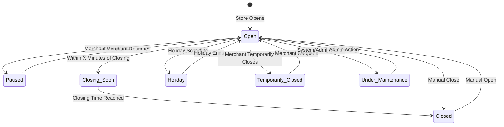

# Software Requirements Specification (SRS)

## Part 02E: Merchant Store Operations

**Module:** Merchant Module (Part 03)
**Version:** 1.0.0
**Status:** Final / For Review
**Date:** 2026-06-30

---

## Chapter 1 – Overview

### Purpose

The Merchant Store Operations module defines the comprehensive capabilities for merchants to manage their store's day-to-day operations on the **[Platform Name]** platform. This encompasses operational settings, staff management, scheduling, break/closure management, capacity control, and multi-store coordination for chains.

Store operations are the backbone of merchant reliability. A well-managed store with accurate operating hours, appropriate staffing, and clear operational policies ensures consistent order fulfillment, positive customer experiences, and efficient platform coordination.

### Objectives

- Enable precise control over store opening hours and closures
- Provide staff management with role-based access control
- Support store capacity management to prevent overloading
- Enable holiday and special event scheduling
- Provide operational insights and compliance reporting
- Support multi-store management for chains and enterprises
- Enable seamless integration with POS and other operational systems

---

## Chapter 2 – Store Settings & Configuration

### MER-089 Operational Settings

| Setting | Description | Priority |
| :--- | :--- | :--- |
| **Store Name** | Display name for the store. | **Required** |
| **Store Description** | Brief description for customer visibility. | **Required** |
| **Store Logo** | Brand logo for storefront. | **Required** |
| **Store Cover Image** | Hero image for store listing. | **Required** |
| **Store Categories** | Primary categories (cuisine, type). | **Required** |
| **Contact Information** | Phone, email, website. | **Required** |
| **Address & Location** | Physical address and geocoordinates. | **Required** |
| **Operating Hours** | Regular operating schedule. | **Required** |
| **Special Hours** | Holiday and event hours. | **Required** |
| **Delivery Settings** | Zones, fees, minimum order. | **Required** |
| **Pickup Settings** | In-store pickup configuration. | **Required** |
| **Preparation Time** | Default and item-level prep times. | **Required** |
| **Store Status** | Open/Closed/Paused. | **Required** |
| **Store Visibility** | Visible/Hidden from customers. | **Required** |

### MER-090 Operating Hours Configuration

| Attribute | Type | Required | Description |
| :--- | :--- | :--- | :--- |
| `day_of_week` | Integer | Yes | 0 = Sunday, 1 = Monday, ..., 6 = Saturday |
| `is_open` | Boolean | Yes | Store open on this day |
| `opening_time` | Time | Conditional | Opening time (HH:MM) |
| `closing_time` | Time | Conditional | Closing time (HH:MM) |
| `break_start` | Time | No | Start of break period (if any) |
| `break_end` | Time | No | End of break period |
| `is_24_hours` | Boolean | Default false | 24-hour operation |

### MER-091 Operating Hours Example

| Day | Open | Open Time | Close Time | Break Start | Break End |
| :--- | :--- | :--- | :--- | :--- | :--- |
| Monday | ✅ | 08:00 | 22:00 | 15:00 | 16:00 |
| Tuesday | ✅ | 08:00 | 22:00 | 15:00 | 16:00 |
| Wednesday | ✅ | 08:00 | 22:00 | 15:00 | 16:00 |
| Thursday | ✅ | 08:00 | 23:00 | — | — |
| Friday | ✅ | 09:00 | 23:00 | — | — |
| Saturday | ✅ | 09:00 | 23:00 | — | — |
| Sunday | ✅ | 09:00 | 22:00 | — | — |

---

## Chapter 3 – Store Status Management

### MER-092 Store Statuses

| Status | Description | Customer Facing |
| :--- | :--- | :--- |
| **Open** | Store is operating normally and accepting orders. | "Open" |
| **Closing Soon** | Store is closing within X minutes; accepting limited orders. | "Closing Soon" |
| **Paused** | Store temporarily paused (e.g., staff break, prep time). | "Currently Unavailable" |
| **Closed** | Store is closed; no orders accepted. | "Closed" |
| **Holiday** | Store closed for holiday. | "Closed for Holiday" |
| **Temporarily Closed** | Store temporarily closed (e.g., renovation). | "Temporarily Closed" |
| **Under Maintenance** | Store unavailable for system/operational reasons. | "Unavailable" |

### MER-093 Status Transitions

### MER-094 Pause Store Feature

| Feature | Description | Priority |
| :--- | :--- | :--- |
| **Quick Pause** | One-click pause with optional duration. | **Required** |
| **Scheduled Pause** | Schedule pauses for breaks or shifts. | **Required** |
| **Pause Reason** | Select or provide reason for pausing. | **Required** |
| **Auto-Resume** | Resume automatically at scheduled time. | **Required** |
| **Customer Notification** | Notify customers of temporary unavailability. | **Required** |
| **Order Buffer** | Complete current orders before pausing. | **Required** |
| **Pause History** | Audit log of pauses and resume actions. | **Medium** |

### MER-095 Pause Use Cases

| Scenario | Description | Recommended Action |
| :--- | :--- | :--- |
| **Staff Break** | Kitchen staff taking a break. | Pause for 15-30 minutes; auto-resume. |
| **Between Meals** | Transitioning from lunch to dinner menu. | Pause for 15 minutes; auto-resume. |
| **Inventory Issue** | Need to restock before accepting more orders. | Pause until stock is replenished. |
| **Kitchen Backup** | Orders are backlogged; need time to catch up. | Pause until backlog is cleared. |
| **Staff Shortage** | Not enough staff to handle orders. | Pause until adequate staff available. |
| **Equipment Issue** | Equipment failure impacting operations. | Pause until issue is resolved. |

---

## Chapter 4 – Holiday & Exception Management

### MER-096 Holiday Management

| Feature | Description | Priority |
| :--- | :--- | :--- |
| **Add Holiday** | Schedule store closure for specific date(s). | **Required** |
| **Recurring Holidays** | Annual recurrence (e.g., Christmas, New Year). | **Required** |
| **Holiday Name** | Name of the holiday (e.g., "Christmas Day"). | **Required** |
| **Holiday Type** | Full closure, reduced hours, special menu. | **Required** |
| **Special Hours** | Set different hours for holiday periods. | **Required** |
| **Advance Notice** | Customer notification in advance. | **Required** |
| **Holiday Calendar** | View all scheduled holidays. | **Required** |
| **Holiday Override** | Override regular schedule for specific dates. | **Required** |

### MER-097 Holiday Data Model

| Attribute | Type | Required | Description |
| :--- | :--- | :--- | :--- |
| `holiday_id` | UUID | Yes | Unique identifier |
| `store_id` | UUID | Yes | Associated store |
| `holiday_name` | String | Yes | Name of the holiday |
| `holiday_type` | String | Yes | FULL_CLOSURE/REDUCED_HOURS/SPECIAL_MENU |
| `start_date` | Date | Yes | Holiday start date |
| `end_date` | Date | Yes | Holiday end date |
| `start_time` | Time | Conditional | Start time (if reduced hours) |
| `end_time` | Time | Conditional | End time (if reduced hours) |
| `is_recurring` | Boolean | Default false | Annual recurrence |
| `recurrence_rule` | String | Conditional | e.g., "ANNUAL-DEC-25" |
| `is_active` | Boolean | Default true | Active status |
| `created_at` | Timestamp | Yes | Creation timestamp |
| `updated_at` | Timestamp | Yes | Last update timestamp |

### MER-098 Exception Management

| Exception Type | Description | Priority |
| :--- | :--- | :--- |
| **Power Outage** | Store unable to operate due to power failure. | **Required** |
| **Internet Outage** | POS/order system unavailable. | **Required** |
| **Equipment Failure** | Kitchen equipment failure impacting operations. | **Required** |
| **Staff Shortage** | Insufficient staff to operate normally. | **Required** |
| **Emergency Closure** | Unforeseen emergency closure. | **Required** |
| **Weather Closure** | Severe weather impacting operations. | **Required** |
| **Force Majeure** | Uncontrollable circumstances. | **Required** |

---

## Chapter 5 – Staff Management

### MER-099 Staff Roles & Permissions

| Role | Description | Permissions |
| :--- | :--- | :--- |
| **Owner** | Full account control. | All permissions. |
| **Manager** | Operational management. | Orders, staff, scheduling, settings (excluding financial/account). |
| **Kitchen Lead** | Kitchen operations. | View orders, preparation management, KDS, menu updates. |
| **Kitchen Staff** | Preparation execution. | View orders, preparation actions on KDS. |
| **Cashier/POS** | Front-of-house operations. | View orders, payment processing. |
| **Delivery Coordinator** | Logistics coordination. | Driver assignments, pickup coordination. |
| **Inventory Manager** | Inventory management. | Inventory updates, stock management. |
| **Analytics Viewer** | Read-only access. | View analytics and reports. |

### MER-100 Staff Management Features

| Feature | Description | Priority |
| :--- | :--- | :--- |
| **Add Staff** | Create staff accounts with role assignment. | **Required** |
| **Staff Profile** | Name, email, phone, role, permissions. | **Required** |
| **Staff Access** | Set login credentials, MFA. | **Required** |
| **Staff Deactivation** | Disable staff access. | **Required** |
| **Activity Logs** | Audit trail of staff actions. | **Required** |
| **Staff Scheduling** | Staff shift management. | **Medium** |
| **Staff Performance** | Order metrics per staff member. | **Medium** |

### MER-101 Staff Data Model

| Attribute | Type | Required | Description |
| :--- | :--- | :--- | :--- |
| `staff_id` | UUID | Yes | Unique identifier |
| `store_id` | UUID | Yes | Associated store |
| `user_id` | UUID | Yes | Associated user account |
| `staff_name` | String | Yes | Full name |
| `staff_email` | String | Yes | Email address |
| `staff_phone` | String | Yes | Phone number |
| `role` | String | Yes | Owner/Manager/KitchenLead/KitchenStaff/Cashier/InventoryManager |
| `permissions` | JSONB | | Granular permissions |
| `is_active` | Boolean | Default true | Active status |
| `created_at` | Timestamp | Yes | Creation timestamp |
| `updated_at` | Timestamp | Yes | Last update timestamp |

---

## Chapter 6 – Capacity Management

### MER-102 Order Capacity Settings

| Setting | Description | Priority |
| :--- | :--- | :--- |
| **Max Orders Per Hour** | Maximum orders store can handle per hour. | **Required** |
| **Max Orders Per Day** | Maximum orders per day. | **Required** |
| **Max Active Orders** | Maximum concurrent orders in preparation. | **Required** |
| **Order Buffering** | Buffer time between orders. | **Required** |
| **Peak Capacity** | Higher capacity during peak hours. | **Required** |
| **Scheduled Capacity** | Capacity based on staff scheduling. | **Medium** |
| **Auto-Adjust** | Auto-adjust capacity based on performance. | **Future** |

### MER-103 Capacity Management Rules

| Rule | Description |
| :--- | :--- |
| **Order Throttling** | Incoming orders limited based on current capacity. |
| **Queuing** | Orders queued when capacity is full. |
| **Estimated Wait Time** | Customers shown estimated wait time based on queue. |
| **Staff-to-Order Ratio** | Capacity based on available staff. |
| **Prep Time Impact** | Longer prep items reduce capacity. |
| **Real-Time Adjustment** | Capacity adjusts dynamically based on current load. |

### MER-104 Capacity Data Model

| Attribute | Type | Required | Description |
| :--- | :--- | :--- | :--- |
| `capacity_id` | UUID | Yes | Unique identifier |
| `store_id` | UUID | Yes | Associated store |
| `day_of_week` | Integer | Yes | Day (0-6) |
| `start_time` | Time | Yes | Time slot start |
| `end_time` | Time | Yes | Time slot end |
| `max_orders_per_hour` | Integer | Yes | Maximum orders per hour |
| `max_concurrent_orders` | Integer | Yes | Maximum concurrent orders |
| `estimated_wait_time` | Integer | | Estimated wait time in minutes |
| `is_active` | Boolean | Default true | Active status |
| `created_at` | Timestamp | Yes | Creation timestamp |
| `updated_at` | Timestamp | Yes | Last update timestamp |

---

## Chapter 7 – Multi-Store Management

### MER-105 Chain Management Features

| Feature | Description | Priority |
| :--- | :--- | :--- |
| **Central Dashboard** | View all stores from single dashboard. | **Required** |
| **Store Selection** | Switch between stores seamlessly. | **Required** |
| **Centralized Settings** | Apply settings to all stores. | **Required** |
| **Store Overrides** | Store-specific settings override. | **Required** |
| **Store Analytics** | Performance comparison between stores. | **Required** |
| **Staff Management** | Centralized staff management. | **Required** |
| **Inventory Transfer** | Transfer inventory between stores. | **Medium** |
| **Consolidated Reporting** | Combined financial/operational reports. | **Required** |

### MER-106 Store Hierarchy

| Level | Description |
| :--- | :--- |
| **Corporate/Enterprise** | Top-level parent organization. |
| **Region** | Regional grouping (e.g., North, South). |
| **Store** | Individual store location. |
| **Store Group** | Special grouping (e.g., franchise group). |

### MER-107 Consolidated Dashboard KPIs

| KPI | Description |
| :--- | :--- |
| **Total Revenue** | Combined revenue across all stores. |
| **Total Orders** | Combined order volume. |
| **Average Order Value** | Cross-store average order value. |
| **Store Performance** | Individual store performance comparison. |
| **Top Performing Stores** | Best performing stores by revenue/orders. |
| **Regional Comparison** | Performance by region. |
| **Store Rankings** | Rank stores by various metrics. |
| **Store Health** | Operational health indicators per store. |

---

## Chapter 8 – Operational Compliance

### MER-108 Compliance Requirements

| Requirement | Description | Priority |
| :--- | :--- | :--- |
| **Food Safety Certification** | Track and verify food safety certifications. | **Required** |
| **Business License** | Track license validity and expiration. | **Required** |
| **Health Inspection** | Track health inspection results. | **Required** |
| **Insurance** | Track insurance coverage. | **Required** |
| **Tax Compliance** | VAT/GST registration and filing status. | **Required** |
| **Staff Certification** | Staff food handling certifications. | **Required** |
| **Operating License** | Local operating permits. | **Required** |
| **Compliance Documents** | Document storage and verification. | **Required** |

### MER-109 Compliance Data Model

| Attribute | Type | Required | Description |
| :--- | :--- | :--- | :--- |
| `compliance_id` | UUID | Yes | Unique identifier |
| `store_id` | UUID | Yes | Associated store |
| `compliance_type` | String | Yes | FOOD_SAFETY/BUSINESS_LICENSE/HEALTH_INSPECTION/INSURANCE/TAX/STAFF_CERT |
| `document_name` | String | Yes | Document name |
| `document_url` | String | Yes | Document storage URL |
| `status` | String | Yes | PENDING/VERIFIED/EXPIRED/REJECTED |
| `expiry_date` | Date | Conditional | Expiration date |
| `verification_date` | Date | | Verification date |
| `verification_notes` | Text | | Notes from verification |
| `created_at` | Timestamp | Yes | Creation timestamp |
| `updated_at` | Timestamp | Yes | Last update timestamp |

---

## Chapter 9 – Location & Delivery Zone Management

### MER-110 Delivery Zone Configuration

| Feature | Description | Priority |
| :--- | :--- | :--- |
| **Delivery Radius** | Maximum distance in kilometers. | **Required** |
| **Polygon Zones** | Custom delivery zones defined by polygon. | **Required** |
| **Zone-Based Pricing** | Different delivery fees by zone. | **Required** |
| **Zone Availability** | Different availability by zone. | **Required** |
| **Zone Time Estimates** | Different ETAs by zone. | **Required** |
| **Zone Exclusions** | Exclude specific areas from delivery. | **Required** |
| **Map Visualization** | Visual zone display on map. | **Required** |

### MER-111 Delivery Zone Data Model

| Attribute | Type | Required | Description |
| :--- | :--- | :--- | :--- |
| `zone_id` | UUID | Yes | Unique identifier |
| `store_id` | UUID | Yes | Associated store |
| `zone_name` | String | Yes | Name of the zone |
| `zone_type` | String | Yes | RADIUS/POLYGON |
| `coordinates` | JSONB | Yes | Polygon coordinates or center/radius |
| `delivery_fee` | Decimal | Yes | Delivery fee for this zone |
| `min_order_value` | Decimal | Yes | Minimum order for this zone |
| `estimated_delivery_time` | Integer | Yes | Estimated minutes |
| `is_active` | Boolean | Default true | Active status |
| `created_at` | Timestamp | Yes | Creation timestamp |
| `updated_at` | Timestamp | Yes | Last update timestamp |

---

## Chapter 10 – Database Tables

### store_operating_hours

| Column | Type | Constraints | Description |
| :--- | :--- | :--- | :--- |
| `operating_hours_id` | UUID | PRIMARY KEY | Unique identifier |
| `store_id` | UUID | FOREIGN KEY (merchant_stores.store_id) | Associated store |
| `day_of_week` | INTEGER | NOT NULL | 0=Sunday to 6=Saturday |
| `is_open` | BOOLEAN | DEFAULT TRUE | Open on this day |
| `opening_time` | TIME | | Opening time (HH:MM) |
| `closing_time` | TIME | | Closing time (HH:MM) |
| `break_start` | TIME | | Break period start |
| `break_end` | TIME | | Break period end |
| `is_24_hours` | BOOLEAN | DEFAULT FALSE | 24-hour operation |
| `created_at` | TIMESTAMP | DEFAULT NOW() | Creation timestamp |
| `updated_at` | TIMESTAMP | DEFAULT NOW() | Last update timestamp |

### store_holidays

| Column | Type | Constraints | Description |
| :--- | :--- | :--- | :--- |
| `holiday_id` | UUID | PRIMARY KEY | Unique identifier |
| `store_id` | UUID | FOREIGN KEY (merchant_stores.store_id) | Associated store |
| `holiday_name` | VARCHAR(100) | NOT NULL | Name of the holiday |
| `holiday_type` | VARCHAR(20) | NOT NULL | FULL_CLOSURE/REDUCED_HOURS/SPECIAL_MENU |
| `start_date` | DATE | NOT NULL | Holiday start date |
| `end_date` | DATE | NOT NULL | Holiday end date |
| `start_time` | TIME | | Start time (if reduced hours) |
| `end_time` | TIME | | End time (if reduced hours) |
| `is_recurring` | BOOLEAN | DEFAULT FALSE | Annual recurrence |
| `recurrence_rule` | VARCHAR(50) | | e.g., "ANNUAL-DEC-25" |
| `is_active` | BOOLEAN | DEFAULT TRUE | Active status |
| `created_at` | TIMESTAMP | DEFAULT NOW() | Creation timestamp |
| `updated_at` | TIMESTAMP | DEFAULT NOW() | Last update timestamp |

### store_staff

| Column | Type | Constraints | Description |
| :--- | :--- | :--- | :--- |
| `staff_id` | UUID | PRIMARY KEY | Unique identifier |
| `store_id` | UUID | FOREIGN KEY (merchant_stores.store_id) | Associated store |
| `user_id` | UUID | FOREIGN KEY (users.user_id) | Associated user account |
| `staff_name` | VARCHAR(100) | NOT NULL | Full name |
| `staff_email` | VARCHAR(255) | NOT NULL | Email address |
| `staff_phone` | VARCHAR(20) | NOT NULL | Phone number |
| `role` | VARCHAR(30) | NOT NULL | Owner/Manager/KitchenLead/KitchenStaff/Cashier/InventoryManager |
| `permissions` | JSONB | | Granular permissions override |
| `is_active` | BOOLEAN | DEFAULT TRUE | Active status |
| `created_at` | TIMESTAMP | DEFAULT NOW() | Creation timestamp |
| `updated_at` | TIMESTAMP | DEFAULT NOW() | Last update timestamp |

### store_capacity

| Column | Type | Constraints | Description |
| :--- | :--- | :--- | :--- |
| `capacity_id` | UUID | PRIMARY KEY | Unique identifier |
| `store_id` | UUID | FOREIGN KEY (merchant_stores.store_id) | Associated store |
| `day_of_week` | INTEGER | NOT NULL | 0=Sunday to 6=Saturday |
| `start_time` | TIME | NOT NULL | Time slot start |
| `end_time` | TIME | NOT NULL | Time slot end |
| `max_orders_per_hour` | INTEGER | DEFAULT 50 | Maximum orders per hour |
| `max_concurrent_orders` | INTEGER | DEFAULT 20 | Maximum concurrent orders |
| `estimated_wait_time` | INTEGER | | Estimated wait time in minutes |
| `is_active` | BOOLEAN | DEFAULT TRUE | Active status |
| `created_at` | TIMESTAMP | DEFAULT NOW() | Creation timestamp |
| `updated_at` | TIMESTAMP | DEFAULT NOW() | Last update timestamp |

### store_compliance

| Column | Type | Constraints | Description |
| :--- | :--- | :--- | :--- |
| `compliance_id` | UUID | PRIMARY KEY | Unique identifier |
| `store_id` | UUID | FOREIGN KEY (merchant_stores.store_id) | Associated store |
| `compliance_type` | VARCHAR(30) | NOT NULL | FOOD_SAFETY/BUSINESS_LICENSE/HEALTH_INSPECTION/INSURANCE/TAX/STAFF_CERT |
| `document_name` | VARCHAR(255) | NOT NULL | Document name |
| `document_url` | VARCHAR(500) | NOT NULL | Document storage URL |
| `status` | VARCHAR(20) | DEFAULT 'PENDING' | PENDING/VERIFIED/EXPIRED/REJECTED |
| `expiry_date` | DATE | | Expiration date |
| `verification_date` | DATE | | Verification date |
| `verification_notes` | TEXT | | Notes from verification |
| `created_at` | TIMESTAMP | DEFAULT NOW() | Creation timestamp |
| `updated_at` | TIMESTAMP | DEFAULT NOW() | Last update timestamp |

### delivery_zones

| Column | Type | Constraints | Description |
| :--- | :--- | :--- | :--- |
| `zone_id` | UUID | PRIMARY KEY | Unique identifier |
| `store_id` | UUID | FOREIGN KEY (merchant_stores.store_id) | Associated store |
| `zone_name` | VARCHAR(100) | NOT NULL | Name of the zone |
| `zone_type` | VARCHAR(20) | NOT NULL | RADIUS/POLYGON |
| `coordinates` | JSONB | NOT NULL | Polygon coordinates or center/radius |
| `delivery_fee` | DECIMAL(10, 2) | DEFAULT 0 | Delivery fee for this zone |
| `min_order_value` | DECIMAL(10, 2) | DEFAULT 0 | Minimum order for this zone |
| `estimated_delivery_time` | INTEGER | | Estimated minutes |
| `is_active` | BOOLEAN | DEFAULT TRUE | Active status |
| `created_at` | TIMESTAMP | DEFAULT NOW() | Creation timestamp |
| `updated_at` | TIMESTAMP | DEFAULT NOW() | Last update timestamp |

### store_pause_logs

| Column | Type | Constraints | Description |
| :--- | :--- | :--- | :--- |
| `pause_id` | UUID | PRIMARY KEY | Unique identifier |
| `store_id` | UUID | FOREIGN KEY (merchant_stores.store_id) | Associated store |
| `paused_by` | UUID | | User who paused the store |
| `pause_reason` | VARCHAR(100) | | Reason for pausing |
| `pause_start` | TIMESTAMP | NOT NULL | Pause start timestamp |
| `pause_end` | TIMESTAMP | | Pause end timestamp |
| `scheduled_end` | TIMESTAMP | | Scheduled end timestamp |
| `orders_completed` | INTEGER | | Orders completed during pause |
| `orders_held` | INTEGER | | Orders held during pause |
| `created_at` | TIMESTAMP | DEFAULT NOW() | Creation timestamp |
| `updated_at` | TIMESTAMP | DEFAULT NOW() | Last update timestamp |

### store_status_history

| Column | Type | Constraints | Description |
| :--- | :--- | :--- | :--- |
| `history_id` | UUID | PRIMARY KEY | Unique identifier |
| `store_id` | UUID | FOREIGN KEY (merchant_stores.store_id) | Associated store |
| `previous_status` | VARCHAR(20) | | Previous status |
| `new_status` | VARCHAR(20) | NOT NULL | New status |
| `reason` | TEXT | | Reason for status change |
| `performed_by` | UUID | | User who performed change |
| `created_at` | TIMESTAMP | DEFAULT NOW() | Status change timestamp |

---

## Chapter 11 – REST APIs

### Store Settings APIs

| Method | Endpoint | Description |
| :--- | :--- | :--- |
| `GET` | `/api/v1/merchant/stores/{id}/settings` | Get store settings |
| `PUT` | `/api/v1/merchant/stores/{id}/settings` | Update store settings |
| `GET` | `/api/v1/merchant/stores/{id}/operating-hours` | Get operating hours |
| `PUT` | `/api/v1/merchant/stores/{id}/operating-hours` | Update operating hours |
| `GET` | `/api/v1/merchant/stores/{id}/status` | Get store status |
| `PUT` | `/api/v1/merchant/stores/{id}/status` | Update store status |

### Holiday APIs

| Method | Endpoint | Description |
| :--- | :--- | :--- |
| `GET` | `/api/v1/merchant/stores/{id}/holidays` | List holidays |
| `POST` | `/api/v1/merchant/stores/{id}/holidays` | Add holiday |
| `GET` | `/api/v1/merchant/stores/{id}/holidays/{id}` | Get holiday details |
| `PUT` | `/api/v1/merchant/stores/{id}/holidays/{id}` | Update holiday |
| `DELETE` | `/api/v1/merchant/stores/{id}/holidays/{id}` | Delete holiday |

### Staff APIs

| Method | Endpoint | Description |
| :--- | :--- | :--- |
| `GET` | `/api/v1/merchant/stores/{id}/staff` | List staff |
| `POST` | `/api/v1/merchant/stores/{id}/staff` | Add staff |
| `GET` | `/api/v1/merchant/stores/{id}/staff/{id}` | Get staff details |
| `PUT` | `/api/v1/merchant/stores/{id}/staff/{id}` | Update staff |
| `DELETE` | `/api/v1/merchant/stores/{id}/staff/{id}` | Remove staff |
| `PUT` | `/api/v1/merchant/stores/{id}/staff/{id}/activate` | Activate/deactivate staff |

### Capacity APIs

| Method | Endpoint | Description |
| :--- | :--- | :--- |
| `GET` | `/api/v1/merchant/stores/{id}/capacity` | Get capacity configuration |
| `PUT` | `/api/v1/merchant/stores/{id}/capacity` | Update capacity configuration |
| `GET` | `/api/v1/merchant/stores/{id}/capacity/current` | Get current capacity status |

### Compliance APIs

| Method | Endpoint | Description |
| :--- | :--- | :--- |
| `GET` | `/api/v1/merchant/stores/{id}/compliance` | List compliance documents |
| `POST` | `/api/v1/merchant/stores/{id}/compliance` | Add compliance document |
| `GET` | `/api/v1/merchant/stores/{id}/compliance/{id}` | Get compliance document |
| `PUT` | `/api/v1/merchant/stores/{id}/compliance/{id}` | Update compliance document |
| `DELETE` | `/api/v1/merchant/stores/{id}/compliance/{id}` | Delete compliance document |

### Delivery Zone APIs

| Method | Endpoint | Description |
| :--- | :--- | :--- |
| `GET` | `/api/v1/merchant/stores/{id}/zones` | List delivery zones |
| `POST` | `/api/v1/merchant/stores/{id}/zones` | Add delivery zone |
| `GET` | `/api/v1/merchant/stores/{id}/zones/{id}` | Get zone details |
| `PUT` | `/api/v1/merchant/stores/{id}/zones/{id}` | Update zone |
| `DELETE` | `/api/v1/merchant/stores/{id}/zones/{id}` | Delete zone |

### Pause APIs

| Method | Endpoint | Description |
| :--- | :--- | :--- |
| `POST` | `/api/v1/merchant/stores/{id}/pause` | Pause store |
| `POST` | `/api/v1/merchant/stores/{id}/resume` | Resume store |
| `GET` | `/api/v1/merchant/stores/{id}/pause/history` | Get pause history |

---

## Chapter 12 – Business Rules

| Rule ID | Rule Description | Priority |
| :--- | :--- | :--- |
| **BR-OPS-001** | Store must have valid operating hours set before accepting orders. | **High** |
| **BR-OPS-002** | Store automatically transitions to "Closed" at closing time. | **High** |
| **BR-OPS-003** | Orders must not be accepted when store is "Paused" or "Closed". | **High** |
| **BR-OPS-004** | Holiday schedules override regular operating hours. | **High** |
| **BR-OPS-005** | Staff must have at least one valid role assigned. | **High** |
| **BR-OPS-006** | Capacity limits must not exceed store's operational capacity. | **High** |
| **BR-OPS-007** | Pause with pending orders must complete existing orders before pausing. | **High** |
| **BR-OPS-008** | Compliance documents must be verified before store can operate in regulated categories. | **High** |
| **BR-OPS-009** | Store status changes must be logged for audit. | **High** |
| **BR-OPS-010** | Multi-store chains must have one store designated as "Primary". | **Medium** |

---

## Chapter 13 – Acceptance Tests

| Test ID | Test Description | Priority |
| :--- | :--- | :--- |
| **TEST-OPS-001** | Merchant sets operating hours for all days. | **High** |
| **TEST-OPS-002** | Store automatically opens at scheduled time. | **High** |
| **TEST-OPS-003** | Store automatically closes at scheduled time. | **High** |
| **TEST-OPS-004** | Merchant manually opens store. | **High** |
| **TEST-OPS-005** | Merchant manually closes store. | **High** |
| **TEST-OPS-006** | Merchant pauses store; orders stop coming in. | **High** |
| **TEST-OPS-007** | Merchant resumes store; orders resume. | **High** |
| **TEST-OPS-008** | Store pauses with existing orders; completes them before pausing. | **High** |
| **TEST-OPS-009** | Merchant adds a holiday schedule. | **High** |
| **TEST-OPS-010** | Store applies holiday schedule (closed on holiday). | **High** |
| **TEST-OPS-011** | Merchant adds reduced hours for holiday. | **High** |
| **TEST-OPS-012** | Merchant adds recurring holiday (annual). | **High** |
| **TEST-OPS-013** | Merchant adds staff member with role. | **High** |
| **TEST-OPS-014** | Staff member logs in with assigned permissions. | **High** |
| **TEST-OPS-015** | Staff member cannot access restricted areas. | **High** |
| **TEST-OPS-016** | Merchant deactivates staff member. | **High** |
| **TEST-OPS-017** | Merchant sets order capacity per hour. | **High** |
| **TEST-OPS-018** | Capacity limit enforced; orders throttled. | **High** |
| **TEST-OPS-019** | Merchant uploads compliance document. | **High** |
| **TEST-OPS-020** | Admin verifies compliance document. | **High** |
| **TEST-OPS-021** | Compliance document expiry triggers alert. | **High** |
| **TEST-OPS-022** | Merchant adds delivery zone (radius). | **High** |
| **TEST-OPS-023** | Merchant adds delivery zone (polygon). | **High** |
| **TEST-OPS-024** | Delivery zone validated on customer address. | **High** |
| **TEST-OPS-025** | Zone-specific delivery fees applied correctly. | **High** |
| **TEST-OPS-026** | Multi-store chain views consolidated dashboard. | **High** |
| **TEST-OPS-027** | Multi-store chain switches between stores. | **High** |
| **TEST-OPS-028** | Store status history is logged and viewable. | **High** |
| **TEST-OPS-029** | Store visibility toggled (visible/hidden). | **High** |
| **TEST-OPS-030** | Operating hours with break period function correctly. | **High** |

---

## Chapter 14 – Traceability Matrix

| Requirement | Database Table | API Endpoint(s) | Acceptance Test |
| :--- | :--- | :--- | :--- |
| MER-090 | store_operating_hours | GET/PUT /api/v1/merchant/stores/{id}/operating-hours | TEST-OPS-001, TEST-OPS-002, TEST-OPS-003 |
| MER-092 | store_status_history | GET/PUT /api/v1/merchant/stores/{id}/status | TEST-OPS-004, TEST-OPS-005, TEST-OPS-006, TEST-OPS-007 |
| MER-096 | store_holidays | POST/GET/PUT/DELETE /api/v1/merchant/stores/{id}/holidays | TEST-OPS-009, TEST-OPS-010, TEST-OPS-011, TEST-OPS-012 |
| MER-099 | store_staff | POST/GET/PUT/DELETE /api/v1/merchant/stores/{id}/staff | TEST-OPS-013, TEST-OPS-014, TEST-OPS-015, TEST-OPS-016 |
| MER-102 | store_capacity | GET/PUT /api/v1/merchant/stores/{id}/capacity | TEST-OPS-017, TEST-OPS-018 |
| MER-108 | store_compliance | POST/GET/PUT /api/v1/merchant/stores/{id}/compliance | TEST-OPS-019, TEST-OPS-020, TEST-OPS-021 |
| MER-110 | delivery_zones | POST/GET/PUT/DELETE /api/v1/merchant/stores/{id}/zones | TEST-OPS-022, TEST-OPS-023, TEST-OPS-024, TEST-OPS-025 |
| MER-105 | merchant_stores | GET /api/v1/merchant/stores | TEST-OPS-026, TEST-OPS-027 |
| MER-093 | store_status_history | GET /api/v1/merchant/stores/{id}/status/history | TEST-OPS-028 |

---

## Chapter 15 – Summary

This document establishes the complete merchant store operations capability for the **[Platform Name]** platform. Key takeaways:

- **Operational Control:** Precise management of operating hours, status, and visibility with support for manual and automatic transitions.
- **Holiday & Exception Management:** Comprehensive scheduling for holidays, reduced hours, and special events with recurring support.
- **Staff Management:** Role-based access control with granular permissions for different staff types (Owner, Manager, Kitchen Staff, etc.).
- **Capacity Management:** Configurable order capacity with throttling, queuing, and real-time adjustments to prevent overloading.
- **Multi-Store Management:** Centralized chain management with store switching, consolidated reporting, and performance comparison.
- **Compliance Management:** Document tracking and verification for food safety, licenses, insurance, and other regulatory requirements.
- **Delivery Zone Management:** Flexible zone definitions with radius and polygon support, zone-specific pricing, and ETA calculations.

The merchant store operations module provides merchants with the operational tools they need to run their business efficiently, reliably, and in compliance with regulatory requirements.

---

**Next Document:**

`Part_02F_Merchant_Analytics.md`

*(This builds on store operations to define advanced analytics capabilities for merchants, including performance metrics, customer insights, and operational intelligence.)*
