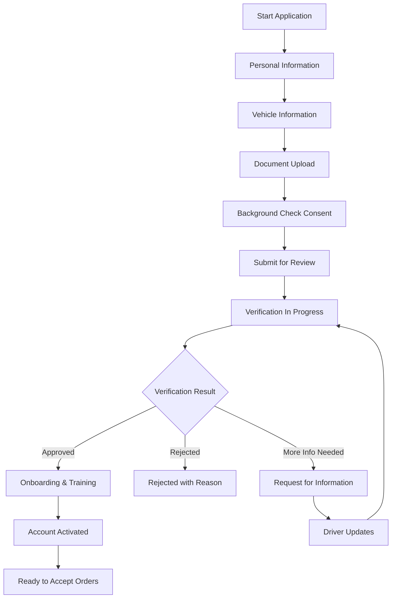

# Software Requirements Specification (SRS)

## Part 03A: Driver Recruitment & Onboarding

**Module:** Driver/Courier Module (Part 04)
**Version:** 1.0.0
**Status:** Final / For Review
**Date:** 2026-06-30

---

## Chapter 1 – Overview

### Purpose

The Driver Recruitment & Onboarding module governs the complete lifecycle of delivery driver acquisition onto the **[Platform Name]** platform. This encompasses everything from initial application and document submission, through verification and background checks, to training and account activation.

Drivers are the logistics backbone of the platform. A seamless, transparent, and efficient recruitment and onboarding process directly impacts the platform's ability to maintain adequate driver supply, ensure service quality, and build a reliable delivery network. High-quality drivers lead to better customer experiences, lower delivery times, and higher platform reliability.

### Objectives

- Provide a frictionless, mobile-first driver application process
- Enable thorough verification of driver identity, qualifications, and vehicle
- Ensure compliance with regional regulatory requirements for gig workers
- Provide transparent application status tracking
- Deliver comprehensive training and onboarding materials
- Enable scalable driver acquisition through automated and manual verification
- Support multiple driver types (individual, fleet, corporate)

---

## Chapter 2 – Driver Application Process

### DRV-001 Application Process Overview

### DRV-002 Application Steps

| Step | Description | Priority |
| :--- | :--- | :--- |
| **Step 1: Personal Information** | Name, contact details, date of birth, nationality. | **Required** |
| **Step 2: Driver Profile** | Driving license details, experience, languages. | **Required** |
| **Step 3: Vehicle Information** | Vehicle type, make, model, license plate, insurance. | **Required** |
| **Step 4: Document Upload** | ID proof, driving license, vehicle registration, insurance. | **Required** |
| **Step 5: Background Check** | Consent for background and driving record check. | **Required** |
| **Step 6: Bank Account** | Payout bank account details. | **Required** |
| **Step 7: Submission** | Review and submit application. | **Required** |
| **Step 8: Training** | Complete mandatory training modules. | **Required** |
| **Step 9: Activation** | Account activated; ready to accept orders. | **Required** |

### DRV-003 Application Data Collection

| Field | Type | Required | Description |
| :--- | :--- | :--- | :--- |
| **Personal Information** | | | |
| `first_name` | String | Yes | Legal first name |
| `last_name` | String | Yes | Legal last name |
| `date_of_birth` | Date | Yes | Date of birth (age verification) |
| `nationality` | String | Yes | Country of nationality |
| `email` | Email | Yes | Primary email address |
| `phone` | String | Yes | Primary phone number (E.164) |
| `alternate_phone` | String | No | Alternate contact number |
| `address_line_1` | String | Yes | Residential address |
| `address_line_2` | String | No | Apartment/suite/floor |
| `city` | String | Yes | City |
| `state` | String | Yes | State/province |
| `postal_code` | String | Yes | ZIP/Postal code |
| `country` | String | Yes | Country |
| `languages_spoken` | Array | Yes | Languages driver speaks |
| **Driver Profile** | | | |
| `driving_license_number` | String | Yes | License number |
| `driving_license_country` | String | Yes | Issuing country |
| `driving_license_expiry` | Date | Yes | License expiry date |
| `license_categories` | Array | Yes | Vehicle categories authorized |
| `years_of_driving_experience` | Integer | Yes | Total years of driving experience |
| `previous_delivery_experience` | Boolean | Yes | Prior delivery experience |
| `previous_employer` | String | No | Previous delivery employer |
| `availability` | JSON | Yes | Preferred working hours/days |
| **Vehicle Information** | | | |
| `vehicle_type` | String | Yes | CAR/MOTORCYCLE/SCOOTER/BICYCLE/VAN/TRUCK |
| `vehicle_make` | String | Yes | Vehicle manufacturer |
| `vehicle_model` | String | Yes | Vehicle model |
| `vehicle_year` | Integer | Yes | Manufacturing year |
| `vehicle_color` | String | Yes | Vehicle color |
| `license_plate` | String | Yes | License plate number |
| `vehicle_registration_number` | String | Yes | Registration document number |
| `insurance_provider` | String | Yes | Insurance company |
| `insurance_policy_number` | String | Yes | Insurance policy number |
| `insurance_expiry` | Date | Yes | Insurance expiry date |
| `vehicle_capacity` | Integer | No | Vehicle capacity (kg/liters) |
| `has_insulated_bag` | Boolean | Yes | Has thermal delivery bag |
| `has_helmet` | Boolean | Yes | Has safety helmet (if motorcycle/scooter) |
| `has_smartphone` | Boolean | Yes | Has smartphone with data plan |
| **Bank Account** | | | |
| `account_holder_name` | String | Yes | Name on bank account |
| `bank_name` | String | Yes | Bank name |
| `account_number` | String | Yes | Bank account number (encrypted) |
| `iban` | String | No | IBAN (if applicable) |
| `swift_code` | String | No | SWIFT/BIC code |
| `bank_country` | String | Yes | Bank country |
| `currency` | String | Yes | Payout currency |

---

## Chapter 3 – Document Management

### DRV-004 Required Documents

| Document Type | Description | Purpose | Priority |
| :--- | :--- | :--- | :--- |
| **Identity Proof** | Passport, national ID, or driving license. | Verify driver identity. | **Required** |
| **Driving License** | Valid driving license for vehicle category. | Verify driving authorization. | **Required** |
| **Vehicle Registration** | Vehicle registration certificate. | Verify vehicle ownership/authorization. | **Required** |
| **Vehicle Insurance** | Valid vehicle insurance policy. | Verify vehicle insurance coverage. | **Required** |
| **Driver Photo** | Recent passport-style photo. | Driver profile identification. | **Required** |
| **Vehicle Photo** | Photos of vehicle from multiple angles. | Vehicle verification and profile. | **Required** |
| **Bank Account Proof** | Voided cheque or bank letter. | Verify payout bank account. | **Required** |
| **Background Check Consent** | Signed consent form. | Authorization for background check. | **Required** |
| **Health Certificate** | Medical fitness certificate. | Verify driver fitness (if required). | **Optional** |
| **Police Clearance** | Police clearance certificate. | Verify no criminal record. | **Optional** |
| **Work Permit/Visa** | Work permit or visa (if applicable). | Verify work authorization. | **Conditional** |

### DRV-005 Document Upload Specifications

| Attribute | Specification |
| :--- | :--- |
| **Supported Formats** | PDF, JPG, JPEG, PNG, DOC, DOCX |
| **Maximum File Size** | 10 MB per document |
| **Maximum Documents** | 15 per driver application |
| **Photo Requirements** | Min 800x600 resolution, clear and legible |
| **Storage** | Encrypted at rest in cloud object storage |
| **Retention** | Documents retained for 7 years |
| **Access Control** | Restricted to authorized admins and compliance teams |
| **Document Verification** | AI-assisted authenticity check (forgery detection) |

### DRV-006 Document Verification Status

| Status | Description |
| :--- | :--- |
| `PENDING` | Document uploaded, awaiting verification. |
| `UNDER_REVIEW` | Document is being reviewed. |
| `VERIFIED` | Document verified and accepted. |
| `REJECTED` | Document rejected (reason provided). |
| `EXPIRED` | Document has expired. |
| `ACTION_REQUIRED` | Additional information or resubmission needed. |

---

## Chapter 4 – Driver Categories

### DRV-007 Driver Types

| Driver Type | Description | Vehicle Type | Priority |
| :--- | :--- | :--- | :--- |
| **Individual Driver** | Independent driver using personal vehicle. | Any | **Required** |
| **Fleet Driver** | Driver employed by fleet operator. | Any | **Required** |
| **Bicycle Courier** | Delivery via bicycle (eco-friendly). | Bicycle | **Required** |
| **Motorcycle Courier** | Delivery via motorcycle/scooter. | Motorcycle/Scooter | **Required** |
| **Car Driver** | Delivery via car. | Car | **Required** |
| **Van Driver** | Delivery via van (large orders). | Van | **Required** |
| **Enterprise Fleet** | Corporate fleet with multiple drivers. | Any | **Medium** |
| **Part-Time Driver** | Limited availability (specific hours). | Any | **Required** |
| **Full-Time Driver** | Full availability (primary income). | Any | **Required** |

### DRV-008 Driver Segmentation

| Segment | Description | Requirements |
| :--- | :--- | :--- |
| **Premium Driver** | High-rated, experienced drivers. | Rating > 4.8, > 100 deliveries |
| **Standard Driver** | Regular drivers with good performance. | Rating > 4.5, > 25 deliveries |
| **New Driver** | Recently onboarded drivers. | < 25 deliveries |
| **Probationary** | Drivers in probation period. | < 10 deliveries |
| **Suspended** | Drivers with compliance or performance issues. | As determined by admin |

---

## Chapter 5 – Verification & Approval

### DRV-009 Verification Workflow

| Step | Action | Responsible Party |
| :--- | :--- | :--- |
| **1. Application Submitted** | Driver completes and submits application. | Driver |
| **2. Automated Checks** | System validates format, completeness, and basic fraud checks. | System |
| **3. Identity Verification** | ID document verified against government database (if available). | Compliance Team |
| **4. License Verification** | Driving license verified (valid, endorsements). | Compliance Team |
| **5. Vehicle Verification** | Vehicle registration and insurance verified. | Compliance Team |
| **6. Background Check** | Criminal record and driving record check. | Third-party Provider |
| **7. Interview (Optional)** | Phone/video interview for driver suitability. | Operations Team |
| **8. Approval/Rejection** | Final decision communicated to driver. | Operations Manager |

### DRV-010 Auto-Verification Rules

| Rule | Action | Priority |
| :--- | :--- | :--- |
| **ID Document Authenticity** | AI-assisted authenticity check. | **High** |
| **License Validity** | Auto-check license expiry and endorsements. | **High** |
| **Vehicle Registration** | Auto-check registration validity. | **High** |
| **Insurance Validity** | Auto-check insurance coverage and expiry. | **High** |
| **Background Check** | Auto-check against criminal and driving databases. | **High** |
| **Age Verification** | Driver must be minimum legal age (configurable). | **High** |
| **Sanctions Check** | Check against sanctions lists (UN, OFAC, etc.). | **High** |
| **Duplicate Check** | Check for duplicate applications (same ID/license). | **High** |

### DRV-011 Approval/Rejection Criteria

| Criteria | Approval | Rejection |
| :--- | :--- | :--- |
| **Identity Verification** | Verified identity matches ID documents. | Unverified identity, ID mismatch. |
| **License Validity** | Valid license for vehicle category. | Invalid, expired, or inappropriate license. |
| **Vehicle Validity** | Valid registration and insurance. | Invalid/expired registration or insurance. |
| **Driving Record** | Clean driving record (no major violations). | Major violations, DUI, accidents. |
| **Criminal Record** | Clean criminal record (no relevant offenses). | Criminal record (theft, violence, etc.). |
| **Sanctions Check** | No matches on sanctions/watchlists. | Match on sanctions or watchlist. |
| **Age Requirement** | Meets minimum age requirement. | Under minimum age. |
| **Vehicle Condition** | Vehicle meets safety standards. | Vehicle in poor condition. |
| **Smartphone Requirement** | Has smartphone with data plan. | No smartphone/data plan. |

### DRV-012 Application Statuses

| Status | Description | Next Action |
| :--- | :--- | :--- |
| `DRAFT` | Application started but not submitted. | Driver completes and submits. |
| `SUBMITTED` | Application submitted, awaiting review. | System/team verifies documents. |
| `UNDER_REVIEW` | Application is being reviewed. | Compliance/Operations reviews. |
| `ACTION_REQUIRED` | Additional information needed from driver. | Driver provides missing info. |
| `VERIFIED` | Application verified and approved. | Driver proceeds to training. |
| `ONBOARDING` | Driver is completing training. | Driver completes training modules. |
| `ACTIVE` | Account activated; ready to accept orders. | Driver can start accepting orders. |
| `REJECTED` | Application rejected (with reason). | Driver appeals or reapplies. |
| `SUSPENDED` | Account suspended pending investigation. | Investigation and resolution. |

---

## Chapter 6 – Training & Onboarding

### DRV-013 Training Modules

| Module | Description | Duration | Priority |
| :--- | :--- | :--- | :--- |
| **Platform Overview** | Introduction to the platform and driver role. | 10 min | **Required** |
| **App Navigation** | How to use the driver app. | 15 min | **Required** |
| **Order Acceptance** | How to accept, reject, and manage orders. | 15 min | **Required** |
| **Delivery Process** | Step-by-step delivery workflow. | 20 min | **Required** |
| **Safety Guidelines** | Driving safety, personal safety, food safety. | 20 min | **Required** |
| **Customer Service** | Professional communication, handling issues. | 15 min | **Required** |
| **Earnings & Payouts** | How earnings are calculated and paid. | 10 min | **Required** |
| **Platform Policies** | Terms of service, code of conduct, policies. | 15 min | **Required** |
| **Emergency Procedures** | Handling accidents, emergencies, and issues. | 10 min | **Required** |
| **Quality Standards** | Delivery quality, customer satisfaction. | 10 min | **Required** |
| **Refresher Training** | Periodic update on changes/policies. | 10 min | **Required** |

### DRV-014 Training Delivery

| Format | Description | Priority |
| :--- | :--- | :--- |
| **Video Tutorials** | Pre-recorded video modules. | **Required** |
| **Interactive Quizzes** | Knowledge check after each module. | **Required** |
| **PDF Manuals** | Downloadable reference materials. | **Required** |
| **Live Webinar** | Live training sessions (optional). | **Optional** |
| **In-Person Training** | Physical training sessions (optional). | **Optional** |
| **Simulation** | Simulated order scenarios. | **Medium** |

### DRV-015 Onboarding Checklist

| Task | Description | Deadline |
| :--- | :--- | :--- |
| **Complete Profile** | Set up driver profile photo and details. | Within 24 hrs |
| **Complete Training** | Complete all mandatory training modules. | Within 48 hrs |
| **Download App** | Download the driver app from app store. | Within 24 hrs |
| **First Login** | Log in to the driver app. | Within 24 hrs |
| **Watch Safety Video** | Watch mandatory safety video. | Within 24 hrs |
| **Verify Vehicle** | Upload vehicle photos (if not done). | Within 48 hrs |
| **Setup Banking** | Confirm bank account details for payouts. | Within 48 hrs |
| **First Delivery** | Complete first delivery (supervised or mentor). | Within 7 days |

### DRV-016 Mentor Program (Optional)

| Feature | Description | Priority |
| :--- | :--- | :--- |
| **Mentor Assignment** | Assign experienced driver as mentor. | **Optional** |
| **Shadowing** | New driver shadows mentor on deliveries. | **Optional** |
| **Check-in** | Regular check-ins during probation period. | **Optional** |
| **Feedback** | Mentor provides feedback to new driver. | **Optional** |

---

## Chapter 7 – Driver Account Activation

### DRV-017 Activation Workflow

1.  Application approved.
2.  Driver completes all mandatory training modules.
3.  Driver completes onboarding checklist.
4.  System creates driver account.
5.  Driver receives welcome email/SMS with login credentials.
6.  Driver logs into the driver app.
7.  Driver completes profile setup.
8.  Account transitions to `ACTIVE` status.
9.  Driver can start accepting orders.

### DRV-018 Welcome Communication

| Communication | Content | Channel |
| :--- | :--- | :--- |
| **Welcome Email** | Account activation, app download, next steps, support contact. | Email |
| **SMS Welcome** | Brief welcome with link to download app. | SMS |
| **In-App Welcome** | Welcome message on first login. | Driver App |
| **Onboarding Checklist** | List of steps to complete. | Driver App |
| **Training Reminders** | Reminders to complete training modules. | Push/Email |

---

## Chapter 8 – Driver Compliance

### DRV-019 Ongoing Compliance Requirements

| Requirement | Description | Frequency | Priority |
| :--- | :--- | :--- | :--- |
| **License Renewal** | Driving license must remain valid. | Annual | **High** |
| **Insurance Renewal** | Vehicle insurance must remain valid. | Annual | **High** |
| **Vehicle Registration Renewal** | Vehicle registration must remain valid. | Annual | **High** |
| **Background Check Renewal** | Periodic background check. | Annual | **High** |
| **Vehicle Inspection** | Periodic vehicle safety inspection. | Semi-Annual | **Medium** |
| **Refresher Training** | Periodic refresher training. | Quarterly | **Medium** |
| **Document Re-verification** | Re-verify documents periodically. | Annual | **High** |

### DRV-020 Compliance Alert System

| Alert | Trigger | Action |
| :--- | :--- | :--- |
| **License Expiry Warning** | License expires in 30 days. | Notify driver; request renewal. |
| **Insurance Expiry Warning** | Insurance expires in 15 days. | Notify driver; request renewal. |
| **Document Expiry** | Document expires in 30 days. | Notify driver; request renewal. |
| **Background Check Due** | Background check due for renewal. | Notify driver; initiate check. |
| **License Suspended** | License reported suspended. | Suspend driver account. |
| **Vehicle Issue** | Vehicle reported in violation. | Suspend driver until resolved. |

---

## Chapter 9 – Database Tables

### driver_accounts

| Column | Type | Constraints | Description |
| :--- | :--- | :--- | :--- |
| `driver_id` | UUID | PRIMARY KEY | Unique driver identifier |
| `first_name` | VARCHAR(100) | NOT NULL | Legal first name |
| `last_name` | VARCHAR(100) | NOT NULL | Legal last name |
| `date_of_birth` | DATE | NOT NULL | Date of birth |
| `nationality` | VARCHAR(50) | NOT NULL | Country of nationality |
| `email` | VARCHAR(255) | UNIQUE, NOT NULL | Primary email |
| `phone` | VARCHAR(20) | UNIQUE, NOT NULL | Primary phone (E.164) |
| `alternate_phone` | VARCHAR(20) | | Alternate phone |
| `address_line_1` | VARCHAR(255) | NOT NULL | Residential address |
| `address_line_2` | VARCHAR(255) | | Apartment/suite/floor |
| `city` | VARCHAR(100) | NOT NULL | City |
| `state` | VARCHAR(100) | NOT NULL | State/province |
| `postal_code` | VARCHAR(20) | NOT NULL | ZIP/Postal code |
| `country` | VARCHAR(5) | NOT NULL | Country |
| `languages_spoken` | TEXT[] | | Languages spoken |
| `driver_type` | VARCHAR(30) | NOT NULL | INDIVIDUAL/FLEET/ENTERPRISE |
| `availability` | JSONB | | Preferred working hours/days |
| `status` | VARCHAR(20) | DEFAULT 'PENDING' | DRAFT/SUBMITTED/UNDER_REVIEW/VERIFIED/ONBOARDING/ACTIVE/REJECTED/SUSPENDED |
| `rating` | DECIMAL(3, 2) | DEFAULT 0 | Average driver rating |
| `total_deliveries` | INTEGER | DEFAULT 0 | Total deliveries completed |
| `active_since` | TIMESTAMP | | Account activation timestamp |
| `last_active_at` | TIMESTAMP | | Last activity timestamp |
| `created_at` | TIMESTAMP | DEFAULT NOW() | Account creation timestamp |
| `updated_at` | TIMESTAMP | DEFAULT NOW() | Last update timestamp |

### driver_vehicles

| Column | Type | Constraints | Description |
| :--- | :--- | :--- | :--- |
| `vehicle_id` | UUID | PRIMARY KEY | Unique vehicle identifier |
| `driver_id` | UUID | FOREIGN KEY (driver_accounts.driver_id) | Associated driver |
| `vehicle_type` | VARCHAR(20) | NOT NULL | CAR/MOTORCYCLE/SCOOTER/BICYCLE/VAN/TRUCK |
| `vehicle_make` | VARCHAR(50) | NOT NULL | Vehicle manufacturer |
| `vehicle_model` | VARCHAR(50) | NOT NULL | Vehicle model |
| `vehicle_year` | INTEGER | NOT NULL | Manufacturing year |
| `vehicle_color` | VARCHAR(30) | NOT NULL | Vehicle color |
| `license_plate` | VARCHAR(50) | UNIQUE, NOT NULL | License plate number |
| `registration_number` | VARCHAR(100) | NOT NULL | Registration document number |
| `registration_expiry` | DATE | NOT NULL | Registration expiry date |
| `insurance_provider` | VARCHAR(100) | NOT NULL | Insurance company |
| `insurance_policy_number` | VARCHAR(100) | NOT NULL | Insurance policy number |
| `insurance_expiry` | DATE | NOT NULL | Insurance expiry date |
| `vehicle_capacity` | INTEGER | | Vehicle capacity (kg/liters) |
| `has_insulated_bag` | BOOLEAN | DEFAULT FALSE | Has thermal delivery bag |
| `has_helmet` | BOOLEAN | DEFAULT FALSE | Has safety helmet |
| `vehicle_photos` | TEXT[] | | Vehicle photo URLs |
| `is_active` | BOOLEAN | DEFAULT TRUE | Active status |
| `verified_at` | TIMESTAMP | | Verification timestamp |
| `created_at` | TIMESTAMP | DEFAULT NOW() | Creation timestamp |
| `updated_at` | TIMESTAMP | DEFAULT NOW() | Last update timestamp |

### driver_documents

| Column | Type | Constraints | Description |
| :--- | :--- | :--- | :--- |
| `document_id` | UUID | PRIMARY KEY | Unique document identifier |
| `driver_id` | UUID | FOREIGN KEY (driver_accounts.driver_id) | Associated driver |
| `document_type` | VARCHAR(30) | NOT NULL | ID_PROOF/DRIVING_LICENSE/VEHICLE_REGISTRATION/INSURANCE/PHOTO/BANK_PROOF/BACKGROUND_CONSENT/HEALTH_CERTIFICATE/POLICE_CLEARANCE/WORK_PERMIT |
| `document_name` | VARCHAR(255) | NOT NULL | Original filename |
| `document_url` | VARCHAR(500) | NOT NULL | CDN/document storage URL |
| `document_size` | INTEGER | | File size in bytes |
| `document_mime_type` | VARCHAR(50) | | MIME type |
| `document_number` | VARCHAR(100) | | Document number (license, policy, etc.) |
| `expiry_date` | DATE | | Document expiry date |
| `verification_status` | VARCHAR(20) | DEFAULT 'PENDING' | PENDING/UNDER_REVIEW/VERIFIED/REJECTED/EXPIRED/ACTION_REQUIRED |
| `rejection_reason` | TEXT | | Reason if rejected |
| `verified_by` | UUID | | Admin who verified |
| `verified_at` | TIMESTAMP | | Verification timestamp |
| `created_at` | TIMESTAMP | DEFAULT NOW() | Upload timestamp |
| `updated_at` | TIMESTAMP | DEFAULT NOW() | Last update timestamp |

### driver_driving_licenses

| Column | Type | Constraints | Description |
| :--- | :--- | :--- | :--- |
| `license_id` | UUID | PRIMARY KEY | Unique license identifier |
| `driver_id` | UUID | FOREIGN KEY (driver_accounts.driver_id) | Associated driver |
| `license_number` | VARCHAR(50) | UNIQUE, NOT NULL | Driving license number |
| `issuing_country` | VARCHAR(5) | NOT NULL | Issuing country |
| `issue_date` | DATE | NOT NULL | License issue date |
| `expiry_date` | DATE | NOT NULL | License expiry date |
| `license_categories` | TEXT[] | NOT NULL | Vehicle categories authorized |
| `endorsements` | TEXT[] | | License endorsements |
| `restrictions` | TEXT[] | | License restrictions |
| `verification_status` | VARCHAR(20) | DEFAULT 'PENDING' | PENDING/VERIFIED/REJECTED/EXPIRED |
| `verified_at` | TIMESTAMP | | Verification timestamp |
| `created_at` | TIMESTAMP | DEFAULT NOW() | Creation timestamp |
| `updated_at` | TIMESTAMP | DEFAULT NOW() | Last update timestamp |

### driver_background_checks

| Column | Type | Constraints | Description |
| :--- | :--- | :--- | :--- |
| `background_check_id` | UUID | PRIMARY KEY | Unique background check identifier |
| `driver_id` | UUID | FOREIGN KEY (driver_accounts.driver_id) | Associated driver |
| `provider` | VARCHAR(50) | | Background check provider |
| `provider_reference` | VARCHAR(100) | | Reference from provider |
| `check_type` | VARCHAR(20) | NOT NULL | CRIMINAL/DRIVING/CREDIT/IDENTITY |
| `status` | VARCHAR(20) | DEFAULT 'PENDING' | PENDING/IN_PROGRESS/COMPLETED/FAILED |
| `result` | VARCHAR(20) | | PASS/FAIL/CONSIDER |
| `report_url` | VARCHAR(500) | | Background check report URL |
| `check_date` | DATE | | Date of background check |
| `expiry_date` | DATE | | Background check expiry date |
| `notes` | TEXT | | Additional notes |
| `created_at` | TIMESTAMP | DEFAULT NOW() | Creation timestamp |
| `updated_at` | TIMESTAMP | DEFAULT NOW() | Last update timestamp |

### driver_training_progress

| Column | Type | Constraints | Description |
| :--- | :--- | :--- | :--- |
| `progress_id` | UUID | PRIMARY KEY | Unique progress identifier |
| `driver_id` | UUID | FOREIGN KEY (driver_accounts.driver_id) | Associated driver |
| `module_id` | VARCHAR(50) | NOT NULL | Training module identifier |
| `module_name` | VARCHAR(100) | NOT NULL | Module name |
| `status` | VARCHAR(20) | DEFAULT 'PENDING' | PENDING/IN_PROGRESS/COMPLETED/FAILED |
| `completion_score` | INTEGER | | Quiz/assessment score |
| `started_at` | TIMESTAMP | | Module start timestamp |
| `completed_at` | TIMESTAMP | | Module completion timestamp |
| `retry_count` | INTEGER | DEFAULT 0 | Number of retries |
| `created_at` | TIMESTAMP | DEFAULT NOW() | Creation timestamp |
| `updated_at` | TIMESTAMP | DEFAULT NOW() | Last update timestamp |

### driver_onboarding_checklist

| Column | Type | Constraints | Description |
| :--- | :--- | :--- | :--- |
| `checklist_id` | UUID | PRIMARY KEY | Unique checklist identifier |
| `driver_id` | UUID | FOREIGN KEY (driver_accounts.driver_id) | Associated driver |
| `task_id` | VARCHAR(50) | NOT NULL | Task identifier |
| `task_name` | VARCHAR(100) | NOT NULL | Task name |
| `status` | VARCHAR(20) | DEFAULT 'PENDING' | PENDING/COMPLETED/SKIPPED |
| `completed_at` | TIMESTAMP | | Task completion timestamp |
| `created_at` | TIMESTAMP | DEFAULT NOW() | Creation timestamp |
| `updated_at` | TIMESTAMP | DEFAULT NOW() | Last update timestamp |

### driver_bank_accounts

| Column | Type | Constraints | Description |
| :--- | :--- | :--- | :--- |
| `bank_account_id` | UUID | PRIMARY KEY | Unique bank account identifier |
| `driver_id` | UUID | FOREIGN KEY (driver_accounts.driver_id) | Associated driver |
| `account_holder_name` | VARCHAR(255) | NOT NULL | Name on the bank account |
| `account_number` | VARCHAR(50) | NOT NULL | Bank account number (encrypted) |
| `iban` | VARCHAR(50) | | IBAN (encrypted) |
| `swift_code` | VARCHAR(20) | | SWIFT/BIC code |
| `bank_name` | VARCHAR(100) | NOT NULL | Bank name |
| `bank_country` | VARCHAR(5) | NOT NULL | Bank country |
| `currency` | VARCHAR(3) | NOT NULL | Payout currency |
| `is_primary` | BOOLEAN | DEFAULT TRUE | Primary payout account |
| `is_verified` | BOOLEAN | DEFAULT FALSE | Verification status |
| `verified_at` | TIMESTAMP | | Verification timestamp |
| `created_at` | TIMESTAMP | DEFAULT NOW() | Creation timestamp |
| `updated_at` | TIMESTAMP | DEFAULT NOW() | Last update timestamp |

### driver_suspensions

| Column | Type | Constraints | Description |
| :--- | :--- | :--- | :--- |
| `suspension_id` | UUID | PRIMARY KEY | Unique suspension identifier |
| `driver_id` | UUID | FOREIGN KEY (driver_accounts.driver_id) | Associated driver |
| `reason` | VARCHAR(100) | NOT NULL | Reason for suspension |
| `description` | TEXT | | Detailed description |
| `suspended_by` | UUID | | Admin who suspended |
| `suspension_start` | TIMESTAMP | NOT NULL | Suspension start timestamp |
| `suspension_end` | TIMESTAMP | | Suspension end timestamp |
| `is_permanent` | BOOLEAN | DEFAULT FALSE | Permanent suspension |
| `appeal_status` | VARCHAR(20) | | NONE/PENDING/APPROVED/REJECTED |
| `appeal_notes` | TEXT | | Notes from appeal |
| `created_at` | TIMESTAMP | DEFAULT NOW() | Creation timestamp |
| `updated_at` | TIMESTAMP | DEFAULT NOW() | Last update timestamp |

---

## Chapter 10 – REST APIs

### Driver Application APIs

| Method | Endpoint | Description |
| :--- | :--- | :--- |
| `POST` | `/api/v1/driver/application` | Start/Submit driver application |
| `GET` | `/api/v1/driver/application/{id}` | Get application status and data |
| `PUT` | `/api/v1/driver/application/{id}` | Update application |
| `POST` | `/api/v1/driver/application/{id}/submit` | Submit application for review |
| `GET` | `/api/v1/driver/application/{id}/status` | Get current application status |
| `POST` | `/api/v1/driver/application/{id}/documents` | Upload document |
| `DELETE` | `/api/v1/driver/application/{id}/documents/{doc_id}` | Delete document |
| `GET` | `/api/v1/driver/application/{id}/requirements` | Get application requirements |

### Driver Account APIs

| Method | Endpoint | Description |
| :--- | :--- | :--- |
| `GET` | `/api/v1/driver/account` | Get driver account details |
| `PUT` | `/api/v1/driver/account` | Update driver account details |
| `GET` | `/api/v1/driver/vehicles` | Get driver vehicles |
| `POST` | `/api/v1/driver/vehicles` | Add vehicle |
| `PUT` | `/api/v1/driver/vehicles/{id}` | Update vehicle |
| `DELETE` | `/api/v1/driver/vehicles/{id}` | Remove vehicle |
| `GET` | `/api/v1/driver/documents` | Get documents |
| `POST` | `/api/v1/driver/documents` | Upload document |
| `GET` | `/api/v1/driver/onboarding` | Get onboarding progress |
| `POST` | `/api/v1/driver/onboarding/complete` | Complete onboarding task |

### Training APIs

| Method | Endpoint | Description |
| :--- | :--- | :--- |
| `GET` | `/api/v1/driver/training/modules` | List training modules |
| `GET` | `/api/v1/driver/training/modules/{id}` | Get module content |
| `POST` | `/api/v1/driver/training/modules/{id}/start` | Start module |
| `POST` | `/api/v1/driver/training/modules/{id}/complete` | Complete module |
| `POST` | `/api/v1/driver/training/modules/{id}/quiz` | Submit quiz |
| `GET` | `/api/v1/driver/training/progress` | Get training progress |

### Admin APIs

| Method | Endpoint | Description |
| :--- | :--- | :--- |
| `GET` | `/api/v1/admin/driver/applications` | List driver applications (admin only) |
| `GET` | `/api/v1/admin/driver/applications/{id}` | Get application details (admin only) |
| `PUT` | `/api/v1/admin/driver/applications/{id}/verify` | Verify application (admin only) |
| `PUT` | `/api/v1/admin/driver/applications/{id}/approve` | Approve application (admin only) |
| `PUT` | `/api/v1/admin/driver/applications/{id}/reject` | Reject application (admin only) |
| `PUT` | `/api/v1/admin/driver/applications/{id}/request-info` | Request additional information (admin only) |
| `GET` | `/api/v1/admin/driver/applications/{id}/documents` | Get driver documents (admin only) |
| `PUT` | `/api/v1/admin/driver/applications/{id}/documents/{doc_id}/verify` | Verify document (admin only) |
| `POST` | `/api/v1/admin/driver/{id}/activate` | Activate driver (admin only) |
| `POST` | `/api/v1/admin/driver/{id}/suspend` | Suspend driver (admin only) |
| `POST` | `/api/v1/admin/driver/{id}/reactivate` | Reactivate driver (admin only) |
| `POST` | `/api/v1/admin/driver/{id}/background-check` | Initiate background check (admin only) |

---

## Chapter 11 – Business Rules

| Rule ID | Rule Description | Priority |
| :--- | :--- | :--- |
| **BR-DRV-001** | Drivers must be at least 18 years old (configurable by country). | **High** |
| **BR-DRV-002** | Driving license must be valid for the vehicle category. | **High** |
| **BR-DRV-003** | Vehicle insurance must be valid and cover delivery use. | **High** |
| **BR-DRV-004** | Background check must be passed before activation. | **High** |
| **BR-DRV-005** | All mandatory training modules must be completed before activation. | **High** |
| **BR-DRV-006** | Documents must be verified within 5 business days (SLA). | **High** |
| **BR-DRV-007** | Drivers cannot have more than one active vehicle registration. | **Medium** |
| **BR-DRV-008** | Driver accounts suspended for compliance reasons require review for reactivation. | **High** |
| **BR-DRV-009** | Applications expire after 90 days of inactivity. | **Medium** |
| **BR-DRV-010** | Drivers must have a valid smartphone with data plan. | **High** |
| **BR-DRV-011** | Driver's license and insurance must be renewed before expiry. | **High** |
| **BR-DRV-012** | New drivers have a 30-day probationary period. | **Medium** |

---

## Chapter 12 – Acceptance Tests

| Test ID | Test Description | Priority |
| :--- | :--- | :--- |
| **TEST-DRV-001** | Driver starts new application and saves as draft. | **High** |
| **TEST-DRV-002** | Driver completes all application steps and submits for review. | **High** |
| **TEST-DRV-003** | Driver uploads required documents (ID, license, registration, insurance). | **High** |
| **TEST-DRV-004** | System validates document format and size limits. | **High** |
| **TEST-DRV-005** | Driver updates application after action required. | **High** |
| **TEST-DRV-006** | Admin views pending driver application list. | **High** |
| **TEST-DRV-007** | Admin views driver application details. | **High** |
| **TEST-DRV-008** | Admin verifies driver documents. | **High** |
| **TEST-DRV-009** | Admin initiates background check. | **High** |
| **TEST-DRV-010** | Admin approves driver application. | **High** |
| **TEST-DRV-011** | Approved driver receives welcome message and app download link. | **High** |
| **TEST-DRV-012** | Admin rejects driver application with reason. | **High** |
| **TEST-DRV-013** | Admin requests additional information from driver. | **High** |
| **TEST-DRV-014** | Driver completes mandatory training modules. | **High** |
| **TEST-DRV-015** | Driver completes onboarding checklist. | **High** |
| **TEST-DRV-016** | Driver account is activated after training and checklist completion. | **High** |
| **TEST-DRV-017** | Driver views application status throughout the process. | **High** |
| **TEST-DRV-018** | Driver uploads document and sees verification status. | **High** |
| **TEST-DRV-019** | Driver logs into driver app for the first time. | **High** |
| **TEST-DRV-020** | Admin suspends driver account with reason. | **High** |
| **TEST-DRV-021** | Admin reactivates suspended driver account. | **High** |
| **TEST-DRV-022** | System prevents duplicate application (same ID/license). | **High** |
| **TEST-DRV-023** | License expiry triggers warning notification. | **High** |
| **TEST-DRV-024** | Insurance expiry triggers warning notification. | **High** |
| **TEST-DRV-025** | Driver updates vehicle details. | **High** |
| **TEST-DRV-026** | Driver adds new vehicle to account. | **High** |
| **TEST-DRV-027** | Driver updates bank account details. | **High** |
| **TEST-DRV-028** | Application expires after 90 days of inactivity. | **Medium** |
| **TEST-DRV-029** | Driver completes quiz and passes training module. | **High** |
| **TEST-DRV-030** | Background check passes and driver is approved. | **High** |

---

## Chapter 13 – Traceability Matrix

| Requirement | Database Table | API Endpoint(s) | Acceptance Test |
| :--- | :--- | :--- | :--- |
| DRV-002 | driver_accounts | POST /api/v1/driver/application | TEST-DRV-001, TEST-DRV-002 |
| DRV-003 | driver_accounts | PUT /api/v1/driver/application/{id} | TEST-DRV-005 |
| DRV-004 | driver_documents | POST /api/v1/driver/application/{id}/documents | TEST-DRV-003, TEST-DRV-004 |
| DRV-009 | driver_accounts, driver_documents | PUT /api/v1/admin/driver/applications/{id}/verify | TEST-DRV-008 |
| DRV-009 | driver_accounts | PUT /api/v1/admin/driver/applications/{id}/approve | TEST-DRV-010 |
| DRV-009 | driver_accounts | PUT /api/v1/admin/driver/applications/{id}/reject | TEST-DRV-012 |
| DRV-009 | driver_accounts | PUT /api/v1/admin/driver/applications/{id}/request-info | TEST-DRV-013 |
| DRV-012 | driver_accounts | GET /api/v1/driver/application/{id}/status | TEST-DRV-017 |
| DRV-013 | driver_training_progress | GET/POST /api/v1/driver/training/modules | TEST-DRV-014, TEST-DRV-029 |
| DRV-015 | driver_onboarding_checklist | GET /api/v1/driver/onboarding | TEST-DRV-015 |
| DRV-017 | driver_accounts | POST /api/v1/admin/driver/{id}/activate | TEST-DRV-016 |
| DRV-019 | driver_accounts | POST /api/v1/admin/driver/{id}/suspend | TEST-DRV-020 |
| DRV-019 | driver_accounts | POST /api/v1/admin/driver/{id}/reactivate | TEST-DRV-021 |
| DRV-007 | driver_vehicles | POST/GET/PUT/DELETE /api/v1/driver/vehicles | TEST-DRV-025, TEST-DRV-026 |
| DRV-013 | driver_bank_accounts | GET/PUT /api/v1/driver/account | TEST-DRV-027 |
| DRV-006 | driver_documents | GET /api/v1/driver/documents | TEST-DRV-018 |
| DRV-009 | driver_background_checks | POST /api/v1/admin/driver/{id}/background-check | TEST-DRV-009, TEST-DRV-030 |

---

## Chapter 14 – Summary

This document establishes the complete driver recruitment and onboarding capability for the **[Platform Name]** platform. Key takeaways:

- **Structured Application Flow:** Multi-step application process (Personal → Vehicle → Documents → Background Check → Submission) ensures complete data collection.
- **Document Management:** Comprehensive document upload and verification workflow with support for multiple document types and statuses.
- **Driver Categories:** Support for different driver types (individual, fleet, bicycle, motorcycle, car, van) with appropriate requirements.
- **Verification & Approval:** Clear approval/rejection criteria with automated checks and manual review workflows.
- **Comprehensive Training:** Mandatory training modules with video tutorials, quizzes, and certification.
- **Onboarding Checklist:** Structured onboarding with clear completion criteria before activation.
- **Compliance Management:** Ongoing compliance tracking for license renewal, insurance, vehicle registration, and background checks.
- **Compliance-Ready:** KYC/KYB checks, document retention, and audit trails for regulatory compliance.

The driver recruitment and onboarding module is the gateway to the platform's logistics network. A smooth, transparent, and efficient onboarding process ensures a steady supply of qualified, reliable drivers ready to deliver exceptional service to customers.

---

**Next Document:**

`Part_03B_Driver_App_Experience.md`

*(This builds on driver onboarding to define the mobile app experience that drivers use to accept orders, navigate, and complete deliveries.)*
