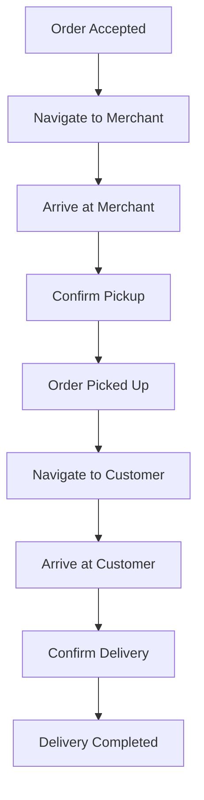

# Software Requirements Specification (SRS)

## Part 03B: Driver App Experience

**Module:** Driver/Courier Module (Part 04)
**Version:** 1.0.0
**Status:** Final / For Review
**Date:** 2026-06-30

---

## Chapter 1 – Overview

### Purpose

The Driver App Experience module defines the complete mobile application interface and experience for delivery drivers on the **[Platform Name]** platform. This encompasses the driver's primary tool for accepting orders, navigating to merchants and customers, completing deliveries, managing earnings, and communicating with support.

The driver app is the most critical tool for the logistics workforce. Its design, reliability, and intuitiveness directly impact driver satisfaction, productivity, and retention. A well-designed driver app reduces cognitive load, minimizes time wasted on non-delivery activities, and enables drivers to maximize their earnings potential.

### Objectives

- Provide an intuitive, efficient, and reliable mobile app experience
- Enable seamless order acceptance and management
- Deliver accurate, real-time navigation and routing
- Support efficient delivery confirmation and verification
- Provide transparent earnings tracking and visibility
- Enable effective communication with customers and support
- Support offline functionality for connectivity gaps
- Optimize for battery life and data usage

---

## Chapter 2 – App Architecture & Technology

### DRV-021 Platform Support

| Platform | Minimum Version | Priority |
| :--- | :--- | :--- |
| **iOS** | iOS 14.0+ (iPhone 8 and above) | **Required** |
| **Android** | Android 10+ (API level 29) | **Required** |

### DRV-022 Core Technologies

| Component | Technology | Priority |
| :--- | :--- | :--- |
| **App Framework** | React Native / Flutter (cross-platform) | **Required** |
| **Navigation** | Google Maps SDK / Mapbox SDK | **Required** |
| **Real-Time Communication** | WebSocket / Firebase Realtime Database | **Required** |
| **Push Notifications** | FCM (Android) / APNs (iOS) | **Required** |
| **Offline Storage** | SQLite / Realm (local database) | **Required** |
| **GPS Tracking** | Native GPS with background location | **Required** |
| **Analytics** | Firebase Analytics / Mixpanel | **Required** |
| **Crash Reporting** | Firebase Crashlytics / Sentry | **Required** |

### DRV-023 App Performance Requirements

| Metric | Target |
| :--- | :--- |
| **App Launch Time** | < 3 seconds |
| **Order Notification Latency** | < 2 seconds |
| **GPS Update Interval** | Every 3-5 seconds (active) |
| **Battery Consumption** | < 15% per hour (active use) |
| **Data Usage** | < 50 MB per hour (active use) |
| **Offline Capability** | View last 24 hours of data |

---

## Chapter 3 – Authentication & Onboarding

### DRV-024 Login Methods

| Method | Description | Priority |
| :--- | :--- | :--- |
| **Email/Password** | Standard credential-based login. | **Required** |
| **Phone OTP** | One-time password via SMS. | **Required** |
| **Biometric** | Fingerprint/Face ID (post-initial auth). | **Required** |
| **Magic Link** | Email-based passwordless login. | **Medium** |

### DRV-025 App Onboarding Flow

1.  Driver downloads app from app store.
2.  Driver opens app and sees welcome screen.
3.  Driver logs in with credentials (email/password or OTP).
4.  App checks if driver account is active.
5.  If active, driver is taken to home screen.
6.  If new/onboarding, driver is taken to onboarding flow:
    - Profile completion (if not done)
    - Training module completion
    - First-time app tour
7.  Driver sets availability status.

### DRV-026 App Tour

| Screen | Content | Priority |
| :--- | :--- | :--- |
| **Welcome** | App name, logo, and tagline. | **Required** |
| **Order Acceptance** | How to accept/reject orders. | **Required** |
| **Navigation** | How to navigate to merchant/customer. | **Required** |
| **Delivery Process** | Step-by-step delivery workflow. | **Required** |
| **Earnings** | How earnings are tracked and displayed. | **Required** |
| **Support** | How to access support. | **Required** |

---

## Chapter 4 – Home Screen & Status Management

### DRV-027 Home Screen Layout

| Section | Content | Priority |
| :--- | :--- | :--- |
| **Header** | Driver name, rating, online status toggle. | **Required** |
| **Status Card** | Online/Offline status, current shift info. | **Required** |
| **Earnings Widget** | Today's earnings, this week's earnings. | **Required** |
| **Quick Stats** | Deliveries today, hours online, acceptance rate. | **Required** |
| **Action Buttons** | Go Online, View Orders, View Earnings, Support. | **Required** |
| **Notifications** | Recent notifications and alerts. | **Required** |

### DRV-028 Online Status Management

| Status | Description | Customer Visibility |
| :--- | :--- | :--- |
| **Online** | Driver is available to accept orders. | Visible for assignment |
| **Busy** | Driver is currently on a delivery. | Visible (on active order) |
| **Offline** | Driver is not available. | Not visible |
| **Scheduled** | Driver is scheduled for a shift. | Visible during shift hours |
| **Break** | Driver is on a break. | Not visible |

### DRV-029 Status Toggle

| Feature | Description | Priority |
| :--- | :--- | :--- |
| **Go Online** | Driver becomes available for orders. | **Required** |
| **Go Offline** | Driver becomes unavailable for orders. | **Required** |
| **Take Break** | Driver takes a break (auto-offline, with timer). | **Required** |
| **End Break** | Driver ends break and goes online. | **Required** |
| **Scheduled Shift** | Auto-online/offline based on schedule. | **Medium** |

### DRV-030 Status Transition Rules

| Rule | Description |
| :--- | :--- |
| **Online → Offline** | Driver can go offline at any time (unless on active delivery). |
| **Online → Busy** | Auto-transition when order is accepted. |
| **Busy → Online** | Auto-transition when delivery is completed. |
| **Break Duration** | Break limited to 30 minutes (configurable). |
| **Auto-Offline** | Driver auto-offline after 10 minutes of inactivity. |

---

## Chapter 5 – Order Acceptance

### DRV-031 Order Notification

| Feature | Description | Priority |
| :--- | :--- | :--- |
| **Push Notification** | Real-time push notification for new order. | **Required** |
| **In-App Alert** | Visual and audible alert in app. | **Required** |
| **Order Preview** | Merchant name, distance, payout estimate. | **Required** |
| **Accept/Decline Buttons** | Clear, large buttons for quick action. | **Required** |
| **Auto-Decline** | Order auto-declined if not acted upon (configurable). | **Required** |
| **Priority Orders** | VIP orders highlighted. | **Medium** |

### DRV-032 Order Acceptance Screen

| Displayed Information | Description |
| :--- | :--- |
| **Merchant Name** | Name of the merchant. |
| **Merchant Address** | Pickup location. |
| **Distance** | Distance from driver to merchant. |
| **Estimated Pickup Time** | Estimated time to arrive at merchant. |
| **Delivery Destination** | Customer location (general area). |
| **Estimated Total Distance** | Total distance for the trip. |
| **Payout Estimate** | Estimated earnings for the order. |
| **Order Items** | Brief list of items (optional). |
| **Special Instructions** | Customer instructions (if any). |
| **Accept Timer** | Countdown to auto-decline. |

### DRV-033 Acceptance Flow

1.  Driver receives order notification (push + in-app).
2.  Driver taps to view order details.
3.  Driver reviews order details (merchant, distance, payout).
4.  Driver taps **Accept** or **Decline**.
5.  If **Accept**:
    - Order assigned to driver.
    - Driver navigates to merchant.
    - Order status updates to `DRIVER_ASSIGNED`.
6.  If **Decline**:
    - Order offered to next available driver.
    - Reason logged for analytics (optional).
7.  If **No Action** (timer expires):
    - Order auto-declined.
    - Driver status remains online.

### DRV-034 Acceptance Rules

| Rule | Description |
| :--- | :--- |
| **Acceptance Timer** | 30 seconds to accept (configurable). |
| **Max Declines** | 3 declines in a row triggers auto-offline. |
| **Acceptance Rate** | Acceptance rate tracked and visible to driver. |
| **Decline Reason** | Optional decline reason selection. |
| **Batch Orders** | Multiple orders offered together (for efficiency). |

### DRV-035 Decline Reasons

| Reason | Description |
| :--- | :--- |
| **Too Far** | Merchant is too far from current location. |
| **Traffic** | Heavy traffic on the route. |
| **Low Payout** | Payout is not sufficient. |
| **Vehicle Issue** | Vehicle issue preventing delivery. |
| **Personal Reason** | Personal reason (general). |
| **Other** | Other reason (specify). |

---

## Chapter 6 – Navigation & Route Management

### DRV-036 Navigation Features

| Feature | Description | Priority |
| :--- | :--- | :--- |
| **Turn-by-Turn Navigation** | Step-by-step navigation to merchant and customer. | **Required** |
| **Route Optimization** | Optimal route based on traffic and distance. | **Required** |
| **Live Traffic** | Real-time traffic updates. | **Required** |
| **ETA** | Estimated time of arrival (dynamic). | **Required** |
| **Alternate Routes** | Suggest alternate routes (faster/avoid tolls). | **Required** |
| **Offline Maps** | Map data cached for offline use. | **Required** |
| **Voice Guidance** | Audio navigation instructions. | **Required** |
| **Pin Drop** | Precise customer location pin. | **Required** |
| **Address Verification** | Verify address before starting navigation. | **Required** |

### DRV-037 Navigation States

| State | Description |
| :--- | :--- |
| **Navigate to Merchant** | Driver en route to pickup location. |
| **Arrived at Merchant** | Driver has arrived at merchant location. |
| **Navigate to Customer** | Driver en route to delivery location. |
| **Arrived at Customer** | Driver has arrived at delivery location. |

### DRV-038 Navigation Screen

| Element | Description |
| :--- | :--- |
| **Map View** | Interactive map showing route, traffic, and pins. |
| **ETA** | Estimated time of arrival with real-time updates. |
| **Distance Remaining** | Distance to destination. |
| **Next Turn** | Upcoming turn or maneuver. |
| **Order Information** | Quick access to order details. |
| **Contact Buttons** | Contact merchant/customer. |
| **Call Button** | One-tap call (masked). |

### DRV-039 GPS & Location Requirements

| Requirement | Description |
| :--- | :--- |
| **GPS Accuracy** | Location accuracy within 10 meters. |
| **Update Frequency** | 3-5 seconds during active delivery. |
| **Battery Optimization** | Adaptive GPS polling to conserve battery. |
| **Background Tracking** | GPS tracking continues when app is in background. |
| **Geofencing** | Auto-detection of merchant/customer arrival. |

---

## Chapter 7 – Delivery Process

### DRV-040 Delivery Workflow

### DRV-041 Pickup Process

| Step | Description |
| :--- | :--- |
| **1. Arrive at Merchant** | Driver arrives at merchant location. |
| **2. Notify Merchant** | Driver notifies merchant of arrival (auto via app). |
| **3. Verify Order** | Driver verifies order items against ticket. |
| **4. Confirm Pickup** | Driver taps "Confirm Pickup" in app. |
| **5. Handoff** | Merchant hands order to driver. |
| **6. Order Status** | Order status updates to `PICKED_UP`. |
| **7. Customer Notified** | Customer notified that order is on the way. |

### DRV-042 Pickup Verification Methods

| Method | Description | Priority |
| :--- | :--- | :--- |
| **Manual Confirmation** | Driver taps "Confirm Pickup". | **Required** |
| **GPS Verification** | Driver must be within 50m of merchant. | **Required** |
| **QR Code Scan** | Driver scans merchant's QR code. | **Required** |
| **Code Entry** | Driver enters merchant-provided pickup code. | **Medium** |
| **Photo Verification** | Driver takes photo of order with merchant. | **Optional** |

### DRV-043 Delivery Process

| Step | Description |
| :--- | :--- |
| **1. Arrive at Customer** | Driver arrives at customer location. |
| **2. Contact Customer** | Driver contacts customer (if needed). |
| **3. Verify Delivery** | Driver verifies delivery location. |
| **4. Confirm Delivery** | Driver taps "Confirm Delivery". |
| **5. Verification Method** | QR/OTP/Photo confirmation. |
| **6. Order Status** | Order status updates to `DELIVERED`. |
| **7. Customer Notified** | Customer notified of delivery. |

### DRV-044 Delivery Confirmation Methods

| Method | Description | Priority |
| :--- | :--- | :--- |
| **QR Code Scan** | Customer displays QR code; driver scans. | **Required** |
| **OTP Entry** | Customer provides OTP; driver enters. | **Required** |
| **Photo Proof** | Driver takes photo of delivered order at door. | **Required** |
| **GPS Verification** | Driver must be within 50m of delivery address. | **Required** |
| **Signature** | Customer signs on driver's device. | **Optional** |
| **Voice Confirmation** | "I have received my order" (voice). | **Future** |

### DRV-045 Delivery Exceptions

| Exception | Handling |
| :--- | :--- |
| **Customer Not Available** | Wait 5 minutes, attempt contact, escalate to support. |
| **Wrong Address** | Contact customer for correction; support escalation. |
| **Customer Not Home** | Attempt contact; if unavailable, return to merchant. |
| **Order Damaged** | Report damage; customer notified; support handles. |
| **Safety Issue** | Driver cancels delivery; returns to merchant. |

---

## Chapter 8 – Communication Features

### DRV-046 Communication Channels

| Channel | Description | Priority |
| :--- | :--- | :--- |
| **In-App Chat** | Real-time text chat with customer/merchant. | **Required** |
| **Voice Call** | Masked phone calls to customer/merchant. | **Required** |
| **Push Notifications** | Order updates and alerts. | **Required** |
| **SMS** | Backup SMS notifications (if enabled). | **Medium** |
| **Email** | Transactional emails (optional). | **Low** |

### DRV-047 In-App Chat Features

| Feature | Description | Priority |
| :--- | :--- | :--- |
| **Real-Time Messaging** | Instant text messaging. | **Required** |
| **Read Receipts** | See when message was read. | **Required** |
| **Typing Indicators** | Show when other party is typing. | **Required** |
| **Quick Replies** | Pre-set responses (e.g., "I'm here", "On my way"). | **Required** |
| **Image Sharing** | Share photos (e.g., location, delivery proof). | **Medium** |
| **Language Translation** | Auto-translate messages (future). | **Future** |
| **Message History** | Persistent chat history for order. | **Required** |

### DRV-048 Call Features

| Feature | Description | Priority |
| :--- | :--- | :--- |
| **Masked Calling** | Both parties see temporary platform number. | **Required** |
| **One-Tap Call** | Tap to call customer/merchant. | **Required** |
| **Call Logging** | Call duration and time logged (not content). | **Required** |
| **In-App Call** | VoIP call within the app (optional). | **Medium** |

---

## Chapter 9 – Earnings & Performance

### DRV-049 Earnings Dashboard

| Widget | Description | Priority |
| :--- | :--- | :--- |
| **Today's Earnings** | Earnings for today (real-time). | **Required** |
| **This Week's Earnings** | Cumulative earnings for the week. | **Required** |
| **This Month's Earnings** | Cumulative earnings for the month. | **Required** |
| **Total Deliveries** | Number of deliveries completed. | **Required** |
| **Online Hours** | Hours online today. | **Required** |
| **Active Hours** | Hours actively delivering. | **Required** |
| **Earnings Breakdown** | Base pay, tips, bonuses, incentives. | **Required** |
| **Payout Status** | Pending payout amount and next payout date. | **Required** |

### DRV-050 Earnings Breakdown

| Component | Description |
| :--- | :--- |
| **Base Delivery Fee** | Base payment per delivery. |
| **Distance Bonus** | Additional payment based on distance. |
| **Time Bonus** | Additional payment based on time. |
| **Peak Bonus** | Bonus during peak hours. |
| **Tips** | Customer tips (100% to driver). |
| **Incentives** | Completion bonuses, streak bonuses. |
| **Adjustments** | Adjustments (positive/negative). |
| **Total Earnings** | Sum of all components. |

### DRV-051 Payout Information

| Feature | Description | Priority |
| :--- | :--- | :--- |
| **Payout Schedule** | Frequency of payouts (daily/weekly). | **Required** |
| **Next Payout Date** | Date of next payout. | **Required** |
| **Pending Balance** | Amount pending payout. | **Required** |
| **Payout History** | Complete history of payouts. | **Required** |
| **Payout Method** | Bank account or wallet. | **Required** |
| **Instant Payout** | Request instant payout (fee applied). | **Medium** |

### DRV-052 Performance Metrics

| Metric | Description | Priority |
| :--- | :--- | :--- |
| **Acceptance Rate** | Percentage of orders accepted. | **Required** |
| **Completion Rate** | Percentage of orders completed. | **Required** |
| **On-Time Rate** | Percentage of deliveries on time. | **Required** |
| **Customer Rating** | Average customer rating. | **Required** |
| **Delivery Time** | Average delivery time. | **Required** |
| **Earnings Per Hour** | Average earnings per active hour. | **Required** |
| **Customer Feedback** | Recent customer feedback/comments. | **Required** |

---

## Chapter 10 – Shift & Schedule Management

### DRV-053 Shift Management

| Feature | Description | Priority |
| :--- | :--- | :--- |
| **View Schedule** | View upcoming shifts. | **Required** |
| **Accept Shift** | Accept available shift. | **Required** |
| **Decline Shift** | Decline offered shift. | **Required** |
| **Shift Reminders** | Reminders before shift start. | **Required** |
| **Shift History** | View past shift history. | **Medium** |
| **Swap Shift** | Request shift swap with another driver. | **Optional** |
| **Break Management** | Schedule breaks during shifts. | **Required** |

### DRV-054 Shift Notifications

| Notification | Trigger |
| :--- | :--- |
| **Shift Reminder** | 1 hour before shift start. |
| **Shift Started** | At shift start time. |
| **Peak Hours Alert** | 30 minutes before peak hour starts. |
| **Break Reminder** | After 2 hours of continuous work. |

---

## Chapter 11 – Settings & Preferences

### DRV-055 App Settings

| Setting | Description | Priority |
| :--- | :--- | :--- |
| **Profile** | View/edit profile information. | **Required** |
| **Vehicle** | View/edit vehicle details. | **Required** |
| **Bank Account** | View/edit bank account details. | **Required** |
| **Notification Preferences** | Configure notification channels. | **Required** |
| **Language** | App language preference. | **Required** |
| **Theme** | Light/Dark mode. | **Required** |
| **Navigation Preferences** | Preferred navigation app (Google Maps/Waze/Mapbox). | **Required** |
| **Data Saver** | Reduce data usage. | **Medium** |
| **Offline Mode** | Configure offline capabilities. | **Medium** |
| **Privacy** | Privacy settings. | **Required** |

### DRV-056 Notification Preferences

| Notification Type | Push | Email | SMS |
| :--- | :--- | :--- | :--- |
| **New Order** | ✅ | ❌ | ❌ |
| **Order Updates** | ✅ | ✅ | ✅ |
| **Earnings Update** | ✅ | ✅ | ❌ |
| **Payout Notification** | ✅ | ✅ | ✅ |
| **Shift Reminders** | ✅ | ✅ | ❌ |
| **Performance Alerts** | ✅ | ✅ | ❌ |
| **System Updates** | ✅ | ✅ | ❌ |
| **Support Messages** | ✅ | ✅ | ✅ |

---

## Chapter 12 – Support Features

### DRV-057 In-App Support

| Feature | Description | Priority |
| :--- | :--- | :--- |
| **Help Center** | Searchable FAQ and knowledge base. | **Required** |
| **Live Chat** | Real-time chat with support. | **Required** |
| **Call Support** | One-tap call to support. | **Required** |
| **Ticket System** | Submit and track support tickets. | **Required** |
| **Issue Reporting** | Report issues during delivery. | **Required** |
| **Feedback** | Submit app feedback. | **Required** |

### DRV-058 Quick Support Actions

| Action | Description |
| :--- | :--- |
| **Report Issue with Order** | Report order issue (e.g., missing items). |
| **Report Customer Issue** | Report issue with customer (e.g., safety). |
| **Report Merchant Issue** | Report issue with merchant (e.g., delay). |
| **Report App Issue** | Report app bug or issue. |
| **Request Help** | General help request. |

---

## Chapter 13 – Database Tables

### driver_sessions

| Column | Type | Constraints | Description |
| :--- | :--- | :--- | :--- |
| `session_id` | UUID | PRIMARY KEY | Unique session identifier |
| `driver_id` | UUID | FOREIGN KEY (driver_accounts.driver_id) | Associated driver |
| `session_type` | VARCHAR(20) | NOT NULL | ONLINE/BUSY/OFFLINE/BREAK |
| `start_time` | TIMESTAMP | NOT NULL | Session start timestamp |
| `end_time` | TIMESTAMP | | Session end timestamp |
| `duration` | INTEGER | | Duration in minutes |
| `created_at` | TIMESTAMP | DEFAULT NOW() | Creation timestamp |
| `updated_at` | TIMESTAMP | DEFAULT NOW() | Last update timestamp |

### driver_locations

| Column | Type | Constraints | Description |
| :--- | :--- | :--- | :--- |
| `location_id` | UUID | PRIMARY KEY | Unique location identifier |
| `driver_id` | UUID | FOREIGN KEY (driver_accounts.driver_id) | Associated driver |
| `order_id` | UUID | FOREIGN KEY (merchant_orders.order_id) | Active order (if any) |
| `latitude` | DECIMAL(10, 8) | NOT NULL | GPS latitude |
| `longitude` | DECIMAL(11, 8) | NOT NULL | GPS longitude |
| `accuracy` | DECIMAL(5, 2) | | GPS accuracy (meters) |
| `speed` | DECIMAL(5, 2) | | Speed (km/h) |
| `heading` | DECIMAL(5, 2) | | Heading direction (degrees) |
| `is_background` | BOOLEAN | DEFAULT FALSE | Background location update |
| `recorded_at` | TIMESTAMP | NOT NULL | Location timestamp |
| `created_at` | TIMESTAMP | DEFAULT NOW() | Record creation timestamp |

### driver_earnings

| Column | Type | Constraints | Description |
| :--- | :--- | :--- | :--- |
| `earning_id` | UUID | PRIMARY KEY | Unique earning identifier |
| `driver_id` | UUID | FOREIGN KEY (driver_accounts.driver_id) | Associated driver |
| `order_id` | UUID | FOREIGN KEY (merchant_orders.order_id) | Associated order |
| `base_fee` | DECIMAL(10, 2) | NOT NULL | Base delivery fee |
| `distance_bonus` | DECIMAL(10, 2) | DEFAULT 0 | Distance-based bonus |
| `time_bonus` | DECIMAL(10, 2) | DEFAULT 0 | Time-based bonus |
| `peak_bonus` | DECIMAL(10, 2) | DEFAULT 0 | Peak hour bonus |
| `tip_amount` | DECIMAL(10, 2) | DEFAULT 0 | Customer tip |
| `incentive_amount` | DECIMAL(10, 2) | DEFAULT 0 | Incentive/bonus |
| `adjustment_amount` | DECIMAL(10, 2) | DEFAULT 0 | Adjustments |
| `total_earnings` | DECIMAL(10, 2) | NOT NULL | Total earnings for order |
| `currency` | VARCHAR(3) | NOT NULL | ISO 4217 currency code |
| `status` | VARCHAR(20) | DEFAULT 'PENDING' | PENDING/PROCESSED/PAID |
| `created_at` | TIMESTAMP | DEFAULT NOW() | Record creation timestamp |
| `updated_at` | TIMESTAMP | DEFAULT NOW() | Last update timestamp |

### driver_shifts

| Column | Type | Constraints | Description |
| :--- | :--- | :--- | :--- |
| `shift_id` | UUID | PRIMARY KEY | Unique shift identifier |
| `driver_id` | UUID | FOREIGN KEY (driver_accounts.driver_id) | Associated driver |
| `shift_date` | DATE | NOT NULL | Shift date |
| `start_time` | TIME | NOT NULL | Shift start time |
| `end_time` | TIME | NOT NULL | Shift end time |
| `status` | VARCHAR(20) | DEFAULT 'SCHEDULED' | SCHEDULED/ACTIVE/COMPLETED/CANCELLED |
| `actual_start` | TIMESTAMP | | Actual start timestamp |
| `actual_end` | TIMESTAMP | | Actual end timestamp |
| `break_duration` | INTEGER | DEFAULT 0 | Break duration in minutes |
| `created_at` | TIMESTAMP | DEFAULT NOW() | Creation timestamp |
| `updated_at` | TIMESTAMP | DEFAULT NOW() | Last update timestamp |

### driver_communications

| Column | Type | Constraints | Description |
| :--- | :--- | :--- | :--- |
| `communication_id` | UUID | PRIMARY KEY | Unique communication identifier |
| `driver_id` | UUID | FOREIGN KEY (driver_accounts.driver_id) | Associated driver |
| `order_id` | UUID | FOREIGN KEY (merchant_orders.order_id) | Associated order |
| `target_type` | VARCHAR(20) | NOT NULL | CUSTOMER/MERCHANT/SUPPORT |
| `target_id` | UUID | | Customer/merchant/support ID |
| `communication_type` | VARCHAR(20) | NOT NULL | CHAT/CALL/SMS/EMAIL |
| `direction` | VARCHAR(10) | NOT NULL | INBOUND/OUTBOUND |
| `duration` | INTEGER | | Call duration in seconds |
| `content` | TEXT | | Message content (if chat) |
| `created_at` | TIMESTAMP | DEFAULT NOW() | Record creation timestamp |

### driver_notifications

| Column | Type | Constraints | Description |
| :--- | :--- | :--- | :--- |
| `notification_id` | UUID | PRIMARY KEY | Unique notification identifier |
| `driver_id` | UUID | FOREIGN KEY (driver_accounts.driver_id) | Associated driver |
| `notification_type` | VARCHAR(50) | NOT NULL | NEW_ORDER/ORDER_UPDATE/EARNINGS/PAYOUT/SHIFT/SYSTEM/SUPPORT |
| `title` | VARCHAR(255) | NOT NULL | Notification title |
| `body` | TEXT | NOT NULL | Notification body |
| `data` | JSONB | | Additional notification data |
| `is_read` | BOOLEAN | DEFAULT FALSE | Read status |
| `read_at` | TIMESTAMP | | Read timestamp |
| `delivered_at` | TIMESTAMP | | Delivered timestamp |
| `created_at` | TIMESTAMP | DEFAULT NOW() | Record creation timestamp |

---

## Chapter 14 – REST APIs

### Session APIs

| Method | Endpoint | Description |
| :--- | :--- | :--- |
| `POST` | `/api/v1/driver/session/online` | Go online |
| `POST` | `/api/v1/driver/session/offline` | Go offline |
| `POST` | `/api/v1/driver/session/break` | Take break |
| `POST` | `/api/v1/driver/session/break/end` | End break |
| `GET` | `/api/v1/driver/session/status` | Get current status |

### Order APIs

| Method | Endpoint | Description |
| :--- | :--- | :--- |
| `GET` | `/api/v1/driver/orders/pending` | Get pending orders |
| `GET` | `/api/v1/driver/orders/active` | Get active order |
| `GET` | `/api/v1/driver/orders/{id}` | Get order details |
| `POST` | `/api/v1/driver/orders/{id}/accept` | Accept order |
| `POST` | `/api/v1/driver/orders/{id}/decline` | Decline order |
| `POST` | `/api/v1/driver/orders/{id}/pickup` | Confirm pickup |
| `POST` | `/api/v1/driver/orders/{id}/deliver` | Confirm delivery |
| `POST` | `/api/v1/driver/orders/{id}/cancel` | Cancel delivery |
| `PUT` | `/api/v1/driver/orders/{id}/location` | Update GPS location |

### Navigation APIs

| Method | Endpoint | Description |
| :--- | :--- | :--- |
| `GET` | `/api/v1/driver/navigation/route` | Get route to destination |
| `GET` | `/api/v1/driver/navigation/eta` | Get ETA to destination |
| `GET` | `/api/v1/driver/navigation/nearby` | Get nearby merchants |

### Earnings APIs

| Method | Endpoint | Description |
| :--- | :--- | :--- |
| `GET` | `/api/v1/driver/earnings/today` | Get today's earnings |
| `GET` | `/api/v1/driver/earnings/week` | Get this week's earnings |
| `GET` | `/api/v1/driver/earnings/history` | Get earnings history |
| `GET` | `/api/v1/driver/earnings/{id}` | Get earning details |
| `GET` | `/api/v1/driver/payouts` | Get payout history |
| `POST` | `/api/v1/driver/payouts/instant` | Request instant payout |

### Communication APIs

| Method | Endpoint | Description |
| :--- | :--- | :--- |
| `GET` | `/api/v1/driver/orders/{id}/messages` | Get chat history |
| `POST` | `/api/v1/driver/orders/{id}/messages` | Send message |
| `POST` | `/api/v1/driver/orders/{id}/call` | Initiate masked call |

### Support APIs

| Method | Endpoint | Description |
| :--- | :--- | :--- |
| `GET` | `/api/v1/driver/support/faq` | Get FAQ |
| `POST` | `/api/v1/driver/support/ticket` | Create support ticket |
| `GET` | `/api/v1/driver/support/tickets` | Get support tickets |
| `GET` | `/api/v1/driver/support/tickets/{id}` | Get ticket details |
| `POST` | `/api/v1/driver/support/tickets/{id}/message` | Add message to ticket |

---

## Chapter 15 – Business Rules

| Rule ID | Rule Description | Priority |
| :--- | :--- | :--- |
| **BR-APP-001** | Drivers must be online to receive orders. | **High** |
| **BR-APP-002** | Orders auto-decline after 30 seconds without action. | **High** |
| **BR-APP-003** | 3 consecutive declines trigger auto-offline. | **High** |
| **BR-APP-004** | GPS location must be enabled for online status. | **High** |
| **BR-APP-005** | Drivers must be within 50m of merchant to confirm pickup. | **High** |
| **BR-APP-006** | Drivers must be within 50m of customer to confirm delivery. | **High** |
| **BR-APP-007** | Break duration limited to 30 minutes. | **Medium** |
| **BR-APP-008** | Drivers auto-offline after 10 minutes of inactivity. | **High** |
| **BR-APP-009** | Tips are 100% passed to the driver. | **High** |
| **BR-APP-010** | App must function with intermittent connectivity. | **High** |

---

## Chapter 16 – Acceptance Tests

| Test ID | Test Description | Priority |
| :--- | :--- | :--- |
| **TEST-APP-001** | Driver logs into the app successfully. | **High** |
| **TEST-APP-002** | Driver goes online and sees status update. | **High** |
| **TEST-APP-003** | Driver goes offline and stops receiving orders. | **High** |
| **TEST-APP-004** | Driver receives push notification for new order. | **High** |
| **TEST-APP-005** | Driver views order details (merchant, distance, payout). | **High** |
| **TEST-APP-006** | Driver accepts an order. | **High** |
| **TEST-APP-007** | Driver declines an order. | **High** |
| **TEST-APP-008** | Order auto-declines after timer expires. | **High** |
| **TEST-APP-009** | Driver navigates to merchant using turn-by-turn directions. | **High** |
| **TEST-APP-010** | Driver confirms pickup at merchant location. | **High** |
| **TEST-APP-011** | Driver navigates to customer using turn-by-turn directions. | **High** |
| **TEST-APP-012** | Driver confirms delivery with QR code scan. | **High** |
| **TEST-APP-013** | Driver confirms delivery with OTP entry. | **High** |
| **TEST-APP-014** | Driver confirms delivery with photo proof. | **High** |
| **TEST-APP-015** | Driver cannot confirm delivery outside GPS radius. | **High** |
| **TEST-APP-016** | Driver views today's earnings in real-time. | **High** |
| **TEST-APP-017** | Driver views weekly earnings summary. | **High** |
| **TEST-APP-018** | Driver views earnings breakdown (base, tips, bonuses). | **High** |
| **TEST-APP-019** | Driver views payout status and history. | **High** |
| **TEST-APP-020** | Driver receives tip notification. | **High** |
| **TEST-APP-021** | Driver takes a break and goes offline. | **High** |
| **TEST-APP-022** | Driver ends break and goes online. | **High** |
| **TEST-APP-023** | Driver uses in-app chat with customer. | **High** |
| **TEST-APP-024** | Driver initiates masked call to customer. | **High** |
| **TEST-APP-025** | Driver views performance metrics (acceptance rate, rating). | **High** |
| **TEST-APP-026** | Driver views active order status and updates. | **High** |
| **TEST-APP-027** | Driver reports issue with order. | **High** |
| **TEST-APP-028** | Driver updates profile information. | **High** |
| **TEST-APP-029** | Driver views shift schedule. | **High** |
| **TEST-APP-030** | App works offline (cached data). | **High** |
| **TEST-APP-031** | Battery usage is within acceptable limits. | **Medium** |
| **TEST-APP-032** | GPS updates accurately during active delivery. | **High** |
| **TEST-APP-033** | Driver receives customer rating after delivery. | **High** |

---

## Chapter 17 – Traceability Matrix

| Requirement | Database Table | API Endpoint(s) | Acceptance Test |
| :--- | :--- | :--- | :--- |
| DRV-028 | driver_sessions | POST /api/v1/driver/session/online | TEST-APP-001, TEST-APP-002, TEST-APP-003 |
| DRV-031 | driver_notifications | Internal (Push) | TEST-APP-004 |
| DRV-032 | driver_accounts | GET /api/v1/driver/orders/pending | TEST-APP-005 |
| DRV-033 | driver_accounts | POST /api/v1/driver/orders/{id}/accept | TEST-APP-006 |
| DRV-033 | driver_accounts | POST /api/v1/driver/orders/{id}/decline | TEST-APP-007 |
| DRV-036 | driver_locations | GET /api/v1/driver/navigation/route | TEST-APP-009 |
| DRV-041 | merchant_orders | POST /api/v1/driver/orders/{id}/pickup | TEST-APP-010 |
| DRV-043 | merchant_orders | POST /api/v1/driver/orders/{id}/deliver | TEST-APP-011, TEST-APP-012, TEST-APP-013, TEST-APP-014 |
| DRV-044 | merchant_orders | POST /api/v1/driver/orders/{id}/deliver | TEST-APP-015 |
| DRV-049 | driver_earnings | GET /api/v1/driver/earnings/today | TEST-APP-016, TEST-APP-017, TEST-APP-018 |
| DRV-051 | driver_payouts | GET /api/v1/driver/payouts | TEST-APP-019 |
| DRV-046 | driver_communications | GET/POST /api/v1/driver/orders/{id}/messages | TEST-APP-023 |
| DRV-048 | driver_communications | POST /api/v1/driver/orders/{id}/call | TEST-APP-024 |
| DRV-052 | driver_accounts | GET /api/v1/driver/performance | TEST-APP-025 |
| DRV-057 | support_tickets | POST /api/v1/driver/support/ticket | TEST-APP-027 |

---

## Chapter 18 – Summary

This document establishes the complete driver app experience for the **[Platform Name]** platform. Key takeaways:

- **Intuitive Interface:** Clean, driver-focused UI with large touch targets for minimal cognitive load while driving.
- **Efficient Order Acceptance:** Push notifications with clear order preview, acceptance timer, and auto-decline.
- **Seamless Navigation:** Turn-by-turn navigation with live traffic, ETA updates, and offline map support.
- **Streamlined Delivery Process:** Clear pickup and delivery workflows with multiple verification methods (QR, OTP, Photo, GPS).
- **Transparent Earnings:** Real-time earnings tracking with breakdown of base pay, tips, and bonuses.
- **Effective Communication:** In-app chat and masked calling for customer/merchant communication.
- **Shift Management:** Schedule viewing, shift acceptance, and break management.
- **Offline Capability:** Core features work with intermittent connectivity.
- **Optimized Performance:** Battery-efficient GPS tracking, fast app launch, and minimal data usage.

The driver app is the primary tool that enables the platform's logistics network. Its reliability, efficiency, and usability directly impact driver satisfaction, delivery quality, and platform scalability.

---

**Next Document:**

`Part_03C_Driver_Order_Assignment.md`

*(This builds on the app experience to define the order assignment logic, matching algorithms, and dispatch optimization that assign orders to drivers.)*