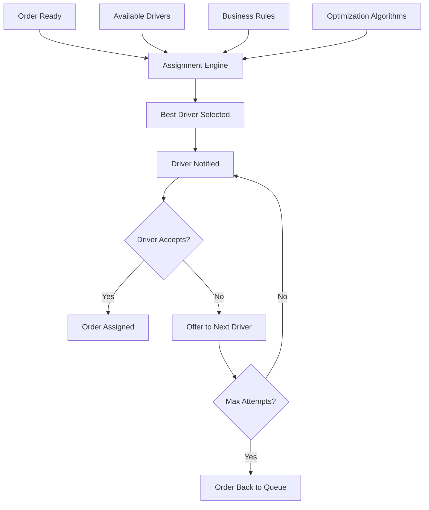

# Software Requirements Specification (SRS)

## Part 03C: Driver Order Assignment

**Module:** Driver/Courier Module (Part 04)
**Version:** 1.0.0
**Status:** Final / For Review
**Date:** 2026-06-30

---

## Chapter 1 – Overview

### Purpose

The Driver Order Assignment module defines the sophisticated logic and algorithms that match customer orders with available drivers in the most efficient, fair, and reliable manner possible. This is the core of the platform's dispatch system—the engine that determines which driver receives which order, when, and under what conditions.

Order assignment is the single most critical operational function of the platform. Poor assignment decisions lead to longer delivery times, higher costs, driver dissatisfaction, and customer churn. Optimal assignment reduces delivery times, increases driver earnings, lowers operational costs, and improves customer satisfaction.

### Objectives

- Minimize delivery times and distances
- Maximize driver utilization and earnings
- Ensure fair distribution of orders among drivers
- Support complex business rules and constraints
- Enable real-time, dynamic reassignment
- Optimize for multi-vendor and batch orders
- Provide transparent assignment logic for drivers
- Support geographic and regulatory constraints

---

## Chapter 2 – Assignment Architecture

### DRV-059 Assignment System Overview

### DRV-060 Assignment Components

| Component | Description | Priority |
| :--- | :--- | :--- |
| **Assignment Engine** | Core matching and decision logic. | **Required** |
| **Driver Availability Manager** | Tracks driver status and location. | **Required** |
| **Order Queue Manager** | Manages pending orders for assignment. | **Required** |
| **Optimization Algorithms** | Distance, time, and cost optimization. | **Required** |
| **Rules Engine** | Enforces business rules and constraints. | **Required** |
| **Performance Monitor** | Tracks assignment performance metrics. | **Required** |
| **Batch Manager** | Manages multi-order batching. | **Required** |

---

## Chapter 3 – Driver Availability Management

### DRV-061 Driver Availability States

| State | Description | Assignment Eligibility |
| :--- | :--- | :--- |
| **Online - Idle** | Driver is online and waiting for orders. | **Eligible** |
| **Online - En Route to Merchant** | Driver is traveling to pickup location. | **Not Eligible** |
| **Online - At Merchant** | Driver has arrived at merchant. | **Not Eligible** |
| **Online - Picked Up** | Driver has picked up the order. | **Not Eligible** |
| **Online - En Route to Customer** | Driver is traveling to customer. | **Not Eligible** |
| **Online - Arriving** | Driver is near customer location. | **Not Eligible** |
| **Online - Delivered** | Driver just completed delivery. | **Eligible** |
| **Break** | Driver is on a break. | **Not Eligible** |
| **Offline** | Driver is offline. | **Not Eligible** |

### DRV-062 Driver Availability Rules

| Rule | Description |
| :--- | :--- |
| **Min Online Duration** | Driver must be online for at least 5 minutes before first assignment. |
| **Max Order Capacity** | Driver can only handle one order at a time (unless batched). |
| **Geographic Availability** | Driver must be within the delivery zone for the order. |
| **Vehicle Compatibility** | Driver's vehicle must match order requirements. |
| **Shift Compliance** | Driver must be within scheduled shift hours. |
| **Rest Period** | Driver must have a minimum rest period between deliveries. |
| **Rating Threshold** | Driver rating must meet minimum threshold (configurable). |

---

## Chapter 4 – Order Queue Management

### DRV-063 Order Queue States

| State | Description |
| :--- | :--- |
| **Pending Assignment** | Order is waiting for driver assignment. |
| **Offering** | Order is being offered to a specific driver. |
| **Assigned** | Order has been assigned to a driver. |
| **Declined** | Order was declined by driver (re-queued). |
| **Expired** | Order expired without assignment. |

### DRV-064 Queue Management Rules

| Rule | Description |
| :--- | :--- |
| **FIFO with Prioritization** | Orders processed FIFO but with priority for VIP/high-value orders. |
| **Order Expiry** | Orders expire after X minutes without assignment (configurable). |
| **Max Attempts** | Maximum attempts per order before escalation. |
| **Queue Depth** | Maximum orders in queue before throttling. |
| **Re-Queuing** | Declined orders re-queued with backoff. |

### DRV-065 Order Priority Levels

| Priority Level | Description | Assignment Window |
| :--- | :--- | :--- |
| **Emergency** | Critical/high-value orders. | Immediate (< 10 sec) |
| **High** | VIP customers, large orders. | < 30 sec |
| **Standard** | Regular orders. | < 60 sec |
| **Low** | Low-value, long-distance orders. | < 120 sec |

---

## Chapter 5 – Assignment Algorithms

### DRV-066 Primary Assignment Algorithm (Distance-Optimized)

The platform uses a **hybrid assignment algorithm** that balances distance optimization with fairness and business rules.

**Base Algorithm:**
1.  Identify all eligible drivers within a certain radius of the merchant.
2.  Calculate a **composite score** for each driver.
3.  Select the driver with the highest composite score.

### DRV-067 Composite Score Calculation

| Factor | Weight | Description |
| :--- | :--- | :--- |
| **Distance** | 35% | Straight-line or road distance to merchant. |
| **ETD (Estimated Time to Destination)** | 25% | Estimated time to reach merchant (traffic-aware). |
| **Driver Rating** | 15% | Customer rating (4.0-5.0 scaled). |
| **Acceptance Rate** | 10% | Driver's historical acceptance rate. |
| **Order History** | 10% | Number of orders assigned to driver today. |
| **Vehicle Type** | 5% | Vehicle suitability for order type. |

### DRV-068 Assignment Process

1.  Order enters assignment queue.
2.  System identifies eligible drivers:
    - Online and idle
    - Within service area
    - Vehicle compatible
    - Meeting rating threshold
3.  System calculates composite score for each driver.
4.  System selects best driver.
5.  System sends order offer to selected driver.
6.  Driver has 30 seconds to accept.
7.  If accepted, order assigned to driver.
8.  If declined/timeout, next driver is selected.
9.  After 5 attempts, order is escalated to support.

### DRV-069 Fallback Assignment

| Scenario | Fallback Strategy |
| :--- | :--- |
| **No Eligible Drivers** | Expand search radius; offer incentive bonus. |
| **All Drivers Decline** | Escalate to support; offer surge pricing. |
| **Order Expiring** | Broad broadcast to all online drivers. |
| **Driver Dropout** | Re-assign to next best driver. |

---

## Chapter 6 – Batch & Multi-Order Assignment

### DRV-070 Batch Assignment

| Feature | Description | Priority |
| :--- | :--- | :--- |
| **Order Batching** | Group multiple orders to same driver. | **Required** |
| **Route Optimization** | Optimize route for multiple orders. | **Required** |
| **Batch Size Limit** | Maximum orders per batch. | **Required** |
| **Batch Value Threshold** | Minimum value for batch creation. | **Required** |
| **Driver Preference** | Driver can opt-in/out of batch orders. | **Medium** |
| **Batch Profitability** | Ensure batch is profitable for driver. | **Required** |

### DRV-071 Batching Criteria

Orders are considered for batching when they meet the following criteria:

| Criterion | Threshold |
| :--- | :--- |
| **Same Geographic Area** | Orders within 2km radius. |
| **Same Merchant** | Orders from the same merchant. |
| **Similar Direction** | Orders heading in similar direction. |
| **Time Proximity** | Orders placed within 5 minutes. |
| **Value Complement** | Combined value exceeds minimum threshold. |

### DRV-072 Batch Assignment Algorithm

1.  Multiple orders in queue.
2.  System identifies potential batch candidates:
    - Same delivery zone
    - Similar routes
    - Compatible merchants
3.  System creates optimal batch of 2-4 orders.
4.  System calculates optimized route.
5.  System offers batch to best driver.
6.  Driver sees combined route and total payout.
7.  Driver accepts/declines batch.
8.  If accepted, all orders assigned to driver.

### DRV-073 Batch Payout Calculation

| Component | Description |
| :--- | :--- |
| **Base Fee per Order** | Base delivery fee × Number of orders. |
| **Distance Bonus** | Additional based on total distance. |
| **Time Bonus** | Additional based on total time. |
| **Batch Bonus** | Incentive for accepting batch. |
| **Total Payout** | Sum of all components. |

---

## Chapter 7 – Real-Time Reassignment

### DRV-074 Reassignment Triggers

| Trigger | Description | Action |
| :--- | :--- | :--- |
| **Driver Dropout** | Driver goes offline after assignment. | Reassign immediately. |
| **Driver Delay** | Driver is significantly delayed. | Consider reassignment. |
| **Order Change** | Order details change (e.g., address). | Evaluate reassignment. |
| **Emergency** | Driver reports emergency. | Reassign immediately. |
| **Better Match** | Higher priority driver becomes available. | Consider reassignment. |

### DRV-075 Reassignment Rules

| Rule | Description |
| :--- | :--- |
| **Grace Period** | No reassignment within first 2 minutes of assignment. |
| **Distance Threshold** | Reassign only if driver is > 500m from merchant. |
| **ETA Threshold** | Reassign only if new ETA is 30% better. |
| **Driver Compensation** | Original driver compensated for travel. |

---

## Chapter 8 – Geographic & Regulatory Constraints

### DRV-076 Geographic Constraints

| Constraint | Description | Priority |
| :--- | :--- | :--- |
| **Delivery Zones** | Orders only assigned to drivers in zone. | **Required** |
| **Cross-Border** | International border restrictions. | **Required** |
| **No-Go Zones** | Areas where delivery is restricted. | **Required** |
| **Congestion Zones** | Higher fees for congested areas. | **Required** |
| **Pedestrian Zones** | Restricted vehicle access. | **Required** |

### DRV-077 Regulatory Constraints

| Constraint | Description | Priority |
| :--- | :--- | :--- |
| **Working Hours** | Legal limits on working hours. | **Required** |
| **Mandatory Breaks** | Required break after X hours. | **Required** |
| **Vehicle Restrictions** | Vehicle type restrictions by area. | **Required** |
| **License Requirements** | Specific license endorsements. | **Required** |
| **Insurance Coverage** | Valid insurance for the area. | **Required** |

---

## Chapter 9 – Surge Pricing & Incentives

### DRV-078 Surge Pricing

| Feature | Description | Priority |
| :--- | :--- | :--- |
| **Demand-Based Surge** | Higher rates during high demand. | **Required** |
| **Supply-Based Surge** | Higher rates during low driver supply. | **Required** |
| **Weather Surge** | Higher rates during adverse weather. | **Required** |
| **Time-Based Surge** | Higher rates during peak hours. | **Required** |
| **Event Surge** | Higher rates during special events. | **Required** |

### DRV-079 Surge Multiplier Calculation

| Factor | Description |
| :--- | :--- |
| **Demand/Supply Ratio** | Orders vs. available drivers. |
| **Weather Severity** | Rain, snow, extreme heat. |
| **Time of Day** | Peak vs. off-peak hours. |
| **Special Events** | Concerts, sports, holidays. |
| **Historical Data** | Historical surge patterns. |

### DRV-080 Driver Incentives

| Incentive Type | Description | Priority |
| :--- | :--- | :--- |
| **Acceptance Bonus** | Bonus for accepting X consecutive orders. | **Required** |
| **Completion Bonus** | Bonus for completing X orders in a day. | **Required** |
| **Streak Bonus** | Bonus for maintaining a streak. | **Medium** |
| **Peak Bonus** | Bonus for working during peak hours. | **Required** |
| **Referral Bonus** | Bonus for referring new drivers. | **Medium** |
| **Rating Bonus** | Bonus for maintaining high rating. | **Medium** |

---

## Chapter 10 – Assignment Analytics

### DRV-081 Assignment Metrics

| Metric | Description | Target |
| :--- | :--- | :--- |
| **Assignment Success Rate** | % of orders successfully assigned. | > 95% |
| **Average Assignment Time** | Time from order to driver assignment. | < 30 sec |
| **Driver Acceptance Rate** | % of offers accepted by drivers. | > 80% |
| **First Offer Acceptance** | % of orders accepted on first offer. | > 70% |
| **Average ETA** | Time from assignment to delivery. | < 30 min |
| **Batch Utilization** | % of orders delivered in batches. | > 30% |
| **Reassignment Rate** | % of orders reassigned. | < 5% |
| **Driver Utilization** | % of online time delivering. | > 60% |

### DRV-082 Assignment Reports

| Report | Description | Schedule | Priority |
| :--- | :--- | :--- | :--- |
| **Assignment Performance** | Key assignment metrics summary. | Daily | **Required** |
| **Driver Performance** | Individual driver assignment metrics. | Weekly | **Required** |
| **Surge Analysis** | Surge pricing effectiveness. | Weekly | **Required** |
| **Zone Analysis** | Performance by delivery zone. | Weekly | **Required** |
| **Batch Analysis** | Batch order performance. | Weekly | **Required** |
| **Peak Analysis** | Peak hour performance. | Monthly | **Required** |

---

## Chapter 11 – Database Tables

### assignment_queue

| Column | Type | Constraints | Description |
| :--- | :--- | :--- | :--- |
| `queue_id` | UUID | PRIMARY KEY | Unique queue identifier |
| `order_id` | UUID | FOREIGN KEY (merchant_orders.order_id) | Associated order |
| `priority_level` | VARCHAR(20) | NOT NULL | EMERGENCY/HIGH/STANDARD/LOW |
| `attempt_count` | INTEGER | DEFAULT 0 | Number of assignment attempts |
| `max_attempts` | INTEGER | DEFAULT 5 | Maximum attempts allowed |
| `status` | VARCHAR(20) | DEFAULT 'PENDING' | PENDING/OFFERING/ASSIGNED/DECLINED/EXPIRED |
| `offered_driver_ids` | TEXT[] | | IDs of drivers already offered |
| `declined_driver_ids` | TEXT[] | | IDs of drivers who declined |
| `expiry_time` | TIMESTAMP | NOT NULL | Order assignment expiry |
| `created_at` | TIMESTAMP | DEFAULT NOW() | Creation timestamp |
| `updated_at` | TIMESTAMP | DEFAULT NOW() | Last update timestamp |

### assignment_attempts

| Column | Type | Constraints | Description |
| :--- | :--- | :--- | :--- |
| `attempt_id` | UUID | PRIMARY KEY | Unique attempt identifier |
| `order_id` | UUID | FOREIGN KEY (merchant_orders.order_id) | Associated order |
| `driver_id` | UUID | FOREIGN KEY (driver_accounts.driver_id) | Driver offered |
| `attempt_number` | INTEGER | NOT NULL | Attempt sequence number |
| `score` | DECIMAL(10, 4) | | Composite score for this driver |
| `distance` | DECIMAL(10, 2) | | Distance to merchant (km) |
| `eta` | INTEGER | | Estimated time to merchant (sec) |
| `status` | VARCHAR(20) | NOT NULL | OFFERED/ACCEPTED/DECLINED/TIMEOUT |
| `response_time` | INTEGER | | Time to respond (sec) |
| `decline_reason` | VARCHAR(50) | | Reason for decline (if any) |
| `offered_at` | TIMESTAMP | | Offer timestamp |
| `responded_at` | TIMESTAMP | | Response timestamp |
| `created_at` | TIMESTAMP | DEFAULT NOW() | Creation timestamp |

### driver_availability

| Column | Type | Constraints | Description |
| :--- | :--- | :--- | :--- |
| `availability_id` | UUID | PRIMARY KEY | Unique availability identifier |
| `driver_id` | UUID | FOREIGN KEY (driver_accounts.driver_id) | Associated driver |
| `status` | VARCHAR(20) | NOT NULL | ONLINE_IDLE/ONLINE_BUSY/BREAK/OFFLINE |
| `current_latitude` | DECIMAL(10, 8) | | Current GPS latitude |
| `current_longitude` | DECIMAL(11, 8) | | Current GPS longitude |
| `last_update` | TIMESTAMP | | Last GPS update timestamp |
| `current_order_id` | UUID | | Active order (if any) |
| `online_since` | TIMESTAMP | | Online start timestamp |
| `active_since` | TIMESTAMP | | Active delivery start timestamp |
| `created_at` | TIMESTAMP | DEFAULT NOW() | Creation timestamp |
| `updated_at` | TIMESTAMP | DEFAULT NOW() | Last update timestamp |

### assignment_scores

| Column | Type | Constraints | Description |
| :--- | :--- | :--- | :--- |
| `score_id` | UUID | PRIMARY KEY | Unique score identifier |
| `driver_id` | UUID | FOREIGN KEY (driver_accounts.driver_id) | Associated driver |
| `order_id` | UUID | FOREIGN KEY (merchant_orders.order_id) | Associated order |
| `distance_score` | DECIMAL(5, 2) | | Distance factor score |
| `eta_score` | DECIMAL(5, 2) | | ETA factor score |
| `rating_score` | DECIMAL(5, 2) | | Rating factor score |
| `acceptance_score` | DECIMAL(5, 2) | | Acceptance rate score |
| `history_score` | DECIMAL(5, 2) | | Order history score |
| `vehicle_score` | DECIMAL(5, 2) | | Vehicle suitability score |
| `total_score` | DECIMAL(10, 4) | | Composite total score |
| `created_at` | TIMESTAMP | DEFAULT NOW() | Creation timestamp |

### batch_orders

| Column | Type | Constraints | Description |
| :--- | :--- | :--- | :--- |
| `batch_id` | UUID | PRIMARY KEY | Unique batch identifier |
| `driver_id` | UUID | FOREIGN KEY (driver_accounts.driver_id) | Assigned driver |
| `order_ids` | TEXT[] | NOT NULL | Orders in the batch |
| `total_payout` | DECIMAL(10, 2) | NOT NULL | Total batch payout |
| `total_distance` | DECIMAL(10, 2) | NOT NULL | Total distance (km) |
| `total_time` | INTEGER | NOT NULL | Total time (minutes) |
| `status` | VARCHAR(20) | DEFAULT 'OFFERED' | OFFERED/ACCEPTED/COMPLETED/CANCELLED |
| `offered_at` | TIMESTAMP | | Offer timestamp |
| `accepted_at` | TIMESTAMP | | Acceptance timestamp |
| `completed_at` | TIMESTAMP | | Completion timestamp |
| `created_at` | TIMESTAMP | DEFAULT NOW() | Creation timestamp |
| `updated_at` | TIMESTAMP | DEFAULT NOW() | Last update timestamp |

### surge_pricing

| Column | Type | Constraints | Description |
| :--- | :--- | :--- | :--- |
| `surge_id` | UUID | PRIMARY KEY | Unique surge identifier |
| `zone_id` | UUID | FOREIGN KEY (delivery_zones.zone_id) | Applicable zone |
| `multiplier` | DECIMAL(3, 2) | NOT NULL | Surge multiplier |
| `trigger_reason` | VARCHAR(50) | NOT NULL | DEMAND/SUPPLY/WEATHER/TIME/EVENT |
| `demand_ratio` | DECIMAL(5, 2) | | Orders vs. drivers ratio |
| `start_time` | TIMESTAMP | NOT NULL | Surge start timestamp |
| `end_time` | TIMESTAMP | | Surge end timestamp |
| `is_active` | BOOLEAN | DEFAULT TRUE | Active status |
| `created_at` | TIMESTAMP | DEFAULT NOW() | Creation timestamp |
| `updated_at` | TIMESTAMP | DEFAULT NOW() | Last update timestamp |

### driver_incentives

| Column | Type | Constraints | Description |
| :--- | :--- | :--- | :--- |
| `incentive_id` | UUID | PRIMARY KEY | Unique incentive identifier |
| `driver_id` | UUID | FOREIGN KEY (driver_accounts.driver_id) | Associated driver |
| `incentive_type` | VARCHAR(30) | NOT NULL | ACCEPTANCE/COMPLETION/STREAK/PEAK/REFERRAL/RATING |
| `description` | TEXT | | Incentive description |
| `target_value` | INTEGER | | Target (e.g., 10 completions) |
| `achieved_value` | INTEGER | DEFAULT 0 | Achieved value |
| `bonus_amount` | DECIMAL(10, 2) | NOT NULL | Bonus amount |
| `status` | VARCHAR(20) | DEFAULT 'IN_PROGRESS' | IN_PROGRESS/COMPLETED/PAID/EXPIRED |
| `expiry_date` | DATE | | Incentive expiry date |
| `completed_at` | TIMESTAMP | | Completion timestamp |
| `paid_at` | TIMESTAMP | | Payout timestamp |
| `created_at` | TIMESTAMP | DEFAULT NOW() | Creation timestamp |
| `updated_at` | TIMESTAMP | DEFAULT NOW() | Last update timestamp |

---

## Chapter 12 – REST APIs

### Assignment APIs

| Method | Endpoint | Description |
| :--- | :--- | :--- |
| `GET` | `/api/v1/dispatch/queue` | Get assignment queue |
| `GET` | `/api/v1/dispatch/orders/pending` | Get pending orders |
| `POST` | `/api/v1/dispatch/order/{id}/assign` | Manually assign order |
| `GET` | `/api/v1/dispatch/order/{id}/status` | Get assignment status |
| `POST` | `/api/v1/dispatch/batch/create` | Create batch assignment |

### Driver Availability APIs

| Method | Endpoint | Description |
| :--- | :--- | :--- |
| `GET` | `/api/v1/dispatch/drivers/available` | Get available drivers |
| `GET` | `/api/v1/dispatch/drivers/nearby` | Get nearby drivers |
| `GET` | `/api/v1/dispatch/drivers/{id}/status` | Get driver status |
| `PUT` | `/api/v1/dispatch/drivers/{id}/status` | Update driver status |

### Assignment Analytics APIs

| Method | Endpoint | Description |
| :--- | :--- | :--- |
| `GET` | `/api/v1/dispatch/analytics/dashboard` | Get assignment analytics |
| `GET` | `/api/v1/dispatch/analytics/metrics` | Get assignment metrics |
| `GET` | `/api/v1/dispatch/analytics/drivers` | Get driver performance |

### Surge Pricing APIs

| Method | Endpoint | Description |
| :--- | :--- | :--- |
| `GET` | `/api/v1/dispatch/surge/current` | Get current surge pricing |
| `GET` | `/api/v1/dispatch/surge/history` | Get surge pricing history |
| `POST` | `/api/v1/dispatch/surge` | Create surge pricing (admin) |
| `DELETE` | `/api/v1/dispatch/surge/{id}` | End surge pricing (admin) |

### Incentives APIs

| Method | Endpoint | Description |
| :--- | :--- | :--- |
| `GET` | `/api/v1/dispatch/incentives` | Get active incentives |
| `GET` | `/api/v1/dispatch/driver/{id}/incentives` | Get driver incentives |
| `POST` | `/api/v1/dispatch/incentives` | Create incentive (admin) |

---

## Chapter 13 – Business Rules

| Rule ID | Rule Description | Priority |
| :--- | :--- | :--- |
| **BR-ASN-001** | Orders are assigned to the driver with the highest composite score. | **High** |
| **BR-ASN-002** | Drivers must be within delivery zone to receive orders. | **High** |
| **BR-ASN-003** | Drivers on break or offline are not eligible for assignment. | **High** |
| **BR-ASN-004** | Offer acceptance timer: 30 seconds. | **High** |
| **BR-ASN-005** | 3 consecutive declines trigger auto-offline. | **High** |
| **BR-ASN-006** | Orders expire after 5 assignment attempts without acceptance. | **High** |
| **BR-ASN-007** | Batching allowed for orders within 2km and same direction. | **High** |
| **BR-ASN-008** | Maximum batch size: 4 orders. | **High** |
| **BR-ASN-009** | Minimum driver rating: 4.0 for assignment eligibility. | **High** |
| **BR-ASN-010** | Surge pricing applies when demand/supply ratio exceeds 1.5. | **Required** |

---

## Chapter 14 – Acceptance Tests

| Test ID | Test Description | Priority |
| :--- | :--- | :--- |
| **TEST-ASN-001** | Order assigned to nearest eligible driver. | **High** |
| **TEST-ASN-002** | Order offered to driver with highest composite score. | **High** |
| **TEST-ASN-003** | Driver accepts order; status updates to assigned. | **High** |
| **TEST-ASN-004** | Driver declines order; offered to next driver. | **High** |
| **TEST-ASN-005** | Order auto-declines after timer expires; offered to next driver. | **High** |
| **TEST-ASN-006** | Order expires after max attempts; escalated to support. | **High** |
| **TEST-ASN-007** | Driver online but outside zone; not eligible for orders. | **High** |
| **TEST-ASN-008** | Driver on break; not eligible for orders. | **High** |
| **TEST-ASN-009** | Batch order created for multiple orders (same zone). | **High** |
| **TEST-ASN-010** | Batch route optimized for multiple orders. | **High** |
| **TEST-ASN-011** | Driver accepts batch; all orders assigned. | **High** |
| **TEST-ASN-012** | Surge pricing applied during peak demand. | **High** |
| **TEST-ASN-013** | Surge pricing multiplier correctly applied to payout. | **High** |
| **TEST-ASN-014** | Driver reassigned when original driver drops out. | **High** |
| **TEST-ASN-015** | Driver reassignment only after grace period. | **High** |
| **TEST-ASN-016** | Assignment score calculation includes distance factor. | **High** |
| **TEST-ASN-017** | Assignment score calculation includes rating factor. | **High** |
| **TEST-ASN-018** | Assignment score calculation includes acceptance rate. | **High** |
| **TEST-ASN-019** | 3 declines trigger auto-offline. | **High** |
| **TEST-ASN-020** | Driver performance dashboard shows assignment metrics. | **High** |
| **TEST-ASN-021** | Admin manually assigns order to specific driver. | **High** |
| **TEST-ASN-022** | Admin creates surge pricing for specific zone. | **High** |
| **TEST-ASN-023** | Admin creates driver incentive. | **High** |
| **TEST-ASN-024** | Driver completes incentive; bonus paid. | **High** |

---

## Chapter 15 – Traceability Matrix

| Requirement | Database Table | API Endpoint(s) | Acceptance Test |
| :--- | :--- | :--- | :--- |
| DRV-060 | assignment_queue | GET /api/v1/dispatch/queue | TEST-ASN-001 |
| DRV-066 | assignment_scores | POST /api/v1/dispatch/order/{id}/assign | TEST-ASN-002 |
| DRV-068 | assignment_attempts | GET /api/v1/dispatch/order/{id}/status | TEST-ASN-003, TEST-ASN-004, TEST-ASN-005 |
| DRV-068 | assignment_queue | GET /api/v1/dispatch/queue | TEST-ASN-006 |
| DRV-061 | driver_availability | GET /api/v1/dispatch/drivers/available | TEST-ASN-007, TEST-ASN-008 |
| DRV-070 | batch_orders | POST /api/v1/dispatch/batch/create | TEST-ASN-009, TEST-ASN-010, TEST-ASN-011 |
| DRV-078 | surge_pricing | GET /api/v1/dispatch/surge/current | TEST-ASN-012, TEST-ASN-013 |
| DRV-074 | assignment_queue | GET /api/v1/dispatch/order/{id}/status | TEST-ASN-014, TEST-ASN-015 |
| DRV-067 | assignment_scores | POST /api/v1/dispatch/order/{id}/assign | TEST-ASN-016, TEST-ASN-017, TEST-ASN-018 |
| DRV-081 | assignment_attempts | GET /api/v1/dispatch/analytics/dashboard | TEST-ASN-020 |
| DRV-078 | surge_pricing | POST /api/v1/dispatch/surge | TEST-ASN-022 |
| DRV-080 | driver_incentives | POST /api/v1/dispatch/incentives | TEST-ASN-023, TEST-ASN-024 |

---

## Chapter 16 – Summary

This document establishes the complete driver order assignment capability for the **[Platform Name]** platform. Key takeaways:

- **Intelligent Assignment:** Composite scoring algorithm balances distance, ETA, rating, acceptance rate, and order history to select the optimal driver for each order.
- **Efficient Batching:** Multi-order batching with route optimization improves driver earnings and reduces delivery times.
- **Real-Time Responsiveness:** Dynamic reassignment handles driver dropouts, delays, and better matches.
- **Surge Pricing:** Demand-based surge pricing with configurable multipliers to balance supply and demand.
- **Driver Incentives:** Bonuses for acceptance, completion, streaks, and peak work to motivate driver behavior.
- **Geographic Constraints:** Delivery zones, no-go zones, and regulatory compliance built into assignment logic.
- **Transparent Analytics:** Comprehensive assignment metrics and performance dashboards for operational visibility.
- **Administrative Control:** Manual assignment, surge pricing management, and incentive creation for operations teams.

The driver order assignment module is the intellectual engine of the platform's logistics. Optimal assignment decisions directly translate to faster deliveries, higher driver earnings, better customer satisfaction, and lower operational costs.

---

**Next Document:**

`Part_03D_Driver_Delivery_Management.md`

*(This builds on order assignment to define how drivers manage the end-to-end delivery process, from pickup through to successful delivery.)*