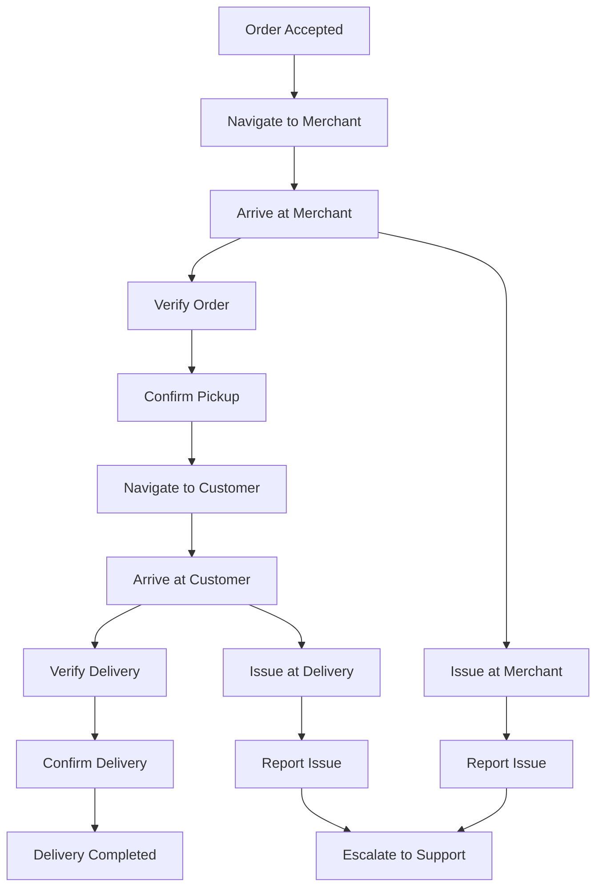
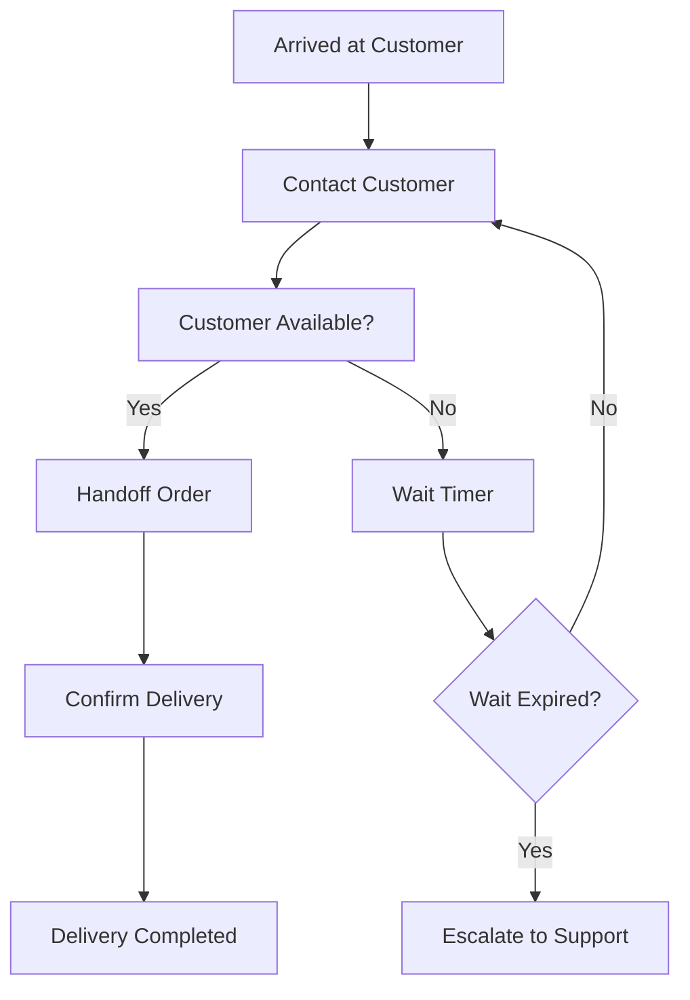

# Software Requirements Specification (SRS)

## Part 03D: Driver Delivery Management

**Module:** Driver/Courier Module (Part 04)
**Version:** 1.0.0
**Status:** Final / For Review
**Date:** 2026-06-30

---

## Chapter 1 – Overview

### Purpose

The Driver Delivery Management module defines the complete execution workflow for drivers from the moment they accept an order through to successful delivery completion. This encompasses pickup procedures, navigation, delivery execution, verification, exception handling, and post-delivery actions.

Delivery execution is where the platform's service promise is fulfilled. Every delivery is a moment of truth—a successful, efficient, and professional delivery builds customer trust and driver satisfaction. Conversely, poor delivery execution damages the platform's reputation and customer retention. This module ensures drivers have clear, consistent, and efficient workflows for every delivery.

### Objectives

- Provide clear, step-by-step delivery workflow guidance
- Enable efficient and accurate order pickup verification
- Support multiple delivery confirmation methods
- Handle delivery exceptions gracefully
- Ensure safety and compliance during deliveries
- Enable real-time tracking and visibility for customers
- Support contactless and traditional delivery options
- Provide post-delivery feedback and issue reporting

---

## Chapter 2 – Delivery Workflow Overview

### DRV-083 End-to-End Delivery Workflow

### DRV-084 Workflow Stages

| Stage | Description | Priority |
| :--- | :--- | :--- |
| **Stage 1: Order Acceptance** | Driver accepts the order offer. | **Required** |
| **Stage 2: Merchant Navigation** | Driver navigates to the merchant location. | **Required** |
| **Stage 3: Merchant Arrival** | Driver arrives and checks in at the merchant. | **Required** |
| **Stage 4: Order Pickup** | Driver verifies and picks up the order. | **Required** |
| **Stage 5: Customer Navigation** | Driver navigates to the customer location. | **Required** |
| **Stage 6: Customer Arrival** | Driver arrives at the delivery location. | **Required** |
| **Stage 7: Delivery Execution** | Driver completes the delivery. | **Required** |
| **Stage 8: Post-Delivery** | Driver completes post-delivery actions. | **Required** |

---

## Chapter 3 – Merchant Arrival & Pickup

### DRV-085 Merchant Arrival Process

| Step | Description | Priority |
| :--- | :--- | :--- |
| **1. Arrive Notification** | Driver taps "Arrived at Merchant" in app. | **Required** |
| **2. GPS Verification** | System verifies driver is within 50m of merchant. | **Required** |
| **3. Merchant Notification** | Merchant receives notification of driver arrival. | **Required** |
| **4. Order Verification** | Driver verifies order details against items. | **Required** |
| **5. Wait Timer** | Timer starts for merchant preparation time. | **Required** |
| **6. Pickup Confirmation** | Driver confirms pickup when ready. | **Required** |

### DRV-086 Order Verification at Pickup

| Verification Step | Description |
| :--- | :--- |
| **Order ID Check** | Confirm correct order by order number. |
| **Item Count Check** | Verify number of items matches order. |
| **Item Quality Check** | Inspect items for quality and packaging. |
| **Special Instructions** | Verify special instructions are followed. |
| **Delivery Address** | Confirm delivery address is correct. |
| **Payment Status** | Verify payment is confirmed (if applicable). |

### DRV-087 Pickup Confirmation Methods

| Method | Description | Priority |
| :--- | :--- | :--- |
| **Manual Tap** | Driver taps "Confirm Pickup" button. | **Required** |
| **GPS Verification** | Driver must be within merchant geofence. | **Required** |
| **QR Code Scan** | Driver scans merchant's QR code. | **Required** |
| **Code Entry** | Driver enters merchant-provided pickup code. | **Medium** |
| **Photo Verification** | Driver takes photo of order at merchant. | **Medium** |

### DRV-088 Pickup Timer & SLA

| Timer | Duration | Action |
| :--- | :--- | :--- |
| **Order Ready Timer** | Merchant SLA for order readiness. | Merchant must have order ready by this time. |
| **Wait Time** | 10 minutes | Driver waits for order; if not ready, can reassign. |
| **Pickup Window** | 15 minutes | Driver must pickup within this window. |

### DRV-089 Merchant Issue Handling

| Issue | Handling |
| :--- | :--- |
| **Order Not Ready** | Driver waits; merchant updates ETA; customer notified. |
| **Item Unavailable** | Merchant contacts customer for substitution. |
| **Wrong Order** | Driver reports issue; merchant corrects. |
| **Order Cancelled** | Driver notified; order removed from driver. |
| **Merchant Closed** | Driver reports; order escalated to support. |
| **Safety Concern** | Driver reports; support escalates. |

---

## Chapter 4 – Customer Navigation & Arrival

### DRV-090 Navigation to Customer

| Feature | Description | Priority |
| :--- | :--- | :--- |
| **Turn-by-Turn Navigation** | Step-by-step directions to customer. | **Required** |
| **Live Traffic Updates** | Real-time traffic conditions and ETA. | **Required** |
| **Route Optimization** | Fastest or most efficient route. | **Required** |
| **ETA Updates** | Dynamic ETA with real-time updates. | **Required** |
| **Customer Location Pin** | Precise customer location on map. | **Required** |
| **Address Verification** | Confirm address before arrival. | **Required** |
| **Parking Suggestions** | Nearby parking suggestions (if applicable). | **Medium** |

### DRV-091 Customer Arrival Process

| Step | Description | Priority |
| :--- | :--- | :--- |
| **1. Arrive Notification** | Driver taps "Arrived at Customer" in app. | **Required** |
| **2. GPS Verification** | System verifies driver is within 50m of customer. | **Required** |
| **3. Customer Notification** | Customer receives notification of driver arrival. | **Required** |
| **4. Contact Customer** | Driver contacts customer if needed. | **Required** |
| **5. Delivery Preparation** | Driver prepares order for handoff. | **Required** |

### DRV-092 Customer Contact Methods

| Method | Description | Priority |
| :--- | :--- | :--- |
| **In-App Chat** | Send message to customer. | **Required** |
| **Masked Call** | Call customer via masked number. | **Required** |
| **SMS** | Send SMS to customer (if enabled). | **Medium** |
| **Alert** | Customer receives arrival push notification. | **Required** |

---

## Chapter 5 – Delivery Execution

### DRV-093 Delivery Execution Process

### DRV-094 Delivery Confirmation Methods

| Method | Description | Priority |
| :--- | :--- | :--- |
| **QR Code Scan** | Customer displays QR code; driver scans. | **Required** |
| **OTP Entry** | Customer provides OTP; driver enters. | **Required** |
| **Photo Proof** | Driver takes photo of delivered order at door. | **Required** |
| **GPS Verification** | Driver must be within delivery location geofence. | **Required** |
| **Digital Signature** | Customer signs on driver's device. | **Optional** |
| **Voice Confirmation** | "I have received my order" (voice recognition). | **Future** |

### DRV-095 QR Code Delivery Flow

1.  Driver arrives at delivery location.
2.  Customer opens app and navigates to order tracking.
3.  Unique, time-sensitive QR code is displayed.
4.  Driver scans the QR code using the driver app camera.
5.  System validates the QR code (correct order, not expired).
6.  Upon successful validation, delivery is confirmed.
7.  Order status transitions to `DELIVERED`.
8.  Both parties receive confirmation.

### DRV-096 OTP Delivery Flow

1.  Driver arrives at delivery location.
2.  Customer receives a 4-6 digit OTP via push notification/SMS.
3.  Customer verbally provides the OTP to the driver.
4.  Driver enters OTP into the driver app.
5.  System validates the OTP.
6.  Upon success, delivery is confirmed.
7.  Order status transitions to `DELIVERED`.

### DRV-097 Photo Proof Delivery Flow (Contactless)

1.  Driver arrives at delivery location.
2.  Driver places the order at the door (as per instructions).
3.  Driver takes a photo of the delivered order.
4.  Optionally includes a photo of the door/house number.
5.  Photo is uploaded and associated with the order.
6.  Driver confirms delivery.
7.  Customer receives notification and can view the photo.

### DRV-098 Contactless Delivery

| Feature | Description | Priority |
| :--- | :--- | :--- |
| **Drop-off Instruction** | Customer specifies: "Leave at door", "Leave with reception". | **Required** |
| **Photo Proof** | Driver uploads photo of dropped order. | **Required** |
| **Touchless Verification** | QR code/OTP verification without physical handoff. | **Required** |
| **Default Preference** | Customer can set contactless as default. | **Required** |
| **Safe Location** | Driver selects safe drop-off location. | **Required** |

---

## Chapter 6 – Delivery Exceptions

### DRV-099 Exception Scenarios

| Scenario | Description | Handling |
| :--- | :--- | :--- |
| **Customer Not Available** | Customer doesn't respond to contact attempts. | Wait 5 minutes, attempt contact, escalate to support. |
| **Wrong Address** | Address is incorrect or incomplete. | Contact customer for correction; support escalation. |
| **Customer Not Home** | Customer is not at the address. | Attempt contact; if unavailable, return to merchant. |
| **Address Unclear** | Building number/gate code missing. | Contact customer for instructions. |
| **Security Issue** | Driver feels unsafe at location. | Driver cancels delivery, returns to merchant. |
| **Order Damaged** | Order is damaged during transit. | Report damage; customer notified; refund/replacement. |
| **Wrong Order** | Driver realizes order is incorrect. | Contact support; appropriate resolution. |
| **Customer Refuses Delivery** | Customer refuses to accept order. | Return to merchant; support handles. |

### DRV-100 Customer Unavailability Protocol

| Step | Action | Duration |
| :--- | :--- | :--- |
| **1. Initial Contact** | Driver attempts call/chat. | 0-2 min |
| **2. Second Contact** | Driver attempts second call/chat. | 2-5 min |
| **3. Wait Period** | Driver waits at location. | 5-10 min |
| **4. Escalation** | Driver reports to support. | 10 min |
| **5. Resolution** | Support decides next steps. | Variable |

### DRV-101 Delivery Failure Escalation

1.  Driver attempts delivery and fails (per scenario above).
2.  Driver marks order as `FAILED_DELIVERY` in app.
3.  System notifies customer via push notification and email.
4.  Customer has options:
    - Reschedule delivery (if possible).
    - Cancel order and request refund.
    - Contact support for assistance.
5.  Support team investigates and resolves.
6.  Order status transitions to `CANCELLED` or `REFUNDED`.

### DRV-102 Order Returns

| Return Type | Description | Handling |
| :--- | :--- | :--- |
| **Return to Merchant** | Order returned to the merchant. | Driver returns order to merchant; merchant confirms receipt. |
| **Return to Hub** | Order returned to a central hub. | Driver returns order to designated hub location. |
| **Dispose** | Order disposed (perishable/damaged). | Driver disposes per instructions; support notified. |

---

## Chapter 7 – Safety & Compliance

### DRV-103 Driver Safety Protocols

| Protocol | Description | Priority |
| :--- | :--- | :--- |
| **Emergency SOS** | One-tap emergency alert to support and emergency services. | **Required** |
| **Safety Check-in** | Periodic safety check-in during deliveries. | **Required** |
| **Incident Reporting** | Report safety incidents immediately. | **Required** |
| **Unsafe Zone Alert** | Alert driver when entering unsafe zones. | **Required** |
| **After Hours Protocol** | Safety protocol for late-night deliveries. | **Required** |
| **Driver Location Sharing** | Share location with designated contacts. | **Medium** |

### DRV-104 Emergency SOS Process

1.  Driver taps emergency SOS button in app.
2.  System immediately notifies:
    - Platform support team
    - Emergency services (if configured)
    - Designated emergency contact
3.  System shares driver's current GPS location.
4.  System initiates a continuous location update.
5.  Support team attempts to contact driver.
6.  Incident logged and investigated.

### DRV-105 Compliance During Delivery

| Compliance Requirement | Description | Priority |
| :--- | :--- | :--- |
| **Food Safety** | Maintain proper food handling and temperature. | **Required** |
| **Vehicle Safety** | Vehicle must be roadworthy and insured. | **Required** |
| **Documentation** | Carry required documents (license, registration, insurance). | **Required** |
| **Working Hours** | Adhere to legal working hour limits. | **Required** |
| **Rest Periods** | Take required breaks. | **Required** |
| **Licensing** | Maintain valid driving license for vehicle category. | **Required** |

---

## Chapter 8 – Communication During Delivery

### DRV-106 Communication Channels

| Channel | Description | Priority |
| :--- | :--- | :--- |
| **In-App Chat** | Real-time text chat with customer/merchant. | **Required** |
| **Masked Voice Call** | Call customer/merchant via masked number. | **Required** |
| **Push Notifications** | Status updates and alerts. | **Required** |
| **SMS** | Backup SMS notifications. | **Medium** |

### DRV-107 Communication Use Cases

| Scenario | Sender | Receiver | Channel |
| :--- | :--- | :--- | :--- |
| **Arrived at Merchant** | Driver | Customer | Auto-push |
| **Order Delayed** | Merchant | Driver | Chat |
| **Pickup Confirmation** | Driver | Customer | Auto-push |
| **En Route** | Driver | Customer | Auto-push |
| **Arriving Soon** | Driver | Customer | Auto-push |
| **Address Issue** | Customer | Driver | Chat/Call |
| **Delivery Completed** | Driver | Customer | Auto-push |

### DRV-108 Quick Replies

| Quick Reply | Use Case |
| :--- | :--- |
| "I'm here!" | Driver arrived at customer location. |
| "On my way!" | Driver en route to customer. |
| "Please wait, 2 minutes away!" | Driver near customer location. |
| "Could you please provide directions?" | Driver needs help finding address. |
| "I've arrived at the gate." | Driver at gated community. |
| "I'm at the lobby." | Driver at building lobby. |

---

## Chapter 9 – Post-Delivery Actions

### DRV-109 Post-Delivery Workflow

| Step | Description | Priority |
| :--- | :--- | :--- |
| **1. Delivery Confirmation** | Delivery successfully confirmed. | **Required** |
| **2. Customer Rating** | Customer rates the delivery experience. | **Required** |
| **3. Earnings Update** | Earnings updated in driver dashboard. | **Required** |
| **4. Next Order** | Driver becomes available for next order. | **Required** |
| **5. Feedback** | Optional driver feedback on the delivery. | **Required** |
| **6. Issue Reporting** | Report any issues encountered. | **Required** |

### DRV-110 Post-Delivery Feedback

| Feedback Type | Description | Priority |
| :--- | :--- | :--- |
| **Customer Rating** | Customer rates driver and delivery. | **Required** |
| **Driver Rating** | Driver rates customer and delivery experience. | **Required** |
| **Merchant Feedback** | Driver provides feedback on merchant. | **Required** |
| **Delivery Issue** | Driver reports any issues encountered. | **Required** |

---

## Chapter 10 – Database Tables

### driver_deliveries

| Column | Type | Constraints | Description |
| :--- | :--- | :--- | :--- |
| `delivery_id` | UUID | PRIMARY KEY | Unique delivery identifier |
| `order_id` | UUID | UNIQUE, FOREIGN KEY (merchant_orders.order_id) | Associated order |
| `driver_id` | UUID | FOREIGN KEY (driver_accounts.driver_id) | Assigned driver |
| `status` | VARCHAR(20) | NOT NULL | ASSIGNED/NAVIGATING_MERCHANT/AT_MERCHANT/PICKED_UP/NAVIGATING_CUSTOMER/AT_CUSTOMER/DELIVERED/FAILED |
| `accepted_at` | TIMESTAMP | | Order acceptance timestamp |
| `arrived_merchant_at` | TIMESTAMP | | Merchant arrival timestamp |
| `picked_up_at` | TIMESTAMP | | Pickup confirmation timestamp |
| `arrived_customer_at` | TIMESTAMP | | Customer arrival timestamp |
| `delivered_at` | TIMESTAMP | | Delivery completion timestamp |
| `failed_at` | TIMESTAMP | | Delivery failure timestamp |
| `failure_reason` | VARCHAR(50) | | Reason for failure |
| `pickup_verification_method` | VARCHAR(20) | | QR/OTP/MANUAL/PHOTO |
| `delivery_verification_method` | VARCHAR(20) | | QR/OTP/PHOTO/GPS/SIGNATURE |
| `verification_status` | VARCHAR(20) | DEFAULT 'PENDING' | PENDING/VERIFIED/FAILED |
| `qr_code` | VARCHAR(100) | | QR code for verification |
| `otp_code` | VARCHAR(10) | | OTP for verification (encrypted) |
| `photo_url` | VARCHAR(500) | | Delivery photo URL |
| `customer_contacted` | BOOLEAN | DEFAULT FALSE | Whether driver contacted customer |
| `instructions_used` | TEXT | | Delivery instructions applied |
| `route_data` | JSONB | | Encoded route polyline |
| `total_distance` | DECIMAL(10, 2) | | Total distance driven (km) |
| `total_time` | INTEGER | | Total time from pickup to delivery (seconds) |
| `driver_rating` | INTEGER | | Customer rating of driver (1-5) |
| `customer_rating` | INTEGER | | Driver rating of customer (1-5) |
| `created_at` | TIMESTAMP | DEFAULT NOW() | Creation timestamp |
| `updated_at` | TIMESTAMP | DEFAULT NOW() | Last update timestamp |

### delivery_location_history

| Column | Type | Constraints | Description |
| :--- | :--- | :--- | :--- |
| `history_id` | UUID | PRIMARY KEY | Unique location history entry |
| `delivery_id` | UUID | FOREIGN KEY (driver_deliveries.delivery_id) | Associated delivery |
| `latitude` | DECIMAL(10, 8) | NOT NULL | GPS latitude |
| `longitude` | DECIMAL(11, 8) | NOT NULL | GPS longitude |
| `accuracy` | DECIMAL(5, 2) | | GPS accuracy (meters) |
| `speed` | DECIMAL(5, 2) | | Speed (km/h) |
| `heading` | DECIMAL(5, 2) | | Heading direction (degrees) |
| `recorded_at` | TIMESTAMP | DEFAULT NOW() | Location timestamp |
| `created_at` | TIMESTAMP | DEFAULT NOW() | Record creation timestamp |

### delivery_communications

| Column | Type | Constraints | Description |
| :--- | :--- | :--- | :--- |
| `communication_id` | UUID | PRIMARY KEY | Unique communication identifier |
| `delivery_id` | UUID | FOREIGN KEY (driver_deliveries.delivery_id) | Associated delivery |
| `sender_type` | VARCHAR(10) | NOT NULL | DRIVER/CUSTOMER/MERCHANT/SYSTEM |
| `sender_id` | UUID | | Sender identifier |
| `receiver_type` | VARCHAR(10) | NOT NULL | DRIVER/CUSTOMER/MERCHANT |
| `receiver_id` | UUID | | Receiver identifier |
| `message_type` | VARCHAR(20) | NOT NULL | TEXT/IMAGE/AUDIO/CALL |
| `message_content` | TEXT | | Message content (encrypted) |
| `content_url` | VARCHAR(500) | | URL for media content |
| `is_read` | BOOLEAN | DEFAULT FALSE | Read status |
| `read_at` | TIMESTAMP | | Read timestamp |
| `created_at` | TIMESTAMP | DEFAULT NOW() | Message creation timestamp |

### delivery_issues

| Column | Type | Constraints | Description |
| :--- | :--- | :--- | :--- |
| `issue_id` | UUID | PRIMARY KEY | Unique issue identifier |
| `delivery_id` | UUID | FOREIGN KEY (driver_deliveries.delivery_id) | Associated delivery |
| `issue_type` | VARCHAR(30) | NOT NULL | CUSTOMER_UNAVAILABLE/WRONG_ADDRESS/ORDER_DAMAGED/SAFETY_CONCERN/MERCHANT_ISSUE/OTHER |
| `description` | TEXT | NOT NULL | Issue description |
| `reported_by` | VARCHAR(20) | NOT NULL | DRIVER/CUSTOMER/MERCHANT |
| `reported_by_id` | UUID | | Reporter identifier |
| `status` | VARCHAR(20) | DEFAULT 'OPEN' | OPEN/IN_PROGRESS/RESOLVED/CLOSED |
| `resolution` | TEXT | | Resolution description |
| `resolved_by` | UUID | | Resolver identifier |
| `resolved_at` | TIMESTAMP | | Resolution timestamp |
| `created_at` | TIMESTAMP | DEFAULT NOW() | Issue creation timestamp |
| `updated_at` | TIMESTAMP | DEFAULT NOW() | Last update timestamp |

### delivery_photos

| Column | Type | Constraints | Description |
| :--- | :--- | :--- | :--- |
| `photo_id` | UUID | PRIMARY KEY | Unique photo identifier |
| `delivery_id` | UUID | FOREIGN KEY (driver_deliveries.delivery_id) | Associated delivery |
| `photo_type` | VARCHAR(20) | NOT NULL | PICKUP_PROOF/DELIVERY_PROOF/ORDER_DAMAGE/ADDRESS_VERIFICATION |
| `photo_url` | VARCHAR(500) | NOT NULL | CDN URL for the photo |
| `latitude` | DECIMAL(10, 8) | | GPS coordinates at photo capture |
| `longitude` | DECIMAL(11, 8) | | GPS coordinates at photo capture |
| `captured_at` | TIMESTAMP | DEFAULT NOW() | Photo capture timestamp |
| `created_at` | TIMESTAMP | DEFAULT NOW() | Record creation timestamp |

### delivery_ratings

| Column | Type | Constraints | Description |
| :--- | :--- | :--- | :--- |
| `rating_id` | UUID | PRIMARY KEY | Unique rating identifier |
| `delivery_id` | UUID | UNIQUE, FOREIGN KEY (driver_deliveries.delivery_id) | Associated delivery |
| `rater_type` | VARCHAR(10) | NOT NULL | CUSTOMER/DRIVER |
| `rater_id` | UUID | | Rater identifier |
| `rated_type` | VARCHAR(10) | NOT NULL | DRIVER/CUSTOMER |
| `rated_id` | UUID | | Rated identifier |
| `rating` | INTEGER | CHECK (1-5) | Star rating (1-5) |
| `feedback` | TEXT | | Written feedback |
| `categories` | JSONB | | Category ratings (timeliness, professionalism, communication) |
| `created_at` | TIMESTAMP | DEFAULT NOW() | Rating creation timestamp |
| `updated_at` | TIMESTAMP | DEFAULT NOW() | Last update timestamp |

### driver_safety_alerts

| Column | Type | Constraints | Description |
| :--- | :--- | :--- | :--- |
| `alert_id` | UUID | PRIMARY KEY | Unique alert identifier |
| `driver_id` | UUID | FOREIGN KEY (driver_accounts.driver_id) | Associated driver |
| `delivery_id` | UUID | FOREIGN KEY (driver_deliveries.delivery_id) | Associated delivery |
| `alert_type` | VARCHAR(30) | NOT NULL | SOS/SAFETY_CONCERN/ACCIDENT/EMERGENCY |
| `latitude` | DECIMAL(10, 8) | | Alert GPS latitude |
| `longitude` | DECIMAL(11, 8) | | Alert GPS longitude |
| `status` | VARCHAR(20) | DEFAULT 'ACTIVE' | ACTIVE/RESOLVED/CLOSED |
| `resolution` | TEXT | | Resolution details |
| `resolved_by` | UUID | | Resolver identifier |
| `resolved_at` | TIMESTAMP | | Resolution timestamp |
| `created_at` | TIMESTAMP | DEFAULT NOW() | Alert creation timestamp |
| `updated_at` | TIMESTAMP | DEFAULT NOW() | Last update timestamp |

---

## Chapter 11 – REST APIs

### Delivery APIs

| Method | Endpoint | Description |
| :--- | :--- | :--- |
| `GET` | `/api/v1/driver/deliveries/active` | Get active delivery |
| `GET` | `/api/v1/driver/deliveries/{id}` | Get delivery details |
| `GET` | `/api/v1/driver/deliveries/history` | Get delivery history |
| `POST` | `/api/v1/driver/deliveries/{id}/arrive-merchant` | Arrive at merchant |
| `POST` | `/api/v1/driver/deliveries/{id}/pickup` | Confirm pickup |
| `POST` | `/api/v1/driver/deliveries/{id}/arrive-customer` | Arrive at customer |
| `POST` | `/api/v1/driver/deliveries/{id}/deliver` | Confirm delivery |
| `POST` | `/api/v1/driver/deliveries/{id}/fail` | Report delivery failure |
| `POST` | `/api/v1/driver/deliveries/{id}/return` | Return order |

### Verification APIs

| Method | Endpoint | Description |
| :--- | :--- | :--- |
| `GET` | `/api/v1/driver/deliveries/{id}/qr` | Get QR code for verification |
| `POST` | `/api/v1/driver/deliveries/{id}/verify/qr` | Verify via QR code |
| `POST` | `/api/v1/driver/deliveries/{id}/verify/otp` | Verify via OTP |
| `POST` | `/api/v1/driver/deliveries/{id}/verify/photo` | Verify via photo |

### Communication APIs

| Method | Endpoint | Description |
| :--- | :--- | :--- |
| `GET` | `/api/v1/driver/deliveries/{id}/messages` | Get chat history |
| `POST` | `/api/v1/driver/deliveries/{id}/messages` | Send message |
| `POST` | `/api/v1/driver/deliveries/{id}/call` | Initiate masked call |

### Issue APIs

| Method | Endpoint | Description |
| :--- | :--- | :--- |
| `POST` | `/api/v1/driver/deliveries/{id}/issue` | Report issue |
| `GET` | `/api/v1/driver/deliveries/{id}/issue` | Get issue status |
| `PUT` | `/api/v1/driver/deliveries/{id}/issue` | Update issue report |

### Rating APIs

| Method | Endpoint | Description |
| :--- | :--- | :--- |
| `POST` | `/api/v1/driver/deliveries/{id}/rate` | Rate customer/merchant |
| `GET` | `/api/v1/driver/deliveries/{id}/rating` | Get delivery rating |

### Safety APIs

| Method | Endpoint | Description |
| :--- | :--- | :--- |
| `POST` | `/api/v1/driver/safety/sos` | Trigger emergency SOS |
| `POST` | `/api/v1/driver/safety/incident` | Report safety incident |
| `GET` | `/api/v1/driver/safety/resources` | Get safety resources |

---

## Chapter 12 – WebSocket/SSE Events

### DRV-111 Real-Time Delivery Events

| Event | Payload | Description |
| :--- | :--- | :--- |
| `delivery.status.updated` | `{ delivery_id, status, timestamp }` | Delivery status changed |
| `delivery.location.updated` | `{ delivery_id, latitude, longitude, timestamp }` | Driver location updated |
| `delivery.eta.updated` | `{ delivery_id, eta_seconds, distance_remaining, timestamp }` | ETA recalculated |
| `delivery.message.received` | `{ delivery_id, message, sender, timestamp }` | New message received |
| `delivery.arriving.soon` | `{ delivery_id, eta_minutes }` | Driver arriving soon notification |
| `delivery.pickup.confirmed` | `{ delivery_id, timestamp }` | Pickup confirmed |
| `delivery.delivery.confirmed` | `{ delivery_id, timestamp }` | Delivery confirmed |

---

## Chapter 13 – Business Rules

| Rule ID | Rule Description | Priority |
| :--- | :--- | :--- |
| **BR-DEL-001** | Delivery can only be confirmed when driver GPS is within 50m of delivery address. | **High** |
| **BR-DEL-002** | Pickup can only be confirmed when driver GPS is within 50m of merchant address. | **High** |
| **BR-DEL-003** | QR codes expire 5 minutes after generation. | **High** |
| **BR-DEL-004** | OTPs expire 5 minutes after generation and are invalid after 3 failed attempts. | **High** |
| **BR-DEL-005** | Driver must attempt contact customer before marking delivery failed. | **High** |
| **BR-DEL-006** | Photo proof is mandatory for contactless deliveries. | **High** |
| **BR-DEL-007** | Call masking must hide both parties' actual phone numbers. | **High** |
| **BR-DEL-008** | A failed delivery due to customer unavailability does not count against driver rating. | **High** |
| **BR-DEL-009** | Location history must be retained for 90 days for audit and dispute resolution. | **High** |
| **BR-DEL-010** | If driver has not moved for 5+ minutes during transit, system triggers alert. | **High** |

---

## Chapter 14 – Acceptance Tests

| Test ID | Test Description | Priority |
| :--- | :--- | :--- |
| **TEST-DEL-001** | Driver navigates to merchant and arrives. | **High** |
| **TEST-DEL-002** | Driver confirms pickup at merchant with QR code. | **High** |
| **TEST-DEL-003** | Driver confirms pickup at merchant with manual confirmation. | **High** |
| **TEST-DEL-004** | Driver cannot confirm pickup outside merchant GPS radius. | **High** |
| **TEST-DEL-005** | Driver navigates to customer with turn-by-turn directions. | **High** |
| **TEST-DEL-006** | Driver arrives at customer location. | **High** |
| **TEST-DEL-007** | Driver confirms delivery with QR code scan. | **High** |
| **TEST-DEL-008** | Driver confirms delivery with OTP entry. | **High** |
| **TEST-DEL-009** | Driver confirms delivery with photo proof (contactless). | **High** |
| **TEST-DEL-010** | Driver cannot confirm delivery outside customer GPS radius. | **High** |
| **TEST-DEL-011** | Driver attempts contact with customer via in-app chat. | **High** |
| **TEST-DEL-012** | Driver initiates masked call to customer. | **High** |
| **TEST-DEL-013** | Customer not available; driver waits and escalates. | **High** |
| **TEST-DEL-014** | Delivery fails; driver reports failure. | **High** |
| **TEST-DEL-015** | Failed delivery triggers customer notification. | **High** |
| **TEST-DEL-016** | Driver reports issue with order. | **High** |
| **TEST-DEL-017** | Driver rates customer after delivery. | **High** |
| **TEST-DEL-018** | Customer rates driver after delivery. | **High** |
| **TEST-DEL-019** | Contactless delivery instruction ("Leave at door") is followed. | **High** |
| **TEST-DEL-020** | Driver receives push notification for new order. | **High** |
| **TEST-DEL-021** | Driver receives delivery status updates via WebSocket. | **High** |
| **TEST-DEL-022** | Location history for delivery is stored and retrievable. | **High** |
| **TEST-DEL-023** | QR code expires after 5 minutes. | **High** |
| **TEST-DEL-024** | OTP expires after 5 minutes and after 3 failed attempts. | **High** |
| **TEST-DEL-025** | Driver stationary alert triggers after 5 minutes of inactivity. | **High** |
| **TEST-DEL-026** | Emergency SOS triggers alert to support and emergency contacts. | **High** |
| **TEST-DEL-027** | Driver returns order to merchant (failed delivery). | **High** |
| **TEST-DEL-028** | Driver views delivery history. | **High** |
| **TEST-DEL-029** | Driver views active delivery status. | **High** |

---

## Chapter 15 – Traceability Matrix

| Requirement | Database Table | API Endpoint(s) | Acceptance Test |
| :--- | :--- | :--- | :--- |
| DRV-085 | driver_deliveries | POST /api/v1/driver/deliveries/{id}/arrive-merchant | TEST-DEL-001 |
| DRV-087 | driver_deliveries | POST /api/v1/driver/deliveries/{id}/pickup | TEST-DEL-002, TEST-DEL-003, TEST-DEL-004 |
| DRV-090 | driver_deliveries | GET /api/v1/driver/deliveries/{id} | TEST-DEL-005 |
| DRV-091 | driver_deliveries | POST /api/v1/driver/deliveries/{id}/arrive-customer | TEST-DEL-006 |
| DRV-094 | driver_deliveries | POST /api/v1/driver/deliveries/{id}/deliver | TEST-DEL-007, TEST-DEL-008, TEST-DEL-009, TEST-DEL-010 |
| DRV-106 | delivery_communications | GET/POST /api/v1/driver/deliveries/{id}/messages | TEST-DEL-011 |
| DRV-106 | delivery_communications | POST /api/v1/driver/deliveries/{id}/call | TEST-DEL-012 |
| DRV-099 | delivery_issues | POST /api/v1/driver/deliveries/{id}/fail | TEST-DEL-013, TEST-DEL-014, TEST-DEL-015 |
| DRV-099 | delivery_issues | POST /api/v1/driver/deliveries/{id}/issue | TEST-DEL-016 |
| DRV-109 | delivery_ratings | POST /api/v1/driver/deliveries/{id}/rate | TEST-DEL-017, TEST-DEL-018 |
| DRV-098 | driver_deliveries | POST /api/v1/driver/deliveries/{id}/deliver | TEST-DEL-019 |
| DRV-111 | driver_deliveries | WebSocket Events | TEST-DEL-021 |
| DRV-091 | delivery_location_history | GET /api/v1/driver/deliveries/{id} | TEST-DEL-022 |
| DRV-103 | driver_safety_alerts | POST /api/v1/driver/safety/sos | TEST-DEL-026 |
| DRV-101 | driver_deliveries | POST /api/v1/driver/deliveries/{id}/return | TEST-DEL-027 |

---

## Chapter 16 – Summary

This document establishes the complete driver delivery management capability for the **[Platform Name]** platform. Key takeaways:

- **Structured Delivery Workflow:** Clear, step-by-step process from acceptance through to delivery completion.
- **Efficient Pickup Verification:** Multiple verification methods including GPS, QR code, OTP, photo, and manual confirmation.
- **Secure Delivery Confirmation:** QR code, OTP, photo proof, and GPS verification ensure successful, accountable delivery.
- **Graceful Exception Handling:** Clear escalation paths for customer unavailability, wrong addresses, damaged orders, and safety concerns.
- **Contactless Delivery:** Support for touchless delivery with photo proof and drop-off instructions.
- **Comprehensive Communication:** In-app chat, masked calling, and push notifications for seamless coordination.
- **Safety & Compliance:** Emergency SOS, safety check-ins, and incident reporting for driver protection.
- **Post-Delivery Feedback:** Customer and driver ratings with feedback collection.
- **Real-Time Tracking:** Live GPS tracking with WebSocket/SSE events for customer visibility.

The delivery management module is where the platform's service promise is fulfilled. Reliable, efficient, and professional delivery execution is the foundation of customer trust and driver satisfaction.

---

**Next Document:**

`Part_03E_Driver_Performance.md`

*(This builds on delivery management to define driver performance metrics, ratings, and incentives that drive quality and efficiency.)*
