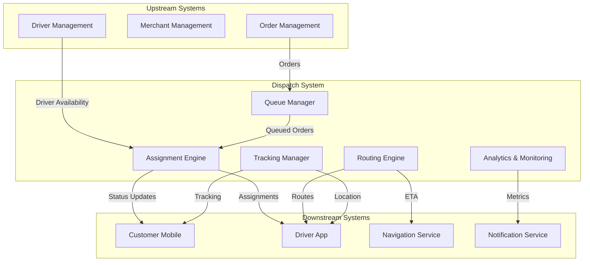
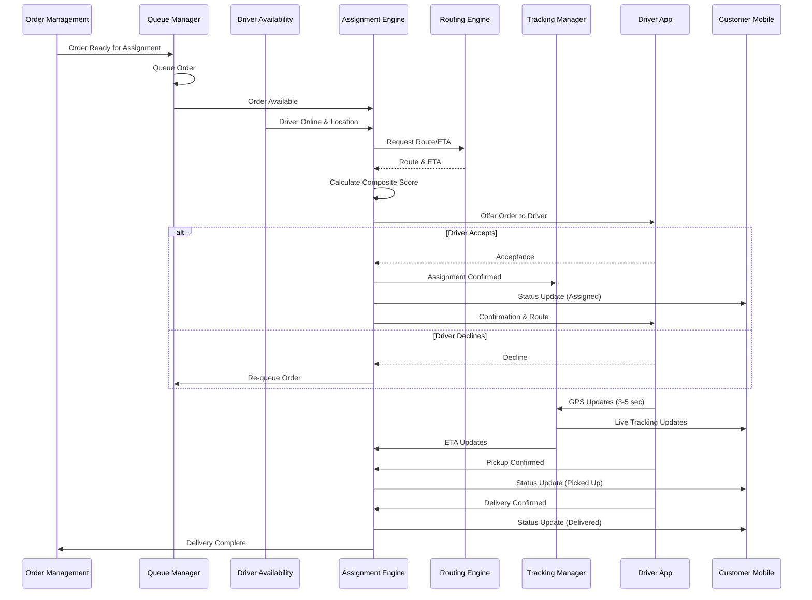
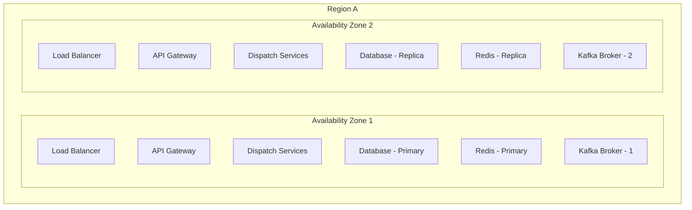

# Software Requirements Specification (SRS)

## Part 04A: Dispatch System Overview

**Module:** Dispatch & Logistics Module (Part 05)
**Version:** 1.0.0
**Status:** Final / For Review
**Date:** 2026-06-30

---

## Chapter 1 – Overview

### Purpose

The Dispatch System Overview module provides the architectural foundation for the entire dispatch and logistics subsystem of the **[Platform Name]** platform. This encompasses the system architecture, core components, data flows, integration points, and high-level design principles that govern how orders are optimally routed, assigned, and tracked through the delivery lifecycle.

The dispatch system is the central nervous system of the platform's logistics operations. It orchestrates the complex interplay between orders, merchants, drivers, and customers in real-time, making thousands of optimization decisions every second. The quality of these decisions directly impacts delivery times, operational costs, driver earnings, and customer satisfaction.

### Objectives

- Provide a scalable, real-time dispatch architecture
- Enable optimal order-to-driver matching
- Support real-time tracking and visibility
- Handle high-volume, low-latency processing
- Support multi-modal delivery (bike, car, drone, robot)
- Enable geographic and regulatory compliance
- Provide operational visibility and analytics
- Support future autonomous delivery integration

---

## Chapter 2 – Dispatch System Architecture

### DSP-001 System Context

The dispatch system sits at the core of the platform's logistics operations, connecting multiple upstream and downstream systems.

### DSP-002 Core Components

| Component | Description | Priority |
| :--- | :--- | :--- |
| **Order Queue Manager** | Manages pending orders for assignment. | **Required** |
| **Driver Availability Manager** | Tracks driver status and location. | **Required** |
| **Assignment Engine** | Matches orders to optimal drivers. | **Required** |
| **Routing Engine** | Calculates optimal routes and ETAs. | **Required** |
| **Tracking Manager** | Real-time GPS tracking and geofencing. | **Required** |
| **Geofencing Service** | Geographic boundary management. | **Required** |
| **ETA Service** | Dynamic ETA calculation. | **Required** |
| **Analytics & Monitoring** | Performance metrics and alerts. | **Required** |
| **Batch Manager** | Multi-order batching optimization. | **Required** |
| **Reassignment Service** | Real-time order reassignment. | **Required** |

### DSP-003 Architecture Principles

| Principle | Description |
| :--- | :--- |
| **Event-Driven** | All communication is asynchronous and event-based. |
| **Real-Time** | Sub-second response times for critical operations. |
| **Scalable** | Horizontal scaling for peak load handling. |
| **Resilient** | Fault-tolerant with graceful degradation. |
| **Observable** | Comprehensive logging, metrics, and tracing. |
| **Extensible** | Pluggable algorithms and business rules. |
| **Geographically Distributed** | Multi-region deployment for low latency. |

---

## Chapter 3 – Data Flow

### DSP-004 Order to Delivery Data Flow

### DSP-005 Key Data Flows

| Flow | Source | Destination | Frequency | Priority |
| :--- | :--- | :--- | :--- | :--- |
| **Order Assignment** | Queue Manager | Assignment Engine | Real-time | **Required** |
| **Driver Availability** | Driver App | Assignment Engine | Continuous | **Required** |
| **GPS Location** | Driver App | Tracking Manager | 3-5 sec | **Required** |
| **Route Calculation** | Routing Engine | Assignment Engine | On-demand | **Required** |
| **Status Updates** | Assignment Engine | Customer/Driver Apps | Real-time | **Required** |
| **Geofence Events** | Geofencing Service | Tracking Manager | Real-time | **Required** |
| **Analytics Data** | All Components | Analytics Platform | Continuous | **Required** |

---

## Chapter 4 – Technology Stack

### DSP-006 Core Technologies

| Component | Technology | Justification |
| :--- | :--- | :--- |
| **Message Broker** | Apache Kafka / AWS MSK | High-throughput, durable event streaming. |
| **State Management** | Redis | Low-latency, in-memory state for drivers/orders. |
| **Database** | PostgreSQL / Amazon Aurora | Reliable, ACID-compliant persistent storage. |
| **Search/Geospatial** | Elasticsearch / OpenSearch | Fast geospatial queries and search. |
| **Mapping** | Google Maps / Mapbox | Distance matrix, routing, geocoding. |
| **Stream Processing** | Apache Flink / Kafka Streams | Real-time analytics and event processing. |
| **Service Mesh** | Istio / Consul | Service discovery, load balancing, mTLS. |
| **Observability** | Prometheus / Grafana / ELK | Metrics, logs, and distributed tracing. |

### DSP-007 Performance Requirements

| Metric | Target | Priority |
| :--- | :--- | :--- |
| **Order Assignment Latency** | < 500ms (95th percentile) | **Required** |
| **GPS Update Processing** | < 100ms (95th percentile) | **Required** |
| **ETA Calculation** | < 200ms (95th percentile) | **Required** |
| **Throughput** | 10,000+ orders/minute | **Required** |
| **Concurrent Drivers** | 100,000+ simultaneous | **Required** |
| **Availability** | 99.99% (four nines) | **Required** |
| **Data Retention** | 90 days (operational), 7 years (audit) | **Required** |

---

## Chapter 5 – Integration Points

### DSP-008 Upstream Integrations

| Integration | Purpose | Protocol | Priority |
| :--- | :--- | :--- | :--- |
| **Order Management** | Receive orders for dispatch. | REST / Kafka | **Required** |
| **Merchant Management** | Merchant location, prep times, zones. | REST / Kafka | **Required** |
| **Driver Management** | Driver profiles, status, location. | REST / WebSocket | **Required** |
| **Customer Management** | Customer profiles, preferences. | REST | **Required** |
| **Payment System** | Payment validation for dispatch. | REST | **Required** |

### DSP-009 Downstream Integrations

| Integration | Purpose | Protocol | Priority |
| :--- | :--- | :--- | :--- |
| **Driver App** | Order offers, routes, status updates. | WebSocket / REST | **Required** |
| **Customer App** | Tracking, status updates, ETA. | WebSocket / REST | **Required** |
| **Merchant App** | Driver arrival, pickup status. | WebSocket / REST | **Required** |
| **Notification Service** | Push notifications, SMS, email. | REST / Kafka | **Required** |
| **Analytics Platform** | Operational analytics, metrics. | Kafka / REST | **Required** |

### DSP-010 Third-Party Integrations

| Integration | Purpose | Protocol | Priority |
| :--- | :--- | :--- | :--- |
| **Google Maps** | Distance matrix, routing, geocoding. | REST / gRPC | **Required** |
| **Mapbox** | Routing, maps, geocoding (fallback). | REST / gRPC | **Required** |
| **Weather Service** | Weather data for ETA and surge. | REST | **Required** |
| **Traffic Service** | Real-time traffic data. | REST | **Required** |

---

## Chapter 6 – Deployment Architecture

### DSP-011 High-Level Deployment

### DSP-012 Scalability Approach

| Layer | Scalability Strategy | Priority |
| :--- | :--- | :--- |
| **API Gateway** | Horizontal scaling based on request volume. | **Required** |
| **Dispatch Services** | Horizontal scaling with partitioning by region. | **Required** |
| **Database** | Read replicas, partitioning, connection pooling. | **Required** |
| **Redis Cache** | Clustered mode with data partitioning. | **Required** |
| **Kafka** | Partitioning, replication, consumer groups. | **Required** |
| **Geospatial Services** | Regional deployment for low latency. | **Required** |

### DSP-013 Resilience & Disaster Recovery

| Feature | Description | Priority |
| :--- | :--- | :--- |
| **Multi-AZ Deployment** | Deploy across multiple availability zones. | **Required** |
| **Circuit Breakers** | Prevent cascading failures. | **Required** |
| **Retries with Backoff** | Exponential backoff for transient failures. | **Required** |
| **Timeouts** | Strict timeouts for all external calls. | **Required** |
| **Bulkheads** | Isolate critical services from failures. | **Required** |
| **Graceful Degradation** | Core functionality preserved during partial failures. | **Required** |
| **Disaster Recovery** | RTO < 15 minutes, RPO < 5 minutes. | **Required** |

---

## Chapter 7 – Security & Compliance

### DSP-014 Security Requirements

| Requirement | Description | Priority |
| :--- | :--- | :--- |
| **Authentication** | Service-to-service mTLS authentication. | **Required** |
| **Authorization** | Fine-grained RBAC for all operations. | **Required** |
| **Encryption** | All data encrypted at rest and in transit. | **Required** |
| **Audit Logging** | All assignment decisions logged. | **Required** |
| **Data Privacy** | PII redaction in logs and analytics. | **Required** |
| **Rate Limiting** | Prevent abuse of dispatch APIs. | **Required** |
| **API Keys** | External integrations require API keys. | **Required** |

### DSP-015 Compliance Requirements

| Requirement | Description | Priority |
| :--- | :--- | :--- |
| **Data Retention** | Operational data: 90 days; audit data: 7 years. | **Required** |
| **GDPR/CCPA** | Right to be forgotten, data portability. | **Required** |
| **Geographic Compliance** | Data sovereignty requirements per region. | **Required** |
| **Regulatory Reporting** | Report generation for regulatory bodies. | **Required** |
| **Working Hours** | Compliance with driver working hour limits. | **Required** |

---

## Chapter 8 – Monitoring & Observability

### DSP-016 Key Metrics

| Metric | Description | Alert Threshold | Priority |
| :--- | :--- | :--- | :--- |
| **Assignment Latency** | Time to assign orders. | > 1s (P95) | **Required** |
| **Assignment Success Rate** | % of orders successfully assigned. | < 95% | **Required** |
| **Driver Acceptance Rate** | % of offers accepted by drivers. | < 75% | **Required** |
| **Average ETA** | Average time from assignment to delivery. | > 45 min | **Required** |
| **Batch Utilization** | % of orders in batches. | < 20% | **Required** |
| **Reassignment Rate** | % of orders reassigned. | > 8% | **Required** |
| **System CPU** | CPU utilization. | > 70% | **Required** |
| **System Memory** | Memory utilization. | > 80% | **Required** |
| **Database Connections** | Active database connections. | > 80% of pool | **Required** |
| **Kafka Lag** | Consumer group lag. | > 10,000 messages | **Required** |

### DSP-017 Observability Stack

| Component | Purpose | Priority |
| :--- | :--- | :--- |
| **Prometheus** | Metrics collection and storage. | **Required** |
| **Grafana** | Dashboards and visualization. | **Required** |
| **ELK Stack** | Centralized logging and search. | **Required** |
| **Jaeger** | Distributed tracing. | **Required** |
| **AlertManager** | Alert routing and notifications. | **Required** |
| **Status Page** | Public system status. | **Required** |

---

## Chapter 9 – Database Tables

### dispatch_configuration

| Column | Type | Constraints | Description |
| :--- | :--- | :--- | :--- |
| `config_id` | UUID | PRIMARY KEY | Unique identifier |
| `config_key` | VARCHAR(100) | UNIQUE | Configuration key |
| `config_value` | JSONB | NOT NULL | Configuration value (JSON) |
| `description` | TEXT | | Description of configuration |
| `is_active` | BOOLEAN | DEFAULT TRUE | Active status |
| `created_at` | TIMESTAMP | DEFAULT NOW() | Creation timestamp |
| `updated_at` | TIMESTAMP | DEFAULT NOW() | Last update timestamp |

### dispatch_regions

| Column | Type | Constraints | Description |
| :--- | :--- | :--- | :--- |
| `region_id` | UUID | PRIMARY KEY | Unique identifier |
| `region_name` | VARCHAR(100) | NOT NULL | Region name |
| `country` | VARCHAR(5) | NOT NULL | ISO country code |
| `boundary` | JSONB | NOT NULL | Geospatial boundary (GeoJSON) |
| `timezone` | VARCHAR(50) | NOT NULL | IANA timezone |
| `currency` | VARCHAR(3) | NOT NULL | ISO 4217 currency code |
| `is_active` | BOOLEAN | DEFAULT TRUE | Active status |
| `created_at` | TIMESTAMP | DEFAULT NOW() | Creation timestamp |
| `updated_at` | TIMESTAMP | DEFAULT NOW() | Last update timestamp |

### dispatch_zones

| Column | Type | Constraints | Description |
| :--- | :--- | :--- | :--- |
| `zone_id` | UUID | PRIMARY KEY | Unique identifier |
| `region_id` | UUID | FOREIGN KEY (dispatch_regions.region_id) | Parent region |
| `zone_name` | VARCHAR(100) | NOT NULL | Zone name |
| `zone_type` | VARCHAR(20) | NOT NULL | CITY/NEIGHBORHOOD/SUBURB |
| `boundary` | JSONB | NOT NULL | Geospatial boundary (GeoJSON) |
| `center_latitude` | DECIMAL(10, 8) | NOT NULL | Zone center latitude |
| `center_longitude` | DECIMAL(11, 8) | NOT NULL | Zone center longitude |
| `default_delivery_fee` | DECIMAL(10, 2) | DEFAULT 0 | Default delivery fee |
| `default_min_order` | DECIMAL(10, 2) | DEFAULT 0 | Minimum order value |
| `is_active` | BOOLEAN | DEFAULT TRUE | Active status |
| `created_at` | TIMESTAMP | DEFAULT NOW() | Creation timestamp |
| `updated_at` | TIMESTAMP | DEFAULT NOW() | Last update timestamp |

### dispatch_vehicles

| Column | Type | Constraints | Description |
| :--- | :--- | :--- | :--- |
| `vehicle_id` | UUID | PRIMARY KEY | Unique identifier |
| `vehicle_type` | VARCHAR(30) | UNIQUE | CAR/MOTORCYCLE/SCOOTER/BICYCLE/VAN/TRUCK/DRONE/ROBOT |
| `description` | TEXT | | Vehicle description |
| `max_speed` | INTEGER | | Maximum speed (km/h) |
| `max_capacity` | INTEGER | | Maximum capacity (kg) |
| `is_active` | BOOLEAN | DEFAULT TRUE | Active status |
| `created_at` | TIMESTAMP | DEFAULT NOW() | Creation timestamp |
| `updated_at` | TIMESTAMP | DEFAULT NOW() | Last update timestamp |

### dispatch_algorithms

| Column | Type | Constraints | Description |
| :--- | :--- | :--- | :--- |
| `algorithm_id` | UUID | PRIMARY KEY | Unique identifier |
| `algorithm_name` | VARCHAR(100) | NOT NULL | Algorithm name |
| `algorithm_version` | VARCHAR(20) | NOT NULL | Version number |
| `algorithm_type` | VARCHAR(30) | NOT NULL | DISTANCE/TIME/COST/HYBRID/ML |
| `weights` | JSONB | | Algorithm weights configuration |
| `is_default` | BOOLEAN | DEFAULT FALSE | Default algorithm |
| `is_active` | BOOLEAN | DEFAULT TRUE | Active status |
| `created_at` | TIMESTAMP | DEFAULT NOW() | Creation timestamp |
| `updated_at` | TIMESTAMP | DEFAULT NOW() | Last update timestamp |

### dispatch_events

| Column | Type | Constraints | Description |
| :--- | :--- | :--- | :--- |
| `event_id` | UUID | PRIMARY KEY | Unique identifier |
| `event_type` | VARCHAR(50) | NOT NULL | ORDER_ASSIGNED/DRIVER_ASSIGNED/PICKUP_CONFIRMED/DELIVERY_CONFIRMED/REASSIGNED |
| `order_id` | UUID | FOREIGN KEY (merchant_orders.order_id) | Associated order |
| `driver_id` | UUID | FOREIGN KEY (driver_accounts.driver_id) | Associated driver |
| `event_data` | JSONB | | Event payload |
| `event_timestamp` | TIMESTAMP | NOT NULL | Event timestamp |
| `created_at` | TIMESTAMP | DEFAULT NOW() | Record creation timestamp |

---

## Chapter 10 – REST APIs

### System APIs

| Method | Endpoint | Description |
| :--- | :--- | :--- |
| `GET` | `/api/v1/dispatch/health` | System health check |
| `GET` | `/api/v1/dispatch/status` | Dispatch system status |
| `GET` | `/api/v1/dispatch/config` | Get dispatch configuration |
| `PUT` | `/api/v1/dispatch/config` | Update dispatch configuration |
| `GET` | `/api/v1/dispatch/algorithms` | Get assignment algorithms |
| `PUT` | `/api/v1/dispatch/algorithms/{id}` | Update algorithm configuration |

### Region/Zone APIs

| Method | Endpoint | Description |
| :--- | :--- | :--- |
| `GET` | `/api/v1/dispatch/regions` | List regions |
| `GET` | `/api/v1/dispatch/regions/{id}` | Get region details |
| `GET` | `/api/v1/dispatch/zones` | List zones |
| `GET` | `/api/v1/dispatch/zones/{id}` | Get zone details |
| `POST` | `/api/v1/dispatch/zones` | Create zone (admin) |
| `PUT` | `/api/v1/dispatch/zones/{id}` | Update zone (admin) |
| `DELETE` | `/api/v1/dispatch/zones/{id}` | Delete zone (admin) |

### Monitoring APIs

| Method | Endpoint | Description |
| :--- | :--- | :--- |
| `GET` | `/api/v1/dispatch/metrics` | Get dispatch metrics |
| `GET` | `/api/v1/dispatch/metrics/performance` | Get performance metrics |
| `GET` | `/api/v1/dispatch/events` | Get dispatch events |
| `GET` | `/api/v1/dispatch/events/{id}` | Get event details |

---

## Chapter 11 – Business Rules

| Rule ID | Rule Description | Priority |
| :--- | :--- | :--- |
| **BR-DSP-001** | Assignment decisions must be logged for audit. | **High** |
| **BR-DSP-002** | Orders in queue expire after 5 minutes without assignment. | **High** |
| **BR-DSP-003** | Drivers must be online to receive orders. | **High** |
| **BR-DSP-004** | Drivers on break are not eligible for assignment. | **High** |
| **BR-DSP-005** | Geofencing must be accurate within 50m. | **High** |
| **BR-DSP-006** | Batch orders must be within 2km radius. | **High** |
| **BR-DSP-007** | Assignment algorithm weights are configurable per region. | **High** |
| **BR-DSP-008** | All dispatch operations must be idempotent. | **High** |
| **BR-DSP-009** | Service mesh must support mTLS for all communication. | **High** |
| **BR-DSP-010** | Disaster recovery RTO: 15 minutes, RPO: 5 minutes. | **High** |

---

## Chapter 12 – Acceptance Tests

| Test ID | Test Description | Priority |
| :--- | :--- | :--- |
| **TEST-DSP-001** | System health check returns healthy status. | **High** |
| **TEST-DSP-002** | Order enters assignment queue within 1 second. | **High** |
| **TEST-DSP-003** | Driver availability updates in real-time. | **High** |
| **TEST-DSP-004** | Assignment completes within 500ms (P95). | **High** |
| **TEST-DSP-005** | ETA calculation completes within 200ms. | **High** |
| **TEST-DSP-006** | GPS location updates processed within 100ms. | **High** |
| **TEST-DSP-007** | Batch order creation works correctly. | **High** |
| **TEST-DSP-008** | Geofencing alerts trigger correctly. | **High** |
| **TEST-DSP-009** | System handles 10,000 orders/minute without degradation. | **High** |
| **TEST-DSP-010** | Circuit breaker prevents cascading failures. | **High** |
| **TEST-DSP-011** | Data is encrypted at rest and in transit. | **High** |
| **TEST-DSP-012** | Audit log captures all assignment decisions. | **High** |
| **TEST-DSP-013** | Configuration updates apply without restart. | **High** |
| **TEST-DSP-014** | Metrics are exported to Prometheus. | **High** |
| **TEST-DSP-015** | Logs are centralized in ELK stack. | **High** |
| **TEST-DSP-016** | Distributed traces are available in Jaeger. | **High** |
| **TEST-DSP-017** | Auto-scaling triggers based on load. | **High** |

---

## Chapter 13 – Traceability Matrix

| Requirement | Database Table | API Endpoint(s) | Acceptance Test |
| :--- | :--- | :--- | :--- |
| DSP-002 | dispatch_configuration | GET /api/v1/dispatch/config | TEST-DSP-001 |
| DSP-004 | dispatch_events | Internal (Kafka) | TEST-DSP-002 |
| DSP-006 | dispatch_configuration | GET /api/v1/dispatch/status | TEST-DSP-003 |
| DSP-007 | dispatch_algorithms | GET /api/v1/dispatch/algorithms | TEST-DSP-004 |
| DSP-004 | dispatch_events | Internal (Kafka) | TEST-DSP-005 |
| DSP-009 | dispatch_zones | GET /api/v1/dispatch/zones | TEST-DSP-006 |
| DSP-009 | dispatch_configuration | GET /api/v1/dispatch/config | TEST-DSP-007 |
| DSP-010 | dispatch_regions | GET /api/v1/dispatch/regions | TEST-DSP-008 |
| DSP-013 | dispatch_configuration | GET /api/v1/dispatch/health | TEST-DSP-009 |
| DSP-014 | dispatch_configuration | GET /api/v1/dispatch/config | TEST-DSP-010 |

---

## Chapter 14 – Summary

This document establishes the foundational architecture and overview for the dispatch system of the **[Platform Name]** platform. Key takeaways:

- **Event-Driven Architecture:** Asynchronous, event-based communication ensures loose coupling and high scalability.
- **Real-Time Processing:** Sub-second latency for order assignment, GPS tracking, and ETA updates.
- **Scalable Design:** Horizontal scaling with partitioning by region for high-volume handling.
- **Resilient Infrastructure:** Multi-AZ deployment, circuit breakers, retries, and graceful degradation.
- **Comprehensive Observability:** Metrics, logging, and distributed tracing for operational visibility.
- **Geographically Distributed:** Regional deployment ensures low latency and regulatory compliance.
- **Extensible Architecture:** Pluggable algorithms and configurable business rules for flexibility.
- **Security & Compliance:** mTLS, encryption, audit logging, and data retention policies.

The dispatch system is the intelligence engine of the platform's logistics. Its architecture and design principles set the foundation for efficient, reliable, and scalable delivery operations.

---

**Next Document:**

`Part_04B_Order_Routing_Assignment.md`

*(This builds on the dispatch overview to define the detailed order routing and assignment algorithms that optimize delivery efficiency.)*
