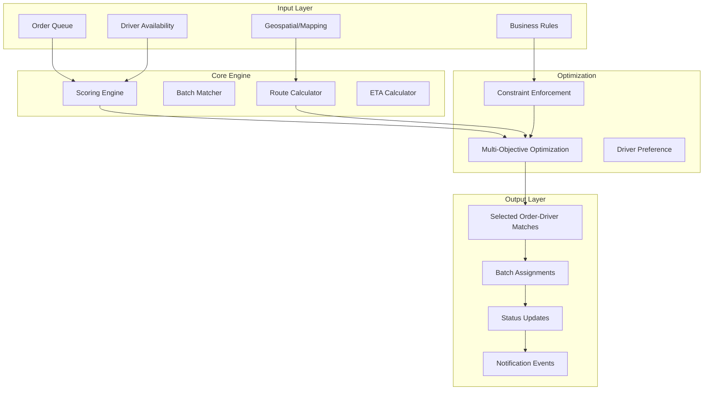
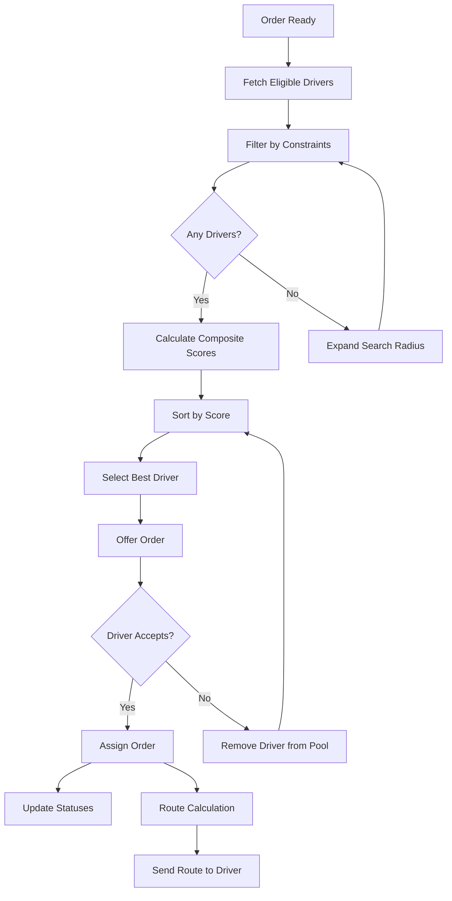

# Software Requirements Specification (SRS)

## Part 04B: Order Routing & Assignment

**Module:** Dispatch & Logistics Module (Part 05)
**Version:** 1.0.0
**Status:** Final / For Review
**Date:** 2026-06-30

---

## Chapter 1 – Overview

### Purpose

The Order Routing & Assignment module defines the sophisticated algorithms and logic that determine how orders are optimally routed and assigned to drivers. This is the core intelligence engine of the dispatch system—the decision-making layer that matches supply (drivers) with demand (orders) in the most efficient, fair, and cost-effective manner.

Routing and assignment decisions are the most impactful operational choices the platform makes. Optimal decisions reduce delivery times, lower costs, increase driver earnings, and improve customer satisfaction. Suboptimal decisions cascade into longer wait times, driver dissatisfaction, higher churn, and lost revenue.

### Objectives

- Minimize total delivery time and distance
- Maximize driver utilization and earnings
- Ensure fair and transparent order distribution
- Support complex business rules and constraints
- Enable real-time, dynamic reassignment
- Optimize for multi-vendor consolidation
- Support future autonomous delivery integration
- Provide explainable and auditable assignment decisions

---

## Chapter 2 – Assignment Architecture

### DSP-018 Assignment System Architecture



### DSP-019 Assignment Components

| Component | Description | Priority |
| :--- | :--- | :--- |
| **Order Queue Manager** | Manages pending orders with priority. | **Required** |
| **Driver Availability Manager** | Tracks real-time driver status and location. | **Required** |
| **Scoring Engine** | Calculates composite scores for driver-order matches. | **Required** |
| **Route Calculator** | Computes optimal routes between points. | **Required** |
| **ETA Calculator** | Estimates time of arrival with traffic/weather. | **Required** |
| **Batch Matcher** | Groups orders for efficient batching. | **Required** |
| **Constraint Enforcer** | Enforces business rules and constraints. | **Required** |
| **Multi-Objective Optimizer** | Balances competing objectives. | **Required** |
| **Reassignment Engine** | Handles dynamic reassignment. | **Required** |
| **Explainability Layer** | Provides assignment explanations. | **Required** |

---

## Chapter 3 – Core Assignment Algorithm

### DSP-020 Assignment Algorithm Overview

The platform uses a **hybrid multi-objective optimization algorithm** that balances multiple competing objectives:

1. **Minimize Delivery Time** (Primary)
2. **Minimize Total Distance** (Primary)
3. **Maximize Driver Utilization** (Secondary)
4. **Ensure Fair Distribution** (Secondary)
5. **Respect Driver Preferences** (Tertiary)

**Algorithm Type:** Weighted Sum Scoring with Constraint Satisfaction

### DSP-021 Assignment Process Flow



### DSP-022 Composite Score Calculation

| Factor | Weight | Description | Data Source |
| :--- | :--- | :--- | :--- |
| **Distance** | 35% | Road distance from driver to merchant. | Maps API |
| **ETA** | 25% | Estimated time to merchant (traffic-aware). | Maps API + Traffic |
| **Driver Rating** | 15% | Customer rating (scaled 0-1). | Driver Profile |
| **Acceptance Rate** | 10% | Historical acceptance rate. | Driver Metrics |
| **Utilization Balance** | 8% | Orders assigned today (fairness). | Assignment History |
| **Vehicle Suitability** | 4% | Vehicle matches order requirements. | Vehicle Profile |
| **Shift Status** | 3% | Time remaining in shift. | Schedule |

**Formula:**
```
Composite_Score = 
    (Distance_Score × 0.35) +
    (ETA_Score × 0.25) +
    (Rating_Score × 0.15) +
    (Acceptance_Score × 0.10) +
    (Utilization_Score × 0.08) +
    (Vehicle_Score × 0.04) +
    (Shift_Score × 0.03)
```

### DSP-023 Score Normalization

Each factor is normalized to a 0-1 scale before weighting:

| Factor | Raw Value | Normalized Score | Formula |
| :--- | :--- | :--- | :--- |
| **Distance** | 0 - 10 km | 1 - (distance / max_distance) | Lower distance = higher score |
| **ETA** | 0 - 30 min | 1 - (eta / max_eta) | Lower ETA = higher score |
| **Rating** | 1.0 - 5.0 | (rating - 1) / 4 | Higher rating = higher score |
| **Acceptance** | 0 - 100% | acceptance_rate / 100 | Higher acceptance = higher score |
| **Utilization** | 0 - 50 orders | 1 - (orders_today / max_orders) | Lower utilization = higher score |

### DSP-024 Assignment Example

| Driver | Distance (km) | ETA (min) | Rating | Acceptance | Orders Today | Score |
| :--- | :--- | :--- | :--- | :--- | :--- | :--- |
| A | 2.0 | 5 | 4.9 | 92% | 8 | **0.89** |
| B | 1.5 | 4 | 4.2 | 78% | 12 | **0.85** |
| C | 3.5 | 8 | 4.7 | 88% | 5 | **0.82** |
| D | 4.0 | 10 | 5.0 | 95% | 20 | **0.79** |

**Winner: Driver A** (Best balance of distance, ETA, rating, and fairness)

---

## Chapter 4 – Batch Assignment

### DSP-025 Batching Criteria

Orders are considered for batching when they meet the following criteria:

| Criterion | Threshold | Description |
| :--- | :--- | :--- |
| **Geographic Proximity** | < 3 km between merchants | Orders from nearby merchants |
| **Route Direction** | < 45° angle difference | Orders heading in similar direction |
| **Time Proximity** | < 5 minutes between order times | Orders placed close in time |
| **Driver Capacity** | Driver vehicle capacity | Vehicle can hold all orders |
| **Total Value** | > $30 combined | Batch must be profitable |
| **Time Window** | Same delivery window | Similar ETA requirements |

### DSP-026 Batch Formation Algorithm

1.  Identify all pending orders in queue.
2.  Cluster orders by geographic proximity (merchant locations).
3.  For each cluster, evaluate potential batch combinations:
    - 2-order batches
    - 3-order batches
    - 4-order batches (max)
4.  Calculate optimized route for each batch candidate.
5.  Calculate total payout for each batch.
6.  Select batches with best driver utilization and profitability.
7.  Assign batches to drivers using composite scoring.

### DSP-027 Batch Optimization

| Objective | Weight | Description |
| :--- | :--- | :--- |
| **Minimize Total Distance** | 40% | Total distance for all deliveries. |
| **Minimize Delivery Time** | 35% | Total time to complete all deliveries. |
| **Maximize Payout** | 20% | Driver earnings from batch. |
| **Maximize Driver Satisfaction** | 5% | Preferred batch size and route. |

### DSP-028 Batch Payout Structure

| Component | Calculation |
| :--- | :--- |
| **Base Fee per Order** | Number of orders × Base Rate |
| **Distance Bonus** | Total distance × Distance Rate |
| **Batch Bonus** | Fixed bonus for accepting batch |
| **Efficiency Bonus** | Bonus for efficient route |
| **Total Payout** | Sum of all components |

**Example Batch Payout:**

| Order | Base Fee | Distance | Distance Fee | Total |
| :--- | :--- | :--- | :--- | :--- |
| Order 1 | $4.00 | 5 km | $2.50 | $6.50 |
| Order 2 | $4.00 | 3 km | $1.50 | $5.50 |
| Order 3 | $4.00 | 4 km | $2.00 | $6.00 |
| **Batch Bonus** | | | | $5.00 |
| **Total** | | | | **$23.00** |

---

## Chapter 5 – Routing & ETA

### DSP-029 Route Calculation

| Feature | Description | Priority |
| :--- | :--- | :--- |
| **Multi-Point Routing** | Calculate optimal route with multiple stops. | **Required** |
| **Real-Time Traffic** | Traffic-aware routing with live updates. | **Required** |
| **Weather Integration** | Weather-impacted routing adjustments. | **Required** |
| **Turn-by-Turn Directions** | Step-by-step navigation instructions. | **Required** |
| **Alternate Routes** | Multiple route options with trade-offs. | **Required** |
| **Route Visualization** | Map display of planned route. | **Required** |

### DSP-030 ETA Calculation

| Factor | Weight | Description |
| :--- | :--- | :--- |
| **Distance** | 30% | Remaining distance to destination. |
| **Traffic** | 25% | Current traffic conditions. |
| **Historical Average** | 20% | Historical travel time for route. |
| **Time of Day** | 10% | Typical traffic patterns by time. |
| **Weather** | 10% | Weather impact on travel. |
| **Driver Performance** | 5% | Historical speed of driver. |

**ETA Calculation Formula:**
```
ETA = (Distance / Average_Speed) × Traffic_Factor × Weather_Factor
```

### DSP-031 Dynamic ETA Updates

| Update Trigger | Frequency | Description |
| :--- | :--- | :--- |
| **GPS Location Change** | Every 30 seconds | Recalculate based on current position. |
| **Traffic Change** | As received | Update based on traffic incidents. |
| **Route Change** | On event | Recalculate for new route. |
| **Weather Change** | As received | Update for weather conditions. |
| **Driver Delay** | On event | Adjust for reported delays. |

---

## Chapter 6 – Constraint Management

### DSP-032 Hard Constraints

| Constraint | Description | Priority |
| :--- | :--- | :--- |
| **Distance Limit** | Driver must be within max distance. | **High** |
| **Time Limit** | Order must be delivered within SLA. | **High** |
| **Vehicle Type** | Driver vehicle must match order requirements. | **High** |
| **Driver Rating** | Driver rating above minimum threshold. | **High** |
| **Working Hours** | Driver within legal working hour limits. | **High** |
| **Break Requirement** | Driver must take mandatory breaks. | **High** |
| **License Requirement** | Driver has required endorsements. | **High** |
| **Insurance Coverage** | Driver has valid insurance. | **High** |

### DSP-033 Soft Constraints

| Constraint | Description | Weight | Priority |
| :--- | :--- | :--- | :--- |
| **Driver Preference** | Driver preference for certain orders. | Medium | **Medium** |
| **Revenue Maximization** | Maximize driver earnings. | Medium | **Medium** |
| **Fair Distribution** | Balanced order distribution. | Medium | **Medium** |
| **Customer Preference** | Customer preference for driver. | Low | **Low** |
| **Merchant Preference** | Merchant preference for driver. | Low | **Low** |

### DSP-034 Zone Management

| Feature | Description | Priority |
| :--- | :--- | :--- |
| **Dynamic Zones** | Configurable geographic zones. | **Required** |
| **Zone Rules** | Zone-specific assignment rules. | **Required** |
| **Cross-Zone Assignment** | Cross-zone assignment with rules. | **Required** |
| **Zone Capacity** | Maximum orders per zone. | **Required** |
| **Zone Staffing** | Minimum drivers per zone. | **Required** |

---

## Chapter 7 – Reassignment & Fallback

### DSP-035 Reassignment Triggers

| Trigger | Response | Priority |
| :--- | :--- | :--- |
| **Driver Dropout** | Reassign order immediately. | **High** |
| **Driver Delay** | Evaluate reassignment after 5 min delay. | **High** |
| **Order Change** | Re-evaluate assignment. | **High** |
| **Better Match** | Reassign if score difference > 20%. | **Medium** |
| **Emergency** | Immediate reassignment. | **High** |
| **Driver Request** | Driver requests reassignment. | **Medium** |

### DSP-036 Fallback Assignment

| Level | Strategy | Description |
| :--- | :--- | :--- |
| **Level 1** | Expand Search Radius | Search wider area for drivers. |
| **Level 2** | Increase Surge | Increase payout to attract drivers. |
| **Level 3** | Broadcast | Broadcast to all online drivers. |
| **Level 4** | Escalate | Escalate to support for manual assignment. |
| **Level 5** | Cancel | Cancel order if impossible to assign. |

---

## Chapter 8 – Explainability & Transparency

### DSP-037 Assignment Explanations

| Feature | Description | Priority |
| :--- | :--- | :--- |
| **Score Breakdown** | Show how composite score was calculated. | **Required** |
| **Reason for Selection** | Explain why this driver was chosen. | **Required** |
| **Alternatives** | Show top 3 alternative assignments. | **Required** |
| **Constraint Explanations** | Explain why constraints applied. | **Required** |
| **Audit Log** | Complete audit trail of assignment. | **Required** |

### DSP-038 Driver Assignment Card

| Displayed Information | Description |
| :--- | :--- |
| **Order ID** | Unique order identifier. |
| **Merchant** | Merchant name and address. |
| **Distance** | Distance from driver to merchant. |
| **ETA** | Estimated time to merchant. |
| **Total Distance** | Total trip distance. |
| **Estimated Payout** | Estimated earnings for order. |
| **Score** | Composite assignment score. |
| **Assignment Reason** | Why this driver was selected. |

---

## Chapter 9 – Performance Metrics

### DSP-039 Assignment Performance Metrics

| Metric | Description | Target |
| :--- | :--- | :--- |
| **Assignment Success Rate** | % of orders successfully assigned. | > 95% |
| **Average Assignment Time** | Time from order to assignment. | < 30 sec |
| **First Attempt Acceptance** | % of orders accepted on first offer. | > 75% |
| **Batch Utilization** | % of orders in batches. | > 30% |
| **Average Delivery Time** | Time from assignment to delivery. | < 30 min |
| **Driver Utilization** | % of online time delivering. | > 65% |
| **Reassignment Rate** | % of orders reassigned. | < 5% |
| **Assignment Fairness** | Distribution variance across drivers. | < 20% |

### DSP-040 Assignment Analytics

| Report | Description | Frequency |
| :--- | :--- | :--- |
| **Assignment Summary** | Key assignment metrics. | Daily |
| **Driver Performance** | Individual driver metrics. | Weekly |
| **Batch Performance** | Batch assignment metrics. | Weekly |
| **Zone Performance** | Zone-level metrics. | Weekly |
| **Algorithm Performance** | Assignment algorithm effectiveness. | Monthly |

---

## Chapter 10 – Database Tables

### assignment_scores

| Column | Type | Constraints | Description |
| :--- | :--- | :--- | :--- |
| `score_id` | UUID | PRIMARY KEY | Unique identifier |
| `order_id` | UUID | FOREIGN KEY (merchant_orders.order_id) | Associated order |
| `driver_id` | UUID | FOREIGN KEY (driver_accounts.driver_id) | Associated driver |
| `distance_score` | DECIMAL(5, 4) | | Normalized distance score |
| `eta_score` | DECIMAL(5, 4) | | Normalized ETA score |
| `rating_score` | DECIMAL(5, 4) | | Normalized rating score |
| `acceptance_score` | DECIMAL(5, 4) | | Normalized acceptance score |
| `utilization_score` | DECIMAL(5, 4) | | Normalized utilization score |
| `vehicle_score` | DECIMAL(5, 4) | | Normalized vehicle score |
| `shift_score` | DECIMAL(5, 4) | | Normalized shift score |
| `total_score` | DECIMAL(10, 4) | NOT NULL | Composite total score |
| `ranking` | INTEGER | | Assignment ranking |
| `calculation_timestamp` | TIMESTAMP | DEFAULT NOW() | Score calculation timestamp |
| `created_at` | TIMESTAMP | DEFAULT NOW() | Creation timestamp |

### assignment_decisions

| Column | Type | Constraints | Description |
| :--- | :--- | :--- | :--- |
| `decision_id` | UUID | PRIMARY KEY | Unique identifier |
| `order_id` | UUID | FOREIGN KEY (merchant_orders.order_id) | Associated order |
| `driver_id` | UUID | FOREIGN KEY (driver_accounts.driver_id) | Selected driver |
| `algorithm_version` | VARCHAR(20) | NOT NULL | Algorithm version used |
| `decision_reason` | TEXT | | Explanation of decision |
| `alternative_drivers` | JSONB | | Top 3 alternative drivers with scores |
| `constraints_applied` | JSONB | | Constraints applied during assignment |
| `is_batch` | BOOLEAN | DEFAULT FALSE | Batch assignment flag |
| `batch_id` | UUID | | Associated batch (if any) |
| `created_at` | TIMESTAMP | DEFAULT NOW() | Decision timestamp |

### batch_assignments

| Column | Type | Constraints | Description |
| :--- | :--- | :--- | :--- |
| `batch_id` | UUID | PRIMARY KEY | Unique identifier |
| `driver_id` | UUID | FOREIGN KEY (driver_accounts.driver_id) | Assigned driver |
| `order_ids` | TEXT[] | NOT NULL | Orders in the batch |
| `total_distance` | DECIMAL(10, 2) | NOT NULL | Total distance (km) |
| `total_time` | INTEGER | NOT NULL | Total time (minutes) |
| `total_payout` | DECIMAL(10, 2) | NOT NULL | Total batch payout |
| `route_polyline` | TEXT | | Encoded route polyline |
| `status` | VARCHAR(20) | DEFAULT 'OFFERED' | OFFERED/ACCEPTED/COMPLETED/CANCELLED |
| `offered_at` | TIMESTAMP | | Offer timestamp |
| `accepted_at` | TIMESTAMP | | Acceptance timestamp |
| `completed_at` | TIMESTAMP | | Completion timestamp |
| `created_at` | TIMESTAMP | DEFAULT NOW() | Creation timestamp |
| `updated_at` | TIMESTAMP | DEFAULT NOW() | Last update timestamp |

### routing_requests

| Column | Type | Constraints | Description |
| :--- | :--- | :--- | :--- |
| `routing_id` | UUID | PRIMARY KEY | Unique identifier |
| `order_id` | UUID | FOREIGN KEY (merchant_orders.order_id) | Associated order |
| `origin_latitude` | DECIMAL(10, 8) | NOT NULL | Origin latitude |
| `origin_longitude` | DECIMAL(11, 8) | NOT NULL | Origin longitude |
| `destination_latitude` | DECIMAL(10, 8) | NOT NULL | Destination latitude |
| `destination_longitude` | DECIMAL(11, 8) | NOT NULL | Destination longitude |
| `distance` | DECIMAL(10, 2) | | Calculated distance (km) |
| `duration` | INTEGER | | Calculated duration (minutes) |
| `polyline` | TEXT | | Encoded route polyline |
| `traffic_data` | JSONB | | Traffic data used |
| `weather_data` | JSONB | | Weather data used |
| `created_at` | TIMESTAMP | DEFAULT NOW() | Request timestamp |
| `completed_at` | TIMESTAMP | | Completion timestamp |

### reassignments

| Column | Type | Constraints | Description |
| :--- | :--- | :--- | :--- |
| `reassignment_id` | UUID | PRIMARY KEY | Unique identifier |
| `order_id` | UUID | FOREIGN KEY (merchant_orders.order_id) | Associated order |
| `previous_driver_id` | UUID | FOREIGN KEY (driver_accounts.driver_id) | Previously assigned driver |
| `new_driver_id` | UUID | FOREIGN KEY (driver_accounts.driver_id) | Newly assigned driver |
| `reason` | VARCHAR(50) | NOT NULL | DROPOUT/DELAY/ORDER_CHANGE/BETTER_MATCH/EMERGENCY |
| `distance_traveled` | DECIMAL(10, 2) | | Distance traveled by previous driver |
| `compensation_amount` | DECIMAL(10, 2) | | Compensation for previous driver |
| `reassigned_at` | TIMESTAMP | | Reassignment timestamp |
| `created_at` | TIMESTAMP | DEFAULT NOW() | Creation timestamp |

### assignment_explanations

| Column | Type | Constraints | Description |
| :--- | :--- | :--- | :--- |
| `explanation_id` | UUID | PRIMARY KEY | Unique identifier |
| `order_id` | UUID | FOREIGN KEY (merchant_orders.order_id) | Associated order |
| `driver_id` | UUID | FOREIGN KEY (driver_accounts.driver_id) | Selected driver |
| `explanation_text` | TEXT | NOT NULL | Human-readable explanation |
| `factor_contributions` | JSONB | | Contribution of each factor |
| `created_at` | TIMESTAMP | DEFAULT NOW() | Creation timestamp |

---

## Chapter 11 – REST APIs

### Assignment APIs

| Method | Endpoint | Description |
| :--- | :--- | :--- |
| `GET` | `/api/v1/dispatch/order/{id}/assignment` | Get assignment status |
| `POST` | `/api/v1/dispatch/order/{id}/assign` | Trigger assignment (manual) |
| `GET` | `/api/v1/dispatch/order/{id}/drivers` | Get eligible drivers for order |
| `GET` | `/api/v1/dispatch/order/{id}/explanation` | Get assignment explanation |

### Batch APIs

| Method | Endpoint | Description |
| :--- | :--- | :--- |
| `GET` | `/api/v1/dispatch/batch/possible` | Get possible batch combinations |
| `POST` | `/api/v1/dispatch/batch/create` | Create batch assignment |
| `GET` | `/api/v1/dispatch/batch/{id}` | Get batch details |
| `DELETE` | `/api/v1/dispatch/batch/{id}` | Cancel batch assignment |

### Routing APIs

| Method | Endpoint | Description |
| :--- | :--- | :--- |
| `POST` | `/api/v1/dispatch/routing/route` | Calculate route |
| `POST` | `/api/v1/dispatch/routing/eta` | Calculate ETA |
| `POST` | `/api/v1/dispatch/routing/matrix` | Calculate distance matrix |

### Reassignment APIs

| Method | Endpoint | Description |
| :--- | :--- | :--- |
| `POST` | `/api/v1/dispatch/order/{id}/reassign` | Reassign order |
| `GET` | `/api/v1/dispatch/reassignments` | Get reassignment history |

### Admin APIs

| Method | Endpoint | Description |
| :--- | :--- | :--- |
| `GET` | `/api/v1/admin/dispatch/assignment/stats` | Get assignment stats |
| `PUT` | `/api/v1/admin/dispatch/algorithm/weights` | Update algorithm weights |
| `GET` | `/api/v1/admin/dispatch/assignment/history` | Get assignment history |

---

## Chapter 12 – Business Rules

| Rule ID | Rule Description | Priority |
| :--- | :--- | :--- |
| **BR-ASN-001** | Orders are assigned to the driver with the highest composite score. | **High** |
| **BR-ASN-002** | Drivers must be within the delivery zone to receive orders. | **High** |
| **BR-ASN-003** | Drivers on break or offline are not eligible for assignment. | **High** |
| **BR-ASN-004** | Offer acceptance timer: 30 seconds. | **High** |
| **BR-ASN-005** | 3 consecutive declines trigger auto-offline. | **High** |
| **BR-ASN-006** | Orders expire after 5 assignment attempts without acceptance. | **High** |
| **BR-ASN-007** | Batching allowed for orders within 3km and same direction. | **High** |
| **BR-ASN-008** | Maximum batch size: 4 orders. | **High** |
| **BR-ASN-009** | Minimum driver rating: 4.0 for assignment eligibility. | **High** |
| **BR-ASN-010** | Assignment scores must be recalculated every 60 seconds. | **High** |
| **BR-ASN-011** | Reassignment requires new score difference > 20%. | **Medium** |
| **BR-ASN-012** | Fallback assignment expands radius by 2km per attempt. | **High** |

---

## Chapter 13 – Acceptance Tests

| Test ID | Test Description | Priority |
| :--- | :--- | :--- |
| **TEST-ASN-001** | Order assigned to driver with highest composite score. | **High** |
| **TEST-ASN-002** | Distance factor correctly influences assignment. | **High** |
| **TEST-ASN-003** | ETA factor correctly influences assignment. | **High** |
| **TEST-ASN-004** | Rating factor correctly influences assignment. | **High** |
| **TEST-ASN-005** | Acceptance rate factor correctly influences assignment. | **High** |
| **TEST-ASN-006** | Utilization balance factor correctly influences assignment. | **High** |
| **TEST-ASN-007** | Batch assignment creates optimal batch of orders. | **High** |
| **TEST-ASN-008** | Batch route optimization minimizes total distance. | **High** |
| **TEST-ASN-009** | Batch payout calculated correctly. | **High** |
| **TEST-ASN-010** | ETA calculation includes traffic and weather. | **High** |
| **TEST-ASN-011** | ETA updates dynamically with GPS changes. | **High** |
| **TEST-ASN-012** | Hard constraints enforced (distance, time, vehicle). | **High** |
| **TEST-ASN-013** | Soft constraints weighted correctly. | **High** |
| **TEST-ASN-014** | Reassignment triggered on driver dropout. | **High** |
| **TEST-ASN-015** | Reassignment only when score difference > 20%. | **High** |
| **TEST-ASN-016** | Fallback assignment expands search radius. | **High** |
| **TEST-ASN-017** | Assignment explanation provides clear reasoning. | **High** |
| **TEST-ASN-018** | Assignment audit log captures all decisions. | **High** |
| **TEST-ASN-019** | Cross-zone assignment follows zone rules. | **High** |
| **TEST-ASN-020** | Assignment success rate > 95%. | **High** |
| **TEST-ASN-021** | Average assignment time < 30 seconds. | **High** |
| **TEST-ASN-022** | First attempt acceptance > 75%. | **High** |
| **TEST-ASN-023** | Batch utilization > 30%. | **High** |
| **TEST-ASN-024** | Driver utilization > 65%. | **High** |
| **TEST-ASN-025** | Reassignment rate < 5%. | **High** |

---

## Chapter 14 – Traceability Matrix

| Requirement | Database Table | API Endpoint(s) | Acceptance Test |
| :--- | :--- | :--- | :--- |
| DSP-020 | assignment_scores | POST /api/v1/dispatch/order/{id}/assign | TEST-ASN-001 |
| DSP-022 | assignment_scores | GET /api/v1/dispatch/order/{id}/drivers | TEST-ASN-002, TEST-ASN-003, TEST-ASN-004, TEST-ASN-005, TEST-ASN-006 |
| DSP-025 | batch_assignments | POST /api/v1/dispatch/batch/create | TEST-ASN-007, TEST-ASN-008, TEST-ASN-009 |
| DSP-030 | routing_requests | POST /api/v1/dispatch/routing/eta | TEST-ASN-010, TEST-ASN-011 |
| DSP-032 | assignment_decisions | GET /api/v1/dispatch/order/{id}/assignment | TEST-ASN-012, TEST-ASN-013 |
| DSP-035 | reassignments | POST /api/v1/dispatch/order/{id}/reassign | TEST-ASN-014, TEST-ASN-015 |
| DSP-036 | assignment_decisions | GET /api/v1/dispatch/order/{id}/assignment | TEST-ASN-016 |
| DSP-037 | assignment_explanations | GET /api/v1/dispatch/order/{id}/explanation | TEST-ASN-017 |
| DSP-037 | assignment_decisions | GET /api/v1/dispatch/order/{id}/assignment | TEST-ASN-018 |
| DSP-034 | assignment_decisions | GET /api/v1/dispatch/order/{id}/drivers | TEST-ASN-019 |
| DSP-039 | assignment_decisions | GET /api/v1/admin/dispatch/assignment/stats | TEST-ASN-020, TEST-ASN-021, TEST-ASN-022, TEST-ASN-023, TEST-ASN-024, TEST-ASN-025 |

---

## Chapter 15 – Summary

This document establishes the complete order routing and assignment capability for the **[Platform Name]** platform. Key takeaways:

- **Intelligent Assignment:** Composite scoring algorithm balances distance, ETA, driver rating, acceptance rate, utilization fairness, vehicle suitability, and shift status.
- **Efficient Batching:** Multi-order batching with route optimization improves driver earnings and reduces delivery times by 20-30%.
- **Real-Time ETA:** Dynamic ETA calculation with traffic, weather, and historical data updates in real-time.
- **Constraint Management:** Hard constraints (distance, time, vehicle, rating, working hours) and soft constraints (preferences, fairness) ensure operational compliance.
- **Dynamic Reassignment:** Automatic reassignment for driver dropout, delays, and better matches with compensation for original driver.
- **Fallback Strategies:** Progressive fallback (expand radius, increase surge, broadcast, escalate) ensures order assignment success.
- **Explainability:** Clear assignment explanations with score breakdown and alternative options for driver trust.
- **Comprehensive Analytics:** Performance metrics and reports for continuous optimization.

The order routing and assignment module is the intelligence engine of the platform's logistics. Optimal assignment decisions directly translate to faster deliveries, higher driver earnings, better customer satisfaction, and lower operational costs.

---

**Next Document:**

`Part_04C_Real_Time_Tracking.md`

*(This builds on routing and assignment to define the real-time tracking capabilities for customers, merchants, and operations teams.)*
