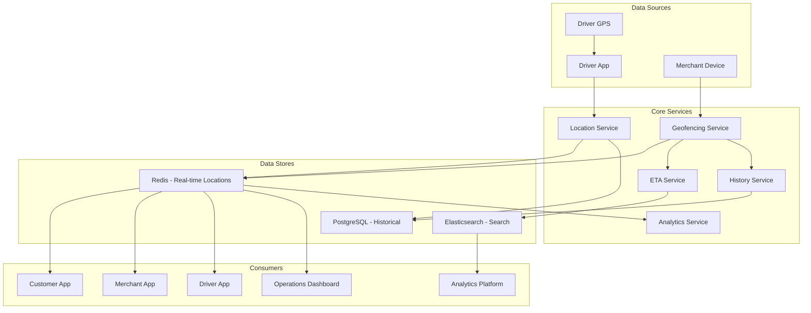

# Software Requirements Specification (SRS)

## Part 04C: Real-Time Tracking

**Module:** Dispatch & Logistics Module (Part 05)
**Version:** 1.0.0
**Status:** Final / For Review
**Date:** 2026-06-30

---

## Chapter 1 – Overview

### Purpose

The Real-Time Tracking module defines the comprehensive tracking capabilities that provide visibility into delivery progress for all stakeholders—customers, merchants, drivers, and operations teams. This encompasses live GPS tracking, geofencing, ETA updates, route visualization, and historical tracking.

Real-time tracking is the primary driver of customer confidence and operational efficiency. Customers who can see their order's progress experience less anxiety and higher satisfaction. Merchants who can track driver arrivals can prepare orders more efficiently. Operations teams who can monitor the entire fleet can respond to issues proactively. This module transforms the delivery process from a "black box" into a transparent, observable operation.

### Objectives

- Provide real-time GPS tracking with high accuracy
- Enable visual route tracking on interactive maps
- Deliver dynamic ETA updates with confidence intervals
- Support geofencing for automated status transitions
- Enable historical tracking for audit and analysis
- Provide tracking for all stakeholders (customer, merchant, admin)
- Optimize for low bandwidth and battery consumption
- Support offline tracking with sync-on-connect

---

## Chapter 2 – Tracking Architecture

### DSP-041 Tracking System Architecture

### DSP-042 Tracking Components

| Component | Description | Priority |
| :--- | :--- | :--- |
| **Location Ingestion Service** | Receives and processes GPS updates. | **Required** |
| **Real-Time Location Cache** | Redis-based cache for current locations. | **Required** |
| **Geofencing Service** | Detects entry/exit of geographic boundaries. | **Required** |
| **ETA Service** | Calculates dynamic ETAs. | **Required** |
| **History Service** | Stores historical location data. | **Required** |
| **Route Service** | Manages route polyline visualization. | **Required** |
| **Analytics Service** | Provides tracking analytics. | **Required** |
| **WebSocket Gateway** | Real-time push to clients. | **Required** |

---

## Chapter 3 – GPS Location Management

### DSP-043 GPS Update Specifications

| Parameter | Specification | Priority |
| :--- | :--- | :--- |
| **Update Frequency (Active)** | Every 3-5 seconds | **Required** |
| **Update Frequency (Background)** | Every 15-30 seconds | **Required** |
| **Accuracy Requirement** | < 10 meters | **Required** |
| **Minimum Accuracy** | < 50 meters (acceptable) | **Required** |
| **Battery Optimization** | Adaptive polling | **Required** |
| **Data Usage** | < 2 MB per hour | **Required** |
| **Offline Storage** | Cache up to 1000 points | **Required** |

### DSP-044 GPS Data Model

| Attribute | Type | Description |
| :--- | :--- | :--- |
| `driver_id` | UUID | Driver identifier |
| `order_id` | UUID | Active order identifier |
| `latitude` | Decimal(10, 8) | GPS latitude |
| `longitude` | Decimal(11, 8) | GPS longitude |
| `accuracy` | Decimal(5, 2) | Accuracy in meters |
| `speed` | Decimal(5, 2) | Speed in km/h |
| `heading` | Decimal(5, 2) | Direction in degrees |
| `altitude` | Decimal(6, 2) | Altitude in meters |
| `provider` | VARCHAR(20) | GPS/Network/Fused |
| `is_background` | BOOLEAN | Background location flag |
| `timestamp` | TIMESTAMP | GPS timestamp |
| `created_at` | TIMESTAMP | Record creation timestamp |

### DSP-045 Location Quality Management

| Quality Level | Criteria | Action |
| :--- | :--- | :--- |
| **Excellent** | Accuracy < 5m, GPS provider | Use as-is |
| **Good** | Accuracy 5-15m, GPS provider | Use as-is |
| **Acceptable** | Accuracy 15-50m, Network provider | Use with caution |
| **Poor** | Accuracy > 50m | Flag for manual review |
| **Invalid** | No GPS, stale > 60s | Use last known |

---

## Chapter 4 – Geofencing

### DSP-046 Geofence Types

| Geofence Type | Description | Priority |
| :--- | :--- | :--- |
| **Merchant Geofence** | Boundary around merchant location. | **Required** |
| **Customer Geofence** | Boundary around customer location. | **Required** |
| **Zone Geofence** | Delivery zone boundaries. | **Required** |
| **No-Go Geofence** | Areas restricted for delivery. | **Required** |
| **Hub Geofence** | Central hub locations. | **Medium** |
| **Priority Geofence** | High-value areas. | **Medium** |

### DSP-047 Geofence Events

| Event | Trigger | Action | Priority |
| :--- | :--- | :--- | :--- |
| **Driver Entered Merchant** | Driver crosses merchant geofence. | Auto-notify merchant. | **Required** |
| **Driver Left Merchant** | Driver exits merchant geofence. | Auto-verify pickup. | **Required** |
| **Driver Entered Customer** | Driver crosses customer geofence. | Auto-notify customer. | **Required** |
| **Driver Left Customer** | Driver exits customer geofence. | Auto-mark arrived. | **Required** |
| **Driver Entered Zone** | Driver crosses zone boundary. | Log for analytics. | **Required** |
| **Driver Entered No-Go** | Driver enters restricted zone. | Alert operations. | **Required** |

### DSP-048 Geofence Configuration

| Parameter | Description | Default |
| :--- | :--- | :--- |
| **Merchant Radius** | Radius around merchant. | 100 meters |
| **Customer Radius** | Radius around customer. | 50 meters |
| **Zone Buffer** | Buffer around zone boundary. | 50 meters |
| **Confidence Threshold** | Required location confidence. | 70% |
| **Entry Tolerance** | Time to confirm entry. | 5 seconds |
| **Exit Tolerance** | Time to confirm exit. | 10 seconds |

### DSP-049 Geofence Data Model

| Attribute | Type | Description |
| :--- | :--- | :--- |
| `geofence_id` | UUID | Unique identifier |
| `geofence_type` | VARCHAR(20) | MERCHANT/CUSTOMER/ZONE/NO_GO/HUB |
| `reference_id` | UUID | Reference to merchant/customer/zone |
| `name` | VARCHAR(100) | Geofence name |
| `center_latitude` | Decimal(10, 8) | Center latitude |
| `center_longitude` | Decimal(11, 8) | Center longitude |
| `radius` | INTEGER | Radius in meters |
| `polygon` | JSONB | Polygon coordinates (if polygon) |
| `is_active` | BOOLEAN | Active status |
| `created_at` | TIMESTAMP | Creation timestamp |
| `updated_at` | TIMESTAMP | Last update timestamp |

---

## Chapter 5 – ETA Management

### DSP-050 ETA Calculation Components

| Component | Description | Weight |
| :--- | :--- | :--- |
| **Distance** | Remaining distance to destination | 30% |
| **Traffic** | Current traffic conditions | 25% |
| **Historical Average** | Historical travel time for route | 20% |
| **Time of Day** | Typical traffic patterns | 10% |
| **Weather** | Weather impact on travel | 10% |
| **Driver Performance** | Historical speed of driver | 5% |

### DSP-051 ETA Confidence Intervals

| Confidence Level | Description | Range |
| :--- | :--- | :--- |
| **High** | High confidence in ETA | ± 2 minutes |
| **Medium** | Moderate confidence | ± 5 minutes |
| **Low** | Low confidence | ± 10 minutes |
| **Unknown** | Insufficient data | N/A |

### DSP-052 ETA Update Triggers

| Trigger | Update Frequency | Description |
| :--- | :--- | :--- |
| **GPS Update** | Every 30 seconds | Recalculate on position change. |
| **Traffic Update** | As received | Update on traffic change. |
| **Route Change** | On event | Recalculate for new route. |
| **Weather Update** | As received | Update for weather change. |
| **Driver Delay Report** | On event | Adjust for reported delay. |

### DSP-053 ETA Data Model

| Attribute | Type | Description |
| :--- | :--- | :--- |
| `eta_id` | UUID | Unique identifier |
| `order_id` | UUID | Associated order |
| `driver_id` | UUID | Associated driver |
| `remaining_distance` | Decimal | Distance remaining in km |
| `remaining_duration` | INTEGER | Time remaining in minutes |
| `estimated_arrival_time` | TIMESTAMP | Estimated arrival time |
| `confidence_level` | VARCHAR(10) | HIGH/MEDIUM/LOW |
| `confidence_min` | TIMESTAMP | Minimum confidence bound |
| `confidence_max` | TIMESTAMP | Maximum confidence bound |
| `traffic_factor` | Decimal | Traffic multiplier (1.0 = normal) |
| `weather_factor` | Decimal | Weather multiplier (1.0 = normal) |
| `driver_performance_factor` | Decimal | Driver performance multiplier |
| `calculated_at` | TIMESTAMP | ETA calculation timestamp |
| `created_at` | TIMESTAMP | Record creation timestamp |

---

## Chapter 6 – Route Visualization

### DSP-054 Route Display Features

| Feature | Description | Priority |
| :--- | :--- | :--- |
| **Live Route** | Real-time route with moving marker. | **Required** |
| **Route Polyline** | Planned route path visualization. | **Required** |
| **Traffic Overlay** | Real-time traffic conditions. | **Required** |
| **ETA Display** | Dynamic ETA with confidence. | **Required** |
| **Progress Bar** | Visual progress toward destination. | **Required** |
| **Stop Points** | Merchant and customer markers. | **Required** |
| **Turn-by-Turn** | Navigation instructions. | **Required** |
| **Zoom Controls** | Map zoom and pan. | **Required** |
| **Satellite View** | Satellite imagery option. | **Medium** |
| **Street View** | Street-level view option. | **Low** |

### DSP-055 Map Integration

| Integration | Purpose | Priority |
| :--- | :--- | :--- |
| **Google Maps** | Primary map provider. | **Required** |
| **Mapbox** | Secondary/backup provider. | **Required** |
| **Custom Styling** | Branded map styles. | **Medium** |
| **Offline Maps** | Cached map tiles. | **Required** |
| **3D View** | 3D terrain/buildings. | **Low** |

### DSP-056 Route Data Model

| Attribute | Type | Description |
| :--- | :--- | :--- |
| `route_id` | UUID | Unique identifier |
| `order_id` | UUID | Associated order |
| `driver_id` | UUID | Associated driver |
| `polyline` | TEXT | Encoded route polyline |
| `waypoints` | JSONB | Waypoints along route |
| `total_distance` | Decimal | Total distance in km |
| `total_duration` | INTEGER | Total duration in minutes |
| `distance_remaining` | Decimal | Remaining distance |
| `duration_remaining` | INTEGER | Remaining duration |
| `current_position_index` | INTEGER | Current position on route |
| `progress_percentage` | Decimal | Progress percentage |
| `last_updated` | TIMESTAMP | Last update timestamp |
| `created_at` | TIMESTAMP | Creation timestamp |

---

## Chapter 7 – Tracking Visibility

### DSP-057 Customer Tracking View

| Feature | Description | Priority |
| :--- | :--- | :--- |
| **Live Map** | Real-time driver location on map. | **Required** |
| **ETA Countdown** | Dynamic ETA with progress bar. | **Required** |
| **Status Timeline** | Chronological order milestones. | **Required** |
| **Driver Profile** | Driver name, photo, rating. | **Required** |
| **Contact Driver** | Chat and call options. | **Required** |
| **Estimated Arrival Range** | Confidence interval display. | **Required** |
| **Route Preview** | Planned route visualization. | **Required** |
| **Progress Notifications** | Push notifications for milestones. | **Required** |
| **Share Tracking** | Share tracking link with others. | **Medium** |

### DSP-058 Merchant Tracking View

| Feature | Description | Priority |
| :--- | :--- | :--- |
| **Driver Arrival ETA** | When driver will arrive at merchant. | **Required** |
| **Driver Location** | Real-time driver location on map. | **Required** |
| **Order Status** | Current order status. | **Required** |
| **Preparation Status** | Order preparation progress. | **Required** |
| **Contact Driver** | Chat and call options. | **Required** |

### DSP-059 Operations Tracking View

| Feature | Description | Priority |
| :--- | :--- | :--- |
| **Fleet Map** | All active drivers on map. | **Required** |
| **Driver Status** | Online/Offline/Busy status. | **Required** |
| **Order Overlays** | Active orders on map. | **Required** |
| **Alert Notifications** | Real-time alerts for issues. | **Required** |
| **Filter Options** | Filter by zone, status, vehicle. | **Required** |
| **Heat Maps** | Order density visualization. | **Required** |
| **Playback** | Historical playback. | **Medium** |

---

## Chapter 8 – Historical Tracking

### DSP-060 Historical Tracking Features

| Feature | Description | Priority |
| :--- | :--- | :--- |
| **Playback** | Replay past deliveries. | **Required** |
| **Timeline View** | Chronological location history. | **Required** |
| **Speed Analysis** | Speed variations along route. | **Required** |
| **Stop Detection** | Identify stops and durations. | **Required** |
| **Route Comparison** | Compare actual vs. planned. | **Required** |
| **Export** | Export tracking data. | **Required** |
| **Search** | Search by order ID or date. | **Required** |

### DSP-061 Historical Data Retention

| Data Type | Retention Period | Priority |
| :--- | :--- | :--- |
| **GPS Location Data** | 90 days | **Required** |
| **Geofence Events** | 90 days | **Required** |
| **ETA Data** | 90 days | **Required** |
| **Route Data** | 90 days | **Required** |
| **Analytics Aggregates** | 7 years | **Required** |
| **Audit Data** | 7 years | **Required** |

---

## Chapter 9 – Database Tables

### driver_locations

| Column | Type | Constraints | Description |
| :--- | :--- | :--- | :--- |
| `location_id` | UUID | PRIMARY KEY | Unique identifier |
| `driver_id` | UUID | FOREIGN KEY (driver_accounts.driver_id) | Associated driver |
| `order_id` | UUID | FOREIGN KEY (merchant_orders.order_id) | Active order (if any) |
| `latitude` | DECIMAL(10, 8) | NOT NULL | GPS latitude |
| `longitude` | DECIMAL(11, 8) | NOT NULL | GPS longitude |
| `accuracy` | DECIMAL(5, 2) | | GPS accuracy (meters) |
| `speed` | DECIMAL(5, 2) | | Speed (km/h) |
| `heading` | DECIMAL(5, 2) | | Heading direction (degrees) |
| `altitude` | DECIMAL(6, 2) | | Altitude (meters) |
| `provider` | VARCHAR(20) | | GPS/Network/Fused |
| `is_background` | BOOLEAN | DEFAULT FALSE | Background location |
| `recorded_at` | TIMESTAMP | NOT NULL | GPS timestamp |
| `created_at` | TIMESTAMP | DEFAULT NOW() | Record creation timestamp |

### driver_current_locations

| Column | Type | Constraints | Description |
| :--- | :--- | :--- | :--- |
| `driver_id` | UUID | PRIMARY KEY, FOREIGN KEY (driver_accounts.driver_id) | Associated driver |
| `order_id` | UUID | FOREIGN KEY (merchant_orders.order_id) | Active order (if any) |
| `latitude` | DECIMAL(10, 8) | NOT NULL | Current GPS latitude |
| `longitude` | DECIMAL(11, 8) | NOT NULL | Current GPS longitude |
| `accuracy` | DECIMAL(5, 2) | | GPS accuracy (meters) |
| `speed` | DECIMAL(5, 2) | | Speed (km/h) |
| `heading` | DECIMAL(5, 2) | | Heading direction (degrees) |
| `altitude` | DECIMAL(6, 2) | | Altitude (meters) |
| `last_update` | TIMESTAMP | NOT NULL | Last update timestamp |
| `created_at` | TIMESTAMP | DEFAULT NOW() | Creation timestamp |
| `updated_at` | TIMESTAMP | DEFAULT NOW() | Last update timestamp |

### geofences

| Column | Type | Constraints | Description |
| :--- | :--- | :--- | :--- |
| `geofence_id` | UUID | PRIMARY KEY | Unique identifier |
| `geofence_type` | VARCHAR(20) | NOT NULL | MERCHANT/CUSTOMER/ZONE/NO_GO/HUB |
| `reference_id` | UUID | | Reference to merchant/customer/zone |
| `name` | VARCHAR(100) | NOT NULL | Geofence name |
| `center_latitude` | DECIMAL(10, 8) | | Center latitude (for radius) |
| `center_longitude` | DECIMAL(11, 8) | | Center longitude (for radius) |
| `radius` | INTEGER | | Radius in meters |
| `polygon` | JSONB | | Polygon coordinates (if polygon) |
| `is_active` | BOOLEAN | DEFAULT TRUE | Active status |
| `created_at` | TIMESTAMP | DEFAULT NOW() | Creation timestamp |
| `updated_at` | TIMESTAMP | DEFAULT NOW() | Last update timestamp |

### geofence_events

| Column | Type | Constraints | Description |
| :--- | :--- | :--- | :--- |
| `event_id` | UUID | PRIMARY KEY | Unique identifier |
| `driver_id` | UUID | FOREIGN KEY (driver_accounts.driver_id) | Associated driver |
| `geofence_id` | UUID | FOREIGN KEY (geofences.geofence_id) | Associated geofence |
| `order_id` | UUID | FOREIGN KEY (merchant_orders.order_id) | Associated order |
| `event_type` | VARCHAR(20) | NOT NULL | ENTRY/EXIT/DWELL |
| `latitude` | DECIMAL(10, 8) | NOT NULL | Event latitude |
| `longitude` | DECIMAL(11, 8) | NOT NULL | Event longitude |
| `accuracy` | DECIMAL(5, 2) | | GPS accuracy |
| `duration` | INTEGER | | Dwell duration (seconds) |
| `event_timestamp` | TIMESTAMP | NOT NULL | Event timestamp |
| `created_at` | TIMESTAMP | DEFAULT NOW() | Record creation timestamp |

### tracking_etas

| Column | Type | Constraints | Description |
| :--- | :--- | :--- | :--- |
| `eta_id` | UUID | PRIMARY KEY | Unique identifier |
| `order_id` | UUID | FOREIGN KEY (merchant_orders.order_id) | Associated order |
| `driver_id` | UUID | FOREIGN KEY (driver_accounts.driver_id) | Associated driver |
| `remaining_distance` | DECIMAL(10, 2) | | Distance remaining (km) |
| `remaining_duration` | INTEGER | | Time remaining (minutes) |
| `estimated_arrival` | TIMESTAMP | NOT NULL | Estimated arrival time |
| `confidence_level` | VARCHAR(10) | | HIGH/MEDIUM/LOW |
| `confidence_min` | TIMESTAMP | | Minimum confidence bound |
| `confidence_max` | TIMESTAMP | | Maximum confidence bound |
| `traffic_factor` | DECIMAL(3, 2) | | Traffic multiplier |
| `weather_factor` | DECIMAL(3, 2) | | Weather multiplier |
| `driver_performance_factor` | DECIMAL(3, 2) | | Driver performance multiplier |
| `calculated_at` | TIMESTAMP | NOT NULL | Calculation timestamp |
| `created_at` | TIMESTAMP | DEFAULT NOW() | Record creation timestamp |

### tracking_routes

| Column | Type | Constraints | Description |
| :--- | :--- | :--- | :--- |
| `route_id` | UUID | PRIMARY KEY | Unique identifier |
| `order_id` | UUID | FOREIGN KEY (merchant_orders.order_id) | Associated order |
| `driver_id` | UUID | FOREIGN KEY (driver_accounts.driver_id) | Associated driver |
| `polyline` | TEXT | | Encoded route polyline |
| `waypoints` | JSONB | | Waypoints along route |
| `total_distance` | DECIMAL(10, 2) | | Total distance (km) |
| `total_duration` | INTEGER | | Total duration (minutes) |
| `distance_remaining` | DECIMAL(10, 2) | | Remaining distance |
| `duration_remaining` | INTEGER | | Remaining duration |
| `current_position_index` | INTEGER | | Current position on route |
| `progress_percentage` | DECIMAL(5, 2) | | Progress percentage |
| `last_updated` | TIMESTAMP | NOT NULL | Last update timestamp |
| `created_at` | TIMESTAMP | DEFAULT NOW() | Creation timestamp |
| `updated_at` | TIMESTAMP | DEFAULT NOW() | Last update timestamp |

### driver_location_history_aggregate

| Column | Type | Constraints | Description |
| :--- | :--- | :--- | :--- |
| `aggregate_id` | UUID | PRIMARY KEY | Unique identifier |
| `driver_id` | UUID | FOREIGN KEY (driver_accounts.driver_id) | Associated driver |
| `aggregate_date` | DATE | NOT NULL | Date of aggregation |
| `total_online_time` | INTEGER | | Total online time (minutes) |
| `total_active_time` | INTEGER | | Total active time (minutes) |
| `total_distance` | DECIMAL(10, 2) | | Total distance (km) |
| `avg_speed` | DECIMAL(5, 2) | | Average speed (km/h) |
| `max_speed` | DECIMAL(5, 2) | | Maximum speed (km/h) |
| `total_stops` | INTEGER | | Number of stops |
| `avg_stop_duration` | INTEGER | | Average stop duration (minutes) |
| `heatmap_data` | JSONB | | Heatmap data for visualization |
| `created_at` | TIMESTAMP | DEFAULT NOW() | Creation timestamp |
| `updated_at` | TIMESTAMP | DEFAULT NOW() | Last update timestamp |

---

## Chapter 10 – REST APIs

### Location APIs

| Method | Endpoint | Description |
| :--- | :--- | :--- |
| `POST` | `/api/v1/driver/location` | Update driver location |
| `GET` | `/api/v1/driver/location` | Get current driver location |
| `GET` | `/api/v1/driver/location/history` | Get location history |
| `GET` | `/api/v1/driver/location/route` | Get active route |

### Tracking APIs

| Method | Endpoint | Description |
| :--- | :--- | :--- |
| `GET` | `/api/v1/tracking/order/{id}` | Get order tracking data |
| `GET` | `/api/v1/tracking/order/{id}/location` | Get current location for order |
| `GET` | `/api/v1/tracking/order/{id}/eta` | Get current ETA for order |
| `GET` | `/api/v1/tracking/order/{id}/route` | Get route for order |
| `GET` | `/api/v1/tracking/order/{id}/timeline` | Get tracking timeline |

### Geofence APIs

| Method | Endpoint | Description |
| :--- | :--- | :--- |
| `GET` | `/api/v1/geofences` | List geofences |
| `POST` | `/api/v1/geofences` | Create geofence (admin) |
| `GET` | `/api/v1/geofences/{id}` | Get geofence details |
| `PUT` | `/api/v1/geofences/{id}` | Update geofence (admin) |
| `DELETE` | `/api/v1/geofences/{id}` | Delete geofence (admin) |
| `GET` | `/api/v1/geofences/events` | Get geofence events |

### ETA APIs

| Method | Endpoint | Description |
| :--- | :--- | :--- |
| `GET` | `/api/v1/eta/order/{id}` | Get ETA for order |
| `POST` | `/api/v1/eta/calculate` | Calculate ETA for route |

### Fleet Tracking APIs (Operations)

| Method | Endpoint | Description |
| :--- | :--- | :--- |
| `GET` | `/api/v1/dispatch/fleet/locations` | Get all driver locations |
| `GET` | `/api/v1/dispatch/fleet/status` | Get fleet status summary |
| `GET` | `/api/v1/dispatch/fleet/heatmap` | Get heatmap data |
| `GET` | `/api/v1/dispatch/fleet/playback` | Historical playback |

---

## Chapter 11 – WebSocket/SSE Events

### DSP-062 Real-Time Tracking Events

| Event | Payload | Description |
| :--- | :--- | :--- |
| `tracking.location.updated` | `{ driver_id, order_id, latitude, longitude, timestamp }` | Driver location updated |
| `tracking.eta.updated` | `{ order_id, eta_seconds, confidence_level, timestamp }` | ETA recalculated |
| `tracking.route.updated` | `{ order_id, polyline, progress, timestamp }` | Route updated |
| `tracking.status.changed` | `{ order_id, status, timestamp }` | Order status changed |
| `tracking.geofence.entered` | `{ driver_id, geofence_id, geofence_type, timestamp }` | Geofence entered |
| `tracking.geofence.exited` | `{ driver_id, geofence_id, geofence_type, timestamp }` | Geofence exited |
| `tracking.arriving.soon` | `{ order_id, eta_minutes, timestamp }` | Driver arriving soon |

---

## Chapter 12 – Business Rules

| Rule ID | Rule Description | Priority |
| :--- | :--- | :--- |
| **BR-TRK-001** | GPS updates must be sent every 3-5 seconds during active delivery. | **High** |
| **BR-TRK-002** | Geofence entry/exit must be detected within 5 seconds. | **High** |
| **BR-TRK-003** | ETA must be recalculated every 30 seconds. | **High** |
| **BR-TRK-004** | Location data must be retained for 90 days. | **High** |
| **BR-TRK-005** | Geofence radius: Merchant 100m, Customer 50m. | **High** |
| **BR-TRK-006** | Tracking data must be accessible via WebSocket for real-time updates. | **High** |
| **BR-TRK-007** | Historical playback must support at least 1x, 2x, and 4x speeds. | **Medium** |
| **BR-TRK-008** | Accuracy below 50m is considered invalid for geofencing. | **High** |

---

## Chapter 13 – Acceptance Tests

| Test ID | Test Description | Priority |
| :--- | :--- | :--- |
| **TEST-TRK-001** | Driver GPS location updates every 3-5 seconds. | **High** |
| **TEST-TRK-002** | Customer sees live driver location on map. | **High** |
| **TEST-TRK-003** | Customer sees dynamic ETA with confidence interval. | **High** |
| **TEST-TRK-004** | Customer sees route polyline and progress. | **High** |
| **TEST-TRK-005** | Driver enters merchant geofence; merchant notified. | **High** |
| **TEST-TRK-006** | Driver exits merchant geofence; pickup auto-verified. | **High** |
| **TEST-TRK-007** | Driver enters customer geofence; customer notified. | **High** |
| **TEST-TRK-008** | Geofence events logged for audit. | **High** |
| **TEST-TRK-009** | ETA recalculated on GPS change. | **High** |
| **TEST-TRK-010** | ETA recalculated on traffic update. | **High** |
| **TEST-TRK-011** | ETA confidence interval displayed correctly. | **High** |
| **TEST-TRK-012** | Historical playback for past delivery. | **High** |
| **TEST-TRK-013** | Fleet map shows all active drivers. | **High** |
| **TEST-TRK-014** | Order status timeline displays correctly. | **High** |
| **TEST-TRK-015** | Driver profile visible to customer. | **High** |
| **TEST-TRK-016** | Contact driver via chat works. | **High** |
| **TEST-TRK-017** | Contact driver via call (masked) works. | **High** |
| **TEST-TRK-018** | Tracking works with intermittent connectivity. | **High** |
| **TEST-TRK-019** | Battery usage within acceptable limits. | **Medium** |
| **TEST-TRK-020** | Share tracking link works. | **Medium** |
| **TEST-TRK-021** | Operations heatmap displays correctly. | **Medium** |
| **TEST-TRK-022** | Location history search by order ID works. | **High** |
| **TEST-TRK-023** | Location data exported for analysis. | **High** |

---

## Chapter 14 – Traceability Matrix

| Requirement | Database Table | API Endpoint(s) | Acceptance Test |
| :--- | :--- | :--- | :--- |
| DSP-043 | driver_current_locations | POST /api/v1/driver/location | TEST-TRK-001 |
| DSP-057 | driver_current_locations | GET /api/v1/tracking/order/{id}/location | TEST-TRK-002 |
| DSP-050 | tracking_etas | GET /api/v1/tracking/order/{id}/eta | TEST-TRK-003 |
| DSP-054 | tracking_routes | GET /api/v1/tracking/order/{id}/route | TEST-TRK-004 |
| DSP-046 | geofence_events | Internal | TEST-TRK-005, TEST-TRK-006, TEST-TRK-007, TEST-TRK-008 |
| DSP-050 | tracking_etas | GET /api/v1/tracking/order/{id}/eta | TEST-TRK-009, TEST-TRK-010, TEST-TRK-011 |
| DSP-060 | driver_location_history_aggregate | GET /api/v1/dispatch/fleet/playback | TEST-TRK-012 |
| DSP-059 | driver_current_locations | GET /api/v1/dispatch/fleet/locations | TEST-TRK-013 |
| DSP-057 | driver_locations | GET /api/v1/tracking/order/{id}/timeline | TEST-TRK-014 |
| DSP-057 | driver_accounts | GET /api/v1/tracking/order/{id} | TEST-TRK-015 |
| DSP-058 | driver_communications | POST /api/v1/tracking/order/{id}/chat | TEST-TRK-016 |
| DSP-058 | driver_communications | POST /api/v1/tracking/order/{id}/call | TEST-TRK-017 |
| DSP-043 | driver_locations | POST /api/v1/driver/location | TEST-TRK-018 |

---

## Chapter 15 – Summary

This document establishes the complete real-time tracking capability for the **[Platform Name]** platform. Key takeaways:

- **Real-Time GPS Tracking:** High-frequency GPS updates (3-5 seconds) with accuracy < 10 meters and optimized battery usage.
- **Geofencing:** Automated geofence detection for merchant arrival, customer arrival, and zone boundaries with configurable radii.
- **Dynamic ETA:** Real-time ETA calculation with traffic, weather, and historical data, displayed with confidence intervals.
- **Route Visualization:** Live route display with polyline, progress bar, and turn-by-turn navigation.
- **Multi-Stakeholder Visibility:** Customer tracking view (live map, ETA, driver profile), merchant tracking view (driver arrival ETA), and operations tracking view (fleet map, heatmaps).
- **Historical Tracking:** Playback, timeline view, speed analysis, and stop detection for past deliveries.
- **Real-Time Communication:** WebSocket/SSE events for location updates, ETA updates, geofence events, and status changes.
- **Offline Support:** Cached locations and sync-on-connect for intermittent connectivity.

Real-time tracking is the cornerstone of customer confidence and operational efficiency. By providing complete visibility into the delivery journey, the platform builds trust, enables proactive issue resolution, and drives continuous operational improvement.

---

**Next Document:**

`Part_04D_Multi_Vendor_Consolidation.md`

*(This builds on real-time tracking to define how orders from multiple vendors are consolidated into single delivery trips.)*
