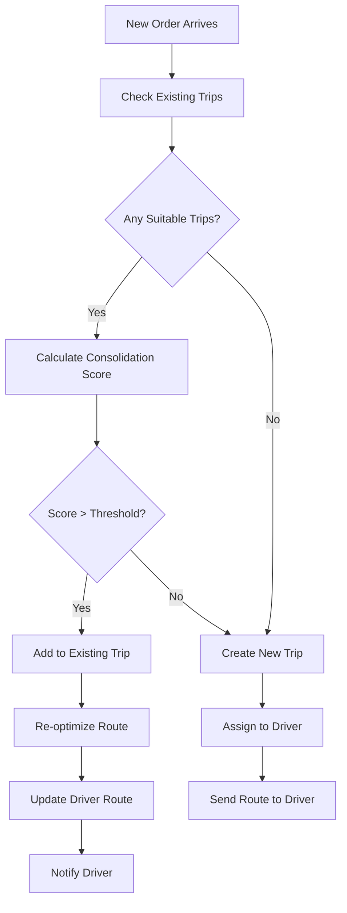

# Software Requirements Specification (SRS)

## Part 04D: Multi-Vendor Consolidation

**Module:** Dispatch & Logistics Module (Part 05)
**Version:** 1.0.0
**Status:** Final / For Review
**Date:** 2026-06-30

---

## Chapter 1 – Overview

### Purpose

The Multi-Vendor Consolidation module defines the sophisticated capabilities for combining orders from multiple merchants into a single, efficient delivery trip. This is a critical optimization feature that significantly reduces delivery costs, improves driver earnings, and lowers the platform's environmental footprint.

Consolidation is one of the most powerful levers for improving unit economics in on-demand delivery. By enabling a single driver to pick up from multiple merchants and deliver to multiple customers in one trip, the platform can reduce per-order delivery costs by 30-50%, increase driver earnings per hour, and reduce traffic congestion and emissions. This is particularly valuable for dense urban areas and for grocery/retail deliveries where order sizes may be smaller.

### Objectives

- Enable efficient consolidation of orders from multiple vendors
- Optimize pickup and delivery sequences for minimal time and distance
- Maximize driver earnings through increased trip density
- Reduce per-order delivery costs by 30-50%
- Minimize environmental impact through reduced trips
- Support dynamic consolidation based on real-time conditions
- Maintain customer experience standards (freshness, timing)
- Provide transparent consolidation benefits to all stakeholders

---

## Chapter 2 – Consolidation Overview

### DSP-063 Consolidation Concepts

| Concept | Description |
| :--- | :--- |
| **Consolidated Trip** | A single delivery trip containing orders from multiple merchants delivered to multiple customers. |
| **Pickup Sequence** | The optimized order in which the driver picks up orders from different merchants. |
| **Delivery Sequence** | The optimized order in which the driver delivers orders to different customers. |
| **Consolidation Window** | The time window during which orders can be consolidated. |
| **Consolidation Radius** | The geographic radius within which consolidation is considered. |
| **Trip Density** | The number of orders per trip (consolidation efficiency). |

### DSP-064 Consolidation Types

| Type | Description | Priority |
| :--- | :--- | :--- |
| **Same Merchant Consolidation** | Multiple orders from the same merchant. | **Required** |
| **Nearby Merchant Consolidation** | Orders from merchants within close proximity. | **Required** |
| **Route-Aligned Consolidation** | Orders that share a similar delivery route. | **Required** |
| **Time-Aligned Consolidation** | Orders with similar ready times. | **Required** |
| **Dynamic Consolidation** | Real-time consolidation based on conditions. | **Required** |
| **Pre-Planned Consolidation** | Batch consolidation planned in advance. | **Medium** |

### DSP-065 Consolidation Benefits

| Stakeholder | Benefit | Impact |
| :--- | :--- | :--- |
| **Customer** | Potentially lower delivery fees, reduced traffic. | Lower cost, faster delivery. |
| **Merchant** | More efficient pickup process. | Reduced driver wait time. |
| **Driver** | Higher earnings per hour, more efficient trips. | +30-50% earnings. |
| **Platform** | Lower delivery costs, higher margins. | Improved unit economics. |
| **Environment** | Fewer trips, lower emissions. | Reduced carbon footprint. |

---

## Chapter 3 – Consolidation Algorithms

### DSP-066 Consolidation Matching Criteria

| Criterion | Threshold | Weight | Description |
| :--- | :--- | :--- | :--- |
| **Geographic Proximity** | < 3 km between merchants | 30% | Merchants must be close. |
| **Route Alignment** | < 45° angle difference | 25% | Orders heading same direction. |
| **Time Proximity** | < 10 minutes between ready times | 20% | Orders ready around same time. |
| **Driver Capacity** | Vehicle capacity sufficient | 15% | Driver can carry all orders. |
| **Customer Tolerance** | Customer delivery window flexibility | 10% | Customers can accept slight delays. |

### DSP-067 Consolidation Score Calculation

| Factor | Weight | Description |
| :--- | :--- | :--- |
| **Total Distance Savings** | 35% | Percentage reduction in total distance vs. separate trips. |
| **Time Efficiency** | 25% | Percentage reduction in total time. |
| **Driver Utilization** | 20% | Increase in driver active time. |
| **Cost Savings** | 15% | Reduction in delivery cost per order. |
| **Customer Impact** | 5% | Impact on customer delivery experience. |

**Formula:**
```
Consolidation_Score = 
    (Distance_Savings × 0.35) +
    (Time_Efficiency × 0.25) +
    (Driver_Utilization × 0.20) +
    (Cost_Savings × 0.15) +
    (Customer_Impact × 0.05)
```

### DSP-068 Consolidation Decision Process



### DSP-069 Trip Optimization Algorithm

1.  Identify all orders assigned to a trip.
2.  Identify pickup locations (merchant addresses).
3.  Identify delivery locations (customer addresses).
4.  Calculate optimal route using traveling salesman problem (TSP) optimization:
    - Start at driver's current location.
    - Visit all pickup locations in optimal order.
    - Visit all delivery locations in optimal order.
    - Ensure pickup before delivery for each order.
5.  Calculate total distance and time.
6.  Generate turn-by-turn directions.
7.  Provide ETA for each stop.

---

## Chapter 4 – Consolidation Scenarios

### DSP-070 Scenario 1: Same Merchant Consolidation

| Aspect | Description |
| :--- | :--- |
| **Description** | Multiple orders from the same merchant consolidated into one trip. |
| **Example** | Restaurant receives 3 orders going to nearby addresses. |
| **Benefits** | Driver picks up all 3 at once, delivers sequentially. |
| **Efficiency Gain** | 50-70% reduction in per-order pickup time. |
| **Constraints** | Order ready times within 5 minutes. |

### DSP-071 Scenario 2: Nearby Merchant Consolidation

| Aspect | Description |
| :--- | :--- |
| **Description** | Orders from different merchants within close proximity. |
| **Example** | Orders from 2 restaurants in the same food court. |
| **Benefits** | Driver picks up both with minimal extra distance. |
| **Efficiency Gain** | 30-50% reduction in travel time. |
| **Constraints** | Merchants within 500m of each other. |

### DSP-072 Scenario 3: Route-Aligned Consolidation

| Aspect | Description |
| :--- | :--- |
| **Description** | Orders heading in similar direction along a route. |
| **Example** | Two orders going to the same neighborhood. |
| **Benefits** | Driver travels a single route with multiple drops. |
| **Efficiency Gain** | 30-40% reduction in delivery distance. |
| **Constraints** | Delivery addresses along same route. |

### DSP-073 Scenario 4: Time-Aligned Consolidation

| Aspect | Description |
| :--- | :--- |
| **Description** | Orders with similar ready times. |
| **Example** | Orders ready within 5-10 minutes of each other. |
| **Benefits** | Driver can pick up sequentially without waiting. |
| **Efficiency Gain** | 20-30% reduction in wait time. |
| **Constraints** | Ready times within 10 minutes. |

---

## Chapter 5 – Route Optimization

### DSP-074 Consolidated Route Structure

```
Driver Start → Merchant A (Pickup) → Merchant B (Pickup) → Customer 1 (Delivery) → Customer 2 (Delivery)
```

**Example Route:**
```
1. Start: Driver Location (12:00 PM)
2. Merchant A - Burger King (Pickup Order A, 12:05 PM)
3. Merchant B - Pizza Hut (Pickup Order B, 12:12 PM)
4. Customer 1 - 123 Main St (Deliver Order A, 12:25 PM)
5. Customer 2 - 456 Oak Ave (Deliver Order B, 12:32 PM)
6. End: 12:40 PM (Total trip: 40 minutes)
```

### DSP-075 Route Optimization Constraints

| Constraint | Description | Priority |
| :--- | :--- | :--- |
| **Pickup Before Delivery** | Each order must be picked up before delivery. | **High** |
| **Time Windows** | Delivery within customer's expected window. | **High** |
| **Vehicle Capacity** | Driver vehicle can carry all orders. | **High** |
| **Maximum Trip Duration** | Trip duration < 60 minutes (configurable). | **High** |
| **Maximum Orders per Trip** | Max 4 orders per trip (configurable). | **High** |
| **Maximum Distance** | Trip distance < 20 km (configurable). | **High** |
| **Food Quality** | No order should exceed its delivery time SLA. | **High** |

### DSP-076 Route Optimization Algorithm

| Algorithm | Description | Priority |
| :--- | :--- | :--- |
| **Nearest Neighbor** | Greedy algorithm for initial route. | **Required** |
| **2-Opt Optimization** | Local search to improve route. | **Required** |
| **Dynamic Insertion** | Insert new orders into existing route. | **Required** |
| **Re-optimization** | Periodically re-optimize active routes. | **Required** |
| **Machine Learning** | ML-based route optimization. | **Future** |

### DSP-077 Route Re-optimization

| Trigger | Frequency | Description |
| :--- | :--- | :--- |
| **New Order Added** | On event | Re-optimize route with new order. |
| **Order Change** | On event | Re-optimize on order modification. |
| **Traffic Update** | Every 5 min | Re-optimize on traffic changes. |
| **Driver Delay** | On event | Re-optimize for delays. |
| **Order Removal** | On event | Re-optimize on order cancellation. |

---

## Chapter 6 – Driver Experience

### DSP-078 Driver Consolidated Trip View

| Displayed Information | Description |
| :--- | :--- |
| **Trip Summary** | Number of orders, total distance, total payout. |
| **Stop Sequence** | Ordered list of pickup and delivery stops. |
| **ETA per Stop** | Estimated time for each stop. |
| **Order Details** | Merchant, customer, items for each order. |
| **Map View** | Interactive map with all stops. |
| **Optimization Benefits** | Display consolidated payout vs. individual. |

### DSP-079 Driver Benefits Display

| Feature | Description | Priority |
| :--- | :--- | :--- |
| **Earnings Comparison** | Show consolidated vs. separate earnings. | **Required** |
| **Trip Efficiency** | Show time/distance savings. | **Required** |
| **Bonus Display** | Show consolidation bonus. | **Required** |
| **Performance Impact** | Show impact on earnings per hour. | **Required** |

### DSP-080 Driver Acceptance Flow

1.  Driver receives consolidated order offer.
2.  Driver sees trip summary:
    - Number of orders
    - All merchants and customers
    - Total payout (with bonus)
    - Total distance and time
3.  Driver accepts or declines.
4.  If accepted, driver receives optimized route.
5.  Driver executes trip with sequential stops.
6.  Driver completes all deliveries.
7.  Driver receives payout with bonus.

---

## Chapter 7 – Customer Experience

### DSP-081 Customer Communication

| Message | Timing | Channel | Priority |
| :--- | :--- | :--- | :--- |
| **Order Confirmed** | Immediate | Push/SMS | **Required** |
| **Consolidation Notification** | After consolidation | Push | **Required** |
| **Delivery Window Update** | After consolidation | Push | **Required** |
| **Driver En Route** | After pickup | Push | **Required** |
| **Driver Arriving Soon** | 2 min before delivery | Push | **Required** |
| **Order Delivered** | On completion | Push | **Required** |

### DSP-082 Customer Transparency

| Feature | Description | Priority |
| :--- | :--- | :--- |
| **Consolidation Status** | Show if order is consolidated. | **Required** |
| **Trip Progress** | Show all stops on the trip. | **Required** |
| **Driver Route** | Show full consolidated route. | **Required** |
| **ETA with Context** | Show ETA considering consolidation. | **Required** |
| **Delivery Notifications** | Notify when driver is at previous stops. | **Required** |

### DSP-083 Customer Consent

| Feature | Description | Priority |
| :--- | :--- | :--- |
| **Consolidation Opt-Out** | Customer can opt out of consolidation. | **Required** |
| **Delivery Window Preference** | Customer can specify delivery window. | **Required** |
| **Freshness Preference** | Customer can prioritize freshness over speed. | **Medium** |
| **Consolidation Transparency** | Customer sees consolidation benefits. | **Required** |

---

## Chapter 8 – Financial Impact

### DSP-084 Consolidation Economics

| Metric | Separate Trips | Consolidated Trip | Savings |
| :--- | :--- | :--- | :--- |
| **Total Distance** | 15 km | 8 km | 47% |
| **Total Time** | 45 min | 30 min | 33% |
| **Driver Payout** | $18.00 | $22.00 | +22% |
| **Per-Order Cost** | $9.00 | $5.50 | 39% |
| **Platform Cost** | $27.00 | $16.50 | 39% |

### DSP-085 Consolidation Payout Structure

| Component | Description | Calculation |
| :--- | :--- | :--- |
| **Base Fee per Order** | Base delivery fee × Number of orders. | 4 × $3.00 = $12.00 |
| **Distance Bonus** | Total distance × Distance rate. | 8 km × $0.50 = $4.00 |
| **Consolidation Bonus** | Bonus for accepting consolidated trip. | Fixed bonus = $4.00 |
| **Efficiency Bonus** | Bonus for efficient route. | Time savings bonus = $2.00 |
| **Total Payout** | Sum of all components. | **$22.00** |

### DSP-086 Consolidation Bonus Structure

| Bonus Type | Criteria | Amount |
| :--- | :--- | :--- |
| **Trip Size Bonus** | 2 orders | $2.00 |
| | 3 orders | $4.00 |
| | 4 orders | $6.00 |
| **Distance Savings** | > 30% savings | $2.00 |
| | > 40% savings | $4.00 |
| | > 50% savings | $6.00 |
| **Time Savings** | > 20% savings | $2.00 |
| | > 30% savings | $4.00 |

---

## Chapter 9 – Consolidation Analytics

### DSP-087 Consolidation Metrics

| Metric | Description | Target |
| :--- | :--- | :--- |
| **Consolidation Rate** | % of orders delivered in consolidated trips. | > 40% |
| **Average Trip Size** | Average orders per consolidated trip. | > 2.5 |
| **Distance Savings** | % reduction in total distance. | > 30% |
| **Time Savings** | % reduction in total time. | > 20% |
| **Cost Savings** | % reduction in delivery cost. | > 30% |
| **Driver Earnings Impact** | % increase in driver earnings. | > 20% |
| **Customer Satisfaction** | Customer satisfaction with consolidation. | > 4.5/5 |
| **Trip Efficiency** | Orders per hour. | > 8 |

### DSP-088 Consolidation Reports

| Report | Description | Frequency |
| :--- | :--- | :--- |
| **Consolidation Summary** | Key consolidation metrics. | Daily |
| **Route Efficiency** | Route optimization metrics. | Weekly |
| **Financial Impact** | Cost savings from consolidation. | Weekly |
| **Driver Performance** | Driver consolidation performance. | Weekly |
| **Customer Experience** | Customer satisfaction with consolidation. | Weekly |
| **Environmental Impact** | CO2 savings from consolidation. | Monthly |

---

## Chapter 10 – Database Tables

### consolidated_trips

| Column | Type | Constraints | Description |
| :--- | :--- | :--- | :--- |
| `trip_id` | UUID | PRIMARY KEY | Unique trip identifier |
| `driver_id` | UUID | FOREIGN KEY (driver_accounts.driver_id) | Assigned driver |
| `order_ids` | TEXT[] | NOT NULL | Orders in the trip |
| `trip_status` | VARCHAR(20) | DEFAULT 'PLANNED' | PLANNED/OFFERED/ACCEPTED/IN_PROGRESS/COMPLETED/CANCELLED |
| `total_orders` | INTEGER | NOT NULL | Number of orders |
| `total_distance` | DECIMAL(10, 2) | NOT NULL | Total distance (km) |
| `total_time` | INTEGER | NOT NULL | Total time (minutes) |
| `total_payout` | DECIMAL(10, 2) | NOT NULL | Total driver payout |
| `base_payout` | DECIMAL(10, 2) | NOT NULL | Base payout |
| `consolidation_bonus` | DECIMAL(10, 2) | DEFAULT 0 | Consolidation bonus |
| `efficiency_bonus` | DECIMAL(10, 2) | DEFAULT 0 | Efficiency bonus |
| `distance_savings_percentage` | DECIMAL(5, 2) | | Distance savings % |
| `time_savings_percentage` | DECIMAL(5, 2) | | Time savings % |
| `cost_savings` | DECIMAL(10, 2) | | Cost savings |
| `route_polyline` | TEXT | | Encoded route polyline |
| `pickup_sequence` | JSONB | | Pickup sequence with timestamps |
| `delivery_sequence` | JSONB | | Delivery sequence with timestamps |
| `offered_at` | TIMESTAMP | | Offer timestamp |
| `accepted_at` | TIMESTAMP | | Acceptance timestamp |
| `started_at` | TIMESTAMP | | Trip start timestamp |
| `completed_at` | TIMESTAMP | | Trip completion timestamp |
| `created_at` | TIMESTAMP | DEFAULT NOW() | Creation timestamp |
| `updated_at` | TIMESTAMP | DEFAULT NOW() | Last update timestamp |

### trip_stops

| Column | Type | Constraints | Description |
| :--- | :--- | :--- | :--- |
| `stop_id` | UUID | PRIMARY KEY | Unique stop identifier |
| `trip_id` | UUID | FOREIGN KEY (consolidated_trips.trip_id) | Associated trip |
| `stop_type` | VARCHAR(10) | NOT NULL | PICKUP/DELIVERY |
| `order_id` | UUID | FOREIGN KEY (merchant_orders.order_id) | Associated order |
| `reference_id` | UUID | | Merchant ID or Customer ID |
| `sequence_number` | INTEGER | NOT NULL | Stop order in trip |
| `latitude` | DECIMAL(10, 8) | NOT NULL | Stop latitude |
| `longitude` | DECIMAL(11, 8) | NOT NULL | Stop longitude |
| `address` | TEXT | NOT NULL | Stop address |
| `name` | VARCHAR(255) | | Merchant name or customer name |
| `estimated_arrival` | TIMESTAMP | | Estimated arrival time |
| `actual_arrival` | TIMESTAMP | | Actual arrival time |
| `estimated_departure` | TIMESTAMP | | Estimated departure time |
| `actual_departure` | TIMESTAMP | | Actual departure time |
| `status` | VARCHAR(20) | DEFAULT 'PENDING' | PENDING/ARRIVED/DEPARTED/COMPLETED/SKIPPED |
| `created_at` | TIMESTAMP | DEFAULT NOW() | Creation timestamp |
| `updated_at` | TIMESTAMP | DEFAULT NOW() | Last update timestamp |

### consolidation_attempts

| Column | Type | Constraints | Description |
| :--- | :--- | :--- | :--- |
| `attempt_id` | UUID | PRIMARY KEY | Unique identifier |
| `order_id` | UUID | FOREIGN KEY (merchant_orders.order_id) | Associated order |
| `candidate_trip_id` | UUID | FOREIGN KEY (consolidated_trips.trip_id) | Candidate trip |
| `consolidation_score` | DECIMAL(10, 4) | | Calculated score |
| `distance_savings` | DECIMAL(10, 2) | | Distance savings (km) |
| `time_savings` | INTEGER | | Time savings (minutes) |
| `cost_savings` | DECIMAL(10, 2) | | Cost savings |
| `customer_impact` | DECIMAL(3, 2) | | Customer impact score |
| `decision` | VARCHAR(10) | | ACCEPTED/REJECTED/PENDING |
| `decision_reason` | TEXT | | Reason for decision |
| `created_at` | TIMESTAMP | DEFAULT NOW() | Creation timestamp |
| `updated_at` | TIMESTAMP | DEFAULT NOW() | Last update timestamp |

### consolidation_configuration

| Column | Type | Constraints | Description |
| :--- | :--- | :--- | :--- |
| `config_id` | UUID | PRIMARY KEY | Unique identifier |
| `config_key` | VARCHAR(100) | UNIQUE | Configuration key |
| `config_value` | JSONB | NOT NULL | Configuration value |
| `description` | TEXT | | Description |
| `is_active` | BOOLEAN | DEFAULT TRUE | Active status |
| `created_at` | TIMESTAMP | DEFAULT NOW() | Creation timestamp |
| `updated_at` | TIMESTAMP | DEFAULT NOW() | Last update timestamp |

### consolidation_metrics

| Column | Type | Constraints | Description |
| :--- | :--- | :--- | :--- |
| `metric_id` | UUID | PRIMARY KEY | Unique identifier |
| `metric_date` | DATE | NOT NULL | Date of metrics |
| `region_id` | UUID | FOREIGN KEY (dispatch_regions.region_id) | Region |
| `total_orders` | INTEGER | | Total orders |
| `consolidated_orders` | INTEGER | | Orders in consolidated trips |
| `consolidation_rate` | DECIMAL(5, 2) | | Consolidation rate % |
| `average_trip_size` | DECIMAL(3, 2) | | Average orders per trip |
| `total_distance_saved` | DECIMAL(10, 2) | | Total distance saved (km) |
| `total_time_saved` | INTEGER | | Total time saved (minutes) |
| `total_cost_saved` | DECIMAL(10, 2) | | Total cost saved |
| `average_driver_earnings` | DECIMAL(10, 2) | | Average driver earnings |
| `customer_satisfaction` | DECIMAL(3, 2) | | Customer satisfaction |
| `created_at` | TIMESTAMP | DEFAULT NOW() | Creation timestamp |
| `updated_at` | TIMESTAMP | DEFAULT NOW() | Last update timestamp |

---

## Chapter 11 – REST APIs

### Trip APIs

| Method | Endpoint | Description |
| :--- | :--- | :--- |
| `GET` | `/api/v1/dispatch/trips` | List trips |
| `GET` | `/api/v1/dispatch/trips/{id}` | Get trip details |
| `GET` | `/api/v1/dispatch/trips/{id}/stops` | Get trip stops |
| `GET` | `/api/v1/dispatch/trips/{id}/route` | Get trip route |
| `POST` | `/api/v1/dispatch/trips/{id}/accept` | Accept trip (driver) |
| `POST` | `/api/v1/dispatch/trips/{id}/decline` | Decline trip (driver) |
| `POST` | `/api/v1/dispatch/trips/{id}/start` | Start trip (driver) |
| `POST` | `/api/v1/dispatch/trips/{id}/complete` | Complete trip (driver) |

### Consolidation APIs

| Method | Endpoint | Description |
| :--- | :--- | :--- |
| `GET` | `/api/v1/dispatch/consolidation/opportunities` | Get consolidation opportunities |
| `POST` | `/api/v1/dispatch/consolidation/evaluate` | Evaluate consolidation potential |
| `GET` | `/api/v1/dispatch/consolidation/metrics` | Get consolidation metrics |
| `GET` | `/api/v1/dispatch/consolidation/config` | Get consolidation configuration |
| `PUT` | `/api/v1/dispatch/consolidation/config` | Update consolidation configuration |

### Stop APIs

| Method | Endpoint | Description |
| :--- | :--- | :--- |
| `GET` | `/api/v1/dispatch/trips/{id}/stops/{id}` | Get stop details |
| `POST` | `/api/v1/dispatch/trips/{id}/stops/{id}/arrive` | Mark stop arrival |
| `POST` | `/api/v1/dispatch/trips/{id}/stops/{id}/depart` | Mark stop departure |

### Driver APIs

| Method | Endpoint | Description |
| :--- | :--- | :--- |
| `GET` | `/api/v1/driver/trips/current` | Get current trip |
| `GET` | `/api/v1/driver/trips/history` | Get trip history |
| `GET` | `/api/v1/driver/trips/{id}` | Get trip details |

---

## Chapter 12 – WebSocket/SSE Events

### DSP-089 Consolidation Events

| Event | Payload | Description |
| :--- | :--- | :--- |
| `consolidation.trip.created` | `{ trip_id, order_ids, total_payout, stops }` | New trip created |
| `consolidation.trip.updated` | `{ trip_id, status, stops, etas }` | Trip updated |
| `consolidation.trip.accepted` | `{ trip_id, driver_id, timestamp }` | Trip accepted by driver |
| `consolidation.stop.arrived` | `{ trip_id, stop_id, stop_type, timestamp }` | Driver arrived at stop |
| `consolidation.stop.departed` | `{ trip_id, stop_id, stop_type, timestamp }` | Driver departed stop |
| `consolidation.trip.completed` | `{ trip_id, timestamp, total_time, total_distance }` | Trip completed |

---

## Chapter 13 – Business Rules

| Rule ID | Rule Description | Priority |
| :--- | :--- | :--- |
| **BR-CON-001** | Consolidation only for orders with similar ready times (within 10 minutes). | **High** |
| **BR-CON-002** | Maximum orders per consolidated trip: 4 (configurable). | **High** |
| **BR-CON-003** | Consolidation must not increase individual delivery time by > 15 minutes. | **High** |
| **BR-CON-004** | Consolidation score must exceed threshold (0.75) for consolidation. | **High** |
| **BR-CON-005** | Driver vehicle capacity must accommodate all orders. | **High** |
| **BR-CON-006** | Consolidation bonus is paid to driver for each consolidated trip. | **High** |
| **BR-CON-007** | Customers can opt out of consolidation. | **High** |
| **BR-CON-008** | Consolidation must not compromise food quality (temperature, freshness). | **High** |
| **BR-CON-009** | Trip re-optimization occurs on new order addition or order change. | **High** |
| **BR-CON-010** | Consolidation metrics must be tracked and reported daily. | **High** |

---

## Chapter 14 – Acceptance Tests

| Test ID | Test Description | Priority |
| :--- | :--- | :--- |
| **TEST-CON-001** | Two orders from same merchant consolidated into one trip. | **High** |
| **TEST-CON-002** | Two orders from nearby merchants consolidated into one trip. | **High** |
| **TEST-CON-003** | Route-aligned orders consolidated into one trip. | **High** |
| **TEST-CON-004** | Time-aligned orders consolidated into one trip. | **High** |
| **TEST-CON-005** | Consolidation score calculated correctly. | **High** |
| **TEST-CON-006** | Trip route optimized for multiple pickups and deliveries. | **High** |
| **TEST-CON-007** | New order dynamically added to existing trip. | **High** |
| **TEST-CON-008** | Trip re-optimized after order addition. | **High** |
| **TEST-CON-009** | Trip re-optimized after order cancellation. | **High** |
| **TEST-CON-010** | Consolidation bonus calculated correctly. | **High** |
| **TEST-CON-011** | Driver sees consolidated trip view with all stops. | **High** |
| **TEST-CON-012** | Driver accepts consolidated trip. | **High** |
| **TEST-CON-013** | Driver executes all stops in sequence. | **High** |
| **TEST-CON-014** | Customer notified of consolidation. | **High** |
| **TEST-CON-015** | Customer sees full consolidated route. | **High** |
| **TEST-CON-016** | Customer can opt out of consolidation. | **High** |
| **TEST-CON-017** | Consolidation rate > 40% achieved. | **High** |
| **TEST-CON-018** | Average trip size > 2.5 orders. | **High** |
| **TEST-CON-019** | Distance savings > 30% achieved. | **High** |
| **TEST-CON-020** | Time savings > 20% achieved. | **High** |
| **TEST-CON-021** | Cost savings > 30% achieved. | **High** |
| **TEST-CON-022** | Driver earnings impact > 20% achieved. | **High** |
| **TEST-CON-023** | Customer satisfaction with consolidation > 4.5/5. | **High** |
| **TEST-CON-024** | Trip completion rate > 95%. | **High** |
| **TEST-CON-025** | Consolidation metrics report generated. | **High** |

---

## Chapter 15 – Traceability Matrix

| Requirement | Database Table | API Endpoint(s) | Acceptance Test |
| :--- | :--- | :--- | :--- |
| DSP-068 | consolidated_trips | POST /api/v1/dispatch/consolidation/evaluate | TEST-CON-001, TEST-CON-002, TEST-CON-003, TEST-CON-004 |
| DSP-067 | consolidation_attempts | GET /api/v1/dispatch/consolidation/opportunities | TEST-CON-005 |
| DSP-069 | consolidated_trips | GET /api/v1/dispatch/trips/{id}/route | TEST-CON-006 |
| DSP-077 | consolidated_trips | POST /api/v1/dispatch/consolidation/evaluate | TEST-CON-007, TEST-CON-008, TEST-CON-009 |
| DSP-085 | consolidated_trips | GET /api/v1/dispatch/trips/{id} | TEST-CON-010 |
| DSP-078 | trip_stops | GET /api/v1/driver/trips/current | TEST-CON-011 |
| DSP-080 | consolidated_trips | POST /api/v1/dispatch/trips/{id}/accept | TEST-CON-012 |
| DSP-080 | trip_stops | POST /api/v1/dispatch/trips/{id}/start | TEST-CON-013 |
| DSP-081 | consolidated_trips | Internal (Notification) | TEST-CON-014 |
| DSP-082 | consolidated_trips | GET /api/v1/dispatch/trips/{id}/stops | TEST-CON-015 |
| DSP-083 | consolidated_trips | PUT /api/v1/customer/preferences | TEST-CON-016 |
| DSP-087 | consolidation_metrics | GET /api/v1/dispatch/consolidation/metrics | TEST-CON-017, TEST-CON-018, TEST-CON-019, TEST-CON-020, TEST-CON-021, TEST-CON-022, TEST-CON-023 |

---

## Chapter 16 – Summary

This document establishes the complete multi-vendor consolidation capability for the **[Platform Name]** platform. Key takeaways:

- **Intelligent Consolidation:** Orders from multiple merchants are consolidated into single trips based on geographic proximity, route alignment, and time alignment.
- **Optimized Routing:** Advanced route optimization ensures minimal distance and time for consolidated trips.
- **Driver Benefits:** Increased earnings per hour through consolidation bonuses and more efficient trips.
- **Customer Transparency:** Customers are notified of consolidation and can see the full trip route.
- **Customer Consent:** Customers can opt out of consolidation if they prefer direct delivery.
- **Financial Impact:** 30-50% reduction in delivery costs, 20-30% increase in driver earnings.
- **Environmental Benefits:** Reduced trips means lower emissions and traffic congestion.
- **Comprehensive Analytics:** Consolidation metrics for continuous optimization and performance tracking.
- **Dynamic Adaptation:** Real-time re-optimization for order changes, traffic, and delays.

Multi-vendor consolidation is one of the most powerful levers for improving platform economics and driver satisfaction. By enabling efficient trip consolidation, the platform delivers faster deliveries at lower costs while increasing driver earnings and reducing environmental impact.

---

**Next Document:**

`Part_04E_Logistics_Analytics.md`

*(This builds on consolidation to define the comprehensive analytics capabilities for logistics operations.)*
