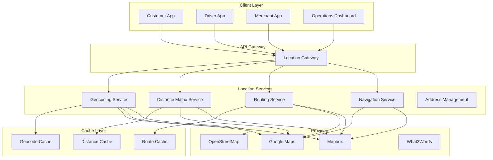

# Software Requirements Specification (SRS)

## Part 04F: Geocoding & Maps Integration

**Module:** Dispatch & Logistics Module (Part 05)
**Version:** 1.0.0
**Status:** Final / For Review
**Date:** 2026-06-30

---

## Chapter 1 – Overview

### Purpose

The Geocoding & Maps Integration module defines the comprehensive location-based services that power the **[Platform Name]** platform's mapping, routing, geocoding, and location intelligence capabilities. This encompasses address validation, geocoding (forward and reverse), distance matrix calculations, routing, navigation, map visualization, and location-based search.

Location services are the foundation of the platform's logistics operations. Every delivery depends on accurate addresses, optimal routes, and reliable navigation. The quality of location services directly impacts delivery times, driver efficiency, customer satisfaction, and operational costs. This module ensures the platform leverages best-in-class mapping providers while maintaining resilience, cost efficiency, and data sovereignty.

### Objectives

- Provide accurate, reliable geocoding and address validation
- Enable efficient routing and distance calculations
- Support real-time navigation with turn-by-turn directions
- Deliver interactive map visualization for all stakeholders
- Ensure high availability with provider failover
- Optimize cost through intelligent caching and batching
- Support offline capabilities for intermittent connectivity
- Ensure data privacy and compliance with location data regulations

---

## Chapter 2 – Architecture Overview

### DSP-109 Maps Architecture

### DSP-110 Core Services

| Service | Description | Priority |
| :--- | :--- | :--- |
| **Geocoding Service** | Convert addresses to coordinates and vice versa. | **Required** |
| **Address Validation Service** | Validate and standardize addresses. | **Required** |
| **Distance Matrix Service** | Calculate distances and durations between points. | **Required** |
| **Routing Service** | Calculate optimal routes with turn-by-turn directions. | **Required** |
| **Navigation Service** | Real-time turn-by-turn navigation. | **Required** |
| **Map Rendering Service** | Render interactive maps with custom styling. | **Required** |
| **Location Search Service** | Search for locations and points of interest. | **Required** |
| **Geofencing Service** | Geofence creation and event detection. | **Required** |
| **Location Intelligence** | Analytical location insights. | **Required** |

---

## Chapter 3 – Provider Management

### DSP-111 Supported Providers

| Provider | Primary Use | Priority |
| :--- | :--- | :--- |
| **Google Maps** | Primary provider (geocoding, routing, maps). | **Required** |
| **Mapbox** | Secondary provider (maps, routing, geocoding). | **Required** |
| **OpenStreetMap** | Free/open provider (fallback, offline). | **Required** |
| **What3Words** | Precise location addressing (optional). | **Optional** |

### DSP-112 Provider Selection Strategy

| Priority | Provider | Use Case |
| :--- | :--- | :--- |
| **1** | Google Maps | Primary for all services (accuracy, features). |
| **2** | Mapbox | Fallback when Google is unavailable. |
| **3** | OpenStreetMap | Offline, cost-sensitive, or fallback. |
| **4** | Local Providers | Regional provider (e.g., Yandex, Baidu). |

### DSP-113 Provider Failover Strategy

| Level | Strategy | Description |
| :--- | :--- | :--- |
| **Level 1** | Primary Provider | Try Google Maps first. |
| **Level 2** | Secondary Provider | Failover to Mapbox. |
| **Level 3** | Tertiary Provider | Failover to OpenStreetMap. |
| **Level 4** | Local Cache | Use cached results. |
| **Level 5** | Service Degradation | Return partial results or error. |

### DSP-114 Provider Health Monitoring

| Metric | Description | Threshold |
| :--- | :--- | :--- |
| **Availability** | Provider uptime. | > 99.9% |
| **Latency** | Response time. | < 500ms (p95) |
| **Error Rate** | % of failed requests. | < 2% |
| **Accuracy** | Geocoding accuracy. | > 95% |
| **Cost** | Cost per request. | Monitor |

---

## Chapter 4 – Geocoding

### DSP-115 Geocoding Types

| Type | Description | Priority |
| :--- | :--- | :--- |
| **Forward Geocoding** | Address → Coordinates. | **Required** |
| **Reverse Geocoding** | Coordinates → Address. | **Required** |
| **Batch Geocoding** | Multiple addresses in one request. | **Required** |
| **Autocomplete** | Real-time address suggestions. | **Required** |
| **Address Validation** | Validate and standardize addresses. | **Required** |
| **Address Normalization** | Standardize address format. | **Required** |

### DSP-116 Geocoding Specifications

| Parameter | Specification | Priority |
| :--- | :--- | :--- |
| **Accuracy** | Within 10m of true location. | **Required** |
| **Latency** | < 200ms (p95) for single geocode. | **Required** |
| **Batch Size** | Up to 100 addresses per batch. | **Required** |
| **Language** | Support for multiple languages. | **Required** |
| **Coverage** | Global coverage. | **Required** |
| **Format** | Structured address components. | **Required** |

### DSP-117 Geocode Data Model

| Attribute | Type | Description |
| :--- | :--- | :--- |
| `latitude` | Decimal | Latitude coordinate. |
| `longitude` | Decimal | Longitude coordinate. |
| `formatted_address` | String | Full formatted address. |
| `street_number` | String | Street/house number. |
| `street_name` | String | Street name. |
| `city` | String | City name. |
| `state` | String | State/province. |
| `postal_code` | String | ZIP/postal code. |
| `country` | String | Country name. |
| `country_code` | String | ISO country code. |
| `place_id` | String | Provider's place ID. |
| `precision` | String | ROOFTOP/RANGE/INTERPOLATED/GEOMETRIC_CENTER/APPROXIMATE |
| `plus_code` | String | Open Location Code. |
| `what3words` | String | What3Words address. |

### DSP-118 Address Validation Rules

| Rule | Description |
| :--- | :--- |
| **Required Fields** | Street, city, country must be present. |
| **Postal Code** | Postal code must be valid for country. |
| **Geocoding** | Address must resolve to coordinates. |
| **Uniqueness** | Address must be unique within the platform. |
| **Format** | Address must be in standard format. |
| **Delivery Zone** | Address must be within delivery zone. |

---

## Chapter 5 – Distance Matrix

### DSP-119 Distance Matrix Features

| Feature | Description | Priority |
| :--- | :--- | :--- |
| **Distance Calculation** | Distance between points (km/miles). | **Required** |
| **Duration Calculation** | Time between points (minutes). | **Required** |
| **Matrix Calculation** | Multiple origins × multiple destinations. | **Required** |
| **Traffic-Aware** | Real-time traffic integration. | **Required** |
| **Mode-Specific** | Driving/walking/bicycling/transit. | **Required** |
| **Avoid Options** | Avoid tolls, highways, ferries. | **Required** |
| **Departure Time** | Specify departure time (future). | **Medium** |
| **Arrival Time** | Specify arrival time (future). | **Medium** |

### DSP-120 Distance Matrix Specifications

| Parameter | Specification | Priority |
| :--- | :--- | :--- |
| **Max Origins** | 25 per request. | **Required** |
| **Max Destinations** | 25 per request. | **Required** |
| **Max Pairs** | 625 per request. | **Required** |
| **Latency** | < 500ms (p95) for 10x10 matrix. | **Required** |
| **Accuracy** | Distance accuracy: within 5%. | **Required** |
| **Cache** | Cache results for 24 hours (static). | **Required** |

### DSP-121 Distance Matrix Data Model

| Attribute | Type | Description |
| :--- | :--- | :--- |
| `origin_latitude` | Decimal | Origin latitude. |
| `origin_longitude` | Decimal | Origin longitude. |
| `destination_latitude` | Decimal | Destination latitude. |
| `destination_longitude` | Decimal | Destination longitude. |
| `distance_meters` | Integer | Distance in meters. |
| `distance_km` | Decimal | Distance in kilometers. |
| `duration_seconds` | Integer | Duration in seconds. |
| `duration_minutes` | Integer | Duration in minutes. |
| `traffic_condition` | String | NORMAL/MODERATE/HEAVY |
| `duration_in_traffic` | Integer | Duration with traffic (seconds). |
| `mode` | String | DRIVING/WALKING/BICYCLING/TRANSIT |
| `calculation_time` | Timestamp | When calculated. |
| `provider` | String | Provider used. |

---

## Chapter 6 – Routing & Navigation

### DSP-122 Routing Features

| Feature | Description | Priority |
| :--- | :--- | :--- |
| **Point-to-Point Routing** | Route between two points. | **Required** |
| **Multi-Waypoint Routing** | Route with multiple stops. | **Required** |
| **Route Optimization** | Optimize stop order (TSP). | **Required** |
| **Turn-by-Turn Directions** | Step-by-step navigation. | **Required** |
| **Voice Guidance** | Voice instructions. | **Required** |
| **Traffic Integration** | Real-time traffic. | **Required** |
| **Alternative Routes** | Multiple route options. | **Required** |
| **Avoid Options** | Avoid tolls, highways, ferries. | **Required** |
| **Waypoint Types** | Pickup/Delivery/Stopover. | **Required** |

### DSP-123 Navigation Features

| Feature | Description | Priority |
| :--- | :--- | :--- |
| **Real-Time Navigation** | Live turn-by-turn guidance. | **Required** |
| **Route Recalculation** | Re-route on deviation. | **Required** |
| **ETA Updates** | Dynamic ETA with traffic. | **Required** |
| **Speed Limits** | Speed limit display. | **Required** |
| **Lane Guidance** | Lane-level instructions. | **Required** |
| **Offline Maps** | Navigation without data. | **Required** |
| **Voice Control** | Voice-activated commands. | **Medium** |
| **Head-Up Display** | HUD mode. | **Low** |

### DSP-124 Route Data Model

| Attribute | Type | Description |
| :--- | :--- | :--- |
| `route_id` | UUID | Unique identifier. |
| `origin` | JSONB | Origin coordinates. |
| `destination` | JSONB | Destination coordinates. |
| `waypoints` | JSONB | Waypoint coordinates. |
| `polyline` | TEXT | Encoded route polyline. |
| `distance_meters` | Integer | Total distance. |
| `duration_seconds` | Integer | Total duration. |
| `steps` | JSONB | Turn-by-turn steps. |
| `traffic_data` | JSONB | Traffic conditions. |
| `bounds` | JSONB | Route bounding box. |
| `options` | JSONB | Route options used. |
| `provider` | String | Provider used. |
| `calculated_at` | Timestamp | Calculation timestamp. |

---

## Chapter 7 – Map Visualization

### DSP-125 Map Features

| Feature | Description | Priority |
| :--- | :--- | :--- |
| **Interactive Map** | Pan, zoom, rotate. | **Required** |
| **Custom Styling** | Branded map styles. | **Required** |
| **Markers** | Custom markers with labels. | **Required** |
| **Clustering** | Marker clustering for density. | **Required** |
| **Heatmaps** | Heatmap visualization. | **Required** |
| **Route Overlay** | Route polyline with progress. | **Required** |
| **Geofence Overlay** | Geofence boundaries. | **Required** |
| **Traffic Layer** | Real-time traffic overlay. | **Required** |
| **Satellite View** | Satellite imagery. | **Required** |
| **Street View** | Street-level view. | **Medium** |
| **3D View** | 3D terrain/buildings. | **Low** |

### DSP-126 Map Customization

| Customization | Options | Priority |
| :--- | :--- | :--- |
| **Color Scheme** | Brand colors. | **Required** |
| **Marker Icons** | Custom SVG/PNG markers. | **Required** |
| **Map Labels** | Hide/show labels. | **Required** |
| **POI Display** | Points of interest display. | **Required** |
| **Dark Mode** | Dark theme for night. | **Required** |
| **Language** | Map language localization. | **Required** |

### DSP-127 Map Data Model

| Attribute | Type | Description |
| :--- | :--- | :--- |
| `map_id` | UUID | Unique identifier. |
| `latitude` | Decimal | Map center latitude. |
| `longitude` | Decimal | Map center longitude. |
| `zoom_level` | Integer | Zoom level (1-20). |
| `bearing` | Integer | Bearing in degrees. |
| `pitch` | Integer | Pitch in degrees. |
| `style` | String | Map style identifier. |
| `markers` | JSONB | Marker data. |
| `polylines` | JSONB | Polyline data. |
| `polygons` | JSONB | Polygon data. |
| `heatmap` | JSONB | Heatmap data. |

---

## Chapter 8 – Caching Strategy

### DSP-128 Caching Policies

| Data Type | Cache Duration | Invalidation Strategy |
| :--- | :--- | :--- |
| **Geocode Results** | 30 days (static addresses). | Invalidate on address update. |
| **Distance Matrix** | 24 hours (static). | Invalidate on traffic update. |
| **Routes** | 6 hours (dynamic). | Invalidate on traffic/weather. |
| **Map Tiles** | 30 days (static tiles). | Version-based invalidation. |
| **Reverse Geocode** | 30 days (static coordinates). | Invalidate on address update. |
| **Autocomplete** | 1 hour (dynamic). | Frequent invalidation. |

### DSP-129 Cache Implementation

| Component | Technology | Justification |
| :--- | :--- | :--- |
| **Geocode Cache** | Redis | Low-latency, key-value store. |
| **Distance Cache** | Redis | Fast access for frequent pairs. |
| **Route Cache** | Redis + PostgreSQL | Route metadata in Redis, full details in PG. |
| **Map Tile Cache** | CDN | Edge caching for global delivery. |
| **Autocomplete Cache** | Redis + Elasticsearch | Fast suggestions with search. |

---

## Chapter 9 – Cost Optimization

### DSP-130 Cost Management Strategies

| Strategy | Description | Priority |
| :--- | :--- | :--- |
| **Intelligent Caching** | Cache frequent/static results. | **Required** |
| **Request Batching** | Batch geocode and distance requests. | **Required** |
| **Rate Limiting** | Enforce provider rate limits. | **Required** |
| **Provider Selection** | Use cheapest available provider. | **Required** |
| **Aggressive Caching** | Cache as much as possible. | **Required** |
| **Result Throttling** | Reduce precision when possible. | **Medium** |
| **Webhook Batching** | Batch notifications. | **Medium** |

### DSP-131 Cost Monitoring

| Metric | Description | Threshold |
| :--- | :--- | :--- |
| **Geocode Cost** | Cost per geocode. | Monitor |
| **Distance Matrix Cost** | Cost per matrix. | Monitor |
| **Route Cost** | Cost per route. | Monitor |
| **Map Load Cost** | Cost per map load. | Monitor |
| **Total Maps Cost** | Total provider cost. | Budget |

---

## Chapter 10 – Offline Capabilities

### DSP-132 Offline Features

| Feature | Description | Priority |
| :--- | :--- | :--- |
| **Offline Maps** | Cached map tiles for navigation. | **Required** |
| **Offline Geocoding** | Cached geocode results. | **Required** |
| **Offline Routing** | Basic routing without internet. | **Required** |
| **Location Caching** | Cache driver locations. | **Required** |
| **Sync on Connect** | Sync cached data when online. | **Required** |

### DSP-133 Offline Data Management

| Data Type | Storage | Size Limit |
| :--- | :--- | :--- |
| **Map Tiles** | Local storage | 500 MB |
| **Geocode Results** | Local database | 10,000 entries |
| **Routes** | Local database | 100 routes |
| **Driver Locations** | Local database | 1,000 locations |

---

## Chapter 11 – Database Tables

### geocode_cache

| Column | Type | Constraints | Description |
| :--- | :--- | :--- | :--- |
| `cache_id` | UUID | PRIMARY KEY | Unique identifier |
| `address_hash` | VARCHAR(64) | UNIQUE | SHA-256 hash of address |
| `formatted_address` | TEXT | | Full formatted address |
| `latitude` | DECIMAL(10, 8) | | Geocode latitude |
| `longitude` | DECIMAL(11, 8) | | Geocode longitude |
| `place_id` | VARCHAR(255) | | Provider place ID |
| `address_components` | JSONB | | Structured address components |
| `precision` | VARCHAR(20) | | Geocode precision |
| `provider` | VARCHAR(50) | | Provider used |
| `last_used` | TIMESTAMP | | Last access timestamp |
| `hit_count` | INTEGER | DEFAULT 0 | Cache hit count |
| `expires_at` | TIMESTAMP | | Cache expiration timestamp |
| `created_at` | TIMESTAMP | DEFAULT NOW() | Creation timestamp |
| `updated_at` | TIMESTAMP | DEFAULT NOW() | Last update timestamp |

### distance_cache

| Column | Type | Constraints | Description |
| :--- | :--- | :--- | :--- |
| `cache_id` | UUID | PRIMARY KEY | Unique identifier |
| `origin_latitude` | DECIMAL(10, 8) | NOT NULL | Origin latitude |
| `origin_longitude` | DECIMAL(11, 8) | NOT NULL | Origin longitude |
| `destination_latitude` | DECIMAL(10, 8) | NOT NULL | Destination latitude |
| `destination_longitude` | DECIMAL(11, 8) | NOT NULL | Destination longitude |
| `distance_meters` | INTEGER | | Distance in meters |
| `distance_km` | DECIMAL(10, 2) | | Distance in kilometers |
| `duration_seconds` | INTEGER | | Duration in seconds |
| `duration_minutes` | INTEGER | | Duration in minutes |
| `traffic_condition` | VARCHAR(20) | | Traffic condition |
| `duration_in_traffic` | INTEGER | | Duration with traffic |
| `mode` | VARCHAR(20) | | Transport mode |
| `provider` | VARCHAR(50) | | Provider used |
| `expires_at` | TIMESTAMP | | Cache expiration timestamp |
| `created_at` | TIMESTAMP | DEFAULT NOW() | Creation timestamp |
| `updated_at` | TIMESTAMP | DEFAULT NOW() | Last update timestamp |

### route_cache

| Column | Type | Constraints | Description |
| :--- | :--- | :--- | :--- |
| `cache_id` | UUID | PRIMARY KEY | Unique identifier |
| `route_hash` | VARCHAR(64) | UNIQUE | SHA-256 hash of route |
| `origin` | JSONB | NOT NULL | Origin coordinates |
| `destination` | JSONB | NOT NULL | Destination coordinates |
| `waypoints` | JSONB | | Waypoint coordinates |
| `polyline` | TEXT | | Encoded route polyline |
| `distance_meters` | INTEGER | | Total distance |
| `duration_seconds` | INTEGER | | Total duration |
| `steps` | JSONB | | Turn-by-turn steps |
| `traffic_data` | JSONB | | Traffic conditions |
| `bounds` | JSONB | | Route bounding box |
| `options` | JSONB | | Route options used |
| `provider` | VARCHAR(50) | | Provider used |
| `expires_at` | TIMESTAMP | | Cache expiration timestamp |
| `created_at` | TIMESTAMP | DEFAULT NOW() | Creation timestamp |
| `updated_at` | TIMESTAMP | DEFAULT NOW() | Last update timestamp |

### address_validation

| Column | Type | Constraints | Description |
| :--- | :--- | :--- | :--- |
| `validation_id` | UUID | PRIMARY KEY | Unique identifier |
| `input_address` | TEXT | NOT NULL | Original input address |
| `formatted_address` | TEXT | | Validated formatted address |
| `latitude` | DECIMAL(10, 8) | | Geocode latitude |
| `longitude` | DECIMAL(11, 8) | | Geocode longitude |
| `is_valid` | BOOLEAN | | Validation result |
| `validation_errors` | JSONB | | Validation errors |
| `address_components` | JSONB | | Structured address components |
| `provider` | VARCHAR(50) | | Provider used |
| `created_at` | TIMESTAMP | DEFAULT NOW() | Creation timestamp |

### provider_metrics

| Column | Type | Constraints | Description |
| :--- | :--- | :--- | :--- |
| `metric_id` | UUID | PRIMARY KEY | Unique identifier |
| `provider` | VARCHAR(50) | NOT NULL | Provider name |
| `service` | VARCHAR(50) | NOT NULL | Service type |
| `metric_date` | DATE | NOT NULL | Date of metrics |
| `total_requests` | INTEGER | DEFAULT 0 | Total requests |
| `successful_requests` | INTEGER | DEFAULT 0 | Successful requests |
| `failed_requests` | INTEGER | DEFAULT 0 | Failed requests |
| `avg_latency` | INTEGER | | Average latency (ms) |
| `p95_latency` | INTEGER | | P95 latency (ms) |
| `total_cost` | DECIMAL(10, 2) | | Total cost |
| `error_codes` | JSONB | | Error code distribution |
| `created_at` | TIMESTAMP | DEFAULT NOW() | Creation timestamp |
| `updated_at` | TIMESTAMP | DEFAULT NOW() | Last update timestamp |

---

## Chapter 12 – REST APIs

### Geocoding APIs

| Method | Endpoint | Description |
| :--- | :--- | :--- |
| `POST` | `/api/v1/geocode/forward` | Forward geocoding (address → coordinates) |
| `POST` | `/api/v1/geocode/reverse` | Reverse geocoding (coordinates → address) |
| `POST` | `/api/v1/geocode/batch` | Batch geocoding |
| `POST` | `/api/v1/geocode/validate` | Validate and standardize address |
| `GET` | `/api/v1/geocode/autocomplete` | Address autocomplete suggestions |

### Distance Matrix APIs

| Method | Endpoint | Description |
| :--- | :--- | :--- |
| `POST` | `/api/v1/distance/matrix` | Calculate distance matrix |
| `POST` | `/api/v1/distance/single` | Calculate single distance |
| `GET` | `/api/v1/distance/batch` | Batch distance calculations |

### Routing APIs

| Method | Endpoint | Description |
| :--- | :--- | :--- |
| `POST` | `/api/v1/routing/route` | Calculate route |
| `POST` | `/api/v1/routing/optimize` | Optimize multi-stop route |
| `GET` | `/api/v1/routing/route/{id}` | Get cached route |

### Navigation APIs

| Method | Endpoint | Description |
| :--- | :--- | :--- |
| `GET` | `/api/v1/navigation/directions` | Get turn-by-turn directions |
| `GET` | `/api/v1/navigation/eta` | Get dynamic ETA |

### Map APIs

| Method | Endpoint | Description |
| :--- | :--- | :--- |
| `GET` | `/api/v1/maps/tiles/{z}/{x}/{y}` | Get map tile |
| `GET` | `/api/v1/maps/style` | Get map style configuration |
| `POST` | `/api/v1/maps/markers` | Get marker data |

---

## Chapter 13 – WebSocket/SSE Events

### DSP-134 Location Events

| Event | Payload | Description |
| :--- | :--- | :--- |
| `location.updated` | `{ driver_id, latitude, longitude, timestamp }` | Driver location updated |
| `location.geocode` | `{ address, latitude, longitude, timestamp }` | Address geocoded |
| `location.reverse` | `{ latitude, longitude, address, timestamp }` | Coordinates reverse-geocoded |

---

## Chapter 14 – Business Rules

| Rule ID | Rule Description | Priority |
| :--- | :--- | :--- |
| **BR-MAP-001** | Geocode cache duration: 30 days for static addresses. | **High** |
| **BR-MAP-002** | Distance cache duration: 24 hours for static pairs. | **High** |
| **BR-MAP-003** | Route cache duration: 6 hours for dynamic routes. | **High** |
| **BR-MAP-004** | Geocode accuracy must be within 10m for delivery. | **High** |
| **BR-MAP-005** | Address validation must be performed before order placement. | **High** |
| **BR-MAP-006** | Distance matrix max size: 25x25 (625 pairs) per request. | **High** |
| **BR-MAP-007** | Provider failover must occur within 5 seconds. | **High** |
| **BR-MAP-008** | Offline maps must be available for navigation. | **High** |
| **BR-MAP-009** | Location data must be encrypted in transit and at rest. | **High** |
| **BR-MAP-010** | Map tile caching must use CDN for global delivery. | **High** |

---

## Chapter 15 – Acceptance Tests

| Test ID | Test Description | Priority |
| :--- | :--- | :--- |
| **TEST-MAP-001** | Address geocoded to correct coordinates. | **High** |
| **TEST-MAP-002** | Coordinates reverse-geocoded to correct address. | **High** |
| **TEST-MAP-003** | Batch geocoding processes multiple addresses correctly. | **High** |
| **TEST-MAP-004** | Address validation identifies invalid addresses. | **High** |
| **TEST-MAP-005** | Distance matrix calculates distances correctly. | **High** |
| **TEST-MAP-006** | Distance matrix calculates durations correctly. | **High** |
| **TEST-MAP-007** | Route between two points calculated correctly. | **High** |
| **TEST-MAP-008** | Multi-waypoint route optimized correctly. | **High** |
| **TEST-MAP-009** | Turn-by-turn directions generated correctly. | **High** |
| **TEST-MAP-010** | Geocode cache returns cached results within 5ms. | **High** |
| **TEST-MAP-011** | Distance cache returns cached results within 5ms. | **High** |
| **TEST-MAP-012** | Provider failover works when primary is down. | **High** |
| **TEST-MAP-013** | Offline geocoding works without internet. | **High** |
| **TEST-MAP-014** | Offline navigation works without internet. | **High** |
| **TEST-MAP-015** | Map tile cache serves tiles from CDN. | **High** |
| **TEST-MAP-016** | Map custom styling displays correctly. | **High** |
| **TEST-MAP-017** | Address autocomplete suggestions are accurate. | **High** |
| **TEST-MAP-018** | Geocode accuracy within 10m. | **High** |
| **TEST-MAP-019** | Provider latency within SLA (< 500ms). | **High** |
| **TEST-MAP-020** | Address validation detects missing required fields. | **High** |
| **TEST-MAP-021** | Geocode cost tracking is accurate. | **Medium** |
| **TEST-MAP-022** | Map heatmap displays correctly. | **Medium** |
| **TEST-MAP-023** | What3Words integration works (if enabled). | **Medium** |

---

## Chapter 16 – Traceability Matrix

| Requirement | Database Table | API Endpoint(s) | Acceptance Test |
| :--- | :--- | :--- | :--- |
| DSP-115 | geocode_cache | POST /api/v1/geocode/forward | TEST-MAP-001, TEST-MAP-002 |
| DSP-115 | geocode_cache | POST /api/v1/geocode/batch | TEST-MAP-003 |
| DSP-118 | address_validation | POST /api/v1/geocode/validate | TEST-MAP-004, TEST-MAP-020 |
| DSP-119 | distance_cache | POST /api/v1/distance/matrix | TEST-MAP-005, TEST-MAP-006 |
| DSP-122 | route_cache | POST /api/v1/routing/route | TEST-MAP-007, TEST-MAP-008 |
| DSP-122 | route_cache | GET /api/v1/navigation/directions | TEST-MAP-009 |
| DSP-128 | geocode_cache | POST /api/v1/geocode/forward | TEST-MAP-010, TEST-MAP-011 |
| DSP-113 | provider_metrics | Internal | TEST-MAP-012 |
| DSP-132 | geocode_cache | Internal | TEST-MAP-013, TEST-MAP-014 |
| DSP-125 | map_configuration | GET /api/v1/maps/style | TEST-MAP-016 |
| DSP-115 | geocode_cache | GET /api/v1/geocode/autocomplete | TEST-MAP-017 |

---

## Chapter 17 – Summary

This document establishes the complete geocoding and maps integration capability for the **[Platform Name]** platform. Key takeaways:

- **Multi-Provider Architecture:** Google Maps (primary), Mapbox (secondary), OpenStreetMap (fallback) with automatic failover.
- **Comprehensive Geocoding:** Forward geocoding, reverse geocoding, batch geocoding, address validation, and autocomplete.
- **Distance Matrix:** Efficient calculation of distances and durations with traffic awareness and caching.
- **Routing & Navigation:** Optimal route calculation, multi-waypoint routing, turn-by-turn directions, and real-time navigation.
- **Map Visualization:** Interactive maps with custom styling, markers, clustering, heatmaps, and overlays.
- **Intelligent Caching:** Multi-layer caching (Redis, CDN) with configurable expiration policies for performance and cost optimization.
- **Offline Capabilities:** Offline maps, geocoding, and routing for intermittent connectivity.
- **Cost Optimization:** Request batching, intelligent provider selection, and aggressive caching to minimize costs.
- **Global Coverage:** Support for worldwide geocoding and routing with multiple languages.

The geocoding and maps integration module is the location intelligence backbone of the platform. Accurate, reliable, and cost-effective location services are essential for efficient logistics, driver navigation, and customer tracking.

---

**Next Document:**

`06_Order_Fulfillment_Module/Part_05A_Order_Lifecycle_Management.md`

*(This transitions from the dispatch module to the order fulfillment module, starting with the complete order lifecycle management.)*