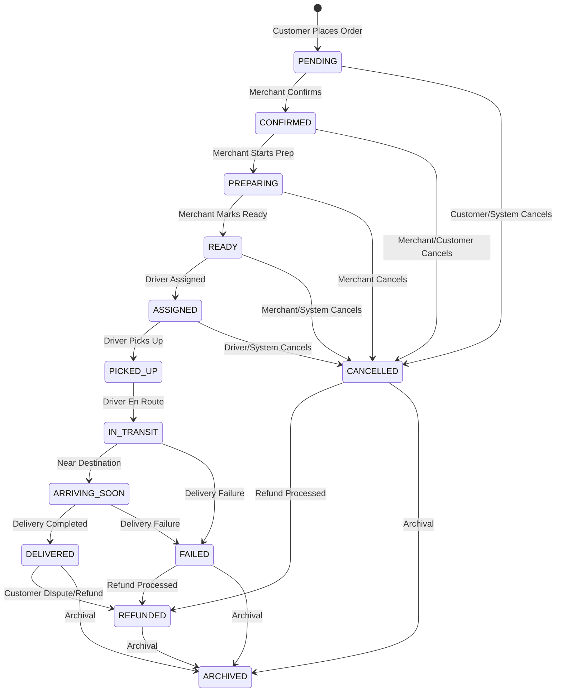

# Software Requirements Specification (SRS)

## Part 05A: Order Lifecycle Management

**Module:** Order Fulfillment Module (Part 06)
**Version:** 1.0.0
**Status:** Final / For Review
**Date:** 2026-06-30

---

## Chapter 1 – Overview

### Purpose

The Order Lifecycle Management module defines the complete state machine, transitions, and business rules governing an order's journey from creation through fulfillment to delivery and archival. This is the foundational module for the entire order fulfillment subsystem.

Every order in the platform follows a defined lifecycle. Clear, consistent, and well-documented lifecycle management ensures operational reliability, predictable customer experiences, and efficient exception handling. This module establishes the single source of truth for order status, transitions, and permissible actions at each stage.

### Objectives

- Define a comprehensive order state machine
- Establish clear transition rules and validations
- Enable real-time status updates and visibility
- Support exception handling and recovery
- Provide auditable order history
- Enable operational monitoring and analytics
- Support integration with all downstream systems
- Ensure data consistency across the platform

---

## Chapter 2 – Order State Machine

### FUL-001 Order Statuses

| Status | Description | Category | Priority |
| :--- | :--- | :--- | :--- |
| `PENDING` | Order received, awaiting merchant confirmation. | Pre-Fulfillment | **Required** |
| `CONFIRMED` | Merchant accepted the order. | Pre-Fulfillment | **Required** |
| `PREPARING` | Merchant is preparing the order. | Fulfillment | **Required** |
| `READY` | Order is ready for pickup by driver. | Fulfillment | **Required** |
| `ASSIGNED` | Driver assigned to pick up the order. | Fulfillment | **Required** |
| `PICKED_UP` | Driver has picked up the order. | Delivery | **Required** |
| `IN_TRANSIT` | Driver is en route to customer. | Delivery | **Required** |
| `ARRIVING_SOON` | Driver is within 2 minutes of delivery. | Delivery | **Required** |
| `DELIVERED` | Order successfully delivered. | Complete | **Required** |
| `CANCELLED` | Order cancelled (customer/merchant/platform). | Terminal | **Required** |
| `FAILED` | Delivery failed (driver couldn't complete). | Terminal | **Required** |
| `REFUNDED` | Order refunded (full/partial). | Terminal | **Required** |
| `ARCHIVED` | Order archived for long-term storage. | Terminal | **Required** |

### FUL-002 Status Categories

| Category | Description | Statuses |
| :--- | :--- | :--- |
| **Pre-Fulfillment** | Order placed but not yet being prepared. | PENDING, CONFIRMED |
| **Fulfillment** | Order is being prepared and assigned. | PREPARING, READY, ASSIGNED |
| **Delivery** | Order is in transit to customer. | PICKED_UP, IN_TRANSIT, ARRIVING_SOON |
| **Complete** | Order successfully fulfilled. | DELIVERED |
| **Terminal** | Order reached final state (successful or not). | DELIVERED, CANCELLED, FAILED, REFUNDED, ARCHIVED |
| **Exception** | Order requires intervention. | CANCELLED, FAILED |

### FUL-003 State Machine Diagram

---

## Chapter 3 – Status Transitions

### FUL-004 Permitted Transitions

| From Status | To Status | Trigger | Initiator | Priority |
| :--- | :--- | :--- | :--- | :--- |
| PENDING | CONFIRMED | Merchant confirms order | Merchant/System | **Required** |
| PENDING | CANCELLED | Order cancelled | Customer/System | **Required** |
| CONFIRMED | PREPARING | Merchant starts preparation | Merchant | **Required** |
| CONFIRMED | CANCELLED | Order cancelled | Merchant/Customer | **Required** |
| PREPARING | READY | Merchant marks ready | Merchant | **Required** |
| PREPARING | CANCELLED | Order cancelled | Merchant | **Required** |
| READY | ASSIGNED | Driver assigned | System | **Required** |
| READY | CANCELLED | Order cancelled | Merchant/System | **Required** |
| ASSIGNED | PICKED_UP | Driver picks up | Driver | **Required** |
| ASSIGNED | CANCELLED | Assignment cancelled | Driver/System | **Required** |
| PICKED_UP | IN_TRANSIT | Driver en route | Driver/System | **Required** |
| IN_TRANSIT | ARRIVING_SOON | Driver near destination | System | **Required** |
| IN_TRANSIT | FAILED | Delivery failure | Driver/System | **Required** |
| ARRIVING_SOON | DELIVERED | Delivery completed | Driver | **Required** |
| ARRIVING_SOON | FAILED | Delivery failure | Driver/System | **Required** |
| CANCELLED | REFUNDED | Refund processed | System | **Required** |
| FAILED | REFUNDED | Refund processed | System | **Required** |
| DELIVERED | REFUNDED | Dispute/refund processed | System | **Required** |
| REFUNDED | ARCHIVED | Order archived | System | **Required** |
| DELIVERED | ARCHIVED | Order archived | System | **Required** |
| CANCELLED | ARCHIVED | Order archived | System | **Required** |
| FAILED | ARCHIVED | Order archived | System | **Required** |

### FUL-005 Transition Validation Rules

| Rule | Description |
| :--- | :--- |
| **Initiator Authorization** | Only authorized users can trigger transitions. |
| **Business Rules** | All business rules must be satisfied. |
| **Data Integrity** | All required data must be present. |
| **Idempotency** | Duplicate transition requests must be idempotent. |
| **Audit Trail** | All transitions must be logged. |
| **Notifications** | Relevant parties must be notified. |

### FUL-006 Transition Data Model

| Attribute | Type | Description |
| :--- | :--- | :--- |
| `transition_id` | UUID | Unique identifier |
| `order_id` | UUID | Associated order |
| `from_status` | String | Previous status |
| `to_status` | String | New status |
| `initiator_type` | String | CUSTOMER/MERCHANT/DRIVER/SYSTEM/ADMIN |
| `initiator_id` | UUID | User/system identifier |
| `reason` | String | Reason for transition |
| `metadata` | JSONB | Additional context |
| `created_at` | Timestamp | Transition timestamp |

---

## Chapter 4 – Order Timeline

### FUL-007 Timeline Events

| Event | Status | Description | Priority |
| :--- | :--- | :--- | :--- |
| `order_placed` | PENDING | Customer placed order. | **Required** |
| `order_confirmed` | CONFIRMED | Merchant confirmed order. | **Required** |
| `preparation_started` | PREPARING | Merchant started preparation. | **Required** |
| `order_ready` | READY | Merchant marked order ready. | **Required** |
| `driver_assigned` | ASSIGNED | Driver assigned to order. | **Required** |
| `order_picked_up` | PICKED_UP | Driver picked up order. | **Required** |
| `in_transit` | IN_TRANSIT | Driver en route to customer. | **Required** |
| `arriving_soon` | ARRIVING_SOON | Driver near destination. | **Required** |
| `order_delivered` | DELIVERED | Order delivered to customer. | **Required** |
| `order_cancelled` | CANCELLED | Order cancelled. | **Required** |
| `delivery_failed` | FAILED | Delivery failed. | **Required** |
| `refund_processed` | REFUNDED | Refund processed. | **Required** |

### FUL-008 Timeline Display

| Feature | Description | Priority |
| :--- | :--- | :--- |
| **Chronological Order** | Events displayed oldest to newest. | **Required** |
| **Status Indicators** | Status with icons and colors. | **Required** |
| **Timestamps** | Precise timestamps for each event. | **Required** |
| **Descriptions** | Human-readable event descriptions. | **Required** |
| **Source Information** | Who/What triggered the event. | **Required** |
| **Elapsed Time** | Time since previous event. | **Required** |
| **Filtering** | Filter by event type. | **Medium** |

### FUL-009 Timeline Data Model

| Attribute | Type | Description |
| :--- | :--- | :--- |
| `timeline_id` | UUID | Unique identifier |
| `order_id` | UUID | Associated order |
| `event_type` | String | Type of event |
| `status` | String | Order status at event |
| `description` | String | Human-readable description |
| `source_type` | String | CUSTOMER/MERCHANT/DRIVER/SYSTEM/ADMIN |
| `source_id` | UUID | Source identifier |
| `location` | JSONB | Location at event (if applicable) |
| `metadata` | JSONB | Additional event data |
| `created_at` | Timestamp | Event timestamp |

---

## Chapter 5 – Business Rules

### FUL-010 Lifecycle Business Rules

| Rule ID | Rule Description | Priority |
| :--- | :--- | :--- |
| **BR-LIFE-001** | Orders cannot transition to a previous status (no backward movement). | **High** |
| **BR-LIFE-002** | Cancellation before confirmation is auto-approved (customer). | **High** |
| **BR-LIFE-003** | Cancellation after confirmation requires merchant approval. | **High** |
| **BR-LIFE-004** | Order cannot be marked ready without being confirmed and prepared. | **High** |
| **BR-LIFE-005** | Pickup requires driver to be at merchant location (GPS verification). | **High** |
| **BR-LIFE-006** | Delivery requires driver to be at customer location (GPS verification). | **High** |
| **BR-LIFE-007** | All status transitions must be logged for audit. | **High** |
| **BR-LIFE-008** | Orders in terminal status cannot transition to any other status. | **High** |
| **BR-LIFE-009** | Archived orders cannot be modified or transitioned. | **High** |
| **BR-LIFE-010** | Refund can only be processed for orders in DELIVERED, CANCELLED, or FAILED status. | **High** |

---

## Chapter 6 – Order Archival

### FUL-011 Archival Policy

| Parameter | Specification | Priority |
| :--- | :--- | :--- |
| **Archival Trigger** | Order in terminal status for 90 days. | **Required** |
| **Data Retention** | Archived data retained for 7 years. | **Required** |
| **Access** | Archived orders accessible via API (read-only). | **Required** |
| **Search** | Archived orders searchable by ID and date. | **Required** |
| **Export** | Archived data export available. | **Required** |
| **Purge** | Data purged after 7 years (regulatory compliance). | **Required** |

### FUL-012 Archival Data Model

| Attribute | Type | Description |
| :--- | :--- | :--- |
| `archive_id` | UUID | Unique identifier |
| `order_id` | UUID | Original order ID |
| `order_snapshot` | JSONB | Full order snapshot |
| `timeline_snapshot` | JSONB | Full timeline snapshot |
| `status` | String | Final order status |
| `archived_at` | Timestamp | Archival timestamp |
| `archived_by` | String | System/Admin |
| `purge_at` | Timestamp | Scheduled purge timestamp |

---

## Chapter 7 – Database Tables

### orders

| Column | Type | Constraints | Description |
| :--- | :--- | :--- | :--- |
| `order_id` | UUID | PRIMARY KEY | Unique order identifier |
| `customer_id` | UUID | FOREIGN KEY (customers.customer_id) | Customer who placed the order |
| `merchant_id` | UUID | FOREIGN KEY (merchant_accounts.merchant_id) | Merchant fulfilling the order |
| `store_id` | UUID | FOREIGN KEY (merchant_stores.store_id) | Specific store location |
| `driver_id` | UUID | FOREIGN KEY (driver_accounts.driver_id) | Assigned driver |
| `order_reference` | VARCHAR(50) | UNIQUE | Human-readable order number |
| `status` | VARCHAR(20) | NOT NULL | Current order status |
| `order_data` | JSONB | NOT NULL | Full order snapshot |
| `subtotal` | DECIMAL(12, 2) | NOT NULL | Sum of item prices |
| `delivery_fee` | DECIMAL(12, 2) | DEFAULT 0 | Delivery charge |
| `service_fee` | DECIMAL(12, 2) | DEFAULT 0 | Platform service fee |
| `tax` | DECIMAL(12, 2) | DEFAULT 0 | Tax amount |
| `discount` | DECIMAL(12, 2) | DEFAULT 0 | Discount amount |
| `total` | DECIMAL(12, 2) | NOT NULL | Order total |
| `currency` | VARCHAR(3) | NOT NULL | ISO 4217 currency |
| `payment_method` | VARCHAR(50) | NOT NULL | Payment method used |
| `payment_status` | VARCHAR(20) | DEFAULT 'PENDING' | PENDING/AUTHORIZED/CAPTURED/REFUNDED/FAILED |
| `delivery_address` | JSONB | NOT NULL | Delivery address snapshot |
| `customer_notes` | TEXT | | Customer instructions |
| `internal_notes` | TEXT | | Internal merchant/ops notes |
| `preparation_time_estimate` | INTEGER | | Estimated prep time (minutes) |
| `preparation_time_actual` | INTEGER | | Actual prep time (minutes) |
| `delivery_time_estimate` | INTEGER | | Estimated delivery time (minutes) |
| `delivery_time_actual` | INTEGER | | Actual delivery time (minutes) |
| `is_scheduled` | BOOLEAN | DEFAULT FALSE | Scheduled order flag |
| `scheduled_time` | TIMESTAMP | | Requested delivery time |
| `idempotency_key` | VARCHAR(255) | UNIQUE | Deduplication key |
| `cancellation_reason` | VARCHAR(100) | | Reason for cancellation |
| `cancelled_by` | VARCHAR(20) | | CUSTOMER/MERCHANT/PLATFORM |
| `cancelled_at` | TIMESTAMP | | Cancellation timestamp |
| `confirmed_at` | TIMESTAMP | | Confirmation timestamp |
| `preparing_at` | TIMESTAMP | | Preparation start timestamp |
| `ready_at` | TIMESTAMP | | Ready timestamp |
| `assigned_at` | TIMESTAMP | | Driver assignment timestamp |
| `picked_up_at` | TIMESTAMP | | Pickup timestamp |
| `delivered_at` | TIMESTAMP | | Delivery timestamp |
| `is_archived` | BOOLEAN | DEFAULT FALSE | Archival flag |
| `archived_at` | TIMESTAMP | | Archival timestamp |
| `created_at` | TIMESTAMP | DEFAULT NOW() | Order creation timestamp |
| `updated_at` | TIMESTAMP | DEFAULT NOW() | Last update timestamp |

### order_transitions

| Column | Type | Constraints | Description |
| :--- | :--- | :--- | :--- |
| `transition_id` | UUID | PRIMARY KEY | Unique identifier |
| `order_id` | UUID | FOREIGN KEY (orders.order_id) | Associated order |
| `from_status` | VARCHAR(20) | NOT NULL | Previous status |
| `to_status` | VARCHAR(20) | NOT NULL | New status |
| `initiator_type` | VARCHAR(20) | NOT NULL | CUSTOMER/MERCHANT/DRIVER/SYSTEM/ADMIN |
| `initiator_id` | UUID | | Initiator identifier |
| `reason` | TEXT | | Reason for transition |
| `metadata` | JSONB | | Additional context |
| `created_at` | TIMESTAMP | DEFAULT NOW() | Transition timestamp |

### order_timeline

| Column | Type | Constraints | Description |
| :--- | :--- | :--- | :--- |
| `timeline_id` | UUID | PRIMARY KEY | Unique identifier |
| `order_id` | UUID | FOREIGN KEY (orders.order_id) | Associated order |
| `event_type` | VARCHAR(30) | NOT NULL | order_placed/order_confirmed/preparation_started/order_ready/driver_assigned/order_picked_up/in_transit/arriving_soon/order_delivered/order_cancelled/delivery_failed/refund_processed |
| `status` | VARCHAR(20) | NOT NULL | Order status at event |
| `description` | TEXT | NOT NULL | Human-readable description |
| `source_type` | VARCHAR(20) | | CUSTOMER/MERCHANT/DRIVER/SYSTEM/ADMIN |
| `source_id` | UUID | | Source identifier |
| `location` | JSONB | | Location at event |
| `metadata` | JSONB | | Additional event data |
| `created_at` | TIMESTAMP | DEFAULT NOW() | Event timestamp |

### order_archives

| Column | Type | Constraints | Description |
| :--- | :--- | :--- | :--- |
| `archive_id` | UUID | PRIMARY KEY | Unique identifier |
| `order_id` | UUID | UNIQUE | Original order ID |
| `order_snapshot` | JSONB | NOT NULL | Full order snapshot |
| `timeline_snapshot` | JSONB | NOT NULL | Full timeline snapshot |
| `transitions_snapshot` | JSONB | NOT NULL | Full transitions snapshot |
| `status` | VARCHAR(20) | NOT NULL | Final order status |
| `archived_at` | TIMESTAMP | DEFAULT NOW() | Archival timestamp |
| `archived_by` | VARCHAR(50) | | System/Admin |
| `purge_at` | TIMESTAMP | | Scheduled purge timestamp |
| `created_at` | TIMESTAMP | DEFAULT NOW() | Creation timestamp |

---

## Chapter 8 – REST APIs

### Order APIs

| Method | Endpoint | Description |
| :--- | :--- | :--- |
| `GET` | `/api/v1/orders/{id}` | Get order details |
| `GET` | `/api/v1/orders/{id}/status` | Get current order status |
| `GET` | `/api/v1/orders/{id}/timeline` | Get order timeline |
| `GET` | `/api/v1/orders/{id}/transitions` | Get order transitions |
| `PUT` | `/api/v1/orders/{id}/status` | Update order status (internal) |
| `DELETE` | `/api/v1/orders/{id}` | Cancel order |

### Merchant Order APIs

| Method | Endpoint | Description |
| :--- | :--- | :--- |
| `GET` | `/api/v1/merchant/orders` | List merchant orders |
| `GET` | `/api/v1/merchant/orders/{id}` | Get order details |
| `PUT` | `/api/v1/merchant/orders/{id}/confirm` | Confirm order |
| `PUT` | `/api/v1/merchant/orders/{id}/prepare` | Start preparation |
| `PUT` | `/api/v1/merchant/orders/{id}/ready` | Mark order ready |
| `PUT` | `/api/v1/merchant/orders/{id}/cancel` | Cancel order |

### Driver Order APIs

| Method | Endpoint | Description |
| :--- | :--- | :--- |
| `GET` | `/api/v1/driver/orders/active` | Get active order |
| `GET` | `/api/v1/driver/orders/{id}` | Get order details |
| `PUT` | `/api/v1/driver/orders/{id}/pickup` | Confirm pickup |
| `PUT` | `/api/v1/driver/orders/{id}/deliver` | Confirm delivery |
| `PUT` | `/api/v1/driver/orders/{id}/fail` | Report delivery failure |

### Admin Order APIs

| Method | Endpoint | Description |
| :--- | :--- | :--- |
| `GET` | `/api/v1/admin/orders` | List all orders (admin) |
| `GET` | `/api/v1/admin/orders/{id}` | Get order details (admin) |
| `PUT` | `/api/v1/admin/orders/{id}/status` | Force status change (admin) |
| `PUT` | `/api/v1/admin/orders/{id}/cancel` | Force cancellation (admin) |
| `POST` | `/api/v1/admin/orders/{id}/archive` | Archive order (admin) |

---

## Chapter 9 – Acceptance Tests

| Test ID | Test Description | Priority |
| :--- | :--- | :--- |
| **TEST-LIFE-001** | Order placed; status is PENDING. | **High** |
| **TEST-LIFE-002** | Merchant confirms order; status transitions to CONFIRMED. | **High** |
| **TEST-LIFE-003** | Merchant starts preparation; status transitions to PREPARING. | **High** |
| **TEST-LIFE-004** | Merchant marks order ready; status transitions to READY. | **High** |
| **TEST-LIFE-005** | Driver assigned; status transitions to ASSIGNED. | **High** |
| **TEST-LIFE-006** | Driver picks up order; status transitions to PICKED_UP. | **High** |
| **TEST-LIFE-007** | Driver en route; status transitions to IN_TRANSIT. | **High** |
| **TEST-LIFE-008** | Driver arrives; status transitions to ARRIVING_SOON. | **High** |
| **TEST-LIFE-009** | Delivery completed; status transitions to DELIVERED. | **High** |
| **TEST-LIFE-010** | Customer cancels before confirmation; status transitions to CANCELLED. | **High** |
| **TEST-LIFE-011** | Customer cancels after confirmation (requires merchant approval). | **High** |
| **TEST-LIFE-012** | Merchant cancels order; status transitions to CANCELLED. | **High** |
| **TEST-LIFE-013** | Delivery fails; status transitions to FAILED. | **High** |
| **TEST-LIFE-014** | Refund processed; status transitions to REFUNDED. | **High** |
| **TEST-LIFE-015** | Order archived; status transitions to ARCHIVED. | **High** |
| **TEST-LIFE-016** | Invalid transition attempted; system rejects. | **High** |
| **TEST-LIFE-017** | Order timeline displays all events correctly. | **High** |
| **TEST-LIFE-018** | Order transitions audit log captures all changes. | **High** |
| **TEST-LIFE-019** | Duplicate order prevented by idempotency key. | **High** |
| **TEST-LIFE-020** | Archived order cannot be modified. | **High** |
| **TEST-LIFE-021** | Scheduled order remains PENDING until scheduled time. | **High** |
| **TEST-LIFE-022** | Scheduled order auto-transitions at scheduled time. | **High** |
| **TEST-LIFE-023** | Order status history viewable by customer. | **High** |
| **TEST-LIFE-024** | Order status history viewable by merchant. | **High** |
| **TEST-LIFE-025** | Order status history viewable by admin. | **High** |

---

## Chapter 10 – Traceability Matrix

| Requirement | Database Table | API Endpoint(s) | Acceptance Test |
| :--- | :--- | :--- | :--- |
| FUL-001 | orders | GET /api/v1/orders/{id}/status | TEST-LIFE-001 |
| FUL-004 | order_transitions | PUT /api/v1/merchant/orders/{id}/confirm | TEST-LIFE-002, TEST-LIFE-003, TEST-LIFE-004, TEST-LIFE-005, TEST-LIFE-006, TEST-LIFE-007, TEST-LIFE-008, TEST-LIFE-009 |
| FUL-004 | order_transitions | PUT /api/v1/orders/{id}/cancel | TEST-LIFE-010, TEST-LIFE-011, TEST-LIFE-012 |
| FUL-004 | order_transitions | PUT /api/v1/driver/orders/{id}/fail | TEST-LIFE-013 |
| FUL-004 | order_transitions | PUT /api/v1/admin/orders/{id}/status | TEST-LIFE-014 |
| FUL-011 | order_archives | POST /api/v1/admin/orders/{id}/archive | TEST-LIFE-015 |
| FUL-005 | orders | PUT /api/v1/orders/{id}/status | TEST-LIFE-016 |
| FUL-007 | order_timeline | GET /api/v1/orders/{id}/timeline | TEST-LIFE-017 |
| FUL-006 | order_transitions | GET /api/v1/orders/{id}/transitions | TEST-LIFE-018 |
| FUL-003 | orders | Internal | TEST-LIFE-019 |
| FUL-011 | order_archives | GET /api/v1/orders/{id} | TEST-LIFE-020 |
| FUL-001 | orders | GET /api/v1/orders/{id}/status | TEST-LIFE-021, TEST-LIFE-022 |

---

## Chapter 11 – Summary

This document establishes the complete order lifecycle management capability for the **[Platform Name]** platform. Key takeaways:

- **Comprehensive State Machine:** 13 distinct order statuses spanning Pre-Fulfillment, Fulfillment, Delivery, Complete, and Terminal categories.
- **Clear Transition Rules:** Well-defined permitted transitions with validation rules, initiator authorization, and audit logging.
- **Order Timeline:** Chronological event timeline with status indicators, timestamps, and human-readable descriptions.
- **Audit Trail:** Complete history of all status transitions for operational visibility and compliance.
- **Business Rules:** Clear rules governing cancellations, refunds, and status transitions.
- **Archival Policy:** 90-day retention before archival, 7-year retention for compliance, with read-only access.
- **Idempotency:** Deduplication prevention through idempotency keys.
- **Scheduled Orders:** Support for future-dated orders with auto-transition at scheduled time.
- **Multi-Stakeholder Visibility:** Customers, merchants, drivers, and admins all have appropriate visibility into order status.

The order lifecycle management module is the foundation of the platform's operational integrity. Clear, consistent, and well-governed lifecycle management ensures predictable customer experiences, efficient operations, and robust auditability.

---

**Next Document:**

`Part_05B_Preparation_Ready_Pickup.md`

*(This builds on the lifecycle to define the merchant preparation, readiness, and driver pickup workflows.)*
