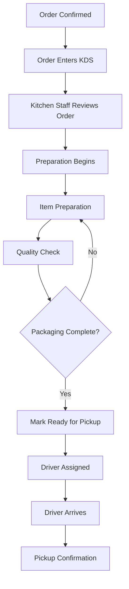
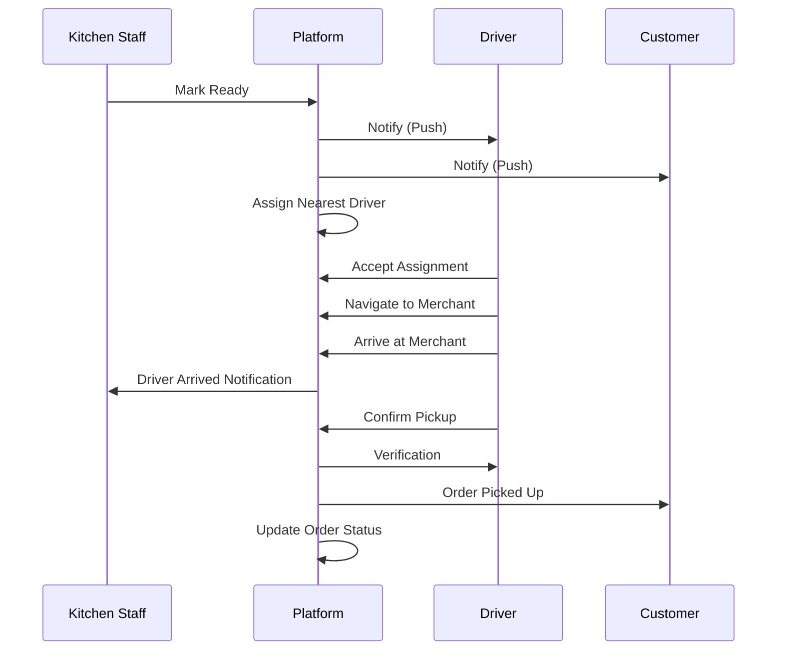

# Software Requirements Specification (SRS)

## Part 05B: Preparation, Ready & Pickup

**Module:** Order Fulfillment Module (Part 06)
**Version:** 1.0.0
**Status:** Final / For Review
**Date:** 2026-06-30

---

## Chapter 1 – Overview

### Purpose

The Preparation, Ready & Pickup module defines the critical merchant-side workflows that bridge order confirmation and driver handoff. This encompasses the complete preparation process, readiness management, kitchen display system (KDS) integration, and driver pickup coordination.

This is the operational heart of merchant fulfillment. Efficient preparation workflows reduce delivery times, minimize errors, and ensure consistent food quality. Clear readiness signals enable optimal driver assignment and reduce wait times. Seamless pickup coordination ensures smooth handoffs and accurate verification.

### Objectives

- Enable efficient, error-free order preparation
- Provide real-time visibility into preparation status
- Support Kitchen Display System (KDS) integration
- Enable accurate readiness confirmation
- Coordinate seamless driver pickup
- Minimize wait times for drivers
- Ensure food quality and temperature
- Support exception handling and contingencies

---

## Chapter 2 – Preparation Workflow

### FUL-013 Preparation Workflow Overview

### FUL-014 Preparation Stages

| Stage | Description | Priority |
| :--- | :--- | :--- |
| **Order Received** | Order enters kitchen system. | **Required** |
| **Order Review** | Kitchen staff reviews order details. | **Required** |
| **Prep Started** | Preparation of items begins. | **Required** |
| **Item Prep** | Individual items are prepared. | **Required** |
| **Quality Check** | Items inspected for quality. | **Required** |
| **Packaging** | Items packaged for delivery. | **Required** |
| **Ready** | Order is ready for pickup. | **Required** |

---

## Chapter 3 – Kitchen Display System (KDS)

### FUL-015 KDS Features

| Feature | Description | Priority |
| :--- | :--- | :--- |
| **Order Queue** | Real-time list of orders by status. | **Required** |
| **Order Cards** | Visual cards showing order details. | **Required** |
| **Status Colors** | Color-coded status indicators. | **Required** |
| **Prep Timer** | Countdown timer for each order. | **Required** |
| **Order Bumping** | Staff moves order through stages. | **Required** |
| **Sound Alerts** | Audible alerts for new orders. | **Required** |
| **Kitchen Notes** | Internal notes on order cards. | **Required** |
| **Printer Integration** | Print order tickets/labels. | **Required** |
| **Pause Orders** | Temporarily pause incoming orders. | **Required** |
| **Order Search** | Search orders by ID or customer. | **Required** |
| **Order Filter** | Filter by status, time, priority. | **Required** |
| **Volume Dashboard** | Real-time order volume view. | **Medium** |

### FUL-016 KDS Order Card

| Element | Description |
| :--- | :--- |
| **Order Number** | Human-readable order ID. |
| **Time Since Order** | Time elapsed since order placement. |
| **Customer Name** | Name of the customer. |
| **Items** | List of items with quantities. |
| **Modifiers** | Customization details for each item. |
| **Special Instructions** | Customer-provided instructions. |
| **Prep Timer** | Countdown showing remaining prep time. |
| **Status** | New, In Progress, Ready, Delayed. |
| **Priority Badge** | VIP, Large Order, Urgent. |
| **Actions** | Start Prep, Mark Ready, Delay Report. |

### FUL-017 KDS Statuses

| Status | Description | Color |
| :--- | :--- | :--- |
| **New** | Order just received, not yet started. | 🔵 Blue |
| **In Progress** | Order is being prepared. | 🟡 Yellow |
| **Ready** | Order is ready for pickup. | 🟢 Green |
| **Delayed** | Order preparation is delayed. | 🔴 Red |
| **Completed** | Order has been picked up. | ⚪ Gray |
| **Cancelled** | Order cancelled. | ⚫ Black |

### FUL-018 KDS Bumping Workflow

| Bump Action | Status Change | Description |
| :--- | :--- | :--- |
| **Start Prep** | New → In Progress | Kitchen starts preparing order. |
| **Item Complete** | In Progress → In Progress | Individual item marked complete. |
| **Mark Ready** | In Progress → Ready | All items complete, order ready. |
| **Report Delay** | In Progress → Delayed | Order delayed (reason required). |
| **Resume** | Delayed → In Progress | Delay resolved, prep resumes. |

---

## Chapter 4 – Preparation Management

### FUL-019 Prep Time Management

| Parameter | Specification | Priority |
| :--- | :--- | :--- |
| **Estimated Prep Time** | Merchant-defined per order/item. | **Required** |
| **Prep Time Tracking** | Track actual vs. estimated. | **Required** |
| **Prep Time Alerts** | Alert when prep exceeds estimate. | **Required** |
| **Prep Time Optimization** | Suggest prep time adjustments. | **Required** |
| **Prep Time Analytics** | Historical prep time analysis. | **Required** |

### FUL-020 Item Preparation Tracking

| Feature | Description | Priority |
| :--- | :--- | :--- |
| **Item Status** | Track individual item status. | **Required** |
| **Item Completion** | Mark items as complete. | **Required** |
| **Item Substitution** | Suggest substitutes for unavailable items. | **Required** |
| **Item Modifiers** | Track modifier preparation. | **Required** |
| **Special Instructions** | Highlight special instructions. | **Required** |

### FUL-021 Preparation Notes

| Note Type | Description | Priority |
| :--- | :--- | :--- |
| **Customer Instructions** | Special customer requests. | **Required** |
| **Kitchen Notes** | Internal kitchen staff notes. | **Required** |
| **Modifier Notes** | Specific modifier instructions. | **Required** |
| **Substitution Notes** | Item substitution details. | **Required** |
| **Allergen Notes** | Allergen warnings. | **Required** |

---

## Chapter 5 – Time Management

### FUL-022 Preparation Timers

| Timer | Description | Priority |
| :--- | :--- | :--- |
| **Order Prep Timer** | Countdown from confirmation to ready. | **Required** |
| **Item Prep Timer** | Individual item prep time. | **Required** |
| **Delay Timer** | Time elapsed since delay reported. | **Required** |
| **Driver Wait Timer** | Time driver has been waiting. | **Required** |
| **Total Fulfillment Timer** | Total time from order to delivery. | **Required** |

### FUL-023 Time Targets

| Metric | Target | Priority |
| :--- | :--- | :--- |
| **Time to Confirm** | < 2 minutes | **Required** |
| **Time to Start Prep** | < 5 minutes | **Required** |
| **Time to Ready** | < 15 minutes | **Required** |
| **Driver Wait Time** | < 5 minutes | **Required** |
| **Total Prep Time** | < 20 minutes | **Required** |

---

## Chapter 6 – Readiness Management

### FUL-024 Readiness Criteria

| Criteria | Description | Priority |
| :--- | :--- | :--- |
| **All Items Prepared** | All items in order are prepared. | **Required** |
| **Quality Checked** | Items inspected for quality. | **Required** |
| **Packaged** | Items packaged for delivery. | **Required** |
| **Labels Applied** | Order labels/tags applied. | **Required** |
| **Ready for Handoff** | Order ready for driver pickup. | **Required** |

### FUL-025 Ready Confirmation Flow

1.  Kitchen completes all item preparation.
2.  Quality check is performed.
3.  Items are packaged appropriately.
4.  Order labels/tags are applied.
5.  Staff taps "Mark Ready" in KDS.
6.  System validates readiness criteria.
7.  Order status updates to `READY`.
8.  Driver assignment is triggered.
9.  Customer receives notification.
10. Merchant receives confirmation.

### FUL-026 Readiness Notification

| Recipient | Channel | Timing | Priority |
| :--- | :--- | :--- | :--- |
| **Driver** | Push notification | Immediate | **Required** |
| **Customer** | Push notification | Immediate | **Required** |
| **Dispatch System** | Event | Immediate | **Required** |
| **Operations** | Dashboard | Real-time | **Required** |

---

## Chapter 7 – Driver Pickup Coordination

### FUL-027 Pickup Workflow

### FUL-028 Pickup Verification Methods

| Method | Description | Priority |
| :--- | :--- | :--- |
| **QR Code Scan** | Driver scans merchant QR code. | **Required** |
| **GPS Verification** | Driver must be at merchant location. | **Required** |
| **Manual Confirmation** | Driver taps "Confirm Pickup". | **Required** |
| **Code Entry** | Driver enters merchant pickup code. | **Medium** |
| **Photo Verification** | Driver takes photo with merchant. | **Medium** |

### FUL-029 Pickup Validation Rules

| Rule | Description |
| :--- | :--- |
| **Order Must Be Ready** | Order status must be READY. |
| **Driver Verification** | Driver identity must be verified. |
| **GPS Proximity** | Driver must be within 50m of merchant. |
| **Time Window** | Pickup must occur within pickup window. |
| **Multiple Orders** | Driver may pickup multiple orders. |

---

## Chapter 8 – Exception Handling

### FUL-030 Preparation Exceptions

| Exception | Handling | Priority |
| :--- | :--- | :--- |
| **Item Unavailable** | Merchant contacts customer for substitution. | **Required** |
| **Preparation Delay** | Merchant reports delay; customer notified. | **Required** |
| **Order Cancellation** | Order cancelled; preparation stopped. | **Required** |
| **Quality Issue** | Item re-prepared; customer notified. | **Required** |
| **System Issue** | KDS unavailable; manual fallback. | **Required** |

### FUL-031 Delay Handling

| Delay Duration | Action | Priority |
| :--- | :--- | :--- |
| **Minor Delay (< 5 min)** | No action; status remains Preparing. | **Required** |
| **Moderate Delay (5-15 min)** | Merchant reports delay; customer notified. | **Required** |
| **Major Delay (> 15 min)** | Customer notified; platform may offer compensation. | **Required** |
| **Unavoidable Delay** | Merchant contacts customer directly via chat/call. | **Required** |

### FUL-032 Delay Reasons

| Reason | Description |
| :--- | :--- |
| **Item Unavailability** | Item not available for preparation. |
| **Kitchen Backup** | High order volume causing backlog. |
| **Equipment Issue** | Kitchen equipment failure. |
| **Staff Shortage** | Insufficient kitchen staff. |
| **Ingredient Shortage** | Missing ingredients. |
| **Quality Issue** | Food quality issue requiring re-preparation. |

---

## Chapter 9 – Quality Assurance

### FUL-033 Quality Checkpoints

| Checkpoint | Description | Priority |
| :--- | :--- | :--- |
| **Item Quality** | Items inspected for quality. | **Required** |
| **Temperature Check** | Hot/cold temperature verified. | **Required** |
| **Packaging Integrity** | Packaging intact and secure. | **Required** |
| **Order Accuracy** | All items and modifiers correct. | **Required** |
| **Special Instructions** | Special requests fulfilled. | **Required** |
| **Allergen Check** | Allergen instructions followed. | **Required** |

### FUL-034 Quality Issue Handling

| Issue | Handling | Priority |
| :--- | :--- | :--- |
| **Quality Issue** | Item re-prepared; delay reported. | **Required** |
| **Missing Item** | Item added; delay reported. | **Required** |
| **Wrong Item** | Item corrected; delay reported. | **Required** |
| **Packaging Issue** | Re-packaged; delay reported. | **Required** |

---

## Chapter 10 – Database Tables

### order_preparation

| Column | Type | Constraints | Description |
| :--- | :--- | :--- | :--- |
| `prep_id` | UUID | PRIMARY KEY | Unique identifier |
| `order_id` | UUID | FOREIGN KEY (orders.order_id) | Associated order |
| `status` | VARCHAR(20) | NOT NULL | NEW/IN_PROGRESS/READY/DELAYED/COMPLETED/CANCELLED |
| `started_at` | TIMESTAMP | | Preparation start timestamp |
| `ready_at` | TIMESTAMP | | Ready timestamp |
| `completed_at` | TIMESTAMP | | Completion timestamp |
| `estimated_prep_time` | INTEGER | | Estimated prep time (minutes) |
| `actual_prep_time` | INTEGER | | Actual prep time (minutes) |
| `delay_reason` | VARCHAR(100) | | Reason for delay |
| `delay_reported_at` | TIMESTAMP | | Delay report timestamp |
| `delay_resolved_at` | TIMESTAMP | | Delay resolution timestamp |
| `notes` | TEXT | | Preparation notes |
| `created_at` | TIMESTAMP | DEFAULT NOW() | Creation timestamp |
| `updated_at` | TIMESTAMP | DEFAULT NOW() | Last update timestamp |

### order_items_prep

| Column | Type | Constraints | Description |
| :--- | :--- | :--- | :--- |
| `item_prep_id` | UUID | PRIMARY KEY | Unique identifier |
| `order_id` | UUID | FOREIGN KEY (orders.order_id) | Associated order |
| `item_id` | UUID | FOREIGN KEY (menu_items.item_id) | Associated menu item |
| `item_name` | VARCHAR(255) | NOT NULL | Item name (snapshot) |
| `quantity` | INTEGER | NOT NULL | Quantity |
| `status` | VARCHAR(20) | DEFAULT 'PENDING' | PENDING/IN_PROGRESS/COMPLETED |
| `modifiers` | JSONB | | Modifiers data |
| `special_instructions` | TEXT | | Special instructions |
| `prepared_at` | TIMESTAMP | | Preparation completion timestamp |
| `created_at` | TIMESTAMP | DEFAULT NOW() | Creation timestamp |
| `updated_at` | TIMESTAMP | DEFAULT NOW() | Last update timestamp |

### kitchen_display_orders

| Column | Type | Constraints | Description |
| :--- | :--- | :--- | :--- |
| `kds_order_id` | UUID | PRIMARY KEY | Unique identifier |
| `order_id` | UUID | UNIQUE, FOREIGN KEY (orders.order_id) | Associated order |
| `store_id` | UUID | FOREIGN KEY (merchant_stores.store_id) | Associated store |
| `display_status` | VARCHAR(20) | NOT NULL | NEW/IN_PROGRESS/READY/DELAYED/COMPLETED/CANCELLED |
| `order_position` | INTEGER | | Display order position |
| `priority_level` | VARCHAR(20) | DEFAULT 'NORMAL' | NORMAL/HIGH/URGENT |
| `timer_start` | TIMESTAMP | | Prep timer start |
| `timer_target` | TIMESTAMP | | Target completion time |
| `color_code` | VARCHAR(20) | | Status color |
| `bumped_by` | UUID | | Staff who bumped order |
| `bumped_at` | TIMESTAMP | | Last bump timestamp |
| `created_at` | TIMESTAMP | DEFAULT NOW() | Creation timestamp |
| `updated_at` | TIMESTAMP | DEFAULT NOW() | Last update timestamp |

### pickup_verifications

| Column | Type | Constraints | Description |
| :--- | :--- | :--- | :--- |
| `verification_id` | UUID | PRIMARY KEY | Unique identifier |
| `order_id` | UUID | FOREIGN KEY (orders.order_id) | Associated order |
| `driver_id` | UUID | FOREIGN KEY (driver_accounts.driver_id) | Driver verifying |
| `verification_method` | VARCHAR(20) | NOT NULL | QR/GPS/MANUAL/CODE/PHOTO |
| `verification_data` | TEXT | | Verification data (QR, code, etc.) |
| `latitude` | DECIMAL(10, 8) | | Verification GPS latitude |
| `longitude` | DECIMAL(11, 8) | | Verification GPS longitude |
| `verified_at` | TIMESTAMP | NOT NULL | Verification timestamp |
| `created_at` | TIMESTAMP | DEFAULT NOW() | Creation timestamp |

---

## Chapter 11 – REST APIs

### Preparation APIs

| Method | Endpoint | Description |
| :--- | :--- | :--- |
| `GET` | `/api/v1/merchant/preparation/orders` | Get preparation orders |
| `GET` | `/api/v1/merchant/preparation/orders/{id}` | Get preparation order details |
| `PUT` | `/api/v1/merchant/preparation/orders/{id}/start` | Start preparation |
| `PUT` | `/api/v1/merchant/preparation/orders/{id}/delay` | Report preparation delay |
| `PUT` | `/api/v1/merchant/preparation/orders/{id}/resume` | Resume preparation |
| `PUT` | `/api/v1/merchant/preparation/orders/{id}/complete` | Complete item preparation |

### KDS APIs

| Method | Endpoint | Description |
| :--- | :--- | :--- |
| `GET` | `/api/v1/merchant/kds/orders` | Get KDS order queue |
| `GET` | `/api/v1/merchant/kds/orders/{id}` | Get KDS order card |
| `PUT` | `/api/v1/merchant/kds/orders/{id}/bump` | Bump order status |
| `PUT` | `/api/v1/merchant/kds/orders/{id}/note` | Add kitchen note |
| `POST` | `/api/v1/merchant/kds/orders/{id}/print` | Print order ticket |
| `PUT` | `/api/v1/merchant/kds/settings` | Update KDS configuration |

### Ready APIs

| Method | Endpoint | Description |
| :--- | :--- | :--- |
| `PUT` | `/api/v1/merchant/orders/{id}/ready` | Mark order ready |
| `GET` | `/api/v1/merchant/orders/{id}/readiness` | Check readiness status |

### Pickup APIs

| Method | Endpoint | Description |
| :--- | :--- | :--- |
| `GET` | `/api/v1/driver/orders/{id}/pickup` | Get pickup details |
| `POST` | `/api/v1/driver/orders/{id}/pickup` | Confirm pickup |
| `POST` | `/api/v1/driver/orders/{id}/pickup/verify` | Verify pickup |

---

## Chapter 12 – Business Rules

| Rule ID | Rule Description | Priority |
| :--- | :--- | :--- |
| **BR-PREP-001** | Orders must be confirmed before preparation. | **High** |
| **BR-PREP-002** | Items cannot be prepared after order cancellation. | **High** |
| **BR-PREP-003** | Order cannot be marked ready without all items prepared. | **High** |
| **BR-PREP-004** | Pickup requires order status to be READY. | **High** |
| **BR-PREP-005** | Pickup verification required (QR/GPS/Manual). | **High** |
| **BR-PREP-006** | Preparation delay > 5 minutes triggers customer notification. | **High** |
| **BR-PREP-007** | KDS order queue sorted by priority and time. | **High** |
| **BR-PREP-008** | Order bumping must log staff and timestamp. | **High** |
| **BR-PREP-009** | Quality check must be performed before marking ready. | **High** |
| **BR-PREP-010** | Driver GPS must be within 50m for pickup verification. | **High** |

---

## Chapter 13 – Acceptance Tests

| Test ID | Test Description | Priority |
| :--- | :--- | :--- |
| **TEST-PREP-001** | Confirmed order appears in KDS. | **High** |
| **TEST-PREP-002** | KDS order card displays all details correctly. | **High** |
| **TEST-PREP-003** | Kitchen staff starts preparation (bump to In Progress). | **High** |
| **TEST-PREP-004** | Individual item marked as prepared. | **High** |
| **TEST-PREP-005** | All items prepared; order marked Ready. | **High** |
| **TEST-PREP-006** | Preparation timer tracks time correctly. | **High** |
| **TEST-PREP-007** | Delay reported; customer notified. | **High** |
| **TEST-PREP-008** | Delay resolved; preparation resumes. | **High** |
| **TEST-PREP-009** | Order printed from KDS. | **High** |
| **TEST-PREP-010** | Kitchen note added to order card. | **High** |
| **TEST-PREP-011** | Order ready notification sent to driver. | **High** |
| **TEST-PREP-012** | Order ready notification sent to customer. | **High** |
| **TEST-PREP-013** | Driver arrives at merchant for pickup. | **High** |
| **TEST-PREP-014** | Driver confirms pickup with QR code. | **High** |
| **TEST-PREP-015** | Driver confirms pickup with GPS verification. | **High** |
| **TEST-PREP-016** | Driver cannot confirm pickup outside merchant radius. | **High** |
| **TEST-PREP-017** | Multiple order pickup works correctly. | **High** |
| **TEST-PREP-018** | KDS order queue sorted by priority. | **High** |
| **TEST-PREP-019** | KDS color coding displays correctly. | **High** |
| **TEST-PREP-020** | KDS search finds order by ID. | **High** |
| **TEST-PREP-021** | KDS filter shows orders by status. | **High** |
| **TEST-PREP-022** | KDS pause stops new orders. | **High** |
| **TEST-PREP-023** | KDS resume resumes new orders. | **High** |
| **TEST-PREP-024** | Quality check performed before ready. | **High** |
| **TEST-PREP-025** | Unavailable item triggers substitution workflow. | **High** |

---

## Chapter 14 – Traceability Matrix

| Requirement | Database Table | API Endpoint(s) | Acceptance Test |
| :--- | :--- | :--- | :--- |
| FUL-015 | kitchen_display_orders | GET /api/v1/merchant/kds/orders | TEST-PREP-001 |
| FUL-016 | kitchen_display_orders | GET /api/v1/merchant/kds/orders/{id} | TEST-PREP-002 |
| FUL-018 | kitchen_display_orders | PUT /api/v1/merchant/kds/orders/{id}/bump | TEST-PREP-003 |
| FUL-020 | order_items_prep | PUT /api/v1/merchant/preparation/orders/{id}/complete | TEST-PREP-004 |
| FUL-024 | order_preparation | PUT /api/v1/merchant/orders/{id}/ready | TEST-PREP-005 |
| FUL-022 | order_preparation | GET /api/v1/merchant/preparation/orders/{id} | TEST-PREP-006 |
| FUL-031 | order_preparation | PUT /api/v1/merchant/preparation/orders/{id}/delay | TEST-PREP-007, TEST-PREP-008 |
| FUL-016 | kitchen_display_orders | POST /api/v1/merchant/kds/orders/{id}/print | TEST-PREP-009 |
| FUL-021 | kitchen_display_orders | PUT /api/v1/merchant/kds/orders/{id}/note | TEST-PREP-010 |
| FUL-026 | orders | Internal (Notification) | TEST-PREP-011, TEST-PREP-012 |
| FUL-027 | pickup_verifications | POST /api/v1/driver/orders/{id}/pickup | TEST-PREP-013, TEST-PREP-014, TEST-PREP-015, TEST-PREP-016 |
| FUL-027 | pickup_verifications | POST /api/v1/driver/orders/{id}/pickup | TEST-PREP-017 |

---

## Chapter 15 – Summary

This document establishes the complete preparation, ready, and pickup capability for the **[Platform Name]** platform. Key takeaways:

- **Preparation Workflow:** Structured stages from order review through item preparation, quality check, and packaging.
- **Kitchen Display System:** Real-time order queue with color-coded statuses, prep timers, bumping, printing, and notes.
- **Time Management:** Prep timers, delay handling, and time targets for operational efficiency.
- **Readiness Management:** Clear criteria and confirmation flow for marking orders ready.
- **Pickup Coordination:** Seamless driver notification, assignment, arrival, and verification workflows.
- **Verification Methods:** QR code scan, GPS verification, manual confirmation, code entry, and photo verification.
- **Exception Handling:** Item unavailability, preparation delays, cancellations, and quality issues.
- **Quality Assurance:** Quality checkpoints and issue handling for consistent food quality.

The preparation, ready, and pickup module is the operational bridge between merchant confirmation and driver delivery. Efficient workflows ensure timely preparation, accurate readiness signals, and smooth driver handoffs.

---

**Next Document:**

`Part_05C_Quality_Assurance.md`

*(This builds on preparation to define the quality assurance processes for order accuracy, food quality, and customer satisfaction.)*