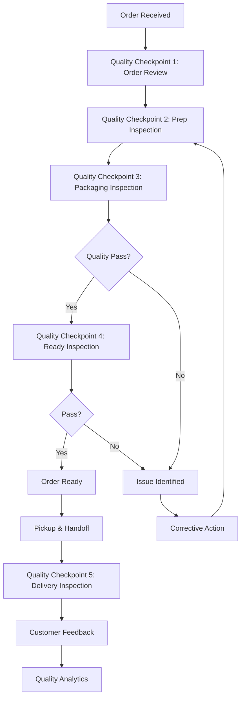
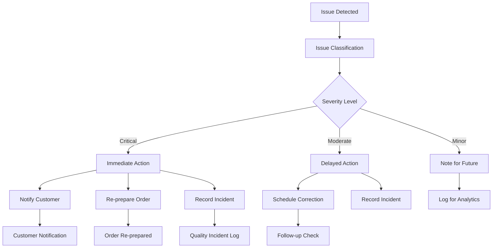

# Software Requirements Specification (SRS)

## Part 05C: Quality Assurance

**Module:** Order Fulfillment Module (Part 06)
**Version:** 1.0.0
**Status:** Final / For Review
**Date:** 2026-06-30

---

## Chapter 1 – Overview

### Purpose

The Quality Assurance module defines the comprehensive quality management processes that ensure order accuracy, food quality, packaging integrity, and overall customer satisfaction. This encompasses quality checkpoints, inspection protocols, issue detection, corrective actions, and continuous improvement.

Quality is the foundation of customer trust and platform reputation. Every order represents a promise of quality—accurate items, proper temperature, intact packaging, and timely delivery. Consistent quality drives customer loyalty, positive reviews, and repeat business. This module ensures that quality is embedded throughout the fulfillment process, not just inspected at the end.

### Objectives

- Ensure order accuracy (correct items, quantities, modifiers)
- Maintain food quality (temperature, freshness, presentation)
- Ensure packaging integrity and security
- Detect and resolve quality issues proactively
- Provide customer feedback loop for quality improvement
- Enable data-driven quality optimization
- Support merchant quality compliance
- Build customer trust through consistent quality

---

## Chapter 2 – Quality Management Framework

### FUL-035 Quality Management Components

| Component | Description | Priority |
| :--- | :--- | :--- |
| **Quality Checkpoints** | Inspection points throughout fulfillment. | **Required** |
| **Quality Metrics** | Measurable quality indicators. | **Required** |
| **Quality Standards** | Defined quality criteria and thresholds. | **Required** |
| **Quality Inspection** | Systematic inspection protocols. | **Required** |
| **Issue Detection** | Proactive issue identification. | **Required** |
| **Corrective Actions** | Issue resolution workflows. | **Required** |
| **Quality Reporting** | Quality performance reporting. | **Required** |
| **Continuous Improvement** | Ongoing quality optimization. | **Required** |

### FUL-036 Quality Assurance Workflow

---

## Chapter 3 – Quality Checkpoints

### FUL-037 Checkpoint 1: Order Review

| Check | Description | Priority |
| :--- | :--- | :--- |
| **Order Completeness** | All required fields present. | **Required** |
| **Item Availability** | All items available in inventory. | **Required** |
| **Modifier Validation** | Valid modifiers for each item. | **Required** |
| **Special Instructions** | Special requests captured. | **Required** |
| **Allergen Checks** | Allergen instructions flagged. | **Required** |
| **Price Validation** | Prices correct for items. | **Required** |

### FUL-038 Checkpoint 2: Prep Inspection

| Check | Description | Priority |
| :--- | :--- | :--- |
| **Ingredient Quality** | Freshness and quality of ingredients. | **Required** |
| **Recipe Adherence** | Correct recipe and portions. | **Required** |
| **Temperature Control** | Proper hot/cold temperature. | **Required** |
| **Presentation** | Food presentation standards. | **Required** |
| **Allergen Separation** | Cross-contamination prevention. | **Required** |
| **Hygiene Standards** | Cleanliness and hygiene. | **Required** |

### FUL-039 Checkpoint 3: Packaging Inspection

| Check | Description | Priority |
| :--- | :--- | :--- |
| **Packaging Integrity** | Packaging intact and secure. | **Required** |
| **Temperature Retention** | Packaging suitable for temperature. | **Required** |
| **Leak Prevention** | No leaks or spills. | **Required** |
| **Portion Accuracy** | Correct portion sizes. | **Required** |
| **Labeling** | Correct labels and tags. | **Required** |
| **Presentation** | Packaging presentation standards. | **Required** |

### FUL-040 Checkpoint 4: Ready Inspection

| Check | Description | Priority |
| :--- | :--- | :--- |
| **Order Accuracy** | All items present and correct. | **Required** |
| **Quality Check** | Overall quality inspection. | **Required** |
| **Temperature Check** | Hot/cold temperature verified. | **Required** |
| **Packaging Check** | Packaging final inspection. | **Required** |
| **Label Check** | Labels match order. | **Required** |
| **Special Instructions** | Special requests verified. | **Required** |

### FUL-041 Checkpoint 5: Delivery Inspection

| Check | Description | Priority |
| :--- | :--- | :--- |
| **Handoff Integrity** | Order handed off properly. | **Required** |
| **Temperature Check** | Temperature maintained. | **Required** |
| **Packaging Check** | Packaging intact upon arrival. | **Required** |
| **Delivery Presentation** | Order presented properly. | **Required** |
| **Customer Satisfaction** | Customer satisfaction check. | **Required** |

---

## Chapter 4 – Quality Standards

### FUL-042 Quality Standards by Category

| Category | Standard | Threshold | Priority |
| :--- | :--- | :--- | :--- |
| **Food Quality** | Hot food temperature | > 60°C (140°F) | **Required** |
| | Cold food temperature | < 5°C (41°F) | **Required** |
| | Freshness | < 15 min since preparation | **Required** |
| | Presentation | Visual appeal standard | **Required** |
| **Order Accuracy** | Item accuracy | 100% correct | **Required** |
| | Modifier accuracy | 100% correct | **Required** |
| | Special instructions | 100% followed | **Required** |
| **Packaging** | Integrity | No damage or leaks | **Required** |
| | Seal | Tamper-proof seal intact | **Required** |
| | Labeling | 100% correct labels | **Required** |
| **Delivery** | Condition | Order arrives intact | **Required** |
| | Temperature | Temperature maintained | **Required** |
| | Presentation | Professional presentation | **Required** |

### FUL-043 Temperature Specifications

| Item Type | Temperature Range | Check Frequency |
| :--- | :--- | :--- |
| **Hot Foods** | 60-70°C (140-158°F) | Every 5 minutes |
| **Cold Foods** | 0-5°C (32-41°F) | Every 5 minutes |
| **Frozen Items** | -18°C (0°F) or below | On pickup |
| **Room Temperature** | 20-25°C (68-77°F) | On pickup |

### FUL-044 Time Specifications

| Milestone | Max Time | Priority |
| :--- | :--- | :--- |
| **Order to Start Prep** | 5 minutes | **Required** |
| **Start Prep to Ready** | 15 minutes | **Required** |
| **Ready to Pickup** | 5 minutes | **Required** |
| **Pickup to Delivery** | 20 minutes | **Required** |
| **Order to Delivery** | 45 minutes | **Required** |

---

## Chapter 5 – Quality Inspection

### FUL-045 Inspection Protocol

| Step | Description | Priority |
| :--- | :--- | :--- |
| **1. Visual Inspection** | Visual check of food and packaging. | **Required** |
| **2. Temperature Check** | Temperature verification. | **Required** |
| **3. Quantity Check** | Verify item quantities. | **Required** |
| **4. Accuracy Check** | Verify items and modifiers. | **Required** |
| **5. Special Instructions** | Verify special instructions. | **Required** |
| **6. Packaging Check** | Verify packaging integrity. | **Required** |
| **7. Label Check** | Verify labels and tags. | **Required** |
| **8. Final Approval** | Sign-off by quality staff. | **Required** |

### FUL-046 Inspection Tools

| Tool | Description | Priority |
| :--- | :--- | :--- |
| **Temperature Probe** | Measure food temperature. | **Required** |
| **Checklist** | Standardized inspection checklist. | **Required** |
| **Quality Camera** | Document quality issues. | **Required** |
| **Quality Labels** | Pass/fail labels. | **Required** |
| **Digital System** | Digital inspection logging. | **Required** |

### FUL-047 Quality Pass/Fail Criteria

| Criteria | Pass | Fail |
| :--- | :--- | :--- |
| **Temperature** | Within specified range | Outside range |
| **Accuracy** | 100% correct | Any error |
| **Packaging** | Intact and sealed | Damaged or unsealed |
| **Presentation** | Meets standards | Below standards |
| **Time** | Within SLA | Exceeds SLA |

---

## Chapter 6 – Issue Detection

### FUL-048 Issue Categories

| Category | Description | Priority |
| :--- | :--- | :--- |
| **Order Accuracy** | Wrong items, missing items, wrong quantities. | **Required** |
| **Food Quality** | Temperature, freshness, taste, presentation. | **Required** |
| **Packaging** | Damage, leaks, improper sealing. | **Required** |
| **Delivery** | Late delivery, mishandling, presentation. | **Required** |
| **Special Instructions** | Special requests not followed. | **Required** |

### FUL-049 Issue Detection Methods

| Method | Description | Priority |
| :--- | :--- | :--- |
| **Merchant Self-Inspection** | Merchant inspects before marking ready. | **Required** |
| **Driver Inspection** | Driver inspects on pickup. | **Required** |
| **Customer Feedback** | Customer reports issues. | **Required** |
| **Quality Audit** | Random quality audits. | **Required** |
| **Photo Verification** | Photos as quality evidence. | **Required** |
| **Analytics Detection** | Anomaly detection from data. | **Required** |

---

## Chapter 7 – Corrective Actions

### FUL-050 Corrective Action Workflow

### FUL-051 Corrective Action Types

| Action | Description | Priority |
| :--- | :--- | :--- |
| **Re-preparation** | Prepare order again. | **Required** |
| **Re-packaging** | Re-package order. | **Required** |
| **Item Substitution** | Substitute unavailable items. | **Required** |
| **Customer Notification** | Notify customer of issue. | **Required** |
| **Compensation** | Offer compensation for issues. | **Required** |
| **Process Improvement** | Improve quality processes. | **Required** |
| **Staff Training** | Train staff on quality. | **Required** |

### FUL-052 Severity Levels

| Level | Description | Response Time | Action |
| :--- | :--- | :--- | :--- |
| **Critical** | Food safety issue, missing order. | Immediate | Stop, notify customer, re-prepare. |
| **Moderate** | Wrong item, quality issue. | 5 minutes | Notify customer, correct. |
| **Minor** | Minor presentation issue. | 15 minutes | Log, address in training. |
| **Informational** | Customer preference issue. | 1 hour | Log for future improvement. |

---

## Chapter 8 – Customer Feedback Loop

### FUL-053 Feedback Collection

| Method | Description | Priority |
| :--- | :--- | :--- |
| **Post-Delivery Rating** | Customer rates order (1-5 stars). | **Required** |
| **Detailed Review** | Customer provides written review. | **Required** |
| **Photo Feedback** | Customer uploads photos. | **Required** |
| **Support Feedback** | Customer reports issue to support. | **Required** |
| **Survey** | Optional detailed survey. | **Required** |
| **Social Listening** | Monitor social media mentions. | **Medium** |

### FUL-054 Feedback Categories

| Category | Description | Priority |
| :--- | :--- | :--- |
| **Order Accuracy** | Correct items and modifiers. | **Required** |
| **Food Quality** | Temperature, taste, freshness. | **Required** |
| **Packaging** | Packaging integrity and presentation. | **Required** |
| **Delivery** | Timeliness and professionalism. | **Required** |
| **Overall Experience** | Overall satisfaction. | **Required** |

### FUL-055 Feedback Analysis

| Analysis | Description | Priority |
| :--- | :--- | :--- |
| **Sentiment Analysis** | Analyze review sentiment. | **Required** |
| **Trend Analysis** | Identify quality trends. | **Required** |
| **Root Cause Analysis** | Identify root causes. | **Required** |
| **Merchant Comparison** | Compare merchant quality. | **Required** |
| **Driver Comparison** | Compare driver quality. | **Required** |
| **Improvement Recommendations** | Suggest improvements. | **Required** |

---

## Chapter 9 – Merchant Quality Compliance

### FUL-056 Merchant Quality Metrics

| Metric | Description | Target | Priority |
| :--- | :--- | :--- | :--- |
| **Order Accuracy Rate** | % of accurate orders. | > 98% | **Required** |
| **Food Quality Rating** | Average food quality rating. | > 4.5/5 | **Required** |
| **Packaging Quality Rating** | Average packaging rating. | > 4.5/5 | **Required** |
| **Special Instruction Compliance** | % of special instructions followed. | > 95% | **Required** |
| **Preparation Time Adherence** | % of orders within prep time. | > 95% | **Required** |
| **Customer Complaint Rate** | % of orders with complaints. | < 2% | **Required** |

### FUL-057 Quality Compliance Actions

| Action | Trigger | Description |
| :--- | :--- | :--- |
| **Quality Alert** | Metric below threshold | Notify merchant of issue. |
| **Quality Review** | Persistent issues | Quality audit and review. |
| **Quality Improvement Plan** | Serious issues | Structured improvement plan. |
| **Suspension** | Severe or persistent issues | Temporary suspension. |

---

## Chapter 10 – Quality Analytics

### FUL-058 Quality Dashboards

| Widget | Description | Priority |
| :--- | :--- | :--- |
| **Quality Score** | Overall quality score. | **Required** |
| **Quality Trend** | Quality score over time. | **Required** |
| **Issue Distribution** | Issues by category. | **Required** |
| **Merchant Rankings** | Quality rankings by merchant. | **Required** |
| **Driver Rankings** | Quality rankings by driver. | **Required** |
| **Customer Feedback** | Real-time customer feedback. | **Required** |

### FUL-059 Quality Reports

| Report | Description | Frequency | Priority |
| :--- | :--- | :--- | :--- |
| **Daily Quality Report** | Daily quality summary. | Daily | **Required** |
| **Merchant Quality Report** | Merchant quality performance. | Weekly | **Required** |
| **Driver Quality Report** | Driver quality performance. | Weekly | **Required** |
| **Issue Analysis Report** | Issue trends and root causes. | Weekly | **Required** |
| **Quality Improvement Report** | Quality improvement progress. | Monthly | **Required** |

---

## Chapter 11 – Database Tables

### quality_checkpoints

| Column | Type | Constraints | Description |
| :--- | :--- | :--- | :--- |
| `checkpoint_id` | UUID | PRIMARY KEY | Unique identifier |
| `order_id` | UUID | FOREIGN KEY (orders.order_id) | Associated order |
| `checkpoint_type` | VARCHAR(20) | NOT NULL | ORDER_REVIEW/PREP_INSPECTION/PACKAGING_INSPECTION/READY_INSPECTION/DELIVERY_INSPECTION |
| `status` | VARCHAR(20) | NOT NULL | PASS/FAIL/PENDING |
| `inspected_by` | UUID | | Inspector identifier |
| `inspected_at` | TIMESTAMP | | Inspection timestamp |
| `notes` | TEXT | | Inspection notes |
| `temperature_recorded` | DECIMAL(5, 2) | | Temperature reading |
| `photo_url` | VARCHAR(500) | | Inspection photo |
| `created_at` | TIMESTAMP | DEFAULT NOW() | Creation timestamp |
| `updated_at` | TIMESTAMP | DEFAULT NOW() | Last update timestamp |

### quality_issues

| Column | Type | Constraints | Description |
| :--- | :--- | :--- | :--- |
| `issue_id` | UUID | PRIMARY KEY | Unique identifier |
| `order_id` | UUID | FOREIGN KEY (orders.order_id) | Associated order |
| `merchant_id` | UUID | FOREIGN KEY (merchant_accounts.merchant_id) | Associated merchant |
| `issue_category` | VARCHAR(30) | NOT NULL | ORDER_ACCURACY/FOOD_QUALITY/PACKAGING/DELIVERY/SPECIAL_INSTRUCTIONS |
| `severity` | VARCHAR(20) | NOT NULL | CRITICAL/MODERATE/MINOR/INFORMATIONAL |
| `description` | TEXT | NOT NULL | Issue description |
| `detected_by` | VARCHAR(20) | NOT NULL | MERCHANT/DRIVER/CUSTOMER/SYSTEM |
| `detected_at` | TIMESTAMP | | Detection timestamp |
| `status` | VARCHAR(20) | DEFAULT 'OPEN' | OPEN/IN_PROGRESS/RESOLVED/CLOSED |
| `corrective_action` | TEXT | | Corrective action taken |
| `resolved_at` | TIMESTAMP | | Resolution timestamp |
| `created_at` | TIMESTAMP | DEFAULT NOW() | Creation timestamp |
| `updated_at` | TIMESTAMP | DEFAULT NOW() | Last update timestamp |

### quality_feedback

| Column | Type | Constraints | Description |
| :--- | :--- | :--- | :--- |
| `feedback_id` | UUID | PRIMARY KEY | Unique identifier |
| `order_id` | UUID | FOREIGN KEY (orders.order_id) | Associated order |
| `customer_id` | UUID | FOREIGN KEY (customers.customer_id) | Customer providing feedback |
| `order_accuracy_rating` | INTEGER | CHECK (1-5) | Accuracy rating |
| `food_quality_rating` | INTEGER | CHECK (1-5) | Food quality rating |
| `packaging_rating` | INTEGER | CHECK (1-5) | Packaging rating |
| `delivery_rating` | INTEGER | CHECK (1-5) | Delivery rating |
| `overall_rating` | INTEGER | CHECK (1-5) | Overall rating |
| `review_text` | TEXT | | Written review |
| `photos` | TEXT[] | | Photo URLs |
| `sentiment_score` | DECIMAL(3, 2) | | Sentiment analysis score |
| `issues_reported` | TEXT[] | | Issues reported |
| `created_at` | TIMESTAMP | DEFAULT NOW() | Feedback creation timestamp |
| `updated_at` | TIMESTAMP | DEFAULT NOW() | Last update timestamp |

### merchant_quality_metrics

| Column | Type | Constraints | Description |
| :--- | :--- | :--- | :--- |
| `metric_id` | UUID | PRIMARY KEY | Unique identifier |
| `merchant_id` | UUID | FOREIGN KEY (merchant_accounts.merchant_id) | Associated merchant |
| `metric_date` | DATE | NOT NULL | Date of metrics |
| `order_accuracy_rate` | DECIMAL(5, 2) | | Order accuracy % |
| `food_quality_rating` | DECIMAL(3, 2) | | Average food quality rating |
| `packaging_rating` | DECIMAL(3, 2) | | Average packaging rating |
| `special_instruction_compliance` | DECIMAL(5, 2) | | Special instruction compliance % |
| `prep_time_adherence` | DECIMAL(5, 2) | | Prep time adherence % |
| `complaint_rate` | DECIMAL(5, 2) | | Complaint rate % |
| `quality_score` | DECIMAL(5, 2) | | Overall quality score |
| `created_at` | TIMESTAMP | DEFAULT NOW() | Creation timestamp |
| `updated_at` | TIMESTAMP | DEFAULT NOW() | Last update timestamp |

---

## Chapter 12 – REST APIs

### Quality Checkpoint APIs

| Method | Endpoint | Description |
| :--- | :--- | :--- |
| `GET` | `/api/v1/quality/checkpoints/order/{id}` | Get quality checkpoints for order |
| `POST` | `/api/v1/quality/checkpoints/order/{id}` | Create quality checkpoint |
| `PUT` | `/api/v1/quality/checkpoints/{id}` | Update checkpoint status |

### Quality Issue APIs

| Method | Endpoint | Description |
| :--- | :--- | :--- |
| `POST` | `/api/v1/quality/issues` | Report quality issue |
| `GET` | `/api/v1/quality/issues` | List quality issues |
| `GET` | `/api/v1/quality/issues/{id}` | Get issue details |
| `PUT` | `/api/v1/quality/issues/{id}` | Update issue status |
| `POST` | `/api/v1/quality/issues/{id}/resolve` | Resolve issue |

### Quality Feedback APIs

| Method | Endpoint | Description |
| :--- | :--- | :--- |
| `POST` | `/api/v1/quality/feedback` | Submit quality feedback |
| `GET` | `/api/v1/quality/feedback/order/{id}` | Get feedback for order |
| `GET` | `/api/v1/quality/feedback/merchant/{id}` | Get merchant feedback |

### Quality Metrics APIs

| Method | Endpoint | Description |
| :--- | :--- | :--- |
| `GET` | `/api/v1/quality/metrics/merchant/{id}` | Get merchant quality metrics |
| `GET` | `/api/v1/quality/metrics/dashboard` | Get quality dashboard |
| `GET` | `/api/v1/quality/metrics/reports` | Get quality reports |

---

## Chapter 13 – Business Rules

| Rule ID | Rule Description | Priority |
| :--- | :--- | :--- |
| **BR-QUAL-001** | All orders must pass quality inspection before marking ready. | **High** |
| **BR-QUAL-002** | Temperature checks required for hot/cold food items. | **High** |
| **BR-QUAL-003** | Special instructions must be verified during inspection. | **High** |
| **BR-QUAL-004** | Critical quality issues require immediate notification. | **High** |
| **BR-QUAL-005** | Quality issues must be logged for audit. | **High** |
| **BR-QUAL-006** | Merchants with quality score < 80% trigger review. | **High** |
| **BR-QUAL-007** | Customer feedback must be analyzed within 24 hours. | **High** |
| **BR-QUAL-008** | Quality checkpoints must be completed in sequence. | **High** |
| **BR-QUAL-009** | All quality data must be retained for 24 months. | **High** |
| **BR-QUAL-010** | Quality improvement actions must be documented. | **High** |

---

## Chapter 14 – Acceptance Tests

| Test ID | Test Description | Priority |
| :--- | :--- | :--- |
| **TEST-QUAL-001** | Quality checkpoint created for new order. | **High** |
| **TEST-QUAL-002** | Quality inspection passes for correct order. | **High** |
| **TEST-QUAL-003** | Quality inspection fails for incorrect order. | **High** |
| **TEST-QUAL-004** | Temperature check passes for hot food. | **High** |
| **TEST-QUAL-005** | Temperature check fails for cold hot food. | **High** |
| **TEST-QUAL-006** | Special instructions verified correctly. | **High** |
| **TEST-QUAL-007** | Special instructions not followed flagged as issue. | **High** |
| **TEST-QUAL-008** | Packaging integrity check passes. | **High** |
| **TEST-QUAL-009** | Packaging integrity check fails. | **High** |
| **TEST-QUAL-010** | Quality issue reported by merchant. | **High** |
| **TEST-QUAL-011** | Quality issue reported by driver. | **High** |
| **TEST-QUAL-012** | Quality issue reported by customer. | **High** |
| **TEST-QUAL-013** | Corrective action taken for quality issue. | **High** |
| **TEST-QUAL-014** | Customer submits quality feedback. | **High** |
| **TEST-QUAL-015** | Customer feedback sentiment analyzed. | **High** |
| **TEST-QUAL-016** | Merchant quality score calculated correctly. | **High** |
| **TEST-QUAL-017** | Low quality score triggers merchant review. | **High** |
| **TEST-QUAL-018** | Quality dashboard displays metrics correctly. | **High** |
| **TEST-QUAL-019** | Quality trend chart displays correctly. | **High** |
| **TEST-QUAL-020** | Quality issue distribution chart displays correctly. | **High** |
| **TEST-QUAL-021** | Daily quality report generated. | **High** |
| **TEST-QUAL-022** | Weekly quality report generated. | **High** |
| **TEST-QUAL-023** | Quality issue closed after resolution. | **High** |
| **TEST-QUAL-024** | Quality photo evidence stored correctly. | **High** |

---

## Chapter 15 – Traceability Matrix

| Requirement | Database Table | API Endpoint(s) | Acceptance Test |
| :--- | :--- | :--- | :--- |
| FUL-037 | quality_checkpoints | POST /api/v1/quality/checkpoints/order/{id} | TEST-QUAL-001 |
| FUL-040 | quality_checkpoints | PUT /api/v1/quality/checkpoints/{id} | TEST-QUAL-002 |
| FUL-040 | quality_checkpoints | PUT /api/v1/quality/checkpoints/{id} | TEST-QUAL-003 |
| FUL-043 | quality_checkpoints | POST /api/v1/quality/checkpoints/order/{id} | TEST-QUAL-004, TEST-QUAL-005 |
| FUL-037 | quality_checkpoints | PUT /api/v1/quality/checkpoints/{id} | TEST-QUAL-006, TEST-QUAL-007 |
| FUL-039 | quality_checkpoints | PUT /api/v1/quality/checkpoints/{id} | TEST-QUAL-008, TEST-QUAL-009 |
| FUL-048 | quality_issues | POST /api/v1/quality/issues | TEST-QUAL-010, TEST-QUAL-011, TEST-QUAL-012 |
| FUL-050 | quality_issues | PUT /api/v1/quality/issues/{id} | TEST-QUAL-013 |
| FUL-053 | quality_feedback | POST /api/v1/quality/feedback | TEST-QUAL-014, TEST-QUAL-015 |
| FUL-056 | merchant_quality_metrics | GET /api/v1/quality/metrics/merchant/{id} | TEST-QUAL-016, TEST-QUAL-017 |
| FUL-058 | merchant_quality_metrics | GET /api/v1/quality/metrics/dashboard | TEST-QUAL-018, TEST-QUAL-019, TEST-QUAL-020 |
| FUL-059 | merchant_quality_metrics | GET /api/v1/quality/metrics/reports | TEST-QUAL-021, TEST-QUAL-022 |
| FUL-050 | quality_issues | PUT /api/v1/quality/issues/{id}/resolve | TEST-QUAL-023 |

---

## Chapter 16 – Summary

This document establishes the complete quality assurance capability for the **[Platform Name]** platform. Key takeaways:

- **Quality Management Framework:** Comprehensive quality components including checkpoints, metrics, standards, inspection, issue detection, corrective actions, and continuous improvement.
- **Five Quality Checkpoints:** Order Review → Prep Inspection → Packaging Inspection → Ready Inspection → Delivery Inspection ensures quality throughout the fulfillment journey.
- **Quality Standards:** Clear temperature, time, accuracy, packaging, and delivery standards with measurable thresholds.
- **Issue Detection & Resolution:** Proactive issue detection with severity-based corrective actions and customer notification.
- **Customer Feedback Loop:** Post-delivery ratings, reviews, photo feedback, and sentiment analysis for continuous improvement.
- **Merchant Quality Compliance:** Quality metrics, alerts, reviews, and improvement plans to ensure merchant quality standards.
- **Quality Analytics:** Dashboards, trend analysis, and reports for data-driven quality optimization.
- **Photo Evidence:** Photo verification for quality issues and inspections.

The quality assurance module ensures that every order meets the platform's quality standards, building customer trust and driving repeat business through consistent quality.

---

**Next Document:**

`Part_05D_Exception_Handling.md`

*(This builds on quality assurance to define how exceptions—cancellations, delays, failures, and disputes—are handled throughout the order lifecycle.)*
