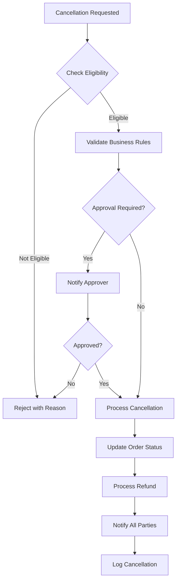
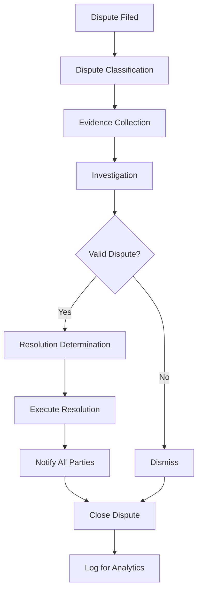

# Software Requirements Specification (SRS)

## Part 05D: Exception Handling

**Module:** Order Fulfillment Module (Part 06)
**Version:** 1.0.0
**Status:** Final / For Review
**Date:** 2026-06-30

---

## Chapter 1 – Overview

### Purpose

The Exception Handling module defines the comprehensive framework for managing exceptions that occur during the order lifecycle—from order placement through delivery. This encompasses order cancellations, preparation delays, delivery failures, order modifications, customer disputes, and system-level exceptions.

Exceptions are inevitable in any delivery platform. The ability to handle them gracefully, efficiently, and fairly is a key differentiator. Well-designed exception handling minimizes customer frustration, protects merchant and driver interests, reduces operational costs, and maintains platform trust. This module ensures that exceptions are managed consistently, transparently, and with appropriate escalation paths.

### Objectives

- Define clear exception classification and severity levels
- Provide structured cancellation workflows for all stakeholders
- Enable efficient delay management and communication
- Support order modifications with validation
- Handle delivery failures with appropriate resolution
- Manage disputes and refunds fairly
- Minimize customer impact during exceptions
- Provide audit trails for all exception events

---

## Chapter 2 – Exception Framework

### FUL-060 Exception Categories

| Category | Description | Priority |
| :--- | :--- | :--- |
| **Order Cancellation** | Order cancelled before delivery. | **Required** |
| **Preparation Exception** | Issues during preparation. | **Required** |
| **Delivery Exception** | Issues during delivery. | **Required** |
| **Modification Exception** | Order changes after placement. | **Required** |
| **Customer Dispute** | Customer disputes order/charge. | **Required** |
| **Merchant Dispute** | Merchant disputes commission/fees. | **Required** |
| **Driver Dispute** | Driver disputes earnings/assignment. | **Required** |
| **System Exception** | System-level failures. | **Required** |

### FUL-061 Severity Levels

| Level | Description | Response Time | Escalation | Priority |
| :--- | :--- | :--- | :--- | :--- |
| **Critical** | Immediate customer impact, safety issue. | < 5 minutes | Operations Manager | **Required** |
| **High** | Significant customer impact, delivery failure. | < 15 minutes | Team Lead | **Required** |
| **Medium** | Moderate impact, delay. | < 30 minutes | Support Team | **Required** |
| **Low** | Minor impact, preference issue. | < 60 minutes | Support Team | **Required** |

### FUL-062 Exception Data Model

| Attribute | Type | Description |
| :--- | :--- | :--- |
| `exception_id` | UUID | Unique identifier |
| `order_id` | UUID | Associated order |
| `exception_type` | String | CANCELLATION/DELAY/DELIVERY_FAILURE/MODIFICATION/DISPUTE/SYSTEM |
| `severity` | String | CRITICAL/HIGH/MEDIUM/LOW |
| `initiator` | String | CUSTOMER/MERCHANT/DRIVER/SYSTEM/ADMIN |
| `initiator_id` | UUID | Initiator identifier |
| `description` | Text | Exception description |
| `status` | String | OPEN/IN_PROGRESS/RESOLVED/CLOSED |
| `resolution` | Text | Resolution description |
| `resolved_by` | UUID | Resolver identifier |
| `resolved_at` | Timestamp | Resolution timestamp |
| `created_at` | Timestamp | Creation timestamp |

---

## Chapter 3 – Order Cancellations

### FUL-063 Cancellation Scenarios

| Scenario | Initiator | Window | Approval | Refund | Priority |
| :--- | :--- | :--- | :--- | :--- | :--- |
| **Pre-Confirmation** | Customer | Before merchant confirmation | Auto-approved | Full | **Required** |
| **Pre-Confirmation** | Merchant | Before merchant confirmation | Auto-approved | Full | **Required** |
| **Post-Confirmation** | Customer | After confirmation, before prep | Merchant approval | Full (may deduct fee) | **Required** |
| **Post-Confirmation** | Merchant | After confirmation | Auto-approved | Full | **Required** |
| **During Preparation** | Customer | During preparation | Merchant approval | Partial (may deduct) | **Required** |
| **During Preparation** | Merchant | During preparation | Auto-approved | Full | **Required** |
| **Post-Ready** | Merchant | After ready, before pickup | Auto-approved | Full | **Required** |
| **Post-Ready** | Customer | After ready, before pickup | Not permitted | N/A | **Required** |
| **Post-Assignment** | Driver | After assignment | Auto-approved | None | **Required** |
| **Post-Pickup** | Any | After pickup | Not permitted | N/A | **Required** |
| **System** | Platform | Any time | Auto-approved | Full/Varies | **Required** |

### FUL-064 Cancellation Workflow

### FUL-065 Cancellation Validation Rules

| Rule | Description |
| :--- | :--- |
| **Pre-Confirmation** | No approval required, full refund. |
| **Post-Confirmation** | Merchant approval required, refund may deduct fee. |
| **During Preparation** | Merchant approval required, partial refund may apply. |
| **Post-Ready** | Customer cancellation not permitted. |
| **Merchant Cancellation** | Full refund always required. |
| **Driver Cancellation** | No financial impact on customer. |
| **System Cancellation** | Full refund, platform absorbs cost. |

### FUL-066 Cancellation Reasons

| Category | Reasons |
| :--- | :--- |
| **Customer** | Changed mind, found better option, delivery time too long, incorrect order, duplicate order. |
| **Merchant** | Item unavailable, kitchen capacity, ingredient shortage, store closed, quality issue. |
| **Driver** | Vehicle issue, safety concern, customer not available. |
| **System** | Platform error, payment issue, fraud detection. |

### FUL-067 Cancellation Fees

| Scenario | Fee | Description |
| :--- | :--- | :--- |
| **Pre-Confirmation** | $0 | No fee for early cancellation. |
| **Post-Confirmation** | $2-$5 | Restocking fee (merchant discretion). |
| **During Preparation** | $2-$5 | Preparation fee (merchant discretion). |
| **Merchant-Initiated** | $0 | No fee when merchant cancels. |
| **System-Initiated** | $0 | No fee when platform cancels. |

---

## Chapter 4 – Preparation Exceptions

### FUL-068 Preparation Exception Types

| Exception | Description | Priority |
| :--- | :--- | :--- |
| **Item Unavailable** | Item not available for preparation. | **Required** |
| **Preparation Delay** | Order taking longer than expected. | **Required** |
| **Kitchen Capacity** | Kitchen cannot handle current volume. | **Required** |
| **Equipment Issue** | Kitchen equipment failure. | **Required** |
| **Staff Shortage** | Insufficient kitchen staff. | **Required** |
| **Ingredient Shortage** | Missing ingredients. | **Required** |
| **Quality Issue** | Food quality issue requiring re-preparation. | **Required** |

### FUL-069 Item Unavailability Handling

| Step | Action | Priority |
| :--- | :--- | :--- |
| **1. Identify** | Merchant identifies unavailable item. | **Required** |
| **2. Customer Contact** | Merchant contacts customer via chat/call. | **Required** |
| **3. Options** | Offer substitute, remove item, cancel order. | **Required** |
| **4. Customer Decision** | Customer selects option. | **Required** |
| **5. Execute** | Execute customer's choice. | **Required** |
| **6. Update Order** | Update order accordingly. | **Required** |
| **7. Notify** | Notify all parties. | **Required** |

### FUL-070 Substitution Options

| Option | Description | Priority |
| :--- | :--- | :--- |
| **Similar Item** | Offer similar item (price difference adjusted). | **Required** |
| **Upgrade** | Offer premium item (customer pays difference). | **Required** |
| **Downgrade** | Offer cheaper item (customer refunded difference). | **Required** |
| **Remove** | Remove item (customer refunded). | **Required** |
| **Cancel Order** | Cancel entire order (full refund). | **Required** |

### FUL-071 Delay Handling

| Delay Duration | Action | Priority |
| :--- | :--- | :--- |
| **Minor (< 5 min)** | No action; status remains Preparing. | **Required** |
| **Moderate (5-15 min)** | Merchant reports delay; customer notified. | **Required** |
| **Major (> 15 min)** | Customer notified; platform may offer compensation. | **Required** |
| **Unavoidable** | Merchant contacts customer directly via chat/call. | **Required** |

---

## Chapter 5 – Delivery Exceptions

### FUL-072 Delivery Exception Types

| Exception | Description | Priority |
| :--- | :--- | :--- |
| **Customer Unavailable** | Customer not available at delivery location. | **Required** |
| **Wrong Address** | Address incorrect or incomplete. | **Required** |
| **Customer Not Home** | Customer not at the address. | **Required** |
| **Address Unclear** | Building number/gate code missing. | **Required** |
| **Safety Concern** | Driver feels unsafe at location. | **Required** |
| **Order Damaged** | Order damaged during transit. | **Required** |
| **Wrong Order** | Driver realizes order is incorrect. | **Required** |
| **Customer Refuses** | Customer refuses to accept order. | **Required** |

### FUL-073 Delivery Failure Workflow

1.  Driver attempts delivery.
2.  Delivery issue identified.
3.  Driver attempts to resolve (contact customer, wait).
4.  If issue resolved, delivery proceeds.
5.  If unresolved, driver marks "Delivery Failed."
6.  System notifies customer and support.
7.  Support investigates and determines resolution.
8.  Resolution executed (re-delivery, refund, etc.).
9.  Order status updated.
10. All parties notified.

### FUL-074 Customer Unavailability Protocol

| Step | Action | Duration |
| :--- | :--- | :--- |
| **1. Initial Contact** | Driver attempts call/chat. | 0-2 min |
| **2. Second Contact** | Driver attempts second call/chat. | 2-5 min |
| **3. Wait Period** | Driver waits at location. | 5-10 min |
| **4. Escalation** | Driver reports to support. | 10 min |
| **5. Resolution** | Support decides next steps. | Variable |

### FUL-075 Delivery Failure Resolution Options

| Option | Description | Priority |
| :--- | :--- | :--- |
| **Re-delivery** | Re-deliver order to correct address. | **Required** |
| **Return to Merchant** | Return order to merchant. | **Required** |
| **Refund** | Full refund to customer. | **Required** |
| **Voucher** | Offer voucher for future order. | **Required** |
| **Cancel** | Cancel order (refund). | **Required** |

---

## Chapter 6 – Order Modifications

### FUL-076 Modification Types

| Modification | Description | Window | Priority |
| :--- | :--- | :--- | :--- |
| **Item Add** | Add item to order. | Pre-confirmation | **Required** |
| **Item Remove** | Remove item from order. | Pre-confirmation | **Required** |
| **Item Change** | Change item or modifier. | Pre-confirmation | **Required** |
| **Address Change** | Change delivery address. | Pre-pickup | **Required** |
| **Time Change** | Change delivery time (scheduled). | Pre-confirmation | **Required** |
| **Payment Method** | Change payment method. | Pre-confirmation | **Required** |

### FUL-077 Modification Rules

| Rule | Description |
| :--- | :--- |
| **Window** | Modifications only allowed before confirmation. |
| **Validation** | All modifications must be validated. |
| **Price Update** | Prices recalculated on modifications. |
| **Availability** | Added items must be available. |
| **Address Change** | New address must be in delivery zone. |
| **Time Change** | New time must be available. |
| **Notification** | Merchant notified of modifications. |

---

## Chapter 7 – Disputes & Resolution

### FUL-078 Dispute Types

| Type | Description | Priority |
| :--- | :--- | :--- |
| **Customer Dispute** | Customer disputes order accuracy, quality, or charge. | **Required** |
| **Merchant Dispute** | Merchant disputes commission, fees, or settlement. | **Required** |
| **Driver Dispute** | Driver disputes earnings, assignment, or rating. | **Required** |
| **Chargeback** | Customer initiates chargeback with bank. | **Required** |
| **Quality Dispute** | Dispute about food quality or order accuracy. | **Required** |

### FUL-079 Dispute Workflow

### FUL-080 Dispute Resolution Options

| Option | Description | Priority |
| :--- | :--- | :--- |
| **Full Refund** | Full refund to customer. | **Required** |
| **Partial Refund** | Partial refund (e.g., missing items). | **Required** |
| **Voucher** | Offer voucher for future order. | **Required** |
| **Re-delivery** | Re-deliver order (replacement). | **Required** |
| **Rejection** | Dismiss dispute (no action). | **Required** |
| **Adjustment** | Financial adjustment (merchant/driver). | **Required** |

### FUL-081 Evidence Collection

| Evidence Type | Source | Priority |
| :--- | :--- | :--- |
| **Order Data** | System | **Required** |
| **Delivery Timeline** | System | **Required** |
| **GPS Data** | Driver app | **Required** |
| **Photos** | Driver/customer | **Required** |
| **Communication** | Chat/Call logs | **Required** |
| **Merchant Records** | Merchant | **Required** |
| **Customer Statement** | Customer | **Required** |

---

## Chapter 8 – Compensation Management

### FUL-082 Compensation Types

| Type | Description | Priority |
| :--- | :--- | :--- |
| **Full Refund** | Complete refund of order total. | **Required** |
| **Partial Refund** | Refund of specific items/fees. | **Required** |
| **Voucher** | Platform voucher for future orders. | **Required** |
| **Credit** | Platform credit (wallet). | **Required** |
| **Delivery Fee Waiver** | Waive delivery fee on future order. | **Required** |
| **Discount Code** | Discount code for future orders. | **Required** |

### FUL-083 Compensation Rules

| Rule | Description |
| :--- | :--- |
| **Delay Compensation** | > 15 min delay: $5 voucher or 10% refund. |
| **Missing Item** | Refund for missing item value + $2 voucher. |
| **Wrong Item** | Refund for wrong item + $3 voucher. |
| **Damaged Order** | Full refund + $5 voucher. |
| **Non-Delivery** | Full refund + $5 voucher. |
| **Late Delivery** | > 30 min late: $5 voucher or 15% refund. |
| **Cold Food** | Refund of item + $3 voucher. |

---

## Chapter 9 – Exception Analytics

### FUL-084 Exception Metrics

| Metric | Description | Target | Priority |
| :--- | :--- | :--- | :--- |
| **Cancellation Rate** | % of orders cancelled. | < 5% | **Required** |
| **Delay Rate** | % of orders delayed. | < 10% | **Required** |
| **Delivery Failure Rate** | % of deliveries failed. | < 2% | **Required** |
| **Dispute Rate** | % of orders with disputes. | < 3% | **Required** |
| **Resolution Time** | Average time to resolve exceptions. | < 1 hour | **Required** |
| **Customer Satisfaction** | Satisfaction after exception. | > 4.0/5 | **Required** |

### FUL-085 Exception Reports

| Report | Description | Frequency | Priority |
| :--- | :--- | :--- | :--- |
| **Exception Summary** | Daily exception summary. | Daily | **Required** |
| **Cancellation Analysis** | Cancellation reasons and trends. | Weekly | **Required** |
| **Delay Analysis** | Delay reasons and trends. | Weekly | **Required** |
| **Dispute Analysis** | Dispute resolution metrics. | Weekly | **Required** |
| **Compensation Report** | Compensation costs and impact. | Monthly | **Required** |

---

## Chapter 10 – Database Tables

### order_exceptions

| Column | Type | Constraints | Description |
| :--- | :--- | :--- | :--- |
| `exception_id` | UUID | PRIMARY KEY | Unique identifier |
| `order_id` | UUID | FOREIGN KEY (orders.order_id) | Associated order |
| `exception_type` | VARCHAR(30) | NOT NULL | CANCELLATION/DELAY/DELIVERY_FAILURE/MODIFICATION/DISPUTE/SYSTEM |
| `severity` | VARCHAR(20) | NOT NULL | CRITICAL/HIGH/MEDIUM/LOW |
| `initiator` | VARCHAR(20) | NOT NULL | CUSTOMER/MERCHANT/DRIVER/SYSTEM/ADMIN |
| `initiator_id` | UUID | | Initiator identifier |
| `description` | TEXT | NOT NULL | Exception description |
| `status` | VARCHAR(20) | DEFAULT 'OPEN' | OPEN/IN_PROGRESS/RESOLVED/CLOSED |
| `resolution` | TEXT | | Resolution description |
| `resolved_by` | UUID | | Resolver identifier |
| `resolved_at` | TIMESTAMP | | Resolution timestamp |
| `created_at` | TIMESTAMP | DEFAULT NOW() | Creation timestamp |
| `updated_at` | TIMESTAMP | DEFAULT NOW() | Last update timestamp |

### order_cancellations

| Column | Type | Constraints | Description |
| :--- | :--- | :--- | :--- |
| `cancellation_id` | UUID | PRIMARY KEY | Unique identifier |
| `order_id` | UUID | FOREIGN KEY (orders.order_id) | Associated order |
| `cancelled_by` | VARCHAR(20) | NOT NULL | CUSTOMER/MERCHANT/DRIVER/SYSTEM/ADMIN |
| `cancelled_by_id` | UUID | | Canceller identifier |
| `reason` | VARCHAR(100) | NOT NULL | Reason for cancellation |
| `reason_description` | TEXT | | Detailed reason |
| `fee_amount` | DECIMAL(10, 2) | DEFAULT 0 | Cancellation fee |
| `refund_amount` | DECIMAL(10, 2) | | Refund amount |
| `refund_method` | VARCHAR(20) | | WALLET/ORIGINAL/VOUCHER |
| `refund_status` | VARCHAR(20) | | PENDING/PROCESSING/COMPLETED/FAILED |
| `cancelled_at` | TIMESTAMP | NOT NULL | Cancellation timestamp |
| `processed_at` | TIMESTAMP | | Refund processed timestamp |
| `created_at` | TIMESTAMP | DEFAULT NOW() | Creation timestamp |
| `updated_at` | TIMESTAMP | DEFAULT NOW() | Last update timestamp |

### order_delays

| Column | Type | Constraints | Description |
| :--- | :--- | :--- | :--- |
| `delay_id` | UUID | PRIMARY KEY | Unique identifier |
| `order_id` | UUID | FOREIGN KEY (orders.order_id) | Associated order |
| `delay_type` | VARCHAR(30) | NOT NULL | PREPARATION/DELIVERY/ASSIGNMENT |
| `reason` | VARCHAR(100) | NOT NULL | Reason for delay |
| `description` | TEXT | | Detailed reason |
| `duration` | INTEGER | | Delay duration (minutes) |
| `customer_notified` | BOOLEAN | DEFAULT FALSE | Customer notified |
| `compensation_offered` | BOOLEAN | DEFAULT FALSE | Compensation offered |
| `compensation_amount` | DECIMAL(10, 2) | | Compensation amount |
| `reported_at` | TIMESTAMP | NOT NULL | Delay reported timestamp |
| `resolved_at` | TIMESTAMP | | Resolution timestamp |
| `created_at` | TIMESTAMP | DEFAULT NOW() | Creation timestamp |
| `updated_at` | TIMESTAMP | DEFAULT NOW() | Last update timestamp |

### order_modifications

| Column | Type | Constraints | Description |
| :--- | :--- | :--- | :--- |
| `modification_id` | UUID | PRIMARY KEY | Unique identifier |
| `order_id` | UUID | FOREIGN KEY (orders.order_id) | Associated order |
| `modification_type` | VARCHAR(20) | NOT NULL | ADD/REMOVE/CHANGE/ADDRESS/TIME/PAYMENT |
| `modification_data` | JSONB | NOT NULL | Modification details |
| `reason` | TEXT | | Reason for modification |
| `initiator` | VARCHAR(20) | NOT NULL | CUSTOMER/MERCHANT/ADMIN |
| `initiator_id` | UUID | | Initiator identifier |
| `approved_by` | UUID | | Approver identifier |
| `approved_at` | TIMESTAMP | | Approval timestamp |
| `status` | VARCHAR(20) | DEFAULT 'PENDING' | PENDING/APPROVED/REJECTED/EXECUTED |
| `executed_at` | TIMESTAMP | | Execution timestamp |
| `created_at` | TIMESTAMP | DEFAULT NOW() | Creation timestamp |
| `updated_at` | TIMESTAMP | DEFAULT NOW() | Last update timestamp |

### delivery_failures

| Column | Type | Constraints | Description |
| :--- | :--- | :--- | :--- |
| `failure_id` | UUID | PRIMARY KEY | Unique identifier |
| `order_id` | UUID | FOREIGN KEY (orders.order_id) | Associated order |
| `driver_id` | UUID | FOREIGN KEY (driver_accounts.driver_id) | Attempting driver |
| `failure_type` | VARCHAR(30) | NOT NULL | UNAVAILABLE/WRONG_ADDRESS/NOT_HOME/UNCLEAR_ADDRESS/SAFETY/DAMAGED/WRONG_ORDER/REFUSED |
| `description` | TEXT | NOT NULL | Failure description |
| `attempts_count` | INTEGER | DEFAULT 1 | Number of attempts |
| `latitude` | DECIMAL(10, 8) | | Failure location |
| `longitude` | DECIMAL(11, 8) | | Failure location |
| `resolution` | VARCHAR(30) | | REDELIVERY/RETURN/REFUND/VOUCHER/CANCEL |
| `resolved_by` | UUID | | Resolver identifier |
| `resolved_at` | TIMESTAMP | | Resolution timestamp |
| `created_at` | TIMESTAMP | DEFAULT NOW() | Creation timestamp |
| `updated_at` | TIMESTAMP | DEFAULT NOW() | Last update timestamp |

### order_disputes

| Column | Type | Constraints | Description |
| :--- | :--- | :--- | :--- |
| `dispute_id` | UUID | PRIMARY KEY | Unique identifier |
| `order_id` | UUID | FOREIGN KEY (orders.order_id) | Associated order |
| `dispute_type` | VARCHAR(30) | NOT NULL | CUSTOMER/MERCHANT/DRIVER/CHARGEBACK/QUALITY |
| `initiator` | VARCHAR(20) | NOT NULL | CUSTOMER/MERCHANT/DRIVER/SYSTEM |
| `initiator_id` | UUID | | Initiator identifier |
| `amount` | DECIMAL(10, 2) | | Disputed amount |
| `reason` | TEXT | NOT NULL | Reason for dispute |
| `evidence` | JSONB | | Evidence data |
| `status` | VARCHAR(20) | DEFAULT 'OPEN' | OPEN/INVESTIGATING/RESOLVED/DISMISSED/CLOSED |
| `resolution` | TEXT | | Resolution description |
| `resolution_type` | VARCHAR(20) | | REFUND/VOUCHER/REDELIVERY/REJECTION/ADJUSTMENT |
| `resolved_by` | UUID | | Resolver identifier |
| `resolved_at` | TIMESTAMP | | Resolution timestamp |
| `created_at` | TIMESTAMP | DEFAULT NOW() | Creation timestamp |
| `updated_at` | TIMESTAMP | DEFAULT NOW() | Last update timestamp |

### compensation_records

| Column | Type | Constraints | Description |
| :--- | :--- | :--- | :--- |
| `compensation_id` | UUID | PRIMARY KEY | Unique identifier |
| `order_id` | UUID | FOREIGN KEY (orders.order_id) | Associated order |
| `exception_id` | UUID | FOREIGN KEY (order_exceptions.exception_id) | Associated exception |
| `compensation_type` | VARCHAR(20) | NOT NULL | REFUND/VOUCHER/CREDIT/DELIVERY_FEE_WAIVER/DISCOUNT_CODE |
| `compensation_amount` | DECIMAL(10, 2) | | Amount |
| `compensation_value` | VARCHAR(255) | | Voucher code or discount code |
| `status` | VARCHAR(20) | DEFAULT 'PENDING' | PENDING/ISSUED/USED/EXPIRED |
| `issued_by` | UUID | | Issuer identifier |
| `issued_at` | TIMESTAMP | | Issue timestamp |
| `used_at` | TIMESTAMP | | Use timestamp |
| `expires_at` | TIMESTAMP | | Expiration timestamp |
| `created_at` | TIMESTAMP | DEFAULT NOW() | Creation timestamp |
| `updated_at` | TIMESTAMP | DEFAULT NOW() | Last update timestamp |

---

## Chapter 11 – REST APIs

### Exception APIs

| Method | Endpoint | Description |
| :--- | :--- | :--- |
| `GET` | `/api/v1/exceptions/order/{id}` | Get exceptions for order |
| `GET` | `/api/v1/exceptions/{id}` | Get exception details |
| `POST` | `/api/v1/exceptions` | Create exception (internal) |
| `PUT` | `/api/v1/exceptions/{id}` | Update exception |
| `PUT` | `/api/v1/exceptions/{id}/resolve` | Resolve exception |

### Cancellation APIs

| Method | Endpoint | Description |
| :--- | :--- | :--- |
| `GET` | `/api/v1/orders/{id}/cancellation-eligibility` | Check cancellation eligibility |
| `POST` | `/api/v1/orders/{id}/cancel` | Cancel order |
| `POST` | `/api/v1/orders/{id}/cancel/merchant` | Merchant cancels order |
| `POST` | `/api/v1/orders/{id}/cancel/system` | System cancels order (admin) |
| `GET` | `/api/v1/cancellations` | List cancellations |
| `GET` | `/api/v1/cancellations/{id}` | Get cancellation details |

### Delay APIs

| Method | Endpoint | Description |
| :--- | :--- | :--- |
| `POST` | `/api/v1/orders/{id}/delay` | Report delay |
| `GET` | `/api/v1/orders/{id}/delay` | Get delay status |
| `PUT` | `/api/v1/orders/{id}/delay/resolve` | Resolve delay |

### Modification APIs

| Method | Endpoint | Description |
| :--- | :--- | :--- |
| `GET` | `/api/v1/orders/{id}/modification-eligibility` | Check modification eligibility |
| `POST` | `/api/v1/orders/{id}/modify` | Modify order |
| `GET` | `/api/v1/orders/{id}/modifications` | Get modification history |

### Dispute APIs

| Method | Endpoint | Description |
| :--- | :--- | :--- |
| `POST` | `/api/v1/disputes` | File dispute |
| `GET` | `/api/v1/disputes` | List disputes |
| `GET` | `/api/v1/disputes/{id}` | Get dispute details |
| `PUT` | `/api/v1/disputes/{id}` | Update dispute |
| `POST` | `/api/v1/disputes/{id}/resolve` | Resolve dispute |

### Compensation APIs

| Method | Endpoint | Description |
| :--- | :--- | :--- |
| `POST` | `/api/v1/compensation` | Issue compensation |
| `GET` | `/api/v1/compensation/order/{id}` | Get compensation for order |
| `GET` | `/api/v1/compensation/{id}` | Get compensation details |

---

## Chapter 12 – Business Rules

| Rule ID | Rule Description | Priority |
| :--- | :--- | :--- |
| **BR-EXC-001** | Cancellation before confirmation is auto-approved (full refund). | **High** |
| **BR-EXC-002** | Cancellation after confirmation requires merchant approval. | **High** |
| **BR-EXC-003** | Merchant cancellations require full refund to customer. | **High** |
| **BR-EXC-004** | Delivery failures require customer notification and resolution. | **High** |
| **BR-EXC-005** | Delays > 5 minutes trigger customer notification. | **High** |
| **BR-EXC-006** | Modifications only allowed before confirmation. | **High** |
| **BR-EXC-007** | Disputes must be resolved within 48 hours. | **High** |
| **BR-EXC-008** | Compensation vouchers expire after 30 days. | **High** |
| **BR-EXC-009** | All exceptions must be logged for audit. | **High** |
| **BR-EXC-010** | Chargeback disputes must be responded to within 5 business days. | **High** |

---

## Chapter 13 – Acceptance Tests

| Test ID | Test Description | Priority |
| :--- | :--- | :--- |
| **TEST-EXC-001** | Customer cancels order before confirmation (auto-approved). | **High** |
| **TEST-EXC-002** | Customer cancels order after confirmation (merchant approval). | **High** |
| **TEST-EXC-003** | Merchant cancels order (auto-approved, full refund). | **High** |
| **TEST-EXC-004** | Customer attempts cancellation after ready (not permitted). | **High** |
| **TEST-EXC-005** | Cancellation fee applied correctly. | **High** |
| **TEST-EXC-006** | Merchant reports preparation delay. | **High** |
| **TEST-EXC-007** | Customer notified of delay. | **High** |
| **TEST-EXC-008** | Item unavailable; customer offered substitution. | **High** |
| **TEST-EXC-009** | Customer accepts substitution; order updated. | **High** |
| **TEST-EXC-010** | Customer declines substitution; item removed. | **High** |
| **TEST-EXC-011** | Driver reports delivery failure. | **High** |
| **TEST-EXC-012** | Delivery failure resolved with re-delivery. | **High** |
| **TEST-EXC-013** | Delivery failure resolved with refund. | **High** |
| **TEST-EXC-014** | Customer modifies order (add item). | **High** |
| **TEST-EXC-015** | Customer modifies order (change address). | **High** |
| **TEST-EXC-016** | Customer files dispute. | **High** |
| **TEST-EXC-017** | Dispute resolved with full refund. | **High** |
| **TEST-EXC-018** | Dispute resolved with partial refund. | **High** |
| **TEST-EXC-019** | Dispute dismissed (rejected). | **High** |
| **TEST-EXC-020** | Compensation voucher issued. | **High** |
| **TEST-EXC-021** | Compensation voucher used. | **High** |
| **TEST-EXC-022** | Compensation voucher expires. | **High** |
| **TEST-EXC-023** | Critical exception escalates to operations manager. | **High** |
| **TEST-EXC-024** | Exception analytics dashboard displays correctly. | **High** |
| **TEST-EXC-025** | Exception summary report generated. | **High** |

---

## Chapter 14 – Traceability Matrix

| Requirement | Database Table | API Endpoint(s) | Acceptance Test |
| :--- | :--- | :--- | :--- |
| FUL-063 | order_cancellations | POST /api/v1/orders/{id}/cancel | TEST-EXC-001, TEST-EXC-002, TEST-EXC-003, TEST-EXC-004 |
| FUL-067 | order_cancellations | GET /api/v1/orders/{id}/cancellation-eligibility | TEST-EXC-005 |
| FUL-068 | order_delays | POST /api/v1/orders/{id}/delay | TEST-EXC-006, TEST-EXC-007 |
| FUL-068 | order_exceptions | POST /api/v1/exceptions | TEST-EXC-008, TEST-EXC-009, TEST-EXC-010 |
| FUL-072 | delivery_failures | POST /api/v1/exceptions | TEST-EXC-011, TEST-EXC-012, TEST-EXC-013 |
| FUL-076 | order_modifications | POST /api/v1/orders/{id}/modify | TEST-EXC-014, TEST-EXC-015 |
| FUL-078 | order_disputes | POST /api/v1/disputes | TEST-EXC-016, TEST-EXC-017, TEST-EXC-018, TEST-EXC-019 |
| FUL-082 | compensation_records | POST /api/v1/compensation | TEST-EXC-020, TEST-EXC-021, TEST-EXC-022 |
| FUL-061 | order_exceptions | GET /api/v1/exceptions/{id} | TEST-EXC-023 |
| FUL-084 | order_exceptions | GET /api/v1/exceptions/metrics | TEST-EXC-024, TEST-EXC-025 |

---

## Chapter 15 – Summary

This document establishes the complete exception handling capability for the **[Platform Name]** platform. Key takeaways:

- **Comprehensive Exception Framework:** Clear classification (Cancellation, Delay, Delivery Failure, Modification, Dispute, System) with severity levels (Critical, High, Medium, Low).
- **Structured Cancellation Workflows:** Rules for each cancellation scenario with approval requirements and fee structures.
- **Effective Delay Management:** Clear handling for preparation delays with customer notification and compensation.
- **Delivery Failure Resolution:** Structured workflows for customer unavailability, wrong addresses, safety concerns, and damaged orders.
- **Order Modifications:** Support for item adds/removes/changes, address changes, and time changes with validation.
- **Dispute Resolution:** Fair and transparent dispute handling with evidence collection and multiple resolution options.
- **Compensation Management:** Clear compensation rules for delays, missing items, wrong items, and non-delivery.
- **Exception Analytics:** Metrics and reports for monitoring exception rates, resolution times, and customer satisfaction.
- **Audit Trail:** Complete logging of all exception events for operational visibility and compliance.

The exception handling module ensures that when things go wrong—as they inevitably do—the platform responds consistently, fairly, and efficiently, minimizing customer impact and maintaining trust.

---

**Next Document:**

`Part_05E_Return_Refund_Processing.md`

*(This completes the order fulfillment module by defining the return and refund processing workflows.)*