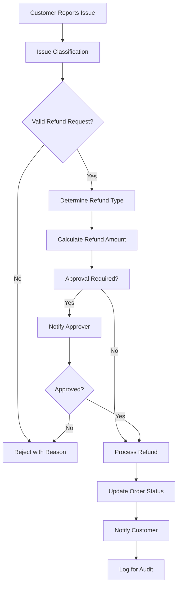

# Software Requirements Specification (SRS)

## Part 05E: Return & Refund Processing

**Module:** Order Fulfillment Module (Part 06)
**Version:** 1.0.0
**Status:** Final / For Review
**Date:** 2026-06-30

---

## Chapter 1 – Overview

### Purpose

The Return & Refund Processing module defines the comprehensive workflows for managing returns, refunds, and financial reversals on the **[Platform Name]** platform. This encompasses customer refund requests, merchant-initiated refunds, return logistics, financial reconciliation, and fraud prevention.

Returns and refunds are critical touchpoints that directly impact customer trust and merchant relationships. A fair, efficient, and transparent refund process builds customer confidence and encourages repeat business. Conversely, a cumbersome or unfair process damages trust and drives customers away. This module ensures that refunds are processed consistently, fairly, and with appropriate controls to prevent abuse.

### Objectives

- Provide clear, transparent refund policies
- Enable efficient refund request and processing
- Support multiple refund methods (wallet, original payment, voucher)
- Handle partial and full refunds appropriately
- Manage return logistics (where applicable)
- Prevent fraud and abuse
- Ensure financial reconciliation accuracy
- Maintain comprehensive audit trails
- Support dispute resolution

---

## Chapter 2 – Refund Framework

### FUL-086 Refund Types

| Type | Description | Priority |
| :--- | :--- | :--- |
| **Full Refund** | Complete refund of order total. | **Required** |
| **Partial Refund** | Refund of specific items/fees. | **Required** |
| **Item Refund** | Refund for specific item(s) only. | **Required** |
| **Fee Refund** | Refund of delivery/service fees. | **Required** |
| **Voucher Refund** | Refund issued as platform voucher. | **Required** |
| **Wallet Refund** | Refund credited to platform wallet. | **Required** |
| **Original Payment Method** | Refund to original card/wallet. | **Required** |

### FUL-087 Refund Methods

| Method | Processing Time | Description | Priority |
| :--- | :--- | :--- | :--- |
| **Wallet** | Instant | Refund to platform wallet. | **Required** |
| **Original Payment Method** | 3-5 business days | Refund to original card/bank. | **Required** |
| **Voucher** | Instant | Refund as platform voucher. | **Required** |
| **Partial Wallet/Original** | Mixed | Part to wallet, part to original. | **Medium** |

### FUL-088 Refund Eligibility

| Scenario | Eligible | Priority |
| :--- | :--- | :--- |
| **Order Cancelled (Merchant)** | Full refund | **Required** |
| **Order Cancelled (Customer - Pre-confirmation)** | Full refund | **Required** |
| **Order Cancelled (Customer - Post-confirmation)** | Partial refund (fees deducted) | **Required** |
| **Missing Items** | Partial refund (items + fee) | **Required** |
| **Wrong Items** | Partial refund (items + fee) | **Required** |
| **Damaged Items** | Partial refund (items + fee) | **Required** |
| **Late Delivery** | Partial refund (fee waiver) | **Required** |
| **Order Not Delivered** | Full refund | **Required** |
| **Quality Issue** | Partial/full refund | **Required** |
| **Customer Changed Mind** | Not eligible (post-confirmation) | **Required** |

---

## Chapter 3 – Refund Request Workflow

### FUL-089 Refund Request Flow

### FUL-090 Refund Request Initiation

| Initiation Method | Description | Priority |
| :--- | :--- | :--- |
| **Customer Self-Service** | Customer initiates via app/portal. | **Required** |
| **Customer Support** | Support initiates on customer behalf. | **Required** |
| **Merchant-Initiated** | Merchant initiates refund. | **Required** |
| **System-Initiated** | Auto-refund for system failures. | **Required** |
| **Dispute Resolution** | Refund from dispute process. | **Required** |

### FUL-091 Refund Request Data

| Attribute | Type | Description |
| :--- | :--- | :--- |
| `request_id` | UUID | Unique identifier |
| `order_id` | UUID | Associated order |
| `customer_id` | UUID | Customer requesting refund |
| `refund_type` | String | FULL/PARTIAL/ITEM/FEE/VOUCHER/WALLET |
| `reason` | String | MISSING_ITEMS/WRONG_ITEMS/DAMAGED/LATE/NOT_DELIVERED/QUALITY/OTHER |
| `description` | Text | Detailed description |
| `requested_amount` | Decimal | Amount requested |
| `approved_amount` | Decimal | Approved refund amount |
| `status` | String | PENDING/APPROVED/REJECTED/PROCESSING/COMPLETED/FAILED |
| `created_at` | Timestamp | Request timestamp |

---

## Chapter 4 – Refund Processing

### FUL-092 Refund Processing Steps

| Step | Description | Priority |
| :--- | :--- | :--- |
| **1. Request Validation** | Validate refund eligibility and request. | **Required** |
| **2. Approval** | Approve/Reject refund request. | **Required** |
| **3. Amount Calculation** | Calculate exact refund amount. | **Required** |
| **4. Method Selection** | Determine refund method. | **Required** |
| **5. Processing** | Process refund via payment provider. | **Required** |
| **6. Confirmation** | Confirm refund completion. | **Required** |
| **7. Notification** | Notify customer of refund. | **Required** |
| **8. Reconciliation** | Reconcile financial records. | **Required** |

### FUL-093 Refund Amount Calculation

| Scenario | Calculation | Priority |
| :--- | :--- | :--- |
| **Full Refund** | Order total = Item subtotal + Delivery fee + Service fee + Tax | **Required** |
| **Missing Item** | Item price + Proportional delivery fee + Proportional service fee + Tax | **Required** |
| **Wrong Item** | Item price + Proportional delivery fee + Proportional service fee + Tax | **Required** |
| **Damaged Item** | Item price + Proportional delivery fee + Proportional service fee + Tax | **Required** |
| **Late Delivery** | Delivery fee only (waived) | **Required** |
| **Non-Delivery** | Order total (full refund) | **Required** |
| **Partial Cancel** | Items cancelled + proportional fees | **Required** |

### FUL-094 Refund Processing Example

| Scenario | Amount | Refund Method |
| :--- | :--- | :--- |
| **Full Refund** | $45.00 | Original Payment Method |
| **Missing Item** | $12.50 (item) + $1.50 (fee) = $14.00 | Wallet |
| **Wrong Item** | $18.00 (item) + $2.00 (fee) = $20.00 | Original Payment Method |
| **Late Delivery** | $5.00 (delivery fee) | Wallet |
| **Non-Delivery** | $45.00 (full order) | Original Payment Method |

---

## Chapter 5 – Return Logistics

### FUL-095 Return Types

| Type | Description | Priority |
| :--- | :--- | :--- |
| **No Return Required** | Refund issued without physical return. | **Required** |
| **Return to Merchant** | Item returned to merchant. | **Required** |
| **Return to Hub** | Item returned to central hub. | **Medium** |
| **Return via Driver** | Driver picks up return item. | **Medium** |
| **Return via Shipping** | Customer ships item back. | **Low** |

### FUL-096 Return Workflow

1.  Return request approved.
2.  Return method determined:
    - **No Return:** Refund processed immediately.
    - **Return to Merchant:** Customer returns item to merchant.
    - **Return via Driver:** Driver picks up item.
3.  If return required:
    - Customer receives return instructions.
    - Return item dropped off/picked up.
    - Merchant confirms receipt.
4.  Refund processed after return confirmation.
5.  Customer notified of refund.

### FUL-097 Return Window

| Scenario | Window | Priority |
| :--- | :--- | :--- |
| **Return to Merchant** | 7 days | **Required** |
| **Return via Driver** | 24 hours | **Medium** |
| **Return via Shipping** | 14 days | **Low** |
| **No Return Required** | N/A | **Required** |

---

## Chapter 6 – Financial Reconciliation

### FUL-098 Reconciliation Steps

| Step | Description | Priority |
| :--- | :--- | :--- |
| **1. Transaction Record** | Record refund transaction. | **Required** |
| **2. Payment Provider Sync** | Sync with payment provider. | **Required** |
| **3. Merchant Adjustment** | Adjust merchant settlement. | **Required** |
| **4. Platform Adjustment** | Adjust platform revenue. | **Required** |
| **5. Tax Adjustment** | Adjust tax records. | **Required** |
| **6. Invoice Adjustment** | Adjust merchant invoice. | **Required** |
| **7. Audit Trail** | Log all adjustments. | **Required** |

### FUL-099 Reconciliation Data Model

| Attribute | Type | Description |
| :--- | :--- | :--- |
| `reconciliation_id` | UUID | Unique identifier |
| `order_id` | UUID | Associated order |
| `refund_id` | UUID | Associated refund |
| `transaction_type` | String | REFUND/ADJUSTMENT/REVERSAL |
| `amount` | Decimal | Amount |
| `merchant_adjustment` | Decimal | Merchant settlement adjustment |
| `platform_adjustment` | Decimal | Platform revenue adjustment |
| `tax_adjustment` | Decimal | Tax adjustment |
| `status` | String | PENDING/PROCESSED/VERIFIED |
| `verified_by` | UUID | Finance verifier |
| `verified_at` | Timestamp | Verification timestamp |
| `created_at` | Timestamp | Creation timestamp |

---

## Chapter 7 – Fraud Prevention

### FUL-100 Fraud Prevention Measures

| Measure | Description | Priority |
| :--- | :--- | :--- |
| **Rate Limiting** | Limit refund frequency per customer. | **Required** |
| **Pattern Detection** | Detect suspicious refund patterns. | **Required** |
| **Account Verification** | Verify customer identity. | **Required** |
| **Order History Review** | Review customer order history. | **Required** |
| **Device Fingerprinting** | Track device fingerprints. | **Required** |
| **IP Tracking** | Track IP addresses for abuse. | **Required** |
| **Manual Review** | Flag suspicious refunds for review. | **Required** |

### FUL-101 Fraud Indicators

| Indicator | Description | Action |
| :--- | :--- | :--- |
| **High Refund Rate** | Customer refund rate > 30% | Flag for review |
| **Multiple Refunds** | > 5 refunds in 30 days | Flag for review |
| **First Order Refund** | Refund on first order | Flag for review |
| **High Value Refund** | Refund > $50 | Flag for review |
| **Pattern Matching** | Pattern matches known fraud | Reject or flag |
| **Discrepancy** | Claimed vs actual items | Flag for review |

### FUL-102 Fraud Review Workflow

1.  Fraud indicator detected.
2.  Refund request flagged for review.
3.  Fraud team reviews:
    - Customer history
    - Order details
    - Device/IP information
    - Pattern analysis
4.  Decision:
    - **Approve:** Process refund.
    - **Reject:** Reject refund with reason.
    - **Investigate:** Further investigation required.
5.  Flagged account logged for future monitoring.

---

## Chapter 8 – Customer Experience

### FUL-103 Refund Communication

| Communication | Timing | Channel | Priority |
| :--- | :--- | :--- | :--- |
| **Refund Request Confirmation** | Immediate | Push/Email | **Required** |
| **Refund Approval Notification** | On approval | Push/Email | **Required** |
| **Refund Rejection Notification** | On rejection | Push/Email | **Required** |
| **Refund Processing Update** | During processing | Push/Email | **Required** |
| **Refund Completion Notification** | On completion | Push/Email | **Required** |
| **Refund Status Inquiry** | On request | App/Portal | **Required** |

### FUL-104 Refund Status Tracking

| Feature | Description | Priority |
| :--- | :--- | :--- |
| **Status Display** | Show refund status in app/portal. | **Required** |
| **Timeline View** | Show refund processing timeline. | **Required** |
| **Amount Breakdown** | Show refund breakdown. | **Required** |
| **Estimated Timeline** | Show expected completion date. | **Required** |
| **Contact Support** | Contact support for refund issues. | **Required** |

---

## Chapter 9 – Database Tables

### refund_requests

| Column | Type | Constraints | Description |
| :--- | :--- | :--- | :--- |
| `request_id` | UUID | PRIMARY KEY | Unique identifier |
| `order_id` | UUID | FOREIGN KEY (orders.order_id) | Associated order |
| `customer_id` | UUID | FOREIGN KEY (customers.customer_id) | Requesting customer |
| `refund_type` | VARCHAR(20) | NOT NULL | FULL/PARTIAL/ITEM/FEE/VOUCHER/WALLET |
| `reason` | VARCHAR(30) | NOT NULL | MISSING_ITEMS/WRONG_ITEMS/DAMAGED/LATE/NOT_DELIVERED/QUALITY/OTHER |
| `description` | TEXT | | Detailed description |
| `requested_amount` | DECIMAL(10, 2) | NOT NULL | Amount requested |
| `approved_amount` | DECIMAL(10, 2) | | Approved amount |
| `refund_method` | VARCHAR(20) | | WALLET/ORIGINAL/VOUCHER |
| `status` | VARCHAR(20) | DEFAULT 'PENDING' | PENDING/APPROVED/REJECTED/PROCESSING/COMPLETED/FAILED |
| `reviewed_by` | UUID | | Admin who reviewed |
| `reviewed_at` | TIMESTAMP | | Review timestamp |
| `processed_by` | UUID | | Admin who processed |
| `processed_at` | TIMESTAMP | | Processing timestamp |
| `completed_at` | TIMESTAMP | | Completion timestamp |
| `failure_reason` | TEXT | | Reason for failure |
| `created_at` | TIMESTAMP | DEFAULT NOW() | Creation timestamp |
| `updated_at` | TIMESTAMP | DEFAULT NOW() | Last update timestamp |

### refund_transactions

| Column | Type | Constraints | Description |
| :--- | :--- | :--- | :--- |
| `transaction_id` | UUID | PRIMARY KEY | Unique identifier |
| `request_id` | UUID | FOREIGN KEY (refund_requests.request_id) | Associated request |
| `payment_provider` | VARCHAR(50) | NOT NULL | stripe/paymob/adyen |
| `provider_transaction_id` | VARCHAR(255) | | Provider reference |
| `amount` | DECIMAL(10, 2) | NOT NULL | Transaction amount |
| `currency` | VARCHAR(3) | NOT NULL | ISO 4217 currency |
| `status` | VARCHAR(20) | NOT NULL | PENDING/SUCCESS/FAILED/REVERSED |
| `failure_reason` | TEXT | | Reason for failure |
| `initiated_at` | TIMESTAMP | | Initiation timestamp |
| `completed_at` | TIMESTAMP | | Completion timestamp |
| `created_at` | TIMESTAMP | DEFAULT NOW() | Creation timestamp |
| `updated_at` | TIMESTAMP | DEFAULT NOW() | Last update timestamp |

### refund_reconciliations

| Column | Type | Constraints | Description |
| :--- | :--- | :--- | :--- |
| `reconciliation_id` | UUID | PRIMARY KEY | Unique identifier |
| `order_id` | UUID | FOREIGN KEY (orders.order_id) | Associated order |
| `refund_id` | UUID | FOREIGN KEY (refund_requests.request_id) | Associated refund |
| `transaction_type` | VARCHAR(20) | NOT NULL | REFUND/ADJUSTMENT/REVERSAL |
| `amount` | DECIMAL(10, 2) | NOT NULL | Amount |
| `merchant_adjustment` | DECIMAL(10, 2) | | Merchant adjustment |
| `platform_adjustment` | DECIMAL(10, 2) | | Platform adjustment |
| `tax_adjustment` | DECIMAL(10, 2) | | Tax adjustment |
| `status` | VARCHAR(20) | DEFAULT 'PENDING' | PENDING/PROCESSED/VERIFIED |
| `verified_by` | UUID | | Finance verifier |
| `verified_at` | TIMESTAMP | | Verification timestamp |
| `created_at` | TIMESTAMP | DEFAULT NOW() | Creation timestamp |
| `updated_at` | TIMESTAMP | DEFAULT NOW() | Last update timestamp |

### refund_fraud_reviews

| Column | Type | Constraints | Description |
| :--- | :--- | :--- | :--- |
| `review_id` | UUID | PRIMARY KEY | Unique identifier |
| `request_id` | UUID | FOREIGN KEY (refund_requests.request_id) | Associated request |
| `fraud_indicators` | JSONB | | Detected fraud indicators |
| `risk_score` | INTEGER | | Risk score (0-100) |
| `status` | VARCHAR(20) | DEFAULT 'OPEN' | OPEN/UNDER_REVIEW/CLEARED/FLAGGED |
| `reviewed_by` | UUID | | Reviewer |
| `review_notes` | TEXT | | Review notes |
| `decision` | VARCHAR(20) | | APPROVE/REJECT/INVESTIGATE |
| `created_at` | TIMESTAMP | DEFAULT NOW() | Creation timestamp |
| `updated_at` | TIMESTAMP | DEFAULT NOW() | Last update timestamp |

### return_requests

| Column | Type | Constraints | Description |
| :--- | :--- | :--- | :--- |
| `return_id` | UUID | PRIMARY KEY | Unique identifier |
| `order_id` | UUID | FOREIGN KEY (orders.order_id) | Associated order |
| `refund_id` | UUID | FOREIGN KEY (refund_requests.request_id) | Associated refund |
| `return_type` | VARCHAR(20) | NOT NULL | TO_MERCHANT/TO_HUB/VIA_DRIVER/VIA_SHIPPING |
| `return_reason` | VARCHAR(30) | NOT NULL | DAMAGED/WRONG_ITEM/QUALITY/OTHER |
| `status` | VARCHAR(20) | DEFAULT 'PENDING' | PENDING/IN_PROGRESS/COMPLETED/CANCELLED |
| `pickup_address` | JSONB | | Pickup address |
| `return_address` | JSONB | | Return address |
| `instructions` | TEXT | | Return instructions |
| `tracking_number` | VARCHAR(100) | | Shipping tracking number |
| `return_window_end` | TIMESTAMP | | Return window end date |
| `pickup_scheduled_at` | TIMESTAMP | | Scheduled pickup time |
| `pickup_completed_at` | TIMESTAMP | | Pickup completion time |
| `received_at` | TIMESTAMP | | Return receipt timestamp |
| `verified_by` | UUID | | Verifier |
| `verified_at` | TIMESTAMP | | Verification timestamp |
| `created_at` | TIMESTAMP | DEFAULT NOW() | Creation timestamp |
| `updated_at` | TIMESTAMP | DEFAULT NOW() | Last update timestamp |

### compensation_vouchers

| Column | Type | Constraints | Description |
| :--- | :--- | :--- | :--- |
| `voucher_id` | UUID | PRIMARY KEY | Unique identifier |
| `customer_id` | UUID | FOREIGN KEY (customers.customer_id) | Associated customer |
| `order_id` | UUID | FOREIGN KEY (orders.order_id) | Associated order |
| `refund_id` | UUID | FOREIGN KEY (refund_requests.request_id) | Associated refund |
| `voucher_code` | VARCHAR(50) | UNIQUE | Unique voucher code |
| `voucher_type` | VARCHAR(20) | NOT NULL | REFUND/COMPENSATION/GESTURE |
| `amount` | DECIMAL(10, 2) | NOT NULL | Voucher amount |
| `currency` | VARCHAR(3) | NOT NULL | ISO 4217 currency |
| `minimum_order` | DECIMAL(10, 2) | DEFAULT 0 | Minimum order for use |
| `expires_at` | TIMESTAMP | NOT NULL | Expiration timestamp |
| `used_at` | TIMESTAMP | | Usage timestamp |
| `used_order_id` | UUID | | Order used on |
| `status` | VARCHAR(20) | DEFAULT 'ACTIVE' | ACTIVE/USED/EXPIRED/CANCELLED |
| `created_by` | UUID | | Creator identifier |
| `created_at` | TIMESTAMP | DEFAULT NOW() | Creation timestamp |
| `updated_at` | TIMESTAMP | DEFAULT NOW() | Last update timestamp |

---

## Chapter 10 – REST APIs

### Refund Request APIs

| Method | Endpoint | Description |
| :--- | :--- | :--- |
| `POST` | `/api/v1/refunds` | Request refund |
| `GET` | `/api/v1/refunds` | List refund requests |
| `GET` | `/api/v1/refunds/{id}` | Get refund details |
| `GET` | `/api/v1/refunds/order/{id}` | Get refunds for order |
| `PUT` | `/api/v1/refunds/{id}/status` | Update refund status (admin) |
| `PUT` | `/api/v1/refunds/{id}/approve` | Approve refund (admin) |
| `PUT` | `/api/v1/refunds/{id}/reject` | Reject refund (admin) |
| `POST` | `/api/v1/refunds/{id}/process` | Process refund (admin) |

### Return APIs

| Method | Endpoint | Description |
| :--- | :--- | :--- |
| `POST` | `/api/v1/returns` | Create return request |
| `GET` | `/api/v1/returns` | List returns |
| `GET` | `/api/v1/returns/{id}` | Get return details |
| `PUT` | `/api/v1/returns/{id}/status` | Update return status |
| `POST` | `/api/v1/returns/{id}/pickup` | Schedule pickup |
| `POST` | `/api/v1/returns/{id}/receive` | Confirm receipt (merchant) |

### Voucher APIs

| Method | Endpoint | Description |
| :--- | :--- | :--- |
| `GET` | `/api/v1/vouchers` | List vouchers |
| `GET` | `/api/v1/vouchers/{id}` | Get voucher details |
| `GET` | `/api/v1/vouchers/validate` | Validate voucher code |
| `POST` | `/api/v1/vouchers` | Create voucher (admin) |

### Reconciliation APIs

| Method | Endpoint | Description |
| :--- | :--- | :--- |
| `GET` | `/api/v1/finance/reconciliations` | List reconciliations |
| `GET` | `/api/v1/finance/reconciliations/{id}` | Get reconciliation details |
| `POST` | `/api/v1/finance/reconciliations/verify` | Verify reconciliation (finance) |

### Fraud APIs

| Method | Endpoint | Description |
| :--- | :--- | :--- |
| `GET` | `/api/v1/fraud/refunds` | Get flagged refunds |
| `GET` | `/api/v1/fraud/refunds/{id}` | Get fraud review details |
| `PUT` | `/api/v1/fraud/refunds/{id}/review` | Review flagged refund |

---

## Chapter 11 – Business Rules

| Rule ID | Rule Description | Priority |
| :--- | :--- | :--- |
| **BR-REF-001** | Refund requests must be submitted within 7 days of delivery. | **High** |
| **BR-REF-002** | Refunds > $50 require manager approval. | **High** |
| **BR-REF-003** | Customer refund rate > 30% triggers fraud review. | **High** |
| **BR-REF-004** | Wallet refunds are instant; card refunds take 3-5 business days. | **High** |
| **BR-REF-005** | Vouchers expire after 30 days. | **High** |
| **BR-REF-006** | Missing item refund = item price + proportional fees. | **High** |
| **BR-REF-007** | Wrong item refund = item price + proportional fees. | **High** |
| **BR-REF-008** | Damaged item refund = item price + proportional fees. | **High** |
| **BR-REF-009** | Late delivery refund = delivery fee only. | **High** |
| **BR-REF-010** | Non-delivery refund = full order total. | **High** |

---

## Chapter 12 – Acceptance Tests

| Test ID | Test Description | Priority |
| :--- | :--- | :--- |
| **TEST-REF-001** | Customer requests full refund for non-delivery. | **High** |
| **TEST-REF-002** | Customer requests partial refund for missing item. | **High** |
| **TEST-REF-003** | Customer requests partial refund for wrong item. | **High** |
| **TEST-REF-004** | Customer requests partial refund for damaged item. | **High** |
| **TEST-REF-005** | Customer requests refund for late delivery. | **High** |
| **TEST-REF-006** | Refund approved by admin. | **High** |
| **TEST-REF-007** | Refund rejected by admin with reason. | **High** |
| **TEST-REF-008** | Refund processed to wallet (instant). | **High** |
| **TEST-REF-009** | Refund processed to original payment method. | **High** |
| **TEST-REF-010** | Refund issued as voucher. | **High** |
| **TEST-REF-011** | Voucher used on future order. | **High** |
| **TEST-REF-012** | Voucher expires after 30 days. | **High** |
| **TEST-REF-013** | Refund amount calculated correctly (missing item). | **High** |
| **TEST-REF-014** | Refund amount calculated correctly (full refund). | **High** |
| **TEST-REF-015** | Refund request > $50 requires manager approval. | **High** |
| **TEST-REF-016** | Customer refund rate > 30% triggers fraud review. | **High** |
| **TEST-REF-017** | Fraud review clears refund. | **High** |
| **TEST-REF-018** | Fraud review rejects refund. | **High** |
| **TEST-REF-019** | Return request created for item return. | **High** |
| **TEST-REF-020** | Return pickup scheduled. | **High** |
| **TEST-REF-021** | Return received by merchant. | **High** |
| **TEST-REF-022** | Refund processed after return receipt. | **High** |
| **TEST-REF-023** | Financial reconciliation updated. | **High** |
| **TEST-REF-024** | Merchant settlement adjusted. | **High** |
| **TEST-REF-025** | Tax records adjusted. | **High** |

---

## Chapter 13 – Traceability Matrix

| Requirement | Database Table | API Endpoint(s) | Acceptance Test |
| :--- | :--- | :--- | :--- |
| FUL-089 | refund_requests | POST /api/v1/refunds | TEST-REF-001, TEST-REF-002, TEST-REF-003, TEST-REF-004, TEST-REF-005 |
| FUL-092 | refund_requests | PUT /api/v1/refunds/{id}/approve | TEST-REF-006 |
| FUL-092 | refund_requests | PUT /api/v1/refunds/{id}/reject | TEST-REF-007 |
| FUL-087 | refund_transactions | PUT /api/v1/refunds/{id}/process | TEST-REF-008, TEST-REF-009 |
| FUL-087 | compensation_vouchers | PUT /api/v1/refunds/{id}/process | TEST-REF-010, TEST-REF-011, TEST-REF-012 |
| FUL-093 | refund_requests | GET /api/v1/refunds/{id} | TEST-REF-013, TEST-REF-014 |
| FUL-089 | refund_requests | PUT /api/v1/refunds/{id}/approve | TEST-REF-015 |
| FUL-100 | refund_fraud_reviews | GET /api/v1/fraud/refunds | TEST-REF-016, TEST-REF-017, TEST-REF-018 |
| FUL-095 | return_requests | POST /api/v1/returns | TEST-REF-019, TEST-REF-020, TEST-REF-021, TEST-REF-022 |
| FUL-098 | refund_reconciliations | GET /api/v1/finance/reconciliations | TEST-REF-023, TEST-REF-024, TEST-REF-025 |

---

## Chapter 14 – Summary

This document establishes the complete return and refund processing capability for the **[Platform Name]** platform. Key takeaways:

- **Comprehensive Refund Types:** Full, partial, item, fee, voucher, wallet, and original payment method refunds.
- **Clear Refund Eligibility:** Well-defined rules for each refund scenario based on order status and issue type.
- **Structured Request Workflow:** Customer-initiated or support-initiated requests with approval workflows and audit trails.
- **Multiple Refund Methods:** Wallet (instant), original payment method (3-5 days), and voucher options.
- **Return Logistics:** Support for no-return, return to merchant, return via driver, and return via shipping.
- **Financial Reconciliation:** Comprehensive reconciliation with merchant adjustments, platform adjustments, and tax adjustments.
- **Fraud Prevention:** Rate limiting, pattern detection, account verification, and manual review for suspicious refunds.
- **Customer Transparency:** Status tracking, timeline view, and communication at each step of the refund process.
- **Audit Trail:** Complete logging of all refund requests, approvals, processing, and reconciliation.

The return and refund processing module ensures that customers are treated fairly when issues arise, building trust and encouraging repeat business while protecting the platform and merchants from abuse.

---

**Next Document:**

`07_Finance_Billing_Module/Part_06A_Financial_Transaction_Processing.md`

*(This transitions from order fulfillment to the finance and billing module, starting with financial transaction processing.)*
