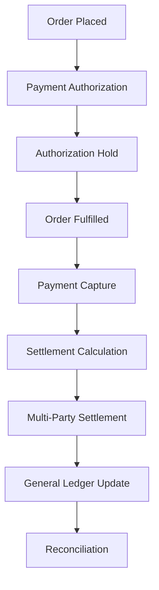
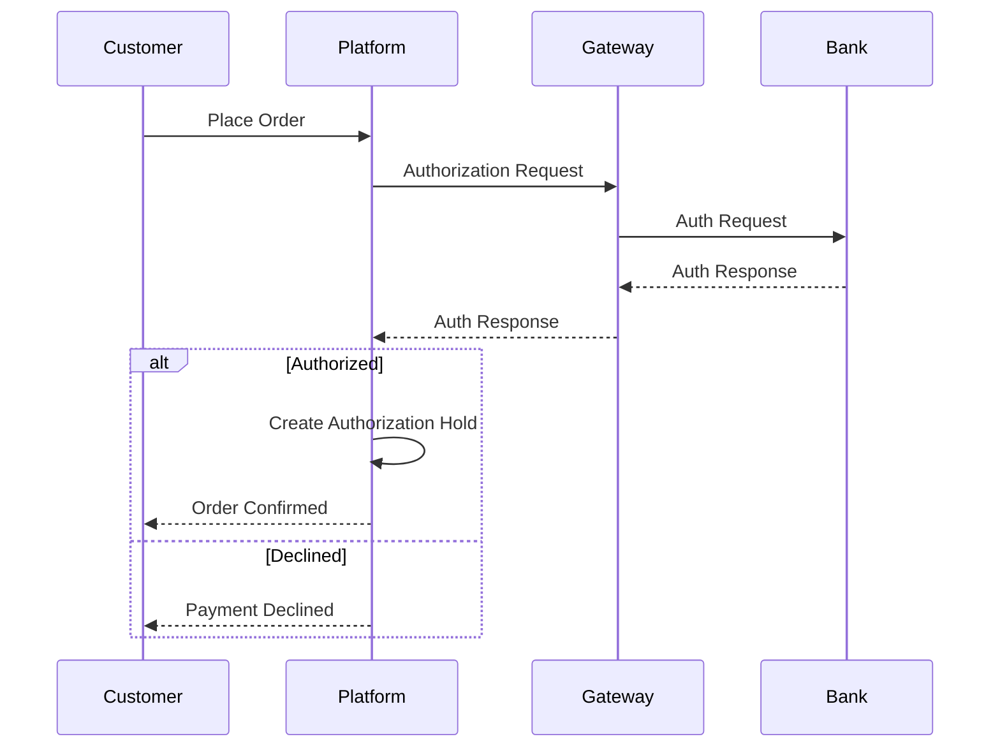
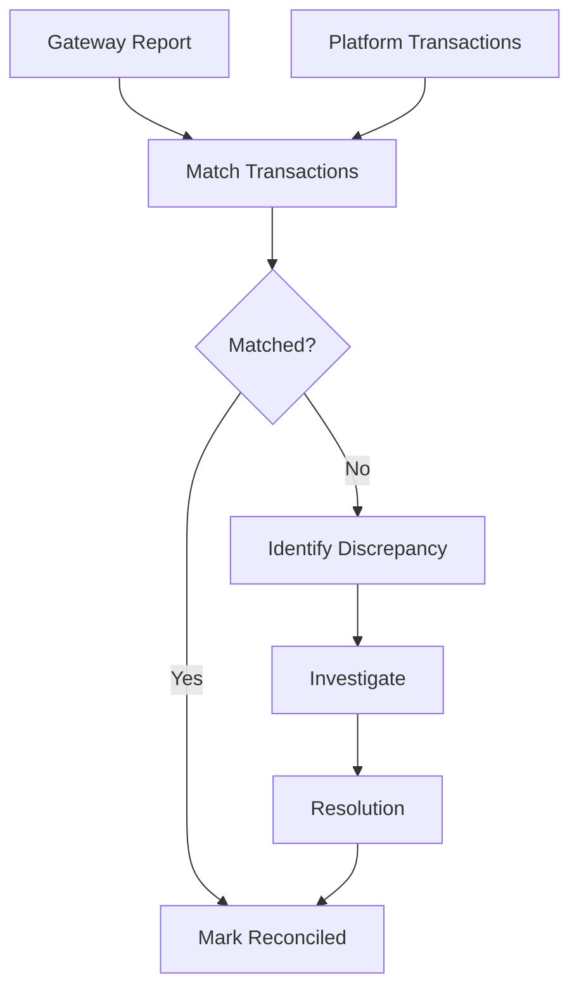

# Software Requirements Specification (SRS)

## Part 06A: Financial Transaction Processing

**Module:** Finance & Billing Module (Part 07)
**Version:** 1.0.0
**Status:** Final / For Review
**Date:** 2026-06-30

---

## Chapter 1 – Overview

### Purpose

The Financial Transaction Processing module defines the core engine that captures, processes, and reconciles all financial transactions on the **[Platform Name]** platform. This encompasses payment authorization and capture, settlement processing, general ledger (GL) accounting, multi-currency handling, and gateway reconciliation.

Financial transaction processing is the backbone of the platform's commercial operations. Every order, commission, settlement, and refund flows through this engine. Accuracy, reliability, and transparency are non-negotiable—errors in financial processing directly impact merchant trust, driver confidence, and platform viability. This module ensures that financial flows are processed with integrity and precision.

### Objectives

- Process all payment transactions securely and accurately
- Manage the complete authorization-to-capture lifecycle
- Support multi-party settlement (customer→merchant, customer→driver)
- Maintain a complete general ledger of all financial activities
- Enable reconciliation with payment gateways
- Support multi-currency transactions with accurate conversion
- Provide idempotent processing for financial operations
- Ensure full audit trail for all financial events

---

## Chapter 2 – Transaction Lifecycle

### FIN-001 Transaction Lifecycle Overview

### FIN-002 Transaction States

| State | Description | Priority |
| :--- | :--- | :--- |
| `INITIATED` | Transaction started, awaiting processing. | **Required** |
| `AUTHORIZED` | Payment authorized (funds reserved). | **Required** |
| `CAPTURED` | Payment captured (funds transferred). | **Required** |
| `SETTLED` | Funds settled to merchant/driver. | **Required** |
| `FAILED` | Transaction failed (retry or fail). | **Required** |
| `REVERSED` | Transaction reversed (cancellation). | **Required** |
| `REFUNDED` | Refund processed. | **Required** |
| `DISPUTED` | Transaction under dispute. | **Required** |
| `RECONCILED` | Transaction reconciled. | **Required** |

### FIN-003 Transaction Types

| Type | Description | Priority |
| :--- | :--- | :--- |
| `AUTHORIZATION` | Pre-authorize payment method. | **Required** |
| `CAPTURE` | Capture authorized payment. | **Required** |
| `REFUND` | Refund payment (full/partial). | **Required** |
| `VOID` | Void authorization before capture. | **Required** |
| `SETTLEMENT` | Multi-party settlement. | **Required** |
| `ADJUSTMENT` | Manual financial adjustment. | **Required** |
| `CHARGEBACK` | Customer-initiated chargeback. | **Required** |
| `FEE` | Platform fee deduction. | **Required** |
| `COMMISSION` | Commission deduction. | **Required** |

---

## Chapter 3 – Payment Authorization & Capture

### FIN-004 Authorization Workflow

### FIN-005 Authorization Rules

| Rule | Description | Priority |
| :--- | :--- | :--- |
| **Amount Validation** | Authorize full order amount. | **Required** |
| **Idempotency** | Duplicate auth requests return same result. | **Required** |
| **Time Limit** | Authorization expires after 7 days if not captured. | **Required** |
| **Fraud Check** | Authorization triggers fraud validation. | **Required** |
| **3DS Compliance** | 3DS2 authentication where required. | **Required** |

### FIN-006 Capture Workflow

1.  Order is fulfilled (delivered).
2.  System initiates capture of authorized amount.
3.  Capture request sent to payment gateway.
4.  Gateway processes capture.
5.  Capture response received.
6.  If successful:
    - Funds transferred.
    - Order financial status updated.
    - Settlement calculation triggered.
7.  If failed:
    - Retry with exponential backoff.
    - Escalate to support if failed.

### FIN-007 Capture Rules

| Rule | Description | Priority |
| :--- | :--- | :--- |
| **Capture Window** | Must capture within 7 days of authorization. | **Required** |
| **Partial Capture** | Support for partial captures (e.g., missing items). | **Required** |
| **Amount Limit** | Cannot exceed authorized amount. | **Required** |
| **Idempotency** | Duplicate capture requests return same result. | **Required** |
| **Retry Logic** | Exponential backoff for failed captures. | **Required** |

---

## Chapter 4 – Multi-Party Settlement

### FIN-008 Settlement Participants

| Participant | Description | Flow | Priority |
| :--- | :--- | :--- | :--- |
| **Customer** | Pays order total. | Outbound | **Required** |
| **Merchant** | Receives commission-adjusted amount. | Inbound | **Required** |
| **Driver** | Receives delivery fee + tips. | Inbound | **Required** |
| **Platform** | Receives commission + service fees. | Inbound | **Required** |
| **Payment Gateway** | Receives processing fees. | Inbound | **Required** |

### FIN-009 Settlement Calculation

| Component | Recipient | Calculation | Priority |
| :--- | :--- | :--- | :--- |
| **Customer Payment** | Customer | - (Order Total) | **Required** |
| **Merchant Revenue** | Merchant | Order Total - Commission - Platform Fees + Delivery Fee (Merchant) | **Required** |
| **Driver Earnings** | Driver | Delivery Fee + Tips + Bonuses | **Required** |
| **Platform Revenue** | Platform | Commission + Service Fees | **Required** |
| **Gateway Fee** | Gateway | Payment Processing Fee | **Required** |

### FIN-010 Settlement Example

| Item | Amount | Recipient |
| :--- | :--- | :--- |
| Order Total | $50.00 | Customer (Debit) |
| Commission (20%) | $10.00 | Platform |
| Service Fee (2%) | $1.00 | Platform |
| Payment Fee (2.9% + $0.30) | $1.75 | Gateway |
| Delivery Fee | $5.00 | Driver |
| Tip | $4.00 | Driver |
| **Merchant Net** | **$31.25** | Merchant |
| **Driver Net** | **$9.00** | Driver |
| **Platform Net** | **$11.00** | Platform |
| **Gateway Net** | **$1.75** | Gateway |

### FIN-011 Settlement Timing

| Recipient | Settlement Delay | Priority |
| :--- | :--- | :--- |
| **Merchant** | T+1 to T+7 days | **Required** |
| **Driver** | T+0 to T+1 days | **Required** |
| **Platform** | Immediate | **Required** |
| **Gateway** | Real-time | **Required** |

---

## Chapter 5 – General Ledger (GL) Accounting

### FIN-012 GL Account Structure

| Account Type | Description | Examples |
| :--- | :--- | :--- |
| **Asset** | Resources owned by platform. | Cash, Receivables, Prepaid |
| **Liability** | Obligations to others. | Payables (Merchant/Driver), Deferred Revenue |
| **Revenue** | Income from operations. | Commission, Service Fees |
| **Expense** | Costs of operations. | Gateway Fees, Support Costs |
| **Equity** | Owner's stake. | Retained Earnings |

### FIN-013 GL Entry Generation

| Transaction | Debit | Credit |
| :--- | :--- | :--- |
| **Order Placed** | Accounts Receivable | Deferred Revenue |
| **Payment Authorized** | No GL entry | No GL entry |
| **Payment Captured** | Cash/Bank | Accounts Receivable |
| **Order Delivered** | Deferred Revenue | Revenue (Sales) |
| **Commission Earned** | Accounts Receivable (Platform) | Revenue (Commission) |
| **Merchant Settlement** | Accounts Payable (Merchant) | Cash/Bank |
| **Driver Payout** | Cash/Bank | Accounts Payable (Driver) |
| **Gateway Fee** | Expense (Gateway Fees) | Cash/Bank |

### FIN-014 GL Entry Rules

| Rule | Description | Priority |
| :--- | :--- | :--- |
| **Double-Entry** | Every transaction has equal debit/credit. | **High** |
| **Audit Trail** | All entries must be timestamped and attributed. | **High** |
| **Non-Reversible** | Entries cannot be deleted; only reversing entries. | **High** |
| **Currency** | Entries recorded in base and transaction currency. | **High** |
| **Reconciliation** | GL must reconcile with gateway reports. | **High** |

---

## Chapter 6 – Multi-Currency Support

### FIN-015 Currency Management

| Feature | Description | Priority |
| :--- | :--- | :--- |
| **Base Currency** | Platform base currency (e.g., USD, AED). | **Required** |
| **Transaction Currency** | Currency used by customer. | **Required** |
| **Settlement Currency** | Currency used by merchant/driver. | **Required** |
| **Exchange Rate Source** | Real-time rate provider. | **Required** |
| **Rate Lock** | Lock rate at time of transaction. | **Required** |
| **Rounding** | Standard rounding to 2 decimals. | **Required** |

### FIN-016 Exchange Rate Handling

| Step | Description | Priority |
| :--- | :--- | :--- |
| **1. Rate Fetch** | Fetch real-time rate from provider. | **Required** |
| **2. Rate Lock** | Lock rate at order confirmation. | **Required** |
| **3. Amount Conversion** | Convert amounts for settlement. | **Required** |
| **4. Rate Logging** | Log rate used for audit. | **Required** |
| **5. FX Gain/Loss** | Track FX gain/loss on settlement. | **Required** |

### FIN-017 Multi-Currency Example

| Step | Amount | Currency | Rate |
| :--- | :--- | :--- | :--- |
| Order Total | $50.00 | USD | N/A |
| Base Currency | 183.50 | AED | 3.67 USD/AED |
| Merchant Settlement | 183.50 | AED | 3.67 USD/AED |
| Platform Revenue | 40.37 | AED | 3.67 USD/AED |

---

## Chapter 7 – Reconciliation

### FIN-018 Reconciliation Process

### FIN-019 Reconciliation Frequency

| Frequency | Description | Priority |
| :--- | :--- | :--- |
| **Daily** | Daily reconciliation with gateway. | **Required** |
| **Weekly** | Weekly financial reconciliation. | **Required** |
| **Monthly** | Monthly close reconciliation. | **Required** |
| **On-Demand** | Ad-hoc reconciliation. | **Required** |

### FIN-020 Reconciliation Checks

| Check | Description | Priority |
| :--- | :--- | :--- |
| **Transaction Count** | Match number of transactions. | **Required** |
| **Total Amount** | Match total settlement amount. | **Required** |
| **Per-Transaction** | Match each transaction ID. | **Required** |
| **Fee Accuracy** | Verify gateway fees. | **Required** |
| **Timing** | Match transaction dates. | **Required** |

---

## Chapter 8 – Idempotency & Integrity

### FIN-021 Idempotency Requirements

| Requirement | Description | Priority |
| :--- | :--- | :--- |
| **Idempotency Key** | All financial requests require idempotency key. | **Required** |
| **Key Format** | UUID or custom format. | **Required** |
| **Key Lifetime** | 24 hours (minimum). | **Required** |
| **Response Caching** | Cache response for same key. | **Required** |
| **Settlement Guard** | Prevent duplicate settlements. | **Required** |

### FIN-022 Data Integrity Measures

| Measure | Description | Priority |
| :--- | :--- | :--- |
| **ACID Compliance** | Transactions are ACID-compliant. | **Required** |
| **Immutable Records** | Financial records cannot be modified. | **Required** |
| **Checksums** | Checksums for batch transfers. | **Required** |
| **Audit Logging** | All changes logged. | **Required** |
| **Time Stamping** | Precise timestamps. | **Required** |

---

## Chapter 9 – Database Tables

### financial_transactions

| Column | Type | Constraints | Description |
| :--- | :--- | :--- | :--- |
| `transaction_id` | UUID | PRIMARY KEY | Unique identifier |
| `order_id` | UUID | FOREIGN KEY (orders.order_id) | Associated order |
| `transaction_type` | VARCHAR(20) | NOT NULL | AUTHORIZATION/CAPTURE/REFUND/VOID/SETTLEMENT/ADJUSTMENT/CHARGEBACK |
| `amount` | DECIMAL(12, 2) | NOT NULL | Transaction amount |
| `currency` | VARCHAR(3) | NOT NULL | ISO 4217 currency |
| `base_currency_amount` | DECIMAL(12, 2) | | Amount in base currency |
| `exchange_rate` | DECIMAL(10, 4) | | Exchange rate applied |
| `status` | VARCHAR(20) | NOT NULL | INITIATED/AUTHORIZED/CAPTURED/SETTLED/FAILED/REVERSED/REFUNDED/DISPUTED/RECONCILED |
| `payment_provider` | VARCHAR(50) | | stripe/paymob/adyen |
| `provider_transaction_id` | VARCHAR(255) | | Provider reference |
| `provider_status` | VARCHAR(50) | | Provider-specific status |
| `idempotency_key` | VARCHAR(255) | UNIQUE | Deduplication key |
| `description` | TEXT | | Transaction description |
| `metadata` | JSONB | | Additional context |
| `initiated_at` | TIMESTAMP | NOT NULL | Initiation timestamp |
| `completed_at` | TIMESTAMP | | Completion timestamp |
| `created_at` | TIMESTAMP | DEFAULT NOW() | Creation timestamp |
| `updated_at` | TIMESTAMP | DEFAULT NOW() | Last update timestamp |

### authorizations

| Column | Type | Constraints | Description |
| :--- | :--- | :--- | :--- |
| `authorization_id` | UUID | PRIMARY KEY | Unique identifier |
| `transaction_id` | UUID | FOREIGN KEY (financial_transactions.transaction_id) | Associated transaction |
| `authorization_code` | VARCHAR(50) | | Provider auth code |
| `auth_expiry` | TIMESTAMP | NOT NULL | Authorization expiry |
| `captured_amount` | DECIMAL(12, 2) | | Amount captured (if any) |
| `capture_status` | VARCHAR(20) | | PENDING/PARTIAL/FULL/FAILED |
| `voided_at` | TIMESTAMP | | Void timestamp |
| `created_at` | TIMESTAMP | DEFAULT NOW() | Creation timestamp |
| `updated_at` | TIMESTAMP | DEFAULT NOW() | Last update timestamp |

### settlement_batches

| Column | Type | Constraints | Description |
| :--- | :--- | :--- | :--- |
| `batch_id` | UUID | PRIMARY KEY | Unique identifier |
| `batch_reference` | VARCHAR(50) | UNIQUE | Human-readable batch reference |
| `settlement_date` | DATE | NOT NULL | Settlement date |
| `total_orders` | INTEGER | NOT NULL | Number of orders |
| `total_amount` | DECIMAL(12, 2) | NOT NULL | Total settlement amount |
| `merchant_amount` | DECIMAL(12, 2) | NOT NULL | Amount to merchants |
| `driver_amount` | DECIMAL(12, 2) | NOT NULL | Amount to drivers |
| `platform_amount` | DECIMAL(12, 2) | NOT NULL | Platform revenue |
| `gateway_fees` | DECIMAL(12, 2) | NOT NULL | Gateway fees |
| `currency` | VARCHAR(3) | NOT NULL | ISO 4217 currency |
| `status` | VARCHAR(20) | DEFAULT 'PENDING' | PENDING/PROCESSING/COMPLETED/FAILED |
| `processed_at` | TIMESTAMP | | Processing timestamp |
| `completed_at` | TIMESTAMP | | Completion timestamp |
| `created_at` | TIMESTAMP | DEFAULT NOW() | Creation timestamp |
| `updated_at` | TIMESTAMP | DEFAULT NOW() | Last update timestamp |

### general_ledger

| Column | Type | Constraints | Description |
| :--- | :--- | :--- | :--- |
| `entry_id` | UUID | PRIMARY KEY | Unique identifier |
| `transaction_id` | UUID | FOREIGN KEY (financial_transactions.transaction_id) | Associated transaction |
| `account_code` | VARCHAR(20) | NOT NULL | GL account code |
| `account_name` | VARCHAR(100) | NOT NULL | GL account name |
| `debit_amount` | DECIMAL(12, 2) | DEFAULT 0 | Debit amount |
| `credit_amount` | DECIMAL(12, 2) | DEFAULT 0 | Credit amount |
| `currency` | VARCHAR(3) | NOT NULL | ISO 4217 currency |
| `entry_date` | DATE | NOT NULL | Entry date |
| `description` | TEXT | | Entry description |
| `created_at` | TIMESTAMP | DEFAULT NOW() | Creation timestamp |

### gateway_webhook_logs

| Column | Type | Constraints | Description |
| :--- | :--- | :--- | :--- |
| `log_id` | UUID | PRIMARY KEY | Unique identifier |
| `gateway` | VARCHAR(50) | NOT NULL | stripe/paymob/adyen |
| `event_type` | VARCHAR(50) | NOT NULL | payment_intent.succeeded/charge.succeeded/charge.refunded/charge.disputed |
| `payload` | JSONB | NOT NULL | Full webhook payload |
| `processed` | BOOLEAN | DEFAULT FALSE | Processing status |
| `processed_at` | TIMESTAMP | | Processing timestamp |
| `transaction_id` | UUID | FOREIGN KEY (financial_transactions.transaction_id) | Associated transaction |
| `created_at` | TIMESTAMP | DEFAULT NOW() | Creation timestamp |

### reconciliation_records

| Column | Type | Constraints | Description |
| :--- | :--- | :--- | :--- |
| `reconciliation_id` | UUID | PRIMARY KEY | Unique identifier |
| `reconciliation_date` | DATE | NOT NULL | Date of reconciliation |
| `gateway` | VARCHAR(50) | NOT NULL | Payment provider |
| `gateway_file_reference` | VARCHAR(255) | | Gateway report reference |
| `total_platform_transactions` | INTEGER | | Count on platform |
| `total_gateway_transactions` | INTEGER | | Count on gateway |
| `total_platform_amount` | DECIMAL(12, 2) | | Amount on platform |
| `total_gateway_amount` | DECIMAL(12, 2) | | Amount on gateway |
| `discrepancy_count` | INTEGER | | Number of discrepancies |
| `discrepancy_amount` | DECIMAL(12, 2) | | Total discrepancy amount |
| `status` | VARCHAR(20) | DEFAULT 'PENDING' | PENDING/IN_PROGRESS/RECONCILED/DISCREPANT |
| `reconciled_by` | UUID | | Reconciler identifier |
| `reconciled_at` | TIMESTAMP | | Reconciliation timestamp |
| `notes` | TEXT | | Notes on reconciliation |
| `created_at` | TIMESTAMP | DEFAULT NOW() | Creation timestamp |
| `updated_at` | TIMESTAMP | DEFAULT NOW() | Last update timestamp |

---

## Chapter 10 – REST APIs

### Transaction APIs

| Method | Endpoint | Description |
| :--- | :--- | :--- |
| `POST` | `/api/v1/finance/authorize` | Authorize payment |
| `POST` | `/api/v1/finance/capture` | Capture authorized payment |
| `POST` | `/api/v1/finance/void` | Void authorization |
| `POST` | `/api/v1/finance/refund` | Process refund |
| `GET` | `/api/v1/finance/transactions` | List transactions |
| `GET` | `/api/v1/finance/transactions/{id}` | Get transaction details |
| `GET` | `/api/v1/finance/transactions/order/{id}` | Get transactions for order |

### Settlement APIs

| Method | Endpoint | Description |
| :--- | :--- | :--- |
| `GET` | `/api/v1/finance/settlements` | List settlements |
| `GET` | `/api/v1/finance/settlements/{id}` | Get settlement details |
| `POST` | `/api/v1/finance/settlements/process` | Process settlement batch (admin) |
| `GET` | `/api/v1/finance/settlements/pending` | Get pending settlements |

### Reconciliation APIs

| Method | Endpoint | Description |
| :--- | :--- | :--- |
| `GET` | `/api/v1/finance/reconciliation` | List reconciliations |
| `GET` | `/api/v1/finance/reconciliation/{id}` | Get reconciliation details |
| `POST` | `/api/v1/finance/reconciliation` | Create reconciliation (admin) |
| `PUT` | `/api/v1/finance/reconciliation/{id}/reconcile` | Execute reconciliation (admin) |

### GL APIs

| Method | Endpoint | Description |
| :--- | :--- | :--- |
| `GET` | `/api/v1/finance/gl` | Get GL entries |
| `GET` | `/api/v1/finance/gl/accounts` | Get GL accounts |
| `GET` | `/api/v1/finance/gl/balance` | Get account balance |

### Webhook APIs

| Method | Endpoint | Description |
| :--- | :--- | :--- |
| `POST` | `/api/v1/webhooks/gateway` | Gateway webhook endpoint |
| `POST` | `/api/v1/webhooks/gateway/retry` | Retry failed webhook |

---

## Chapter 11 – Business Rules

| Rule ID | Rule Description | Priority |
| :--- | :--- | :--- |
| **BR-FIN-001** | All financial transactions require an idempotency key. | **High** |
| **BR-FIN-002** | Authorization expires after 7 days if not captured. | **High** |
| **BR-FIN-003** | Capture amount cannot exceed authorization amount. | **High** |
| **BR-FIN-004** | Partial captures are supported. | **High** |
| **BR-FIN-005** | Settlement batches must balance to zero (debit = credit). | **High** |
| **BR-FIN-006** | GL entries must follow double-entry accounting. | **High** |
| **BR-FIN-007** | Exchange rates are locked at order confirmation. | **High** |
| **BR-FIN-008** | Daily reconciliation must be performed. | **High** |
| **BR-FIN-009** | Financial records are immutable (append-only). | **High** |
| **BR-FIN-010** | Gateway webhooks must be idempotent. | **High** |

---

## Chapter 12 – Acceptance Tests

| Test ID | Test Description | Priority |
| :--- | :--- | :--- |
| **TEST-FIN-001** | Payment authorization succeeds for valid payment method. | **High** |
| **TEST-FIN-002** | Payment authorization fails for invalid payment method. | **High** |
| **TEST-FIN-003** | Capture succeeds for authorized payment. | **High** |
| **TEST-FIN-004** | Capture fails for expired authorization. | **High** |
| **TEST-FIN-005** | Partial capture processes correctly. | **High** |
| **TEST-FIN-006** | Void cancels authorization before capture. | **High** |
| **TEST-FIN-007** | Full refund processes correctly. | **High** |
| **TEST-FIN-008** | Partial refund processes correctly. | **High** |
| **TEST-FIN-009** | Settlement calculation is correct for single order. | **High** |
| **TEST-FIN-010** | Settlement calculation is correct for multiple orders. | **High** |
| **TEST-FIN-011** | Settlement batch processes correctly. | **High** |
| **TEST-FIN-012** | GL entries generated correctly for order. | **High** |
| **TEST-FIN-013** | GL entries balance (debit = credit). | **High** |
| **TEST-FIN-014** | Multi-currency conversion correct. | **High** |
| **TEST-FIN-015** | Exchange rate locked at order confirmation. | **High** |
| **TEST-FIN-016** | Daily reconciliation matches gateway. | **High** |
| **TEST-FIN-017** | Discrepancy identified and resolved. | **High** |
| **TEST-FIN-018** | Idempotency key prevents duplicate authorization. | **High** |
| **TEST-FIN-019** | Idempotency key prevents duplicate capture. | **High** |
| **TEST-FIN-020** | Gateway webhook processes correctly. | **High** |
| **TEST-FIN-021** | Webhook retry succeeds after failure. | **High** |
| **TEST-FIN-022** | Merchant settlement amount correct. | **High** |
| **TEST-FIN-023** | Driver settlement amount correct. | **High** |
| **TEST-FIN-024** | Platform revenue correct. | **High** |
| **TEST-FIN-025** | Gateway fees deducted correctly. | **High** |

---

## Chapter 13 – Traceability Matrix

| Requirement | Database Table | API Endpoint(s) | Acceptance Test |
| :--- | :--- | :--- | :--- |
| FIN-004 | financial_transactions | POST /api/v1/finance/authorize | TEST-FIN-001, TEST-FIN-002 |
| FIN-006 | authorizations | POST /api/v1/finance/capture | TEST-FIN-003, TEST-FIN-004, TEST-FIN-005 |
| FIN-004 | authorizations | POST /api/v1/finance/void | TEST-FIN-006 |
| FIN-003 | financial_transactions | POST /api/v1/finance/refund | TEST-FIN-007, TEST-FIN-008 |
| FIN-009 | settlement_batches | POST /api/v1/finance/settlements/process | TEST-FIN-009, TEST-FIN-010, TEST-FIN-011 |
| FIN-012 | general_ledger | GET /api/v1/finance/gl | TEST-FIN-012, TEST-FIN-013 |
| FIN-015 | financial_transactions | GET /api/v1/finance/transactions | TEST-FIN-014, TEST-FIN-015 |
| FIN-018 | reconciliation_records | POST /api/v1/finance/reconciliation | TEST-FIN-016, TEST-FIN-017 |
| FIN-021 | financial_transactions | POST /api/v1/finance/authorize | TEST-FIN-018, TEST-FIN-019 |
| FIN-003 | gateway_webhook_logs | POST /api/v1/webhooks/gateway | TEST-FIN-020, TEST-FIN-021 |

---

## Chapter 14 – Summary

This document establishes the complete financial transaction processing capability for the **[Platform Name]** platform. Key takeaways:

- **Transaction Lifecycle:** Clear management of authorization→capture→settlement→reconciliation flow.
- **Authorization & Capture:** Secure payment processing with idempotency, 3DS compliance, and partial capture support.
- **Multi-Party Settlement:** Automated calculation and distribution of funds to merchants, drivers, platform, and gateways.
- **General Ledger Accounting:** Double-entry accounting with complete audit trail and immutability.
- **Multi-Currency Support:** Real-time exchange rates with rate locking at transaction time.
- **Reconciliation:** Daily, weekly, and monthly reconciliation with gateway reports and discrepancy handling.
- **Idempotency:** Duplicate prevention for all financial operations.
- **Webhook Processing:** Reliable gateway webhook handling with retry logic.

The financial transaction processing module is the financial backbone of the platform. Accuracy, reliability, and transparency in financial processing are essential for maintaining trust with merchants, drivers, and customers.

---

**Next Document:**

`Part_06B_Merchant_Settlement.md`

*(This builds on transaction processing to define merchant settlement workflows, including payment schedules, reporting, and reconciliation.)*