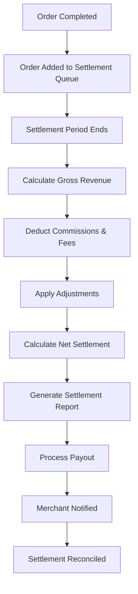
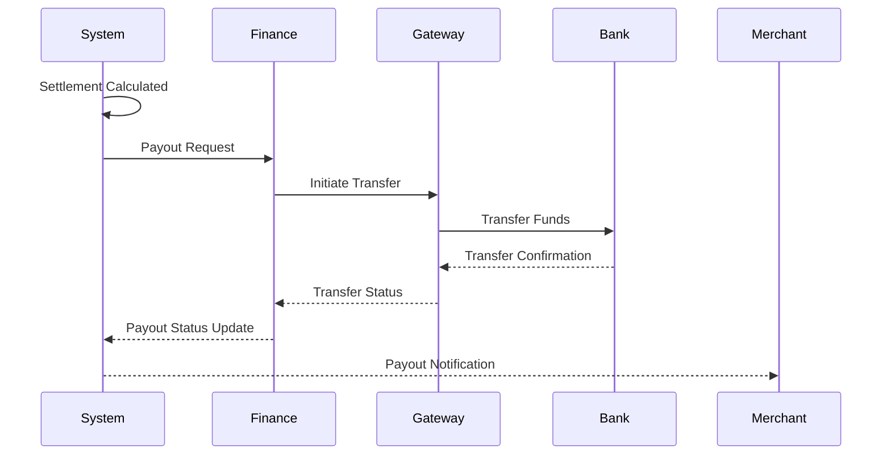

# Software Requirements Specification (SRS)

## Part 06B: Merchant Settlement

**Module:** Finance & Billing Module (Part 07)
**Version:** 1.0.0
**Status:** Final / For Review
**Date:** 2026-06-30

---

## Chapter 1 – Overview

### Purpose

The Merchant Settlement module defines the complete financial settlement lifecycle for merchants on the **[Platform Name]** platform. This encompasses settlement calculation, payment schedules, payout execution, financial reporting, reconciliation, and dispute handling.

Merchant settlement is the single most important financial touchpoint for merchants. Timely, accurate, and transparent settlements are fundamental to merchant trust and retention. Merchants who receive predictable, clear, and fair payments are more likely to remain loyal to the platform and recommend it to others. This module ensures that merchants have complete visibility into their earnings and receive their funds reliably and on time.

### Objectives

- Provide transparent, accurate settlement calculations
- Support flexible settlement schedules (daily, weekly, biweekly, monthly)
- Enable real-time earnings visibility
- Deliver professional, detailed settlement reports
- Support multiple payout methods and currencies
- Handle disputes and adjustments fairly
- Ensure financial reconciliation accuracy
- Maintain comprehensive audit trails

---

## Chapter 2 – Settlement Overview

### MER-SET-001 Settlement Lifecycle



### MER-SET-002 Settlement Components

| Component | Description | Priority |
| :--- | :--- | :--- |
| **Gross Revenue** | Total order value (items + delivery fees). | **Required** |
| **Commission** | Percentage-based platform fee. | **Required** |
| **Service Fee** | Fixed or percentage-based service fee. | **Required** |
| **Delivery Fee** | Delivery fee (may be retained or passed). | **Required** |
| **Payment Processing Fee** | Gateway fees for payment processing. | **Required** |
| **Promotions/Discounts** | Discounts absorbed by merchant (if applicable). | **Required** |
| **Adjustments** | Manual credits or debits. | **Required** |
| **Tax** | Tax collected on behalf of government. | **Required** |
| **Net Settlement** | Amount paid to merchant. | **Required** |

---

## Chapter 3 – Settlement Schedule

### MER-SET-003 Settlement Frequencies

| Frequency | Description | Processing Time | Priority |
| :--- | :--- | :--- | :--- |
| **Daily** | Settlement every business day. | T+1 | **Required** |
| **Weekly** | Settlement weekly (e.g., every Monday). | T+1 | **Required** |
| **Biweekly** | Settlement every two weeks. | T+1 | **Required** |
| **Monthly** | Settlement monthly (e.g., 1st of month). | T+1 | **Required** |
| **Threshold-Based** | Settlement when balance exceeds threshold. | T+1 | **Medium** |

### MER-SET-004 Settlement Periods

| Period | Description | Priority |
| :--- | :--- | :--- |
| **Daily Cutoff** | Orders completed before 11:59 PM settled next day. | **Required** |
| **Weekly Cutoff** | Orders completed Sunday-Saturday settled Monday. | **Required** |
| **Monthly Cutoff** | Orders completed 1st-last day settled 1st of next month. | **Required** |
| **Holiday Adjustment** | Settlements adjusted for bank holidays. | **Required** |

### MER-SET-005 Settlement Dates

| Parameter | Description | Priority |
| :--- | :--- | :--- |
| **Settlement Date** | Date settlement is calculated. | **Required** |
| **Payout Date** | Date funds are transferred to merchant. | **Required** |
| **Value Date** | Date funds are available to merchant. | **Required** |
| **Reporting Date** | Date settlement report is generated. | **Required** |

---

## Chapter 4 – Settlement Calculation

### MER-SET-006 Calculation Formula

```
Net Settlement = Gross Revenue
    - Commission
    - Service Fees
    - Delivery Fees (Platform Retained)
    - Payment Processing Fees
    - Promotions/Discounts (Merchant-Funded)
    + Adjustments (Credits)
    - Adjustments (Debits)
    - Tax (Remitted to Government)
```

### MER-SET-007 Calculation Example

| Component | Amount | Notes |
| :--- | :--- | :--- |
| **Gross Revenue** | $1,000.00 | Sum of all order totals |
| **Commission (20%)** | ($200.00) | Platform commission |
| **Service Fee (2%)** | ($20.00) | Platform service fee |
| **Delivery Fee (Retained)** | ($50.00) | Delivery fees retained by platform |
| **Payment Processing Fee** | ($30.00) | Gateway fees (2.9% + $0.30) |
| **Promotions/Discounts** | ($25.00) | Merchant-funded promotions |
| **Adjustments** | $10.00 | Manual credit |
| **Tax Collected** | $50.00 | Tax (remitted separately) |
| **Net Settlement** | **$685.00** | Amount paid to merchant |

### MER-SET-008 Settlement Data Model

| Attribute | Type | Required | Description |
| :--- | :--- | :--- | :--- |
| `settlement_id` | UUID | Yes | Unique identifier |
| `merchant_id` | UUID | Yes | Associated merchant |
| `store_id` | UUID | Yes | Associated store |
| `period_start` | Date | Yes | Settlement period start |
| `period_end` | Date | Yes | Settlement period end |
| `order_count` | Integer | Yes | Number of orders |
| `gross_revenue` | Decimal | Yes | Total order value |
| `total_commission` | Decimal | Yes | Commission deducted |
| `total_service_fee` | Decimal | Yes | Service fees deducted |
| `total_delivery_fee_retained` | Decimal | Yes | Delivery fees retained |
| `total_payment_fee` | Decimal | Yes | Payment processing fees |
| `total_promotions` | Decimal | Yes | Promotions/discounts |
| `total_adjustments` | Decimal | Yes | Manual adjustments |
| `total_tax` | Decimal | Yes | Tax collected |
| `net_amount` | Decimal | Yes | Net settlement amount |
| `currency` | String | Yes | ISO 4217 currency |
| `status` | String | Yes | PENDING/PROCESSING/COMPLETED/FAILED |
| `settlement_date` | Date | | Date processed |
| `payout_id` | UUID | | Reference to payout |
| `created_at` | Timestamp | Yes | Creation timestamp |
| `updated_at` | Timestamp | Yes | Last update timestamp |

---

## Chapter 5 – Settlement Reporting

### MER-SET-009 Settlement Report Features

| Feature | Description | Priority |
| :--- | :--- | :--- |
| **Order Breakdown** | Per-order breakdown of settlement. | **Required** |
| **Fee Breakdown** | Detailed fee breakdown. | **Required** |
| **Commission Breakdown** | Commission calculation details. | **Required** |
| **Tax Summary** | Tax collected and remitted. | **Required** |
| **Adjustments** | Manual adjustments details. | **Required** |
| **Download Formats** | PDF, CSV, Excel. | **Required** |
| **Email Delivery** | Auto-email report to merchant. | **Required** |
| **Dashboard View** | Settlement summary in dashboard. | **Required** |

### MER-SET-010 Settlement Report Structure

| Section | Content | Priority |
| :--- | :--- | :--- |
| **Header** | Merchant name, settlement ID, period. | **Required** |
| **Summary** | Gross revenue, deductions, net settlement. | **Required** |
| **Order List** | All orders with amounts and fees. | **Required** |
| **Fee Summary** | Commission, service fees, payment fees. | **Required** |
| **Tax Summary** | Tax collected and remitted. | **Required** |
| **Adjustments** | Manual adjustments. | **Required** |
| **Payout Details** | Payout method, amount, date. | **Required** |

### MER-SET-011 Settlement Data Model (Order Breakdown)

| Attribute | Type | Description |
| :--- | :--- | :--- |
| `detail_id` | UUID | Unique identifier |
| `settlement_id` | UUID | Associated settlement |
| `order_id` | UUID | Associated order |
| `order_date` | Date | Order date |
| `order_total` | Decimal | Order total |
| `commission` | Decimal | Commission deducted |
| `fees` | Decimal | Fees deducted |
| `net_amount` | Decimal | Net amount for this order |
| `created_at` | Timestamp | Creation timestamp |

---

## Chapter 6 – Payout Execution

### MER-SET-012 Payout Methods

| Method | Description | Processing Time | Priority |
| :--- | :--- | :--- | :--- |
| **Bank Transfer** | Direct deposit to merchant bank account. | 1-3 business days | **Required** |
| **Digital Wallet** | Payout to platform wallet. | Instant | **Required** |
| **Wire Transfer** | International wire transfer. | 2-5 business days | **Medium** |
| **Local Payment Rails** | Region-specific payment methods. | 1-2 business days | **Required** |

### MER-SET-013 Payout Processing



### MER-SET-014 Payout Statuses

| Status | Description | Priority |
| :--- | :--- | :--- |
| `PENDING` | Payout queued for processing. | **Required** |
| `PROCESSING` | Payout being processed. | **Required** |
| `COMPLETED` | Payout successfully completed. | **Required** |
| `FAILED` | Payout failed (retry initiated). | **Required** |
| `REJECTED` | Payout rejected by payment provider. | **Required** |
| `REVERSED` | Payout was reversed. | **Required** |

### MER-SET-015 Payout Rules

| Rule | Description | Priority |
| :--- | :--- | :--- |
| **Minimum Amount** | Minimum payout: $10 (configurable). | **Required** |
| **Bank Verification** | Bank account must be verified. | **Required** |
| **Currency Match** | Payout currency matches merchant's bank account. | **Required** |
| **Holiday Handling** | Payouts delayed for bank holidays. | **Required** |
| **Failed Retry** | Retry failed payouts up to 3 times. | **Required** |

---

## Chapter 7 – Adjustments & Disputes

### MER-SET-016 Adjustment Types

| Type | Description | Priority |
| :--- | :--- | :--- |
| **Credit** | Manual credit to merchant. | **Required** |
| **Debit** | Manual debit from merchant. | **Required** |
| **Commission Adjustment** | Adjust commission for an order. | **Required** |
| **Fee Adjustment** | Adjust fees for an order. | **Required** |
| **Refund Adjustment** | Adjust for refunds. | **Required** |
| **Chargeback Adjustment** | Adjust for chargebacks. | **Required** |
| **Bonus/Incentive** | Bonus or incentive credit. | **Required** |

### MER-SET-017 Adjustment Workflow

1.  Adjustment need identified.
2.  Request submitted (admin).
3.  Adjustment validated and approved.
4.  Settlement updated.
5.  Merchant notified.
6.  Adjustment logged for audit.

### MER-SET-018 Dispute Handling

| Dispute Type | Description | Resolution |
| :--- | :--- | :--- |
| **Commission Dispute** | Merchant disputes commission calculation. | Review order details; adjust if valid. |
| **Fee Dispute** | Merchant disputes fee calculation. | Review fee structure; adjust if valid. |
| **Order Dispute** | Merchant disputes order inclusion/exclusion. | Verify order status; adjust if valid. |
| **Refund Dispute** | Merchant disputes refund amount. | Review refund details; adjust if valid. |

---

## Chapter 8 – Tax Handling

### MER-SET-019 Tax Components

| Component | Description | Priority |
| :--- | :--- | :--- |
| **Tax Collected** | Tax collected from customers. | **Required** |
| **Tax Remitted** | Tax remitted to government. | **Required** |
| **Tax Rate** | Applicable tax rate (VAT/GST). | **Required** |
| **Tax Exemption** | Tax-exempt items/customers. | **Required** |
| **Tax Reporting** | Tax reporting and filing. | **Required** |

### MER-SET-020 Tax Calculation

| Scenario | Calculation | Priority |
| :--- | :--- | :--- |
| **Standard Tax** | Subtotal × Tax Rate | **Required** |
| **Tax-Exempt** | No tax charged | **Required** |
| **Mixed Tax** | Taxable and exempt items | **Required** |
| **Multi-Jurisdiction** | Different rates per region | **Required** |
| **Tax Rounding** | Round to 2 decimals | **Required** |

---

## Chapter 9 – Reconciliation

### MER-SET-021 Merchant Reconciliation

| Step | Description | Priority |
| :--- | :--- | :--- |
| **1. Settlement Review** | Merchant reviews settlement report. | **Required** |
| **2. Order Verification** | Merchant verifies all orders included. | **Required** |
| **3. Fee Verification** | Merchant verifies fees deducted. | **Required** |
| **4. Discrepancy Reporting** | Merchant reports discrepancies. | **Required** |
| **5. Investigation** | Platform investigates discrepancies. | **Required** |
| **6. Resolution** | Discrepancies resolved. | **Required** |
| **7. Confirmation** | Merchant confirms reconciliation. | **Required** |

### MER-SET-022 Reconciliation Timeline

| Milestone | Timing | Priority |
| :--- | :--- | :--- |
| **Settlement Report** | Day T | **Required** |
| **Review Period** | T+1 to T+3 | **Required** |
| **Discrepancy Reporting** | T+3 | **Required** |
| **Resolution** | T+7 | **Required** |
| **Reconciliation Confirmation** | T+7 | **Required** |

---

## Chapter 10 – Database Tables

### merchant_settlements

| Column | Type | Constraints | Description |
| :--- | :--- | :--- | :--- |
| `settlement_id` | UUID | PRIMARY KEY | Unique identifier |
| `merchant_id` | UUID | FOREIGN KEY (merchant_accounts.merchant_id) | Associated merchant |
| `store_id` | UUID | FOREIGN KEY (merchant_stores.store_id) | Associated store |
| `period_start` | DATE | NOT NULL | Period start |
| `period_end` | DATE | NOT NULL | Period end |
| `order_count` | INTEGER | NOT NULL | Number of orders |
| `gross_revenue` | DECIMAL(12, 2) | NOT NULL | Total order value |
| `total_commission` | DECIMAL(12, 2) | NOT NULL | Commission deducted |
| `total_service_fee` | DECIMAL(12, 2) | DEFAULT 0 | Service fees deducted |
| `total_delivery_fee_retained` | DECIMAL(12, 2) | DEFAULT 0 | Delivery fees retained |
| `total_payment_fee` | DECIMAL(12, 2) | DEFAULT 0 | Payment processing fees |
| `total_promotions` | DECIMAL(12, 2) | DEFAULT 0 | Promotions/discounts |
| `total_adjustments` | DECIMAL(12, 2) | DEFAULT 0 | Manual adjustments |
| `total_tax` | DECIMAL(12, 2) | DEFAULT 0 | Tax collected |
| `net_amount` | DECIMAL(12, 2) | NOT NULL | Net settlement amount |
| `currency` | VARCHAR(3) | NOT NULL | ISO 4217 currency |
| `status` | VARCHAR(20) | DEFAULT 'PENDING' | PENDING/PROCESSING/COMPLETED/FAILED |
| `settlement_date` | DATE | | Date processed |
| `payout_id` | UUID | | Reference to payout |
| `created_at` | TIMESTAMP | DEFAULT NOW() | Creation timestamp |
| `updated_at` | TIMESTAMP | DEFAULT NOW() | Last update timestamp |

### merchant_settlement_details

| Column | Type | Constraints | Description |
| :--- | :--- | :--- | :--- |
| `detail_id` | UUID | PRIMARY KEY | Unique identifier |
| `settlement_id` | UUID | FOREIGN KEY (merchant_settlements.settlement_id) | Associated settlement |
| `order_id` | UUID | FOREIGN KEY (orders.order_id) | Associated order |
| `order_date` | DATE | NOT NULL | Order date |
| `order_total` | DECIMAL(12, 2) | NOT NULL | Order total |
| `commission` | DECIMAL(12, 2) | NOT NULL | Commission deducted |
| `service_fee` | DECIMAL(12, 2) | DEFAULT 0 | Service fee deducted |
| `delivery_fee_retained` | DECIMAL(12, 2) | DEFAULT 0 | Delivery fee retained |
| `payment_fee` | DECIMAL(12, 2) | DEFAULT 0 | Payment fee |
| `promotions` | DECIMAL(12, 2) | DEFAULT 0 | Promotions |
| `adjustments` | DECIMAL(12, 2) | DEFAULT 0 | Adjustments |
| `tax` | DECIMAL(12, 2) | DEFAULT 0 | Tax |
| `net_amount` | DECIMAL(12, 2) | NOT NULL | Net amount for order |
| `created_at` | TIMESTAMP | DEFAULT NOW() | Creation timestamp |

### merchant_payouts

| Column | Type | Constraints | Description |
| :--- | :--- | :--- | :--- |
| `payout_id` | UUID | PRIMARY KEY | Unique identifier |
| `merchant_id` | UUID | FOREIGN KEY (merchant_accounts.merchant_id) | Associated merchant |
| `settlement_id` | UUID | FOREIGN KEY (merchant_settlements.settlement_id) | Associated settlement |
| `bank_account_id` | UUID | FOREIGN KEY (merchant_bank_accounts.bank_account_id) | Destination bank account |
| `amount` | DECIMAL(12, 2) | NOT NULL | Payout amount |
| `currency` | VARCHAR(3) | NOT NULL | ISO 4217 currency |
| `payout_method` | VARCHAR(30) | NOT NULL | BANK_TRANSFER/WALLET/WIRE/LOCAL |
| `reference_number` | VARCHAR(50) | UNIQUE | Platform reference |
| `transaction_id` | VARCHAR(100) | | Payment provider transaction ID |
| `status` | VARCHAR(20) | DEFAULT 'PENDING' | PENDING/PROCESSING/COMPLETED/FAILED/REJECTED/REVERSED |
| `failure_reason` | TEXT | | Reason for failure |
| `initiated_at` | TIMESTAMP | | Initiation timestamp |
| `completed_at` | TIMESTAMP | | Completion timestamp |
| `created_at` | TIMESTAMP | DEFAULT NOW() | Creation timestamp |
| `updated_at` | TIMESTAMP | DEFAULT NOW() | Last update timestamp |

### merchant_adjustments

| Column | Type | Constraints | Description |
| :--- | :--- | :--- | :--- |
| `adjustment_id` | UUID | PRIMARY KEY | Unique identifier |
| `merchant_id` | UUID | FOREIGN KEY (merchant_accounts.merchant_id) | Associated merchant |
| `settlement_id` | UUID | FOREIGN KEY (merchant_settlements.settlement_id) | Associated settlement |
| `order_id` | UUID | FOREIGN KEY (orders.order_id) | Associated order |
| `adjustment_type` | VARCHAR(30) | NOT NULL | CREDIT/DEBIT/COMMISSION/FEE/REFUND/CHARGEBACK/BONUS |
| `amount` | DECIMAL(12, 2) | NOT NULL | Adjustment amount |
| `currency` | VARCHAR(3) | NOT NULL | ISO 4217 currency |
| `reason` | TEXT | NOT NULL | Reason for adjustment |
| `approved_by` | UUID | | Admin who approved |
| `approved_at` | TIMESTAMP | | Approval timestamp |
| `status` | VARCHAR(20) | DEFAULT 'PENDING' | PENDING/APPROVED/REJECTED/PROCESSED |
| `processed_at` | TIMESTAMP | | Processing timestamp |
| `created_at` | TIMESTAMP | DEFAULT NOW() | Creation timestamp |
| `updated_at` | TIMESTAMP | DEFAULT NOW() | Last update timestamp |

### merchant_reconciliation

| Column | Type | Constraints | Description |
| :--- | :--- | :--- | :--- |
| `reconciliation_id` | UUID | PRIMARY KEY | Unique identifier |
| `merchant_id` | UUID | FOREIGN KEY (merchant_accounts.merchant_id) | Associated merchant |
| `settlement_id` | UUID | FOREIGN KEY (merchant_settlements.settlement_id) | Associated settlement |
| `reconciliation_date` | DATE | NOT NULL | Reconciliation date |
| `status` | VARCHAR(20) | DEFAULT 'PENDING' | PENDING/IN_REVIEW/RECONCILED/DISCREPANT |
| `merchant_notes` | TEXT | | Notes from merchant |
| `platform_notes` | TEXT | | Notes from platform |
| `discrepancy_count` | INTEGER | | Number of discrepancies |
| `discrepancy_amount` | DECIMAL(12, 2) | | Total discrepancy amount |
| `reconciled_by` | UUID | | Reconciler identifier |
| `reconciled_at` | TIMESTAMP | | Reconciliation timestamp |
| `created_at` | TIMESTAMP | DEFAULT NOW() | Creation timestamp |
| `updated_at` | TIMESTAMP | DEFAULT NOW() | Last update timestamp |

---

## Chapter 11 – REST APIs

### Settlement APIs

| Method | Endpoint | Description |
| :--- | :--- | :--- |
| `GET` | `/api/v1/merchant/settlements` | List settlements |
| `GET` | `/api/v1/merchant/settlements/{id}` | Get settlement details |
| `GET` | `/api/v1/merchant/settlements/{id}/details` | Get settlement order breakdown |
| `GET` | `/api/v1/merchant/settlements/pending` | Get pending settlements |
| `GET` | `/api/v1/merchant/settlements/upcoming` | Get upcoming settlement |

### Payout APIs

| Method | Endpoint | Description |
| :--- | :--- | :--- |
| `GET` | `/api/v1/merchant/payouts` | List payouts |
| `GET` | `/api/v1/merchant/payouts/{id}` | Get payout details |
| `GET` | `/api/v1/merchant/payouts/upcoming` | Get upcoming payout |

### Reconciliation APIs

| Method | Endpoint | Description |
| :--- | :--- | :--- |
| `GET` | `/api/v1/merchant/reconciliation` | Get reconciliation status |
| `POST` | `/api/v1/merchant/reconciliation/dispute` | File reconciliation dispute |
| `GET` | `/api/v1/merchant/reconciliation/{id}` | Get reconciliation details |

### Adjustment APIs

| Method | Endpoint | Description |
| :--- | :--- | :--- |
| `GET` | `/api/v1/merchant/adjustments` | List adjustments |
| `GET` | `/api/v1/merchant/adjustments/{id}` | Get adjustment details |
| `POST` | `/api/v1/merchant/adjustments` | Request adjustment (merchant) |

### Admin APIs

| Method | Endpoint | Description |
| :--- | :--- | :--- |
| `GET` | `/api/v1/admin/merchants/{id}/settlements` | Get merchant settlements (admin) |
| `POST` | `/api/v1/admin/merchants/{id}/settlements/process` | Process settlement (admin) |
| `POST` | `/api/v1/admin/merchants/{id}/adjustments` | Create adjustment (admin) |
| `POST` | `/api/v1/admin/merchants/{id}/payouts/process` | Process payout (admin) |

---

## Chapter 12 – Business Rules

| Rule ID | Rule Description | Priority |
| :--- | :--- | :--- |
| **BR-MSET-001** | Settlements are calculated after order completion. | **High** |
| **BR-MSET-002** | Settlements include only completed (delivered) orders. | **High** |
| **BR-MSET-003** | Pending orders are excluded from settlement. | **High** |
| **BR-MSET-004** | Commission is calculated on subtotal (excluding tax). | **High** |
| **BR-MSET-005** | Minimum payout threshold: $10. | **High** |
| **BR-MSET-006** | Bank account must be verified before payout. | **High** |
| **BR-MSET-007** | Failed payouts are retried up to 3 times. | **High** |
| **BR-MSET-008** | Adjustments require admin approval. | **High** |
| **BR-MSET-009** | Settlement reports are generated automatically. | **High** |
| **BR-MSET-010** | Tax amounts are tracked separately for reporting. | **High** |

---

## Chapter 13 – Acceptance Tests

| Test ID | Test Description | Priority |
| :--- | :--- | :--- |
| **TEST-MSET-001** | Merchant views settlement history. | **High** |
| **TEST-MSET-002** | Merchant views settlement details. | **High** |
| **TEST-MSET-003** | Settlement calculated correctly (gross, commissions, fees, net). | **High** |
| **TEST-MSET-004** | Settlement with multiple orders calculated correctly. | **High** |
| **TEST-MSET-005** | Weekly settlement processed on schedule. | **High** |
| **TEST-MSET-006** | Monthly settlement processed on schedule. | **High** |
| **TEST-MSET-007** | Merchant views settlement report (PDF). | **High** |
| **TEST-MSET-008** | Merchant exports settlement report (CSV). | **High** |
| **TEST-MSET-009** | Merchant receives settlement notification. | **High** |
| **TEST-MSET-010** | Payout processed correctly. | **High** |
| **TEST-MSET-011** | Merchant views payout history. | **High** |
| **TEST-MSET-012** | Failed payout retried. | **High** |
| **TEST-MSET-013** | Merchant disputes settlement. | **High** |
| **TEST-MSET-014** | Dispute resolved (merchant wins). | **High** |
| **TEST-MSET-015** | Dispute resolved (platform wins). | **High** |
| **TEST-MSET-016** | Adjustment applied to settlement. | **High** |
| **TEST-MSET-017** | Merchant views adjustment history. | **High** |
| **TEST-MSET-018** | Tax calculated correctly. | **High** |
| **TEST-MSET-019** | Merchant views tax summary. | **High** |
| **TEST-MSET-020** | Settlement status updates correctly. | **High** |
| **TEST-MSET-021** | Merchant views pending settlement. | **High** |
| **TEST-MSET-022** | Merchant views upcoming payout. | **High** |
| **TEST-MSET-023** | Bank account verification required before payout. | **High** |
| **TEST-MSET-024** | Multi-currency settlement processed correctly. | **High** |

---

## Chapter 14 – Traceability Matrix

| Requirement | Database Table | API Endpoint(s) | Acceptance Test |
| :--- | :--- | :--- | :--- |
| MER-SET-006 | merchant_settlements | GET /api/v1/merchant/settlements | TEST-MSET-001, TEST-MSET-002 |
| MER-SET-007 | merchant_settlements | GET /api/v1/merchant/settlements/{id} | TEST-MSET-003, TEST-MSET-004 |
| MER-SET-003 | merchant_settlements | GET /api/v1/merchant/settlements | TEST-MSET-005, TEST-MSET-006 |
| MER-SET-009 | merchant_settlements | GET /api/v1/merchant/settlements/{id}/download | TEST-MSET-007, TEST-MSET-008 |
| MER-SET-005 | merchant_settlements | Internal (Notification) | TEST-MSET-009 |
| MER-SET-012 | merchant_payouts | GET /api/v1/merchant/payouts | TEST-MSET-010, TEST-MSET-011, TEST-MSET-012 |
| MER-SET-016 | merchant_adjustments | GET /api/v1/merchant/adjustments | TEST-MSET-016, TEST-MSET-017 |
| MER-SET-019 | merchant_settlements | GET /api/v1/merchant/settlements/{id} | TEST-MSET-018, TEST-MSET-019 |
| MER-SET-002 | merchant_settlements | GET /api/v1/merchant/settlements | TEST-MSET-020 |
| MER-SET-008 | merchant_settlements | GET /api/v1/merchant/settlements/pending | TEST-MSET-021, TEST-MSET-022 |

---

## Chapter 15 – Summary

This document establishes the complete merchant settlement capability for the **[Platform Name]** platform. Key takeaways:

- **Transparent Settlement Calculation:** Clear breakdown of gross revenue, commissions, fees, adjustments, and net settlement.
- **Flexible Schedules:** Support for daily, weekly, biweekly, monthly, and threshold-based settlement frequencies.
- **Detailed Reporting:** Professional settlement reports with order-level breakdown, fee summaries, and tax information.
- **Multiple Payout Methods:** Bank transfer, digital wallet, wire transfer, and local payment rails with automated processing.
- **Adjustment Management:** Structured workflows for credits, debits, commission adjustments, and refund adjustments.
- **Dispute Resolution:** Clear processes for merchant disputes with investigation and resolution workflows.
- **Tax Handling:** Comprehensive tax calculation, collection, remittance, and reporting.
- **Reconciliation:** Structured reconciliation process with merchant review, discrepancy reporting, and resolution.
- **Audit Trail:** Complete logging of all settlement events for compliance and transparency.

The merchant settlement module is the foundation of merchant trust and platform reliability. Transparent, accurate, and timely settlements ensure merchants view the platform as a dependable business partner.

---

**Next Document:**

`Part_06C_Driver_Payouts.md`

*(This builds on merchant settlement to define driver earnings, payouts, and payment processing.)*