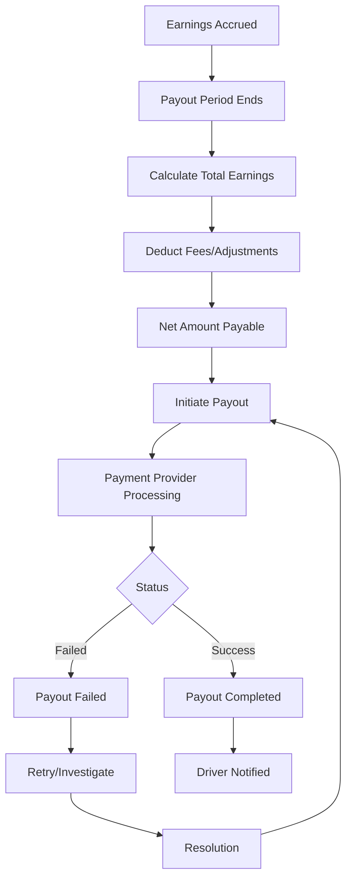

# Software Requirements Specification (SRS)

## Part 06C: Driver Payouts

**Module:** Finance & Billing Module (Part 07)
**Version:** 1.0.0
**Status:** Final / For Review
**Date:** 2026-06-30

---

## Chapter 1 – Overview

### Purpose

The Driver Payouts module defines the complete earnings and payout lifecycle for delivery drivers on the **[Platform Name]** platform. This encompasses earnings calculation, real-time earnings tracking, payout processing, financial reporting, and dispute resolution.

Driver payouts are fundamental to driver satisfaction and retention. Drivers join the platform to earn income, and their trust depends on accurate, timely, and transparent compensation. This module ensures drivers have full visibility into their earnings, understand how they are calculated, and receive their payouts reliably and on time.

### Objectives

- Provide transparent, real-time earnings tracking
- Enable accurate and fair earnings calculation
- Support multiple payout methods and schedules
- Provide instant payout options for drivers
- Enable comprehensive earnings reporting
- Support earnings disputes and adjustments
- Ensure compliance with labor regulations
- Provide financial analytics for driver performance

---

## Chapter 2 – Earnings Components

### DRV-PAY-001 Earnings Components

| Component | Description | Calculation | Priority |
| :--- | :--- | :--- | :--- |
| **Base Delivery Fee** | Base payment per delivery. | Fixed rate per order. | **Required** |
| **Distance Fee** | Payment based on distance traveled. | Rate per km × Distance. | **Required** |
| **Time Fee** | Payment based on time spent. | Rate per minute × Time. | **Required** |
| **Peak Bonus** | Bonus during high-demand periods. | Surge multiplier × Base Fee. | **Required** |
| **Tip** | Customer gratuity. | 100% passed to driver. | **Required** |
| **Incentive Bonus** | Performance-based bonuses. | As per incentive rules. | **Required** |
| **Wait Time Compensation** | Payment for waiting at merchant. | Rate per minute × Wait Time. | **Required** |
| **Cancellation Fee** | Payment for cancelled orders. | Fixed fee per cancellation. | **Required** |
| **Distance Adjustment** | Adjustment for route changes. | As calculated. | **Medium** |
| **Referral Bonus** | Bonus for referring new drivers. | Fixed fee per referral. | **Medium** |

### DRV-PAY-002 Base Delivery Fee Structure

| Parameter | Description | Example |
| :--- | :--- | :--- |
| **Base Rate** | Fixed amount per delivery. | $3.00 |
| **Distance Rate** | Rate per kilometer. | $0.50/km |
| **Time Rate** | Rate per minute. | $0.15/min |
| **Minimum Guarantee** | Minimum earning per delivery. | $4.00 |
| **Maximum Cap** | Maximum earning per delivery. | $25.00 |

### DRV-PAY-003 Peak Bonus Multipliers

| Factor | Multiplier | Description |
| :--- | :--- | :--- |
| **Demand/Supply Ratio** | 1.0 - 3.0x | Based on orders vs. available drivers. |
| **Time of Day** | 1.0 - 1.5x | Peak vs. off-peak hours. |
| **Weather** | 1.0 - 2.0x | Adverse weather conditions. |
| **Event** | 1.0 - 2.0x | Special events (concerts, sports). |
| **Holiday** | 1.0 - 1.5x | Public holidays. |

### DRV-PAY-004 Wait Time Compensation

| Scenario | Rate | Eligibility |
| :--- | :--- | :--- |
| **Merchant Delay** | Rate per minute after 5 minutes. | Order not ready after 5 minutes. |
| **Customer Delay** | Rate per minute after 2 minutes. | Customer not available after 2 minutes. |
| **Traffic Delay** | Not compensated. | Normal traffic delays. |
| **System Delay** | Compensated. | Platform-related delays. |

### DRV-PAY-005 Earnings Calculation Example

| Order | Details |
| :--- | :--- |
| **Base Fee** | $3.00 |
| **Distance** | 8 km × $0.50 = $4.00 |
| **Time** | 15 min × $0.15 = $2.25 |
| **Peak Bonus** | 1.2x × $3.00 = $3.60 |
| **Tip** | $5.00 |
| **Wait Time** | 3 min × $0.15 = $0.45 |
| **Total Earnings** | **$18.30** |

---

## Chapter 3 – Real-Time Earnings Tracking

### DRV-PAY-006 Earnings Dashboard

| Widget | Description | Priority |
| :--- | :--- | :--- |
| **Today's Earnings** | Real-time earnings for the current day. | **Required** |
| **This Week's Earnings** | Cumulative earnings for the week. | **Required** |
| **This Month's Earnings** | Cumulative earnings for the month. | **Required** |
| **Per-Delivery Breakdown** | Earnings breakdown per delivery. | **Required** |
| **Earnings by Component** | Breakdown by fee type. | **Required** |
| **Payout Status** | Pending balance and next payout date. | **Required** |
| **Earnings History** | Historical earnings by period. | **Required** |
| **Earnings Trend** | Trend chart of earnings over time. | **Required** |

### DRV-PAY-007 Per-Delivery Earnings View

| Displayed Information | Description |
| :--- | :--- |
| **Order ID** | Unique order identifier. |
| **Delivery Date** | Date and time of delivery. |
| **Merchant Name** | Merchant for the delivery. |
| **Customer Name** | Customer for the delivery. |
| **Base Fee** | Base delivery fee. |
| **Distance Fee** | Distance-based fee. |
| **Time Fee** | Time-based fee. |
| **Peak Bonus** | Peak hour bonus. |
| **Tip** | Customer tip. |
| **Incentive Bonus** | Performance bonus. |
| **Wait Time** | Wait time compensation. |
| **Cancellation Fee** | Fee for cancelled orders. |
| **Total Earnings** | Total for this delivery. |

---

## Chapter 4 – Payout Methods

### DRV-PAY-008 Supported Payout Methods

| Method | Description | Processing Time | Priority |
| :--- | :--- | :--- | :--- |
| **Bank Transfer** | Direct deposit to bank account. | 1-3 business days | **Required** |
| **Digital Wallet** | Payout to platform wallet. | Instant | **Required** |
| **Debit Card** | Payout to linked debit card. | Instant | **Required** |
| **Mobile Money** | Payout to mobile money account. | Instant | **Required** |
| **Cash Pickup** | Cash pickup at designated locations. | Same day | **Optional** |
| **Check** | Physical check mailed. | 5-7 business days | **Optional** |
| **Cryptocurrency** | Payout in cryptocurrency. | Instant | **Future** |

### DRV-PAY-009 Payout Schedule Options

| Schedule | Description | Processing Time | Priority |
| :--- | :--- | :--- | :--- |
| **Daily** | Payout daily (next business day). | 1-2 business days | **Required** |
| **Weekly** | Payout weekly (e.g., every Monday). | 1-2 business days | **Required** |
| **Biweekly** | Payout every two weeks. | 1-2 business days | **Optional** |
| **Monthly** | Payout monthly (e.g., 1st of month). | 1-2 business days | **Optional** |
| **Instant** | Immediate payout on demand. | Instant | **Required** |
| **Threshold-Based** | Payout when balance exceeds threshold. | 1-2 business days | **Medium** |

### DRV-PAY-010 Instant Payout Feature

| Feature | Description | Priority |
| :--- | :--- | :--- |
| **On-Demand Payout** | Driver initiates instant payout. | **Required** |
| **Minimum Amount** | Minimum payout amount: $5. | **Required** |
| **Maximum Frequency** | Maximum 5 instant payouts per day. | **Required** |
| **Processing Fee** | Fee for instant payout (e.g., $1.00). | **Required** |
| **Bank Account Required** | Must have verified bank account. | **Required** |
| **Transaction History** | View instant payout history. | **Required** |

---

## Chapter 5 – Payout Processing

### DRV-PAY-011 Payout Processing Workflow

### DRV-PAY-012 Payout Statuses

| Status | Description |
| :--- | :--- |
| `PENDING` | Payout is queued for processing. |
| `PROCESSING` | Payout is being processed by payment provider. |
| `COMPLETED` | Payout successfully completed. |
| `FAILED` | Payout failed (retry initiated). |
| `REJECTED` | Payout rejected by payment provider. |
| `REVERSED` | Payout was reversed. |

---

## Chapter 6 – Earnings Reports

### DRV-PAY-013 Earnings Reports

| Report | Description | Schedule | Priority |
| :--- | :--- | :--- | :--- |
| **Daily Earnings Report** | Summary of daily earnings. | Daily | **Required** |
| **Weekly Earnings Report** | Weekly earnings summary. | Weekly | **Required** |
| **Monthly Earnings Report** | Monthly earnings summary. | Monthly | **Required** |
| **Per-Delivery Report** | Detailed per-delivery earnings. | On-demand | **Required** |
| **Tax Report** | Taxable earnings summary. | Annual | **Required** |
| **Payout History** | Complete payout history. | On-demand | **Required** |
| **Earnings by Period** | Earnings breakdown by period. | On-demand | **Required** |

### DRV-PAY-014 Report Features

| Feature | Description | Priority |
| :--- | :--- | :--- |
| **Export Formats** | PDF, CSV, Excel, JSON. | **Required** |
| **Date Range Selection** | User-selectable date range. | **Required** |
| **Filtering** | Filter by order type, merchant, period. | **Medium** |
| **Email Delivery** | Schedule email delivery of reports. | **Medium** |
| **On-Demand Generation** | Generate reports on demand. | **Required** |

---

## Chapter 7 – Tax & Compliance

### DRV-PAY-015 Tax Reporting

| Requirement | Description | Priority |
| :--- | :--- | :--- |
| **Taxable Earnings Tracking** | Track all taxable earnings. | **Required** |
| **Tax Withholding** | Withhold taxes where required. | **Required** |
| **Tax Report** | Annual tax report (1099/other). | **Required** |
| **Tax Information** | Driver tax details collection. | **Required** |
| **Multi-Country Tax** | Support for multiple tax jurisdictions. | **Required** |

### DRV-PAY-016 Compliance Requirements

| Requirement | Description | Priority |
| :--- | :--- | :--- |
| **Minimum Wage Compliance** | Ensure earnings meet minimum wage requirements. | **Required** |
| **Working Hours Limits** | Track and enforce working hour limits. | **Required** |
| **Overtime Calculation** | Calculate overtime where applicable. | **Required** |
| **Holiday Pay** | Calculate holiday pay where applicable. | **Required** |
| **Insurance Deductions** | Deduct insurance premiums where applicable. | **Required** |

---

## Chapter 8 – Earnings Disputes

### DRV-PAY-017 Earnings Dispute Types

| Dispute Type | Description | Priority |
| :--- | :--- | :--- |
| **Missing Earnings** | Driver claims earnings not recorded. | **Required** |
| **Incorrect Calculation** | Driver disputes calculation of earnings. | **Required** |
| **Missing Tip** | Driver claims tip not received. | **Required** |
| **Bonus Dispute** | Driver disputes bonus calculation. | **Required** |
| **Payout Issue** | Driver reports payout issue. | **Required** |

### DRV-PAY-018 Dispute Workflow

1.  Driver identifies earnings discrepancy.
2.  Driver submits dispute with details and evidence.
3.  Support team investigates:
    - Review order details
    - Review earnings calculation
    - Review payout records
4.  Team makes decision:
    - **Valid:** Earnings adjusted, driver notified.
    - **Invalid:** Dispute rejected with explanation.
5.  If valid, adjustment is processed in next payout.
6.  Driver notified of resolution.

---

## Chapter 9 – Database Tables

### driver_earnings

| Column | Type | Constraints | Description |
| :--- | :--- | :--- | :--- |
| `earning_id` | UUID | PRIMARY KEY | Unique identifier |
| `driver_id` | UUID | FOREIGN KEY (driver_accounts.driver_id) | Associated driver |
| `order_id` | UUID | FOREIGN KEY (orders.order_id) | Associated order |
| `delivery_id` | UUID | FOREIGN KEY (driver_deliveries.delivery_id) | Associated delivery |
| `base_fee` | DECIMAL(10, 2) | DEFAULT 0 | Base delivery fee |
| `distance_fee` | DECIMAL(10, 2) | DEFAULT 0 | Distance-based fee |
| `distance_km` | DECIMAL(10, 2) | | Distance in kilometers |
| `time_fee` | DECIMAL(10, 2) | DEFAULT 0 | Time-based fee |
| `time_minutes` | INTEGER | | Time in minutes |
| `peak_bonus` | DECIMAL(10, 2) | DEFAULT 0 | Peak hour bonus |
| `tip_amount` | DECIMAL(10, 2) | DEFAULT 0 | Customer tip |
| `incentive_bonus` | DECIMAL(10, 2) | DEFAULT 0 | Performance bonus |
| `wait_time_compensation` | DECIMAL(10, 2) | DEFAULT 0 | Wait time compensation |
| `cancellation_fee` | DECIMAL(10, 2) | DEFAULT 0 | Cancellation fee |
| `adjustment_amount` | DECIMAL(10, 2) | DEFAULT 0 | Manual adjustments |
| `total_earnings` | DECIMAL(10, 2) | NOT NULL | Total earnings for delivery |
| `currency` | VARCHAR(3) | NOT NULL | ISO 4217 currency code |
| `status` | VARCHAR(20) | DEFAULT 'PENDING' | PENDING/PROCESSED/PAID/ADJUSTED |
| `created_at` | TIMESTAMP | DEFAULT NOW() | Creation timestamp |
| `updated_at` | TIMESTAMP | DEFAULT NOW() | Last update timestamp |

### driver_payouts

| Column | Type | Constraints | Description |
| :--- | :--- | :--- | :--- |
| `payout_id` | UUID | PRIMARY KEY | Unique identifier |
| `driver_id` | UUID | FOREIGN KEY (driver_accounts.driver_id) | Associated driver |
| `period_start` | DATE | NOT NULL | Period start |
| `period_end` | DATE | NOT NULL | Period end |
| `total_earnings` | DECIMAL(10, 2) | NOT NULL | Total earnings in period |
| `total_tips` | DECIMAL(10, 2) | DEFAULT 0 | Total tips |
| `total_bonuses` | DECIMAL(10, 2) | DEFAULT 0 | Total bonuses |
| `total_fees` | DECIMAL(10, 2) | DEFAULT 0 | Fees deducted |
| `total_adjustments` | DECIMAL(10, 2) | DEFAULT 0 | Adjustments |
| `net_amount` | DECIMAL(10, 2) | NOT NULL | Net payout amount |
| `currency` | VARCHAR(3) | NOT NULL | ISO 4217 currency code |
| `payout_method` | VARCHAR(30) | NOT NULL | BANK_TRANSFER/WALLET/CARD/MOBILE_MONEY |
| `payout_account` | VARCHAR(100) | | Account identifier (masked) |
| `reference_number` | VARCHAR(50) | | Payment provider reference |
| `transaction_id` | VARCHAR(100) | | Provider transaction ID |
| `status` | VARCHAR(20) | DEFAULT 'PENDING' | PENDING/PROCESSING/COMPLETED/FAILED/REJECTED/REVERSED |
| `failure_reason` | TEXT | | Reason for failure |
| `initiated_at` | TIMESTAMP | | Initiation timestamp |
| `processed_at` | TIMESTAMP | | Processing timestamp |
| `completed_at` | TIMESTAMP | | Completion timestamp |
| `created_at` | TIMESTAMP | DEFAULT NOW() | Creation timestamp |
| `updated_at` | TIMESTAMP | DEFAULT NOW() | Last update timestamp |

### driver_earning_disputes

| Column | Type | Constraints | Description |
| :--- | :--- | :--- | :--- |
| `dispute_id` | UUID | PRIMARY KEY | Unique identifier |
| `driver_id` | UUID | FOREIGN KEY (driver_accounts.driver_id) | Associated driver |
| `earning_id` | UUID | FOREIGN KEY (driver_earnings.earning_id) | Associated earning |
| `order_id` | UUID | FOREIGN KEY (orders.order_id) | Associated order |
| `dispute_type` | VARCHAR(30) | NOT NULL | MISSING_EARNINGS/INCORRECT_CALCULATION/MISSING_TIP/BONUS_DISPUTE/PAYOUT_ISSUE |
| `description` | TEXT | NOT NULL | Dispute description |
| `requested_amount` | DECIMAL(10, 2) | | Requested adjustment amount |
| `status` | VARCHAR(20) | DEFAULT 'PENDING' | PENDING/UNDER_REVIEW/RESOLVED/DISMISSED |
| `resolution` | TEXT | | Resolution description |
| `adjustment_amount` | DECIMAL(10, 2) | | Approved adjustment amount |
| `adjusted_earning_id` | UUID | | Associated adjustment record |
| `resolved_by` | UUID | | Admin who resolved |
| `resolved_at` | TIMESTAMP | | Resolution timestamp |
| `created_at` | TIMESTAMP | DEFAULT NOW() | Creation timestamp |
| `updated_at` | TIMESTAMP | DEFAULT NOW() | Last update timestamp |

### driver_earning_adjustments

| Column | Type | Constraints | Description |
| :--- | :--- | :--- | :--- |
| `adjustment_id` | UUID | PRIMARY KEY | Unique identifier |
| `driver_id` | UUID | FOREIGN KEY (driver_accounts.driver_id) | Associated driver |
| `order_id` | UUID | FOREIGN KEY (orders.order_id) | Associated order |
| `dispute_id` | UUID | FOREIGN KEY (driver_earning_disputes.dispute_id) | Associated dispute |
| `adjustment_amount` | DECIMAL(10, 2) | NOT NULL | Adjustment amount |
| `adjustment_reason` | VARCHAR(100) | NOT NULL | Reason for adjustment |
| `approved_by` | UUID | | Admin who approved |
| `status` | VARCHAR(20) | DEFAULT 'PENDING' | PENDING/APPROVED/REJECTED/PROCESSED |
| `processed_at` | TIMESTAMP | | Processing timestamp |
| `approved_at` | TIMESTAMP | | Approval timestamp |
| `created_at` | TIMESTAMP | DEFAULT NOW() | Creation timestamp |
| `updated_at` | TIMESTAMP | DEFAULT NOW() | Last update timestamp |

### driver_bank_accounts

| Column | Type | Constraints | Description |
| :--- | :--- | :--- | :--- |
| `bank_account_id` | UUID | PRIMARY KEY | Unique identifier |
| `driver_id` | UUID | FOREIGN KEY (driver_accounts.driver_id) | Associated driver |
| `account_holder_name` | VARCHAR(255) | NOT NULL | Name on account |
| `account_number` | VARCHAR(50) | NOT NULL | Account number (encrypted) |
| `iban` | VARCHAR(50) | | IBAN (encrypted) |
| `swift_code` | VARCHAR(20) | | SWIFT/BIC code |
| `bank_name` | VARCHAR(100) | NOT NULL | Bank name |
| `bank_country` | VARCHAR(5) | NOT NULL | Bank country |
| `currency` | VARCHAR(3) | NOT NULL | Account currency |
| `is_primary` | BOOLEAN | DEFAULT TRUE | Primary payout account |
| `is_verified` | BOOLEAN | DEFAULT FALSE | Verification status |
| `verified_at` | TIMESTAMP | | Verification timestamp |
| `created_at` | TIMESTAMP | DEFAULT NOW() | Creation timestamp |
| `updated_at` | TIMESTAMP | DEFAULT NOW() | Last update timestamp |

### driver_wallets

| Column | Type | Constraints | Description |
| :--- | :--- | :--- | :--- |
| `wallet_id` | UUID | PRIMARY KEY | Unique identifier |
| `driver_id` | UUID | UNIQUE, FOREIGN KEY (driver_accounts.driver_id) | Associated driver |
| `balance` | DECIMAL(10, 2) | DEFAULT 0 | Current wallet balance |
| `pending_balance` | DECIMAL(10, 2) | DEFAULT 0 | Pending earnings |
| `total_earned` | DECIMAL(10, 2) | DEFAULT 0 | Total lifetime earnings |
| `total_withdrawn` | DECIMAL(10, 2) | DEFAULT 0 | Total withdrawn |
| `currency` | VARCHAR(3) | NOT NULL | ISO 4217 currency code |
| `created_at` | TIMESTAMP | DEFAULT NOW() | Creation timestamp |
| `updated_at` | TIMESTAMP | DEFAULT NOW() | Last update timestamp |

### driver_wallet_transactions

| Column | Type | Constraints | Description |
| :--- | :--- | :--- | :--- |
| `transaction_id` | UUID | PRIMARY KEY | Unique identifier |
| `wallet_id` | UUID | FOREIGN KEY (driver_wallets.wallet_id) | Associated wallet |
| `driver_id` | UUID | FOREIGN KEY (driver_accounts.driver_id) | Associated driver |
| `transaction_type` | VARCHAR(20) | NOT NULL | EARNINGS/PAYOUT/ADJUSTMENT/TIP/BONUS |
| `amount` | DECIMAL(10, 2) | NOT NULL | Transaction amount |
| `balance_before` | DECIMAL(10, 2) | NOT NULL | Balance before transaction |
| `balance_after` | DECIMAL(10, 2) | NOT NULL | Balance after transaction |
| `currency` | VARCHAR(3) | NOT NULL | ISO 4217 currency code |
| `reference_id` | UUID | | Reference to earning/payout |
| `description` | TEXT | | Transaction description |
| `status` | VARCHAR(20) | DEFAULT 'COMPLETED' | PENDING/COMPLETED/FAILED/REVERSED |
| `created_at` | TIMESTAMP | DEFAULT NOW() | Transaction timestamp |
| `updated_at` | TIMESTAMP | DEFAULT NOW() | Last update timestamp |

---

## Chapter 10 – REST APIs

### Earnings APIs

| Method | Endpoint | Description |
| :--- | :--- | :--- |
| `GET` | `/api/v1/driver/earnings/today` | Get today's earnings |
| `GET` | `/api/v1/driver/earnings/week` | Get this week's earnings |
| `GET` | `/api/v1/driver/earnings/month` | Get this month's earnings |
| `GET` | `/api/v1/driver/earnings/history` | Get earnings history |
| `GET` | `/api/v1/driver/earnings/{id}` | Get earning details |
| `GET` | `/api/v1/driver/earnings/deliveries` | Get per-delivery earnings |
| `GET` | `/api/v1/driver/earnings/breakdown` | Get earnings breakdown by component |

### Payout APIs

| Method | Endpoint | Description |
| :--- | :--- | :--- |
| `GET` | `/api/v1/driver/payouts` | Get payout history |
| `GET` | `/api/v1/driver/payouts/{id}` | Get payout details |
| `GET` | `/api/v1/driver/payouts/upcoming` | Get upcoming payout |
| `POST` | `/api/v1/driver/payouts/instant` | Request instant payout |
| `GET` | `/api/v1/driver/payouts/methods` | Get available payout methods |
| `PUT` | `/api/v1/driver/payouts/methods` | Update payout method |

### Bank Account APIs

| Method | Endpoint | Description |
| :--- | :--- | :--- |
| `GET` | `/api/v1/driver/bank-accounts` | Get bank accounts |
| `POST` | `/api/v1/driver/bank-accounts` | Add bank account |
| `PUT` | `/api/v1/driver/bank-accounts/{id}` | Update bank account |
| `DELETE` | `/api/v1/driver/bank-accounts/{id}` | Delete bank account |
| `POST` | `/api/v1/driver/bank-accounts/{id}/verify` | Verify bank account |

### Wallet APIs

| Method | Endpoint | Description |
| :--- | :--- | :--- |
| `GET` | `/api/v1/driver/wallet` | Get wallet balance |
| `GET` | `/api/v1/driver/wallet/transactions` | Get wallet transactions |
| `POST` | `/api/v1/driver/wallet/withdraw` | Withdraw from wallet |

### Dispute APIs

| Method | Endpoint | Description |
| :--- | :--- | :--- |
| `POST` | `/api/v1/driver/earnings/dispute` | Submit earnings dispute |
| `GET` | `/api/v1/driver/earnings/disputes` | Get dispute history |
| `GET` | `/api/v1/driver/earnings/disputes/{id}` | Get dispute details |

### Report APIs

| Method | Endpoint | Description |
| :--- | :--- | :--- |
| `GET` | `/api/v1/driver/reports/earnings` | Generate earnings report |
| `GET` | `/api/v1/driver/reports/tax` | Generate tax report |
| `GET` | `/api/v1/driver/reports/payouts` | Generate payout report |

### Admin APIs

| Method | Endpoint | Description |
| :--- | :--- | :--- |
| `GET` | `/api/v1/admin/drivers/{id}/earnings` | Get driver earnings (admin) |
| `GET` | `/api/v1/admin/drivers/{id}/payouts` | Get driver payouts (admin) |
| `POST` | `/api/v1/admin/drivers/{id}/earnings/adjust` | Adjust driver earnings (admin) |
| `POST` | `/api/v1/admin/drivers/{id}/payouts/process` | Process payout (admin) |
| `GET` | `/api/v1/admin/earnings/summary` | Get earnings summary (admin) |

---

## Chapter 11 – Business Rules

| Rule ID | Rule Description | Priority |
| :--- | :--- | :--- |
| **BR-DPAY-001** | Tips are 100% passed to drivers. | **High** |
| **BR-DPAY-002** | Minimum payout threshold for instant payout: $5. | **High** |
| **BR-DPAY-003** | Maximum instant payouts per day: 5. | **High** |
| **BR-DPAY-004** | Peak bonus is calculated based on surge multiplier. | **High** |
| **BR-DPAY-005** | Wait time compensation starts after 5 minutes (merchant) or 2 minutes (customer). | **High** |
| **BR-DPAY-006** | Cancellation fees apply only if driver has traveled to merchant. | **High** |
| **BR-DPAY-007** | Earnings disputes must be submitted within 7 days of delivery. | **High** |
| **BR-DPAY-008** | Tax reports are generated annually for eligible drivers. | **High** |
| **BR-DPAY-009** | Payouts are processed only to verified bank accounts. | **High** |
| **BR-DPAY-010** | Instant payouts incur a processing fee. | **High** |

---

## Chapter 12 – Acceptance Tests

| Test ID | Test Description | Priority |
| :--- | :--- | :--- |
| **TEST-DPAY-001** | Driver views today's earnings in real-time. | **High** |
| **TEST-DPAY-002** | Driver views weekly earnings summary. | **High** |
| **TEST-DPAY-003** | Driver views per-delivery earnings breakdown. | **High** |
| **TEST-DPAY-004** | Driver views earnings breakdown by component. | **High** |
| **TEST-DPAY-005** | Delivery earnings calculated correctly. | **High** |
| **TEST-DPAY-006** | Peak bonus applied correctly. | **High** |
| **TEST-DPAY-007** | Tips are passed 100% to driver. | **High** |
| **TEST-DPAY-008** | Wait time compensation applied correctly. | **High** |
| **TEST-DPAY-009** | Cancellation fee applied for cancelled orders. | **High** |
| **TEST-DPAY-010** | Driver views earnings history with date filtering. | **High** |
| **TEST-DPAY-011** | Driver exports earnings report (PDF/CSV). | **High** |
| **TEST-DPAY-012** | Driver adds bank account for payout. | **High** |
| **TEST-DPAY-013** | Bank account verification process works. | **High** |
| **TEST-DPAY-014** | Driver views available payout methods. | **High** |
| **TEST-DPAY-015** | Driver receives weekly payout on schedule. | **High** |
| **TEST-DPAY-016** | Driver requests instant payout. | **High** |
| **TEST-DPAY-017** | Instant payout processed with fee deduction. | **High** |
| **TEST-DPAY-018** | Driver views payout history. | **High** |
| **TEST-DPAY-019** | Driver views upcoming payout date and amount. | **High** |
| **TEST-DPAY-020** | Driver submits earnings dispute. | **High** |
| **TEST-DPAY-021** | Earnings dispute reviewed and resolved. | **High** |
| **TEST-DPAY-022** | Adjustment applied to driver's earnings. | **High** |
| **TEST-DPAY-023** | Driver views wallet balance. | **High** |
| **TEST-DPAY-024** | Driver views wallet transaction history. | **High** |
| **TEST-DPAY-025** | Payout failure triggers retry and notification. | **High** |
| **TEST-DPAY-026** | Driver views tax report (annual). | **High** |
| **TEST-DPAY-027** | Admin adjusts driver earnings. | **High** |
| **TEST-DPAY-028** | Admin processes manual payout. | **High** |

---

## Chapter 13 – Traceability Matrix

| Requirement | Database Table | API Endpoint(s) | Acceptance Test |
| :--- | :--- | :--- | :--- |
| DRV-PAY-006 | driver_earnings | GET /api/v1/driver/earnings/today | TEST-DPAY-001, TEST-DPAY-002 |
| DRV-PAY-007 | driver_earnings | GET /api/v1/driver/earnings/deliveries | TEST-DPAY-003 |
| DRV-PAY-001 | driver_earnings | GET /api/v1/driver/earnings/breakdown | TEST-DPAY-004 |
| DRV-PAY-002 | driver_earnings | Internal | TEST-DPAY-005, TEST-DPAY-006 |
| DRV-PAY-003 | driver_earnings | Internal | TEST-DPAY-007 |
| DRV-PAY-004 | driver_earnings | Internal | TEST-DPAY-008 |
| DRV-PAY-001 | driver_earnings | Internal | TEST-DPAY-009 |
| DRV-PAY-006 | driver_earnings | GET /api/v1/driver/earnings/history | TEST-DPAY-010, TEST-DPAY-011 |
| DRV-PAY-008 | driver_bank_accounts | POST /api/v1/driver/bank-accounts | TEST-DPAY-012, TEST-DPAY-013 |
| DRV-PAY-008 | driver_bank_accounts | GET /api/v1/driver/payouts/methods | TEST-DPAY-014 |
| DRV-PAY-009 | driver_payouts | GET /api/v1/driver/payouts | TEST-DPAY-015, TEST-DPAY-018 |
| DRV-PAY-010 | driver_payouts | POST /api/v1/driver/payouts/instant | TEST-DPAY-016, TEST-DPAY-017 |
| DRV-PAY-009 | driver_payouts | GET /api/v1/driver/payouts/upcoming | TEST-DPAY-019 |
| DRV-PAY-017 | driver_earning_disputes | POST /api/v1/driver/earnings/dispute | TEST-DPAY-020, TEST-DPAY-021 |
| DRV-PAY-018 | driver_earning_adjustments | Internal | TEST-DPAY-022 |
| DRV-PAY-006 | driver_wallets | GET /api/v1/driver/wallet | TEST-DPAY-023 |
| DRV-PAY-006 | driver_wallet_transactions | GET /api/v1/driver/wallet/transactions | TEST-DPAY-024 |
| DRV-PAY-012 | driver_payouts | Internal | TEST-DPAY-025 |

---

## Chapter 14 – Summary

This document establishes the complete driver earnings and payout capability for the **[Platform Name]** platform. Key takeaways:

- **Transparent Earnings Calculation:** Clear, itemized breakdown of all earnings components (base, distance, time, peak bonus, tips, incentives, wait time, cancellation fees).
- **Real-Time Earnings Tracking:** Live earnings dashboard with per-delivery breakdown and earnings history.
- **Multiple Payout Methods:** Support for bank transfer, digital wallet, debit card, mobile money, and instant payout options.
- **Flexible Payout Schedules:** Daily, weekly, biweekly, monthly, and instant-on-demand payout options.
- **Instant Payouts:** On-demand payouts with configurable minimums, frequency limits, and processing fees.
- **Earnings Disputes:** Structured dispute workflow with investigation and adjustment capabilities.
- **Tax & Compliance:** Taxable earnings tracking, tax reports, and compliance with labor regulations.
- **Comprehensive Reporting:** Earnings reports with export capabilities (PDF, CSV, Excel) for driver record-keeping.
- **Financial Visibility:** Wallet balance, transaction history, and payout status for complete financial transparency.

The driver earnings and payout module is the foundation of driver trust and retention. Transparent, accurate, and timely compensation ensures drivers view the platform as a reliable income source.

---

**Next Document:**

`Part_06D_Commission_Fees_Calculation.md`

*(This builds on driver payouts to define commission and fee calculation for merchants.)*