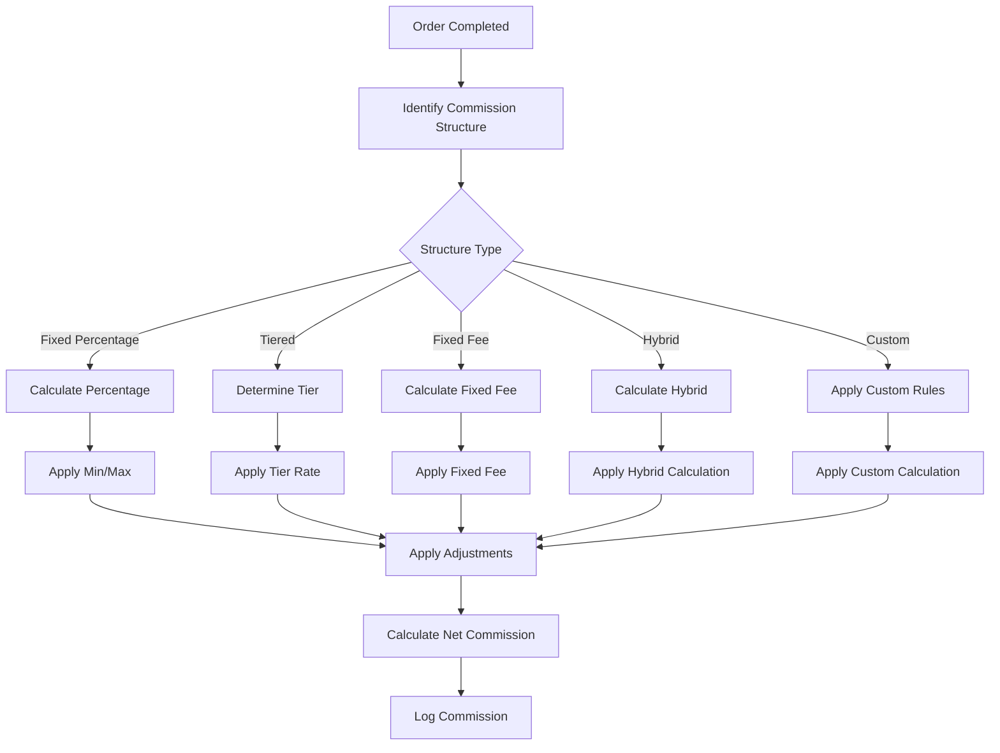

# Software Requirements Specification (SRS)

## Part 06D: Commission & Fees Calculation

**Module:** Finance & Billing Module (Part 07)
**Version:** 1.0.0
**Status:** Final / For Review
**Date:** 2026-06-30

---

## Chapter 1 – Overview

### Purpose

The Commission & Fees Calculation module defines the complete engine for calculating commissions, service fees, and other charges applied to merchant orders on the **[Platform Name]** platform. This encompasses commission structures, fee calculation rules, tiered pricing, promotional adjustments, and configuration management.

Commission and fee calculation is the primary revenue engine of the platform. The accuracy, transparency, and flexibility of this module directly impact merchant satisfaction, platform revenue, and competitive positioning. A well-designed commission engine enables the platform to offer competitive rates, reward high-performing merchants, and adapt to market conditions.

### Objectives

- Provide transparent, accurate commission calculation
- Support multiple commission structures (percentage, tiered, fixed, hybrid)
- Enable merchant-specific custom commission rates
- Support fee calculation (service, delivery, payment processing)
- Handle promotional adjustments and discounts
- Provide commission breakdown and reporting
- Enable audit and reconciliation
- Support configurable business rules

---

## Chapter 2 – Commission Structures

### COM-001 Commission Types

| Type | Description | Priority |
| :--- | :--- | :--- |
| **Fixed Percentage** | Fixed percentage of gross order value. | **Required** |
| **Tiered Percentage** | Different rates based on order volume or value. | **Required** |
| **Fixed Fee** | Fixed amount per order. | **Required** |
| **Hybrid** | Combination of percentage and fixed fee. | **Required** |
| **Custom** | Custom commission per merchant agreement. | **Required** |

### COM-002 Fixed Percentage Commission

| Parameter | Description | Example |
| :--- | :--- | :--- |
| **Rate** | Percentage of gross order value. | 20% |
| **Basis** | Subtotal (excluding tax). | Order total - Tax |
| **Minimum** | Minimum commission per order. | $1.00 |
| **Maximum** | Maximum commission per order. | $10.00 |

**Formula:**
```
Commission = MAX(Subtotal × Rate, Minimum)
Commission = MIN(Commission, Maximum)
```

### COM-003 Tiered Percentage Commission

| Tier | Monthly Order Volume | Commission Rate |
| :--- | :--- | :--- |
| **Tier 1** | 0 - 500 orders | 25% |
| **Tier 2** | 501 - 1,000 orders | 22% |
| **Tier 3** | 1,001 - 2,500 orders | 20% |
| **Tier 4** | 2,501 - 5,000 orders | 18% |
| **Tier 5** | 5,001+ orders | 15% |

**Calculation:**
- Commission rate is determined by merchant's total order volume in the current month.
- Rate applies to all orders in the month (or on a per-order basis with tier threshold).

### COM-004 Fixed Fee Commission

| Parameter | Description | Example |
| :--- | :--- | :--- |
| **Fee** | Fixed amount per order. | $2.00 |
| **Basis** | Per completed order. | Each order |

**Formula:**
```
Commission = Fixed_Fee × Number_of_Orders
```

### COM-005 Hybrid Commission

| Component | Description | Example |
| :--- | :--- | :--- |
| **Percentage** | Percentage of subtotal. | 15% |
| **Fixed Fee** | Fixed amount per order. | $1.00 |
| **Total** | Percentage + Fixed Fee. | $1.00 + 15% |

**Formula:**
```
Commission = (Subtotal × Percentage_Rate) + Fixed_Fee
```

### COM-006 Custom Commission

| Attribute | Description | Priority |
| :--- | :--- | :--- |
| **Merchant-Specific** | Commission rate per merchant. | **Required** |
| **Store-Specific** | Commission rate per store. | **Required** |
| **Category-Specific** | Commission rate per product category. | **Required** |
| **Item-Specific** | Commission rate per item. | **Medium** |
| **Time-Based** | Commission rate varies by time. | **Medium** |

---

## Chapter 3 – Fee Structures

### COM-007 Service Fee

| Parameter | Description | Example |
| :--- | :--- | :--- |
| **Type** | Percentage or Fixed | Percentage |
| **Rate** | Rate applied. | 2% |
| **Basis** | Subtotal or Order Total | Subtotal |
| **Minimum** | Minimum fee per order. | $0.50 |
| **Maximum** | Maximum fee per order. | $5.00 |

**Formula:**
```
Service_Fee = Subtotal × Service_Fee_Rate
Service_Fee = MAX(Service_Fee, Minimum)
Service_Fee = MIN(Service_Fee, Maximum)
```

### COM-008 Delivery Fee Structure

| Type | Description | Priority |
| :--- | :--- | :--- |
| **Zone-Based** | Fee varies by delivery zone. | **Required** |
| **Distance-Based** | Fee varies by distance. | **Required** |
| **Time-Based** | Fee varies by time (peak vs. off-peak). | **Required** |
| **Merchant-Subsidized** | Merchant subsidizes delivery fee. | **Required** |
| **Platform-Subsidized** | Platform subsidizes delivery fee. | **Required** |

### COM-009 Payment Processing Fee

| Parameter | Description | Example |
| :--- | :--- | :--- |
| **Percentage** | Percentage of transaction amount. | 2.9% |
| **Fixed Fee** | Fixed amount per transaction. | $0.30 |
| **Total** | Percentage + Fixed Fee. | 2.9% + $0.30 |
| **Basis** | Order total. | Order total |

**Formula:**
```
Payment_Fee = (Order_Total × Percentage_Rate) + Fixed_Fee
```

---

## Chapter 4 – Commission Calculation

### COM-010 Calculation Workflow



### COM-011 Calculation Examples

**Example 1: Fixed Percentage**
| Parameter | Value |
| :--- | :--- |
| Subtotal | $50.00 |
| Rate | 20% |
| Minimum | $1.00 |
| Maximum | $10.00 |
| **Commission** | **$10.00** |

**Example 2: Tiered Percentage**
| Parameter | Value |
| :--- | :--- |
| Subtotal | $50.00 |
| Order Volume | 800 (Tier 2 - 22%) |
| **Commission** | **$11.00** |

**Example 3: Hybrid**
| Parameter | Value |
| :--- | :--- |
| Subtotal | $50.00 |
| Percentage | 15% = $7.50 |
| Fixed Fee | $1.00 |
| **Commission** | **$8.50** |

### COM-012 Commission Data Model

| Attribute | Type | Required | Description |
| :--- | :--- | :--- | :--- |
| `commission_id` | UUID | Yes | Unique identifier |
| `merchant_id` | UUID | Yes | Associated merchant |
| `order_id` | UUID | Yes | Associated order |
| `commission_type` | String | Yes | PERCENTAGE/TIERED/FIXED/HYBRID/CUSTOM |
| `rate` | Decimal | Yes | Applicable rate |
| `basis_amount` | Decimal | Yes | Amount commission is calculated on |
| `commission_amount` | Decimal | Yes | Calculated commission |
| `minimum_commission` | Decimal | | Minimum commission applied |
| `maximum_commission` | Decimal | | Maximum commission applied |
| `tier_applied` | String | | Tier that was applied |
| `adjustment_amount` | Decimal | | Any adjustments |
| `net_commission` | Decimal | Yes | Final commission amount |
| `calculation_details` | JSONB | | Detailed calculation breakdown |
| `created_at` | Timestamp | Yes | Creation timestamp |
| `updated_at` | Timestamp | Yes | Last update timestamp |

---

## Chapter 5 – Commission Tiers

### COM-013 Tier Management

| Feature | Description | Priority |
| :--- | :--- | :--- |
| **Tier Definition** | Define tier thresholds and rates. | **Required** |
| **Tier Assignment** | Assign merchants to tiers. | **Required** |
| **Tier Calculation** | Calculate tier based on order volume. | **Required** |
| **Tier Review** | Review merchant tier eligibility. | **Required** |
| **Tier History** | Historical tier assignment. | **Required** |
| **Tier Migration** | Move merchant between tiers. | **Required** |

### COM-014 Tier Data Model

| Attribute | Type | Required | Description |
| :--- | :--- | :--- | :--- |
| `tier_id` | UUID | Yes | Unique identifier |
| `tier_name` | String | Yes | Name of the tier |
| `tier_level` | Integer | Yes | Level (1-5) |
| `min_orders` | Integer | Yes | Minimum orders per period |
| `max_orders` | Integer | | Maximum orders per period |
| `commission_rate` | Decimal | Yes | Commission rate for tier |
| `service_fee_rate` | Decimal | | Service fee rate for tier |
| `benefits` | JSONB | | Tier benefits |
| `is_active` | Boolean | Yes | Active status |
| `created_at` | Timestamp | Yes | Creation timestamp |
| `updated_at` | Timestamp | Yes | Last update timestamp |

### COM-015 Merchant Tier Assignment

| Attribute | Type | Required | Description |
| :--- | :--- | :--- | :--- |
| `assignment_id` | UUID | Yes | Unique identifier |
| `merchant_id` | UUID | Yes | Associated merchant |
| `tier_id` | UUID | Yes | Assigned tier |
| `period_start` | Date | Yes | Period start |
| `period_end` | Date | Yes | Period end |
| `order_volume` | Integer | | Orders in period |
| `commission_rate_applied` | Decimal | | Rate applied |
| `status` | String | Yes | ACTIVE/EXPIRED/UPCOMING |
| `created_at` | Timestamp | Yes | Creation timestamp |
| `updated_at` | Timestamp | Yes | Last update timestamp |

---

## Chapter 6 – Fee Calculation

### COM-016 Fee Calculation Workflow

1.  Order completed.
2.  Calculate subtotal (items total).
3.  Calculate service fee (if applicable).
4.  Calculate delivery fee (if applicable).
5.  Calculate payment processing fee.
6.  Apply promotional adjustments (if applicable).
7.  Sum all fees.
8.  Deduct from merchant settlement.
9.  Log fees for reporting.

### COM-017 Fee Data Model

| Attribute | Type | Required | Description |
| :--- | :--- | :--- | :--- |
| `fee_id` | UUID | Yes | Unique identifier |
| `merchant_id` | UUID | Yes | Associated merchant |
| `order_id` | UUID | Yes | Associated order |
| `fee_type` | String | Yes | SERVICE/DELIVERY/PAYMENT/PROMOTION |
| `fee_name` | String | Yes | Display name |
| `fee_amount` | Decimal | Yes | Fee amount |
| `calculation_details` | JSONB | | Detailed calculation breakdown |
| `created_at` | Timestamp | Yes | Creation timestamp |
| `updated_at` | Timestamp | Yes | Last update timestamp |

---

## Chapter 7 – Promotional Adjustments

### COM-018 Promotion Types

| Type | Description | Priority |
| :--- | :--- | :--- |
| **Commission Discount** | Discount on commission rate. | **Required** |
| **Fee Waiver** | Waive specific fees (delivery, service). | **Required** |
| **Fixed Discount** | Fixed amount discount. | **Required** |
| **Percentage Discount** | Percentage discount on fees. | **Required** |
| **Temporary Rate** | Temporary commission rate. | **Required** |

### COM-019 Promotion Application

| Step | Description | Priority |
| :--- | :--- | :--- |
| **1. Eligibility** | Check merchant eligibility for promotion. | **Required** |
| **2. Validation** | Validate promotion rules. | **Required** |
| **3. Calculation** | Apply promotion to commission/fees. | **Required** |
| **4. Adjustment** | Adjust commission/fee amounts. | **Required** |
| **5. Logging** | Log promotion application. | **Required** |

### COM-020 Promotion Data Model

| Attribute | Type | Required | Description |
| :--- | :--- | :--- | :--- |
| `promotion_id` | UUID | Yes | Unique identifier |
| `merchant_id` | UUID | Yes | Associated merchant |
| `order_id` | UUID | Yes | Associated order |
| `promotion_type` | String | Yes | COMMISSION_DISCOUNT/FEE_WAIVER/FIXED_DISCOUNT/PERCENTAGE_DISCOUNT/TEMPORARY_RATE |
| `promotion_name` | String | Yes | Promotion name |
| `adjustment_amount` | Decimal | Yes | Adjustment amount |
| `adjustment_reason` | String | Yes | Reason for adjustment |
| `created_at` | Timestamp | Yes | Creation timestamp |

---

## Chapter 8 – Configuration Management

### COM-021 Configurable Parameters

| Parameter | Description | Priority |
| :--- | :--- | :--- |
| **Commission Rate** | Default commission rate. | **Required** |
| **Tier Thresholds** | Tier order volume thresholds. | **Required** |
| **Service Fee Rate** | Default service fee rate. | **Required** |
| **Minimum Commission** | Minimum commission per order. | **Required** |
| **Maximum Commission** | Maximum commission per order. | **Required** |
| **Payment Fee Rate** | Payment processing fee rate. | **Required** |
| **Payment Fixed Fee** | Payment processing fixed fee. | **Required** |

### COM-022 Configuration Data Model

| Attribute | Type | Required | Description |
| :--- | :--- | :--- | :--- |
| `config_id` | UUID | Yes | Unique identifier |
| `config_key` | String | Yes | Configuration key |
| `config_value` | JSONB | Yes | Configuration value |
| `config_type` | String | Yes | SYSTEM/MERCHANT/STORE/CATEGORY |
| `reference_id` | UUID | | Reference ID (if type is merchant/store) |
| `is_active` | Boolean | Yes | Active status |
| `created_at` | Timestamp | Yes | Creation timestamp |
| `updated_at` | Timestamp | Yes | Last update timestamp |

---

## Chapter 9 – Reporting & Analytics

### COM-023 Commission Reports

| Report | Description | Frequency | Priority |
| :--- | :--- | :--- | :--- |
| **Commission Summary** | Total commission by period. | Daily | **Required** |
| **Commission Breakdown** | Commission by order. | Daily | **Required** |
| **Tier Performance** | Merchant distribution by tier. | Monthly | **Required** |
| **Fee Analysis** | Fee breakdown by type. | Monthly | **Required** |
| **Promotion Impact** | Promotion effectiveness. | Monthly | **Required** |
| **Merchant Report** | Commission per merchant. | Monthly | **Required** |

### COM-024 Commission Analytics

| Metric | Description | Priority |
| :--- | :--- | :--- |
| **Total Commission** | Total commission collected. | **Required** |
| **Average Commission Rate** | Average rate applied. | **Required** |
| **Commission Revenue** | Revenue from commissions. | **Required** |
| **Fee Revenue** | Revenue from fees. | **Required** |
| **Tier Distribution** | % merchants per tier. | **Required** |
| **Promotion Usage** | Promotion utilization rate. | **Required** |

---

## Chapter 10 – Database Tables

### merchant_commission_rates

| Column | Type | Constraints | Description |
| :--- | :--- | :--- | :--- |
| `rate_id` | UUID | PRIMARY KEY | Unique identifier |
| `merchant_id` | UUID | FOREIGN KEY (merchant_accounts.merchant_id) | Associated merchant |
| `store_id` | UUID | FOREIGN KEY (merchant_stores.store_id) | Associated store |
| `commission_type` | VARCHAR(20) | NOT NULL | PERCENTAGE/TIERED/FIXED/HYBRID/CUSTOM |
| `rate` | DECIMAL(5, 2) | NOT NULL | Commission rate |
| `minimum_commission` | DECIMAL(10, 2) | | Minimum commission |
| `maximum_commission` | DECIMAL(10, 2) | | Maximum commission |
| `effective_date` | DATE | NOT NULL | Rate effective date |
| `end_date` | DATE | | Rate end date |
| `is_active` | BOOLEAN | DEFAULT TRUE | Active status |
| `created_by` | UUID | | Admin who created |
| `created_at` | TIMESTAMP | DEFAULT NOW() | Creation timestamp |
| `updated_at` | TIMESTAMP | DEFAULT NOW() | Last update timestamp |

### commission_tiers

| Column | Type | Constraints | Description |
| :--- | :--- | :--- | :--- |
| `tier_id` | UUID | PRIMARY KEY | Unique identifier |
| `tier_name` | VARCHAR(50) | NOT NULL | Tier name |
| `tier_level` | INTEGER | NOT NULL | Tier level |
| `min_orders` | INTEGER | NOT NULL | Minimum orders |
| `max_orders` | INTEGER | | Maximum orders |
| `commission_rate` | DECIMAL(5, 2) | NOT NULL | Commission rate |
| `service_fee_rate` | DECIMAL(5, 2) | | Service fee rate |
| `benefits` | JSONB | | Tier benefits |
| `is_active` | BOOLEAN | DEFAULT TRUE | Active status |
| `created_at` | TIMESTAMP | DEFAULT NOW() | Creation timestamp |
| `updated_at` | TIMESTAMP | DEFAULT NOW() | Last update timestamp |

### commission_calculations

| Column | Type | Constraints | Description |
| :--- | :--- | :--- | :--- |
| `calculation_id` | UUID | PRIMARY KEY | Unique identifier |
| `merchant_id` | UUID | FOREIGN KEY (merchant_accounts.merchant_id) | Associated merchant |
| `order_id` | UUID | FOREIGN KEY (orders.order_id) | Associated order |
| `commission_type` | VARCHAR(20) | NOT NULL | Commission type applied |
| `rate` | DECIMAL(5, 2) | NOT NULL | Rate applied |
| `basis_amount` | DECIMAL(12, 2) | NOT NULL | Amount commission on |
| `commission_amount` | DECIMAL(12, 2) | NOT NULL | Calculated commission |
| `minimum_applied` | DECIMAL(10, 2) | | Minimum applied |
| `maximum_applied` | DECIMAL(10, 2) | | Maximum applied |
| `tier_applied` | VARCHAR(50) | | Tier applied |
| `adjustment_amount` | DECIMAL(12, 2) | | Adjustment |
| `net_commission` | DECIMAL(12, 2) | NOT NULL | Final commission |
| `calculation_details` | JSONB | | Detailed breakdown |
| `created_at` | TIMESTAMP | DEFAULT NOW() | Creation timestamp |
| `updated_at` | TIMESTAMP | DEFAULT NOW() | Last update timestamp |

### fee_calculations

| Column | Type | Constraints | Description |
| :--- | :--- | :--- | :--- |
| `fee_id` | UUID | PRIMARY KEY | Unique identifier |
| `merchant_id` | UUID | FOREIGN KEY (merchant_accounts.merchant_id) | Associated merchant |
| `order_id` | UUID | FOREIGN KEY (orders.order_id) | Associated order |
| `fee_type` | VARCHAR(20) | NOT NULL | SERVICE/DELIVERY/PAYMENT/PROMOTION |
| `fee_name` | VARCHAR(50) | NOT NULL | Fee display name |
| `fee_amount` | DECIMAL(12, 2) | NOT NULL | Fee amount |
| `calculation_details` | JSONB | | Detailed breakdown |
| `created_at` | TIMESTAMP | DEFAULT NOW() | Creation timestamp |
| `updated_at` | TIMESTAMP | DEFAULT NOW() | Last update timestamp |

### promotions

| Column | Type | Constraints | Description |
| :--- | :--- | :--- | :--- |
| `promotion_id` | UUID | PRIMARY KEY | Unique identifier |
| `merchant_id` | UUID | FOREIGN KEY (merchant_accounts.merchant_id) | Associated merchant |
| `promotion_name` | VARCHAR(100) | NOT NULL | Promotion name |
| `promotion_type` | VARCHAR(30) | NOT NULL | COMMISSION_DISCOUNT/FEE_WAIVER/FIXED_DISCOUNT/PERCENTAGE_DISCOUNT/TEMPORARY_RATE |
| `adjustment_value` | DECIMAL(10, 2) | | Adjustment value |
| `adjustment_percentage` | DECIMAL(5, 2) | | Adjustment percentage |
| `effective_date` | DATE | NOT NULL | Effective date |
| `end_date` | DATE | | End date |
| `conditions` | JSONB | | Promotion conditions |
| `is_active` | BOOLEAN | DEFAULT TRUE | Active status |
| `created_by` | UUID | | Admin who created |
| `created_at` | TIMESTAMP | DEFAULT NOW() | Creation timestamp |
| `updated_at` | TIMESTAMP | DEFAULT NOW() | Last update timestamp |

### merchant_fee_config

| Column | Type | Constraints | Description |
| :--- | :--- | :--- | :--- |
| `config_id` | UUID | PRIMARY KEY | Unique identifier |
| `merchant_id` | UUID | FOREIGN KEY (merchant_accounts.merchant_id) | Associated merchant |
| `service_fee_type` | VARCHAR(10) | DEFAULT 'PERCENTAGE' | PERCENTAGE/FIXED |
| `service_fee_rate` | DECIMAL(5, 2) | | Service fee rate |
| `service_fee_minimum` | DECIMAL(10, 2) | | Minimum service fee |
| `service_fee_maximum` | DECIMAL(10, 2) | | Maximum service fee |
| `delivery_fee_type` | VARCHAR(10) | DEFAULT 'ZONE' | ZONE/DISTANCE/TIME |
| `delivery_fee_config` | JSONB | | Delivery fee configuration |
| `payment_fee_percentage` | DECIMAL(5, 2) | DEFAULT 2.9 | Payment fee percentage |
| `payment_fee_fixed` | DECIMAL(10, 2) | DEFAULT 0.30 | Payment fee fixed amount |
| `created_at` | TIMESTAMP | DEFAULT NOW() | Creation timestamp |
| `updated_at` | TIMESTAMP | DEFAULT NOW() | Last update timestamp |

---

## Chapter 11 – REST APIs

### Commission APIs

| Method | Endpoint | Description |
| :--- | :--- | :--- |
| `GET` | `/api/v1/merchant/commission/rate` | Get merchant commission rate |
| `GET` | `/api/v1/merchant/commission/current` | Get current commission calculation |
| `GET` | `/api/v1/merchant/commission/history` | Get commission history |
| `GET` | `/api/v1/merchant/commission/orders` | Get commission per order |

### Tier APIs

| Method | Endpoint | Description |
| :--- | :--- | :--- |
| `GET` | `/api/v1/merchant/commission/tiers` | Get available tiers |
| `GET` | `/api/v1/merchant/commission/tier/current` | Get current tier |
| `GET` | `/api/v1/merchant/commission/tier/progress` | Get progress to next tier |

### Fee APIs

| Method | Endpoint | Description |
| :--- | :--- | :--- |
| `GET` | `/api/v1/merchant/fees` | Get current fee structure |
| `GET` | `/api/v1/merchant/fees/breakdown` | Get fee breakdown for order |

### Admin APIs

| Method | Endpoint | Description |
| :--- | :--- | :--- |
| `GET` | `/api/v1/admin/merchants/{id}/commission/rate` | Get merchant commission rate |
| `PUT` | `/api/v1/admin/merchants/{id}/commission/rate` | Update merchant commission rate |
| `POST` | `/api/v1/admin/commission/tiers` | Create commission tier |
| `PUT` | `/api/v1/admin/commission/tiers/{id}` | Update commission tier |
| `DELETE` | `/api/v1/admin/commission/tiers/{id}` | Delete commission tier |
| `POST` | `/api/v1/admin/merchants/{id}/promotion` | Apply promotion to merchant |
| `GET` | `/api/v1/admin/commission/analytics` | Get commission analytics |
| `GET` | `/api/v1/admin/fees/analytics` | Get fee analytics |

---

## Chapter 12 – Business Rules

| Rule ID | Rule Description | Priority |
| :--- | :--- | :--- |
| **BR-COM-001** | Commission is calculated on subtotal (excluding tax and tips). | **High** |
| **BR-COM-002** | Commission rates are configurable per merchant. | **High** |
| **BR-COM-003** | Minimum commission applies when percentage amount is below threshold. | **High** |
| **BR-COM-004** | Maximum commission applies when percentage amount exceeds threshold. | **High** |
| **BR-COM-005** | Tier is determined by monthly order volume. | **High** |
| **BR-COM-006** | Promotions override standard commission rates. | **High** |
| **BR-COM-007** | Service fee is calculated on subtotal. | **High** |
| **BR-COM-008** | Payment processing fee is calculated on order total. | **High** |
| **BR-COM-009** | Fee adjustments require admin approval. | **High** |
| **BR-COM-010** | All commission calculations must be logged. | **High** |

---

## Chapter 13 – Acceptance Tests

| Test ID | Test Description | Priority |
| :--- | :--- | :--- |
| **TEST-COM-001** | Fixed percentage commission calculated correctly. | **High** |
| **TEST-COM-002** | Tiered commission calculated correctly. | **High** |
| **TEST-COM-003** | Fixed fee commission calculated correctly. | **High** |
| **TEST-COM-004** | Hybrid commission calculated correctly. | **High** |
| **TEST-COM-005** | Minimum commission applied correctly. | **High** |
| **TEST-COM-006** | Maximum commission applied correctly. | **High** |
| **TEST-COM-007** | Merchant-specific commission rate applied. | **High** |
| **TEST-COM-008** | Tier determined by monthly order volume correctly. | **High** |
| **TEST-COM-009** | Service fee calculated correctly. | **High** |
| **TEST-COM-010** | Delivery fee calculated correctly. | **High** |
| **TEST-COM-011** | Payment processing fee calculated correctly. | **High** |
| **TEST-COM-012** | Promotion applied to commission correctly. | **High** |
| **TEST-COM-013** | Fee waiver applied correctly. | **High** |
| **TEST-COM-014** | Merchant views current commission rate. | **High** |
| **TEST-COM-015** | Merchant views current tier. | **High** |
| **TEST-COM-016** | Merchant views progress to next tier. | **High** |
| **TEST-COM-017** | Merchant views commission history. | **High** |
| **TEST-COM-018** | Merchant views fee breakdown per order. | **High** |
| **TEST-COM-019** | Admin updates merchant commission rate. | **High** |
| **TEST-COM-020** | Admin creates commission tier. | **High** |
| **TEST-COM-021** | Admin updates commission tier. | **High** |
| **TEST-COM-022** | Admin deletes commission tier. | **High** |
| **TEST-COM-023** | Admin applies promotion to merchant. | **High** |
| **TEST-COM-024** | Commission analytics dashboard displays correctly. | **High** |
| **TEST-COM-025** | Fee analytics dashboard displays correctly. | **High** |

---

## Chapter 14 – Traceability Matrix

| Requirement | Database Table | API Endpoint(s) | Acceptance Test |
| :--- | :--- | :--- | :--- |
| COM-010 | commission_calculations | GET /api/v1/merchant/commission/current | TEST-COM-001, TEST-COM-002, TEST-COM-003, TEST-COM-004 |
| COM-002 | merchant_commission_rates | GET /api/v1/merchant/commission/rate | TEST-COM-005, TEST-COM-006, TEST-COM-007 |
| COM-013 | commission_tiers | GET /api/v1/merchant/commission/tier/current | TEST-COM-008 |
| COM-007 | fee_calculations | GET /api/v1/merchant/fees/breakdown | TEST-COM-009, TEST-COM-010, TEST-COM-011 |
| COM-018 | promotions | GET /api/v1/merchant/promotions | TEST-COM-012, TEST-COM-013 |
| COM-012 | merchant_commission_rates | GET /api/v1/merchant/commission/rate | TEST-COM-014 |
| COM-015 | commission_tiers | GET /api/v1/merchant/commission/tier/current | TEST-COM-015, TEST-COM-016 |
| COM-012 | commission_calculations | GET /api/v1/merchant/commission/history | TEST-COM-017 |
| COM-017 | fee_calculations | GET /api/v1/merchant/fees/breakdown | TEST-COM-018 |
| COM-006 | merchant_commission_rates | PUT /api/v1/admin/merchants/{id}/commission/rate | TEST-COM-019 |
| COM-021 | commission_tiers | POST /api/v1/admin/commission/tiers | TEST-COM-020, TEST-COM-021, TEST-COM-022 |
| COM-018 | promotions | POST /api/v1/admin/merchants/{id}/promotion | TEST-COM-023 |
| COM-023 | commission_calculations | GET /api/v1/admin/commission/analytics | TEST-COM-024, TEST-COM-025 |

---

## Chapter 15 – Summary

This document establishes the complete commission and fee calculation capability for the **[Platform Name]** platform. Key takeaways:

- **Multiple Commission Structures:** Support for fixed percentage, tiered percentage, fixed fee, hybrid, and custom commission types.
- **Tiered Pricing:** Volume-based tiered commissions that reward high-performing merchants.
- **Comprehensive Fee Management:** Service fees, delivery fees, and payment processing fees with configurable rates.
- **Promotional Adjustments:** Commission discounts, fee waivers, and temporary rate adjustments for merchant incentives.
- **Merchant-Specific Configuration:** Custom commission rates per merchant, store, or category.
- **Transparent Calculation:** Detailed calculation breakdowns for merchant visibility and trust.
- **Commission Analytics:** Comprehensive reporting and analytics for commission performance.
- **Audit Trail:** Complete logging of all commission calculations for reconciliation and compliance.

The commission and fee calculation module is the primary revenue engine of the platform. Accuracy, transparency, and flexibility in commission calculation are essential for merchant trust and platform profitability.

---

**Next Document:**

`Part_06E_Invoice_Reporting.md`

*(This builds on commission calculation to define merchant invoice generation and financial reporting.)*
