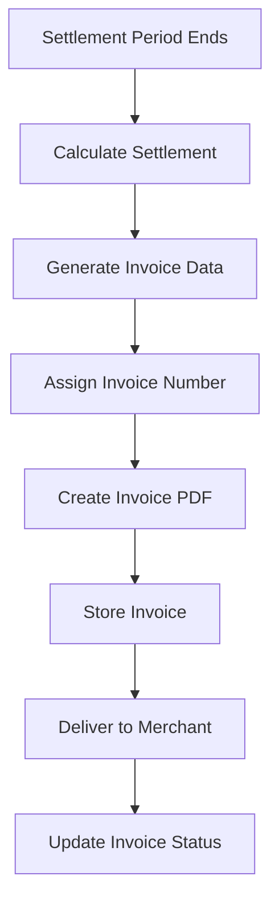

# Software Requirements Specification (SRS)

## Part 06E: Invoice & Reporting

**Module:** Finance & Billing Module (Part 07)
**Version:** 1.0.0
**Status:** Final / For Review
**Date:** 2026-06-30

---

## Chapter 1 – Overview

### Purpose

The Invoice & Reporting module defines the complete invoicing and financial reporting capabilities for merchants on the **[Platform Name]** platform. This encompasses invoice generation, delivery, reconciliation, financial reporting, tax reporting, and analytics.

Professional, accurate, and timely invoicing is essential for merchant trust and operational efficiency. Merchants need clear financial documentation for their accounting, tax compliance, and business planning. This module ensures that merchants receive comprehensive financial reports that enable them to manage their business effectively.

### Objectives

- Generate professional, accurate merchant invoices
- Support multiple invoice formats and delivery methods
- Enable comprehensive financial reporting
- Provide tax reporting and compliance documentation
- Support reconciliation and dispute resolution
- Enable data export for merchant accounting systems
- Provide financial analytics and insights
- Maintain complete audit trail

---

## Chapter 2 – Invoice Structure

### INV-001 Invoice Components

| Component | Description | Priority |
| :--- | :--- | :--- |
| **Header** | Invoice number, date, merchant details. | **Required** |
| **Summary** | Period, order count, gross revenue, net settlement. | **Required** |
| **Order Breakdown** | Detailed list of all orders. | **Required** |
| **Commission Details** | Commission calculation breakdown. | **Required** |
| **Fee Details** | Service fees, delivery fees, payment fees. | **Required** |
| **Tax Summary** | Tax collected and remitted. | **Required** |
| **Adjustments** | Manual adjustments (credits/debits). | **Required** |
| **Payment Details** | Payout method, amount, date. | **Required** |
| **Footer** | Payment terms, contact information. | **Required** |

### INV-002 Invoice Data Fields

| Field | Type | Description | Priority |
| :--- | :--- | :--- | :--- |
| `invoice_number` | String | Unique sequential invoice number. | **Required** |
| `invoice_date` | Date | Date invoice is generated. | **Required** |
| `period_start` | Date | Settlement period start. | **Required** |
| `period_end` | Date | Settlement period end. | **Required** |
| `merchant_name` | String | Legal business name. | **Required** |
| `merchant_tax_id` | String | Tax/VAT registration number. | **Required** |
| `store_name` | String | Store display name. | **Required** |
| `store_address` | String | Store physical address. | **Required** |
| `order_count` | Integer | Number of orders in period. | **Required** |
| `gross_revenue` | Decimal | Total order value. | **Required** |
| `total_commission` | Decimal | Commission deducted. | **Required** |
| `total_fees` | Decimal | Fees deducted. | **Required** |
| `total_tax` | Decimal | Tax collected. | **Required** |
| `total_adjustments` | Decimal | Manual adjustments. | **Required** |
| `net_amount` | Decimal | Net settlement amount. | **Required** |
| `currency` | String | ISO 4217 currency code. | **Required** |
| `payout_method` | String | Bank transfer, wallet, etc. | **Required** |
| `payout_date` | Date | Date payout was/will be made. | **Required** |
| `payment_terms` | String | Payment terms (e.g., "Net 7"). | **Required** |

### INV-003 Invoice Numbering

| Rule | Description | Priority |
| :--- | :--- | :--- |
| **Format** | `INV-{YYYY}-{MM}-{SEQ}` | **Required** |
| **Sequential** | Unique sequential number per merchant. | **Required** |
| **No Gaps** | No gaps in invoice numbering. | **Required** |
| **Reset** | Resets annually (YYYY component). | **Required** |

### INV-004 Invoice Example

```
╔══════════════════════════════════════════════════════════════════╗
║                        INVOICE                                   ║
║                        INV-2026-01-0042                          ║
╠══════════════════════════════════════════════════════════════════╣
║  Merchant:  Joe's Pizza Palace                                   ║
║  Tax ID:    123-456-789                                          ║
║  Store:     123 Main St, Dubai, UAE                              ║
║  Period:    2026-01-01 to 2026-01-31                            ║
║  Invoice Date:  2026-02-01                                      ║
╠══════════════════════════════════════════════════════════════════╣
║  SUMMARY                                                         ║
║  ──────────────────────────────────────────────────────────────── ║
║  Orders:              150                                        ║
║  Gross Revenue:       $4,500.00                                  ║
║  Commission (20%):    ($900.00)                                  ║
║  Service Fee (2%):    ($90.00)                                   ║
║  Delivery Fees:       ($75.00)                                   ║
║  Payment Fees:        ($130.50)                                  ║
║  Tax Collected:       ($225.00)                                  ║
║  Adjustments:         $25.00                                     ║
║  ──────────────────────────────────────────────────────────────── ║
║  Net Amount:          $3,154.50                                  ║
╠══════════════════════════════════════════════════════════════════╣
║  Order Breakdown (150 orders total)                              ║
║  ──────────────────────────────────────────────────────────────── ║
║  Order #1001:  $45.00  Commission: $9.00  Net: $36.00           ║
║  Order #1002:  $30.00  Commission: $6.00  Net: $24.00           ║
║  ... (148 more orders)                                          ║
╠══════════════════════════════════════════════════════════════════╣
║  Payment Details:                                                ║
║  Payout Method:   Bank Transfer                                  ║
║  Payout Date:     2026-02-02                                    ║
║  Payment Terms:   Net 1                                          ║
║                                                                  ║
║  Please direct payment inquiries to finance@platform.com         ║
║                                                                  ║
║  Thank you for your business!                                   ║
╚══════════════════════════════════════════════════════════════════╝
```

---

## Chapter 3 – Invoice Generation

### INV-005 Generation Workflow



### INV-006 Generation Triggers

| Trigger | Description | Priority |
| :--- | :--- | :--- |
| **Period End** | Invoice generated at end of settlement period. | **Required** |
| **On-Demand** | Merchant requests invoice. | **Required** |
| **Admin-Initiated** | Admin generates invoice manually. | **Required** |
| **Adjustment** | Invoice regenerated after adjustment. | **Required** |

### INV-007 Invoice Statuses

| Status | Description |
| :--- | :--- |
| `PENDING` | Invoice being generated. |
| `GENERATED` | Invoice generated, ready for delivery. |
| `SENT` | Invoice sent to merchant. |
| `VIEWED` | Invoice viewed by merchant. |
| `PAID` | Invoice paid (settlement completed). |
| `OVERDUE` | Invoice overdue (payment not received). |
| `ADJUSTED` | Invoice adjusted (updated). |
| `CANCELLED` | Invoice cancelled. |

### INV-008 Invoice Data Model

| Column | Type | Constraints | Description |
| :--- | :--- | :--- | :--- |
| `invoice_id` | UUID | PRIMARY KEY | Unique identifier |
| `merchant_id` | UUID | FOREIGN KEY (merchant_accounts.merchant_id) | Associated merchant |
| `store_id` | UUID | FOREIGN KEY (merchant_stores.store_id) | Associated store |
| `settlement_id` | UUID | FOREIGN KEY (merchant_settlements.settlement_id) | Associated settlement |
| `invoice_number` | VARCHAR(50) | UNIQUE | Human-readable invoice number |
| `invoice_date` | DATE | NOT NULL | Invoice generation date |
| `period_start` | DATE | NOT NULL | Period start |
| `period_end` | DATE | NOT NULL | Period end |
| `order_count` | INTEGER | NOT NULL | Number of orders |
| `gross_revenue` | DECIMAL(12, 2) | NOT NULL | Gross revenue |
| `total_commission` | DECIMAL(12, 2) | NOT NULL | Commission deducted |
| `total_service_fee` | DECIMAL(12, 2) | DEFAULT 0 | Service fees |
| `total_delivery_fee_retained` | DECIMAL(12, 2) | DEFAULT 0 | Delivery fees retained |
| `total_payment_fee` | DECIMAL(12, 2) | DEFAULT 0 | Payment processing fees |
| `total_tax` | DECIMAL(12, 2) | DEFAULT 0 | Tax collected |
| `total_adjustments` | DECIMAL(12, 2) | DEFAULT 0 | Adjustments |
| `net_amount` | DECIMAL(12, 2) | NOT NULL | Net settlement amount |
| `currency` | VARCHAR(3) | NOT NULL | ISO 4217 currency |
| `payout_method` | VARCHAR(30) | | Payout method |
| `payout_date` | DATE | | Payout date |
| `payment_terms` | VARCHAR(50) | | Payment terms |
| `invoice_url` | VARCHAR(500) | | PDF invoice URL |
| `status` | VARCHAR(20) | DEFAULT 'PENDING' | PENDING/GENERATED/SENT/VIEWED/PAID/OVERDUE/ADJUSTED/CANCELLED |
| `sent_at` | TIMESTAMP | | When invoice was sent |
| `viewed_at` | TIMESTAMP | | When invoice was viewed |
| `paid_at` | TIMESTAMP | | When invoice was paid |
| `created_at` | TIMESTAMP | DEFAULT NOW() | Creation timestamp |
| `updated_at` | TIMESTAMP | DEFAULT NOW() | Last update timestamp |

---

## Chapter 4 – Invoice Delivery

### INV-009 Delivery Methods

| Method | Description | Priority |
| :--- | :--- | :--- |
| **Email** | Invoice attached as PDF. | **Required** |
| **Dashboard** | Invoice accessible in merchant dashboard. | **Required** |
| **API** | Invoice accessible via API. | **Required** |
| **Download** | Download PDF directly. | **Required** |

### INV-010 Email Template

| Component | Content | Priority |
| :--- | :--- | :--- |
| **Subject** | `Invoice {invoice_number} for {store_name} - {period}` | **Required** |
| **Greeting** | `Dear {merchant_name},` | **Required** |
| **Body** | Settlement summary, net amount, due date. | **Required** |
| **Attachments** | Invoice PDF. | **Required** |
| **Links** | Download invoice, view dashboard. | **Required** |
| **Footer** | Support contact information. | **Required** |

### INV-011 Email Example

```
Subject: Invoice INV-2026-01-0042 for Joe's Pizza Palace - January 2026

Dear Joe's Pizza Palace,

Your settlement invoice for January 2026 (01/01/2026 to 01/31/2026) is ready.

Summary:
─────────────
Orders:              150
Gross Revenue:       $4,500.00
Net Amount:          $3,154.50
Payment Date:        2026-02-02

View and download your invoice:
https://dashboard.platform.com/invoices/INV-2026-01-0042

If you have any questions, please contact finance@platform.com.

Thank you for your business!

Best regards,
[Platform Name] Finance Team
```

---

## Chapter 5 – Financial Reports

### INV-012 Report Types

| Report | Description | Frequency | Priority |
| :--- | :--- | :--- | :--- |
| **Settlement Report** | Detailed settlement breakdown. | Monthly | **Required** |
| **Commission Report** | Commission calculation summary. | Monthly | **Required** |
| **Fee Report** | Fee breakdown by type. | Monthly | **Required** |
| **Tax Report** | Tax collected and remitted. | Quarterly | **Required** |
| **Transaction Report** | All transactions with details. | Monthly | **Required** |
| **Annual Summary** | Year-end financial summary. | Annual | **Required** |
| **Customer Report** | Customer order analysis. | Monthly | **Required** |
| **Item Report** | Item sales analysis. | Monthly | **Required** |

### INV-013 Report Features

| Feature | Description | Priority |
| :--- | :--- | :--- |
| **Date Range** | Selectable date range for reports. | **Required** |
| **Filters** | Filter by store, order status, etc. | **Required** |
| **Export Formats** | PDF, CSV, Excel, JSON. | **Required** |
| **Scheduled Delivery** | Auto-deliver reports to merchant. | **Required** |
| **On-Demand** | Generate reports on demand. | **Required** |
| **Email Delivery** | Email reports to merchant. | **Required** |
| **Dashboard View** | View reports in dashboard. | **Required** |

### INV-014 Report Data Model

| Column | Type | Constraints | Description |
| :--- | :--- | :--- | :--- |
| `report_id` | UUID | PRIMARY KEY | Unique identifier |
| `merchant_id` | UUID | FOREIGN KEY (merchant_accounts.merchant_id) | Associated merchant |
| `report_type` | VARCHAR(30) | NOT NULL | SETTLEMENT/COMMISSION/FEE/TAX/TRANSACTION/ANNUAL/CUSTOMER/ITEM |
| `period_start` | DATE | NOT NULL | Report period start |
| `period_end` | DATE | NOT NULL | Report period end |
| `report_data` | JSONB | NOT NULL | Report data |
| `format` | VARCHAR(10) | DEFAULT 'PDF' | PDF/CSV/EXCEL/JSON |
| `file_url` | VARCHAR(500) | | Report file URL |
| `status` | VARCHAR(20) | DEFAULT 'PENDING' | PENDING/GENERATING/READY/FAILED |
| `sent_at` | TIMESTAMP | | When report was sent |
| `created_at` | TIMESTAMP | DEFAULT NOW() | Creation timestamp |
| `updated_at` | TIMESTAMP | DEFAULT NOW() | Last update timestamp |

---

## Chapter 6 – Tax Reporting

### INV-015 Tax Reports

| Report | Description | Frequency | Priority |
| :--- | :--- | :--- | :--- |
| **VAT/GST Report** | Tax collected and remitted. | Quarterly | **Required** |
| **Taxable Sales** | Taxable vs. tax-exempt sales. | Quarterly | **Required** |
| **Tax Return** | Tax return preparation data. | Quarterly | **Required** |
| **Customer Tax Report** | Tax per customer (for B2B). | Annually | **Medium** |

### INV-016 Tax Report Data Model

| Column | Type | Constraints | Description |
| :--- | :--- | :--- | :--- |
| `tax_report_id` | UUID | PRIMARY KEY | Unique identifier |
| `merchant_id` | UUID | FOREIGN KEY (merchant_accounts.merchant_id) | Associated merchant |
| `report_period` | DATE | NOT NULL | Reporting period |
| `taxable_sales` | DECIMAL(12, 2) | | Taxable sales amount |
| `tax_exempt_sales` | DECIMAL(12, 2) | | Tax-exempt sales |
| `total_sales` | DECIMAL(12, 2) | | Total sales |
| `tax_collected` | DECIMAL(12, 2) | | Tax collected |
| `tax_remitted` | DECIMAL(12, 2) | | Tax remitted |
| `tax_rate` | DECIMAL(5, 2) | | Applicable tax rate |
| `tax_jurisdiction` | VARCHAR(50) | | Tax jurisdiction |
| `file_url` | VARCHAR(500) | | Report file URL |
| `status` | VARCHAR(20) | DEFAULT 'PENDING' | PENDING/GENERATED/SENT/FILED |
| `filed_at` | TIMESTAMP | | When tax was filed |
| `created_at` | TIMESTAMP | DEFAULT NOW() | Creation timestamp |
| `updated_at` | TIMESTAMP | DEFAULT NOW() | Last update timestamp |

---

## Chapter 7 – Reconciliation Report

### INV-017 Reconciliation Report Structure

| Section | Content | Priority |
| :--- | :--- | :--- |
| **Header** | Merchant, period, reconciliation date. | **Required** |
| **Order Reconciliation** | All orders with expected vs. actual. | **Required** |
| **Fee Reconciliation** | All fees with expected vs. actual. | **Required** |
| **Commission Reconciliation** | Commission expected vs. actual. | **Required** |
| **Payment Reconciliation** | Payments expected vs. actual. | **Required** |
| **Discrepancies** | All discrepancies identified. | **Required** |
| **Resolution Status** | Status of each discrepancy. | **Required** |

### INV-018 Reconciliation Data Model

| Column | Type | Constraints | Description |
| :--- | :--- | :--- | :--- |
| `reconciliation_id` | UUID | PRIMARY KEY | Unique identifier |
| `merchant_id` | UUID | FOREIGN KEY (merchant_accounts.merchant_id) | Associated merchant |
| `period_start` | DATE | NOT NULL | Period start |
| `period_end` | DATE | NOT NULL | Period end |
| `reconciliation_date` | DATE | NOT NULL | Reconciliation date |
| `order_count` | INTEGER | | Number of orders |
| `expected_revenue` | DECIMAL(12, 2) | | Expected revenue |
| `actual_revenue` | DECIMAL(12, 2) | | Actual revenue |
| `discrepancy_count` | INTEGER | | Number of discrepancies |
| `discrepancy_amount` | DECIMAL(12, 2) | | Total discrepancy amount |
| `status` | VARCHAR(20) | DEFAULT 'PENDING' | PENDING/IN_REVIEW/RECONCILED/DISCREPANT |
| `reconciled_by` | UUID | | Reconciler identifier |
| `reconciled_at` | TIMESTAMP | | Reconciliation timestamp |
| `file_url` | VARCHAR(500) | | Report file URL |
| `created_at` | TIMESTAMP | DEFAULT NOW() | Creation timestamp |
| `updated_at` | TIMESTAMP | DEFAULT NOW() | Last update timestamp |

---

## Chapter 8 – Analytics Dashboard

### INV-019 Financial Analytics Widgets

| Widget | Description | Priority |
| :--- | :--- | :--- |
| **Revenue Trend** | Monthly revenue trend chart. | **Required** |
| **Commission Trend** | Monthly commission trend. | **Required** |
| **Fee Breakdown** | Pie chart of fee distribution. | **Required** |
| **Order Analysis** | Order volume by day/week/month. | **Required** |
| **Top Customers** | Highest spending customers. | **Required** |
| **Top Items** | Best-selling items. | **Required** |
| **Profitability** | Revenue vs. cost analysis. | **Required** |
| **Payment Status** | Invoice payment status distribution. | **Required** |

### INV-020 Financial KPIs

| KPI | Description | Target |
| :--- | :--- | :--- |
| **Gross Revenue** | Total sales revenue. | Increasing |
| **Net Revenue** | Revenue after commissions/fees. | Increasing |
| **Commission Paid** | Total commission paid to platform. | Monitor |
| **Average Order Value** | Average value per order. | Increasing |
| **Order Volume** | Number of orders per month. | Increasing |
| **Payment Speed** | Average time to payment. | Decreasing |

---

## Chapter 9 – Database Tables

### invoices

| Column | Type | Constraints | Description |
| :--- | :--- | :--- | :--- |
| `invoice_id` | UUID | PRIMARY KEY | Unique identifier |
| `merchant_id` | UUID | FOREIGN KEY (merchant_accounts.merchant_id) | Associated merchant |
| `store_id` | UUID | FOREIGN KEY (merchant_stores.store_id) | Associated store |
| `settlement_id` | UUID | FOREIGN KEY (merchant_settlements.settlement_id) | Associated settlement |
| `invoice_number` | VARCHAR(50) | UNIQUE | Human-readable invoice number |
| `invoice_date` | DATE | NOT NULL | Invoice generation date |
| `period_start` | DATE | NOT NULL | Period start |
| `period_end` | DATE | NOT NULL | Period end |
| `order_count` | INTEGER | NOT NULL | Number of orders |
| `gross_revenue` | DECIMAL(12, 2) | NOT NULL | Gross revenue |
| `total_commission` | DECIMAL(12, 2) | NOT NULL | Commission deducted |
| `total_service_fee` | DECIMAL(12, 2) | DEFAULT 0 | Service fees |
| `total_delivery_fee_retained` | DECIMAL(12, 2) | DEFAULT 0 | Delivery fees retained |
| `total_payment_fee` | DECIMAL(12, 2) | DEFAULT 0 | Payment processing fees |
| `total_promotions` | DECIMAL(12, 2) | DEFAULT 0 | Promotions |
| `total_adjustments` | DECIMAL(12, 2) | DEFAULT 0 | Adjustments |
| `total_tax` | DECIMAL(12, 2) | DEFAULT 0 | Tax collected |
| `net_amount` | DECIMAL(12, 2) | NOT NULL | Net settlement amount |
| `currency` | VARCHAR(3) | NOT NULL | ISO 4217 currency |
| `payout_method` | VARCHAR(30) | | Payout method |
| `payout_date` | DATE | | Payout date |
| `payment_terms` | VARCHAR(50) | | Payment terms |
| `invoice_url` | VARCHAR(500) | | PDF invoice URL |
| `status` | VARCHAR(20) | DEFAULT 'PENDING' | PENDING/GENERATED/SENT/VIEWED/PAID/OVERDUE/ADJUSTED/CANCELLED |
| `sent_at` | TIMESTAMP | | When invoice was sent |
| `viewed_at` | TIMESTAMP | | When invoice was viewed |
| `paid_at` | TIMESTAMP | | When invoice was paid |
| `created_at` | TIMESTAMP | DEFAULT NOW() | Creation timestamp |
| `updated_at` | TIMESTAMP | DEFAULT NOW() | Last update timestamp |

### invoice_orders

| Column | Type | Constraints | Description |
| :--- | :--- | :--- | :--- |
| `invoice_order_id` | UUID | PRIMARY KEY | Unique identifier |
| `invoice_id` | UUID | FOREIGN KEY (invoices.invoice_id) | Associated invoice |
| `order_id` | UUID | FOREIGN KEY (orders.order_id) | Associated order |
| `order_date` | DATE | NOT NULL | Order date |
| `order_total` | DECIMAL(12, 2) | NOT NULL | Order total |
| `commission` | DECIMAL(12, 2) | NOT NULL | Commission deducted |
| `service_fee` | DECIMAL(12, 2) | DEFAULT 0 | Service fee deducted |
| `delivery_fee_retained` | DECIMAL(12, 2) | DEFAULT 0 | Delivery fee retained |
| `payment_fee` | DECIMAL(12, 2) | DEFAULT 0 | Payment fee |
| `promotions` | DECIMAL(12, 2) | DEFAULT 0 | Promotions |
| `adjustments` | DECIMAL(12, 2) | DEFAULT 0 | Adjustments |
| `tax` | DECIMAL(12, 2) | DEFAULT 0 | Tax |
| `net_amount` | DECIMAL(12, 2) | NOT NULL | Net amount for order |
| `created_at` | TIMESTAMP | DEFAULT NOW() | Creation timestamp |

### financial_reports

| Column | Type | Constraints | Description |
| :--- | :--- | :--- | :--- |
| `report_id` | UUID | PRIMARY KEY | Unique identifier |
| `merchant_id` | UUID | FOREIGN KEY (merchant_accounts.merchant_id) | Associated merchant |
| `report_type` | VARCHAR(30) | NOT NULL | SETTLEMENT/COMMISSION/FEE/TAX/TRANSACTION/ANNUAL/CUSTOMER/ITEM |
| `period_start` | DATE | NOT NULL | Report period start |
| `period_end` | DATE | NOT NULL | Report period end |
| `report_data` | JSONB | NOT NULL | Report data |
| `format` | VARCHAR(10) | DEFAULT 'PDF' | PDF/CSV/EXCEL/JSON |
| `file_url` | VARCHAR(500) | | Report file URL |
| `status` | VARCHAR(20) | DEFAULT 'PENDING' | PENDING/GENERATING/READY/FAILED |
| `sent_at` | TIMESTAMP | | When report was sent |
| `created_at` | TIMESTAMP | DEFAULT NOW() | Creation timestamp |
| `updated_at` | TIMESTAMP | DEFAULT NOW() | Last update timestamp |

### tax_reports

| Column | Type | Constraints | Description |
| :--- | :--- | :--- | :--- |
| `tax_report_id` | UUID | PRIMARY KEY | Unique identifier |
| `merchant_id` | UUID | FOREIGN KEY (merchant_accounts.merchant_id) | Associated merchant |
| `report_period` | DATE | NOT NULL | Reporting period |
| `taxable_sales` | DECIMAL(12, 2) | | Taxable sales |
| `tax_exempt_sales` | DECIMAL(12, 2) | | Tax-exempt sales |
| `total_sales` | DECIMAL(12, 2) | | Total sales |
| `tax_collected` | DECIMAL(12, 2) | | Tax collected |
| `tax_remitted` | DECIMAL(12, 2) | | Tax remitted |
| `tax_rate` | DECIMAL(5, 2) | | Applicable tax rate |
| `tax_jurisdiction` | VARCHAR(50) | | Tax jurisdiction |
| `file_url` | VARCHAR(500) | | Report file URL |
| `status` | VARCHAR(20) | DEFAULT 'PENDING' | PENDING/GENERATED/SENT/FILED |
| `filed_at` | TIMESTAMP | | When tax was filed |
| `created_at` | TIMESTAMP | DEFAULT NOW() | Creation timestamp |
| `updated_at` | TIMESTAMP | DEFAULT NOW() | Last update timestamp |

### reconciliation_reports

| Column | Type | Constraints | Description |
| :--- | :--- | :--- | :--- |
| `reconciliation_id` | UUID | PRIMARY KEY | Unique identifier |
| `merchant_id` | UUID | FOREIGN KEY (merchant_accounts.merchant_id) | Associated merchant |
| `period_start` | DATE | NOT NULL | Period start |
| `period_end` | DATE | NOT NULL | Period end |
| `reconciliation_date` | DATE | NOT NULL | Reconciliation date |
| `order_count` | INTEGER | | Number of orders |
| `expected_revenue` | DECIMAL(12, 2) | | Expected revenue |
| `actual_revenue` | DECIMAL(12, 2) | | Actual revenue |
| `discrepancy_count` | INTEGER | | Number of discrepancies |
| `discrepancy_amount` | DECIMAL(12, 2) | | Total discrepancy |
| `status` | VARCHAR(20) | DEFAULT 'PENDING' | PENDING/IN_REVIEW/RECONCILED/DISCREPANT |
| `reconciled_by` | UUID | | Reconciler identifier |
| `reconciled_at` | TIMESTAMP | | Reconciliation timestamp |
| `file_url` | VARCHAR(500) | | Report file URL |
| `created_at` | TIMESTAMP | DEFAULT NOW() | Creation timestamp |
| `updated_at` | TIMESTAMP | DEFAULT NOW() | Last update timestamp |

---

## Chapter 10 – REST APIs

### Invoice APIs

| Method | Endpoint | Description |
| :--- | :--- | :--- |
| `GET` | `/api/v1/merchant/invoices` | List invoices |
| `GET` | `/api/v1/merchant/invoices/{id}` | Get invoice details |
| `GET` | `/api/v1/merchant/invoices/{id}/download` | Download invoice PDF |
| `GET` | `/api/v1/merchant/invoices/latest` | Get latest invoice |
| `GET` | `/api/v1/merchant/invoices/upcoming` | Get upcoming invoice |
| `POST` | `/api/v1/merchant/invoices/{id}/resend` | Resend invoice email |

### Report APIs

| Method | Endpoint | Description |
| :--- | :--- | :--- |
| `GET` | `/api/v1/merchant/reports` | Get available reports |
| `POST` | `/api/v1/merchant/reports/generate` | Generate report |
| `GET` | `/api/v1/merchant/reports/{id}` | Get report details |
| `GET` | `/api/v1/merchant/reports/{id}/download` | Download report |
| `POST` | `/api/v1/merchant/reports/schedule` | Schedule report delivery |

### Tax Report APIs

| Method | Endpoint | Description |
| :--- | :--- | :--- |
| `GET` | `/api/v1/merchant/tax/reports` | Get tax reports |
| `GET` | `/api/v1/merchant/tax/reports/{id}` | Get tax report details |
| `GET` | `/api/v1/merchant/tax/reports/{id}/download` | Download tax report |

### Reconciliation APIs

| Method | Endpoint | Description |
| :--- | :--- | :--- |
| `GET` | `/api/v1/merchant/reconciliation` | Get reconciliation status |
| `GET` | `/api/v1/merchant/reconciliation/{id}` | Get reconciliation report |
| `POST` | `/api/v1/merchant/reconciliation/dispute` | File reconciliation dispute |

### Analytics APIs

| Method | Endpoint | Description |
| :--- | :--- | :--- |
| `GET` | `/api/v1/merchant/finance/analytics` | Get financial analytics |
| `GET` | `/api/v1/merchant/finance/kpis` | Get financial KPIs |
| `GET` | `/api/v1/merchant/finance/dashboard` | Get financial dashboard |

### Admin APIs

| Method | Endpoint | Description |
| :--- | :--- | :--- |
| `GET` | `/api/v1/admin/merchants/{id}/invoices` | Get merchant invoices (admin) |
| `POST` | `/api/v1/admin/merchants/{id}/invoices/generate` | Generate invoice (admin) |
| `POST` | `/api/v1/admin/merchants/{id}/reports/generate` | Generate report (admin) |
| `GET` | `/api/v1/admin/invoices/analytics` | Get invoice analytics (admin) |

---

## Chapter 11 – Business Rules

| Rule ID | Rule Description | Priority |
| :--- | :--- | :--- |
| **BR-INV-001** | Invoices are generated at the end of each settlement period. | **High** |
| **BR-INV-002** | Invoice numbers must be unique and sequential. | **High** |
| **BR-INV-003** | Invoices must include all order details for the period. | **High** |
| **BR-INV-004** | Invoices must be delivered within 24 hours of generation. | **High** |
| **BR-INV-005** | Tax reports must be generated quarterly. | **High** |
| **BR-INV-006** | Reconciliation reports must be available on demand. | **High** |
| **BR-INV-007** | Invoice data must be retained for 7 years. | **High** |
| **BR-INV-008** | Invoices are generated in PDF format. | **High** |
| **BR-INV-009** | Merchants can request invoice adjustments within 30 days. | **High** |
| **BR-INV-010** | All financial reports must be auditable. | **High** |

---

## Chapter 12 – Acceptance Tests

| Test ID | Test Description | Priority |
| :--- | :--- | :--- |
| **TEST-INV-001** | Invoice generated at end of settlement period. | **High** |
| **TEST-INV-002** | Invoice contains all required components. | **High** |
| **TEST-INV-003** | Invoice number is unique and sequential. | **High** |
| **TEST-INV-004** | Invoice calculations are correct. | **High** |
| **TEST-INV-005** | Merchant views invoice in dashboard. | **High** |
| **TEST-INV-006** | Merchant downloads invoice PDF. | **High** |
| **TEST-INV-007** | Invoice email is sent to merchant. | **High** |
| **TEST-INV-008** | Merchant views invoice order breakdown. | **High** |
| **TEST-INV-009** | Merchant requests on-demand invoice. | **High** |
| **TEST-INV-010** | Settlement report generated correctly. | **High** |
| **TEST-INV-011** | Commission report generated correctly. | **High** |
| **TEST-INV-012** | Fee report generated correctly. | **High** |
| **TEST-INV-013** | Tax report generated correctly. | **High** |
| **TEST-INV-014** | Merchant exports report to CSV. | **High** |
| **TEST-INV-015** | Merchant exports report to Excel. | **High** |
| **TEST-INV-016** | Scheduled report delivered by email. | **High** |
| **TEST-INV-017** | Reconciliation report generated. | **High** |
| **TEST-INV-018** | Reconciliation discrepancies identified. | **High** |
| **TEST-INV-019** | Merchant files reconciliation dispute. | **High** |
| **TEST-INV-020** | Financial analytics dashboard displays correctly. | **High** |
| **TEST-INV-021** | Revenue trend chart displays correctly. | **High** |
| **TEST-INV-022** | Fee breakdown pie chart displays correctly. | **High** |
| **TEST-INV-023** | Admin generates merchant invoice manually. | **High** |
| **TEST-INV-024** | Invoice status updates correctly. | **High** |
| **TEST-INV-025** | Invoice adjustment processed correctly. | **High** |

---

## Chapter 13 – Traceability Matrix

| Requirement | Database Table | API Endpoint(s) | Acceptance Test |
| :--- | :--- | :--- | :--- |
| INV-005 | invoices | GET /api/v1/merchant/invoices | TEST-INV-001, TEST-INV-002 |
| INV-003 | invoices | GET /api/v1/merchant/invoices/{id} | TEST-INV-003, TEST-INV-004 |
| INV-009 | invoices | GET /api/v1/merchant/invoices/{id}/download | TEST-INV-005, TEST-INV-006 |
| INV-009 | invoices | POST /api/v1/merchant/invoices/{id}/resend | TEST-INV-007 |
| INV-002 | invoice_orders | GET /api/v1/merchant/invoices/{id} | TEST-INV-008 |
| INV-005 | invoices | GET /api/v1/merchant/invoices/latest | TEST-INV-009 |
| INV-012 | financial_reports | POST /api/v1/merchant/reports/generate | TEST-INV-010, TEST-INV-011, TEST-INV-012 |
| INV-015 | tax_reports | GET /api/v1/merchant/tax/reports | TEST-INV-013 |
| INV-013 | financial_reports | GET /api/v1/merchant/reports/{id}/download | TEST-INV-014, TEST-INV-015 |
| INV-013 | financial_reports | POST /api/v1/merchant/reports/schedule | TEST-INV-016 |
| INV-017 | reconciliation_reports | GET /api/v1/merchant/reconciliation | TEST-INV-017, TEST-INV-018, TEST-INV-019 |
| INV-019 | financial_reports | GET /api/v1/merchant/finance/dashboard | TEST-INV-020, TEST-INV-021, TEST-INV-022 |
| INV-005 | invoices | POST /api/v1/admin/merchants/{id}/invoices/generate | TEST-INV-023 |
| INV-007 | invoices | GET /api/v1/merchant/invoices/{id} | TEST-INV-024 |

---

## Chapter 14 – Summary

This document establishes the complete invoice and reporting capability for the **[Platform Name]** platform. Key takeaways:

- **Professional Invoices:** Comprehensive invoices with detailed order breakdowns, commission calculations, fee summaries, and tax information.
- **Automated Generation:** Automatic invoice generation at settlement period end with unique sequential numbering.
- **Multiple Delivery Methods:** Email, dashboard, API, and direct download for merchant convenience.
- **Comprehensive Reports:** Settlement reports, commission reports, fee reports, tax reports, transaction reports, and annual summaries.
- **Tax Reporting:** Detailed tax reports for VAT/GST compliance with taxable vs. tax-exempt sales breakdown.
- **Reconciliation:** Comprehensive reconciliation reports with discrepancy identification and resolution workflows.
- **Financial Analytics:** Dashboard with revenue trends, commission trends, fee breakdowns, and KPIs.
- **Export Capabilities:** PDF, CSV, Excel, and JSON export formats for merchant accounting systems.
- **Audit Trail:** Complete history of all invoices, reports, and reconciliation activities.

The invoice and reporting module provides merchants with the financial visibility and documentation they need to manage their business effectively, ensuring trust and transparency in the platform relationship.

---

**Next Document:**

`Part_06F_Tax_Compliance.md`

*(This builds on invoicing to define tax compliance, VAT/GST handling, and regulatory reporting.)*