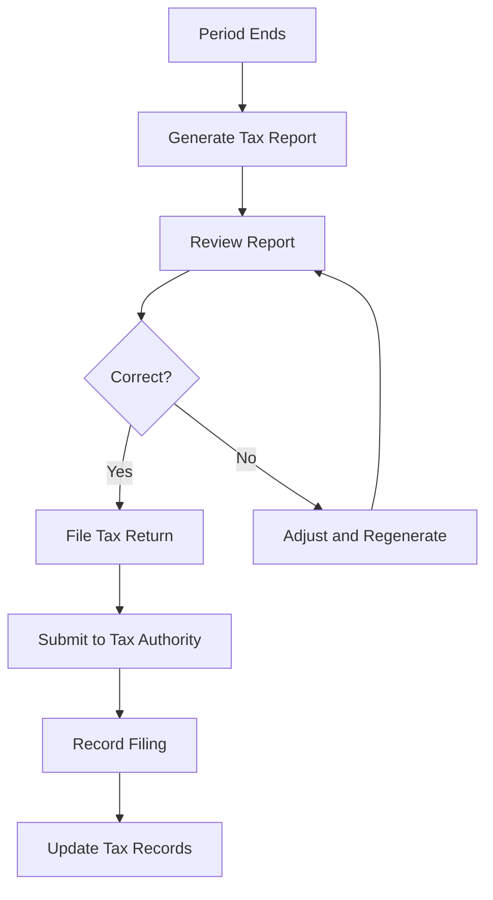

# Software Requirements Specification (SRS)

## Part 06F: Tax Compliance

**Module:** Finance & Billing Module (Part 07)
**Version:** 1.0.0
**Status:** Final / For Review
**Date:** 2026-06-30

---

## Chapter 1 – Overview

### Purpose

The Tax Compliance module defines the comprehensive tax management capabilities required for the **[Platform Name]** platform to operate in compliance with local, regional, and international tax regulations. This encompasses tax calculation, collection, reporting, filing, and audit readiness.

Tax compliance is a critical operational and legal requirement. Failure to correctly calculate, collect, report, and remit taxes can result in significant penalties, reputational damage, and legal exposure. This module ensures that the platform handles taxes accurately and transparently across all jurisdictions of operation, supporting multiple tax types, rates, and regimes.

### Objectives

- Calculate taxes accurately on all transactions
- Support multiple tax types (VAT, GST, Sales Tax, etc.)
- Handle multi-jurisdictional tax requirements
- Generate comprehensive tax reports for filing
- Maintain audit-ready tax records
- Support tax exemptions and zero-rated transactions
- Enable tax configuration without code changes
- Ensure compliance with regulatory deadlines

---

## Chapter 2 – Tax Framework

### TAX-001 Tax Types

| Tax Type | Description | Regions | Priority |
| :--- | :--- | :--- | :--- |
| **VAT (Value Added Tax)** | Standard consumption tax. | EU, UAE, KSA, UK, Australia | **Required** |
| **GST (Goods & Services Tax)** | Similar to VAT. | India, Canada, Singapore, Malaysia | **Required** |
| **Sales Tax** | US state-level sales tax. | USA (state-specific) | **Required** |
| **Service Tax** | Tax on services. | Various | **Required** |
| **Withholding Tax** | Tax withheld at source. | Various | **Required** |
| **Customs Duty** | Import/export duties. | International | **Optional** |

### TAX-002 Tax Jurisdictions

| Jurisdiction | Tax Type | Standard Rate | Priority |
| :--- | :--- | :--- | :--- |
| **UAE** | VAT | 5% | **Required** |
| **KSA** | VAT | 15% | **Required** |
| **Egypt** | VAT | 14% | **Required** |
| **EU** | VAT | 15-27% (country-specific) | **Required** |
| **UK** | VAT | 20% | **Required** |
| **USA** | Sales Tax | 0-11.5% (state-specific) | **Required** |
| **India** | GST | 5-28% (category-specific) | **Required** |
| **Singapore** | GST | 9% | **Required** |
| **Malaysia** | SST | 6-10% | **Required** |
| **Australia** | GST | 10% | **Required** |

### TAX-003 Taxable Events

| Event | Description | Tax Trigger | Priority |
| :--- | :--- | :--- | :--- |
| **Order Placement** | Customer places order. | Tax calculated at checkout. | **Required** |
| **Order Completion** | Order delivered. | Tax collected. | **Required** |
| **Refund** | Refund processed. | Tax adjustment. | **Required** |
| **Subscription** | Recurring charge. | Tax on each billing cycle. | **Required** |
| **Fee Charge** | Service/delivery fees. | Tax on fees (if applicable). | **Required** |

---

## Chapter 3 – Tax Calculation

### TAX-004 Calculation Methods

| Method | Description | Priority |
| :--- | :--- | :--- |
| **Standard** | Tax on subtotal. | **Required** |
| **Inclusive** | Tax included in price. | **Required** |
| **Exclusive** | Tax added to price. | **Required** |
| **Composite** | Multiple tax rates applied. | **Required** |
| **Zero-Rated** | 0% tax rate. | **Required** |
| **Exempt** | No tax applied. | **Required** |

### TAX-005 Calculation Formula

```
Tax = Subtotal × Tax_Rate

Where:
- Subtotal = Sum of all taxable items
- Tax_Rate = Applicable tax rate for jurisdiction and product category

For Inclusive Pricing:
- Price includes tax
- Tax = Price - (Price / (1 + Tax_Rate))
```

### TAX-006 Calculation Examples

**Example 1: Exclusive VAT (UAE)**
| Component | Amount | Tax (5%) | Total |
| :--- | :--- | :--- | :--- |
| Food Items | $45.00 | $2.25 | $47.25 |
| Delivery Fee | $5.00 | $0.25 | $5.25 |
| **Total** | **$50.00** | **$2.50** | **$52.50** |

**Example 2: Inclusive VAT (UAE)**
| Component | Amount | Tax (5%) | Total |
| :--- | :--- | :--- | :--- |
| Food Items | $47.25 | $2.25 | $47.25 |
| Delivery Fee | $5.25 | $0.25 | $5.25 |
| **Total** | **$52.50** | **$2.50** | **$52.50** |

**Example 3: Multiple Tax Rates**
| Item | Rate | Tax |
| :--- | :--- | :--- |
| Food Items | 5% | $2.25 |
| Grocery Items | 0% (Zero-rated) | $0.00 |
| Delivery Fee | 5% | $0.25 |
| **Total Tax** | | **$2.50** |

### TAX-007 Tax Calculation Data Model

| Attribute | Type | Required | Description |
| :--- | :--- | :--- | :--- |
| `tax_calculation_id` | UUID | Yes | Unique identifier |
| `order_id` | UUID | Yes | Associated order |
| `jurisdiction` | String | Yes | Tax jurisdiction |
| `tax_type` | String | Yes | VAT/GST/SALES_TAX |
| `tax_rate` | Decimal | Yes | Applicable tax rate |
| `taxable_amount` | Decimal | Yes | Amount tax is calculated on |
| `tax_amount` | Decimal | Yes | Tax amount |
| `tax_inclusive` | Boolean | Yes | Whether tax is inclusive |
| `tax_exempt` | Boolean | Yes | Whether order is exempt |
| `calculation_details` | JSONB | | Detailed breakdown |
| `created_at` | Timestamp | Yes | Creation timestamp |

---

## Chapter 4 – Tax Registration

### TAX-008 Merchant Tax Registration

| Field | Type | Required | Description |
| :--- | :--- | :--- | :--- |
| `tax_registration_number` | String | Yes | VAT/GST registration number |
| `tax_registration_country` | String | Yes | Country of registration |
| `tax_registration_date` | Date | Yes | Registration date |
| `tax_registration_expiry` | Date | | Expiry date (if applicable) |
| `tax_registration_status` | String | Yes | ACTIVE/EXPIRED/PENDING/INACTIVE |
| `tax_certificate_url` | String | | URL to tax certificate |
| `tax_agent_name` | String | | Tax agent/representative name |
| `tax_agent_phone` | String | | Tax agent phone |
| `tax_agent_email` | String | | Tax agent email |
| `is_registered` | Boolean | Yes | Whether registered for tax |

### TAX-009 Registration Rules

| Rule | Description | Priority |
| :--- | :--- | :--- |
| **Mandatory Registration** | Merchant must be registered for tax in their jurisdiction. | **High** |
| **Verification** | Tax registration number must be verified. | **High** |
| **Expiry Monitoring** | System monitors registration expiry. | **High** |
| **Multi-Jurisdiction** | Merchants can be registered in multiple jurisdictions. | **High** |

### TAX-010 Registration Data Model

| Column | Type | Constraints | Description |
| :--- | :--- | :--- | :--- |
| `registration_id` | UUID | PRIMARY KEY | Unique identifier |
| `merchant_id` | UUID | FOREIGN KEY (merchant_accounts.merchant_id) | Associated merchant |
| `jurisdiction` | VARCHAR(50) | NOT NULL | Tax jurisdiction |
| `registration_number` | VARCHAR(50) | NOT NULL | Tax registration number |
| `registration_date` | DATE | NOT NULL | Registration date |
| `expiry_date` | DATE | | Expiry date |
| `status` | VARCHAR(20) | DEFAULT 'PENDING' | ACTIVE/EXPIRED/PENDING/INACTIVE |
| `certificate_url` | VARCHAR(500) | | Tax certificate URL |
| `verified_by` | UUID | | Admin who verified |
| `verified_at` | TIMESTAMP | | Verification timestamp |
| `created_at` | TIMESTAMP | DEFAULT NOW() | Creation timestamp |
| `updated_at` | TIMESTAMP | DEFAULT NOW() | Last update timestamp |

---

## Chapter 5 – Tax Exemptions

### TAX-011 Exemption Types

| Type | Description | Priority |
| :--- | :--- | :--- |
| **Customer Exemption** | Customer is tax-exempt (B2B). | **Required** |
| **Product Exemption** | Specific products are tax-exempt. | **Required** |
| **Category Exemption** | Entire categories are tax-exempt. | **Required** |
| **Regional Exemption** | Tax exemption in specific regions. | **Required** |
| **Temporary Exemption** | Time-limited tax exemption. | **Required** |

### TAX-012 Exemption Validation

| Validation | Description | Priority |
| :--- | :--- | :--- |
| **Certificate Validation** | Valid tax exemption certificate. | **High** |
| **Expiry Check** | Exemption certificate not expired. | **High** |
| **Jurisdiction Match** | Exemption matches jurisdiction. | **High** |
| **Product Match** | Exemption applies to products. | **High** |

### TAX-013 Exemption Data Model

| Column | Type | Constraints | Description |
| :--- | :--- | :--- | :--- |
| `exemption_id` | UUID | PRIMARY KEY | Unique identifier |
| `merchant_id` | UUID | FOREIGN KEY (merchant_accounts.merchant_id) | Associated merchant |
| `customer_id` | UUID | FOREIGN KEY (customers.customer_id) | Associated customer |
| `exemption_type` | VARCHAR(30) | NOT NULL | CUSTOMER/PRODUCT/CATEGORY/REGIONAL/TEMPORARY |
| `exemption_reason` | VARCHAR(100) | NOT NULL | Reason for exemption |
| `exemption_certificate_url` | VARCHAR(500) | | Certificate URL |
| `applicable_jurisdictions` | TEXT[] | | Jurisdictions where exemption applies |
| `applicable_categories` | TEXT[] | | Categories where exemption applies |
| `applicable_items` | TEXT[] | | Items where exemption applies |
| `effective_date` | DATE | NOT NULL | Effective date |
| `expiry_date` | DATE | | Expiry date |
| `status` | VARCHAR(20) | DEFAULT 'ACTIVE' | ACTIVE/EXPIRED/PENDING/REVOKED |
| `verified_by` | UUID | | Admin who verified |
| `verified_at` | TIMESTAMP | | Verification timestamp |
| `created_at` | TIMESTAMP | DEFAULT NOW() | Creation timestamp |
| `updated_at` | TIMESTAMP | DEFAULT NOW() | Last update timestamp |

---

## Chapter 6 – Tax Reporting

### TAX-014 Tax Reports

| Report | Description | Frequency | Priority |
| :--- | :--- | :--- | :--- |
| **VAT Return** | Standard VAT return report. | Quarterly/Monthly | **Required** |
| **GST Return** | GST return report. | Quarterly/Monthly | **Required** |
| **Sales Tax Return** | US sales tax return. | Monthly | **Required** |
| **Taxable Sales Report** | Taxable vs. tax-exempt sales. | Monthly | **Required** |
| **Tax Collected Report** | Tax collected by jurisdiction. | Monthly | **Required** |
| **Tax Remitted Report** | Tax remitted by jurisdiction. | Monthly | **Required** |
| **Customer Tax Report** | Tax per customer (B2B). | Annually | **Required** |
| **Tax Audit Report** | Detailed tax audit trail. | On-demand | **Required** |

### TAX-015 Report Data Fields

| Field | Description | Priority |
| :--- | :--- | :--- |
| `report_period` | Reporting period (month/quarter). | **Required** |
| `jurisdiction` | Tax jurisdiction. | **Required** |
| `tax_type` | VAT/GST/Sales Tax. | **Required** |
| `total_sales` | Total sales in period. | **Required** |
| `taxable_sales` | Taxable sales amount. | **Required** |
| `tax_exempt_sales` | Tax-exempt sales amount. | **Required** |
| `zero_rated_sales` | Zero-rated sales amount. | **Required** |
| `tax_collected` | Total tax collected. | **Required** |
| `input_tax` | Input tax (tax paid on purchases). | **Required** |
| `net_tax_due` | Net tax to remit. | **Required** |
| `reconciliation_status` | Whether reconciled with accounting. | **Required** |

### TAX-016 Filing Workflow



### TAX-017 Filing Data Model

| Column | Type | Constraints | Description |
| :--- | :--- | :--- | :--- |
| `filing_id` | UUID | PRIMARY KEY | Unique identifier |
| `merchant_id` | UUID | FOREIGN KEY (merchant_accounts.merchant_id) | Associated merchant |
| `jurisdiction` | VARCHAR(50) | NOT NULL | Tax jurisdiction |
| `filing_period` | DATE | NOT NULL | Filing period (month/quarter) |
| `total_sales` | DECIMAL(12, 2) | | Total sales |
| `taxable_sales` | DECIMAL(12, 2) | | Taxable sales |
| `tax_exempt_sales` | DECIMAL(12, 2) | | Tax-exempt sales |
| `zero_rated_sales` | DECIMAL(12, 2) | | Zero-rated sales |
| `tax_collected` | DECIMAL(12, 2) | | Tax collected |
| `input_tax` | DECIMAL(12, 2) | | Input tax |
| `net_tax_due` | DECIMAL(12, 2) | | Net tax due |
| `filing_date` | DATE | | Filing date |
| `filing_status` | VARCHAR(20) | DEFAULT 'PENDING' | PENDING/FILED/AMENDED/OVERDUE |
| `filing_reference` | VARCHAR(50) | | Filing reference number |
| `payment_date` | DATE | | Payment date |
| `payment_reference` | VARCHAR(50) | | Payment reference |
| `report_url` | VARCHAR(500) | | Filed report URL |
| `created_at` | TIMESTAMP | DEFAULT NOW() | Creation timestamp |
| `updated_at` | TIMESTAMP | DEFAULT NOW() | Last update timestamp |

---

## Chapter 7 – Tax Configuration

### TAX-018 Configurable Parameters

| Parameter | Description | Priority |
| :--- | :--- | :--- |
| **Tax Rates** | Configure tax rates by jurisdiction. | **Required** |
| **Tax Rules** | Configure tax calculation rules. | **Required** |
| **Tax Exemptions** | Configure tax exemption rules. | **Required** |
| **Filing Schedules** | Configure filing due dates. | **Required** |
| **Rounding Rules** | Configure tax rounding. | **Required** |
| **Categories** | Map product categories to tax types. | **Required** |

### TAX-019 Configuration Data Model

| Column | Type | Constraints | Description |
| :--- | :--- | :--- | :--- |
| `config_id` | UUID | PRIMARY KEY | Unique identifier |
| `jurisdiction` | VARCHAR(50) | NOT NULL | Tax jurisdiction |
| `tax_type` | VARCHAR(20) | NOT NULL | VAT/GST/SALES_TAX |
| `tax_rate` | DECIMAL(5, 2) | NOT NULL | Standard tax rate |
| `tax_inclusive` | BOOLEAN | DEFAULT FALSE | Whether tax is inclusive |
| `filing_frequency` | VARCHAR(20) | DEFAULT 'QUARTERLY' | MONTHLY/QUARTERLY/ANNUAL |
| `filing_due_date` | INTEGER | | Days after period end |
| `rounding_method` | VARCHAR(10) | DEFAULT 'HALF_UP' | HALF_UP/HALF_DOWN/CEILING/FLOOR |
| `is_active` | BOOLEAN | DEFAULT TRUE | Active status |
| `effective_date` | DATE | NOT NULL | Effective date |
| `end_date` | DATE | | End date |
| `created_at` | TIMESTAMP | DEFAULT NOW() | Creation timestamp |
| `updated_at` | TIMESTAMP | DEFAULT NOW() | Last update timestamp |

---

## Chapter 8 – Tax Audit

### TAX-020 Audit Trail

| Feature | Description | Priority |
| :--- | :--- | :--- |
| **Transaction Logging** | All tax-related transactions logged. | **Required** |
| **Tax Calculation Logging** | Tax calculations logged with details. | **Required** |
| **Exemption Logging** | Tax exemptions applied logged. | **Required** |
| **Rate Change Logging** | Tax rate changes logged. | **Required** |
| **Filing Logging** | Tax filings and payments logged. | **Required** |
| **Report Generation** | Tax audit reports generated. | **Required** |

### TAX-021 Audit Report Data Model

| Column | Type | Constraints | Description |
| :--- | :--- | :--- | :--- |
| `audit_id` | UUID | PRIMARY KEY | Unique identifier |
| `merchant_id` | UUID | FOREIGN KEY (merchant_accounts.merchant_id) | Associated merchant |
| `audit_period_start` | DATE | NOT NULL | Audit period start |
| `audit_period_end` | DATE | NOT NULL | Audit period end |
| `total_transactions` | INTEGER | | Total transactions audited |
| `total_tax_processed` | DECIMAL(12, 2) | | Total tax processed |
| `discrepancy_count` | INTEGER | | Number of discrepancies |
| `discrepancy_amount` | DECIMAL(12, 2) | | Total discrepancy amount |
| `status` | VARCHAR(20) | DEFAULT 'PENDING' | PENDING/IN_PROGRESS/COMPLETED |
| `audit_file_url` | VARCHAR(500) | | Audit report URL |
| `conducted_by` | UUID | | Auditor identifier |
| `conducted_at` | TIMESTAMP | | Audit timestamp |
| `created_at` | TIMESTAMP | DEFAULT NOW() | Creation timestamp |
| `updated_at` | TIMESTAMP | DEFAULT NOW() | Last update timestamp |

---

## Chapter 9 – Database Tables

### tax_configurations

| Column | Type | Constraints | Description |
| :--- | :--- | :--- | :--- |
| `config_id` | UUID | PRIMARY KEY | Unique identifier |
| `jurisdiction` | VARCHAR(50) | NOT NULL | Tax jurisdiction |
| `tax_type` | VARCHAR(20) | NOT NULL | VAT/GST/SALES_TAX |
| `tax_rate` | DECIMAL(5, 2) | NOT NULL | Standard tax rate |
| `tax_inclusive` | BOOLEAN | DEFAULT FALSE | Inclusive tax |
| `filing_frequency` | VARCHAR(20) | DEFAULT 'QUARTERLY' | MONTHLY/QUARTERLY/ANNUAL |
| `filing_due_date` | INTEGER | | Days after period end |
| `rounding_method` | VARCHAR(10) | DEFAULT 'HALF_UP' | HALF_UP/HALF_DOWN/CEILING/FLOOR |
| `zero_rated_categories` | TEXT[] | | Zero-rated categories |
| `exempt_categories` | TEXT[] | | Exempt categories |
| `is_active` | BOOLEAN | DEFAULT TRUE | Active status |
| `effective_date` | DATE | NOT NULL | Effective date |
| `end_date` | DATE | | End date |
| `created_at` | TIMESTAMP | DEFAULT NOW() | Creation timestamp |
| `updated_at` | TIMESTAMP | DEFAULT NOW() | Last update timestamp |

### tax_registrations

| Column | Type | Constraints | Description |
| :--- | :--- | :--- | :--- |
| `registration_id` | UUID | PRIMARY KEY | Unique identifier |
| `merchant_id` | UUID | FOREIGN KEY (merchant_accounts.merchant_id) | Associated merchant |
| `jurisdiction` | VARCHAR(50) | NOT NULL | Tax jurisdiction |
| `registration_number` | VARCHAR(50) | NOT NULL | Tax registration number |
| `registration_date` | DATE | NOT NULL | Registration date |
| `expiry_date` | DATE | | Expiry date |
| `status` | VARCHAR(20) | DEFAULT 'PENDING' | ACTIVE/EXPIRED/PENDING/INACTIVE |
| `certificate_url` | VARCHAR(500) | | Tax certificate URL |
| `verified_by` | UUID | | Admin who verified |
| `verified_at` | TIMESTAMP | | Verification timestamp |
| `created_at` | TIMESTAMP | DEFAULT NOW() | Creation timestamp |
| `updated_at` | TIMESTAMP | DEFAULT NOW() | Last update timestamp |

### tax_calculations

| Column | Type | Constraints | Description |
| :--- | :--- | :--- | :--- |
| `calculation_id` | UUID | PRIMARY KEY | Unique identifier |
| `order_id` | UUID | FOREIGN KEY (orders.order_id) | Associated order |
| `merchant_id` | UUID | FOREIGN KEY (merchant_accounts.merchant_id) | Associated merchant |
| `jurisdiction` | VARCHAR(50) | NOT NULL | Tax jurisdiction |
| `tax_type` | VARCHAR(20) | NOT NULL | VAT/GST/SALES_TAX |
| `tax_rate` | DECIMAL(5, 2) | NOT NULL | Applicable tax rate |
| `taxable_amount` | DECIMAL(12, 2) | NOT NULL | Amount tax is on |
| `tax_amount` | DECIMAL(12, 2) | NOT NULL | Tax amount |
| `tax_inclusive` | BOOLEAN | NOT NULL | Inclusive tax |
| `tax_exempt` | BOOLEAN | DEFAULT FALSE | Tax exempt |
| `exemption_reason` | VARCHAR(100) | | Reason for exemption |
| `calculation_details` | JSONB | | Detailed breakdown |
| `created_at` | TIMESTAMP | DEFAULT NOW() | Creation timestamp |
| `updated_at` | TIMESTAMP | DEFAULT NOW() | Last update timestamp |

### tax_exemptions

| Column | Type | Constraints | Description |
| :--- | :--- | :--- | :--- |
| `exemption_id` | UUID | PRIMARY KEY | Unique identifier |
| `merchant_id` | UUID | FOREIGN KEY (merchant_accounts.merchant_id) | Associated merchant |
| `customer_id` | UUID | FOREIGN KEY (customers.customer_id) | Associated customer |
| `exemption_type` | VARCHAR(30) | NOT NULL | CUSTOMER/PRODUCT/CATEGORY/REGIONAL/TEMPORARY |
| `exemption_reason` | VARCHAR(100) | NOT NULL | Reason for exemption |
| `certificate_url` | VARCHAR(500) | | Certificate URL |
| `applicable_jurisdictions` | TEXT[] | | Applicable jurisdictions |
| `applicable_categories` | TEXT[] | | Applicable categories |
| `applicable_items` | TEXT[] | | Applicable items |
| `effective_date` | DATE | NOT NULL | Effective date |
| `expiry_date` | DATE | | Expiry date |
| `status` | VARCHAR(20) | DEFAULT 'ACTIVE' | ACTIVE/EXPIRED/PENDING/REVOKED |
| `verified_by` | UUID | | Admin who verified |
| `verified_at` | TIMESTAMP | | Verification timestamp |
| `created_at` | TIMESTAMP | DEFAULT NOW() | Creation timestamp |
| `updated_at` | TIMESTAMP | DEFAULT NOW() | Last update timestamp |

### tax_filings

| Column | Type | Constraints | Description |
| :--- | :--- | :--- | :--- |
| `filing_id` | UUID | PRIMARY KEY | Unique identifier |
| `merchant_id` | UUID | FOREIGN KEY (merchant_accounts.merchant_id) | Associated merchant |
| `jurisdiction` | VARCHAR(50) | NOT NULL | Tax jurisdiction |
| `filing_period` | DATE | NOT NULL | Filing period |
| `total_sales` | DECIMAL(12, 2) | | Total sales |
| `taxable_sales` | DECIMAL(12, 2) | | Taxable sales |
| `tax_exempt_sales` | DECIMAL(12, 2) | | Tax-exempt sales |
| `zero_rated_sales` | DECIMAL(12, 2) | | Zero-rated sales |
| `tax_collected` | DECIMAL(12, 2) | | Tax collected |
| `input_tax` | DECIMAL(12, 2) | | Input tax |
| `net_tax_due` | DECIMAL(12, 2) | | Net tax due |
| `filing_date` | DATE | | Filing date |
| `filing_status` | VARCHAR(20) | DEFAULT 'PENDING' | PENDING/FILED/AMENDED/OVERDUE |
| `filing_reference` | VARCHAR(50) | | Filing reference |
| `payment_date` | DATE | | Payment date |
| `payment_reference` | VARCHAR(50) | | Payment reference |
| `report_url` | VARCHAR(500) | | Report URL |
| `created_at` | TIMESTAMP | DEFAULT NOW() | Creation timestamp |
| `updated_at` | TIMESTAMP | DEFAULT NOW() | Last update timestamp |

### tax_audit_trail

| Column | Type | Constraints | Description |
| :--- | :--- | :--- | :--- |
| `audit_id` | UUID | PRIMARY KEY | Unique identifier |
| `merchant_id` | UUID | FOREIGN KEY (merchant_accounts.merchant_id) | Associated merchant |
| `audit_period_start` | DATE | NOT NULL | Audit period start |
| `audit_period_end` | DATE | NOT NULL | Audit period end |
| `total_transactions` | INTEGER | | Total transactions audited |
| `total_tax_processed` | DECIMAL(12, 2) | | Total tax processed |
| `discrepancy_count` | INTEGER | | Discrepancies found |
| `discrepancy_amount` | DECIMAL(12, 2) | | Total discrepancy amount |
| `status` | VARCHAR(20) | DEFAULT 'PENDING' | PENDING/IN_PROGRESS/COMPLETED |
| `audit_file_url` | VARCHAR(500) | | Audit report URL |
| `conducted_by` | UUID | | Auditor identifier |
| `conducted_at` | TIMESTAMP | | Audit timestamp |
| `created_at` | TIMESTAMP | DEFAULT NOW() | Creation timestamp |
| `updated_at` | TIMESTAMP | DEFAULT NOW() | Last update timestamp |

### tax_rate_changes

| Column | Type | Constraints | Description |
| :--- | :--- | :--- | :--- |
| `change_id` | UUID | PRIMARY KEY | Unique identifier |
| `jurisdiction` | VARCHAR(50) | NOT NULL | Tax jurisdiction |
| `previous_rate` | DECIMAL(5, 2) | NOT NULL | Previous tax rate |
| `new_rate` | DECIMAL(5, 2) | NOT NULL | New tax rate |
| `effective_date` | DATE | NOT NULL | Effective date |
| `reason` | VARCHAR(100) | | Reason for change |
| `applied_by` | UUID | | Admin who applied |
| `applied_at` | TIMESTAMP | | Application timestamp |
| `created_at` | TIMESTAMP | DEFAULT NOW() | Creation timestamp |

---

## Chapter 10 – REST APIs

### Tax Configuration APIs

| Method | Endpoint | Description |
| :--- | :--- | :--- |
| `GET` | `/api/v1/tax/config` | Get tax configuration |
| `GET` | `/api/v1/tax/config/{jurisdiction}` | Get jurisdiction tax config |
| `PUT` | `/api/v1/tax/config/{jurisdiction}` | Update tax configuration (admin) |
| `GET` | `/api/v1/tax/rates` | Get all tax rates |
| `GET` | `/api/v1/tax/rates/{jurisdiction}` | Get tax rates for jurisdiction |

### Tax Registration APIs

| Method | Endpoint | Description |
| :--- | :--- | :--- |
| `GET` | `/api/v1/merchant/tax/registration` | Get merchant tax registration |
| `POST` | `/api/v1/merchant/tax/registration` | Update tax registration |
| `GET` | `/api/v1/merchant/tax/status` | Get tax registration status |

### Tax Calculation APIs

| Method | Endpoint | Description |
| :--- | :--- | :--- |
| `POST` | `/api/v1/tax/calculate` | Calculate tax for order |
| `GET` | `/api/v1/tax/order/{id}` | Get tax breakdown for order |

### Tax Exemption APIs

| Method | Endpoint | Description |
| :--- | :--- | :--- |
| `GET` | `/api/v1/merchant/tax/exemptions` | Get merchant tax exemptions |
| `POST` | `/api/v1/merchant/tax/exemptions` | Add tax exemption |
| `PUT` | `/api/v1/merchant/tax/exemptions/{id}` | Update tax exemption |
| `DELETE` | `/api/v1/merchant/tax/exemptions/{id}` | Delete tax exemption |

### Tax Report APIs

| Method | Endpoint | Description |
| :--- | :--- | :--- |
| `GET` | `/api/v1/merchant/tax/reports` | Get tax reports |
| `POST` | `/api/v1/merchant/tax/reports/generate` | Generate tax report |
| `GET` | `/api/v1/merchant/tax/reports/{id}` | Get tax report details |
| `GET` | `/api/v1/merchant/tax/reports/{id}/download` | Download tax report |

### Tax Filing APIs

| Method | Endpoint | Description |
| :--- | :--- | :--- |
| `GET` | `/api/v1/merchant/tax/filings` | Get tax filings |
| `POST` | `/api/v1/merchant/tax/filings/file` | File tax return |
| `GET` | `/api/v1/merchant/tax/filings/{id}` | Get filing details |
| `GET` | `/api/v1/merchant/tax/filings/upcoming` | Get upcoming filings |

### Tax Audit APIs

| Method | Endpoint | Description |
| :--- | :--- | :--- |
| `GET` | `/api/v1/merchant/tax/audit` | Get tax audit status |
| `POST` | `/api/v1/merchant/tax/audit/generate` | Generate audit report |
| `GET` | `/api/v1/merchant/tax/audit/{id}` | Get audit report details |

### Admin APIs

| Method | Endpoint | Description |
| :--- | :--- | :--- |
| `GET` | `/api/v1/admin/tax/summary` | Get tax summary (admin) |
| `GET` | `/api/v1/admin/tax/merchants/{id}` | Get merchant tax status (admin) |
| `POST` | `/api/v1/admin/tax/config` | Create tax configuration (admin) |
| `POST` | `/api/v1/admin/tax/rate-change` | Record tax rate change (admin) |

---

## Chapter 11 – Business Rules

| Rule ID | Rule Description | Priority |
| :--- | :--- | :--- |
| **BR-TAX-001** | Tax is calculated on subtotal (excluding tips). | **High** |
| **BR-TAX-002** | Tax rates are jurisdiction-specific. | **High** |
| **BR-TAX-003** | Tax rates are effective-dated (historical rates preserved). | **High** |
| **BR-TAX-004** | Tax exemptions require valid certificate. | **High** |
| **BR-TAX-005** | Tax filing is due by the 20th of the following month (quarterly filing). | **High** |
| **BR-TAX-006** | Tax returns must be filed within 30 days of period end. | **High** |
| **BR-TAX-007** | Tax records must be retained for 7 years. | **High** |
| **BR-TAX-008** | Tax rate changes require notice period (30 days). | **High** |
| **BR-TAX-009** | Input tax can only be claimed on valid tax invoices. | **High** |
| **BR-TAX-010** | Zero-rated and exempt sales must be tracked separately. | **High** |

---

## Chapter 12 – Acceptance Tests

| Test ID | Test Description | Priority |
| :--- | :--- | :--- |
| **TEST-TAX-001** | Tax calculated correctly for order in UAE (5% VAT). | **High** |
| **TEST-TAX-002** | Tax calculated correctly for order in KSA (15% VAT). | **High** |
| **TEST-TAX-003** | Tax calculated correctly for multiple tax rates. | **High** |
| **TEST-TAX-004** | Inclusive tax calculated correctly. | **High** |
| **TEST-TAX-005** | Exclusive tax calculated correctly. | **High** |
| **TEST-TAX-006** | Zero-rated tax applied correctly. | **High** |
| **TEST-TAX-007** | Tax exempt order processed correctly. | **High** |
| **TEST-TAX-008** | Customer tax exemption applied correctly. | **High** |
| **TEST-TAX-009** | Product tax exemption applied correctly. | **High** |
| **TEST-TAX-010** | Merchant tax registration verified. | **High** |
| **TEST-TAX-011** | Tax registration expiry triggers notification. | **High** |
| **TEST-TAX-012** | Tax report generated correctly. | **High** |
| **TEST-TAX-013** | Tax report exported to CSV. | **High** |
| **TEST-TAX-014** | Tax filing recorded correctly. | **High** |
| **TEST-TAX-015** | Tax filing status updated correctly. | **High** |
| **TEST-TAX-016** | Input tax tracked correctly. | **High** |
| **TEST-TAX-017** | Net tax due calculated correctly. | **High** |
| **TEST-TAX-018** | Tax configuration updated. | **High** |
| **TEST-TAX-019** | Tax rate change recorded correctly. | **High** |
| **TEST-TAX-020** | Tax audit report generated. | **High** |
| **TEST-TAX-021** | Tax audit discrepancies identified. | **High** |
| **TEST-TAX-022** | Tax records retained for 7 years. | **High** |
| **TEST-TAX-023** | Multi-jurisdiction tax handled correctly. | **High** |
| **TEST-TAX-024** | Tax rounding applied correctly. | **High** |
| **TEST-TAX-025** | Tax calculations logged for audit. | **High** |

---

## Chapter 13 – Traceability Matrix

| Requirement | Database Table | API Endpoint(s) | Acceptance Test |
| :--- | :--- | :--- | :--- |
| TAX-004 | tax_calculations | POST /api/v1/tax/calculate | TEST-TAX-001, TEST-TAX-002, TEST-TAX-003, TEST-TAX-004, TEST-TAX-005, TEST-TAX-006, TEST-TAX-007 |
| TAX-008 | tax_registrations | GET /api/v1/merchant/tax/registration | TEST-TAX-010 |
| TAX-009 | tax_registrations | POST /api/v1/merchant/tax/registration | TEST-TAX-011 |
| TAX-011 | tax_exemptions | POST /api/v1/merchant/tax/exemptions | TEST-TAX-008, TEST-TAX-009 |
| TAX-014 | tax_reports | POST /api/v1/merchant/tax/reports/generate | TEST-TAX-012, TEST-TAX-013 |
| TAX-016 | tax_filings | POST /api/v1/merchant/tax/filings/file | TEST-TAX-014, TEST-TAX-015 |
| TAX-017 | tax_filings | GET /api/v1/merchant/tax/filings | TEST-TAX-016, TEST-TAX-017 |
| TAX-018 | tax_configurations | PUT /api/v1/tax/config/{jurisdiction} | TEST-TAX-018 |
| TAX-019 | tax_rate_changes | POST /api/v1/admin/tax/rate-change | TEST-TAX-019 |
| TAX-020 | tax_audit_trail | POST /api/v1/merchant/tax/audit/generate | TEST-TAX-020, TEST-TAX-021 |
| TAX-007 | tax_calculations | GET /api/v1/tax/order/{id} | TEST-TAX-023 |
| TAX-004 | tax_calculations | POST /api/v1/tax/calculate | TEST-TAX-024 |

---

## Chapter 14 – Summary

This document establishes the complete tax compliance capability for the **[Platform Name]** platform. Key takeaways:

- **Multi-Jurisdiction Support:** Comprehensive tax handling across UAE (5%), KSA (15%), EU (15-27%), UK (20%), USA (state-specific), India (5-28%), and other regions.
- **Flexible Tax Calculation:** Support for VAT, GST, Sales Tax with exclusive, inclusive, composite, zero-rated, and exempt tax types.
- **Merchant Tax Registration:** Complete management of merchant tax registration, verification, expiry monitoring, and certificate storage.
- **Tax Exemptions:** Support for customer, product, category, regional, and temporary exemptions with certificate validation.
- **Tax Reporting:** Comprehensive tax reports for filing (VAT Return, GST Return, Sales Tax Return) with export capabilities.
- **Tax Filing:** Structured tax filing workflow with record keeping, payment tracking, and status management.
- **Tax Audit:** Complete tax audit trail with transaction logging, calculation logging, and audit report generation.
- **Tax Configuration:** Configurable tax rates, rules, filing schedules, and rounding methods without code changes.
- **Compliance Readiness:** 7-year record retention, filing deadline monitoring, and multi-jurisdiction compliance.

The tax compliance module ensures the platform operates within legal and regulatory requirements, protecting the business from penalties while providing merchants with accurate tax documentation for their own compliance.

---

**Next Document:**

`Part_06G_Revenue_Reconciliation.md`

*(This completes the finance module by defining revenue reconciliation between platform, merchants, drivers, and payment gateways.)*