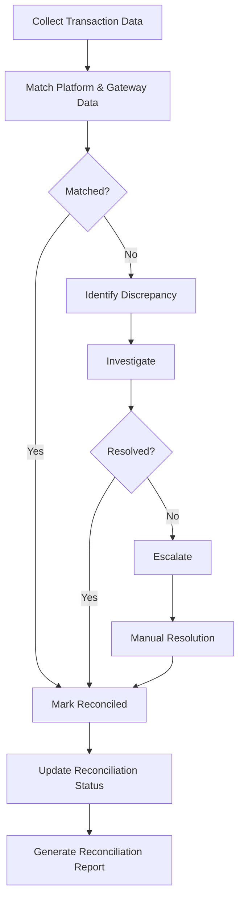

# Software Requirements Specification (SRS)

## Part 06G: Revenue Reconciliation

**Module:** Finance & Billing Module (Part 07)
**Version:** 1.0.0
**Status:** Final / For Review
**Date:** 2026-06-30

---

## Chapter 1 – Overview

### Purpose

The Revenue Reconciliation module defines the comprehensive processes for reconciling all financial flows across the platform—ensuring that customer payments, merchant settlements, driver payouts, platform revenue, and gateway transactions are accurately aligned and balanced. This encompasses daily, weekly, and monthly reconciliation, discrepancy identification, investigation, and resolution.

Revenue reconciliation is the financial integrity layer of the platform. It ensures that every transaction is accounted for, that settlements are accurate, and that financial records reflect the true state of the business. Without robust reconciliation, errors compound, fraud goes undetected, and financial reporting becomes unreliable. This module ensures the platform maintains financial accuracy and regulatory compliance.

### Objectives

- Ensure all financial transactions are accurately recorded
- Reconcile platform transactions with payment gateway reports
- Align merchant settlements with order values
- Verify driver payouts against delivery data
- Identify and resolve discrepancies promptly
- Maintain audit-ready financial records
- Provide comprehensive reconciliation reporting
- Detect and prevent financial fraud

---

## Chapter 2 – Reconciliation Framework

### REC-001 Reconciliation Types

| Type | Description | Frequency | Priority |
| :--- | :--- | :--- | :--- |
| **Gateway Reconciliation** | Match platform transactions with payment gateway reports. | Daily | **Required** |
| **Merchant Settlement Reconciliation** | Verify merchant settlements against order data. | Weekly | **Required** |
| **Driver Payout Reconciliation** | Verify driver payouts against delivery data. | Weekly | **Required** |
| **Platform Revenue Reconciliation** | Verify platform revenue against all sources. | Monthly | **Required** |
| **Tax Reconciliation** | Verify tax collection against tax reports. | Quarterly | **Required** |
| **Full Financial Reconciliation** | Complete financial reconciliation. | Monthly | **Required** |

### REC-002 Reconciliation Participants

| Participant | Role | Priority |
| :--- | :--- | :--- |
| **Platform** | Owns reconciliation process. | **Required** |
| **Merchant** | Reviews and confirms settlements. | **Required** |
| **Driver** | Reviews and confirms payouts. | **Required** |
| **Payment Gateway** | Provides transaction reports. | **Required** |
| **Finance Team** | Performs reconciliation. | **Required** |
| **Auditor** | Reviews reconciliation records. | **Required** |

### REC-003 Reconciliation Process Flow

---

## Chapter 3 – Data Collection

### REC-004 Data Sources

| Source | Data | Format | Priority |
| :--- | :--- | :--- | :--- |
| **Platform Database** | All transactions, settlements, payouts. | Structured (PostgreSQL) | **Required** |
| **Payment Gateway** | Settlement reports, transaction details. | CSV, JSON, API | **Required** |
| **Merchant Records** | Settlement confirmations. | Via platform | **Required** |
| **Driver Records** | Payout confirmations. | Via platform | **Required** |
| **Bank Statements** | Bank transactions. | CSV, PDF | **Required** |

### REC-005 Data Collection Specifications

| Parameter | Specification | Priority |
| :--- | :--- | :--- |
| **Frequency** | Daily collection of all transaction data. | **Required** |
| **Format** | Structured data with consistent fields. | **Required** |
| **Validation** | Data validated for completeness. | **Required** |
| **Storage** | Data stored for reconciliation audit. | **Required** |
| **Access** | Accessible to finance team only. | **Required** |

---

## Chapter 4 – Reconciliation Matching

### REC-006 Matching Criteria

| Criterion | Description | Priority |
| :--- | :--- | :--- |
| **Transaction ID** | Match by unique transaction identifier. | **Required** |
| **Amount** | Match by transaction amount. | **Required** |
| **Date** | Match by transaction date. | **Required** |
| **Customer ID** | Match by customer identifier. | **Required** |
| **Order ID** | Match by order identifier. | **Required** |

### REC-007 Matching Rules

| Rule | Description | Priority |
| :--- | :--- | :--- |
| **Exact Match** | All criteria match exactly. | **Required** |
| **Tolerance Match** | Amount match within tolerance (e.g., $0.01). | **Required** |
| **Date Tolerance** | Date match within 1 day tolerance. | **Required** |
| **Partial Match** | Some criteria match; flagged for review. | **Required** |
| **No Match** | No matching transaction found. | **Required** |

### REC-008 Matching Statuses

| Status | Description |
| :--- | :--- |
| `MATCHED` | Transaction successfully matched. |
| `PARTIAL_MATCH` | Partial match; requires review. |
| `UNMATCHED` | No matching transaction found. |
| `PENDING` | Awaiting data for matching. |
| `REVIEW` | Flagged for manual review. |
| `RESOLVED` | Discrepancy resolved. |

---

## Chapter 5 – Discrepancy Management

### REC-009 Discrepancy Types

| Type | Description | Priority |
| :--- | :--- | :--- |
| **Missing Transaction** | Platform has transaction, gateway does not. | **Required** |
| **Extra Transaction** | Gateway has transaction, platform does not. | **Required** |
| **Amount Mismatch** | Amount differs between systems. | **Required** |
| **Date Mismatch** | Transaction dates differ. | **Required** |
| **Status Mismatch** | Transaction status differs. | **Required** |
| **Currency Mismatch** | Currency differs between systems. | **Required** |

### REC-010 Discrepancy Severity

| Severity | Criteria | Priority |
| :--- | :--- | :--- |
| **Critical** | Amount > $1,000 or suspected fraud. | **High** |
| **High** | Amount > $100 or > 5% mismatch. | **High** |
| **Medium** | Amount > $10 or > 2% mismatch. | **Medium** |
| **Low** | Amount < $10 or small mismatch. | **Low** |

### REC-011 Resolution Workflow

1.  Discrepancy identified.
2.  Finance team investigates:
    - Review transaction details
    - Check system logs
    - Contact gateway (if needed)
    - Contact merchant/driver (if needed)
3.  Root cause identified.
4.  Resolution determined:
    - **System error:** Fix and adjust.
    - **Gateway error:** Contact gateway.
    - **Data entry error:** Correct records.
    - **Fraud:** Investigate further.
5.  Resolution executed.
6.  Records updated.
7.  Discrepancy marked resolved.

---

## Chapter 6 – Reconciliation Types (Detail)

### REC-012 Gateway Reconciliation

| Step | Description | Priority |
| :--- | :--- | :--- |
| **1. Data Collection** | Collect platform transactions and gateway reports. | **Required** |
| **2. Matching** | Match transactions by ID, amount, date. | **Required** |
| **3. Discrepancy Identification** | Identify unmatched and mismatched transactions. | **Required** |
| **4. Investigation** | Investigate discrepancies. | **Required** |
| **5. Resolution** | Resolve discrepancies. | **Required** |
| **6. Report** | Generate reconciliation report. | **Required** |

### REC-013 Merchant Settlement Reconciliation

| Step | Description | Priority |
| :--- | :--- | :--- |
| **1. Settlement Calculation** | Calculate merchant settlement. | **Required** |
| **2. Data Collection** | Collect settlement details and order data. | **Required** |
| **3. Reconciliation** | Match each order to settlement. | **Required** |
| **4. Verification** | Merchant verifies settlement. | **Required** |
| **5. Discrepancy Handling** | Handle any discrepancies. | **Required** |
| **6. Confirmation** | Confirm settlement reconciliation. | **Required** |

### REC-014 Driver Payout Reconciliation

| Step | Description | Priority |
| :--- | :--- | :--- |
| **1. Payout Calculation** | Calculate driver payout. | **Required** |
| **2. Data Collection** | Collect payout details and delivery data. | **Required** |
| **3. Reconciliation** | Match each delivery to payout. | **Required** |
| **4. Verification** | Driver verifies payout. | **Required** |
| **5. Discrepancy Handling** | Handle any discrepancies. | **Required** |
| **6. Confirmation** | Confirm payout reconciliation. | **Required** |

### REC-015 Platform Revenue Reconciliation

| Step | Description | Priority |
| :--- | :--- | :--- |
| **1. Revenue Calculation** | Calculate platform revenue (commissions + fees). | **Required** |
| **2. Data Collection** | Collect all revenue data. | **Required** |
| **3. Reconciliation** | Verify revenue against orders and settlements. | **Required** |
| **4. Verification** | Finance team verifies revenue. | **Required** |
| **5. Discrepancy Handling** | Handle any discrepancies. | **Required** |
| **6. Confirmation** | Confirm revenue reconciliation. | **Required** |

---

## Chapter 7 – Reconciliation Reports

### REC-016 Report Types

| Report | Description | Frequency | Priority |
| :--- | :--- | :--- | :--- |
| **Daily Reconciliation Report** | Daily transaction reconciliation. | Daily | **Required** |
| **Weekly Reconciliation Report** | Weekly settlement reconciliation. | Weekly | **Required** |
| **Monthly Reconciliation Report** | Monthly financial reconciliation. | Monthly | **Required** |
| **Quarterly Reconciliation Report** | Quarterly revenue and tax reconciliation. | Quarterly | **Required** |
| **Annual Reconciliation Report** | Annual financial reconciliation. | Annual | **Required** |
| **Discrepancy Report** | All active discrepancies. | On-demand | **Required** |

### REC-017 Report Structure

| Section | Content | Priority |
| :--- | :--- | :--- |
| **Header** | Report type, date, period. | **Required** |
| **Summary** | Key metrics, status, discrepancies. | **Required** |
| **Transaction Matching** | Matched/unmatched transactions. | **Required** |
| **Discrepancy Details** | List of all discrepancies. | **Required** |
| **Resolution Status** | Status of each discrepancy. | **Required** |
| **Settlement Details** | Merchant and driver settlements. | **Required** |
| **Revenue Summary** | Platform revenue breakdown. | **Required** |
| **Tax Summary** | Tax collected and remitted. | **Required** |
| **Audit Trail** | Full audit trail. | **Required** |

### REC-018 Report Data Model

| Column | Type | Constraints | Description |
| :--- | :--- | :--- | :--- |
| `report_id` | UUID | PRIMARY KEY | Unique identifier |
| `report_type` | VARCHAR(30) | NOT NULL | DAILY/WEEKLY/MONTHLY/QUARTERLY/ANNUAL |
| `report_period_start` | DATE | NOT NULL | Period start |
| `report_period_end` | DATE | NOT NULL | Period end |
| `total_transactions` | INTEGER | | Total transactions reconciled |
| `matched_transactions` | INTEGER | | Matched transactions |
| `unmatched_transactions` | INTEGER | | Unmatched transactions |
| `total_discrepancies` | INTEGER | | Total discrepancies |
| `critical_discrepancies` | INTEGER | | Critical discrepancies |
| `resolved_discrepancies` | INTEGER | | Resolved discrepancies |
| `total_amount` | DECIMAL(12, 2) | | Total amount reconciled |
| `discrepancy_amount` | DECIMAL(12, 2) | | Total discrepancy amount |
| `status` | VARCHAR(20) | DEFAULT 'PENDING' | PENDING/IN_PROGRESS/COMPLETED |
| `file_url` | VARCHAR(500) | | Report file URL |
| `created_by` | UUID | | Creator identifier |
| `created_at` | TIMESTAMP | DEFAULT NOW() | Creation timestamp |
| `updated_at` | TIMESTAMP | DEFAULT NOW() | Last update timestamp |

---

## Chapter 8 – Fraud Detection

### REC-019 Fraud Indicators

| Indicator | Description | Priority |
| :--- | :--- | :--- |
| **Unusual Transaction Patterns** | Transactions outside normal patterns. | **Required** |
| **Multiple Refunds** | Unusually high refund rate. | **Required** |
| **Amount Rounding** | Suspicious rounded amounts. | **Required** |
| **Rapid Transactions** | Unusually fast transaction sequences. | **Required** |
| **Geographic Anomalies** | Transactions from unusual locations. | **Required** |
| **Device Anomalies** | Unusual device patterns. | **Required** |
| **Merchant Anomalies** | Unusual merchant behavior. | **Required** |
| **Driver Anomalies** | Unusual driver behavior. | **Required** |

### REC-020 Fraud Detection Process

1.  Automated fraud detection runs daily.
2.  Suspicious patterns flagged.
3.  Finance team investigates flagged patterns.
4.  If fraud confirmed:
    - Freeze accounts involved.
    - Notify affected parties.
    - Report to fraud team.
    - Adjust financial records.
5.  If false positive:
    - Mark as investigated.
    - Adjust detection rules.

---

## Chapter 9 – Database Tables

### reconciliation_batches

| Column | Type | Constraints | Description |
| :--- | :--- | :--- | :--- |
| `batch_id` | UUID | PRIMARY KEY | Unique identifier |
| `batch_reference` | VARCHAR(50) | UNIQUE | Human-readable batch reference |
| `reconciliation_date` | DATE | NOT NULL | Date of reconciliation |
| `total_transactions` | INTEGER | | Total transactions |
| `matched_count` | INTEGER | | Matched transactions |
| `unmatched_count` | INTEGER | | Unmatched transactions |
| `discrepancy_count` | INTEGER | | Discrepancies found |
| `total_amount` | DECIMAL(12, 2) | | Total amount |
| `discrepancy_amount` | DECIMAL(12, 2) | | Total discrepancy amount |
| `status` | VARCHAR(20) | DEFAULT 'PENDING' | PENDING/IN_PROGRESS/COMPLETED |
| `processed_by` | UUID | | Finance team member |
| `processed_at` | TIMESTAMP | | Processing timestamp |
| `completed_at` | TIMESTAMP | | Completion timestamp |
| `created_at` | TIMESTAMP | DEFAULT NOW() | Creation timestamp |
| `updated_at` | TIMESTAMP | DEFAULT NOW() | Last update timestamp |

### reconciliation_transactions

| Column | Type | Constraints | Description |
| :--- | :--- | :--- | :--- |
| `transaction_id` | UUID | PRIMARY KEY | Unique identifier |
| `batch_id` | UUID | FOREIGN KEY (reconciliation_batches.batch_id) | Associated batch |
| `platform_transaction_id` | UUID | | Platform transaction ID |
| `gateway_transaction_id` | VARCHAR(100) | | Gateway transaction ID |
| `order_id` | UUID | | Associated order |
| `amount` | DECIMAL(12, 2) | NOT NULL | Transaction amount |
| `currency` | VARCHAR(3) | NOT NULL | ISO 4217 currency |
| `transaction_date` | DATE | NOT NULL | Transaction date |
| `status` | VARCHAR(20) | DEFAULT 'PENDING' | MATCHED/PARTIAL_MATCH/UNMATCHED/PENDING/REVIEW/RESOLVED |
| `discrepancy_type` | VARCHAR(30) | | Missing/Extra/Amount/Date/Status/Currency |
| `discrepancy_amount` | DECIMAL(12, 2) | | Discrepancy amount |
| `resolution_notes` | TEXT | | Resolution notes |
| `resolved_by` | UUID | | Resolver identifier |
| `resolved_at` | TIMESTAMP | | Resolution timestamp |
| `created_at` | TIMESTAMP | DEFAULT NOW() | Creation timestamp |
| `updated_at` | TIMESTAMP | DEFAULT NOW() | Last update timestamp |

### reconciliation_merchant

| Column | Type | Constraints | Description |
| :--- | :--- | :--- | :--- |
| `merchant_reconciliation_id` | UUID | PRIMARY KEY | Unique identifier |
| `merchant_id` | UUID | FOREIGN KEY (merchant_accounts.merchant_id) | Associated merchant |
| `settlement_id` | UUID | FOREIGN KEY (merchant_settlements.settlement_id) | Associated settlement |
| `reconciliation_date` | DATE | NOT NULL | Reconciliation date |
| `expected_amount` | DECIMAL(12, 2) | | Expected settlement |
| `actual_amount` | DECIMAL(12, 2) | | Actual settlement |
| `discrepancy_amount` | DECIMAL(12, 2) | | Discrepancy amount |
| `discrepancy_reason` | TEXT | | Reason for discrepancy |
| `status` | VARCHAR(20) | DEFAULT 'PENDING' | PENDING/IN_REVIEW/RECONCILED/DISCREPANT |
| `merchant_confirmed` | BOOLEAN | DEFAULT FALSE | Merchant confirmation |
| `merchant_notes` | TEXT | | Merchant notes |
| `verified_by` | UUID | | Verifier identifier |
| `verified_at` | TIMESTAMP | | Verification timestamp |
| `created_at` | TIMESTAMP | DEFAULT NOW() | Creation timestamp |
| `updated_at` | TIMESTAMP | DEFAULT NOW() | Last update timestamp |

### reconciliation_driver

| Column | Type | Constraints | Description |
| :--- | :--- | :--- | :--- |
| `driver_reconciliation_id` | UUID | PRIMARY KEY | Unique identifier |
| `driver_id` | UUID | FOREIGN KEY (driver_accounts.driver_id) | Associated driver |
| `payout_id` | UUID | FOREIGN KEY (driver_payouts.payout_id) | Associated payout |
| `reconciliation_date` | DATE | NOT NULL | Reconciliation date |
| `expected_amount` | DECIMAL(12, 2) | | Expected payout |
| `actual_amount` | DECIMAL(12, 2) | | Actual payout |
| `discrepancy_amount` | DECIMAL(12, 2) | | Discrepancy amount |
| `discrepancy_reason` | TEXT | | Reason for discrepancy |
| `status` | VARCHAR(20) | DEFAULT 'PENDING' | PENDING/IN_REVIEW/RECONCILED/DISCREPANT |
| `driver_confirmed` | BOOLEAN | DEFAULT FALSE | Driver confirmation |
| `driver_notes` | TEXT | | Driver notes |
| `verified_by` | UUID | | Verifier identifier |
| `verified_at` | TIMESTAMP | | Verification timestamp |
| `created_at` | TIMESTAMP | DEFAULT NOW() | Creation timestamp |
| `updated_at` | TIMESTAMP | DEFAULT NOW() | Last update timestamp |

### reconciliation_reports

| Column | Type | Constraints | Description |
| :--- | :--- | :--- | :--- |
| `report_id` | UUID | PRIMARY KEY | Unique identifier |
| `report_type` | VARCHAR(30) | NOT NULL | DAILY/WEEKLY/MONTHLY/QUARTERLY/ANNUAL |
| `period_start` | DATE | NOT NULL | Period start |
| `period_end` | DATE | NOT NULL | Period end |
| `total_transactions` | INTEGER | | Total transactions |
| `matched_transactions` | INTEGER | | Matched transactions |
| `unmatched_transactions` | INTEGER | | Unmatched transactions |
| `total_discrepancies` | INTEGER | | Total discrepancies |
| `critical_discrepancies` | INTEGER | | Critical discrepancies |
| `resolved_discrepancies` | INTEGER | | Resolved discrepancies |
| `total_amount` | DECIMAL(12, 2) | | Total amount |
| `discrepancy_amount` | DECIMAL(12, 2) | | Total discrepancy amount |
| `status` | VARCHAR(20) | DEFAULT 'PENDING' | PENDING/IN_PROGRESS/COMPLETED |
| `file_url` | VARCHAR(500) | | Report file URL |
| `created_by` | UUID | | Creator identifier |
| `created_at` | TIMESTAMP | DEFAULT NOW() | Creation timestamp |
| `updated_at` | TIMESTAMP | DEFAULT NOW() | Last update timestamp |

### reconciliation_fraud_alerts

| Column | Type | Constraints | Description |
| :--- | :--- | :--- | :--- |
| `alert_id` | UUID | PRIMARY KEY | Unique identifier |
| `alert_type` | VARCHAR(30) | NOT NULL | PATTERN/REFUND/AMOUNT/GEOGRAPHIC/DEVICE/MERCHANT/DRIVER |
| `description` | TEXT | NOT NULL | Alert description |
| `severity` | VARCHAR(20) | NOT NULL | CRITICAL/HIGH/MEDIUM/LOW |
| `affected_transactions` | TEXT[] | | Affected transaction IDs |
| `status` | VARCHAR(20) | DEFAULT 'OPEN' | OPEN/INVESTIGATING/RESOLVED/DISMISSED |
| `investigated_by` | UUID | | Investigator identifier |
| `investigated_at` | TIMESTAMP | | Investigation timestamp |
| `resolution` | TEXT | | Resolution details |
| `resolved_by` | UUID | | Resolver identifier |
| `resolved_at` | TIMESTAMP | | Resolution timestamp |
| `created_at` | TIMESTAMP | DEFAULT NOW() | Creation timestamp |
| `updated_at` | TIMESTAMP | DEFAULT NOW() | Last update timestamp |

---

## Chapter 10 – REST APIs

### Reconciliation APIs

| Method | Endpoint | Description |
| :--- | :--- | :--- |
| `GET` | `/api/v1/finance/reconciliation/batches` | List reconciliation batches |
| `GET` | `/api/v1/finance/reconciliation/batches/{id}` | Get batch details |
| `GET` | `/api/v1/finance/reconciliation/status` | Get reconciliation status |
| `POST` | `/api/v1/finance/reconciliation/run` | Run reconciliation (admin) |

### Merchant Reconciliation APIs

| Method | Endpoint | Description |
| :--- | :--- | :--- |
| `GET` | `/api/v1/merchant/reconciliation` | Get merchant reconciliation status |
| `GET` | `/api/v1/merchant/reconciliation/{id}` | Get reconciliation details |
| `POST` | `/api/v1/merchant/reconciliation/{id}/confirm` | Confirm reconciliation |
| `POST` | `/api/v1/merchant/reconciliation/{id}/dispute` | File reconciliation dispute |

### Driver Reconciliation APIs

| Method | Endpoint | Description |
| :--- | :--- | :--- |
| `GET` | `/api/v1/driver/reconciliation` | Get driver reconciliation status |
| `GET` | `/api/v1/driver/reconciliation/{id}` | Get reconciliation details |
| `POST` | `/api/v1/driver/reconciliation/{id}/confirm` | Confirm reconciliation |
| `POST` | `/api/v1/driver/reconciliation/{id}/dispute` | File reconciliation dispute |

### Report APIs

| Method | Endpoint | Description |
| :--- | :--- | :--- |
| `GET` | `/api/v1/finance/reconciliation/reports` | Get reconciliation reports |
| `GET` | `/api/v1/finance/reconciliation/reports/{id}` | Get report details |
| `GET` | `/api/v1/finance/reconciliation/reports/{id}/download` | Download report |
| `POST` | `/api/v1/finance/reconciliation/reports/generate` | Generate report (admin) |

### Fraud APIs

| Method | Endpoint | Description |
| :--- | :--- | :--- |
| `GET` | `/api/v1/finance/fraud/alerts` | Get fraud alerts |
| `GET` | `/api/v1/finance/fraud/alerts/{id}` | Get alert details |
| `PUT` | `/api/v1/finance/fraud/alerts/{id}/investigate` | Investigate alert (admin) |
| `PUT` | `/api/v1/finance/fraud/alerts/{id}/resolve` | Resolve alert (admin) |

---

## Chapter 11 – Business Rules

| Rule ID | Rule Description | Priority |
| :--- | :--- | :--- |
| **BR-REC-001** | Daily reconciliation must be completed within 24 hours of day end. | **High** |
| **BR-REC-002** | All transactions must be reconciled within 7 days. | **High** |
| **BR-REC-003** | Amount tolerance: ± $0.01 for matching. | **High** |
| **BR-REC-004** | Critical discrepancies (> $1,000) must be escalated immediately. | **High** |
| **BR-REC-005** | Merchant reconciliation must be confirmed within 30 days. | **High** |
| **BR-REC-006** | Driver reconciliation must be confirmed within 14 days. | **High** |
| **BR-REC-007** | All reconciliation records must be retained for 7 years. | **High** |
| **BR-REC-008** | Fraud alerts must be investigated within 24 hours. | **High** |
| **BR-REC-009** | Reconciliation reports must be generated monthly. | **High** |
| **BR-REC-010** | Unmatched transactions must be flagged for review. | **High** |

---

## Chapter 12 – Acceptance Tests

| Test ID | Test Description | Priority |
| :--- | :--- | :--- |
| **TEST-REC-001** | Daily reconciliation matches all transactions. | **High** |
| **TEST-REC-002** | Gateway reconciliation identifies missing transactions. | **High** |
| **TEST-REC-003** | Merchant settlement reconciliation is accurate. | **High** |
| **TEST-REC-004** | Driver payout reconciliation is accurate. | **High** |
| **TEST-REC-005** | Platform revenue reconciliation is accurate. | **High** |
| **TEST-REC-006** | Amount mismatch identified and flagged. | **High** |
| **TEST-REC-007** | Date mismatch identified and flagged. | **High** |
| **TEST-REC-008** | Unmatched transaction flagged for review. | **High** |
| **TEST-REC-009** | Discrepancy investigation resolves issue. | **High** |
| **TEST-REC-010** | Merchant confirms settlement reconciliation. | **High** |
| **TEST-REC-011** | Driver confirms payout reconciliation. | **High** |
| **TEST-REC-012** | Merchant files reconciliation dispute. | **High** |
| **TEST-REC-013** | Driver files reconciliation dispute. | **High** |
| **TEST-REC-014** | Reconciliation report generated correctly. | **High** |
| **TEST-REC-015** | Reconciliation report exported to PDF. | **High** |
| **TEST-REC-016** | Reconciliation report exported to CSV. | **High** |
| **TEST-REC-017** | Critical discrepancy escalates immediately. | **High** |
| **TEST-REC-018** | Fraud alert detected and flagged. | **High** |
| **TEST-REC-019** | Fraud alert investigated and resolved. | **High** |
| **TEST-REC-020** | Reconciliation records retained for 7 years. | **High** |
| **TEST-REC-021** | Batch reconciliation status updates correctly. | **High** |
| **TEST-REC-022** | Transaction matching tolerance applied correctly. | **High** |
| **TEST-REC-023** | Multi-currency reconciliation handled correctly. | **High** |
| **TEST-REC-024** | Tax reconciliation accurate. | **High** |
| **TEST-REC-025** | Full financial reconciliation completes successfully. | **High** |

---

## Chapter 13 – Traceability Matrix

| Requirement | Database Table | API Endpoint(s) | Acceptance Test |
| :--- | :--- | :--- | :--- |
| REC-006 | reconciliation_transactions | GET /api/v1/finance/reconciliation/batches | TEST-REC-001 |
| REC-009 | reconciliation_transactions | GET /api/v1/finance/reconciliation/status | TEST-REC-002 |
| REC-012 | reconciliation_merchant | GET /api/v1/merchant/reconciliation | TEST-REC-003 |
| REC-013 | reconciliation_driver | GET /api/v1/driver/reconciliation | TEST-REC-004 |
| REC-014 | reconciliation_reports | GET /api/v1/finance/reconciliation/reports | TEST-REC-005 |
| REC-009 | reconciliation_transactions | GET /api/v1/finance/reconciliation/batches/{id} | TEST-REC-006, TEST-REC-007, TEST-REC-008 |
| REC-011 | reconciliation_transactions | Internal | TEST-REC-009 |
| REC-012 | reconciliation_merchant | POST /api/v1/merchant/reconciliation/{id}/confirm | TEST-REC-010 |
| REC-013 | reconciliation_driver | POST /api/v1/driver/reconciliation/{id}/confirm | TEST-REC-011 |
| REC-012 | reconciliation_merchant | POST /api/v1/merchant/reconciliation/{id}/dispute | TEST-REC-012 |
| REC-013 | reconciliation_driver | POST /api/v1/driver/reconciliation/{id}/dispute | TEST-REC-013 |
| REC-016 | reconciliation_reports | GET /api/v1/finance/reconciliation/reports | TEST-REC-014 |
| REC-017 | reconciliation_reports | GET /api/v1/finance/reconciliation/reports/{id}/download | TEST-REC-015, TEST-REC-016 |
| REC-010 | reconciliation_transactions | Internal | TEST-REC-017 |
| REC-019 | reconciliation_fraud_alerts | GET /api/v1/finance/fraud/alerts | TEST-REC-018, TEST-REC-019 |
| REC-005 | reconciliation_batches | GET /api/v1/finance/reconciliation/batches | TEST-REC-020, TEST-REC-021 |
| REC-006 | reconciliation_transactions | GET /api/v1/finance/reconciliation/status | TEST-REC-022 |
| REC-015 | reconciliation_reports | GET /api/v1/finance/reconciliation/reports | TEST-REC-024, TEST-REC-025 |

---

## Chapter 14 – Summary

This document establishes the complete revenue reconciliation capability for the **[Platform Name]** platform. Key takeaways:

- **Comprehensive Reconciliation Framework:** Gateway reconciliation, merchant settlement reconciliation, driver payout reconciliation, platform revenue reconciliation, and tax reconciliation.
- **Automated Matching:** Transaction matching by ID, amount, date, customer ID, and order ID with configurable tolerance.
- **Discrepancy Management:** Identification, severity classification (Critical/High/Medium/Low), investigation, and resolution workflows.
- **Multi-Party Verification:** Merchants and drivers can confirm or dispute reconciliations with audit trails.
- **Comprehensive Reporting:** Daily, weekly, monthly, quarterly, and annual reconciliation reports with multiple export formats.
- **Fraud Detection:** Automated fraud detection with pattern recognition, alerting, and investigation workflows.
- **Audit Trail:** Complete history of all reconciliation activities for compliance and transparency.
- **Data Retention:** 7-year retention of all reconciliation records for regulatory compliance.

The revenue reconciliation module ensures financial integrity across the platform. Accurate reconciliation builds trust with merchants, drivers, and regulators while enabling the finance team to maintain clean, auditable financial records.

---

**Next Document:**

`08_Payment_Module/Part_07A_Payment_Gateway_Integration.md`

*(This transitions from finance to the payment module, starting with payment gateway integration.)*
