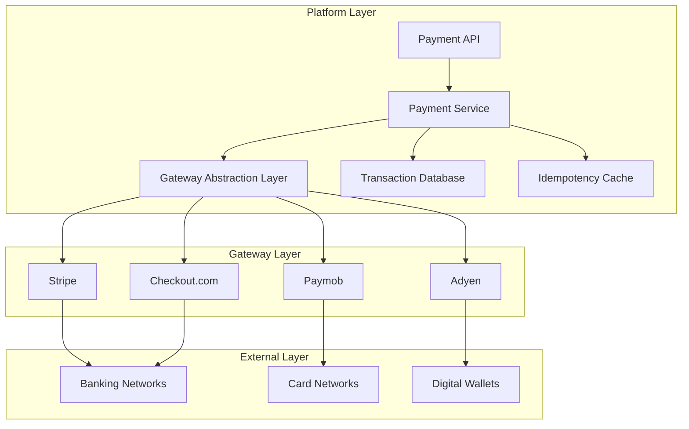
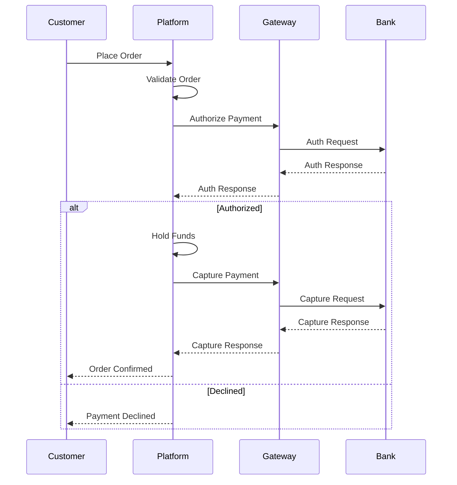

# Software Requirements Specification (SRS)

## Part 07A: Payment Gateway Integration

**Module:** Payment Module (Part 08)
**Version:** 1.0.0
**Status:** Final / For Review
**Date:** 2026-06-30

---

## Chapter 1 – Overview

### Purpose

The Payment Gateway Integration module defines the complete integration framework for processing customer payments on the **[Platform Name]** platform. This encompasses gateway selection, transaction processing, webhook handling, security compliance, and multi-provider management.

Payment processing is the most critical financial function of the platform. It must be secure, reliable, and transparent—capable of handling high transaction volumes while protecting sensitive payment data. This module ensures that payments are processed quickly, accurately, and in compliance with industry standards (PCI DSS), while providing the flexibility to support multiple payment gateways and methods.

### Objectives

- Process customer payments securely and reliably
- Support multiple payment gateways for redundancy
- Handle the complete transaction lifecycle (authorize, capture, refund, void)
- Process webhook events from payment gateways
- Ensure PCI DSS compliance
- Support multiple payment methods (cards, wallets, BNPL, etc.)
- Provide idempotent transaction processing
- Enable seamless gateway failover

---

## Chapter 2 – Gateway Architecture

### PAY-001 Payment Gateway Architecture

### PAY-002 Gateway Components

| Component | Description | Priority |
| :--- | :--- | :--- |
| **Payment API** | Public API for payment operations. | **Required** |
| **Payment Service** | Core payment processing logic. | **Required** |
| **Gateway Abstraction Layer** | Unified interface for all gateways. | **Required** |
| **Gateway Router** | Routes transactions to appropriate gateway. | **Required** |
| **Webhook Handler** | Processes incoming gateway webhooks. | **Required** |
| **Idempotency Manager** | Prevents duplicate transactions. | **Required** |
| **Transaction Database** | Stores all transaction records. | **Required** |
| **Security Service** | Handles encryption and tokenization. | **Required** |

### PAY-003 Gateway Abstraction Interface

| Operation | Description | Priority |
| :--- | :--- | :--- |
| `authorize()` | Authorize payment (hold funds). | **Required** |
| `capture()` | Capture authorized payment. | **Required** |
| `refund()` | Process refund (full/partial). | **Required** |
| `void()` | Void authorization before capture. | **Required** |
| `getStatus()` | Get transaction status. | **Required** |
| `webhook()` | Process webhook event. | **Required** |

---

## Chapter 3 – Supported Gateways

### PAY-004 Primary Gateways

| Gateway | Regions | Features | Priority |
| :--- | :--- | :--- | :--- |
| **Stripe** | Global | Cards, wallets, BNPL, subscriptions | **Required** |
| **Paymob** | MENA (Egypt, KSA, UAE) | Cards, wallets, local methods | **Required** |
| **Adyen** | Global (Enterprise) | Cards, wallets, BNPL, local methods | **Required** |
| **Checkout.com** | Global | Cards, wallets, local methods | **Medium** |

### PAY-005 Gateway Capabilities

| Capability | Stripe | Paymob | Adyen | Checkout.com |
| :--- | :--- | :--- | :--- | :--- |
| **Cards** | ✅ | ✅ | ✅ | ✅ |
| **Digital Wallets** | ✅ | ✅ | ✅ | ✅ |
| **BNPL** | ✅ | ⚠️ | ✅ | ✅ |
| **Subscriptions** | ✅ | ⚠️ | ✅ | ✅ |
| **Local Methods** | ⚠️ | ✅ | ✅ | ✅ |
| **3DS2** | ✅ | ✅ | ✅ | ✅ |
| **Webhooks** | ✅ | ✅ | ✅ | ✅ |

### PAY-006 Gateway Selection Criteria

| Factor | Description | Priority |
| :--- | :--- | :--- |
| **Region** | Gateway availability in the region. | **Required** |
| **Currency** | Gateway supports the transaction currency. | **Required** |
| **Payment Method** | Gateway supports the payment method. | **Required** |
| **Cost** | Gateway fees for the transaction. | **Required** |
| **Reliability** | Gateway uptime and success rate. | **Required** |
| **Speed** | Transaction processing speed. | **Required** |

---

## Chapter 4 – Payment Workflows

### PAY-007 Standard Payment Flow

### PAY-008 Authorization Workflow

| Step | Description | Priority |
| :--- | :--- | :--- |
| **1. Request Validation** | Validate payment request. | **Required** |
| **2. Gateway Selection** | Select appropriate gateway. | **Required** |
| **3. Authorization Request** | Send authorization to gateway. | **Required** |
| **4. 3DS Challenge** | Handle 3DS if required. | **Required** |
| **5. Response Handling** | Process gateway response. | **Required** |
| **6. Status Update** | Update transaction status. | **Required** |

### PAY-009 Capture Workflow

| Step | Description | Priority |
| :--- | :--- | :--- |
| **1. Order Fulfillment** | Order delivered/confirmed. | **Required** |
| **2. Capture Request** | Send capture to gateway. | **Required** |
| **3. Response Handling** | Process gateway response. | **Required** |
| **4. Settlement Initiation** | Initiate settlement. | **Required** |
| **5. Status Update** | Update transaction status. | **Required** |

### PAY-010 Refund Workflow

| Step | Description | Priority |
| :--- | :--- | :--- |
| **1. Refund Request** | Customer requests refund. | **Required** |
| **2. Validation** | Validate refund eligibility. | **Required** |
| **3. Refund Request** | Send refund to gateway. | **Required** |
| **4. Response Handling** | Process gateway response. | **Required** |
| **5. Status Update** | Update transaction status. | **Required** |

### PAY-011 Void Workflow

| Step | Description | Priority |
| :--- | :--- | :--- |
| **1. Void Request** | Customer/merchant requests void. | **Required** |
| **2. Validation** | Validate void eligibility. | **Required** |
| **3. Void Request** | Send void to gateway. | **Required** |
| **4. Response Handling** | Process gateway response. | **Required** |
| **5. Status Update** | Update transaction status. | **Required** |

---

## Chapter 5 – 3D Secure

### PAY-012 3DS Features

| Feature | Description | Priority |
| :--- | :--- | :--- |
| **3DS2 Support** | Support for 3DS2 authentication. | **Required** |
| **Challenge Flow** | Handle challenge flow. | **Required** |
| **Frictionless Flow** | Handle frictionless flow. | **Required** |
| **Authentication Result** | Process authentication result. | **Required** |
| **Fallback** | Fallback to 3DS1 if needed. | **Required** |

### PAY-013 3DS Flow

1.  Customer initiates payment.
2.  Gateway determines if 3DS is required.
3.  If 3DS required:
    - Gateway initiates authentication.
    - Customer completes authentication.
    - Gateway returns result.
4.  Result processed:
    - **Success:** Payment proceeds.
    - **Failure:** Payment declined.

---

## Chapter 6 – Webhook Processing

### PAY-014 Webhook Events

| Event | Description | Priority |
| :--- | :--- | :--- |
| `payment_intent.succeeded` | Payment captured successfully. | **Required** |
| `payment_intent.payment_failed` | Payment failed. | **Required** |
| `charge.succeeded` | Charge successful. | **Required** |
| `charge.failed` | Charge failed. | **Required** |
| `charge.refunded` | Refund processed. | **Required** |
| `charge.disputed` | Charge disputed (chargeback). | **Required** |
| `charge.dispute.closed` | Dispute resolved. | **Required** |

### PAY-015 Webhook Processing Flow

1.  Gateway sends webhook to platform endpoint.
2.  Platform validates webhook signature.
3.  Platform processes webhook event:
    - Find associated transaction.
    - Update transaction status.
    - Trigger any business logic.
4.  Platform returns 200 OK.
5.  If processing fails, platform retries (with backoff).

### PAY-016 Webhook Security

| Security Measure | Description | Priority |
| :--- | :--- | :--- |
| **Signature Verification** | Verify webhook signature. | **Required** |
| **IP Whitelisting** | Allow only gateway IPs. | **Required** |
| **Idempotency** | Handle duplicate webhooks. | **Required** |
| **Retry Logic** | Exponential backoff for retries. | **Required** |
| **Audit Logging** | Log all webhook events. | **Required** |

---

## Chapter 7 – Security & Compliance

### PAY-017 PCI DSS Compliance

| Requirement | Description | Priority |
| :--- | :--- | :--- |
| **Data Encryption** | Encrypt payment data at rest and in transit. | **Required** |
| **Tokenization** | Use tokens instead of PAN. | **Required** |
| **Access Control** | Restrict access to payment data. | **Required** |
| **Audit Logging** | Log all access to payment data. | **Required** |
| **Vulnerability Management** | Regular security scans and updates. | **Required** |
| **Security Monitoring** | Monitor for suspicious activity. | **Required** |

### PAY-018 Tokenization

| Feature | Description | Priority |
| :--- | :--- | :--- |
| **Card Tokenization** | Tokenize card details for reuse. | **Required** |
| **Wallet Tokenization** | Tokenize wallet details. | **Required** |
| **Token Storage** | Store tokens securely. | **Required** |
| **Token Reuse** | Reuse tokens for recurring payments. | **Required** |
| **Token Expiry** | Tokens expire after a period of inactivity. | **Required** |

---

## Chapter 8 – Idempotency

### PAY-019 Idempotency Requirements

| Requirement | Description | Priority |
| :--- | :--- | :--- |
| **Idempotency Key** | All payment requests must include an idempotency key. | **Required** |
| **Key Format** | UUID or custom format. | **Required** |
| **Key Lifetime** | 24 hours minimum. | **Required** |
| **Response Caching** | Cache response for same key. | **Required** |
| **Duplicate Detection** | Detect and reject duplicate requests. | **Required** |

### PAY-020 Idempotency Flow

1.  Client sends request with idempotency key.
2.  System checks if key exists:
    - **Yes:** Return cached response.
    - **No:** Process request and cache response.
3.  Response returned to client.

---

## Chapter 9 – Multi-Currency Support

### PAY-021 Multi-Currency Features

| Feature | Description | Priority |
| :--- | :--- | :--- |
| **Currency Support** | Support for multiple currencies. | **Required** |
| **Settlement Currency** | Settlement in merchant currency. | **Required** |
| **Conversion** | Real-time currency conversion. | **Required** |
| **Display** | Display prices in customer currency. | **Required** |
| **Rounding** | Round to 2 decimal places. | **Required** |

### PAY-022 Currency Configuration

| Parameter | Description | Priority |
| :--- | :--- | :--- |
| **Base Currency** | Platform base currency. | **Required** |
| **Supported Currencies** | List of supported currencies. | **Required** |
| **Exchange Rate Source** | Source for exchange rates. | **Required** |
| **Conversion Fee** | Fee for currency conversion. | **Required** |

---

## Chapter 10 – Database Tables

### payment_gateway_config

| Column | Type | Constraints | Description |
| :--- | :--- | :--- | :--- |
| `config_id` | UUID | PRIMARY KEY | Unique identifier |
| `gateway_name` | VARCHAR(50) | NOT NULL | stripe/paymob/adyen/checkout |
| `environment` | VARCHAR(20) | NOT NULL | PRODUCTION/SANDBOX |
| `api_key` | VARCHAR(255) | NOT NULL | API key (encrypted) |
| `api_secret` | VARCHAR(255) | | API secret (encrypted) |
| `webhook_secret` | VARCHAR(255) | | Webhook secret (encrypted) |
| `supported_currencies` | TEXT[] | | Supported currencies |
| `supported_methods` | TEXT[] | | Supported payment methods |
| `is_active` | BOOLEAN | DEFAULT TRUE | Active status |
| `created_at` | TIMESTAMP | DEFAULT NOW() | Creation timestamp |
| `updated_at` | TIMESTAMP | DEFAULT NOW() | Last update timestamp |

### payment_transactions

| Column | Type | Constraints | Description |
| :--- | :--- | :--- | :--- |
| `transaction_id` | UUID | PRIMARY KEY | Unique identifier |
| `order_id` | UUID | FOREIGN KEY (orders.order_id) | Associated order |
| `customer_id` | UUID | FOREIGN KEY (customers.customer_id) | Associated customer |
| `gateway_name` | VARCHAR(50) | NOT NULL | stripe/paymob/adyen |
| `gateway_transaction_id` | VARCHAR(255) | | Gateway transaction ID |
| `transaction_type` | VARCHAR(20) | NOT NULL | AUTHORIZATION/CAPTURE/REFUND/VOID |
| `amount` | DECIMAL(12, 2) | NOT NULL | Transaction amount |
| `currency` | VARCHAR(3) | NOT NULL | ISO 4217 currency |
| `status` | VARCHAR(20) | NOT NULL | PENDING/AUTHORIZED/CAPTURED/FAILED/REFUNDED/VOIDED |
| `payment_method` | VARCHAR(50) | | Payment method used |
| `payment_method_details` | JSONB | | Payment method details |
| `idempotency_key` | VARCHAR(255) | UNIQUE | Idempotency key |
| `error_code` | VARCHAR(50) | | Error code |
| `error_message` | TEXT | | Error message |
| `created_at` | TIMESTAMP | DEFAULT NOW() | Creation timestamp |
| `updated_at` | TIMESTAMP | DEFAULT NOW() | Last update timestamp |

### webhook_events

| Column | Type | Constraints | Description |
| :--- | :--- | :--- | :--- |
| `webhook_id` | UUID | PRIMARY KEY | Unique identifier |
| `gateway_name` | VARCHAR(50) | NOT NULL | stripe/paymob/adyen |
| `event_type` | VARCHAR(50) | NOT NULL | Webhook event type |
| `event_payload` | JSONB | NOT NULL | Full webhook payload |
| `signature` | VARCHAR(255) | | Webhook signature |
| `processed` | BOOLEAN | DEFAULT FALSE | Processing status |
| `processed_at` | TIMESTAMP | | Processing timestamp |
| `transaction_id` | UUID | | Associated transaction ID |
| `error_message` | TEXT | | Error message |
| `retry_count` | INTEGER | DEFAULT 0 | Number of retries |
| `created_at` | TIMESTAMP | DEFAULT NOW() | Creation timestamp |
| `updated_at` | TIMESTAMP | DEFAULT NOW() | Last update timestamp |

### payment_method_tokens

| Column | Type | Constraints | Description |
| :--- | :--- | :--- | :--- |
| `token_id` | UUID | PRIMARY KEY | Unique identifier |
| `customer_id` | UUID | FOREIGN KEY (customers.customer_id) | Associated customer |
| `gateway_name` | VARCHAR(50) | NOT NULL | stripe/paymob/adyen |
| `gateway_token` | VARCHAR(255) | NOT NULL | Gateway token |
| `payment_method_type` | VARCHAR(30) | NOT NULL | CARD/WALLET |
| `last_four` | VARCHAR(4) | | Last 4 digits (for cards) |
| `card_brand` | VARCHAR(20) | | visa/mastercard/amex |
| `expiry_month` | INTEGER | | Expiry month (MM) |
| `expiry_year` | INTEGER | | Expiry year (YYYY) |
| `is_default` | BOOLEAN | DEFAULT FALSE | Default payment method |
| `is_active` | BOOLEAN | DEFAULT TRUE | Active status |
| `created_at` | TIMESTAMP | DEFAULT NOW() | Creation timestamp |
| `updated_at` | TIMESTAMP | DEFAULT NOW() | Last update timestamp |

---

## Chapter 11 – REST APIs

### Payment APIs

| Method | Endpoint | Description |
| :--- | :--- | :--- |
| `POST` | `/api/v1/payments/authorize` | Authorize payment |
| `POST` | `/api/v1/payments/capture` | Capture payment |
| `POST` | `/api/v1/payments/refund` | Process refund |
| `POST` | `/api/v1/payments/void` | Void authorization |
| `GET` | `/api/v1/payments/{id}` | Get transaction details |
| `GET` | `/api/v1/payments/order/{id}` | Get payments for order |
| `GET` | `/api/v1/payments/status/{id}` | Get transaction status |

### Webhook APIs

| Method | Endpoint | Description |
| :--- | :--- | :--- |
| `POST` | `/api/v1/webhooks/stripe` | Stripe webhook endpoint |
| `POST` | `/api/v1/webhooks/paymob` | Paymob webhook endpoint |
| `POST` | `/api/v1/webhooks/adyen` | Adyen webhook endpoint |
| `POST` | `/api/v1/webhooks/checkout` | Checkout.com webhook endpoint |

---

## Chapter 12 – Business Rules

| Rule ID | Rule Description | Priority |
| :--- | :--- | :--- |
| **BR-PAY-001** | All payment requests must include an idempotency key. | **High** |
| **BR-PAY-002** | Authorization expires after 7 days if not captured. | **High** |
| **BR-PAY-003** | Capture amount cannot exceed authorization amount. | **High** |
| **BR-PAY-004** | Refund amount cannot exceed captured amount. | **High** |
| **BR-PAY-005** | Partial refunds are supported. | **High** |
| **BR-PAY-006** | Webhooks must be verified with signature. | **High** |
| **BR-PAY-007** | Payment data must be encrypted at rest and in transit. | **High** |
| **BR-PAY-008** | Card details must be tokenized, not stored. | **High** |
| **BR-PAY-009** | 3DS authentication required for high-risk transactions. | **High** |
| **BR-PAY-010** | Gateway failover must occur within 5 seconds. | **High** |

---

## Chapter 13 – Acceptance Tests

| Test ID | Test Description | Priority |
| :--- | :--- | :--- |
| **TEST-PAY-001** | Payment authorization succeeds for valid card. | **High** |
| **TEST-PAY-002** | Payment authorization fails for invalid card. | **High** |
| **TEST-PAY-003** | Payment authorization with 3DS succeeds. | **High** |
| **TEST-PAY-004** | Payment capture succeeds after authorization. | **High** |
| **TEST-PAY-005** | Payment capture fails for expired authorization. | **High** |
| **TEST-PAY-006** | Full refund succeeds. | **High** |
| **TEST-PAY-007** | Partial refund succeeds. | **High** |
| **TEST-PAY-008** | Void succeeds before capture. | **High** |
| **TEST-PAY-009** | Void fails after capture. | **High** |
| **TEST-PAY-010** | Idempotency prevents duplicate authorization. | **High** |
| **TEST-PAY-011** | Idempotency prevents duplicate capture. | **High** |
| **TEST-PAY-012** | Gateway webhook processed correctly. | **High** |
| **TEST-PAY-013** | Webhook signature verification succeeds. | **High** |
| **TEST-PAY-014** | Webhook signature verification fails (rejected). | **High** |
| **TEST-PAY-015** | Webhook retry succeeds after failure. | **High** |
| **TEST-PAY-016** | Gateway failover works (primary down). | **High** |
| **TEST-PAY-017** | Multi-currency transaction processed correctly. | **High** |
| **TEST-PAY-018** | Payment method tokenization works. | **High** |
| **TEST-PAY-019** | Token reuse works for recurring payment. | **High** |
| **TEST-PAY-020** | Payment status retrieved correctly. | **High** |
| **TEST-PAY-021** | Payment history viewable by customer. | **High** |
| **TEST-PAY-022** | Payment data encrypted at rest. | **High** |
| **TEST-PAY-023** | Payment data encrypted in transit. | **High** |
| **TEST-PAY-024** | PCI DSS compliance verified. | **High** |
| **TEST-PAY-025** | Audit log captures all payment events. | **High** |

---

## Chapter 14 – Traceability Matrix

| Requirement | Database Table | API Endpoint(s) | Acceptance Test |
| :--- | :--- | :--- | :--- |
| PAY-007 | payment_transactions | POST /api/v1/payments/authorize | TEST-PAY-001, TEST-PAY-002 |
| PAY-008 | payment_transactions | POST /api/v1/payments/authorize | TEST-PAY-003 |
| PAY-009 | payment_transactions | POST /api/v1/payments/capture | TEST-PAY-004, TEST-PAY-005 |
| PAY-010 | payment_transactions | POST /api/v1/payments/refund | TEST-PAY-006, TEST-PAY-007 |
| PAY-011 | payment_transactions | POST /api/v1/payments/void | TEST-PAY-008, TEST-PAY-009 |
| PAY-019 | payment_transactions | POST /api/v1/payments/authorize | TEST-PAY-010, TEST-PAY-011 |
| PAY-014 | webhook_events | POST /api/v1/webhooks/stripe | TEST-PAY-012, TEST-PAY-013, TEST-PAY-014, TEST-PAY-015 |
| PAY-006 | payment_transactions | Internal | TEST-PAY-016 |
| PAY-021 | payment_transactions | POST /api/v1/payments/authorize | TEST-PAY-017 |
| PAY-018 | payment_method_tokens | POST /api/v1/payments/authorize | TEST-PAY-018, TEST-PAY-019 |
| PAY-007 | payment_transactions | GET /api/v1/payments/{id} | TEST-PAY-020, TEST-PAY-021 |

---

## Chapter 15 – Summary

This document establishes the complete payment gateway integration capability for the **[Platform Name]** platform. Key takeaways:

- **Multi-Gateway Support:** Integration with Stripe, Paymob, Adyen, and Checkout.com for global and regional coverage.
- **Gateway Abstraction:** Unified interface for all payment operations (authorize, capture, refund, void) enabling seamless gateway switching.
- **Complete Transaction Lifecycle:** Support for authorization, capture, refund, void, and status tracking.
- **3D Secure:** Support for 3DS2 authentication with challenge and frictionless flows.
- **Webhook Processing:** Reliable webhook handling with signature verification, idempotency, and retry logic.
- **PCI DSS Compliance:** Encryption, tokenization, access control, and audit logging for payment data security.
- **Idempotency:** Deduplication of payment requests to prevent duplicate charges.
- **Multi-Currency:** Support for multiple currencies with real-time conversion and settlement.
- **Tokenization:** Secure tokenization of payment methods for recurring and future payments.

The payment gateway integration module ensures that customer payments are processed securely, reliably, and in compliance with industry standards, building trust and enabling seamless transactions.

---

**Next Document:**

`Part_07B_Payment_Methods.md`

*(This builds on gateway integration to define the supported payment methods, including cards, wallets, BNPL, and regional alternatives.)*