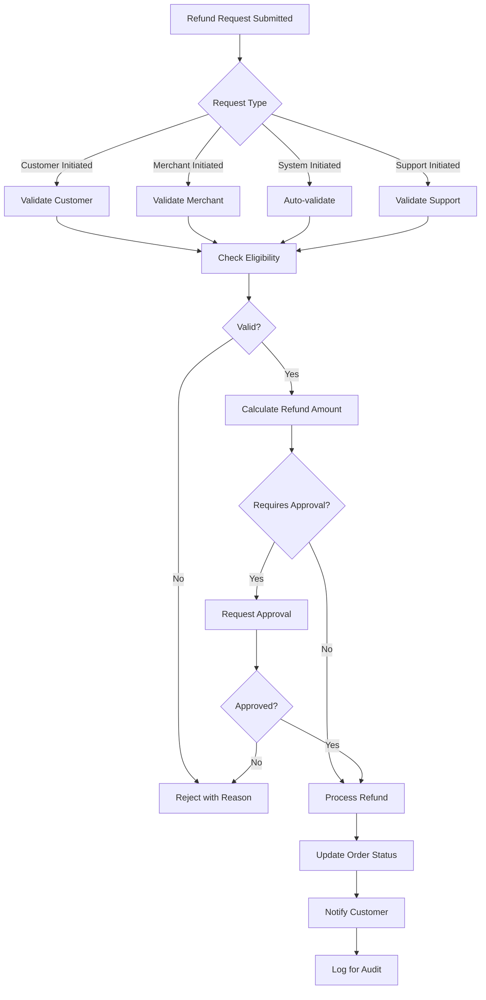

# Software Requirements Specification (SRS)

## Part 07C: Refund Processing

**Module:** Payment Module (Part 08)
**Version:** 1.0.0
**Status:** Final / For Review
**Date:** 2026-06-30

---

## Chapter 1 – Overview

### Purpose

The Refund Processing module defines the complete workflow for processing refunds to customers on the **[Platform Name]** platform. This encompasses refund request handling, eligibility validation, processing via payment gateways, reconciliation, and customer communication.

Refund processing is a critical customer service function. Customers expect refunds to be processed quickly, transparently, and fairly. A poorly designed refund process leads to customer frustration, chargebacks, and reputational damage. This module ensures that refunds are handled efficiently, securely, and in compliance with regulatory requirements.

### Objectives

- Enable fast, transparent refund processing
- Support multiple refund methods (wallet, original payment, voucher)
- Handle full and partial refunds appropriately
- Ensure accurate reconciliation with payment gateways
- Prevent fraud and abuse
- Provide clear refund status tracking for customers
- Support merchant-initiated and customer-initiated refunds
- Maintain comprehensive audit trails

---

## Chapter 2 – Refund Framework

### REF-001 Refund Types

| Type | Description | Priority |
| :--- | :--- | :--- |
| **Full Refund** | Complete refund of order total | **Required** |
| **Partial Refund** | Refund of specific items/fees | **Required** |
| **Item Refund** | Refund for specific item(s) only | **Required** |
| **Fee Refund** | Refund of delivery/service fees | **Required** |
| **Voucher Refund** | Refund issued as platform voucher | **Required** |
| **Wallet Refund** | Refund credited to platform wallet | **Required** |

### REF-002 Refund Methods

| Method | Processing Time | Description | Priority |
| :--- | :--- | :--- | :--- |
| **Wallet** | Instant | Refund to platform wallet | **Required** |
| **Original Payment Method** | 3-5 business days | Refund to original card/bank | **Required** |
| **Voucher** | Instant | Refund as platform voucher | **Required** |
| **Mixed** | Varies | Part to wallet, part to original | **Medium** |

### REF-003 Refund Eligibility

| Scenario | Eligible | Method | Priority |
| :--- | :--- | :--- | :--- |
| **Order Cancelled (Merchant)** | Full refund | Original method | **Required** |
| **Order Cancelled (Customer - Pre-confirmation)** | Full refund | Original method | **Required** |
| **Order Cancelled (Customer - Post-confirmation)** | Partial refund (fees deducted) | Original method | **Required** |
| **Missing Items** | Partial refund (items + fee) | Wallet or Original | **Required** |
| **Wrong Items** | Partial refund (items + fee) | Wallet or Original | **Required** |
| **Damaged Items** | Partial refund (items + fee) | Wallet or Original | **Required** |
| **Late Delivery** | Partial refund (fee waiver) | Wallet | **Required** |
| **Order Not Delivered** | Full refund | Original method | **Required** |
| **Quality Issue** | Partial/full refund | Wallet or Original | **Required** |
| **Customer Changed Mind** | Not eligible (post-confirmation) | N/A | **Required** |

---

## Chapter 3 – Refund Request Workflow

### REF-004 Refund Request Flow

### REF-005 Refund Request Initiation

| Initiation Method | Description | Priority |
| :--- | :--- | :--- |
| **Customer Self-Service** | Customer initiates via app/portal | **Required** |
| **Customer Support** | Support initiates on customer behalf | **Required** |
| **Merchant-Initiated** | Merchant initiates refund | **Required** |
| **System-Initiated** | Auto-refund for system failures | **Required** |
| **Dispute Resolution** | Refund from dispute process | **Required** |

### REF-006 Refund Request Data

| Attribute | Type | Required | Description |
| :--- | :--- | :--- | :--- |
| `request_id` | UUID | Yes | Unique identifier |
| `order_id` | UUID | Yes | Associated order |
| `customer_id` | UUID | Yes | Customer requesting refund |
| `refund_type` | String | Yes | FULL/PARTIAL/ITEM/FEE/VOUCHER/WALLET |
| `reason` | String | Yes | MISSING_ITEMS/WRONG_ITEMS/DAMAGED/LATE/NOT_DELIVERED/QUALITY/OTHER |
| `description` | Text | No | Detailed description |
| `requested_amount` | Decimal | Yes | Amount requested |
| `approved_amount` | Decimal | | Approved refund amount |
| `refund_method` | String | | WALLET/ORIGINAL/VOUCHER |
| `status` | String | Yes | PENDING/APPROVED/REJECTED/PROCESSING/COMPLETED/FAILED |
| `reviewed_by` | UUID | | Admin who reviewed |
| `reviewed_at` | Timestamp | | Review timestamp |
| `processed_by` | UUID | | Admin who processed |
| `processed_at` | Timestamp | | Processing timestamp |
| `completed_at` | Timestamp | | Completion timestamp |
| `created_at` | Timestamp | Yes | Creation timestamp |

---

## Chapter 4 – Refund Processing

### REF-007 Refund Processing Steps

| Step | Description | Priority |
| :--- | :--- | :--- |
| **1. Request Validation** | Validate refund eligibility and request | **Required** |
| **2. Approval** | Approve/Reject refund request | **Required** |
| **3. Amount Calculation** | Calculate exact refund amount | **Required** |
| **4. Method Selection** | Determine refund method | **Required** |
| **5. Processing** | Process refund via payment provider | **Required** |
| **6. Confirmation** | Confirm refund completion | **Required** |
| **7. Notification** | Notify customer of refund | **Required** |
| **8. Reconciliation** | Reconcile financial records | **Required** |

### REF-008 Amount Calculation

| Scenario | Calculation | Priority |
| :--- | :--- | :--- |
| **Full Refund** | Order total = Item subtotal + Delivery fee + Service fee + Tax | **Required** |
| **Missing Item** | Item price + Proportional delivery fee + Proportional service fee + Tax | **Required** |
| **Wrong Item** | Item price + Proportional delivery fee + Proportional service fee + Tax | **Required** |
| **Damaged Item** | Item price + Proportional delivery fee + Proportional service fee + Tax | **Required** |
| **Late Delivery** | Delivery fee only (waived) | **Required** |
| **Non-Delivery** | Order total (full refund) | **Required** |
| **Partial Cancel** | Items cancelled + proportional fees | **Required** |

### REF-009 Refund Processing Example

| Scenario | Amount | Refund Method |
| :--- | :--- | :--- |
| **Full Refund** | $45.00 | Original Payment Method |
| **Missing Item** | $12.50 (item) + $1.50 (fee) = $14.00 | Wallet |
| **Wrong Item** | $18.00 (item) + $2.00 (fee) = $20.00 | Original Payment Method |
| **Late Delivery** | $5.00 (delivery fee) | Wallet |
| **Non-Delivery** | $45.00 (full order) | Original Payment Method |

### REF-010 Refund Processing Flow

1.  Refund request approved.
2.  System determines refund method:
    - **Wallet:** Credit customer wallet instantly.
    - **Original Payment Method:** Initiate refund via payment gateway.
    - **Voucher:** Generate voucher code.
3.  Payment gateway processes refund.
4.  System updates transaction status.
5.  System notifies customer.
6.  System updates order status.
7.  Refund recorded for reconciliation.

---

## Chapter 5 – Special Refund Scenarios

### REF-011 BNPL Refunds

| Scenario | Handling | Priority |
| :--- | :--- | :--- |
| **Full Order Refund** | Cancel all installments | **Required** |
| **Partial Order Refund** | Adjust remaining installments | **Required** |
| **Item Refund** | Reduce installment amounts | **Required** |

### REF-012 COD Refunds

| Scenario | Handling | Priority |
| :--- | :--- | :--- |
| **COD Order Cancelled** | No charge to process | **Required** |
| **COD Order Not Delivered** | No charge to process | **Required** |
| **COD Missing Items** | Refund via wallet or voucher | **Required** |

### REF-013 Partial Order Refunds

| Scenario | Handling | Priority |
| :--- | :--- | :--- |
| **Multiple Items** | Refund only affected items | **Required** |
| **Proportional Fees** | Refund proportional fees for affected items | **Required** |
| **Tax Adjustment** | Adjust tax for refunded items | **Required** |

---

## Chapter 6 – Fraud Prevention

### REF-014 Fraud Prevention Measures

| Measure | Description | Priority |
| :--- | :--- | :--- |
| **Rate Limiting** | Limit refund frequency per customer | **Required** |
| **Pattern Detection** | Detect suspicious refund patterns | **Required** |
| **Account Verification** | Verify customer identity | **Required** |
| **Order History Review** | Review customer order history | **Required** |
| **Device Fingerprinting** | Track device fingerprints | **Required** |
| **IP Tracking** | Track IP addresses for abuse | **Required** |
| **Manual Review** | Flag suspicious refunds for review | **Required** |

### REF-015 Fraud Indicators

| Indicator | Description | Action |
| :--- | :--- | :--- |
| **High Refund Rate** | Customer refund rate > 30% | Flag for review |
| **Multiple Refunds** | > 5 refunds in 30 days | Flag for review |
| **First Order Refund** | Refund on first order | Flag for review |
| **High Value Refund** | Refund > $50 | Flag for review |
| **Pattern Matching** | Pattern matches known fraud | Reject or flag |
| **Discrepancy** | Claimed vs actual items | Flag for review |

### REF-016 Fraud Review Workflow

1.  Fraud indicator detected.
2.  Refund request flagged for review.
3.  Fraud team reviews:
    - Customer history
    - Order details
    - Device/IP information
    - Pattern analysis
4.  Decision:
    - **Approve:** Process refund.
    - **Reject:** Reject refund with reason.
    - **Investigate:** Further investigation required.
5.  Flagged account logged for future monitoring.

---

## Chapter 7 – Customer Experience

### REF-017 Refund Communication

| Communication | Timing | Channel | Priority |
| :--- | :--- | :--- | :--- |
| **Refund Request Confirmation** | Immediate | Push/Email | **Required** |
| **Refund Approval Notification** | On approval | Push/Email | **Required** |
| **Refund Rejection Notification** | On rejection | Push/Email | **Required** |
| **Refund Processing Update** | During processing | Push/Email | **Required** |
| **Refund Completion Notification** | On completion | Push/Email | **Required** |
| **Refund Status Inquiry** | On request | App/Portal | **Required** |

### REF-018 Refund Status Tracking

| Feature | Description | Priority |
| :--- | :--- | :--- |
| **Status Display** | Show refund status in app/portal | **Required** |
| **Timeline View** | Show refund processing timeline | **Required** |
| **Amount Breakdown** | Show refund breakdown | **Required** |
| **Estimated Timeline** | Show expected completion date | **Required** |
| **Contact Support** | Contact support for refund issues | **Required** |

---

## Chapter 8 – Database Tables

### refund_requests

| Column | Type | Constraints | Description |
| :--- | :--- | :--- | :--- |
| `request_id` | UUID | PRIMARY KEY | Unique identifier |
| `order_id` | UUID | FOREIGN KEY (orders.order_id) | Associated order |
| `customer_id` | UUID | FOREIGN KEY (customers.customer_id) | Requesting customer |
| `refund_type` | VARCHAR(20) | NOT NULL | FULL/PARTIAL/ITEM/FEE/VOUCHER/WALLET |
| `reason` | VARCHAR(30) | NOT NULL | MISSING_ITEMS/WRONG_ITEMS/DAMAGED/LATE/NOT_DELIVERED/QUALITY/OTHER |
| `description` | TEXT | | Detailed description |
| `requested_amount` | DECIMAL(10, 2) | NOT NULL | Amount requested |
| `approved_amount` | DECIMAL(10, 2) | | Approved amount |
| `refund_method` | VARCHAR(20) | | WALLET/ORIGINAL/VOUCHER |
| `status` | VARCHAR(20) | DEFAULT 'PENDING' | PENDING/APPROVED/REJECTED/PROCESSING/COMPLETED/FAILED |
| `reviewed_by` | UUID | | Admin who reviewed |
| `reviewed_at` | TIMESTAMP | | Review timestamp |
| `processed_by` | UUID | | Admin who processed |
| `processed_at` | TIMESTAMP | | Processing timestamp |
| `completed_at` | TIMESTAMP | | Completion timestamp |
| `failure_reason` | TEXT | | Reason for failure |
| `created_at` | TIMESTAMP | DEFAULT NOW() | Creation timestamp |
| `updated_at` | TIMESTAMP | DEFAULT NOW() | Last update timestamp |

### refund_transactions

| Column | Type | Constraints | Description |
| :--- | :--- | :--- | :--- |
| `transaction_id` | UUID | PRIMARY KEY | Unique identifier |
| `request_id` | UUID | FOREIGN KEY (refund_requests.request_id) | Associated request |
| `payment_provider` | VARCHAR(50) | NOT NULL | stripe/paymob/adyen |
| `provider_transaction_id` | VARCHAR(255) | | Provider reference |
| `amount` | DECIMAL(10, 2) | NOT NULL | Transaction amount |
| `currency` | VARCHAR(3) | NOT NULL | ISO 4217 currency |
| `status` | VARCHAR(20) | NOT NULL | PENDING/SUCCESS/FAILED/REVERSED |
| `failure_reason` | TEXT | | Reason for failure |
| `initiated_at` | TIMESTAMP | | Initiation timestamp |
| `completed_at` | TIMESTAMP | | Completion timestamp |
| `created_at` | TIMESTAMP | DEFAULT NOW() | Creation timestamp |
| `updated_at` | TIMESTAMP | DEFAULT NOW() | Last update timestamp |

### refund_reconciliations

| Column | Type | Constraints | Description |
| :--- | :--- | :--- | :--- |
| `reconciliation_id` | UUID | PRIMARY KEY | Unique identifier |
| `order_id` | UUID | FOREIGN KEY (orders.order_id) | Associated order |
| `refund_id` | UUID | FOREIGN KEY (refund_requests.request_id) | Associated refund |
| `transaction_type` | VARCHAR(20) | NOT NULL | REFUND/ADJUSTMENT/REVERSAL |
| `amount` | DECIMAL(10, 2) | NOT NULL | Amount |
| `merchant_adjustment` | DECIMAL(10, 2) | | Merchant adjustment |
| `platform_adjustment` | DECIMAL(10, 2) | | Platform adjustment |
| `tax_adjustment` | DECIMAL(10, 2) | | Tax adjustment |
| `status` | VARCHAR(20) | DEFAULT 'PENDING' | PENDING/PROCESSED/VERIFIED |
| `verified_by` | UUID | | Finance verifier |
| `verified_at` | TIMESTAMP | | Verification timestamp |
| `created_at` | TIMESTAMP | DEFAULT NOW() | Creation timestamp |
| `updated_at` | TIMESTAMP | DEFAULT NOW() | Last update timestamp |

### refund_fraud_reviews

| Column | Type | Constraints | Description |
| :--- | :--- | :--- | :--- |
| `review_id` | UUID | PRIMARY KEY | Unique identifier |
| `request_id` | UUID | FOREIGN KEY (refund_requests.request_id) | Associated request |
| `fraud_indicators` | JSONB | | Detected fraud indicators |
| `risk_score` | INTEGER | | Risk score (0-100) |
| `status` | VARCHAR(20) | DEFAULT 'OPEN' | OPEN/UNDER_REVIEW/CLEARED/FLAGGED |
| `reviewed_by` | UUID | | Reviewer |
| `review_notes` | TEXT | | Review notes |
| `decision` | VARCHAR(20) | | APPROVE/REJECT/INVESTIGATE |
| `created_at` | TIMESTAMP | DEFAULT NOW() | Creation timestamp |
| `updated_at` | TIMESTAMP | DEFAULT NOW() | Last update timestamp |

### refund_vouchers

| Column | Type | Constraints | Description |
| :--- | :--- | :--- | :--- |
| `voucher_id` | UUID | PRIMARY KEY | Unique identifier |
| `customer_id` | UUID | FOREIGN KEY (customers.customer_id) | Associated customer |
| `request_id` | UUID | FOREIGN KEY (refund_requests.request_id) | Associated request |
| `voucher_code` | VARCHAR(50) | UNIQUE | Unique voucher code |
| `amount` | DECIMAL(10, 2) | NOT NULL | Voucher amount |
| `currency` | VARCHAR(3) | NOT NULL | ISO 4217 currency |
| `minimum_order` | DECIMAL(10, 2) | DEFAULT 0 | Minimum order value |
| `expires_at` | TIMESTAMP | NOT NULL | Expiration timestamp |
| `used_at` | TIMESTAMP | | Usage timestamp |
| `used_order_id` | UUID | | Order used on |
| `status` | VARCHAR(20) | DEFAULT 'ACTIVE' | ACTIVE/USED/EXPIRED/CANCELLED |
| `created_at` | TIMESTAMP | DEFAULT NOW() | Creation timestamp |
| `updated_at` | TIMESTAMP | DEFAULT NOW() | Last update timestamp |

---

## Chapter 9 – REST APIs

### Refund Request APIs

| Method | Endpoint | Description |
| :--- | :--- | :--- |
| `POST` | `/api/v1/refunds` | Request refund |
| `GET` | `/api/v1/refunds` | List refund requests |
| `GET` | `/api/v1/refunds/{id}` | Get refund details |
| `GET` | `/api/v1/refunds/order/{id}` | Get refunds for order |
| `PUT` | `/api/v1/refunds/{id}/status` | Update refund status (admin) |
| `PUT` | `/api/v1/refunds/{id}/approve` | Approve refund (admin) |
| `PUT` | `/api/v1/refunds/{id}/reject` | Reject refund (admin) |
| `POST` | `/api/v1/refunds/{id}/process` | Process refund (admin) |

### Voucher APIs

| Method | Endpoint | Description |
| :--- | :--- | :--- |
| `GET` | `/api/v1/vouchers` | List vouchers |
| `GET` | `/api/v1/vouchers/{id}` | Get voucher details |
| `GET` | `/api/v1/vouchers/validate` | Validate voucher code |
| `POST` | `/api/v1/vouchers` | Create voucher (admin) |

### Fraud APIs

| Method | Endpoint | Description |
| :--- | :--- | :--- |
| `GET` | `/api/v1/fraud/refunds` | Get flagged refunds |
| `GET` | `/api/v1/fraud/refunds/{id}` | Get fraud review details |
| `PUT` | `/api/v1/fraud/refunds/{id}/review` | Review flagged refund |

---

## Chapter 10 – Business Rules

| Rule ID | Rule Description | Priority |
| :--- | :--- | :--- |
| **BR-REF-001** | Refund requests must be submitted within 7 days of delivery. | **High** |
| **BR-REF-002** | Refunds > $50 require manager approval. | **High** |
| **BR-REF-003** | Customer refund rate > 30% triggers fraud review. | **High** |
| **BR-REF-004** | Wallet refunds are instant; card refunds take 3-5 business days. | **High** |
| **BR-REF-005** | Vouchers expire after 30 days. | **High** |
| **BR-REF-006** | Missing item refund = item price + proportional fees. | **High** |
| **BR-REF-007** | Wrong item refund = item price + proportional fees. | **High** |
| **BR-REF-008** | Damaged item refund = item price + proportional fees. | **High** |
| **BR-REF-009** | Late delivery refund = delivery fee only. | **High** |
| **BR-REF-010** | Non-delivery refund = full order total. | **High** |

---

## Chapter 11 – Acceptance Tests

| Test ID | Test Description | Priority |
| :--- | :--- | :--- |
| **TEST-REF-001** | Customer requests full refund for non-delivery. | **High** |
| **TEST-REF-002** | Customer requests partial refund for missing item. | **High** |
| **TEST-REF-003** | Customer requests partial refund for wrong item. | **High** |
| **TEST-REF-004** | Customer requests partial refund for damaged item. | **High** |
| **TEST-REF-005** | Customer requests refund for late delivery. | **High** |
| **TEST-REF-006** | Refund approved by admin. | **High** |
| **TEST-REF-007** | Refund rejected by admin with reason. | **High** |
| **TEST-REF-008** | Refund processed to wallet (instant). | **High** |
| **TEST-REF-009** | Refund processed to original payment method. | **High** |
| **TEST-REF-010** | Refund issued as voucher. | **High** |
| **TEST-REF-011** | Voucher used on future order. | **High** |
| **TEST-REF-012** | Voucher expires after 30 days. | **High** |
| **TEST-REF-013** | Refund amount calculated correctly (missing item). | **High** |
| **TEST-REF-014** | Refund amount calculated correctly (full refund). | **High** |
| **TEST-REF-015** | Refund request > $50 requires manager approval. | **High** |
| **TEST-REF-016** | Customer refund rate > 30% triggers fraud review. | **High** |
| **TEST-REF-017** | Fraud review clears refund. | **High** |
| **TEST-REF-018** | Fraud review rejects refund. | **High** |
| **TEST-REF-019** | BNPL refund processed correctly. | **High** |
| **TEST-REF-020** | COD refund processed correctly. | **High** |
| **TEST-REF-021** | Financial reconciliation updated. | **High** |
| **TEST-REF-022** | Merchant settlement adjusted. | **High** |
| **TEST-REF-023** | Tax records adjusted. | **High** |
| **TEST-REF-024** | Customer receives refund notification. | **High** |

---

## Chapter 12 – Traceability Matrix

| Requirement | Database Table | API Endpoint(s) | Acceptance Test |
| :--- | :--- | :--- | :--- |
| REF-004 | refund_requests | POST /api/v1/refunds | TEST-REF-001, TEST-REF-002, TEST-REF-003, TEST-REF-004, TEST-REF-005 |
| REF-007 | refund_requests | PUT /api/v1/refunds/{id}/approve | TEST-REF-006 |
| REF-007 | refund_requests | PUT /api/v1/refunds/{id}/reject | TEST-REF-007 |
| REF-007 | refund_transactions | POST /api/v1/refunds/{id}/process | TEST-REF-008, TEST-REF-009 |
| REF-007 | refund_vouchers | POST /api/v1/refunds/{id}/process | TEST-REF-010, TEST-REF-011, TEST-REF-012 |
| REF-008 | refund_requests | GET /api/v1/refunds/{id} | TEST-REF-013, TEST-REF-014 |
| REF-007 | refund_requests | PUT /api/v1/refunds/{id}/approve | TEST-REF-015 |
| REF-014 | refund_fraud_reviews | GET /api/v1/fraud/refunds | TEST-REF-016, TEST-REF-017, TEST-REF-018 |
| REF-011 | refund_requests | POST /api/v1/refunds | TEST-REF-019 |
| REF-012 | refund_requests | POST /api/v1/refunds | TEST-REF-020 |
| REF-007 | refund_reconciliations | GET /api/v1/finance/reconciliations | TEST-REF-021, TEST-REF-022, TEST-REF-023 |

---

## Chapter 13 – Summary

This document establishes the complete refund processing capability for the **[Platform Name]** platform. Key takeaways:

- **Comprehensive Refund Types:** Full, partial, item, fee, voucher, and wallet refunds.
- **Clear Eligibility Rules:** Well-defined refund eligibility for each scenario.
- **Multiple Refund Methods:** Wallet (instant), original payment method (3-5 days), and voucher options.
- **Structured Request Workflow:** Customer-initiated, merchant-initiated, support-initiated, and system-initiated refunds with approval workflows.
- **Special Scenarios:** BNPL refunds, COD refunds, and partial order refunds.
- **Fraud Prevention:** Rate limiting, pattern detection, account verification, device fingerprinting, and manual review.
- **Customer Transparency:** Status tracking, timeline view, amount breakdown, and communication.
- **Financial Reconciliation:** Accurate reconciliation with payment gateways, merchant adjustments, and tax adjustments.

The refund processing module ensures customers are treated fairly when issues arise, building trust and encouraging repeat business while protecting the platform and merchants from abuse.

---

**Next Document:**

`Part_07D_Fraud_Detection.md`

*(This builds on refund processing to define fraud detection capabilities across the platform.)*