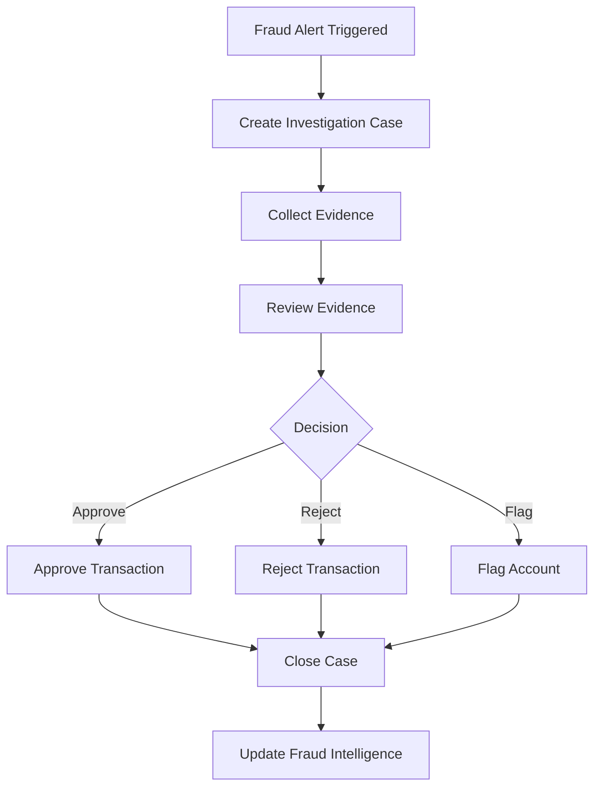

# Software Requirements Specification (SRS)

## Part 07D: Fraud Detection

**Module:** Payment Module (Part 08)
**Version:** 1.0.0
**Status:** Final / For Review
**Date:** 2026-06-30

---

## Chapter 1 – Overview

### Purpose

The Fraud Detection module defines the comprehensive fraud prevention, detection, and investigation capabilities for the **[Platform Name]** platform. This encompasses real-time transaction monitoring, risk scoring, automated rule-based detection, machine learning models, manual review workflows, and fraud prevention measures.

Fraud is a constant threat to any payment platform. Fraudulent transactions result in chargebacks, revenue loss, reputational damage, and increased operational costs. This module ensures that the platform can detect and prevent fraud across payments, orders, refunds, driver activity, and merchant behavior while minimizing false positives and maintaining a seamless customer experience.

### Objectives

- Detect and prevent payment fraud in real-time
- Identify suspicious order and refund patterns
- Monitor driver and merchant behavior for fraud
- Enable automated risk scoring and decisioning
- Support manual review and investigation workflows
- Maintain low false positive rates
- Provide fraud analytics and reporting
- Comply with regulatory requirements

---

## Chapter 2 – Fraud Types

### FRAUD-001 Payment Fraud

| Type | Description | Priority |
| :--- | :--- | :--- |
| **Stolen Card** | Use of stolen credit/debit card details | **Required** |
| **Card Testing** | Testing stolen cards with small transactions | **Required** |
| **Account Takeover** | Unauthorized access to customer accounts | **Required** |
| **Chargeback Fraud** | Customer disputes legitimate charge | **Required** |
| **Friendly Fraud** | Customer claims non-receipt of delivered order | **Required** |

### FRAUD-002 Order & Refund Fraud

| Type | Description | Priority |
| :--- | :--- | :--- |
| **Refund Abuse** | Excessive or fraudulent refund requests | **Required** |
| **Promotion Abuse** | Fraudulent use of promotions/discounts | **Required** |
| **Duplicate Orders** | Placing duplicate orders for fraud | **Required** |
| **COD Fraud** | Non-payment or fake cash-on-delivery orders | **Required** |
| **BNPL Fraud** | Fraudulent BNPL applications | **Required** |

### FRAUD-003 Account & Identity Fraud

| Type | Description | Priority |
| :--- | :--- | :--- |
| **Synthetic Identity** | Fake identities created for fraud | **Required** |
| **Multi-Accounting** | Creating multiple accounts for fraud | **Required** |
| **Credential Stuffing** | Using breached credentials to access accounts | **Required** |

### FRAUD-004 Driver & Merchant Fraud

| Type | Description | Priority |
| :--- | :--- | :--- |
| **Fake Deliveries** | Drivers marking orders delivered without delivery | **Required** |
| **Tip Fraud** | Adding fake tips to orders | **Required** |
| **Merchant Collusion** | Merchant and customer colluding for fraud | **Required** |
| **Incentive Abuse** | Gaming incentive programs | **Required** |

---

## Chapter 3 – Fraud Detection Mechanisms

### FRAUD-005 Detection Layers

| Layer | Description | Priority |
| :--- | :--- | :--- |
| **Rule Engine** | Real-time rule-based detection | **Required** |
| **ML Models** | Machine learning-based detection | **Required** |
| **Behavioral Analytics** | Anomaly detection from behavior patterns | **Required** |
| **Device Fingerprinting** | Device identification and tracking | **Required** |
| **IP Intelligence** | IP reputation and geolocation | **Required** |
| **Velocity Checks** | Rate limiting and velocity monitoring | **Required** |
| **Manual Review** | Human review of flagged transactions | **Required** |
| **Third-party APIs** | External fraud intelligence | **Required** |

### FRAUD-006 Detection Rules

| Rule | Description | Priority |
| :--- | :--- | :--- |
| **High Velocity** | Too many transactions in short period | **Required** |
| **Unusual Amount** | Amount significantly above or below normal | **Required** |
| **Unusual Location** | Transaction from unusual geographic location | **Required** |
| **New Device** | Transaction from unrecognized device | **Required** |
| **New Payment Method** | First use of a new payment method on high-value order | **Required** |
| **Unusual Time** | Transaction at unusual time (e.g., 3 AM) | **Required** |
| **Mismatched Data** | Billing/shipping address mismatch | **Required** |
| **Email Domain** | Suspicious email domain (temporary, disposable) | **Required** |
| **Multiple Accounts** | Same device/IP used for multiple accounts | **Required** |
| **High Refund Rate** | Customer refund rate exceeds threshold | **Required** |
| **First Order Refund** | Refund on first order (potential fraud) | **Required** |

---

## Chapter 4 – Risk Scoring

### FRAUD-007 Risk Score Calculation

| Factor | Weight | Description |
| :--- | :--- | :--- |
| **Device Risk** | 20% | Device reputation, new device, fingerprint | 20% |
| **IP Risk** | 15% | IP reputation, VPN/proxy, geolocation | 15% |
| **Transaction Velocity** | 15% | Transaction frequency and recency | 15% |
| **Payment Method Risk** | 15% | Card age, BIN risk, token age | 15% |
| **Account History** | 15% | Account age, order history, refund history | 15% |
| **Behavioral Risk** | 10% | Unusual behavior patterns | 10% |
| **External Intelligence** | 10% | Third-party fraud intelligence | 10% |

### FRAUD-008 Risk Score Ranges

| Score Range | Risk Level | Action |
| :--- | :--- | :--- |
| **0-20** | Low | Auto-approve |
| **21-40** | Low-Medium | Auto-approve with monitoring |
| **41-60** | Medium | Flag for review (manual or auto) |
| **61-80** | High | Flag for manual review |
| **81-100** | Critical | Auto-reject or block |

### FRAUD-009 Risk Score Data Model

| Column | Type | Constraints | Description |
| :--- | :--- | :--- | :--- |
| `risk_id` | UUID | PRIMARY KEY | Unique identifier |
| `transaction_id` | UUID | | Associated transaction |
| `order_id` | UUID | | Associated order |
| `customer_id` | UUID | | Associated customer |
| `device_risk_score` | INTEGER | | Device risk score (0-100) |
| `ip_risk_score` | INTEGER | | IP risk score (0-100) |
| `velocity_risk_score` | INTEGER | | Velocity risk score (0-100) |
| `payment_risk_score` | INTEGER | | Payment method risk score (0-100) |
| `account_risk_score` | INTEGER | | Account history risk score (0-100) |
| `behavioral_risk_score` | INTEGER | | Behavioral risk score (0-100) |
| `external_risk_score` | INTEGER | | External intelligence score (0-100) |
| `total_risk_score` | INTEGER | | Composite risk score (0-100) |
| `risk_level` | VARCHAR(20) | | LOW/LOW_MEDIUM/MEDIUM/HIGH/CRITICAL |
| `status` | VARCHAR(20) | | APPROVED/MONITORED/REVIEW/REJECTED |
| `created_at` | TIMESTAMP | DEFAULT NOW() | Creation timestamp |
| `updated_at` | TIMESTAMP | DEFAULT NOW() | Last update timestamp |

---

## Chapter 5 – Device Fingerprinting

### FRAUD-010 Device Attributes

| Attribute | Description | Priority |
| :--- | :--- | :--- |
| **Device ID** | Unique device identifier | **Required** |
| **User Agent** | Browser/device user agent | **Required** |
| **Screen Resolution** | Device screen resolution | **Required** |
| **Operating System** | OS name and version | **Required** |
| **Browser** | Browser name and version | **Required** |
| **Language** | System language settings | **Required** |
| **Timezone** | System timezone | **Required** |
| **Plugins** | Browser plugins installed | **Required** |
| **Fonts** | System fonts | **Required** |
| **Canvas Fingerprint** | Canvas rendering fingerprint | **Required** |
| **WebGL Fingerprint** | WebGL rendering fingerprint | **Required** |
| **Audio Fingerprint** | Audio fingerprint | **Required** |

### FRAUD-011 Device Fingerprint Data Model

| Column | Type | Constraints | Description |
| :--- | :--- | :--- | :--- |
| `device_id` | UUID | PRIMARY KEY | Unique identifier |
| `fingerprint` | VARCHAR(255) | UNIQUE | Device fingerprint hash |
| `user_agent` | TEXT | | Browser/device user agent |
| `screen_resolution` | VARCHAR(20) | | Screen resolution |
| `os_name` | VARCHAR(50) | | Operating system name |
| `os_version` | VARCHAR(20) | | OS version |
| `browser_name` | VARCHAR(50) | | Browser name |
| `browser_version` | VARCHAR(20) | | Browser version |
| `language` | VARCHAR(10) | | System language |
| `timezone` | VARCHAR(50) | | System timezone |
| `canvas_fingerprint` | VARCHAR(255) | | Canvas fingerprint |
| `webgl_fingerprint` | VARCHAR(255) | | WebGL fingerprint |
| `audio_fingerprint` | VARCHAR(255) | | Audio fingerprint |
| `first_seen` | TIMESTAMP | | First device seen timestamp |
| `last_seen` | TIMESTAMP | | Last device seen timestamp |
| `total_visits` | INTEGER | | Total visits from device |
| `risk_score` | INTEGER | | Device risk score |
| `created_at` | TIMESTAMP | DEFAULT NOW() | Creation timestamp |
| `updated_at` | TIMESTAMP | DEFAULT NOW() | Last update timestamp |

---

## Chapter 6 – IP Intelligence

### FRAUD-012 IP Attributes

| Attribute | Description | Priority |
| :--- | :--- | :--- |
| **IP Address** | Client IP address | **Required** |
| **Geolocation** | Country, city, coordinates | **Required** |
| **ISP** | Internet service provider | **Required** |
| **Proxy/VPN** | Whether IP is a proxy/VPN | **Required** |
| **Tor** | Whether IP is a Tor exit node | **Required** |
| **Datacenter** | Whether IP belongs to a datacenter | **Required** |
| **Risk Score** | IP reputation score | **Required** |
| **Velocity** | Number of requests from IP | **Required** |

### FRAUD-013 IP Data Model

| Column | Type | Constraints | Description |
| :--- | :--- | :--- | :--- |
| `ip_id` | UUID | PRIMARY KEY | Unique identifier |
| `ip_address` | VARCHAR(45) | UNIQUE | IP address (IPv4/IPv6) |
| `country` | VARCHAR(5) | | ISO country code |
| `city` | VARCHAR(100) | | City name |
| `latitude` | DECIMAL(10, 8) | | Latitude |
| `longitude` | DECIMAL(11, 8) | | Longitude |
| `isp` | VARCHAR(255) | | Internet service provider |
| `is_proxy` | BOOLEAN | DEFAULT FALSE | Proxy/VPN indicator |
| `is_tor` | BOOLEAN | DEFAULT FALSE | Tor exit node indicator |
| `is_datacenter` | BOOLEAN | DEFAULT FALSE | Datacenter IP indicator |
| `risk_score` | INTEGER | | IP risk score (0-100) |
| `first_seen` | TIMESTAMP | | First seen timestamp |
| `last_seen` | TIMESTAMP | | Last seen timestamp |
| `request_count` | INTEGER | | Total requests from IP |
| `created_at` | TIMESTAMP | DEFAULT NOW() | Creation timestamp |
| `updated_at` | TIMESTAMP | DEFAULT NOW() | Last update timestamp |

---

## Chapter 7 – Investigation Workflow

### FRAUD-014 Investigation Workflow

### FRAUD-015 Investigation Case Data

| Attribute | Type | Required | Description |
| :--- | :--- | :--- | :--- |
| `case_id` | UUID | Yes | Unique identifier |
| `alert_type` | String | Yes | Rule/ML/Behavioral/Manual |
| `description` | Text | Yes | Case description |
| `risk_score` | Integer | Yes | Risk score at time of alert |
| `customer_id` | UUID | | Associated customer |
| `order_id` | UUID | | Associated order |
| `transaction_id` | UUID | | Associated transaction |
| `evidence` | JSONB | | Collected evidence |
| `status` | String | Yes | OPEN/INVESTIGATING/APPROVED/REJECTED/CLOSED |
| `assigned_to` | UUID | | Investigator assigned |
| `decision` | String | | APPROVE/REJECT/FLAG_BLOCK |
| `decision_reason` | Text | | Reason for decision |
| `approved_by` | UUID | | Approver identifier |
| `approved_at` | Timestamp | | Approval timestamp |
| `closed_at` | Timestamp | | Closure timestamp |
| `created_at` | Timestamp | Yes | Creation timestamp |
| `updated_at` | Timestamp | Yes | Last update timestamp |

---

## Chapter 8 – Fraud Prevention

### FRAUD-016 Prevention Measures

| Measure | Description | Priority |
| :--- | :--- | :--- |
| **Rate Limiting** | Limit transaction frequency | **Required** |
| **Velocity Checking** | Monitor transaction velocity | **Required** |
| **Address Verification (AVS)** | Verify billing address | **Required** |
| **CVV Verification** | Verify card CVV | **Required** |
| **3D Secure** | 3DS2 authentication | **Required** |
| **IP Blacklisting** | Block known fraudulent IPs | **Required** |
| **Device Blacklisting** | Block known fraudulent devices | **Required** |
| **Account Locking** | Lock suspicious accounts | **Required** |
| **KYC Verification** | Know your customer checks | **Required** |

### FRAUD-017 Blacklist Data Model

| Column | Type | Constraints | Description |
| :--- | :--- | :--- | :--- |
| `blacklist_id` | UUID | PRIMARY KEY | Unique identifier |
| `entry_type` | VARCHAR(20) | NOT NULL | IP/DEVICE/EMAIL/PHONE/CARD |
| `entry_value` | VARCHAR(255) | NOT NULL | Blacklisted value |
| `reason` | TEXT | | Reason for blacklisting |
| `severity` | VARCHAR(20) | | LOW/MEDIUM/HIGH/CRITICAL |
| `expires_at` | TIMESTAMP | | Expiration timestamp (if temporary) |
| `created_by` | UUID | | Admin who created |
| `created_at` | TIMESTAMP | DEFAULT NOW() | Creation timestamp |
| `updated_at` | TIMESTAMP | DEFAULT NOW() | Last update timestamp |

---

## Chapter 9 – Fraud Analytics

### FRAUD-018 Fraud Metrics

| Metric | Description | Priority |
| :--- | :--- | :--- |
| **Fraud Detection Rate** | % of fraudulent transactions detected | **Required** |
| **False Positive Rate** | % of legitimate transactions flagged | **Required** |
| **Fraud Prevention Rate** | % of fraud prevented | **Required** |
| **Chargeback Rate** | % of orders resulting in chargebacks | **Required** |
| **Refund Fraud Rate** | % of refunds that are fraudulent | **Required** |
| **Investigation Time** | Average time to investigate | **Required** |
| **Fraud Loss Amount** | Total financial loss from fraud | **Required** |
| **Fraud Savings** | Estimated fraud prevented | **Required** |

### FRAUD-019 Fraud Reports

| Report | Description | Frequency | Priority |
| :--- | :--- | :--- | :--- |
| **Fraud Summary Report** | Key fraud metrics and trends | Weekly | **Required** |
| **Fraud Detection Report** | Details of detected fraud | Weekly | **Required** |
| **Investigation Report** | Status of investigations | Weekly | **Required** |
| **Chargeback Report** | Chargeback details and trends | Weekly | **Required** |
| **False Positive Report** | False positive analysis | Monthly | **Required** |

---

## Chapter 10 – Database Tables

### fraud_rules

| Column | Type | Constraints | Description |
| :--- | :--- | :--- | :--- |
| `rule_id` | UUID | PRIMARY KEY | Unique identifier |
| `rule_name` | VARCHAR(100) | NOT NULL | Rule name |
| `rule_type` | VARCHAR(30) | NOT NULL | VELOCITY/AMOUNT/LOCATION/DEVICE/PATTERN |
| `condition` | JSONB | NOT NULL | Rule condition |
| `action` | VARCHAR(20) | NOT NULL | APPROVE/REVIEW/REJECT/BLOCK |
| `risk_score_impact` | INTEGER | | Risk score impact |
| `priority` | INTEGER | DEFAULT 0 | Rule priority |
| `is_active` | BOOLEAN | DEFAULT TRUE | Active status |
| `created_at` | TIMESTAMP | DEFAULT NOW() | Creation timestamp |
| `updated_at` | TIMESTAMP | DEFAULT NOW() | Last update timestamp |

### fraud_alerts

| Column | Type | Constraints | Description |
| :--- | :--- | :--- | :--- |
| `alert_id` | UUID | PRIMARY KEY | Unique identifier |
| `alert_type` | VARCHAR(30) | NOT NULL | RULE/ML/BEHAVIORAL/MANUAL |
| `rule_id` | UUID | FOREIGN KEY (fraud_rules.rule_id) | Triggering rule |
| `customer_id` | UUID | FOREIGN KEY (customers.customer_id) | Associated customer |
| `order_id` | UUID | FOREIGN KEY (orders.order_id) | Associated order |
| `transaction_id` | UUID | FOREIGN KEY (payment_transactions.transaction_id) | Associated transaction |
| `risk_score` | INTEGER | | Risk score |
| `description` | TEXT | | Alert description |
| `status` | VARCHAR(20) | DEFAULT 'OPEN' | OPEN/INVESTIGATING/RESOLVED/CLOSED |
| `assigned_to` | UUID | | Investigator assigned |
| `created_at` | TIMESTAMP | DEFAULT NOW() | Creation timestamp |
| `updated_at` | TIMESTAMP | DEFAULT NOW() | Last update timestamp |

### fraud_cases

| Column | Type | Constraints | Description |
| :--- | :--- | :--- | :--- |
| `case_id` | UUID | PRIMARY KEY | Unique identifier |
| `alert_id` | UUID | FOREIGN KEY (fraud_alerts.alert_id) | Associated alert |
| `customer_id` | UUID | FOREIGN KEY (customers.customer_id) | Associated customer |
| `order_id` | UUID | FOREIGN KEY (orders.order_id) | Associated order |
| `transaction_id` | UUID | FOREIGN KEY (payment_transactions.transaction_id) | Associated transaction |
| `risk_score` | INTEGER | | Risk score |
| `description` | TEXT | | Case description |
| `evidence` | JSONB | | Collected evidence |
| `status` | VARCHAR(20) | DEFAULT 'OPEN' | OPEN/INVESTIGATING/APPROVED/REJECTED/CLOSED |
| `assigned_to` | UUID | | Investigator assigned |
| `decision` | VARCHAR(20) | | APPROVE/REJECT/FLAG_BLOCK |
| `decision_reason` | TEXT | | Reason for decision |
| `approved_by` | UUID | | Approver identifier |
| `approved_at` | TIMESTAMP | | Approval timestamp |
| `closed_at` | TIMESTAMP | | Closure timestamp |
| `created_at` | TIMESTAMP | DEFAULT NOW() | Creation timestamp |
| `updated_at` | TIMESTAMP | DEFAULT NOW() | Last update timestamp |

### fraud_blacklist

| Column | Type | Constraints | Description |
| :--- | :--- | :--- | :--- |
| `blacklist_id` | UUID | PRIMARY KEY | Unique identifier |
| `entry_type` | VARCHAR(20) | NOT NULL | IP/DEVICE/EMAIL/PHONE/CARD |
| `entry_value` | VARCHAR(255) | NOT NULL | Blacklisted value |
| `reason` | TEXT | | Reason for blacklisting |
| `severity` | VARCHAR(20) | | LOW/MEDIUM/HIGH/CRITICAL |
| `expires_at` | TIMESTAMP | | Expiration timestamp |
| `created_by` | UUID | | Admin who created |
| `created_at` | TIMESTAMP | DEFAULT NOW() | Creation timestamp |
| `updated_at` | TIMESTAMP | DEFAULT NOW() | Last update timestamp |

### fraud_ml_predictions

| Column | Type | Constraints | Description |
| :--- | :--- | :--- | :--- |
| `prediction_id` | UUID | PRIMARY KEY | Unique identifier |
| `transaction_id` | UUID | FOREIGN KEY (payment_transactions.transaction_id) | Associated transaction |
| `model_version` | VARCHAR(50) | NOT NULL | ML model version |
| `prediction_score` | DECIMAL(5, 4) | | Prediction score (0-1) |
| `fraud_probability` | DECIMAL(5, 2) | | Fraud probability (%) |
| `features_used` | JSONB | | Features used for prediction |
| `prediction_timestamp` | TIMESTAMP | | Prediction timestamp |
| `created_at` | TIMESTAMP | DEFAULT NOW() | Creation timestamp |

---

## Chapter 11 – REST APIs

### Fraud Detection APIs

| Method | Endpoint | Description |
| :--- | :--- | :--- |
| `POST` | `/api/v1/fraud/check` | Check transaction for fraud |
| `GET` | `/api/v1/fraud/risk/order/{id}` | Get order risk score |
| `GET` | `/api/v1/fraud/risk/customer/{id}` | Get customer risk score |

### Fraud Alert APIs

| Method | Endpoint | Description |
| :--- | :--- | :--- |
| `GET` | `/api/v1/fraud/alerts` | Get fraud alerts |
| `GET` | `/api/v1/fraud/alerts/{id}` | Get alert details |
| `PUT` | `/api/v1/fraud/alerts/{id}/investigate` | Investigate alert |
| `PUT` | `/api/v1/fraud/alerts/{id}/resolve` | Resolve alert |

### Fraud Case APIs

| Method | Endpoint | Description |
| :--- | :--- | :--- |
| `GET` | `/api/v1/fraud/cases` | Get fraud cases |
| `GET` | `/api/v1/fraud/cases/{id}` | Get case details |
| `PUT` | `/api/v1/fraud/cases/{id}/assign` | Assign case to investigator |
| `PUT` | `/api/v1/fraud/cases/{id}/decision` | Make case decision |
| `POST` | `/api/v1/fraud/cases/{id}/evidence` | Add evidence to case |

### Blacklist APIs

| Method | Endpoint | Description |
| :--- | :--- | :--- |
| `GET` | `/api/v1/fraud/blacklist` | Get blacklist entries |
| `POST` | `/api/v1/fraud/blacklist` | Add to blacklist |
| `DELETE` | `/api/v1/fraud/blacklist/{id}` | Remove from blacklist |

### Fraud Analytics APIs

| Method | Endpoint | Description |
| :--- | :--- | :--- |
| `GET` | `/api/v1/fraud/analytics/dashboard` | Get fraud analytics dashboard |
| `GET` | `/api/v1/fraud/analytics/metrics` | Get fraud metrics |
| `GET` | `/api/v1/fraud/analytics/reports` | Get fraud reports |

---

## Chapter 12 – Business Rules

| Rule ID | Rule Description | Priority |
| :--- | :--- | :--- |
| **BR-FRAUD-001** | Risk score > 60 triggers manual review. | **High** |
| **BR-FRAUD-002** | Risk score > 80 triggers automatic rejection. | **High** |
| **BR-FRAUD-003** | 5+ transactions from same IP in 1 hour triggers alert. | **High** |
| **BR-FRAUD-004** | 3+ refunds in 7 days triggers fraud review. | **High** |
| **BR-FRAUD-005** | Refund on first order triggers review. | **High** |
| **BR-FRAUD-006** | Billing/shipping address mismatch > 50% triggers review. | **High** |
| **BR-FRAUD-007** | Device fingerprint with high risk triggers review. | **High** |
| **BR-FRAUD-008** | Blacklisted IP/device blocks transaction. | **High** |
| **BR-FRAUD-009** | Fraud cases must be resolved within 24 hours. | **High** |
| **BR-FRAUD-010** | Fraud intelligence data retained for 7 years. | **High** |

---

## Chapter 13 – Acceptance Tests

| Test ID | Test Description | Priority |
| :--- | :--- | :--- |
| **TEST-FRAUD-001** | Fraud rule detects high-velocity transaction. | **High** |
| **TEST-FRAUD-002** | Fraud rule detects unusual location transaction. | **High** |
| **TEST-FRAUD-003** | Fraud rule detects new device high-value order. | **High** |
| **TEST-FRAUD-004** | Risk score calculated correctly. | **High** |
| **TEST-FRAUD-005** | Risk score > 60 triggers manual review. | **High** |
| **TEST-FRAUD-006** | Risk score > 80 triggers auto-reject. | **High** |
| **TEST-FRAUD-007** | Device fingerprint captures device attributes. | **High** |
| **TEST-FRAUD-008** | Fraud alert created on rule trigger. | **High** |
| **TEST-FRAUD-009** | Fraud case assigned to investigator. | **High** |
| **TEST-FRAUD-010** | Investigator approves transaction. | **High** |
| **TEST-FRAUD-011** | Investigator rejects transaction. | **High** |
| **TEST-FRAUD-012** | IP blacklist blocks transaction. | **High** |
| **TEST-FRAUD-013** | Device blacklist blocks transaction. | **High** |
| **TEST-FRAUD-014** | Fraud ML model identifies suspicious transaction. | **High** |
| **TEST-FRAUD-015** | Fraud alert resolved and closed. | **High** |
| **TEST-FRAUD-016** | Fraud analytics dashboard displays correctly. | **High** |
| **TEST-FRAUD-017** | Fraud summary report generated. | **High** |
| **TEST-FRAUD-018** | Chargeback report generated. | **High** |
| **TEST-FRAUD-019** | False positive rate below 5%. | **High** |
| **TEST-FRAUD-020** | Fraud detection rate above 95%. | **High** |

---

## Chapter 14 – Traceability Matrix

| Requirement | Database Table | API Endpoint(s) | Acceptance Test |
| :--- | :--- | :--- | :--- |
| FRAUD-006 | fraud_rules | POST /api/v1/fraud/check | TEST-FRAUD-001, TEST-FRAUD-002, TEST-FRAUD-003 |
| FRAUD-007 | risk_scores | GET /api/v1/fraud/risk/order/{id} | TEST-FRAUD-004, TEST-FRAUD-005, TEST-FRAUD-006 |
| FRAUD-010 | device_fingerprints | Internal | TEST-FRAUD-007 |
| FRAUD-014 | fraud_alerts | GET /api/v1/fraud/alerts | TEST-FRAUD-008, TEST-FRAUD-009 |
| FRAUD-015 | fraud_cases | PUT /api/v1/fraud/cases/{id}/decision | TEST-FRAUD-010, TEST-FRAUD-011 |
| FRAUD-016 | fraud_blacklist | GET /api/v1/fraud/blacklist | TEST-FRAUD-012, TEST-FRAUD-013 |
| FRAUD-005 | fraud_ml_predictions | POST /api/v1/fraud/check | TEST-FRAUD-014 |
| FRAUD-018 | fraud_alerts | GET /api/v1/fraud/analytics/dashboard | TEST-FRAUD-016, TEST-FRAUD-017, TEST-FRAUD-018 |

---

## Chapter 15 – Summary

This document establishes the complete fraud detection capability for the **[Platform Name]** platform. Key takeaways:

- **Comprehensive Fraud Types:** Payment fraud, order/refund fraud, account/identity fraud, and driver/merchant fraud.
- **Multi-Layer Detection:** Rule engine, ML models, behavioral analytics, device fingerprinting, IP intelligence, velocity checks, and manual review.
- **Risk Scoring:** Composite risk score (0-100) with automated decisioning (approve/monitor/review/reject).
- **Device Fingerprinting:** Comprehensive device identification for tracking suspicious devices.
- **IP Intelligence:** IP reputation, geolocation, proxy/VPN detection, and blacklisting.
- **Investigation Workflow:** Structured case management with assignment, evidence collection, and decision workflows.
- **Fraud Prevention:** Rate limiting, AVS, CVV verification, 3DS, blacklisting, and KYC.
- **Fraud Analytics:** Detection rate, false positive rate, chargeback rate, and comprehensive reporting.

The fraud detection module ensures the platform can identify and prevent fraudulent activity while minimizing false positives and maintaining a seamless customer experience.

---

**Next Document:**

`Part_07E_Recurring_Payments.md`

*(This completes the payment module by defining recurring payment capabilities for subscriptions.)*