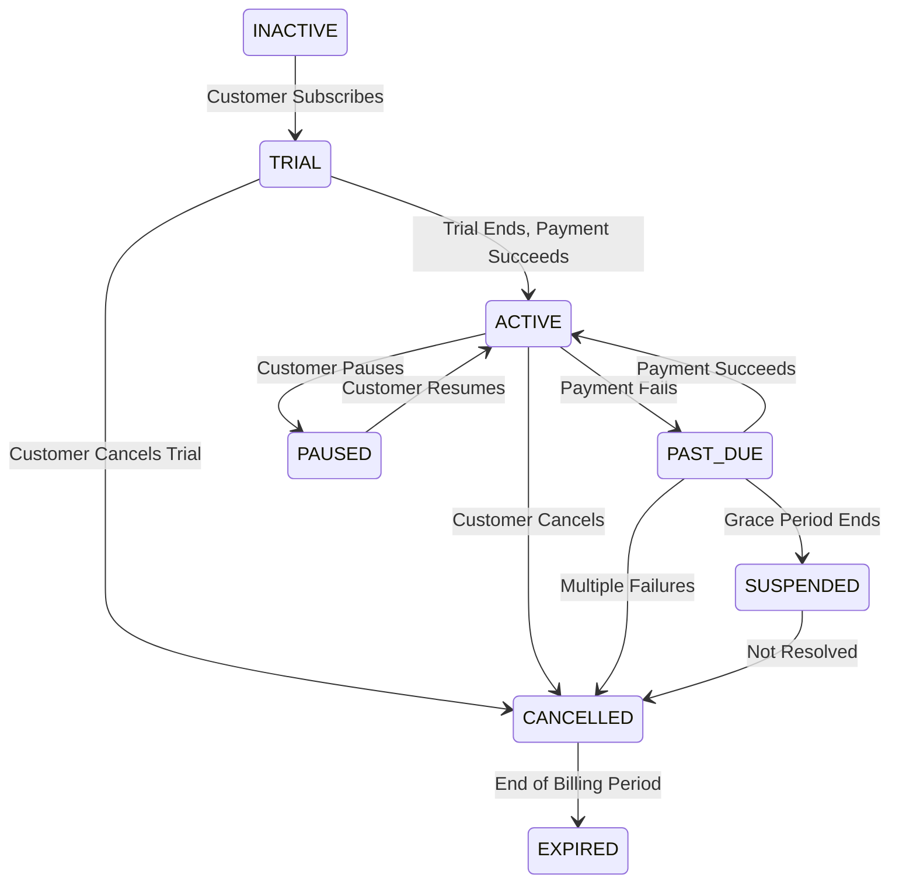
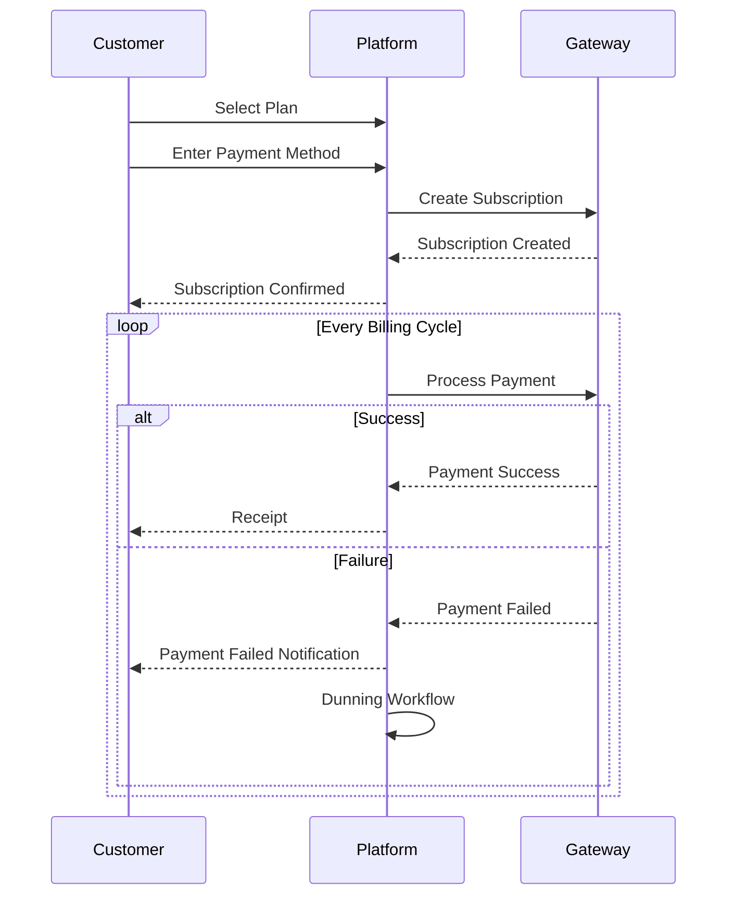
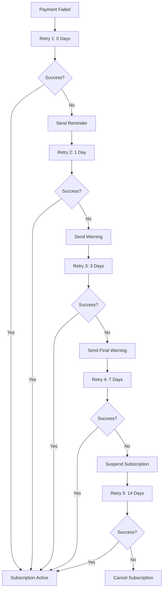

# Software Requirements Specification (SRS)

## Part 07E: Recurring Payments

**Module:** Payment Module (Part 08)
**Version:** 1.0.0
**Status:** Final / For Review
**Date:** 2026-06-30

---

## Chapter 1 – Overview

### Purpose

The Recurring Payments module defines the complete capability for managing subscription-based payments on the **[Platform Name]** platform. This encompasses subscription creation, recurring billing, payment method management, dunning, upgrades/downgrades, cancellations, and subscription analytics.

Recurring payments are the foundation of the platform's subscription business model—enabling predictable recurring revenue streams from customers. This module ensures that subscription payments are processed reliably, that customers have full control over their subscriptions, and that the platform can efficiently manage the entire subscription lifecycle.

### Objectives

- Enable subscription creation with flexible billing cycles
- Process recurring payments reliably and on schedule
- Support multiple subscription plans (tiers, features, pricing)
- Handle payment failures gracefully with dunning workflows
- Allow subscription upgrades, downgrades, and modifications
- Support cancellation with effective-date logic
- Provide comprehensive subscription management for customers
- Enable subscription analytics and reporting

---

## Chapter 2 – Subscription Framework

### RECUR-001 Subscription Plans

| Plan | Description | Price | Billing Cycle | Features | Priority |
| :--- | :--- | :--- | :--- | :--- | :--- |
| **Free** | Basic tier with limited features | $0 | N/A | Standard delivery, limited support | **Required** |
| **Plus** | Enhanced features for regular users | $4.99 | Monthly | Free delivery on orders > $20, priority support | **Required** |
| **Premium** | Full features for power users | $9.99 | Monthly | Free delivery on all orders, VIP support, exclusive offers | **Required** |
| **Annual Plus** | Plus plan, billed annually | $49.99 | Annual | Same as Plus, discounted | **Required** |
| **Annual Premium** | Premium plan, billed annually | $99.99 | Annual | Same as Premium, discounted | **Required** |
| **Enterprise** | Custom plan for businesses | Custom | Custom | Custom features, dedicated account manager | **Medium** |

### RECUR-002 Plan Data Model

| Attribute | Type | Required | Description |
| :--- | :--- | :--- | :--- |
| `plan_id` | UUID | Yes | Unique identifier |
| `plan_name` | String | Yes | Display name |
| `plan_code` | String | Yes | Unique code (e.g., "PLUS_MONTHLY") |
| `plan_type` | String | Yes | FREE/PAID/ENTERPRISE |
| `price` | Decimal | Yes | Price per billing cycle |
| `currency` | String | Yes | ISO 4217 currency |
| `billing_cycle` | String | Yes | MONTHLY/QUARTERLY/ANNUAL/CUSTOM |
| `trial_period_days` | Integer | | Trial period in days |
| `features` | JSONB | Yes | List of features included |
| `is_active` | Boolean | Yes | Active status |
| `created_at` | Timestamp | Yes | Creation timestamp |
| `updated_at` | Timestamp | Yes | Last update timestamp |

---

## Chapter 3 – Subscription Lifecycle

### RECUR-003 Subscription Statuses

| Status | Description | Priority |
| :--- | :--- | :--- |
| `TRIAL` | Subscription in trial period | **Required** |
| `ACTIVE` | Subscription active and recurring | **Required** |
| `PAST_DUE` | Payment failed, grace period | **Required** |
| `CANCELLED` | Subscription cancelled (at end of period) | **Required** |
| `EXPIRED` | Subscription expired (not renewed) | **Required** |
| `SUSPENDED` | Subscription temporarily suspended | **Required** |
| `PAUSED` | Subscription paused by customer | **Required** |
| `INACTIVE` | Subscription inactive (not yet started) | **Required** |

### RECUR-004 Status Transitions

### RECUR-005 Subscription Flow

### RECUR-006 Subscription Data Model

| Column | Type | Constraints | Description |
| :--- | :--- | :--- | :--- |
| `subscription_id` | UUID | PRIMARY KEY | Unique identifier |
| `customer_id` | UUID | FOREIGN KEY (customers.customer_id) | Associated customer |
| `plan_id` | UUID | FOREIGN KEY (plans.plan_id) | Associated plan |
| `payment_method_id` | UUID | FOREIGN KEY (payment_methods.payment_method_id) | Payment method |
| `status` | VARCHAR(20) | NOT NULL | TRIAL/ACTIVE/PAST_DUE/SUSPENDED/PAUSED/CANCELLED/EXPIRED/INACTIVE |
| `start_date` | DATE | NOT NULL | Subscription start date |
| `trial_end_date` | DATE | | Trial period end date |
| `next_billing_date` | DATE | NOT NULL | Next billing date |
| `billing_cycle` | VARCHAR(20) | NOT NULL | MONTHLY/QUARTERLY/ANNUAL |
| `price` | DECIMAL(10, 2) | NOT NULL | Current price |
| `currency` | VARCHAR(3) | NOT NULL | ISO 4217 currency |
| `cancellation_effective_date` | DATE | | Date when cancellation takes effect |
| `cancellation_reason` | VARCHAR(100) | | Reason for cancellation |
| `pause_start_date` | DATE | | Pause start date |
| `pause_end_date` | DATE | | Pause end date |
| `consecutive_failures` | INTEGER | DEFAULT 0 | Consecutive payment failures |
| `metadata` | JSONB | | Additional subscription data |
| `created_at` | TIMESTAMP | DEFAULT NOW() | Creation timestamp |
| `updated_at` | TIMESTAMP | DEFAULT NOW() | Last update timestamp |

---

## Chapter 4 – Payment Processing

### RECUR-007 Recurring Payment Flow

| Step | Description | Priority |
| :--- | :--- | :--- |
| **1. Scheduled** | Payment scheduled for billing date | **Required** |
| **2. Authorization** | Authorize payment with gateway | **Required** |
| **3. Capture** | Capture authorized payment | **Required** |
| **4. Success** | Payment successful | **Required** |
| **5. Failure** | Payment failed | **Required** |
| **6. Retry** | Retry with backoff | **Required** |
| **7. Notification** | Notify customer of outcome | **Required** |
| **8. Status Update** | Update subscription status | **Required** |

### RECUR-008 Payment Retry Schedule

| Retry | Delay | Priority |
| :--- | :--- | :--- |
| **1** | 0 days | **Required** |
| **2** | 1 day | **Required** |
| **3** | 3 days | **Required** |
| **4** | 7 days | **Required** |
| **5** | 14 days | **Required** |
| **6** | 30 days | **Required** |

### RECUR-009 Payment Failure Handling

| Scenario | Action | Priority |
| :--- | :--- | :--- |
| **First Failure** | Retry immediately, notify customer | **Required** |
| **Second Failure** | Retry after 1 day, send reminder | **Required** |
| **Third Failure** | Retry after 3 days, send warning | **Required** |
| **Fourth Failure** | Retry after 7 days, send final warning | **Required** |
| **Fifth Failure** | Retry after 14 days, suspend subscription | **Required** |
| **Sixth Failure** | Retry after 30 days, cancel subscription | **Required** |

---

## Chapter 5 – Dunning Management

### RECUR-010 Dunning Workflow

### RECUR-011 Dunning Communications

| Communication | Timing | Channel | Priority |
| :--- | :--- | :--- | :--- |
| **Payment Failed Notification** | Immediate | Push/Email | **Required** |
| **Payment Reminder** | 1 day after failure | Push/Email | **Required** |
| **Payment Warning** | 3 days after failure | Push/Email | **Required** |
| **Final Warning** | 7 days after failure | Push/Email | **Required** |
| **Suspension Notice** | 14 days after failure | Push/Email | **Required** |
| **Cancellation Notice** | 30 days after failure | Push/Email | **Required** |

---

## Chapter 6 – Subscription Management

### RECUR-012 Customer Actions

| Action | Description | Priority |
| :--- | :--- | :--- |
| **Subscribe** | Start new subscription | **Required** |
| **Upgrade** | Move to higher-tier plan | **Required** |
| **Downgrade** | Move to lower-tier plan | **Required** |
| **Cancel** | Cancel subscription (effective end of period) | **Required** |
| **Pause** | Temporarily pause subscription | **Required** |
| **Resume** | Resume paused subscription | **Required** |
| **Update Payment Method** | Change payment method | **Required** |
| **View Subscription** | View subscription details | **Required** |
| **View Invoices** | View billing history | **Required** |

### RECUR-013 Upgrade/Downgrade Rules

| Rule | Description | Priority |
| :--- | :--- | :--- |
| **Upgrade** | Effective immediately, prorated billing | **Required** |
| **Downgrade** | Effective at next billing cycle | **Required** |
| **Proration** | Prorated refund/charge for mid-cycle changes | **Required** |
| **Plan Availability** | New plan must be available | **Required** |

### RECUR-014 Cancellation Rules

| Rule | Description | Priority |
| :--- | :--- | :--- |
| **Immediate Cancellation** | Cancel immediately (no refund) | **Required** |
| **End of Period** | Cancel at end of current billing period | **Required** |
| **Refund Policy** | No refunds for partial periods | **Required** |
| **Reactivation** | Customer can reactivate within 30 days | **Required** |

---

## Chapter 7 – Billing & Invoicing

### RECUR-015 Invoice Generation

| Feature | Description | Priority |
| :--- | :--- | :--- |
| **Auto-Generation** | Invoice generated for each billing cycle | **Required** |
| **Invoice Number** | Unique sequential invoice number | **Required** |
| **Invoice Details** | Plan name, price, tax, total | **Required** |
| **Invoice PDF** | Downloadable PDF invoice | **Required** |
| **Email Delivery** | Invoice emailed to customer | **Required** |
| **Invoice History** | View all past invoices | **Required** |

### RECUR-016 Invoice Data Model

| Column | Type | Constraints | Description |
| :--- | :--- | :--- | :--- |
| `invoice_id` | UUID | PRIMARY KEY | Unique identifier |
| `subscription_id` | UUID | FOREIGN KEY (subscriptions.subscription_id) | Associated subscription |
| `customer_id` | UUID | FOREIGN KEY (customers.customer_id) | Associated customer |
| `invoice_number` | VARCHAR(50) | UNIQUE | Human-readable invoice number |
| `billing_period_start` | DATE | NOT NULL | Billing period start |
| `billing_period_end` | DATE | NOT NULL | Billing period end |
| `amount` | DECIMAL(10, 2) | NOT NULL | Invoice amount |
| `tax` | DECIMAL(10, 2) | DEFAULT 0 | Tax amount |
| `total` | DECIMAL(10, 2) | NOT NULL | Total amount |
| `currency` | VARCHAR(3) | NOT NULL | ISO 4217 currency |
| `status` | VARCHAR(20) | DEFAULT 'PENDING' | PENDING/PAID/OVERDUE/CANCELLED |
| `payment_date` | DATE | | Payment date |
| `invoice_url` | VARCHAR(500) | | PDF invoice URL |
| `created_at` | TIMESTAMP | DEFAULT NOW() | Creation timestamp |
| `updated_at` | TIMESTAMP | DEFAULT NOW() | Last update timestamp |

---

## Chapter 8 – Database Tables

### subscription_plans

| Column | Type | Constraints | Description |
| :--- | :--- | :--- | :--- |
| `plan_id` | UUID | PRIMARY KEY | Unique identifier |
| `plan_name` | VARCHAR(100) | NOT NULL | Display name |
| `plan_code` | VARCHAR(50) | UNIQUE | Unique code |
| `plan_type` | VARCHAR(20) | NOT NULL | FREE/PAID/ENTERPRISE |
| `price` | DECIMAL(10, 2) | DEFAULT 0 | Price per cycle |
| `currency` | VARCHAR(3) | NOT NULL | ISO 4217 currency |
| `billing_cycle` | VARCHAR(20) | NOT NULL | MONTHLY/QUARTERLY/ANNUAL |
| `trial_period_days` | INTEGER | DEFAULT 0 | Trial period in days |
| `features` | JSONB | NOT NULL | Features included |
| `is_active` | BOOLEAN | DEFAULT TRUE | Active status |
| `created_at` | TIMESTAMP | DEFAULT NOW() | Creation timestamp |
| `updated_at` | TIMESTAMP | DEFAULT NOW() | Last update timestamp |

### subscriptions

| Column | Type | Constraints | Description |
| :--- | :--- | :--- | :--- |
| `subscription_id` | UUID | PRIMARY KEY | Unique identifier |
| `customer_id` | UUID | FOREIGN KEY (customers.customer_id) | Associated customer |
| `plan_id` | UUID | FOREIGN KEY (subscription_plans.plan_id) | Associated plan |
| `payment_method_id` | UUID | FOREIGN KEY (payment_methods.payment_method_id) | Payment method |
| `status` | VARCHAR(20) | NOT NULL | TRIAL/ACTIVE/PAST_DUE/SUSPENDED/PAUSED/CANCELLED/EXPIRED/INACTIVE |
| `start_date` | DATE | NOT NULL | Subscription start date |
| `trial_end_date` | DATE | | Trial end date |
| `next_billing_date` | DATE | NOT NULL | Next billing date |
| `billing_cycle` | VARCHAR(20) | NOT NULL | MONTHLY/QUARTERLY/ANNUAL |
| `price` | DECIMAL(10, 2) | NOT NULL | Current price |
| `currency` | VARCHAR(3) | NOT NULL | ISO 4217 currency |
| `cancellation_effective_date` | DATE | | Cancellation effective date |
| `cancellation_reason` | VARCHAR(100) | | Reason for cancellation |
| `pause_start_date` | DATE | | Pause start date |
| `pause_end_date` | DATE | | Pause end date |
| `consecutive_failures` | INTEGER | DEFAULT 0 | Consecutive payment failures |
| `metadata` | JSONB | | Additional data |
| `created_at` | TIMESTAMP | DEFAULT NOW() | Creation timestamp |
| `updated_at` | TIMESTAMP | DEFAULT NOW() | Last update timestamp |

### subscription_invoices

| Column | Type | Constraints | Description |
| :--- | :--- | :--- | :--- |
| `invoice_id` | UUID | PRIMARY KEY | Unique identifier |
| `subscription_id` | UUID | FOREIGN KEY (subscriptions.subscription_id) | Associated subscription |
| `customer_id` | UUID | FOREIGN KEY (customers.customer_id) | Associated customer |
| `invoice_number` | VARCHAR(50) | UNIQUE | Invoice number |
| `billing_period_start` | DATE | NOT NULL | Period start |
| `billing_period_end` | DATE | NOT NULL | Period end |
| `amount` | DECIMAL(10, 2) | NOT NULL | Invoice amount |
| `tax` | DECIMAL(10, 2) | DEFAULT 0 | Tax amount |
| `total` | DECIMAL(10, 2) | NOT NULL | Total amount |
| `currency` | VARCHAR(3) | NOT NULL | ISO 4217 currency |
| `status` | VARCHAR(20) | DEFAULT 'PENDING' | PENDING/PAID/OVERDUE/CANCELLED |
| `payment_date` | DATE | | Payment date |
| `payment_transaction_id` | UUID | | Payment transaction |
| `invoice_url` | VARCHAR(500) | | PDF URL |
| `created_at` | TIMESTAMP | DEFAULT NOW() | Creation timestamp |
| `updated_at` | TIMESTAMP | DEFAULT NOW() | Last update timestamp |

### subscription_events

| Column | Type | Constraints | Description |
| :--- | :--- | :--- | :--- |
| `event_id` | UUID | PRIMARY KEY | Unique identifier |
| `subscription_id` | UUID | FOREIGN KEY (subscriptions.subscription_id) | Associated subscription |
| `event_type` | VARCHAR(30) | NOT NULL | CREATED/STARTED/PAYMENT_SUCCEEDED/PAYMENT_FAILED/RETRY/CANCELLED/PAUSED/RESUMED/UPGRADED/DOWNGRADED/EXPIRED/SUSPENDED |
| `description` | TEXT | | Event description |
| `metadata` | JSONB | | Event metadata |
| `created_at` | TIMESTAMP | DEFAULT NOW() | Event timestamp |

### payment_retries

| Column | Type | Constraints | Description |
| :--- | :--- | :--- | :--- |
| `retry_id` | UUID | PRIMARY KEY | Unique identifier |
| `subscription_id` | UUID | FOREIGN KEY (subscriptions.subscription_id) | Associated subscription |
| `attempt_number` | INTEGER | NOT NULL | Retry attempt number |
| `scheduled_date` | DATE | NOT NULL | Scheduled retry date |
| `actual_date` | DATE | | Actual retry date |
| `status` | VARCHAR(20) | DEFAULT 'PENDING' | PENDING/SUCCESS/FAILED/SKIPPED |
| `amount` | DECIMAL(10, 2) | NOT NULL | Amount attempted |
| `currency` | VARCHAR(3) | NOT NULL | ISO 4217 currency |
| `error_code` | VARCHAR(50) | | Error code |
| `error_message` | TEXT | | Error message |
| `created_at` | TIMESTAMP | DEFAULT NOW() | Creation timestamp |
| `updated_at` | TIMESTAMP | DEFAULT NOW() | Last update timestamp |

---

## Chapter 9 – REST APIs

### Subscription APIs

| Method | Endpoint | Description |
| :--- | :--- | :--- |
| `GET` | `/api/v1/subscriptions/plans` | List available plans |
| `GET` | `/api/v1/subscriptions/plans/{id}` | Get plan details |
| `GET` | `/api/v1/customers/me/subscription` | Get current subscription |
| `POST` | `/api/v1/customers/me/subscription` | Create subscription |
| `PUT` | `/api/v1/customers/me/subscription` | Update subscription |
| `POST` | `/api/v1/customers/me/subscription/cancel` | Cancel subscription |
| `POST` | `/api/v1/customers/me/subscription/pause` | Pause subscription |
| `POST` | `/api/v1/customers/me/subscription/resume` | Resume subscription |
| `GET` | `/api/v1/customers/me/subscription/invoices` | Get subscription invoices |
| `GET` | `/api/v1/customers/me/subscription/invoices/{id}` | Get invoice details |
| `GET` | `/api/v1/customers/me/subscription/invoices/{id}/download` | Download invoice PDF |

### Admin APIs

| Method | Endpoint | Description |
| :--- | :--- | :--- |
| `GET` | `/api/v1/admin/subscriptions` | List subscriptions (admin) |
| `GET` | `/api/v1/admin/subscriptions/{id}` | Get subscription details (admin) |
| `POST` | `/api/v1/admin/subscriptions/plans` | Create plan (admin) |
| `PUT` | `/api/v1/admin/subscriptions/plans/{id}` | Update plan (admin) |
| `DELETE` | `/api/v1/admin/subscriptions/plans/{id}` | Delete plan (admin) |
| `POST` | `/api/v1/admin/subscriptions/{id}/pause` | Pause subscription (admin) |
| `POST` | `/api/v1/admin/subscriptions/{id}/resume` | Resume subscription (admin) |
| `POST` | `/api/v1/admin/subscriptions/{id}/cancel` | Cancel subscription (admin) |

---

## Chapter 10 – Business Rules

| Rule ID | Rule Description | Priority |
| :--- | :--- | :--- |
| **BR-RECUR-001** | Subscriptions require a valid payment method. | **High** |
| **BR-RECUR-002** | Trial periods are limited to 7 days (configurable). | **High** |
| **BR-RECUR-003** | Upgrades take effect immediately (prorated). | **High** |
| **BR-RECUR-004** | Downgrades take effect at next billing cycle. | **High** |
| **BR-RECUR-005** | Cancellations take effect at end of billing period. | **High** |
| **BR-RECUR-006** | Payment retries occur on day 0, 1, 3, 7, 14, and 30. | **High** |
| **BR-RECUR-007** | Subscription is suspended after 14 days of failed payments. | **High** |
| **BR-RECUR-008** | Subscription is cancelled after 30 days of failed payments. | **High** |
| **BR-RECUR-009** | Invoices must be generated for each billing cycle. | **High** |
| **BR-RECUR-010** | Reactivation within 30 days of cancellation restores subscription. | **High** |

---

## Chapter 11 – Acceptance Tests

| Test ID | Test Description | Priority |
| :--- | :--- | :--- |
| **TEST-RECUR-001** | Customer subscribes to Plus plan successfully. | **High** |
| **TEST-RECUR-002** | Customer subscribes with trial period. | **High** |
| **TEST-RECUR-003** | Subscription moves from Trial to Active after trial ends. | **High** |
| **TEST-RECUR-004** | Recurring payment succeeds on billing date. | **High** |
| **TEST-RECUR-005** | Recurring payment fails (retry schedule triggered). | **High** |
| **TEST-RECUR-006** | Payment retry succeeds after failure. | **High** |
| **TEST-RECUR-007** | After multiple failures, subscription is suspended. | **High** |
| **TEST-RECUR-008** | After max failures, subscription is cancelled. | **High** |
| **TEST-RECUR-009** | Customer upgrades to Premium plan (prorated). | **High** |
| **TEST-RECUR-010** | Customer downgrades to Plus plan (effective next cycle). | **High** |
| **TEST-RECUR-011** | Customer cancels subscription (effective end of period). | **High** |
| **TEST-RECUR-012** | Customer pauses subscription. | **High** |
| **TEST-RECUR-013** | Customer resumes paused subscription. | **High** |
| **TEST-RECUR-014** | Invoice generated for billing cycle. | **High** |
| **TEST-RECUR-015** | Customer views invoice details. | **High** |
| **TEST-RECUR-016** | Customer downloads invoice PDF. | **High** |
| **TEST-RECUR-017** | Customer updates payment method. | **High** |
| **TEST-RECUR-018** | Subscription status displayed correctly. | **High** |
| **TEST-RECUR-019** | Dunning email sent on payment failure. | **High** |
| **TEST-RECUR-020** | Final warning sent before suspension. | **High** |
| **TEST-RECUR-021** | Subscription reactivated within 30 days of cancellation. | **High** |
| **TEST-RECUR-022** | Admin creates new subscription plan. | **High** |
| **TEST-RECUR-023** | Admin updates subscription plan. | **High** |
| **TEST-RECUR-024** | Admin deactivates subscription plan. | **High** |
| **TEST-RECUR-025** | Subscription analytics dashboard displays correctly. | **High** |

---

## Chapter 12 – Traceability Matrix

| Requirement | Database Table | API Endpoint(s) | Acceptance Test |
| :--- | :--- | :--- | :--- |
| RECUR-005 | subscriptions | POST /api/v1/customers/me/subscription | TEST-RECUR-001, TEST-RECUR-002 |
| RECUR-003 | subscriptions | GET /api/v1/customers/me/subscription | TEST-RECUR-003, TEST-RECUR-018 |
| RECUR-007 | subscriptions | Internal (Scheduler) | TEST-RECUR-004 |
| RECUR-008 | payment_retries | Internal (Scheduler) | TEST-RECUR-005, TEST-RECUR-006, TEST-RECUR-007, TEST-RECUR-008 |
| RECUR-012 | subscriptions | PUT /api/v1/customers/me/subscription | TEST-RECUR-009, TEST-RECUR-010 |
| RECUR-012 | subscriptions | POST /api/v1/customers/me/subscription/cancel | TEST-RECUR-011 |
| RECUR-012 | subscriptions | POST /api/v1/customers/me/subscription/pause | TEST-RECUR-012 |
| RECUR-012 | subscriptions | POST /api/v1/customers/me/subscription/resume | TEST-RECUR-013 |
| RECUR-015 | subscription_invoices | GET /api/v1/customers/me/subscription/invoices | TEST-RECUR-014, TEST-RECUR-015, TEST-RECUR-016 |
| RECUR-012 | subscriptions | PUT /api/v1/customers/me/subscription | TEST-RECUR-017 |
| RECUR-011 | subscriptions | Internal (Notification) | TEST-RECUR-019, TEST-RECUR-020 |
| RECUR-012 | subscriptions | POST /api/v1/customers/me/subscription | TEST-RECUR-021 |
| RECUR-002 | subscription_plans | POST /api/v1/admin/subscriptions/plans | TEST-RECUR-022, TEST-RECUR-023, TEST-RECUR-024 |

---

## Chapter 13 – Summary

This document establishes the complete recurring payments capability for the **[Platform Name]** platform. Key takeaways:

- **Subscription Plans:** Flexible plans (Free, Plus, Premium, Annual, Enterprise) with configurable pricing and billing cycles.
- **Subscription Lifecycle:** Complete state machine (Trial → Active → Past Due → Suspended → Cancelled → Expired) with clear transitions.
- **Recurring Payment Processing:** Automated payment processing at each billing cycle with comprehensive failure handling.
- **Dunning Management:** Structured retry schedule (0, 1, 3, 7, 14, 30 days) with escalating communications.
- **Subscription Management:** Customer actions (subscribe, upgrade, downgrade, cancel, pause, resume, update payment method).
- **Billing & Invoicing:** Auto-generated invoices with PDF download and email delivery.
- **Comprehensive Data Model:** Plans, subscriptions, invoices, events, and payment retries for complete auditability.
- **Admin Capabilities:** Plan creation, management, and subscription administration.

The recurring payments module enables the platform's subscription business model, providing predictable recurring revenue while giving customers flexibility and control over their subscriptions.

---

**Next Document:**

`09_Admin_Operations_Module/Part_08A_Admin_Dashboard.md`

*(This transitions from payments to the admin/operations module, starting with the admin dashboard.)*
