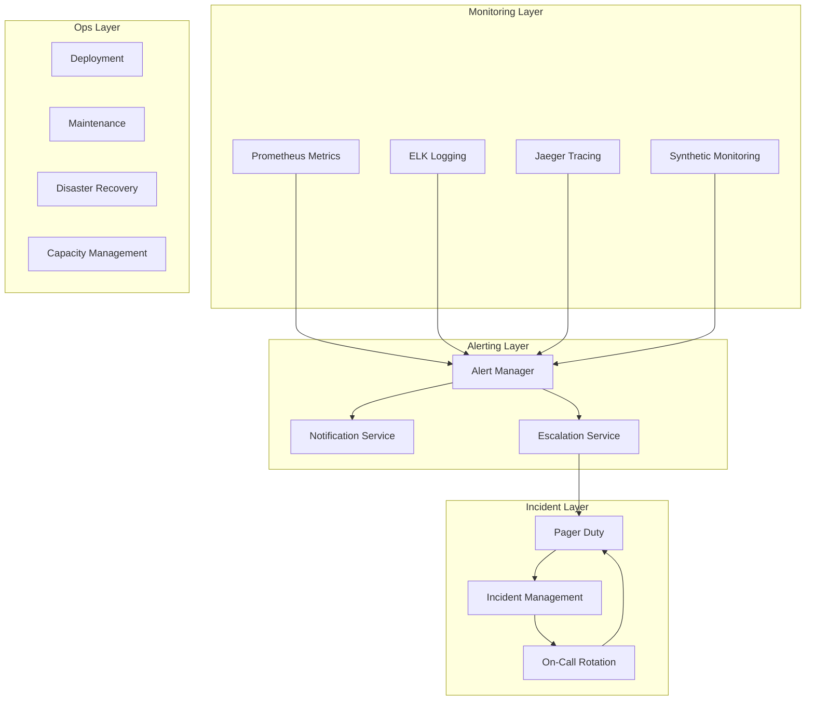
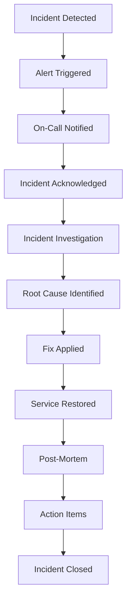

# Software Requirements Specification (SRS)

## Part 08B: Platform Operations

**Module:** Admin & Operations Module (Part 09)
**Version:** 1.0.0
**Status:** Final / For Review
**Date:** 2026-06-30

---

## Chapter 1 – Overview

### Purpose

The Platform Operations module defines the comprehensive operational management capabilities for running the **[Platform Name]** platform in production. This encompasses operational monitoring, incident management, system health, maintenance, and business continuity.

Platform operations ensure the reliability, availability, and performance of the platform. This module defines how the platform is monitored, how incidents are detected and resolved, how maintenance is performed, and how the platform remains available even during failures. Effective platform operations are essential for maintaining customer trust and business continuity.

### Objectives

- Provide comprehensive operational monitoring
- Enable rapid incident detection and response
- Support scheduled maintenance with minimal disruption
- Ensure business continuity and disaster recovery
- Maintain platform health and performance
- Provide operational visibility and reporting
- Support capacity management and scaling
- Enable continuous improvement

---

## Chapter 2 – Operations Architecture

### OPS-001 Operations Architecture Overview

### OPS-002 Operations Components

| Component | Description | Priority |
| :--- | :--- | :--- |
| **Monitoring Stack** | Metrics, logs, traces, and synthetic monitoring | **Required** |
| **Alerting System** | Alert generation, routing, and notification | **Required** |
| **Incident Management** | Incident tracking, response, and resolution | **Required** |
| **On-Call Rotation** | Staff scheduling and escalation | **Required** |
| **Maintenance Management** | Scheduled maintenance coordination | **Required** |
| **Disaster Recovery** | Business continuity planning and execution | **Required** |
| **Capacity Management** | Resource monitoring and scaling | **Required** |
| **Performance Management** | Performance optimization and tuning | **Required** |

---

## Chapter 3 – Monitoring

### OPS-003 Monitoring Types

| Type | Description | Priority |
| :--- | :--- | :--- |
| **Infrastructure Monitoring** | Servers, containers, networks, storage | **Required** |
| **Application Monitoring** | Service health, response times, errors | **Required** |
| **Business Monitoring** | Orders, revenue, user activity | **Required** |
| **Synthetic Monitoring** | Simulated user transactions | **Required** |
| **Real User Monitoring (RUM)** | Actual user experience metrics | **Required** |
| **Log Monitoring** | Centralized log aggregation and analysis | **Required** |
| **Tracing** | Distributed request tracing | **Required** |

### OPS-004 Key Metrics

| Category | Metric | Threshold | Priority |
| :--- | :--- | :--- | :--- |
| **Infrastructure** | CPU Utilization | < 70% | **Required** |
| | Memory Utilization | < 80% | **Required** |
| | Disk Utilization | < 80% | **Required** |
| | Network Latency | < 50ms | **Required** |
| **Application** | API Response Time (P95) | < 500ms | **Required** |
| | Error Rate | < 1% | **Required** |
| | Request Rate | Monitor | **Required** |
| | Service Availability | > 99.95% | **Required** |
| **Business** | Order Volume | Monitor | **Required** |
| | Revenue | Monitor | **Required** |
| | Active Users | Monitor | **Required** |
| | Delivery Time | < 30 min | **Required** |

### OPS-005 Monitoring Dashboards

| Dashboard | Description | Priority |
| :--- | :--- | :--- |
| **Infrastructure** | Server and network health | **Required** |
| **Applications** | Service and API health | **Required** |
| **Business** | Order, revenue, and user metrics | **Required** |
| **Delivery** | Delivery performance and tracking | **Required** |
| **Financial** | Transaction and settlement monitoring | **Required** |
| **Security** | Security events and anomalies | **Required** |

### OPS-006 Monitoring Data Model

| Column | Type | Constraints | Description |
| :--- | :--- | :--- | :--- |
| `monitor_id` | UUID | PRIMARY KEY | Unique identifier |
| `service_name` | VARCHAR(100) | NOT NULL | Service being monitored |
| `metric_name` | VARCHAR(100) | NOT NULL | Metric name |
| `metric_value` | DECIMAL(10, 2) | NOT NULL | Metric value |
| `unit` | VARCHAR(20) | | Metric unit |
| `labels` | JSONB | | Metric labels |
| `timestamp` | TIMESTAMP | NOT NULL | Metric timestamp |
| `created_at` | TIMESTAMP | DEFAULT NOW() | Creation timestamp |

---

## Chapter 4 – Alerting

### OPS-007 Alert Types

| Type | Description | Priority |
| :--- | :--- | :--- |
| **Critical** | System down, data loss, severe outage | **Required** |
| **High** | Degraded performance, partial outage | **Required** |
| **Medium** | Warning, approaching thresholds | **Required** |
| **Low** | Informational, non-urgent issues | **Required** |

### OPS-008 Alert Rules

| Rule | Description | Priority |
| :--- | :--- | :--- |
| **Service Down** | Service unavailable for > 1 minute | **Required** |
| **High Error Rate** | Error rate > 5% for > 2 minutes | **Required** |
| **High Latency** | P95 latency > 1s for > 5 minutes | **Required** |
| **Resource Exhaustion** | CPU/Memory > 90% for > 5 minutes | **Required** |
| **Business Anomaly** | Order volume drops > 50% | **Required** |
| **Payment Failure Spike** | Payment failure rate > 10% | **Required** |

### OPS-009 Alert Severity Mapping

| Severity | Response Time | Notification | Priority |
| :--- | :--- | :--- | :--- |
| **Critical** | < 5 minutes | SMS, Push, Email | **Required** |
| **High** | < 15 minutes | Push, Email | **Required** |
| **Medium** | < 30 minutes | Email | **Required** |
| **Low** | < 1 hour | Email | **Required** |

### OPS-010 Alert Data Model

| Column | Type | Constraints | Description |
| :--- | :--- | :--- | :--- |
| `alert_id` | UUID | PRIMARY KEY | Unique identifier |
| `alert_type` | VARCHAR(30) | NOT NULL | CRITICAL/HIGH/MEDIUM/LOW |
| `service_name` | VARCHAR(100) | NOT NULL | Service affected |
| `alert_message` | TEXT | NOT NULL | Alert description |
| `alert_value` | VARCHAR(100) | | Alert value |
| `threshold_value` | VARCHAR(100) | | Threshold value |
| `status` | VARCHAR(20) | DEFAULT 'OPEN' | OPEN/ACKNOWLEDGED/RESOLVED |
| `assigned_to` | UUID | | Assigned team member |
| `acknowledged_at` | TIMESTAMP | | Acknowledgement timestamp |
| `resolved_at` | TIMESTAMP | | Resolution timestamp |
| `created_at` | TIMESTAMP | DEFAULT NOW() | Creation timestamp |
| `updated_at` | TIMESTAMP | DEFAULT NOW() | Last update timestamp |

---

## Chapter 5 – Incident Management

### OPS-011 Incident Types

| Type | Description | Priority |
| :--- | :--- | :--- |
| **Service Outage** | Complete or partial service outage | **Required** |
| **Performance Degradation** | Slow performance or errors | **Required** |
| **Security Incident** | Security breach or vulnerability | **Required** |
| **Data Incident** | Data loss or corruption | **Required** |
| **Payment Incident** | Payment processing failure | **Required** |
| **Vendor Incident** | Third-party service failure | **Required** |

### OPS-012 Incident Severity Levels

| Level | Description | Response | Priority |
| :--- | :--- | :--- | :--- |
| **P0** | Complete service outage | Immediate, all hands | **Required** |
| **P1** | Critical feature outage | < 15 minutes | **Required** |
| **P2** | Major feature degradation | < 1 hour | **Required** |
| **P3** | Minor issue | < 4 hours | **Required** |
| **P4** | Cosmetic issue | < 24 hours | **Required** |

### OPS-013 Incident Workflow

### OPS-014 Incident Management Features

| Feature | Description | Priority |
| :--- | :--- | :--- |
| **Incident Logging** | Record all incidents | **Required** |
| **Incident Assignment** | Assign to team members | **Required** |
| **Incident Status** | Track incident progress | **Required** |
| **Incident Timeline** | Chronological incident log | **Required** |
| **Incident Communication** | Notify stakeholders | **Required** |
| **Post-Mortem** | Detailed incident analysis | **Required** |
| **Action Items** | Track follow-up actions | **Required** |
| **Incident Reports** | Generate incident reports | **Required** |

### OPS-015 Incident Data Model

| Column | Type | Constraints | Description |
| :--- | :--- | :--- | :--- |
| `incident_id` | UUID | PRIMARY KEY | Unique identifier |
| `incident_type` | VARCHAR(30) | NOT NULL | OUTAGE/PERFORMANCE/SECURITY/DATA/PAYMENT/VENDOR |
| `severity` | VARCHAR(10) | NOT NULL | P0/P1/P2/P3/P4 |
| `title` | VARCHAR(255) | NOT NULL | Incident title |
| `description` | TEXT | NOT NULL | Detailed description |
| `status` | VARCHAR(20) | DEFAULT 'OPEN' | OPEN/INVESTIGATING/MITIGATING/RESOLVED/CLOSED |
| `assigned_to` | UUID | | Assigned team member |
| `reported_by` | UUID | | Reporter identifier |
| `detected_at` | TIMESTAMP | | Detection timestamp |
| `acknowledged_at` | TIMESTAMP | | Acknowledgement timestamp |
| `resolved_at` | TIMESTAMP | | Resolution timestamp |
| `closed_at` | TIMESTAMP | | Closure timestamp |
| `root_cause` | TEXT | | Root cause analysis |
| `impact` | TEXT | | Business impact |
| `resolution` | TEXT | | Resolution description |
| `post_mortem` | TEXT | | Post-mortem report |
| `created_at` | TIMESTAMP | DEFAULT NOW() | Creation timestamp |
| `updated_at` | TIMESTAMP | DEFAULT NOW() | Last update timestamp |

### OPS-016 Post-Mortem

| Section | Content | Priority |
| :--- | :--- | :--- |
| **Incident Summary** | Overview of incident | **Required** |
| **Timeline** | Chronological event log | **Required** |
| **Root Cause** | Analysis of root cause | **Required** |
| **Impact** | Business and technical impact | **Required** |
| **Resolution** | How incident was resolved | **Required** |
| **Learnings** | Lessons learned | **Required** |
| **Action Items** | Follow-up actions | **Required** |
| **Prevention** | How to prevent recurrence | **Required** |

---

## Chapter 6 – On-Call Management

### OPS-017 On-Call Features

| Feature | Description | Priority |
| :--- | :--- | :--- |
| **On-Call Schedule** | Rotating on-call schedule | **Required** |
| **Escalation Chains** | Hierarchical escalation | **Required** |
| **Scheduling** | Manage shift assignments | **Required** |
| **Handover** | Shift handover reporting | **Required** |
| **Notifications** | Alert notifications to on-call | **Required** |
| **Acknowledgment** | Acknowledge alerts | **Required** |
| **Escalation** | Auto-escalate on no response | **Required** |

### OPS-018 Escalation Policy

| Level | Role | Response Time | Priority |
| :--- | :--- | :--- | :--- |
| **Level 1** | Primary On-Call | < 5 min | **Required** |
| **Level 2** | Secondary On-Call | < 15 min | **Required** |
| **Level 3** | Team Lead | < 30 min | **Required** |
| **Level 4** | Manager | < 1 hour | **Required** |
| **Level 5** | Director | < 2 hours | **Required** |

### OPS-019 On-Call Data Model

| Column | Type | Constraints | Description |
| :--- | :--- | :--- | :--- |
| `shift_id` | UUID | PRIMARY KEY | Unique identifier |
| `user_id` | UUID | FOREIGN KEY (admin_users.user_id) | On-call user |
| `shift_start` | TIMESTAMP | NOT NULL | Shift start time |
| `shift_end` | TIMESTAMP | NOT NULL | Shift end time |
| `status` | VARCHAR(20) | DEFAULT 'SCHEDULED' | SCHEDULED/ACTIVE/COMPLETED |
| `handover_notes` | TEXT | | Shift handover notes |
| `created_at` | TIMESTAMP | DEFAULT NOW() | Creation timestamp |
| `updated_at` | TIMESTAMP | DEFAULT NOW() | Last update timestamp |

---

## Chapter 7 – Maintenance Management

### OPS-020 Maintenance Types

| Type | Description | Priority |
| :--- | :--- | :--- |
| **Scheduled Maintenance** | Planned system updates | **Required** |
| **Emergency Maintenance** | Urgent fixes and patches | **Required** |
| **Database Maintenance** | DB upgrades and optimizations | **Required** |
| **Infrastructure Maintenance** | Server and network updates | **Required** |
| **Security Updates** | Security patches and updates | **Required** |
| **Feature Releases** | New feature deployments | **Required** |

### OPS-021 Maintenance Process

1.  **Planning:** Identify maintenance requirements
2.  **Scheduling:** Schedule maintenance window
3.  **Communication:** Notify stakeholders
4.  **Approval:** Get necessary approvals
5.  **Execution:** Perform maintenance
6.  **Verification:** Verify system health
7.  **Communication:** Notify completion
8.  **Documentation:** Update maintenance log

### OPS-022 Maintenance Data Model

| Column | Type | Constraints | Description |
| :--- | :--- | :--- | :--- |
| `maintenance_id` | UUID | PRIMARY KEY | Unique identifier |
| `maintenance_type` | VARCHAR(30) | NOT NULL | SCHEDULED/EMERGENCY/DATABASE/INFRASTRUCTURE/SECURITY/RELEASE |
| `title` | VARCHAR(255) | NOT NULL | Maintenance title |
| `description` | TEXT | | Maintenance description |
| `scheduled_start` | TIMESTAMP | NOT NULL | Scheduled start time |
| `scheduled_end` | TIMESTAMP | NOT NULL | Scheduled end time |
| `actual_start` | TIMESTAMP | | Actual start time |
| `actual_end` | TIMESTAMP | | Actual end time |
| `status` | VARCHAR(20) | DEFAULT 'SCHEDULED' | SCHEDULED/IN_PROGRESS/COMPLETED/CANCELLED/FAILED |
| `impact` | TEXT | | Business impact |
| `rollback_plan` | TEXT | | Rollback procedure |
| `performed_by` | UUID | | Performer identifier |
| `approved_by` | UUID | | Approver identifier |
| `created_at` | TIMESTAMP | DEFAULT NOW() | Creation timestamp |
| `updated_at` | TIMESTAMP | DEFAULT NOW() | Last update timestamp |

---

## Chapter 8 – Business Continuity

### OPS-023 Disaster Recovery

| Requirement | Description | Target | Priority |
| :--- | :--- | :--- | :--- |
| **RTO** | Recovery Time Objective | < 15 minutes | **Required** |
| **RPO** | Recovery Point Objective | < 5 minutes | **Required** |
| **Failover** | Automatic failover capability | Yes | **Required** |
| **Multi-AZ** | Multiple availability zones | Yes | **Required** |
| **Data Backup** | Automated data backup | Daily | **Required** |
| **DR Testing** | Regular disaster recovery testing | Quarterly | **Required** |

### OPS-024 Backup Strategy

| Data Type | Backup Frequency | Retention | Priority |
| :--- | :--- | :--- | :--- |
| **Database** | Continuous | 30 days | **Required** |
| **Transaction Logs** | Continuous | 7 days | **Required** |
| **Configurations** | On change | 90 days | **Required** |
| **User Data** | Daily | 30 days | **Required** |
| **Transaction Data** | Daily | 7 years | **Required** |
| **Audit Logs** | Daily | 7 years | **Required** |

---

## Chapter 9 – Performance Optimization

### OPS-025 Performance Management

| Activity | Description | Frequency | Priority |
| :--- | :--- | :--- | :--- |
| **Performance Monitoring** | Monitor system performance | Continuous | **Required** |
| **Performance Analysis** | Identify bottlenecks | Weekly | **Required** |
| **Capacity Planning** | Plan for growth | Monthly | **Required** |
| **Performance Testing** | Load and stress testing | Quarterly | **Required** |
| **Optimization** | Implement improvements | Ongoing | **Required** |

### OPS-026 Performance Targets

| Metric | Target | Priority |
| :--- | :--- | :--- | :--- |
| **API Response Time (P95)** | < 500ms | **Required** |
| **API Error Rate** | < 1% | **Required** |
| **Service Availability** | > 99.95% | **Required** |
| **Order Processing Time** | < 100ms | **Required** |
| **Page Load Time** | < 2s | **Required** |
| **Mobile App Load Time** | < 3s | **Required** |

---

## Chapter 10 – Database Tables

### incident_reports

| Column | Type | Constraints | Description |
| :--- | :--- | :--- | :--- |
| `incident_id` | UUID | PRIMARY KEY | Unique identifier |
| `title` | VARCHAR(255) | NOT NULL | Incident title |
| `description` | TEXT | NOT NULL | Incident description |
| `severity` | VARCHAR(10) | NOT NULL | P0/P1/P2/P3/P4 |
| `status` | VARCHAR(20) | DEFAULT 'OPEN' | OPEN/INVESTIGATING/MITIGATING/RESOLVED/CLOSED |
| `assigned_to` | UUID | | Assigned team member |
| `detected_at` | TIMESTAMP | | Detection timestamp |
| `acknowledged_at` | TIMESTAMP | | Acknowledgement |
| `resolved_at` | TIMESTAMP | | Resolution timestamp |
| `root_cause` | TEXT | | Root cause analysis |
| `impact` | TEXT | | Business impact |
| `resolution` | TEXT | | Resolution description |
| `post_mortem` | TEXT | | Post-mortem report |
| `created_at` | TIMESTAMP | DEFAULT NOW() | Creation timestamp |
| `updated_at` | TIMESTAMP | DEFAULT NOW() | Last update timestamp |

### maintenance_logs

| Column | Type | Constraints | Description |
| :--- | :--- | :--- | :--- |
| `maintenance_id` | UUID | PRIMARY KEY | Unique identifier |
| `title` | VARCHAR(255) | NOT NULL | Maintenance title |
| `description` | TEXT | | Maintenance description |
| `type` | VARCHAR(30) | NOT NULL | SCHEDULED/EMERGENCY/DATABASE/INFRASTRUCTURE/SECURITY/RELEASE |
| `scheduled_start` | TIMESTAMP | NOT NULL | Scheduled start |
| `scheduled_end` | TIMESTAMP | NOT NULL | Scheduled end |
| `actual_start` | TIMESTAMP | | Actual start |
| `actual_end` | TIMESTAMP | | Actual end |
| `status` | VARCHAR(20) | DEFAULT 'SCHEDULED' | SCHEDULED/IN_PROGRESS/COMPLETED/CANCELLED/FAILED |
| `impact` | TEXT | | Business impact |
| `rollback_plan` | TEXT | | Rollback procedure |
| `performed_by` | UUID | | Performer |
| `approved_by` | UUID | | Approver |
| `created_at` | TIMESTAMP | DEFAULT NOW() | Creation timestamp |
| `updated_at` | TIMESTAMP | DEFAULT NOW() | Last update timestamp |

### on_call_shifts

| Column | Type | Constraints | Description |
| :--- | :--- | :--- | :--- |
| `shift_id` | UUID | PRIMARY KEY | Unique identifier |
| `user_id` | UUID | FOREIGN KEY (admin_users.user_id) | On-call user |
| `shift_start` | TIMESTAMP | NOT NULL | Shift start |
| `shift_end` | TIMESTAMP | NOT NULL | Shift end |
| `status` | VARCHAR(20) | DEFAULT 'SCHEDULED' | SCHEDULED/ACTIVE/COMPLETED |
| `handover_notes` | TEXT | | Handover notes |
| `created_at` | TIMESTAMP | DEFAULT NOW() | Creation timestamp |
| `updated_at` | TIMESTAMP | DEFAULT NOW() | Last update timestamp |

### performance_metrics

| Column | Type | Constraints | Description |
| :--- | :--- | :--- | :--- |
| `metric_id` | UUID | PRIMARY KEY | Unique identifier |
| `service_name` | VARCHAR(100) | NOT NULL | Service name |
| `metric_name` | VARCHAR(100) | NOT NULL | Metric name |
| `metric_value` | DECIMAL(10, 2) | NOT NULL | Metric value |
| `unit` | VARCHAR(20) | | Unit |
| `labels` | JSONB | | Labels |
| `timestamp` | TIMESTAMP | NOT NULL | Timestamp |
| `created_at` | TIMESTAMP | DEFAULT NOW() | Creation timestamp |

---

## Chapter 11 – REST APIs

### Incident APIs

| Method | Endpoint | Description |
| :--- | :--- | :--- |
| `GET` | `/api/v1/ops/incidents` | List incidents |
| `GET` | `/api/v1/ops/incidents/{id}` | Get incident details |
| `POST` | `/api/v1/ops/incidents` | Create incident |
| `PUT` | `/api/v1/ops/incidents/{id}` | Update incident |
| `POST` | `/api/v1/ops/incidents/{id}/assign` | Assign incident |
| `POST` | `/api/v1/ops/incidents/{id}/resolve` | Resolve incident |
| `POST` | `/api/v1/ops/incidents/{id}/post-mortem` | Add post-mortem |

### Maintenance APIs

| Method | Endpoint | Description |
| :--- | :--- | :--- |
| `GET` | `/api/v1/ops/maintenance` | List maintenance events |
| `GET` | `/api/v1/ops/maintenance/{id}` | Get maintenance details |
| `POST` | `/api/v1/ops/maintenance` | Schedule maintenance |
| `PUT` | `/api/v1/ops/maintenance/{id}` | Update maintenance |
| `PUT` | `/api/v1/ops/maintenance/{id}/status` | Update maintenance status |
| `POST` | `/api/v1/ops/maintenance/{id}/complete` | Complete maintenance |

### On-Call APIs

| Method | Endpoint | Description |
| :--- | :--- | :--- |
| `GET` | `/api/v1/ops/oncall/schedule` | Get on-call schedule |
| `GET` | `/api/v1/ops/oncall/current` | Get current on-call |
| `POST` | `/api/v1/ops/oncall/shifts` | Create shift |
| `PUT` | `/api/v1/ops/oncall/shifts/{id}` | Update shift |
| `POST` | `/api/v1/ops/oncall/shifts/{id}/handover` | Record handover |

### Performance APIs

| Method | Endpoint | Description |
| :--- | :--- | :--- |
| `GET` | `/api/v1/ops/performance/metrics` | Get performance metrics |
| `GET` | `/api/v1/ops/performance/dashboard` | Get performance dashboard |

---

## Chapter 12 – Business Rules

| Rule ID | Rule Description | Priority |
| :--- | :--- | :--- |
| **BR-OPS-001** | P0 incidents require immediate response (< 5 minutes). | **High** |
| **BR-OPS-002** | All incidents must have post-mortem within 7 days. | **High** |
| **BR-OPS-003** | Scheduled maintenance requires 24-hour notice. | **High** |
| **BR-OPS-004** | Emergency maintenance requires immediate notification. | **High** |
| **BR-OPS-005** | On-call rotation must have 24/7 coverage. | **High** |
| **BR-OPS-006** | Critical alerts must escalate within 10 minutes of no response. | **High** |
| **BR-OPS-007** | Performance must meet SLA targets. | **High** |
| **BR-OPS-008** | RTO: 15 minutes, RPO: 5 minutes. | **High** |
| **BR-OPS-009** | Database backups must be tested weekly. | **High** |
| **BR-OPS-010** | Disaster recovery drills must be conducted quarterly. | **High** |

---

## Chapter 13 – Acceptance Tests

| Test ID | Test Description | Priority |
| :--- | :--- | :--- |
| **TEST-OPS-001** | Critical alert triggers on service outage. | **High** |
| **TEST-OPS-002** | On-call receives alert notification. | **High** |
| **TEST-OPS-003** | Incident created from alert. | **High** |
| **TEST-OPS-004** | Incident assigned to team member. | **High** |
| **TEST-OPS-005** | Incident resolved and closed. | **High** |
| **TEST-OPS-006** | Post-mortem created for incident. | **High** |
| **TEST-OPS-007** | Maintenance scheduled with approval. | **High** |
| **TEST-OPS-008** | Maintenance executed successfully. | **High** |
| **TEST-OPS-009** | Maintenance rollback works correctly. | **High** |
| **TEST-OPS-010** | On-call schedule displays correctly. | **High** |
| **TEST-OPS-011** | Escalation works on no response. | **High** |
| **TEST-OPS-012** | Performance metrics collected correctly. | **High** |
| **TEST-OPS-013** | Performance dashboard displays correctly. | **High** |
| **TEST-OPS-014** | Database backup created successfully. | **High** |
| **TEST-OPS-015** | Database restore works correctly. | **High** |
| **TEST-OPS-016** | Disaster recovery drill successful. | **High** |
| **TEST-OPS-017** | System health dashboard displays correctly. | **High** |
| **TEST-OPS-018** | Alert dashboard displays correctly. | **High** |
| **TEST-OPS-019** | Critical alert escalates after timeout. | **High** |
| **TEST-OPS-020** | All ops actions logged for audit. | **High** |

---

## Chapter 14 – Traceability Matrix

| Requirement | Database Table | API Endpoint(s) | Acceptance Test |
| :--- | :--- | :--- | :--- |
| OPS-007 | incident_reports | GET /api/v1/ops/incidents | TEST-OPS-001, TEST-OPS-002, TEST-OPS-003, TEST-OPS-004, TEST-OPS-005, TEST-OPS-006 |
| OPS-017 | on_call_shifts | GET /api/v1/ops/oncall/schedule | TEST-OPS-010, TEST-OPS-011 |
| OPS-020 | maintenance_logs | GET /api/v1/ops/maintenance | TEST-OPS-007, TEST-OPS-008, TEST-OPS-009 |
| OPS-003 | performance_metrics | GET /api/v1/ops/performance/metrics | TEST-OPS-012, TEST-OPS-013 |
| OPS-023 | maintenance_logs | Internal | TEST-OPS-014, TEST-OPS-015, TEST-OPS-016 |
| OPS-005 | performance_metrics | GET /api/v1/ops/performance/dashboard | TEST-OPS-017, TEST-OPS-018 |

---

## Chapter 15 – Summary

This document establishes the complete platform operations capability for the **[Platform Name]** platform. Key takeaways:

- **Comprehensive Monitoring:** Infrastructure, application, business, synthetic, and real user monitoring with dashboards.
- **Alerting System:** Multi-level alerting with severity mapping and escalation policies.
- **Incident Management:** Complete incident lifecycle from detection through resolution and post-mortem.
- **On-Call Management:** Rotating on-call schedules with escalation chains.
- **Maintenance Management:** Scheduled and emergency maintenance with planning, approval, and execution workflows.
- **Business Continuity:** Disaster recovery with RTO < 15 minutes and RPO < 5 minutes.
- **Performance Management:** Continuous performance monitoring and optimization.

The platform operations module ensures the platform remains reliable, available, and performant in production.

---

**Next Document:**

`Part_08C_Content_Management.md`

*(This builds on platform operations to define content management capabilities.)*
