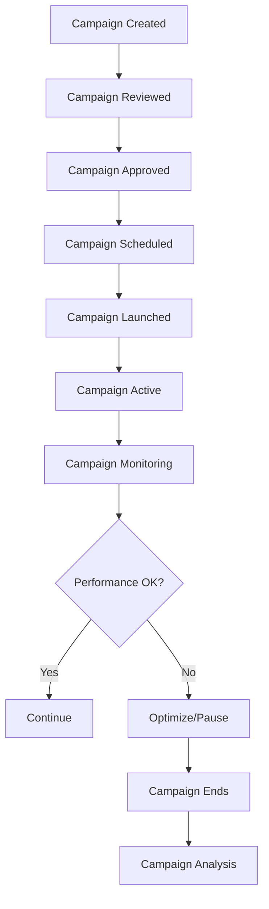

# Software Requirements Specification (SRS)

## Part 08D: Promotions & Campaigns

**Module:** Admin & Operations Module (Part 09)
**Version:** 1.0.0
**Status:** Final / For Review
**Date:** 2026-06-30

---

## Chapter 1 – Overview

### Purpose

The Promotions & Campaigns module defines the comprehensive capabilities for creating, managing, and optimizing promotional campaigns across the **[Platform Name]** platform. This encompasses campaign creation, promotion management, targeting, personalization, performance tracking, and optimization.

Promotions and campaigns are primary drivers of customer acquisition, retention, and revenue growth. Well-designed campaigns increase order frequency, attract new customers, reactivate dormant users, and promote merchant discovery. This module enables marketing and operations teams to design, execute, and measure promotional strategies effectively.

### Objectives

- Enable creation of diverse promotional campaigns
- Support targeted and personalized promotions
- Provide campaign scheduling and automation
- Enable A/B testing and optimization
- Track campaign performance and ROI
- Support multi-channel campaign delivery
- Provide campaign analytics and insights
- Enable self-service campaign management

---

## Chapter 2 – Campaign Types

### CAMP-001 Supported Campaign Types

| Type | Description | Priority |
| :--- | :--- | :--- |
| **Acquisition Campaign** | Attract new customers | **Required** |
| **Retention Campaign** | Retain existing customers | **Required** |
| **Reactivation Campaign** | Reactivate dormant customers | **Required** |
| **Cross-Sell Campaign** | Encourage additional purchases | **Required** |
| **Up-Sell Campaign** | Encourage higher-value purchases | **Required** |
| **Referral Campaign** | Encourage customer referrals | **Required** |
| **Seasonal Campaign** | Seasonal/holiday promotions | **Required** |
| **Merchant Campaign** | Promote specific merchants | **Required** |
| **Category Campaign** | Promote specific categories | **Required** |
| **Flash Sale** | Limited-time promotions | **Required** |

### CAMP-002 Campaign Objectives

| Objective | Description | Priority |
| :--- | :--- | :--- |
| **Increase Orders** | Drive order volume | **Required** |
| **Increase Revenue** | Drive revenue growth | **Required** |
| **Acquire Customers** | Attract new customers | **Required** |
| **Retain Customers** | Reduce churn | **Required** |
| **Increase AOV** | Increase average order value | **Required** |
| **Increase Frequency** | Increase order frequency | **Required** |
| **Promote Merchants** | Increase merchant visibility | **Required** |
| **Clear Inventory** | Clear excess inventory | **Required** |

---

## Chapter 3 – Campaign Structure

### CAMP-003 Campaign Components

| Component | Description | Priority |
| :--- | :--- | :--- |
| **Campaign Name** | Internal campaign identifier | **Required** |
| **Campaign Type** | Type of campaign | **Required** |
| **Campaign Objective** | Campaign goal | **Required** |
| **Target Audience** | Who to target | **Required** |
| **Promotion** | The offer/promotion | **Required** |
| **Budget** | Campaign budget | **Required** |
| **Schedule** | Campaign timing | **Required** |
| **Channels** | Delivery channels | **Required** |
| **Content** | Campaign creative | **Required** |
| **Analytics** | Performance tracking | **Required** |

### CAMP-004 Campaign Data Model

| Attribute | Type | Required | Description |
| :--- | :--- | :--- | :--- |
| `campaign_id` | UUID | Yes | Unique identifier |
| `campaign_name` | String | Yes | Internal name |
| `campaign_type` | String | Yes | ACQUISITION/RETENTION/REACTIVATION/CROSS_SELL/UP_SELL/REFERRAL/SEASONAL/MERCHANT/CATEGORY/FLASH_SALE |
| `campaign_objective` | String | Yes | ORDERS/REVENUE/ACQUISITION/RETENTION/AOV/FREQUENCY/PROMOTION/INVENTORY |
| `status` | String | Yes | DRAFT/SCHEDULED/ACTIVE/PAUSED/COMPLETED/CANCELLED |
| `promotion_id` | UUID | | Associated promotion |
| `budget` | Decimal | | Campaign budget |
| `budget_spent` | Decimal | | Budget spent |
| `target_audience` | JSONB | | Targeting criteria |
| `schedule` | JSONB | | Campaign schedule |
| `channels` | JSONB | | Delivery channels |
| `content` | JSONB | | Campaign content |
| `kpis` | JSONB | | KPI targets |
| `created_by` | UUID | | Creator identifier |
| `approved_by` | UUID | | Approver identifier |
| `created_at` | Timestamp | Yes | Creation timestamp |
| `updated_at` | Timestamp | Yes | Last update timestamp |

---

## Chapter 4 – Targeting & Personalization

### CAMP-005 Targeting Criteria

| Criteria | Description | Priority |
| :--- | :--- | :--- |
| **Location** | Geographic targeting | **Required** |
| **Demographics** | Age, gender, income | **Required** |
| **Behavior** | Order history, frequency | **Required** |
| **Preferences** | Cuisine, categories | **Required** |
| **Device** | Mobile, web, device type | **Required** |
| **Customer Segment** | New, active, dormant, VIP | **Required** |
| **Order History** | Past order behavior | **Required** |
| **Loyalty Tier** | Loyalty program tier | **Required** |
| **Referral Status** | Referral eligibility | **Required** |
| **Time** | Time of day, day of week | **Required** |

### CAMP-006 Customer Segments

| Segment | Description | Priority |
| :--- | :--- | :--- |
| **New Customers** | First-time customers | **Required** |
| **Active Customers** | Customers ordering regularly | **Required** |
| **Loyal Customers** | High-frequency customers | **Required** |
| **At-Risk Customers** | Decreasing order frequency | **Required** |
| **Dormant Customers** | No orders in 60+ days | **Required** |
| **High-Value Customers** | High spending customers | **Required** |
| **Low-Value Customers** | Low spending customers | **Required** |
| **Referral Customers** | Customers who refer others | **Required** |

### CAMP-007 Personalization

| Feature | Description | Priority |
| :--- | :--- | :--- |
| **Personalized Offers** | Offers based on customer behavior | **Required** |
| **Personalized Content** | Content tailored to customer | **Required** |
| **Dynamic Pricing** | Price based on customer segment | **Required** |
| **Personalized Recommendations** | Product recommendations | **Required** |
| **Personalized Timing** | Timing based on customer behavior | **Required** |

### CAMP-008 Targeting Data Model

| Column | Type | Constraints | Description |
| :--- | :--- | :--- | :--- |
| `target_id` | UUID | PRIMARY KEY | Unique identifier |
| `campaign_id` | UUID | FOREIGN KEY (campaigns.campaign_id) | Associated campaign |
| `segment_type` | VARCHAR(30) | NOT NULL | NEW/ACTIVE/LOYAL/AT_RISK/DORMANT/HIGH_VALUE/LOW_VALUE/REFERRAL |
| `location_ids` | TEXT[] | | Location targeting |
| `min_order_count` | INTEGER | | Minimum order count |
| `max_order_count` | INTEGER | | Maximum order count |
| `min_order_value` | DECIMAL(10, 2) | | Minimum order value |
| `max_order_value` | DECIMAL(10, 2) | | Maximum order value |
| `preferred_cuisines` | TEXT[] | | Cuisine preferences |
| `preferred_categories` | TEXT[] | | Category preferences |
| `device_type` | VARCHAR(20) | | ALL/MOBILE/WEB |
| `time_window` | JSONB | | Time of day window |
| `day_of_week` | INTEGER[] | | Days of week |
| `created_at` | TIMESTAMP | DEFAULT NOW() | Creation timestamp |
| `updated_at` | TIMESTAMP | DEFAULT NOW() | Last update timestamp |

---

## Chapter 5 – Campaign Execution

### CAMP-009 Execution Workflow

### CAMP-010 Campaign Statuses

| Status | Description | Priority |
| :--- | :--- | :--- |
| `DRAFT` | Campaign being created | **Required** |
| `REVIEW` | Campaign under review | **Required** |
| `SCHEDULED` | Campaign scheduled to launch | **Required** |
| `ACTIVE` | Campaign currently running | **Required** |
| `PAUSED` | Campaign temporarily paused | **Required** |
| `COMPLETED` | Campaign completed | **Required** |
| `CANCELLED` | Campaign cancelled | **Required** |

### CAMP-011 Campaign Delivery Channels

| Channel | Description | Priority |
| :--- | :--- | :--- |
| **Push Notification** | Mobile push notifications | **Required** |
| **Email** | Email campaigns | **Required** |
| **SMS** | SMS campaigns | **Required** |
| **In-App** | In-app banners and messages | **Required** |
| **App Homepage** | Homepage banners | **Required** |
| **Search Results** | Promoted search results | **Required** |
| **Category Pages** | Category page promotions | **Required** |
| **Checkout** | Check page offers | **Required** |
| **Web** | Web banners | **Required** |
| **Social Media** | Social media integration | **Medium** |

---

## Chapter 6 – A/B Testing

### CAMP-012 A/B Test Features

| Feature | Description | Priority |
| :--- | :--- | :--- |
| **Variant Creation** | Create test variants | **Required** |
| **Traffic Splitting** | Split traffic between variants | **Required** |
| **Success Metrics** | Define success metrics | **Required** |
| **Real-Time Monitoring** | Monitor test performance | **Required** |
| **Statistical Significance** | Statistical significance calculation | **Required** |
| **Winner Selection** | Auto-select winner | **Required** |
| **Rollout** | Rollout winning variant | **Required** |
| **History** | Test history and learnings | **Required** |

### CAMP-013 A/B Test Data Model

| Column | Type | Constraints | Description |
| :--- | :--- | :--- | :--- |
| `test_id` | UUID | PRIMARY KEY | Unique identifier |
| `campaign_id` | UUID | FOREIGN KEY (campaigns.campaign_id) | Associated campaign |
| `test_name` | VARCHAR(255) | NOT NULL | Test name |
| `variant_a` | JSONB | NOT NULL | Variant A configuration |
| `variant_b` | JSONB | NOT NULL | Variant B configuration |
| `traffic_split` | INTEGER | DEFAULT 50 | Traffic split percentage |
| `success_metric` | VARCHAR(30) | NOT NULL | CONVERSION/REVENUE/CTR/CLICKS/ORDERS |
| `status` | VARCHAR(20) | DEFAULT 'RUNNING' | RUNNING/COMPLETED/PAUSED |
| `winner` | VARCHAR(10) | | A/B/NONE |
| `confidence_level` | DECIMAL(5, 2) | | Confidence level |
| `start_date` | DATE | NOT NULL | Test start date |
| `end_date` | DATE | | Test end date |
| `created_at` | TIMESTAMP | DEFAULT NOW() | Creation timestamp |
| `updated_at` | TIMESTAMP | DEFAULT NOW() | Last update timestamp |

---

## Chapter 7 – Campaign Analytics

### CAMP-014 Campaign Metrics

| Metric | Description | Priority |
| :--- | :--- | :--- |
| **Impressions** | Number of impressions | **Required** |
| **Reach** | Unique users reached | **Required** |
| **Clicks** | Number of clicks | **Required** |
| **CTR** | Click-through rate | **Required** |
| **Conversions** | Number of conversions | **Required** |
| **Conversion Rate** | Conversion rate | **Required** |
| **Revenue** | Revenue generated | **Required** |
| **ROI** | Return on investment | **Required** |
| **CAC** | Customer acquisition cost | **Required** |
| **LTV** | Customer lifetime value | **Required** |
| **Orders** | Number of orders | **Required** |
| **AOV** | Average order value | **Required** |

### CAMP-015 Campaign Reports

| Report | Description | Frequency | Priority |
| :--- | :--- | :--- | :--- |
| **Campaign Summary** | Overall campaign performance | Daily | **Required** |
| **Channel Performance** | Performance by channel | Daily | **Required** |
| **Segment Performance** | Performance by segment | Daily | **Required** |
| **A/B Test Results** | A/B test results | Weekly | **Required** |
| **ROI Report** | ROI analysis | Weekly | **Required** |
| **Attribution Report** | Multi-touch attribution | Monthly | **Required** |
| **Cohort Report** | Customer cohort analysis | Monthly | **Required** |

### CAMP-016 Analytics Data Model

| Column | Type | Constraints | Description |
| :--- | :--- | :--- | :--- |
| `analytics_id` | UUID | PRIMARY KEY | Unique identifier |
| `campaign_id` | UUID | FOREIGN KEY (campaigns.campaign_id) | Associated campaign |
| `date` | DATE | NOT NULL | Analytics date |
| `impressions` | INTEGER | DEFAULT 0 | Impressions |
| `reach` | INTEGER | DEFAULT 0 | Unique users reached |
| `clicks` | INTEGER | DEFAULT 0 | Clicks |
| `ctr` | DECIMAL(5, 2) | | Click-through rate |
| `conversions` | INTEGER | DEFAULT 0 | Conversions |
| `conversion_rate` | DECIMAL(5, 2) | | Conversion rate |
| `revenue` | DECIMAL(10, 2) | | Revenue generated |
| `orders` | INTEGER | DEFAULT 0 | Number of orders |
| `aov` | DECIMAL(10, 2) | | Average order value |
| `cost` | DECIMAL(10, 2) | | Campaign cost |
| `roi` | DECIMAL(5, 2) | | Return on investment |
| `new_customers` | INTEGER | DEFAULT 0 | New customers acquired |
| `retained_customers` | INTEGER | DEFAULT 0 | Customers retained |
| `created_at` | TIMESTAMP | DEFAULT NOW() | Creation timestamp |
| `updated_at` | TIMESTAMP | DEFAULT NOW() | Last update timestamp |

---

## Chapter 8 – Database Tables

### campaigns

| Column | Type | Constraints | Description |
| :--- | :--- | :--- | :--- |
| `campaign_id` | UUID | PRIMARY KEY | Unique identifier |
| `campaign_name` | VARCHAR(255) | NOT NULL | Campaign name |
| `campaign_type` | VARCHAR(30) | NOT NULL | ACQUISITION/RETENTION/REACTIVATION/CROSS_SELL/UP_SELL/REFERRAL/SEASONAL/MERCHANT/CATEGORY/FLASH_SALE |
| `campaign_objective` | VARCHAR(30) | NOT NULL | ORDERS/REVENUE/ACQUISITION/RETENTION/AOV/FREQUENCY/PROMOTION/INVENTORY |
| `status` | VARCHAR(20) | DEFAULT 'DRAFT' | DRAFT/SCHEDULED/ACTIVE/PAUSED/COMPLETED/CANCELLED |
| `promotion_id` | UUID | | Associated promotion |
| `budget` | DECIMAL(10, 2) | | Campaign budget |
| `budget_spent` | DECIMAL(10, 2) | DEFAULT 0 | Budget spent |
| `target_audience` | JSONB | | Targeting criteria |
| `schedule` | JSONB | | Campaign schedule |
| `channels` | JSONB | | Delivery channels |
| `content` | JSONB | | Campaign content |
| `kpis` | JSONB | | KPI targets |
| `created_by` | UUID | | Creator identifier |
| `approved_by` | UUID | | Approver identifier |
| `approved_at` | TIMESTAMP | | Approval timestamp |
| `launched_at` | TIMESTAMP | | Launch timestamp |
| `ended_at` | TIMESTAMP | | End timestamp |
| `created_at` | TIMESTAMP | DEFAULT NOW() | Creation timestamp |
| `updated_at` | TIMESTAMP | DEFAULT NOW() | Last update timestamp |

### campaign_targeting

| Column | Type | Constraints | Description |
| :--- | :--- | :--- | :--- |
| `target_id` | UUID | PRIMARY KEY | Unique identifier |
| `campaign_id` | UUID | FOREIGN KEY (campaigns.campaign_id) | Associated campaign |
| `segment_type` | VARCHAR(30) | NOT NULL | NEW/ACTIVE/LOYAL/AT_RISK/DORMANT/HIGH_VALUE/LOW_VALUE/REFERRAL |
| `location_ids` | TEXT[] | | Location targeting |
| `min_order_count` | INTEGER | | Minimum order count |
| `max_order_count` | INTEGER | | Maximum order count |
| `min_order_value` | DECIMAL(10, 2) | | Minimum order value |
| `max_order_value` | DECIMAL(10, 2) | | Maximum order value |
| `preferred_cuisines` | TEXT[] | | Cuisine preferences |
| `preferred_categories` | TEXT[] | | Category preferences |
| `device_type` | VARCHAR(20) | | ALL/MOBILE/WEB |
| `time_window` | JSONB | | Time of day window |
| `day_of_week` | INTEGER[] | | Days of week |
| `created_at` | TIMESTAMP | DEFAULT NOW() | Creation timestamp |
| `updated_at` | TIMESTAMP | DEFAULT NOW() | Last update timestamp |

### campaign_analytics

| Column | Type | Constraints | Description |
| :--- | :--- | :--- | :--- |
| `analytics_id` | UUID | PRIMARY KEY | Unique identifier |
| `campaign_id` | UUID | FOREIGN KEY (campaigns.campaign_id) | Associated campaign |
| `date` | DATE | NOT NULL | Analytics date |
| `impressions` | INTEGER | DEFAULT 0 | Impressions |
| `reach` | INTEGER | DEFAULT 0 | Unique users reached |
| `clicks` | INTEGER | DEFAULT 0 | Clicks |
| `ctr` | DECIMAL(5, 2) | | Click-through rate |
| `conversions` | INTEGER | DEFAULT 0 | Conversions |
| `conversion_rate` | DECIMAL(5, 2) | | Conversion rate |
| `revenue` | DECIMAL(10, 2) | | Revenue generated |
| `orders` | INTEGER | DEFAULT 0 | Number of orders |
| `aov` | DECIMAL(10, 2) | | Average order value |
| `cost` | DECIMAL(10, 2) | | Campaign cost |
| `roi` | DECIMAL(5, 2) | | Return on investment |
| `new_customers` | INTEGER | DEFAULT 0 | New customers |
| `retained_customers` | INTEGER | DEFAULT 0 | Customers retained |
| `created_at` | TIMESTAMP | DEFAULT NOW() | Creation timestamp |
| `updated_at` | TIMESTAMP | DEFAULT NOW() | Last update timestamp |

### ab_tests

| Column | Type | Constraints | Description |
| :--- | :--- | :--- | :--- |
| `test_id` | UUID | PRIMARY KEY | Unique identifier |
| `campaign_id` | UUID | FOREIGN KEY (campaigns.campaign_id) | Associated campaign |
| `test_name` | VARCHAR(255) | NOT NULL | Test name |
| `variant_a` | JSONB | NOT NULL | Variant A configuration |
| `variant_b` | JSONB | NOT NULL | Variant B configuration |
| `traffic_split` | INTEGER | DEFAULT 50 | Traffic split percentage |
| `success_metric` | VARCHAR(30) | NOT NULL | CONVERSION/REVENUE/CTR/CLICKS/ORDERS |
| `status` | VARCHAR(20) | DEFAULT 'RUNNING' | RUNNING/COMPLETED/PAUSED |
| `winner` | VARCHAR(10) | | A/B/NONE |
| `confidence_level` | DECIMAL(5, 2) | | Confidence level |
| `start_date` | DATE | NOT NULL | Test start date |
| `end_date` | DATE | | Test end date |
| `created_at` | TIMESTAMP | DEFAULT NOW() | Creation timestamp |
| `updated_at` | TIMESTAMP | DEFAULT NOW() | Last update timestamp |

### campaign_schedules

| Column | Type | Constraints | Description |
| :--- | :--- | :--- | :--- |
| `schedule_id` | UUID | PRIMARY KEY | Unique identifier |
| `campaign_id` | UUID | FOREIGN KEY (campaigns.campaign_id) | Associated campaign |
| `start_date` | DATE | NOT NULL | Start date |
| `end_date` | DATE | NOT NULL | End date |
| `start_time` | TIME | | Start time (if time-specific) |
| `end_time` | TIME | | End time (if time-specific) |
| `is_recurring` | BOOLEAN | DEFAULT FALSE | Recurring schedule |
| `recurrence_pattern` | VARCHAR(50) | | DAILY/WEEKLY/MONTHLY |
| `recurrence_end_date` | DATE | | Recurrence end date |
| `created_at` | TIMESTAMP | DEFAULT NOW() | Creation timestamp |
| `updated_at` | TIMESTAMP | DEFAULT NOW() | Last update timestamp |

---

## Chapter 9 – REST APIs

### Campaign APIs

| Method | Endpoint | Description |
| :--- | :--- | :--- |
| `GET` | `/api/v1/admin/campaigns` | List campaigns |
| `GET` | `/api/v1/admin/campaigns/{id}` | Get campaign details |
| `POST` | `/api/v1/admin/campaigns` | Create campaign |
| `PUT` | `/api/v1/admin/campaigns/{id}` | Update campaign |
| `DELETE` | `/api/v1/admin/campaigns/{id}` | Delete campaign |
| `POST` | `/api/v1/admin/campaigns/{id}/approve` | Approve campaign |
| `POST` | `/api/v1/admin/campaigns/{id}/launch` | Launch campaign |
| `POST` | `/api/v1/admin/campaigns/{id}/pause` | Pause campaign |
| `POST` | `/api/v1/admin/campaigns/{id}/resume` | Resume campaign |
| `POST` | `/api/v1/admin/campaigns/{id}/end` | End campaign |

### Targeting APIs

| Method | Endpoint | Description |
| :--- | :--- | :--- |
| `GET` | `/api/v1/admin/campaigns/{id}/targeting` | Get campaign targeting |
| `PUT` | `/api/v1/admin/campaigns/{id}/targeting` | Update campaign targeting |
| `GET` | `/api/v1/admin/segments` | Get customer segments |
| `GET` | `/api/v1/admin/segments/{id}/size` | Get segment size |

### A/B Test APIs

| Method | Endpoint | Description |
| :--- | :--- | :--- |
| `GET` | `/api/v1/admin/campaigns/{id}/ab-tests` | List A/B tests |
| `POST` | `/api/v1/admin/campaigns/{id}/ab-tests` | Create A/B test |
| `GET` | `/api/v1/admin/campaigns/{id}/ab-tests/{id}` | Get A/B test details |
| `PUT` | `/api/v1/admin/campaigns/{id}/ab-tests/{id}` | Update A/B test |
| `POST` | `/api/v1/admin/campaigns/{id}/ab-tests/{id}/complete` | Complete A/B test |
| `GET` | `/api/v1/admin/campaigns/{id}/ab-tests/{id}/results` | Get A/B test results |

### Analytics APIs

| Method | Endpoint | Description |
| :--- | :--- | :--- |
| `GET` | `/api/v1/admin/campaigns/{id}/analytics` | Get campaign analytics |
| `GET` | `/api/v1/admin/campaigns/analytics/dashboard` | Get analytics dashboard |
| `GET` | `/api/v1/admin/campaigns/analytics/reports` | Get campaign reports |

---

## Chapter 10 – Business Rules

| Rule ID | Rule Description | Priority |
| :--- | :--- | :--- |
| **BR-CAMP-001** | Campaigns must have a valid promotion. | **High** |
| **BR-CAMP-002** | Campaigns must have a defined target audience. | **High** |
| **BR-CAMP-003** | Campaigns must have start and end dates. | **High** |
| **BR-CAMP-004** | Campaign budget cannot exceed available funds. | **High** |
| **BR-CAMP-005** | Campaigns must be approved before launch. | **High** |
| **BR-CAMP-006** | A/B tests must have statistically significant sample sizes. | **High** |
| **BR-CAMP-007** | Campaigns cannot overlap on same target audience. | **High** |
| **BR-CAMP-008** | Campaign analytics must be updated daily. | **High** |
| **BR-CAMP-009** | Campaign ROI must be calculated after completion. | **High** |
| **BR-CAMP-010** | Campaign data retained for 3 years. | **High** |

---

## Chapter 11 – Acceptance Tests

| Test ID | Test Description | Priority |
| :--- | :--- | :--- |
| **TEST-CAMP-001** | Admin creates new campaign. | **High** |
| **TEST-CAMP-002** | Admin updates campaign. | **High** |
| **TEST-CAMP-003** | Admin approves campaign. | **High** |
| **TEST-CAMP-004** | Admin launches campaign. | **High** |
| **TEST-CAMP-005** | Admin pauses campaign. | **High** |
| **TEST-CAMP-006** | Admin resumes paused campaign. | **High** |
| **TEST-CAMP-007** | Admin ends campaign. | **High** |
| **TEST-CAMP-008** | Admin deletes campaign. | **High** |
| **TEST-CAMP-009** | Campaign targeting applies correctly. | **High** |
| **TEST-CAMP-010** | Campaign promotion applies correctly. | **High** |
| **TEST-CAMP-011** | Campaign budget tracking works. | **High** |
| **TEST-CAMP-012** | Campaign budget exhausted triggers alert. | **High** |
| **TEST-CAMP-013** | Admin creates A/B test. | **High** |
| **TEST-CAMP-014** | A/B test traffic split works. | **High** |
| **TEST-CAMP-015** | A/B test winner selected correctly. | **High** |
| **TEST-CAMP-016** | Campaign analytics dashboard displays. | **High** |
| **TEST-CAMP-017** | Campaign metrics tracked correctly. | **High** |
| **TEST-CAMP-018** | Campaign ROI calculated correctly. | **High** |
| **TEST-CAMP-019** | Campaign report generated. | **High** |
| **TEST-CAMP-020** | Campaign report exported. | **High** |
| **TEST-CAMP-021** | Campaign segmentation applied correctly. | **High** |
| **TEST-CAMP-022** | Campaign personalization works. | **High** |
| **TEST-CAMP-023** | Multi-channel campaign delivery works. | **High** |
| **TEST-CAMP-024** | Campaign attribution works. | **High** |
| **TEST-CAMP-025** | Customer receives campaign notification. | **High** |

---

## Chapter 12 – Traceability Matrix

| Requirement | Database Table | API Endpoint(s) | Acceptance Test |
| :--- | :--- | :--- | :--- |
| CAMP-003 | campaigns | POST /api/v1/admin/campaigns | TEST-CAMP-001 |
| CAMP-004 | campaigns | PUT /api/v1/admin/campaigns/{id} | TEST-CAMP-002 |
| CAMP-009 | campaigns | POST /api/v1/admin/campaigns/{id}/approve | TEST-CAMP-003 |
| CAMP-009 | campaigns | POST /api/v1/admin/campaigns/{id}/launch | TEST-CAMP-004 |
| CAMP-009 | campaigns | POST /api/v1/admin/campaigns/{id}/pause | TEST-CAMP-005 |
| CAMP-009 | campaigns | POST /api/v1/admin/campaigns/{id}/resume | TEST-CAMP-006 |
| CAMP-009 | campaigns | POST /api/v1/admin/campaigns/{id}/end | TEST-CAMP-007 |
| CAMP-003 | campaigns | DELETE /api/v1/admin/campaigns/{id} | TEST-CAMP-008 |
| CAMP-005 | campaign_targeting | GET /api/v1/admin/campaigns/{id}/targeting | TEST-CAMP-009 |
| CAMP-003 | campaigns | GET /api/v1/admin/campaigns/{id} | TEST-CAMP-010, TEST-CAMP-011, TEST-CAMP-012 |
| CAMP-012 | ab_tests | POST /api/v1/admin/campaigns/{id}/ab-tests | TEST-CAMP-013 |
| CAMP-012 | ab_tests | GET /api/v1/admin/campaigns/{id}/ab-tests/{id}/results | TEST-CAMP-014, TEST-CAMP-015 |
| CAMP-014 | campaign_analytics | GET /api/v1/admin/campaigns/{id}/analytics | TEST-CAMP-016, TEST-CAMP-017 |
| CAMP-014 | campaign_analytics | GET /api/v1/admin/campaigns/analytics/dashboard | TEST-CAMP-018 |
| CAMP-015 | campaign_analytics | GET /api/v1/admin/campaigns/analytics/reports | TEST-CAMP-019, TEST-CAMP-020 |
| CAMP-006 | campaign_targeting | GET /api/v1/admin/segments | TEST-CAMP-021 |
| CAMP-007 | campaigns | GET /api/v1/admin/campaigns/{id} | TEST-CAMP-022 |

---

## Chapter 13 – Summary

This document establishes the complete promotions and campaigns capability for the **[Platform Name]** platform. Key takeaways:

- **Diverse Campaign Types:** Acquisition, retention, reactivation, cross-sell, up-sell, referral, seasonal, merchant, category, and flash sale campaigns.
- **Targeted Delivery:** Multi-dimensional targeting by location, behavior, demographics, preferences, device, customer segment, and time.
- **Campaign Lifecycle:** Draft → Review → Scheduled → Active → Paused → Completed/Cancelled with approval workflow.
- **A/B Testing:** Variant testing with traffic splitting, success metrics, statistical significance, and winner selection.
- **Multi-Channel Delivery:** Push, email, SMS, in-app, web, homepage, search results, category pages, and checkout.
- **Comprehensive Analytics:** Impressions, reach, clicks, CTR, conversions, conversion rate, revenue, ROI, CAC, LTV, orders, and AOV.
- **Budget Management:** Budget tracking, spent monitoring, and alerting.
- **Personalization:** Personalized offers, content, pricing, recommendations, and timing.

The promotions and campaigns module enables marketing and operations teams to drive customer acquisition, retention, and revenue growth through targeted, data-driven campaigns.

---

**Next Document:**

`Part_08E_Customer_Support_Ticketing.md`

*(This builds on promotions to define customer support ticketing capabilities.)*
