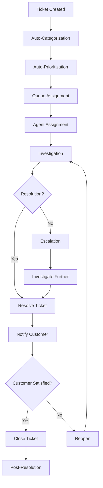

# Software Requirements Specification (SRS)

## Part 08E: Customer Support Ticketing

**Module:** Admin & Operations Module (Part 09)
**Version:** 1.0.0
**Status:** Final / For Review
**Date:** 2026-06-30

---

## Chapter 1 – Overview

### Purpose

The Customer Support Ticketing module defines the comprehensive support ticket management system for the **[Platform Name]** platform. This encompasses ticket creation, assignment, categorization, prioritization, resolution workflows, customer communication, escalation, and reporting.

Customer support is the primary mechanism for resolving customer issues and maintaining trust. A well-designed support ticketing system enables efficient issue resolution, consistent service quality, and customer satisfaction. This module ensures that support teams can effectively manage, track, and resolve customer issues across all channels.

### Objectives

- Enable efficient ticket creation and management
- Support multiple communication channels (email, chat, phone, social)
- Provide ticket categorization and prioritization
- Enable ticket assignment and escalation workflows
- Support customer self-service and knowledge base
- Track SLAs and resolution times
- Provide support analytics and reporting
- Enable continuous improvement of support quality

---

## Chapter 2 – Ticketing Framework

### SUPPORT-001 Ticket Types

| Type | Description | Priority |
| :--- | :--- | :--- |
| **Order Issue** | Problem with an order | **Required** |
| **Payment Issue** | Problem with payment | **Required** |
| **Delivery Issue** | Problem with delivery | **Required** |
| **Merchant Issue** | Problem with a merchant | **Required** |
| **Driver Issue** | Problem with a driver | **Required** |
| **Account Issue** | Problem with customer account | **Required** |
| **Technical Issue** | Technical problem with the platform | **Required** |
| **Feedback** | General feedback | **Required** |
| **Complaint** | Formal complaint | **Required** |
| **Refund Request** | Request for refund | **Required** |

### SUPPORT-002 Ticket Channels

| Channel | Description | Priority |
| :--- | :--- | :--- |
| **In-App Chat** | Real-time chat within app | **Required** |
| **Email** | Email support | **Required** |
| **Phone** | Phone support | **Required** |
| **Social Media** | Social media support | **Required** |
| **Help Center** | Self-service help center | **Required** |
| **Contact Form** | Web contact form | **Required** |
| **WhatsApp** | WhatsApp messaging | **Medium** |

### SUPPORT-003 Ticket Priorities

| Priority | Description | Response SLA | Resolution SLA | Priority |
| :--- | :--- | :--- | :--- | :--- |
| **Critical** | Service outage, safety issue | < 5 min | < 30 min | **Required** |
| **High** | Urgent customer issue | < 15 min | < 1 hour | **Required** |
| **Medium** | Standard issue | < 1 hour | < 4 hours | **Required** |
| **Low** | Non-urgent issue | < 4 hours | < 24 hours | **Required** |

### SUPPORT-004 Ticket Statuses

| Status | Description | Priority |
| :--- | :--- | :--- |
| `OPEN` | Ticket created, awaiting response | **Required** |
| `IN_PROGRESS` | Ticket being worked on | **Required** |
| `RESOLVED` | Ticket resolved | **Required** |
| `CLOSED` | Ticket closed | **Required** |
| `ESCALATED` | Ticket escalated | **Required** |
| `ON_HOLD` | Ticket on hold waiting for information | **Required** |
| `REOPENED` | Ticket reopened after resolution | **Required** |

---

## Chapter 3 – Ticket Lifecycle

### SUPPORT-005 Ticket Lifecycle Flow

### SUPPORT-006 Ticket Creation

| Method | Description | Priority |
| :--- | :--- | :--- |
| **Customer Self-Service** | Customer creates ticket via app/web | **Required** |
| **Agent Creation** | Support agent creates ticket | **Required** |
| **Chat Escalation** | Chat escalates to ticket | **Required** |
| **Email Escalation** | Email escalates to ticket | **Required** |
| **Social Escalation** | Social media escalates to ticket | **Required** |
| **Phone Escalation** | Phone call escalates to ticket | **Required** |
| **System Auto-Creation** | System auto-creates ticket | **Required** |

### SUPPORT-007 Ticket Data Model

| Attribute | Type | Required | Description |
| :--- | :--- | :--- | :--- |
| `ticket_id` | UUID | Yes | Unique identifier |
| `ticket_number` | String | Yes | Human-readable ticket number |
| `customer_id` | UUID | Yes | Associated customer |
| `order_id` | UUID | | Associated order |
| `ticket_type` | String | Yes | ORDER/PAYMENT/DELIVERY/MERCHANT/DRIVER/ACCOUNT/TECHNICAL/FEEDBACK/COMPLAINT/REFUND |
| `priority` | String | Yes | CRITICAL/HIGH/MEDIUM/LOW |
| `status` | String | Yes | OPEN/IN_PROGRESS/RESOLVED/CLOSED/ESCALATED/ON_HOLD/REOPENED |
| `subject` | String | Yes | Ticket subject |
| `description` | Text | Yes | Ticket description |
| `assigned_to` | UUID | | Assigned agent |
| `assigned_queue` | UUID | | Assigned queue |
| `created_by` | UUID | | Creator identifier |
| `resolved_by` | UUID | | Resolver identifier |
| `closed_by` | UUID | | Closer identifier |
| `resolution` | Text | | Resolution description |
| `satisfaction_score` | Integer | | Customer satisfaction score (1-5) |
| `satisfaction_comment` | Text | | Satisfaction comment |
| `created_at` | Timestamp | Yes | Creation timestamp |
| `updated_at` | Timestamp | Yes | Last update timestamp |
| `resolved_at` | Timestamp | | Resolution timestamp |
| `closed_at` | Timestamp | | Closure timestamp |

---

## Chapter 4 – Ticket Management

### SUPPORT-008 Ticket Assignment

| Feature | Description | Priority |
| :--- | :--- | :--- |
| **Auto-Assignment** | Auto-assign based on ticket type and agent availability | **Required** |
| **Manual Assignment** | Agent manually assigned | **Required** |
| **Queue Assignment** | Ticket assigned to queue | **Required** |
| **Round-Robin** | Round-robin assignment | **Required** |
| **Skill-Based** | Assignment based on agent skills | **Required** |
| **Reassignment** | Reassign ticket to another agent | **Required** |

### SUPPORT-009 Ticket Categorization

| Category | Sub-Categories | Priority |
| :--- | :--- | :--- |
| **Order Issue** | Missing items, Wrong items, Damaged items, Order not received, Late order, Order cancelled incorrectly | **Required** |
| **Payment Issue** | Payment failed, Charge declined, Incorrect amount, Duplicate charge, Refund delay | **Required** |
| **Delivery Issue** | Driver no-show, Late delivery, Wrong address, Delivery to wrong location, Missing delivery | **Required** |
| **Merchant Issue** | Merchant closed, Merchant refused order, Merchant quality issue, Menu discrepancy | **Required** |
| **Driver Issue** | Driver behavior, Safety concern, Incorrect driver, Driver unprofessional | **Required** |
| **Account Issue** | Login issue, Account locked, Password reset, Profile update, Account deletion | **Required** |
| **Technical Issue** | App crash, Website error, Payment gateway error, Notification issue | **Required** |

### SUPPORT-010 Ticket Escalation

| Escalation Level | Description | Priority |
| :--- | :--- | :--- |
| **Level 1** | First-line agent | **Required** |
| **Level 2** | Senior agent/Team lead | **Required** |
| **Level 3** | Supervisor/Manager | **Required** |
| **Level 4** | Director/Executive | **Required** |

### SUPPORT-011 Escalation Triggers

| Trigger | Action | Priority |
| :--- | :--- | :--- |
| **Critical Ticket** | Immediate escalation to Level 2+ | **Required** |
| **High Ticket with No Response** | Escalate after 1 hour | **Required** |
| **Medium Ticket with No Response** | Escalate after 4 hours | **Required** |
| **Customer Not Satisfied** | Escalate to Level 2 | **Required** |
| **Multiple Complaints** | Escalate to Level 3 | **Required** |

---

## Chapter 5 – Customer Communication

### SUPPORT-012 Communication Channels

| Channel | Description | Priority |
| :--- | :--- | :--- |
| **In-App Chat** | Real-time chat | **Required** |
| **Email** | Email communication | **Required** |
| **Phone** | Phone support | **Required** |
| **Social Media** | Social media support | **Required** |
| **In-App Notifications** | Push notifications | **Required** |
| **SMS** | SMS notifications | **Required** |

### SUPPORT-013 Auto-Responses

| Event | Auto-Response | Priority |
| :--- | :--- | :--- |
| **Ticket Created** | Acknowledgment and ticket number | **Required** |
| **Ticket Assigned** | Agent assignment notification | **Required** |
| **Ticket Resolved** | Resolution notification | **Required** |
| **Ticket Closed** | Closure confirmation | **Required** |
| **Escalation** | Escalation notification | **Required** |
| **SLA Breach** | SLA breach warning | **Required** |

### SUPPORT-014 Message Templates

| Template Type | Use Case | Priority |
| :--- | :--- | :--- |
| **Acknowledgement** | Initial ticket response | **Required** |
| **Resolution** | Ticket resolution notification | **Required** |
| **Update** | Status update | **Required** |
| **Escalation** | Escalation notification | **Required** |
| **Satisfaction Survey** | Post-resolution survey | **Required** |
| **Reopening** | Ticket reopened notification | **Required** |

---

## Chapter 6 – Knowledge Base

### SUPPORT-015 Knowledge Base Features

| Feature | Description | Priority |
| :--- | :--- | :--- |
| **Search** | Search for articles | **Required** |
| **Categories** | Article categorization | **Required** |
| **Articles** | Written support articles | **Required** |
| **FAQs** | Frequently asked questions | **Required** |
| **Tutorials** | Step-by-step tutorials | **Required** |
| **Videos** | Video tutorials | **Required** |
| **Self-Service** | Customer self-service | **Required** |
| **Article Versioning** | Article version history | **Required** |

### SUPPORT-016 Article Data Model

| Attribute | Type | Required | Description |
| :--- | :--- | :--- | :--- |
| `article_id` | UUID | Yes | Unique identifier |
| `title` | String | Yes | Article title |
| `content` | Text | Yes | Article content |
| `category` | String | Yes | Article category |
| `tags` | TEXT[] | | Search tags |
| `status` | String | Yes | DRAFT/PUBLISHED/ARCHIVED |
| `views` | INTEGER | | Number of views |
| `helpful_count` | INTEGER | | Number of helpful ratings |
| `unhelpful_count` | INTEGER | | Number of unhelpful ratings |
| `created_by` | UUID | | Creator identifier |
| `updated_by` | UUID | | Last updater |
| `published_at` | TIMESTAMP | | Publication timestamp |
| `created_at` | TIMESTAMP | Yes | Creation timestamp |
| `updated_at` | TIMESTAMP | Yes | Last update timestamp |

---

## Chapter 7 – SLA Management

### SUPPORT-017 SLA Definitions

| Priority | Response SLA | Resolution SLA | Priority |
| :--- | :--- | :--- | :--- |
| **Critical** | 5 minutes | 30 minutes | **Required** |
| **High** | 15 minutes | 1 hour | **Required** |
| **Medium** | 1 hour | 4 hours | **Required** |
| **Low** | 4 hours | 24 hours | **Required** |

### SUPPORT-018 SLA Breach Handling

| Event | Action | Priority |
| :--- | :--- | :--- |
| **Response SLA Breach** | Escalate to supervisor | **Required** |
| **Resolution SLA Breach** | Escalate to manager | **Required** |
| **Multiple Breaches** | Escalate to director | **Required** |
| **Customer Alert** | Notify customer of delay | **Required** |

### SUPPORT-019 SLA Data Model

| Column | Type | Constraints | Description |
| :--- | :--- | :--- | :--- |
| `sla_id` | UUID | PRIMARY KEY | Unique identifier |
| `ticket_id` | UUID | FOREIGN KEY (tickets.ticket_id) | Associated ticket |
| `priority` | VARCHAR(20) | NOT NULL | CRITICAL/HIGH/MEDIUM/LOW |
| `response_sla_target` | TIMESTAMP | | Response SLA target time |
| `resolution_sla_target` | TIMESTAMP | | Resolution SLA target time |
| `response_time` | INTEGER | | Actual response time (minutes) |
| `resolution_time` | INTEGER | | Actual resolution time (minutes) |
| `response_sla_breached` | BOOLEAN | | Response SLA breached |
| `resolution_sla_breached` | BOOLEAN | | Resolution SLA breached |
| `created_at` | TIMESTAMP | DEFAULT NOW() | Creation timestamp |
| `updated_at` | TIMESTAMP | DEFAULT NOW() | Last update timestamp |

---

## Chapter 8 – Support Analytics

### SUPPORT-020 Support Metrics

| Metric | Description | Priority |
| :--- | :--- | :--- |
| **Ticket Volume** | Number of tickets created | **Required** |
| **Resolution Time** | Average time to resolve | **Required** |
| **Response Time** | Average time to first response | **Required** |
| **SLA Adherence** | % of tickets within SLA | **Required** |
| **Customer Satisfaction** | Average satisfaction score | **Required** |
| **CSAT Rate** | % of satisfied customers | **Required** |
| **First Contact Resolution** | % resolved on first contact | **Required** |
| **Ticket Backlog** | Number of open tickets | **Required** |
| **Agent Performance** | Tickets per agent, resolution time | **Required** |
| **Escalation Rate** | % of tickets escalated | **Required** |

### SUPPORT-021 Support Reports

| Report | Description | Frequency | Priority |
| :--- | :--- | :--- | :--- |
| **Daily Support Summary** | Daily support metrics | Daily | **Required** |
| **Weekly Performance** | Weekly agent performance | Weekly | **Required** |
| **Monthly Analytics** | Monthly support analytics | Monthly | **Required** |
| **SLA Report** | SLA adherence report | Weekly | **Required** |
| **CSAT Report** | Customer satisfaction report | Weekly | **Required** |
| **Escalation Report** | Escalation analysis | Weekly | **Required** |
| **Top Issues** | Most common issue types | Monthly | **Required** |

---

## Chapter 9 – Database Tables

### support_tickets

| Column | Type | Constraints | Description |
| :--- | :--- | :--- | :--- |
| `ticket_id` | UUID | PRIMARY KEY | Unique identifier |
| `ticket_number` | VARCHAR(20) | UNIQUE | Human-readable ticket number |
| `customer_id` | UUID | FOREIGN KEY (customers.customer_id) | Associated customer |
| `order_id` | UUID | FOREIGN KEY (orders.order_id) | Associated order |
| `ticket_type` | VARCHAR(30) | NOT NULL | ORDER/PAYMENT/DELIVERY/MERCHANT/DRIVER/ACCOUNT/TECHNICAL/FEEDBACK/COMPLAINT/REFUND |
| `priority` | VARCHAR(20) | NOT NULL | CRITICAL/HIGH/MEDIUM/LOW |
| `status` | VARCHAR(20) | DEFAULT 'OPEN' | OPEN/IN_PROGRESS/RESOLVED/CLOSED/ESCALATED/ON_HOLD/REOPENED |
| `subject` | VARCHAR(255) | NOT NULL | Ticket subject |
| `description` | TEXT | NOT NULL | Ticket description |
| `assigned_to` | UUID | | Assigned agent |
| `assigned_queue` | UUID | | Assigned queue |
| `created_by` | UUID | | Creator identifier |
| `resolved_by` | UUID | | Resolver identifier |
| `closed_by` | UUID` | | Closer identifier |
| `resolution` | TEXT | | Resolution description |
| `satisfaction_score` | INTEGER | | Satisfaction score (1-5) |
| `satisfaction_comment` | TEXT | | Satisfaction comment |
| `created_at` | TIMESTAMP | DEFAULT NOW() | Creation timestamp |
| `updated_at` | TIMESTAMP | DEFAULT NOW() | Last update timestamp |
| `resolved_at` | TIMESTAMP | | Resolution timestamp |
| `closed_at` | TIMESTAMP | | Closure timestamp |

### support_messages

| Column | Type | Constraints | Description |
| :--- | :--- | :--- | :--- |
| `message_id` | UUID | PRIMARY KEY | Unique identifier |
| `ticket_id` | UUID | FOREIGN KEY (support_tickets.ticket_id) | Associated ticket |
| `sender_type` | VARCHAR(20) | NOT NULL | CUSTOMER/AGENT/SYSTEM |
| `sender_id` | UUID | | Sender identifier |
| `message_type` | VARCHAR(20) | NOT NULL | TEXT/IMAGE/ATTACHMENT |
| `message_content` | TEXT | NOT NULL | Message content |
| `attachment_url` | VARCHAR(500) | | Attachment URL |
| `is_internal` | BOOLEAN | DEFAULT FALSE | Internal note flag |
| `created_at` | TIMESTAMP | DEFAULT NOW() | Message timestamp |

### support_queues

| Column | Type | Constraints | Description |
| :--- | :--- | :--- | :--- |
| `queue_id` | UUID | PRIMARY KEY | Unique identifier |
| `queue_name` | VARCHAR(100) | NOT NULL | Queue name |
| `queue_type` | VARCHAR(30) | NOT NULL | GENERAL/ORDER/PAYMENT/DELIVERY/TECHNICAL/ESCALATION |
| `description` | TEXT | | Queue description |
| `agent_ids` | TEXT[] | | Assigned agents |
| `is_active` | BOOLEAN | DEFAULT TRUE | Active status |
| `created_at` | TIMESTAMP | DEFAULT NOW() | Creation timestamp |
| `updated_at` | TIMESTAMP | DEFAULT NOW() | Last update timestamp |

### support_knowledge_base

| Column | Type | Constraints | Description |
| :--- | :--- | :--- | :--- |
| `article_id` | UUID | PRIMARY KEY | Unique identifier |
| `title` | VARCHAR(255) | NOT NULL | Article title |
| `content` | TEXT | NOT NULL | Article content |
| `category` | VARCHAR(100) | NOT NULL | Article category |
| `tags` | TEXT[] | | Search tags |
| `status` | VARCHAR(20) | DEFAULT 'DRAFT' | DRAFT/PUBLISHED/ARCHIVED |
| `views` | INTEGER | DEFAULT 0 | Number of views |
| `helpful_count` | INTEGER | DEFAULT 0 | Helpful ratings |
| `unhelpful_count` | INTEGER | DEFAULT 0 | Unhelpful ratings |
| `created_by` | UUID | | Creator identifier |
| `updated_by` | UUID | | Last updater |
| `published_at` | TIMESTAMP | | Publication timestamp |
| `created_at` | TIMESTAMP | DEFAULT NOW() | Creation timestamp |
| `updated_at` | TIMESTAMP | DEFAULT NOW() | Last update timestamp |

### support_sla

| Column | Type | Constraints | Description |
| :--- | :--- | :--- | :--- |
| `sla_id` | UUID | PRIMARY KEY | Unique identifier |
| `ticket_id` | UUID | FOREIGN KEY (support_tickets.ticket_id) | Associated ticket |
| `priority` | VARCHAR(20) | NOT NULL | CRITICAL/HIGH/MEDIUM/LOW |
| `response_sla_target` | TIMESTAMP | | Response SLA target |
| `resolution_sla_target` | TIMESTAMP | | Resolution SLA target |
| `response_time` | INTEGER | | Actual response time (minutes) |
| `resolution_time` | INTEGER | | Actual resolution time (minutes) |
| `response_sla_breached` | BOOLEAN | DEFAULT FALSE | Response SLA breached |
| `resolution_sla_breached` | BOOLEAN | DEFAULT FALSE | Resolution SLA breached |
| `created_at` | TIMESTAMP | DEFAULT NOW() | Creation timestamp |
| `updated_at` | TIMESTAMP | DEFAULT NOW() | Last update timestamp |

### support_satisfaction

| Column | Type | Constraints | Description |
| :--- | :--- | :--- | :--- |
| `survey_id` | UUID | PRIMARY KEY | Unique identifier |
| `ticket_id` | UUID | FOREIGN KEY (support_tickets.ticket_id) | Associated ticket |
| `customer_id` | UUID | FOREIGN KEY (customers.customer_id) | Associated customer |
| `score` | INTEGER | CHECK (1-5) | Satisfaction score |
| `comment` | TEXT | | Satisfaction comment |
| `categories` | JSONB | | Category ratings |
| `sent_at` | TIMESTAMP | | Survey sent timestamp |
| `responded_at` | TIMESTAMP | | Response timestamp |
| `created_at` | TIMESTAMP | DEFAULT NOW() | Creation timestamp |

---

## Chapter 10 – REST APIs

### Ticket APIs

| Method | Endpoint | Description |
| :--- | :--- | :--- |
| `POST` | `/api/v1/support/tickets` | Create ticket |
| `GET` | `/api/v1/support/tickets` | List tickets |
| `GET` | `/api/v1/support/tickets/{id}` | Get ticket details |
| `GET` | `/api/v1/support/tickets/{id}/messages` | Get ticket messages |
| `POST` | `/api/v1/support/tickets/{id}/messages` | Add message |
| `PUT` | `/api/v1/support/tickets/{id}` | Update ticket |
| `PUT` | `/api/v1/support/tickets/{id}/assign` | Assign ticket |
| `PUT` | `/api/v1/support/tickets/{id}/resolve` | Resolve ticket |
| `PUT` | `/api/v1/support/tickets/{id}/close` | Close ticket |
| `PUT` | `/api/v1/support/tickets/{id}/reopen` | Reopen ticket |
| `PUT` | `/api/v1/support/tickets/{id}/escalate` | Escalate ticket |
| `GET` | `/api/v1/support/tickets/status` | Get ticket statuses |

### Customer Ticket APIs

| Method | Endpoint | Description |
| :--- | :--- | :--- |
| `GET` | `/api/v1/customers/me/tickets` | Get customer tickets |
| `GET` | `/api/v1/customers/me/tickets/{id}` | Get customer ticket |
| `POST` | `/api/v1/customers/me/tickets` | Create ticket |
| `POST` | `/api/v1/customers/me/tickets/{id}/messages` | Add message |

### Knowledge Base APIs

| Method | Endpoint | Description |
| :--- | :--- | :--- |
| `GET` | `/api/v1/support/kb/articles` | List articles |
| `GET` | `/api/v1/support/kb/articles/{id}` | Get article |
| `GET` | `/api/v1/support/kb/search` | Search articles |
| `GET` | `/api/v1/support/kb/categories` | Get categories |
| `POST` | `/api/v1/admin/support/kb/articles` | Create article |
| `PUT` | `/api/v1/admin/support/kb/articles/{id}` | Update article |
| `DELETE` | `/api/v1/admin/support/kb/articles/{id}` | Delete article |

### Queue APIs

| Method | Endpoint | Description |
| :--- | :--- | :--- |
| `GET` | `/api/v1/admin/support/queues` | List queues |
| `POST` | `/api/v1/admin/support/queues` | Create queue |
| `PUT` | `/api/v1/admin/support/queues/{id}` | Update queue |
| `DELETE` | `/api/v1/admin/support/queues/{id}` | Delete queue |
| `GET` | `/api/v1/admin/support/queues/{id}/tickets` | Get queue tickets |

### Analytics APIs

| Method | Endpoint | Description |
| :--- | :--- | :--- |
| `GET` | `/api/v1/admin/support/analytics/dashboard` | Get support dashboard |
| `GET` | `/api/v1/admin/support/analytics/metrics` | Get support metrics |
| `GET` | `/api/v1/admin/support/analytics/reports` | Get support reports |
| `GET` | `/api/v1/admin/support/analytics/agents` | Get agent performance |

---

## Chapter 11 – Business Rules

| Rule ID | Rule Description | Priority |
| :--- | :--- | :--- |
| **BR-SUPPORT-001** | Critical tickets require immediate assignment. | **High** |
| **BR-SUPPORT-002** | Response SLA: Critical 5min, High 15min, Medium 1hr, Low 4hrs. | **High** |
| **BR-SUPPORT-003** | Resolution SLA: Critical 30min, High 1hr, Medium 4hrs, Low 24hrs. | **High** |
| **BR-SUPPORT-004** | SLA breaches require escalation. | **High** |
| **BR-SUPPORT-005** | Tickets must have a satisfaction survey after resolution. | **High** |
| **BR-SUPPORT-006** | Knowledge base articles must be reviewed annually. | **High** |
| **BR-SUPPORT-007** | Support tickets retained for 3 years. | **High** |
| **BR-SUPPORT-008** | First response must be within SLA target. | **High** |
| **BR-SUPPORT-009** | Agents must be assigned to at least one queue. | **High** |
| **BR-SUPPORT-010** | Escalated tickets require manager approval to close. | **High** |

---

## Chapter 12 – Acceptance Tests

| Test ID | Test Description | Priority |
| :--- | :--- | :--- |
| **TEST-SUPPORT-001** | Customer creates support ticket. | **High** |
| **TEST-SUPPORT-002** | Ticket auto-assigned to queue. | **High** |
| **TEST-SUPPORT-003** | Ticket auto-assigned to agent (round-robin). | **High** |
| **TEST-SUPPORT-004** | Agent manually assigns ticket. | **High** |
| **TEST-SUPPORT-005** | Agent responds to ticket. | **High** |
| **TEST-SUPPORT-006** | Customer responds to ticket. | **High** |
| **TEST-SUPPORT-007** | Agent resolves ticket. | **High** |
| **TEST-SUPPORT-008** | Agent closes ticket. | **High** |
| **TEST-SUPPORT-009** | Customer reopens ticket. | **High** |
| **TEST-SUPPORT-010** | Agent escalates ticket. | **High** |
| **TEST-SUPPORT-011** | Critical ticket escalates immediately. | **High** |
| **TEST-SUPPORT-012** | SLA breach triggers escalation. | **High** |
| **TEST-SUPPORT-013** | Satisfaction survey sent after resolution. | **High** |
| **TEST-SUPPORT-014** | Customer completes satisfaction survey. | **High** |
| **TEST-SUPPORT-015** | Customer searches knowledge base. | **High** |
| **TEST-SUPPORT-016** | Customer views knowledge base article. | **High** |
| **TEST-SUPPORT-017** | Admin creates knowledge base article. | **High** |
| **TEST-SUPPORT-018** | Admin updates knowledge base article. | **High** |
| **TEST-SUPPORT-019** | Admin deletes knowledge base article. | **High** |
| **TEST-SUPPORT-020** | Support dashboard displays metrics. | **High** |
| **TEST-SUPPORT-021** | Support analytics report generated. | **High** |
| **TEST-SUPPORT-022** | Agent performance report generated. | **High** |
| **TEST-SUPPORT-023** | Ticket history displays correctly. | **High** |
| **TEST-SUPPORT-024** | Ticket priority updated correctly. | **High** |
| **TEST-SUPPORT-025** | Ticket status updated correctly. | **High** |

---

## Chapter 13 – Traceability Matrix

| Requirement | Database Table | API Endpoint(s) | Acceptance Test |
| :--- | :--- | :--- | :--- |
| SUPPORT-005 | support_tickets | POST /api/v1/support/tickets | TEST-SUPPORT-001 |
| SUPPORT-008 | support_queues | GET /api/v1/admin/support/queues | TEST-SUPPORT-002, TEST-SUPPORT-003 |
| SUPPORT-008 | support_tickets | PUT /api/v1/support/tickets/{id}/assign | TEST-SUPPORT-004 |
| SUPPORT-012 | support_messages | POST /api/v1/support/tickets/{id}/messages | TEST-SUPPORT-005, TEST-SUPPORT-006 |
| SUPPORT-005 | support_tickets | PUT /api/v1/support/tickets/{id}/resolve | TEST-SUPPORT-007 |
| SUPPORT-005 | support_tickets | PUT /api/v1/support/tickets/{id}/close | TEST-SUPPORT-008 |
| SUPPORT-004 | support_tickets | PUT /api/v1/support/tickets/{id}/reopen | TEST-SUPPORT-009 |
| SUPPORT-010 | support_tickets | PUT /api/v1/support/tickets/{id}/escalate | TEST-SUPPORT-010, TEST-SUPPORT-011 |
| SUPPORT-017 | support_sla | GET /api/v1/admin/support/analytics/dashboard | TEST-SUPPORT-012 |
| SUPPORT-013 | support_satisfaction | GET /api/v1/support/tickets/{id} | TEST-SUPPORT-013, TEST-SUPPORT-014 |
| SUPPORT-015 | support_knowledge_base | GET /api/v1/support/kb/search | TEST-SUPPORT-015, TEST-SUPPORT-016 |
| SUPPORT-015 | support_knowledge_base | POST /api/v1/admin/support/kb/articles | TEST-SUPPORT-017, TEST-SUPPORT-018, TEST-SUPPORT-019 |
| SUPPORT-020 | support_tickets | GET /api/v1/admin/support/analytics/dashboard | TEST-SUPPORT-020, TEST-SUPPORT-021, TEST-SUPPORT-022 |

---

## Chapter 14 – Summary

This document establishes the complete customer support ticketing capability for the **[Platform Name]** platform. Key takeaways:

- **Comprehensive Ticket Management:** Full lifecycle from creation through resolution and closure with support for multiple ticket types.
- **Multi-Channel Support:** Tickets can be created via in-app chat, email, phone, social media, help center, contact form, and WhatsApp.
- **Priority-Based SLAs:** Critical (5min/30min), High (15min/1hr), Medium (1hr/4hrs), Low (4hrs/24hrs) response and resolution SLAs.
- **Escalation Workflows:** Multi-level escalation with automated triggers for SLA breaches and customer dissatisfaction.
- **Knowledge Base:** Self-service help center with searchable articles, FAQs, tutorials, and videos.
- **Customer Communication:** Multi-channel communication with auto-responses, message templates, and real-time chat.
- **Satisfaction Measurement:** Post-resolution satisfaction surveys with scoring and feedback collection.
- **Agent Management:** Assignment queues, round-robin distribution, skill-based assignment, and performance tracking.
- **Support Analytics:** Comprehensive metrics (ticket volume, resolution time, SLA adherence, CSAT, FCR, agent performance) and reporting.

The customer support ticketing module ensures that customer issues are resolved efficiently, consistently, and with high satisfaction, building trust and loyalty.

---

**Next Document:**

`Part_08F_Platform_Analytics.md`

*(This completes the admin module by defining platform analytics and business intelligence capabilities.)*
