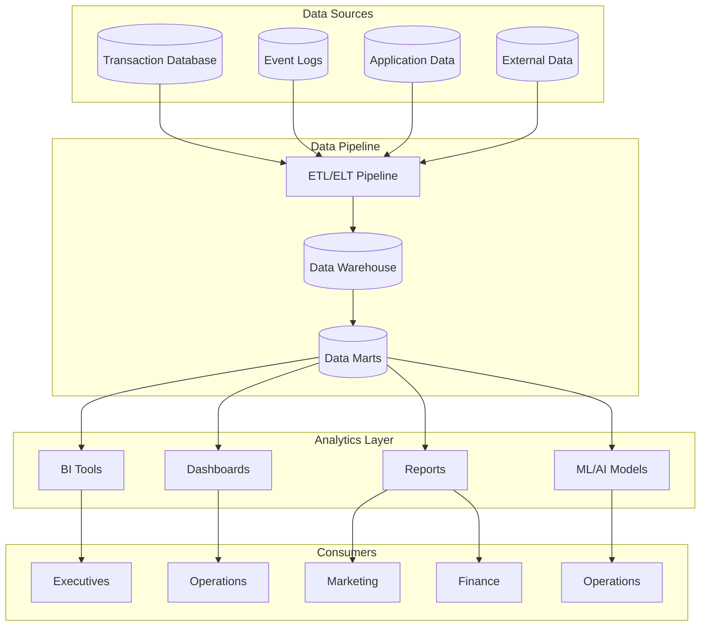

# Software Requirements Specification (SRS)

## Part 08F: Platform Analytics

**Module:** Admin & Operations Module (Part 09)
**Version:** 1.0.0
**Status:** Final / For Review
**Date:** 2026-06-30

---

## Chapter 1 – Overview

### Purpose

The Platform Analytics module defines the comprehensive business intelligence and analytics capabilities for the **[Platform Name]** platform. This encompasses operational dashboards, business metrics, customer analytics, merchant analytics, driver analytics, financial analytics, predictive analytics, and custom reporting.

Platform analytics is the intelligence layer that enables data-driven decision-making across the organization. By providing clear, actionable insights into every aspect of the business, the platform can continuously improve performance, identify opportunities, and mitigate risks. This module ensures that stakeholders across the organization have access to the data they need to make informed decisions.

### Objectives

- Provide real-time and historical business visibility
- Enable data-driven decision-making
- Track key performance indicators (KPIs)
- Identify trends, patterns, and anomalies
- Support predictive analytics and forecasting
- Enable custom reporting and data exploration
- Provide self-service analytics for stakeholders
- Ensure data accuracy and consistency

---

## Chapter 2 – Analytics Architecture

### ANALYTICS-001 Analytics Architecture

### ANALYTICS-002 Analytics Components

| Component | Description | Priority |
| :--- | :--- | :--- |
| **Data Warehouse** | Centralized data repository | **Required** |
| **ETL Pipeline** | Extract, transform, load processes | **Required** |
| **Data Marts** | Subject-specific data subsets | **Required** |
| **BI Tools** | Business intelligence and visualization | **Required** |
| **Dashboards** | Pre-built visualization dashboards | **Required** |
| **Reports** | Scheduled and on-demand reports | **Required** |
| **Predictive Models** | ML/AI models for forecasting | **Required** |
| **Self-Service Analytics** | User-driven data exploration | **Required** |

---

## Chapter 3 – Key Performance Indicators (KPIs)

### ANALYTICS-003 Business KPIs

| KPI | Description | Target | Priority |
| :--- | :--- | :--- | :--- |
| **Gross Merchandise Value (GMV)** | Total value of all orders | Increasing | **Required** |
| **Net Revenue** | Revenue after deductions | Increasing | **Required** |
| **Total Orders** | Number of orders | Increasing | **Required** |
| **Active Customers** | Customers ordering in last 30 days | Increasing | **Required** |
| **Active Merchants** | Merchants active in last 30 days | Increasing | **Required** |
| **Active Drivers** | Drivers active in last 30 days | Increasing | **Required** |
| **Customer Acquisition Cost** | Cost to acquire new customer | Decreasing | **Required** |
| **Customer Lifetime Value** | Lifetime value of customers | Increasing | **Required** |
| **Take Rate** | Platform revenue / GMV | Optimizing | **Required** |
| **Net Profit** | Profit after all costs | Increasing | **Required** |

### ANALYTICS-004 Operational KPIs

| KPI | Description | Target | Priority |
| :--- | :--- | :--- | :--- |
| **Average Delivery Time** | Time from order to delivery | < 30 min | **Required** |
| **On-Time Delivery Rate** | % of deliveries on time | > 95% | **Required** |
| **Driver Utilization** | % of online time delivering | > 65% | **Required** |
| **Merchant Order Fulfillment** | % of orders fulfilled by merchants | > 98% | **Required** |
| **Cancellation Rate** | % of orders cancelled | < 5% | **Required** |
| **Customer Satisfaction** | Average customer rating | > 4.5/5 | **Required** |
| **Merchant Satisfaction** | Average merchant rating | > 4.5/5 | **Required** |
| **Driver Satisfaction** | Average driver rating | > 4.5/5 | **Required** |

### ANALYTICS-005 Financial KPIs

| KPI | Description | Target | Priority |
| :--- | :--- | :--- | :--- |
| **Revenue Growth** | Revenue growth rate | > 20% YoY | **Required** |
| **Gross Margin** | Gross profit / Revenue | > 40% | **Required** |
| **Operating Margin** | Operating profit / Revenue | > 15% | **Required** |
| **Cost Per Order** | Average cost per order | Decreasing | **Required** |
| **Revenue Per Order** | Average revenue per order | Increasing | **Required** |
| **LTV/CAC Ratio** | LTV / CAC | > 3x | **Required** |
| **Payback Period** | Time to recover CAC | < 12 months | **Required** |

---

## Chapter 4 – Business Dashboards

### ANALYTICS-006 Executive Dashboard

| Widget | Description | Priority |
| :--- | :--- | :--- |
| **GMV** | Gross Merchandise Value (today, week, month) | **Required** |
| **Revenue** | Platform revenue (today, week, month) | **Required** |
| **Orders** | Total orders (today, week, month) | **Required** |
| **Active Users** | Active customers, merchants, drivers | **Required** |
| **Growth Trends** | Key metric growth trends | **Required** |
| **Revenue Breakdown** | Revenue by source | **Required** |
| **Regional Performance** | Performance by region | **Required** |
| **Top Performers** | Top merchants, categories | **Required** |
| **Forecast** | Revenue and order forecast | **Required** |

### ANALYTICS-007 Operations Dashboard

| Widget | Description | Priority |
| :--- | :--- | :--- |
| **Live Orders** | Real-time order volume | **Required** |
| **Delivery Performance** | Delivery time, on-time rate | **Required** |
| **Driver Status** | Online/offline/busy drivers | **Required** |
| **Order Status** | Orders by status | **Required** |
| **Merchant Performance** | Merchant metrics | **Required** |
| **Driver Performance** | Driver metrics | **Required** |
| **Queue Status** | Pending orders, wait times | **Required** |
| **Alerts** | Operational alerts | **Required** |

### ANALYTICS-008 Customer Dashboard

| Widget | Description | Priority |
| :--- | :--- | :--- |
| **Customer Growth** | New vs. returning customers | **Required** |
| **Customer Retention** | Retention rate by cohort | **Required** |
| **Customer Segmentation** | Customer segments distribution | **Required** |
| **Customer LTV** | Lifetime value trends | **Required** |
| **Customer Churn** | Churn rate and trends | **Required** |
| **Order Frequency** | Average orders per customer | **Required** |
| **Customer Satisfaction** | NPS, CSAT trends | **Required** |

### ANALYTICS-009 Merchant Dashboard

| Widget | Description | Priority |
| :--- | :--- | :--- |
| **Merchant Growth** | New vs. active merchants | **Required** |
| **Merchant Performance** | Orders, revenue by merchant | **Required** |
| **Merchant Ranking** | Top merchants | **Required** |
| **Merchant Churn** | Merchant churn rate | **Required** |
| **Category Performance** | Performance by cuisine/category | **Required** |
| **Merchant Satisfaction** | Merchant satisfaction trends | **Required** |

### ANALYTICS-010 Driver Dashboard

| Widget | Description | Priority |
| :--- | :--- | :--- |
| **Driver Growth** | New vs. active drivers | **Required** |
| **Driver Performance** | Deliveries, ratings by driver | **Required** |
| **Driver Ranking** | Top drivers | **Required** |
| **Driver Churn** | Driver churn rate | **Required** |
| **Driver Earnings** | Average earnings trends | **Required** |
| **Driver Satisfaction** | Driver satisfaction trends | **Required** |

---

## Chapter 5 – Financial Analytics

### ANALYTICS-011 Financial Dashboard

| Widget | Description | Priority |
| :--- | :--- | :--- |
| **Revenue** | Total revenue with breakdown | **Required** |
| **Costs** | Total costs with breakdown | **Required** |
| **Profit** | Profit and margin trends | **Required** |
| **Commission Revenue** | Commission revenue trends | **Required** |
| **Fee Revenue** | Service fee revenue trends | **Required** |
| **Unit Economics** | Per-order economics | **Required** |
| **Cash Flow** | Cash flow trends | **Required** |
| **Forecast** | Financial forecast | **Required** |

### ANALYTICS-012 Unit Economics

| Metric | Description | Priority |
| :--- | :--- | :--- |
| **Revenue Per Order** | Average revenue per order | **Required** |
| **Cost Per Order** | Average cost per order | **Required** |
| **Contribution Margin** | Revenue per order - Cost per order | **Required** |
| **Commission Per Order** | Average commission per order | **Required** |
| **Delivery Cost Per Order** | Average delivery cost | **Required** |
| **Support Cost Per Order** | Average support cost | **Required** |
| **Marketing Cost Per Order** | Average marketing cost | **Required** |
| **Technology Cost Per Order** | Average technology cost | **Required** |

---

## Chapter 6 – Customer Analytics

### ANALYTICS-013 Customer Segmentation Analytics

| Segment | Description | Metrics | Priority |
| :--- | :--- | :--- | :--- |
| **New Customers** | First 30 days | Conversion rate, AOV, retention | **Required** |
| **Active Customers** | Ordering regularly | Order frequency, LTV, churn risk | **Required** |
| **Loyal Customers** | High frequency/High spend | LTV, retention, advocacy | **Required** |
| **At-Risk Customers** | Decreasing activity | Churn prediction, reactivation | **Required** |
| **Dormant Customers** | No orders in 60+ days | Reactivation potential | **Required** |
| **High-Value Customers** | Top spenders | LTV, retention, advocacy | **Required** |

### ANALYTICS-014 Customer Funnel

| Stage | Description | Metrics | Priority |
| :--- | :--- | :--- | :--- |
| **Acquisition** | New customer acquisition | CAC, channel performance | **Required** |
| **Activation** | First order | Activation rate, time to first order | **Required** |
| **Engagement** | Repeat orders | Order frequency, AOV | **Required** |
| **Retention** | Customer retention | Retention rate, churn rate | **Required** |
| **Advocacy** | Referrals and reviews | NPS, referral rate | **Required** |

---

## Chapter 7 – Predictive Analytics

### ANALYTICS-015 Predictive Models

| Model | Description | Priority |
| :--- | :--- | :--- |
| **Order Volume Forecast** | Predict future order volume | **Required** |
| **Revenue Forecast** | Predict future revenue | **Required** |
| **Customer Churn Prediction** | Predict customer churn | **Required** |
| **Customer LTV Prediction** | Predict lifetime value | **Required** |
| **Demand Forecasting** | Predict demand by time/location | **Required** |
| **Driver Availability Prediction** | Predict driver supply | **Required** |
| **Surge Pricing Prediction** | Predict surge pricing needs | **Required** |
| **Delivery Time Prediction** | Predict delivery times | **Required** |

### ANALYTICS-016 Forecasting Models

| Model | Description | Update Frequency | Priority |
| :--- | :--- | :--- | :--- |
| **Orders Model** | Predicts future order volume | Daily | **Required** |
| **Revenue Model** | Predicts future revenue | Daily | **Required** |
| **Customer Model** | Predicts customer behavior | Weekly | **Required** |
| **Demand Model** | Predicts demand patterns | Daily | **Required** |
| **Supply Model** | Predicts driver availability | Hourly | **Required** |

---

## Chapter 8 – Reporting

### ANALYTICS-017 Report Types

| Report | Description | Frequency | Priority |
| :--- | :--- | :--- | :--- |
| **Daily Business Report** | Daily business summary | Daily | **Required** |
| **Weekly Business Report** | Weekly business summary | Weekly | **Required** |
| **Monthly Business Report** | Monthly business summary | Monthly | **Required** |
| **Quarterly Report** | Quarterly business review | Quarterly | **Required** |
| **Annual Report** | Annual business review | Annual | **Required** |
| **Executive Summary** | High-level executive report | Monthly | **Required** |
| **Investor Report** | Investor-focused report | Quarterly | **Required** |
| **Board Report** | Board of directors report | Quarterly | **Required** |

### ANALYTICS-018 Report Features

| Feature | Description | Priority |
| :--- | :--- | :--- |
| **Export Formats** | PDF, CSV, Excel, JSON | **Required** |
| **Scheduled Delivery** | Auto-deliver reports | **Required** |
| **Date Range Selection** | User-selectable date range | **Required** |
| **Filtering** | Filter by region, segment, category | **Required** |
| **Comparison** | Compare periods | **Required** |
| **Charts** | Interactive charts | **Required** |
| **Comments** | Add comments to reports | **Required** |
| **Sharing** | Share reports with stakeholders | **Required** |

---

## Chapter 9 – Data Warehouse

### ANALYTICS-019 Data Warehouse Schema

| Table | Description | Priority |
| :--- | :--- | :--- |
| **fact_orders** | Order transactions | **Required** |
| **fact_payments** | Payment transactions | **Required** |
| **fact_deliveries** | Delivery transactions | **Required** |
| **fact_merchant_settlements** | Merchant settlements | **Required** |
| **fact_driver_payouts** | Driver payouts | **Required** |
| **dim_customers** | Customer dimension | **Required** |
| **dim_merchants** | Merchant dimension | **Required** |
| **dim_drivers** | Driver dimension | **Required** |
| **dim_date** | Date dimension | **Required** |
| **dim_location** | Location dimension | **Required** |
| **dim_category** | Category dimension | **Required** |
| **aggregate_daily** | Daily aggregates | **Required** |
| **aggregate_weekly** | Weekly aggregates | **Required** |
| **aggregate_monthly** | Monthly aggregates | **Required** |

### ANALYTICS-020 ETL Specifications

| Parameter | Specification | Priority |
| :--- | :--- | :--- |
| **Frequency** | Daily (batch) and Real-time (streaming) | **Required** |
| **Data Sources** | Transaction DB, Logs, Application DB | **Required** |
| **Data Quality** | Validation, deduplication, cleansing | **Required** |
| **Latency** | < 1 hour for daily aggregates | **Required** |
| **Retention** | 7 years (raw data), Indefinite (aggregates) | **Required** |
| **Security** | Encryption, access control, masking | **Required** |

---

## Chapter 10 – Database Tables

### analytics_dashboards

| Column | Type | Constraints | Description |
| :--- | :--- | :--- | :--- |
| `dashboard_id` | UUID | PRIMARY KEY | Unique identifier |
| `dashboard_name` | VARCHAR(100) | NOT NULL | Dashboard name |
| `dashboard_type` | VARCHAR(30) | NOT NULL | EXECUTIVE/OPERATIONS/CUSTOMER/MERCHANT/DRIVER/FINANCIAL |
| `configuration` | JSONB | NOT NULL | Dashboard configuration |
| `is_active` | BOOLEAN | DEFAULT TRUE | Active status |
| `created_by` | UUID | | Creator identifier |
| `created_at` | TIMESTAMP | DEFAULT NOW() | Creation timestamp |
| `updated_at` | TIMESTAMP | DEFAULT NOW() | Last update timestamp |

### analytics_reports

| Column | Type | Constraints | Description |
| :--- | :--- | :--- | :--- |
| `report_id` | UUID | PRIMARY KEY | Unique identifier |
| `report_name` | VARCHAR(255) | NOT NULL | Report name |
| `report_type` | VARCHAR(30) | NOT NULL | DAILY/WEEKLY/MONTHLY/QUARTERLY/ANNUAL/EXECUTIVE/INVESTOR/BOARD |
| `configuration` | JSONB | NOT NULL | Report configuration |
| `schedule` | VARCHAR(50) | | Scheduled delivery |
| `recipients` | TEXT[] | | Email recipients |
| `format` | VARCHAR(10) | DEFAULT 'PDF' | PDF/CSV/EXCEL/JSON |
| `last_generated` | TIMESTAMP | | Last generation timestamp |
| `is_active` | BOOLEAN | DEFAULT TRUE | Active status |
| `created_by` | UUID` | | Creator identifier |
| `created_at` | TIMESTAMP | DEFAULT NOW() | Creation timestamp |
| `updated_at` | TIMESTAMP | DEFAULT NOW() | Last update timestamp |

### analytics_kpis

| Column | Type | Constraints | Description |
| :--- | :--- | :--- | :--- |
| `kpi_id` | UUID | PRIMARY KEY | Unique identifier |
| `kpi_name` | VARCHAR(100) | NOT NULL | KPI name |
| `kpi_category` | VARCHAR(30) | NOT NULL | BUSINESS/OPERATIONAL/FINANCIAL/CUSTOMER/MERCHANT/DRIVER |
| `kpi_value` | DECIMAL(15, 2) | | Current value |
| `kpi_target` | DECIMAL(15, 2) | | Target value |
| `kpi_trend` | DECIMAL(5, 2) | | Trend percentage |
| `kpi_status` | VARCHAR(20) | | GOOD/WARNING/CRITICAL |
| `unit` | VARCHAR(20) | | Unit of measurement |
| `calculation` | JSONB | | Calculation details |
| `updated_at` | TIMESTAMP | | Last update timestamp |
| `created_at` | TIMESTAMP | DEFAULT NOW() | Creation timestamp |

### analytics_predictions

| Column | Type | Constraints | Description |
| :--- | :--- | :--- | :--- |
| `prediction_id` | UUID | PRIMARY KEY | Unique identifier |
| `prediction_type` | VARCHAR(30) | NOT NULL | ORDERS/REVENUE/CHURN/LTV/DEMAND/SUPPLY/SURGE/DELIVERY |
| `prediction_date` | DATE | NOT NULL | Date of prediction |
| `predicted_value` | DECIMAL(15, 2) | NOT NULL | Predicted value |
| `actual_value` | DECIMAL(15, 2) | | Actual value (for validation) |
| `confidence_interval` | JSONB | | Confidence interval |
| `model_version` | VARCHAR(50) | | Model version |
| `accuracy` | DECIMAL(5, 2) | | Prediction accuracy |
| `created_at` | TIMESTAMP | DEFAULT NOW() | Creation timestamp |
| `updated_at` | TIMESTAMP | DEFAULT NOW() | Last update timestamp |

---

## Chapter 11 – REST APIs

### Dashboard APIs

| Method | Endpoint | Description |
| :--- | :--- | :--- |
| `GET` | `/api/v1/admin/analytics/dashboards` | List dashboards |
| `GET` | `/api/v1/admin/analytics/dashboards/{id}` | Get dashboard |
| `GET` | `/api/v1/admin/analytics/dashboards/executive` | Get executive dashboard |
| `GET` | `/api/v1/admin/analytics/dashboards/operations` | Get operations dashboard |
| `GET` | `/api/v1/admin/analytics/dashboards/customer` | Get customer dashboard |
| `GET` | `/api/v1/admin/analytics/dashboards/merchant` | Get merchant dashboard |
| `GET` | `/api/v1/admin/analytics/dashboards/driver` | Get driver dashboard |
| `GET` | `/api/v1/admin/analytics/dashboards/financial` | Get financial dashboard |

### KPI APIs

| Method | Endpoint | Description |
| :--- | :--- | :--- |
| `GET` | `/api/v1/admin/analytics/kpis` | List KPIs |
| `GET` | `/api/v1/admin/analytics/kpis/{id}` | Get KPI details |
| `GET` | `/api/v1/admin/analytics/kpis/trends` | Get KPI trends |

### Report APIs

| Method | Endpoint | Description |
| :--- | :--- | :--- |
| `GET` | `/api/v1/admin/analytics/reports` | List reports |
| `GET` | `/api/v1/admin/analytics/reports/{id}` | Get report details |
| `POST` | `/api/v1/admin/analytics/reports/generate` | Generate report |
| `GET` | `/api/v1/admin/analytics/reports/{id}/download` | Download report |
| `POST` | `/api/v1/admin/analytics/reports/schedule` | Schedule report |

### Analytics APIs

| Method | Endpoint | Description |
| :--- | :--- | :--- |
| `GET` | `/api/v1/admin/analytics/segments` | Get customer segments |
| `GET` | `/api/v1/admin/analytics/segments/{id}` | Get segment details |
| `GET` | `/api/v1/admin/analytics/forecast` | Get forecasts |
| `GET` | `/api/v1/admin/analytics/predictions` | Get predictions |
| `GET` | `/api/v1/admin/analytics/insights` | Get insights |

### Data APIs

| Method | Endpoint | Description |
| :--- | :--- | :--- |
| `GET` | `/api/v1/admin/analytics/data/orders` | Get order data |
| `GET` | `/api/v1/admin/analytics/data/revenue` | Get revenue data |
| `GET` | `/api/v1/admin/analytics/data/customers` | Get customer data |
| `GET` | `/api/v1/admin/analytics/data/export` | Export analytics data |

---

## Chapter 12 – Business Rules

| Rule ID | Rule Description | Priority |
| :--- | :--- | :--- |
| **BR-ANALYTICS-001** | Analytics data must be updated within 24 hours. | **High** |
| **BR-ANALYTICS-002** | Historical data must be retained for 7 years. | **High** |
| **BR-ANALYTICS-003** | KPIs must be calculated using consistent methodologies. | **High** |
| **BR-ANALYTICS-004** | Executive dashboards must display real-time data. | **High** |
| **BR-ANALYTICS-005** | Reports must be generated on schedule. | **High** |
| **BR-ANALYTICS-006** | Predictive models must be retrained weekly. | **High** |
| **BR-ANALYTICS-007** | Data must be anonymized for privacy compliance. | **High** |
| **BR-ANALYTICS-008** | Forecast accuracy must be tracked and reported. | **High** |
| **BR-ANALYTICS-009** | Unit economics must be calculated per order. | **High** |
| **BR-ANALYTICS-010** | LTV/CAC ratio must be tracked monthly. | **High** |

---

## Chapter 13 – Acceptance Tests

| Test ID | Test Description | Priority |
| :--- | :--- | :--- |
| **TEST-ANALYTICS-001** | Executive dashboard displays all KPIs. | **High** |
| **TEST-ANALYTICS-002** | Operations dashboard displays real-time metrics. | **High** |
| **TEST-ANALYTICS-003** | Customer dashboard displays customer insights. | **High** |
| **TEST-ANALYTICS-004** | Merchant dashboard displays merchant insights. | **High** |
| **TEST-ANALYTICS-005** | Driver dashboard displays driver insights. | **High** |
| **TEST-ANALYTICS-006** | Financial dashboard displays financial metrics. | **High** |
| **TEST-ANALYTICS-007** | GMV calculation is correct. | **High** |
| **TEST-ANALYTICS-008** | Net revenue calculation is correct. | **High** |
| **TEST-ANALYTICS-009** | CAC calculation is correct. | **High** |
| **TEST-ANALYTICS-010** | LTV calculation is correct. | **High** |
| **TEST-ANALYTICS-011** | Unit economics calculation is correct. | **High** |
| **TEST-ANALYTICS-012** | Customer churn rate calculation is correct. | **High** |
| **TEST-ANALYTICS-013** | Customer segmentation works correctly. | **High** |
| **TEST-ANALYTICS-014** | Forecast model predicts order volume accurately. | **High** |
| **TEST-ANALYTICS-015** | Forecast model predicts revenue accurately. | **High** |
| **TEST-ANALYTICS-016** | Daily business report generated correctly. | **High** |
| **TEST-ANALYTICS-017** | Weekly business report generated correctly. | **High** |
| **TEST-ANALYTICS-018** | Monthly business report generated correctly. | **High** |
| **TEST-ANALYTICS-019** | Report exported to PDF correctly. | **High** |
| **TEST-ANALYTICS-020** | Report exported to CSV correctly. | **High** |
| **TEST-ANALYTICS-021** | Scheduled report delivered by email. | **High** |
| **TEST-ANALYTICS-022** | KPI trend calculation is correct. | **High** |
| **TEST-ANALYTICS-023** | Data warehouse ETL completes successfully. | **High** |
| **TEST-ANALYTICS-024** | Data quality validation passes. | **High** |
| **TEST-ANALYTICS-025** | Self-service analytics query works. | **High** |

---

## Chapter 14 – Traceability Matrix

| Requirement | Database Table | API Endpoint(s) | Acceptance Test |
| :--- | :--- | :--- | :--- |
| ANALYTICS-006 | analytics_dashboards | GET /api/v1/admin/analytics/dashboards/executive | TEST-ANALYTICS-001 |
| ANALYTICS-007 | analytics_dashboards | GET /api/v1/admin/analytics/dashboards/operations | TEST-ANALYTICS-002 |
| ANALYTICS-008 | analytics_dashboards | GET /api/v1/admin/analytics/dashboards/customer | TEST-ANALYTICS-003 |
| ANALYTICS-009 | analytics_dashboards | GET /api/v1/admin/analytics/dashboards/merchant | TEST-ANALYTICS-004 |
| ANALYTICS-010 | analytics_dashboards | GET /api/v1/admin/analytics/dashboards/driver | TEST-ANALYTICS-005 |
| ANALYTICS-011 | analytics_dashboards | GET /api/v1/admin/analytics/dashboards/financial | TEST-ANALYTICS-006 |
| ANALYTICS-003 | analytics_kpis | GET /api/v1/admin/analytics/kpis | TEST-ANALYTICS-007, TEST-ANALYTICS-008, TEST-ANALYTICS-009, TEST-ANALYTICS-010 |
| ANALYTICS-012 | analytics_kpis | GET /api/v1/admin/analytics/kpis | TEST-ANALYTICS-011 |
| ANALYTICS-013 | analytics_kpis | GET /api/v1/admin/analytics/segments | TEST-ANALYTICS-012, TEST-ANALYTICS-013 |
| ANALYTICS-015 | analytics_predictions | GET /api/v1/admin/analytics/forecast | TEST-ANALYTICS-014, TEST-ANALYTICS-015 |
| ANALYTICS-017 | analytics_reports | GET /api/v1/admin/analytics/reports | TEST-ANALYTICS-016, TEST-ANALYTICS-017, TEST-ANALYTICS-018 |
| ANALYTICS-018 | analytics_reports | GET /api/v1/admin/analytics/reports/{id}/download | TEST-ANALYTICS-019, TEST-ANALYTICS-020 |
| ANALYTICS-017 | analytics_reports | POST /api/v1/admin/analytics/reports/schedule | TEST-ANALYTICS-021 |
| ANALYTICS-003 | analytics_kpis | GET /api/v1/admin/analytics/kpis/trends | TEST-ANALYTICS-022 |
| ANALYTICS-019 | analytics_dashboards | GET /api/v1/admin/analytics/data/orders | TEST-ANALYTICS-023, TEST-ANALYTICS-024 |
| ANALYTICS-001 | analytics_dashboards | GET /api/v1/admin/analytics/data/export | TEST-ANALYTICS-025 |

---

## Chapter 15 – Summary

This document establishes the complete platform analytics capability for the **[Platform Name]** platform. Key takeaways:

- **Comprehensive Analytics Architecture:** Data warehouse with ETL pipeline, data marts, BI tools, dashboards, and reports.
- **Executive Dashboards:** Real-time visibility into GMV, revenue, orders, active users, growth trends, and forecasts.
- **Operational Dashboards:** Live order volume, delivery performance, driver status, order status, and operational alerts.
- **Customer Analytics:** Customer segmentation, retention, LTV, churn, order frequency, and satisfaction.
- **Merchant Analytics:** Merchant growth, performance, ranking, churn, and satisfaction.
- **Driver Analytics:** Driver growth, performance, ranking, earnings, and satisfaction.
- **Financial Analytics:** Revenue, costs, profit, commission revenue, unit economics, and cash flow.
- **Predictive Analytics:** Order volume forecast, revenue forecast, customer churn prediction, LTV prediction, and demand forecasting.
- **Reporting:** Scheduled and on-demand reports with multiple export formats (PDF, CSV, Excel, JSON).
- **Self-Service Analytics:** User-driven data exploration and custom reporting.

The platform analytics module provides the intelligence layer for data-driven decision-making across the organization.

---

**Next Document:**

`10_Security_Compliance_Module/Part_09A_Authentication_Authorization.md`

*(This transitions from admin operations to security and compliance, starting with authentication and authorization.)*
