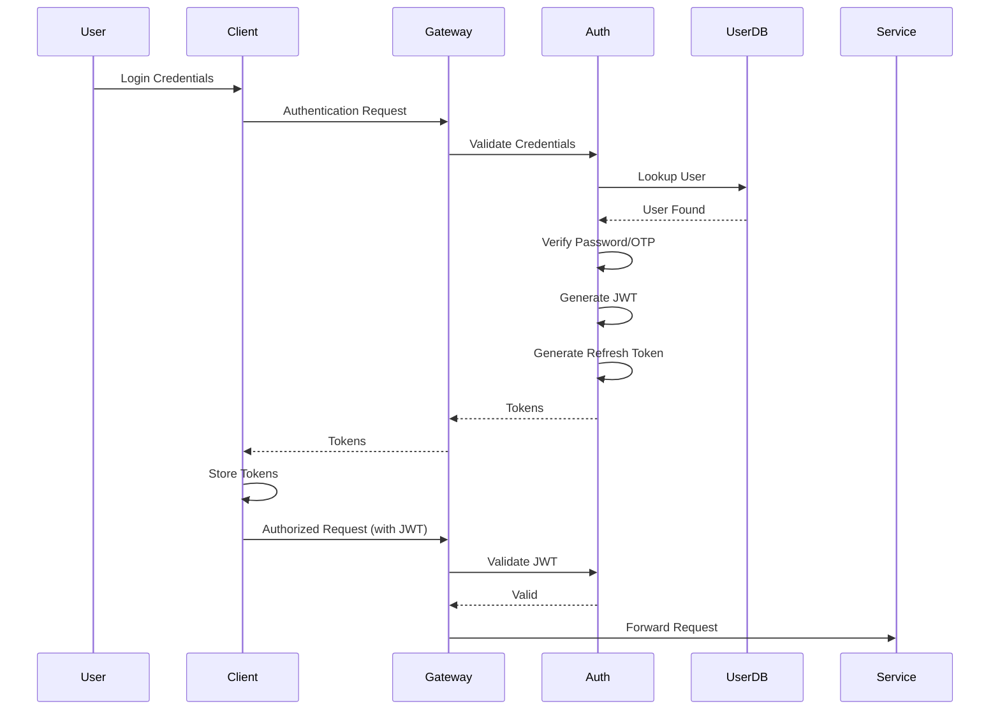

# Software Requirements Specification (SRS)

## Part 09A: Authentication & Authorization

**Module:** Security & Compliance Module (Part 10)
**Version:** 1.0.0
**Status:** Final / For Review
**Date:** 2026-06-30

---

## Chapter 1 – Overview

### Purpose

The Authentication & Authorization module defines the comprehensive identity and access management (IAM) framework for the **[Platform Name]** platform. This encompasses user authentication, authorization, role-based access control (RBAC), permission management, session management, and identity federation.

Authentication and authorization are the foundation of platform security. Every user—customer, merchant, driver, admin, and partner—must be properly identified and authorized before accessing any resource. This module ensures that only legitimate users can access the platform and only authorized users can perform specific actions.

### Objectives

- Provide secure, user-friendly authentication
- Implement robust authorization controls
- Support multiple authentication methods
- Enable role-based and fine-grained permissions
- Maintain secure session management
- Support identity federation (SSO)
- Enforce least-privilege access
- Provide comprehensive audit trails

---

## Chapter 2 – Authentication Framework

### AUTH-001 Authentication Methods

| Method | Description | Applicable Users | Priority |
| :--- | :--- | :--- | :--- |
| **Email/Password** | Standard credential-based login | All users | **Required** |
| **Phone OTP** | One-time password via SMS/WhatsApp | Customers, Drivers | **Required** |
| **Social Login** | OAuth via Google, Facebook, Apple | Customers | **Required** |
| **Biometric** | Fingerprint, Face ID | Customers, Drivers | **Required** |
| **Magic Link** | Email-based passwordless login | All users | **Required** |
| **MFA** | Multi-factor authentication | All users | **Required** |
| **SAML/OIDC** | Enterprise SSO | Admin users, Enterprise partners | **Required** |
| **API Key** | Programmatic access | Partners, Developers | **Required** |

### AUTH-002 Authentication Flow

### AUTH-003 Token Management

| Parameter | Specification | Priority |
| :--- | :--- | :--- |
| **Access Token Format** | JWT (JSON Web Token) | **Required** |
| **Access Token Lifetime** | 15 minutes | **Required** |
| **Refresh Token Lifetime** | 7 days | **Required** |
| **Token Signing Algorithm** | RS256 (asymmetric) | **Required** |
| **Token Rotation** | On each refresh | **Required** |
| **Token Revocation** | Immediate (blacklist) | **Required** |
| **Token Storage** | Redis (blacklist), Database (audit) | **Required** |

### AUTH-004 JWT Claims

| Claim | Description | Priority |
| :--- | :--- | :--- |
| `user_id` | Unique user identifier | **Required** |
| `email` | User email address | **Required** |
| `roles` | User roles (e.g., ROLE_CUSTOMER) | **Required** |
| `scopes` | Authorization scopes | **Required** |
| `iat` | Issued at timestamp | **Required** |
| `exp` | Expiration timestamp | **Required** |
| `iss` | Issuer identifier | **Required** |
| `aud` | Audience identifier | **Required** |

### AUTH-005 Password Policy

| Policy | Requirement | Priority |
| :--- | :--- | :--- |
| **Minimum Length** | 8 characters | **Required** |
| **Complexity** | Uppercase, lowercase, number, special character | **Required** |
| **History** | Last 5 passwords cannot be reused | **Required** |
| **Lockout** | 5 failed attempts → locked for 15 minutes | **Required** |
| **Expiration** | 90 days (admin users), 180 days (others) | **Required** |
| **Password Hashing** | bcrypt (cost factor 12) or Argon2id | **Required** |

---

## Chapter 3 – Authorization Framework

### AUTH-006 Authorization Models

| Model | Description | Priority |
| :--- | :--- | :--- |
| **RBAC** | Role-Based Access Control | **Required** |
| **ABAC** | Attribute-Based Access Control | **Required** |
| **PBAC** | Policy-Based Access Control | **Required** |
| **Fine-Grained Permissions** | Granular action-level permissions | **Required** |
| **Resource-Based** | Permissions based on resource ownership | **Required** |

### AUTH-007 Roles

| Role | Description | Priority |
| :--- | :--- | :--- |
| **Super Admin** | Full platform access | **Required** |
| **Admin** | Platform administration | **Required** |
| **Manager** | Operational management | **Required** |
| **Support** | Customer support access | **Required** |
| **Auditor** | Read-only audit access | **Required** |
| **Customer** | Customer self-service access | **Required** |
| **Merchant** | Merchant dashboard access | **Required** |
| **Driver** | Driver app access | **Required** |
| **Partner** | API partner access | **Required** |
| **Developer** | API developer access | **Required** |

### AUTH-008 Role Hierarchies

| Level | Roles | Priority |
| :--- | :--- | :--- |
| **Level 1** | Super Admin | **Required** |
| **Level 2** | Admin | **Required** |
| **Level 3** | Manager | **Required** |
| **Level 4** | Support, Auditor | **Required** |
| **Level 5** | Customer, Merchant, Driver, Partner, Developer | **Required** |

### AUTH-009 Permissions Matrix

| Permission | Super Admin | Admin | Manager | Support | Customer | Merchant | Driver | Partner | Developer |
| :--- | :--- | :--- | :--- | :--- | :--- | :--- | :--- | :--- | :--- |
| **User Management** | ✅ | ✅ | ❌ | ❌ | ❌ | ❌ | ❌ | ❌ | ❌ |
| **Order Management** | ✅ | ✅ | ✅ | ✅ | ✅ | ✅ | ✅ | ❌ | ❌ |
| **Merchant Management** | ✅ | ✅ | ✅ | ❌ | ❌ | ❌ | ❌ | ❌ | ❌ |
| **Driver Management** | ✅ | ✅ | ✅ | ❌ | ❌ | ❌ | ❌ | ❌ | ❌ |
| **Financial Access** | ✅ | ✅ | ❌ | ❌ | ❌ | ✅ | ✅ | ❌ | ❌ |
| **Support Tickets** | ✅ | ✅ | ✅ | ✅ | ❌ | ❌ | ❌ | ❌ | ❌ |
| **System Configuration** | ✅ | ❌ | ❌ | ❌ | ❌ | ❌ | ❌ | ❌ | ❌ |
| **Audit Logs** | ✅ | ✅ | ❌ | ❌ | ❌ | ❌ | ❌ | ❌ | ❌ |
| **API Access** | ✅ | ✅ | ❌ | ❌ | ❌ | ✅ | ❌ | ✅ | ✅ |

### AUTH-010 Permission Data Model

| Attribute | Type | Required | Description |
| :--- | :--- | :--- | :--- |
| `permission_id` | UUID | Yes | Unique identifier |
| `permission_name` | String | Yes | e.g., "orders:read" |
| `permission_description` | Text | | Description of permission |
| `resource` | String | Yes | Resource type (orders, merchants, etc.) |
| `action` | String | Yes | Action (create, read, update, delete) |
| `created_at` | Timestamp | Yes | Creation timestamp |

### AUTH-011 Role Permissions Data Model

| Attribute | Type | Required | Description |
| :--- | :--- | :--- | :--- |
| `role_permission_id` | UUID | Yes | Unique identifier |
| `role_id` | UUID | Yes | Associated role |
| `permission_id` | UUID | Yes | Associated permission |
| `granted_at` | Timestamp | Yes | Grant timestamp |
| `granted_by` | UUID | | Granter identifier |

---

## Chapter 4 – Session Management

### AUTH-012 Session Features

| Feature | Description | Priority |
| :--- | :--- | :--- |
| **Session Creation** | Create session on successful login | **Required** |
| **Session Tracking** | Track device, IP, user agent | **Required** |
| **Concurrent Sessions** | Limit concurrent sessions | **Required** |
| **Session Expiry** | Auto-logout after inactivity | **Required** |
| **Session Revocation** | Revoke specific sessions | **Required** |
| **Session Logout** | Logout from all devices | **Required** |
| **Device Management** | View and manage devices | **Required** |

### AUTH-013 Session Parameters

| Parameter | Specification | Priority |
| :--- | :--- | :--- |
| **Max Concurrent Sessions** | 5 per user | **Required** |
| **Session Inactivity Timeout** | 30 minutes | **Required** |
| **Remember Me Duration** | 30 days | **Required** |
| **Session Cookie** | HTTP-only, Secure, SameSite | **Required** |

### AUTH-014 Session Data Model

| Column | Type | Constraints | Description |
| :--- | :--- | :--- | :--- |
| `session_id` | UUID | PRIMARY KEY | Unique identifier |
| `user_id` | UUID | FOREIGN KEY (users.user_id) | Associated user |
| `user_type` | VARCHAR(20) | NOT NULL | CUSTOMER/MERCHANT/DRIVER/ADMIN/PARTNER |
| `refresh_token` | VARCHAR(255) | UNIQUE | Encrypted refresh token |
| `device_id` | VARCHAR(255) | | Unique device identifier |
| `device_name` | VARCHAR(100) | | e.g., "iPhone 15 Pro" |
| `device_type` | VARCHAR(20) | | ios/android/web |
| `ip_address` | VARCHAR(45) | | IPv4 or IPv6 address |
| `user_agent` | TEXT | | Browser/device user agent |
| `is_active` | BOOLEAN | DEFAULT TRUE | Active status |
| `expires_at` | TIMESTAMP | NOT NULL | Session expiration |
| `revoked_at` | TIMESTAMP | | Revocation timestamp |
| `created_at` | TIMESTAMP | DEFAULT NOW() | Creation timestamp |
| `updated_at` | TIMESTAMP | DEFAULT NOW() | Last update timestamp |

---

## Chapter 5 – Multi-Factor Authentication (MFA)

### AUTH-015 MFA Methods

| Method | Description | Priority |
| :--- | :--- | :--- |
| **TOTP** | Time-based OTP (Authenticator App) | **Required** |
| **SMS OTP** | One-time password via SMS | **Required** |
| **Email OTP** | One-time password via email | **Required** |
| **Backup Codes** | Single-use backup codes | **Required** |

### AUTH-016 MFA Features

| Feature | Description | Priority |
| :--- | :--- | :--- |
| **MFA Enrollment** | User can enable MFA | **Required** |
| **MFA Verification** | Verify MFA during login | **Required** |
| **Backup Codes** | Generate 10 backup codes | **Required** |
| **Recovery** | Account recovery with backup codes | **Required** |
| **Device Trust** | Trust device for 30 days | **Required** |
| **MFA Reset** | Admin can reset MFA | **Required** |

### AUTH-017 MFA Data Model

| Column | Type | Constraints | Description |
| :--- | :--- | :--- | :--- |
| `mfa_id` | UUID | PRIMARY KEY | Unique identifier |
| `user_id` | UUID | FOREIGN KEY (users.user_id) | Associated user |
| `user_type` | VARCHAR(20) | NOT NULL | CUSTOMER/MERCHANT/DRIVER/ADMIN |
| `method` | VARCHAR(20) | NOT NULL | TOTP/SMS/EMAIL |
| `secret` | VARCHAR(255) | | Encrypted TOTP secret |
| `phone_number` | VARCHAR(20) | | For SMS MFA |
| `email` | VARCHAR(255) | | For email MFA |
| `is_primary` | BOOLEAN | DEFAULT FALSE | Primary MFA method |
| `is_active` | BOOLEAN | DEFAULT TRUE | Active status |
| `backup_codes` | TEXT | | Encrypted JSON array |
| `created_at` | TIMESTAMP | DEFAULT NOW() | Creation timestamp |
| `updated_at` | TIMESTAMP | DEFAULT NOW() | Last update timestamp |

---

## Chapter 6 – Identity Federation

### AUTH-018 Federation Protocols

| Protocol | Description | Priority |
| :--- | :--- | :--- |
| **SAML 2.0** | Security Assertion Markup Language | **Required** |
| **OpenID Connect (OIDC)** | OAuth 2.0-based identity | **Required** |
| **SCIM** | System for Cross-domain Identity Management | **Required** |

### AUTH-019 Federation Features

| Feature | Description | Priority |
| :--- | :--- | :--- |
| **SSO** | Single Sign-On (SAML/OIDC) | **Required** |
| **User Provisioning** | Automatic user provisioning (SCIM) | **Required** |
| **User Deprovisioning** | Automatic user deprovisioning | **Required** |
| **Attribute Mapping** | Map identity provider attributes | **Required** |
| **Role Mapping** | Map identity provider roles | **Required** |
| **Just-in-Time Provisioning** | Auto-create users on first login | **Required** |

### AUTH-020 Identity Provider Data Model

| Column | Type | Constraints | Description |
| :--- | :--- | :--- | :--- |
| `idp_id` | UUID | PRIMARY KEY | Unique identifier |
| `idp_name` | VARCHAR(100) | NOT NULL | Identity provider name |
| `idp_type` | VARCHAR(20) | NOT NULL | SAML/OIDC |
| `entity_id` | VARCHAR(255) | | SAML entity ID |
| `sso_url` | VARCHAR(255) | | SSO URL |
| `slo_url` | VARCHAR(255) | | SLO URL |
| `certificate` | TEXT | | X.509 certificate |
| `client_id` | VARCHAR(255) | | OIDC client ID |
| `client_secret` | VARCHAR(255) | | OIDC client secret |
| `authorization_endpoint` | VARCHAR(255) | | OIDC auth endpoint |
| `token_endpoint` | VARCHAR(255) | | OIDC token endpoint |
| `userinfo_endpoint` | VARCHAR(255) | | OIDC userinfo endpoint |
| `attribute_mapping` | JSONB | | Attribute mapping rules |
| `role_mapping` | JSONB | | Role mapping rules |
| `is_active` | BOOLEAN | DEFAULT TRUE | Active status |
| `created_at` | TIMESTAMP | DEFAULT NOW() | Creation timestamp |
| `updated_at` | TIMESTAMP | DEFAULT NOW() | Last update timestamp |

---

## Chapter 7 – API Authentication

### AUTH-021 API Authentication Methods

| Method | Description | Priority |
| :--- | :--- | :--- |
| **Bearer Token** | JWT in Authorization header | **Required** |
| **API Key** | API key in header or query | **Required** |
| **OAuth 2.1** | OAuth 2.1 flow for third-party | **Required** |
| **mTLS** | Mutual TLS for service-to-service | **Required** |

### AUTH-022 API Key Management

| Feature | Description | Priority |
| :--- | :--- | :--- |
| **Key Generation** | Generate API keys | **Required** |
| **Key Rotation** | Rotate keys periodically | **Required** |
| **Key Revocation** | Revoke keys immediately | **Required** |
| **Key Expiry** | Set key expiry dates | **Required** |
| **Key Scopes** | Limit access by scopes | **Required** |
| **Key Usage Logging** | Log key usage | **Required** |

### AUTH-023 API Key Data Model

| Column | Type | Constraints | Description |
| :--- | :--- | :--- | :--- |
| `api_key_id` | UUID | PRIMARY KEY | Unique identifier |
| `user_id` | UUID | FOREIGN KEY (users.user_id) | Associated user |
| `user_type` | VARCHAR(20) | NOT NULL | MERCHANT/PARTNER/DEVELOPER |
| `key_name` | VARCHAR(100) | NOT NULL | Internal key name |
| `key_prefix` | VARCHAR(10) | | Key prefix for identification |
| `key_hash` | VARCHAR(255) | NOT NULL | Hashed API key |
| `scopes` | TEXT[] | | Authorization scopes |
| `permissions` | TEXT[] | | Granular permissions |
| `expires_at` | TIMESTAMP | | Expiration timestamp |
| `last_used_at` | TIMESTAMP | | Last usage timestamp |
| `is_active` | BOOLEAN | DEFAULT TRUE | Active status |
| `created_at` | TIMESTAMP | DEFAULT NOW() | Creation timestamp |
| `updated_at` | TIMESTAMP | DEFAULT NOW() | Last update timestamp |

---

## Chapter 8 – Audit & Monitoring

### AUTH-024 Authentication Audit

| Event | Logged | Priority |
| :--- | :--- | :--- |
| **Login Success** | User, IP, timestamp, device | **Required** |
| **Login Failure** | User, IP, timestamp, reason | **Required** |
| **Logout** | User, IP, timestamp | **Required** |
| **Password Reset** | User, IP, timestamp | **Required** |
| **Password Change** | User, IP, timestamp | **Required** |
| **MFA Enrollment** | User, IP, timestamp | **Required** |
| **MFA Verification** | User, IP, timestamp | **Required** |
| **Token Generation** | User, IP, timestamp | **Required** |
| **Token Refresh** | User, IP, timestamp | **Required** |
| **Token Revocation** | User, IP, timestamp | **Required** |
| **API Key Created** | User, IP, timestamp | **Required** |
| **API Key Revoked** | User, IP, timestamp | **Required** |

### AUTH-025 Security Monitoring

| Monitor | Description | Priority |
| :--- | :--- | :--- |
| **Failed Login Attempts** | Alert on multiple failures | **Required** |
| **Unusual Location** | Login from unusual location | **Required** |
| **Unusual Time** | Login at unusual time | **Required** |
| **Unusual Device** | Login from unrecognized device | **Required** |
| **Credential Stuffing** | Detect credential stuffing attacks | **Required** |
| **Brute Force** | Detect brute force attacks | **Required** |

---

## Chapter 9 – Database Tables

### users

| Column | Type | Constraints | Description |
| :--- | :--- | :--- | :--- |
| `user_id` | UUID | PRIMARY KEY | Unique identifier |
| `user_type` | VARCHAR(20) | NOT NULL | CUSTOMER/MERCHANT/DRIVER/ADMIN/PARTNER |
| `email` | VARCHAR(255) | UNIQUE | Email address |
| `phone` | VARCHAR(20) | | Phone number (E.164) |
| `password_hash` | VARCHAR(255) | | bcrypt/Argon2 hash |
| `first_name` | VARCHAR(100) | | First name |
| `last_name` | VARCHAR(100) | | Last name |
| `display_name` | VARCHAR(100) | | Display name |
| `avatar_url` | VARCHAR(500) | | Profile image URL |
| `language` | VARCHAR(5) | DEFAULT 'en' | Preferred language |
| `timezone` | VARCHAR(50) | | Timezone |
| `is_active` | BOOLEAN | DEFAULT TRUE | Active status |
| `email_verified` | BOOLEAN | DEFAULT FALSE | Email verification |
| `phone_verified` | BOOLEAN | DEFAULT FALSE | Phone verification |
| `mfa_enabled` | BOOLEAN | DEFAULT FALSE | MFA enabled |
| `last_login` | TIMESTAMP | | Last login timestamp |
| `created_at` | TIMESTAMP | DEFAULT NOW() | Creation timestamp |
| `updated_at` | TIMESTAMP | DEFAULT NOW() | Last update timestamp |

### user_roles

| Column | Type | Constraints | Description |
| :--- | :--- | :--- | :--- |
| `user_role_id` | UUID | PRIMARY KEY | Unique identifier |
| `user_id` | UUID | FOREIGN KEY (users.user_id) | Associated user |
| `role` | VARCHAR(30) | NOT NULL | SUPER_ADMIN/ADMIN/MANAGER/SUPPORT/AUDITOR/CUSTOMER/MERCHANT/DRIVER/PARTNER/DEVELOPER |
| `granted_at` | TIMESTAMP | DEFAULT NOW() | Grant timestamp |
| `granted_by` | UUID | | Granter identifier |

### sessions

| Column | Type | Constraints | Description |
| :--- | :--- | :--- | :--- |
| `session_id` | UUID | PRIMARY KEY | Unique identifier |
| `user_id` | UUID | FOREIGN KEY (users.user_id) | Associated user |
| `user_type` | VARCHAR(20) | NOT NULL | CUSTOMER/MERCHANT/DRIVER/ADMIN/PARTNER |
| `refresh_token` | VARCHAR(255) | UNIQUE | Encrypted refresh token |
| `device_id` | VARCHAR(255) | | Unique device identifier |
| `device_name` | VARCHAR(100) | | Device name |
| `device_type` | VARCHAR(20) | | ios/android/web |
| `ip_address` | VARCHAR(45) | | IP address |
| `user_agent` | TEXT | | User agent |
| `is_active` | BOOLEAN | DEFAULT TRUE | Active status |
| `expires_at` | TIMESTAMP | NOT NULL | Expiration timestamp |
| `revoked_at` | TIMESTAMP | | Revocation timestamp |
| `created_at` | TIMESTAMP | DEFAULT NOW() | Creation timestamp |
| `updated_at` | TIMESTAMP | DEFAULT NOW() | Last update timestamp |

### mfa_settings

| Column | Type | Constraints | Description |
| :--- | :--- | :--- | :--- |
| `mfa_id` | UUID | PRIMARY KEY | Unique identifier |
| `user_id` | UUID | FOREIGN KEY (users.user_id) | Associated user |
| `user_type` | VARCHAR(20) | NOT NULL | CUSTOMER/MERCHANT/DRIVER/ADMIN |
| `method` | VARCHAR(20) | NOT NULL | TOTP/SMS/EMAIL |
| `secret` | VARCHAR(255) | | Encrypted TOTP secret |
| `phone_number` | VARCHAR(20) | | For SMS MFA |
| `email` | VARCHAR(255) | | For email MFA |
| `is_primary` | BOOLEAN | DEFAULT FALSE | Primary MFA method |
| `is_active` | BOOLEAN | DEFAULT TRUE | Active status |
| `backup_codes` | TEXT | | Encrypted JSON array |
| `created_at` | TIMESTAMP | DEFAULT NOW() | Creation timestamp |
| `updated_at` | TIMESTAMP | DEFAULT NOW() | Last update timestamp |

### api_keys

| Column | Type | Constraints | Description |
| :--- | :--- | :--- | :--- |
| `api_key_id` | UUID | PRIMARY KEY | Unique identifier |
| `user_id` | UUID | FOREIGN KEY (users.user_id) | Associated user |
| `user_type` | VARCHAR(20) | NOT NULL | MERCHANT/PARTNER/DEVELOPER |
| `key_name` | VARCHAR(100) | NOT NULL | Internal key name |
| `key_prefix` | VARCHAR(10) | | Key prefix |
| `key_hash` | VARCHAR(255) | NOT NULL | Hashed API key |
| `scopes` | TEXT[] | | Authorization scopes |
| `permissions` | TEXT[] | | Granular permissions |
| `expires_at` | TIMESTAMP | | Expiration timestamp |
| `last_used_at` | TIMESTAMP | | Last usage timestamp |
| `is_active` | BOOLEAN | DEFAULT TRUE | Active status |
| `created_at` | TIMESTAMP | DEFAULT NOW() | Creation timestamp |
| `updated_at` | TIMESTAMP | DEFAULT NOW() | Last update timestamp |

### identity_providers

| Column | Type | Constraints | Description |
| :--- | :--- | :--- | :--- |
| `idp_id` | UUID | PRIMARY KEY | Unique identifier |
| `idp_name` | VARCHAR(100) | NOT NULL | Identity provider name |
| `idp_type` | VARCHAR(20) | NOT NULL | SAML/OIDC |
| `entity_id` | VARCHAR(255) | | SAML entity ID |
| `sso_url` | VARCHAR(255) | | SSO URL |
| `slo_url` | VARCHAR(255) | | SLO URL |
| `certificate` | TEXT | | X.509 certificate |
| `client_id` | VARCHAR(255) | | OIDC client ID |
| `client_secret` | VARCHAR(255) | | OIDC client secret |
| `authorization_endpoint` | VARCHAR(255) | | OIDC auth endpoint |
| `token_endpoint` | VARCHAR(255) | | OIDC token endpoint |
| `userinfo_endpoint` | VARCHAR(255) | | OIDC userinfo endpoint |
| `attribute_mapping` | JSONB | | Attribute mapping rules |
| `role_mapping` | JSONB` | | Role mapping rules |
| `is_active` | BOOLEAN | DEFAULT TRUE | Active status |
| `created_at` | TIMESTAMP | DEFAULT NOW() | Creation timestamp |
| `updated_at` | TIMESTAMP | DEFAULT NOW() | Last update timestamp |

### auth_audit_logs

| Column | Type | Constraints | Description |
| :--- | :--- | :--- | :--- |
| `audit_id` | UUID | PRIMARY KEY | Unique identifier |
| `user_id` | UUID | FOREIGN KEY (users.user_id) | Associated user |
| `event_type` | VARCHAR(50) | NOT NULL | LOGIN/LOGOUT/PASSWORD_RESET/PASSWORD_CHANGE/MFA_ENROLL/MFA_VERIFY/TOKEN_GENERATE/TOKEN_REFRESH/TOKEN_REVOKE/API_KEY_CREATED/API_KEY_REVOKED |
| `status` | VARCHAR(20) | NOT NULL | SUCCESS/FAILURE |
| `ip_address` | VARCHAR(45) | | IP address |
| `user_agent` | TEXT | | Browser/user agent |
| `device_id` | VARCHAR(255) | | Device identifier |
| `metadata` | JSONB | | Additional context |
| `created_at` | TIMESTAMP | DEFAULT NOW() | Event timestamp |

---

## Chapter 10 – REST APIs

### Authentication APIs

| Method | Endpoint | Description |
| :--- | :--- | :--- |
| `POST` | `/api/v1/auth/login` | Login with credentials |
| `POST` | `/api/v1/auth/login/otp` | Login with phone OTP |
| `POST` | `/api/v1/auth/login/social` | Login with social provider |
| `POST` | `/api/v1/auth/refresh` | Refresh access token |
| `POST` | `/api/v1/auth/logout` | Logout current session |
| `POST` | `/api/v1/auth/logout/all` | Logout all sessions |
| `POST` | `/api/v1/auth/password/reset` | Request password reset |
| `POST` | `/api/v1/auth/password/reset/confirm` | Confirm password reset |
| `POST` | `/api/v1/auth/password/change` | Change password |
| `POST` | `/api/v1/auth/verify/email` | Verify email |
| `POST` | `/api/v1/auth/verify/phone` | Verify phone |

### MFA APIs

| Method | Endpoint | Description |
| :--- | :--- | :--- |
| `POST` | `/api/v1/auth/mfa/enable` | Enable MFA |
| `POST` | `/api/v1/auth/mfa/verify` | Verify MFA |
| `POST` | `/api/v1/auth/mfa/disable` | Disable MFA |
| `GET` | `/api/v1/auth/mfa/backup-codes` | Get backup codes |
| `POST` | `/api/v1/auth/mfa/backup-codes/regenerate` | Regenerate backup codes |

### Session APIs

| Method | Endpoint | Description |
| :--- | :--- | :--- |
| `GET` | `/api/v1/auth/sessions` | List active sessions |
| `DELETE` | `/api/v1/auth/sessions/{id}` | Revoke session |
| `DELETE` | `/api/v1/auth/sessions` | Revoke all sessions |

### API Key APIs

| Method | Endpoint | Description |
| :--- | :--- | :--- |
| `GET` | `/api/v1/api-keys` | List API keys |
| `POST` | `/api/v1/api-keys` | Create API key |
| `GET` | `/api/v1/api-keys/{id}` | Get API key details |
| `DELETE` | `/api/v1/api-keys/{id}` | Revoke API key |
| `PUT` | `/api/v1/api-keys/{id}` | Update API key |

### Federation APIs

| Method | Endpoint | Description |
| :--- | :--- | :--- |
| `GET` | `/api/v1/auth/federation/providers` | List identity providers |
| `POST` | `/api/v1/auth/federation/saml/login` | SAML login |
| `POST` | `/api/v1/auth/federation/oidc/login` | OIDC login |

### Audit APIs

| Method | Endpoint | Description |
| :--- | :--- | :--- |
| `GET` | `/api/v1/admin/auth/audit` | Get authentication audit logs |

---

## Chapter 11 – Business Rules

| Rule ID | Rule Description | Priority |
| :--- | :--- | :--- |
| **BR-AUTH-001** | Password must be at least 8 characters with complexity requirements. | **High** |
| **BR-AUTH-002** | 5 failed login attempts lock account for 15 minutes. | **High** |
| **BR-AUTH-003** | MFA is required for admin accounts. | **High** |
| **BR-AUTH-004** | Access tokens expire after 15 minutes. | **High** |
| **BR-AUTH-005** | Refresh tokens expire after 7 days. | **High** |
| **BR-AUTH-006** | Sessions expire after 30 minutes of inactivity. | **High** |
| **BR-AUTH-007** | API keys must be hashed before storage. | **High** |
| **BR-AUTH-008** | Passwords must be hashed (bcrypt/Argon2). | **High** |
| **BR-AUTH-009** | Administrative users must have MFA enabled. | **High** |
| **BR-AUTH-010** | All authentication events must be logged for audit. | **High** |

---

## Chapter 12 – Acceptance Tests

| Test ID | Test Description | Priority |
| :--- | :--- | :--- |
| **TEST-AUTH-001** | User logs in with valid credentials. | **High** |
| **TEST-AUTH-002** | User login fails with invalid credentials. | **High** |
| **TEST-AUTH-003** | Account locked after 5 failed login attempts. | **High** |
| **TEST-AUTH-004** | User logs in with phone OTP. | **High** |
| **TEST-AUTH-005** | User logs in with social login. | **High** |
| **TEST-AUTH-006** | User refreshes access token. | **High** |
| **TEST-AUTH-007** | User logs out. | **High** |
| **TEST-AUTH-008** | User changes password. | **High** |
| **TEST-AUTH-009** | User resets password. | **High** |
| **TEST-AUTH-010** | User verifies email. | **High** |
| **TEST-AUTH-011** | User enables MFA (TOTP). | **High** |
| **TEST-AUTH-012** | User verifies MFA during login. | **High** |
| **TEST-AUTH-013** | User uses backup code for MFA recovery. | **High** |
| **TEST-AUTH-014** | User views active sessions. | **High** |
| **TEST-AUTH-015** | User revokes a session. | **High** |
| **TEST-AUTH-016** | User creates API key. | **High** |
| **TEST-AUTH-017** | User revokes API key. | **High** |
| **TEST-AUTH-018** | API authentication with valid API key succeeds. | **High** |
| **TEST-AUTH-019** | API authentication with invalid API key fails. | **High** |
| **TEST-AUTH-020** | User logs in with SAML SSO. | **High** |
| **TEST-AUTH-021** | User logs in with OIDC SSO. | **High** |
| **TEST-AUTH-022** | Admin views authentication audit logs. | **High** |
| **TEST-AUTH-023** | Unusual location login triggers alert. | **High** |
| **TEST-AUTH-024** | Unusual time login triggers alert. | **High** |
| **TEST-AUTH-025** | Unusual device login triggers alert. | **High** |

---

## Chapter 13 – Traceability Matrix

| Requirement | Database Table | API Endpoint(s) | Acceptance Test |
| :--- | :--- | :--- | :--- |
| AUTH-002 | users | POST /api/v1/auth/login | TEST-AUTH-001, TEST-AUTH-002 |
| AUTH-002 | users | POST /api/v1/auth/login/otp | TEST-AUTH-004 |
| AUTH-002 | users | POST /api/v1/auth/login/social | TEST-AUTH-005 |
| AUTH-003 | sessions | POST /api/v1/auth/refresh | TEST-AUTH-006 |
| AUTH-004 | sessions | POST /api/v1/auth/logout | TEST-AUTH-007 |
| AUTH-005 | users | POST /api/v1/auth/password/change | TEST-AUTH-008 |
| AUTH-005 | users | POST /api/v1/auth/password/reset | TEST-AUTH-009 |
| AUTH-012 | users | POST /api/v1/auth/verify/email | TEST-AUTH-010 |
| AUTH-015 | mfa_settings | POST /api/v1/auth/mfa/enable | TEST-AUTH-011, TEST-AUTH-012, TEST-AUTH-013 |
| AUTH-012 | sessions | GET /api/v1/auth/sessions | TEST-AUTH-014, TEST-AUTH-015 |
| AUTH-022 | api_keys | POST /api/v1/api-keys | TEST-AUTH-016, TEST-AUTH-018, TEST-AUTH-019 |
| AUTH-022 | api_keys | DELETE /api/v1/api-keys/{id} | TEST-AUTH-017 |
| AUTH-018 | identity_providers | POST /api/v1/auth/federation/saml/login | TEST-AUTH-020 |
| AUTH-018 | identity_providers | POST /api/v1/auth/federation/oidc/login | TEST-AUTH-021 |
| AUTH-024 | auth_audit_logs | GET /api/v1/admin/auth/audit | TEST-AUTH-022, TEST-AUTH-023, TEST-AUTH-024, TEST-AUTH-025 |

---

## Chapter 14 – Summary

This document establishes the complete authentication and authorization capability for the **[Platform Name]** platform. Key takeaways:

- **Multiple Authentication Methods:** Email/password, phone OTP, social login, biometric, magic link, MFA, SAML/OIDC, and API keys.
- **Robust Authorization:** RBAC, ABAC, PBAC, and fine-grained permissions with role hierarchies.
- **Secure Token Management:** JWT with RS256 signing, short-lived access tokens, refresh token rotation, and immediate revocation.
- **Session Management:** Concurrent session limits, inactivity timeout, device tracking, and session revocation.
- **Multi-Factor Authentication:** TOTP, SMS OTP, email OTP, and backup codes with enrollment and recovery.
- **Identity Federation:** SAML 2.0, OpenID Connect, and SCIM for enterprise SSO and user provisioning.
- **API Authentication:** Bearer tokens, API keys, OAuth 2.1, and mTLS.
- **Comprehensive Audit:** Complete logging of all authentication events with security monitoring.

The authentication and authorization module is the foundation of platform security, ensuring that only legitimate users can access the platform and only authorized users can perform specific actions.

---

**Next Document:**

`Part_09B_Data_Privacy_PII_Compliance.md`

*(This builds on authentication to define data privacy, PII handling, and regulatory compliance.)*
