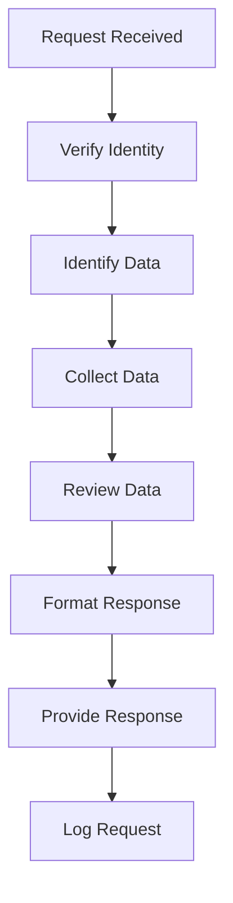

# Software Requirements Specification (SRS)

## Part 09B: Data Privacy & PII Compliance

**Module:** Security & Compliance Module (Part 10)
**Version:** 1.0.0
**Status:** Final / For Review
**Date:** 2026-06-30

---

## Chapter 1 – Overview

### Purpose

The Data Privacy & PII Compliance module defines the comprehensive framework for protecting personally identifiable information (PII) and ensuring compliance with global data protection regulations. This encompasses data classification, privacy controls, consent management, data subject rights, breach management, and regulatory compliance.

Data privacy is a fundamental right and a critical legal obligation. The platform processes vast amounts of personal data—customer names, addresses, phone numbers, payment information, location data, and order history. This module ensures that all personal data is collected, processed, stored, and deleted in compliance with applicable regulations, maintaining customer trust and avoiding legal penalties.

### Objectives

- Protect personally identifiable information (PII) throughout its lifecycle
- Ensure compliance with GDPR, CCPA, and other privacy regulations
- Enable data subject rights (access, rectification, deletion, portability)
- Maintain transparent privacy notices and consent mechanisms
- Implement data protection by design and by default
- Manage data breaches and notifications
- Provide privacy impact assessments
- Maintain comprehensive privacy documentation

---

## Chapter 2 – Privacy Framework

### PRIVACY-001 Applicable Regulations

| Regulation | Region | Applicability | Priority |
| :--- | :--- | :--- | :--- |
| **GDPR** | European Union | All EU residents | **Required** |
| **CCPA/CPRA** | California, USA | California residents | **Required** |
| **PIPEDA** | Canada | Canadian residents | **Required** |
| **Privacy Act** | Australia | Australian residents | **Required** |
| **LGPD** | Brazil | Brazilian residents | **Required** |
| **PDPA** | Singapore | Singapore residents | **Required** |
| **PDPL** | KSA | Saudi residents | **Required** |
| **UAE Data Protection Law** | UAE | UAE residents | **Required** |

### PRIVACY-002 Key Privacy Principles

| Principle | Description | Priority |
| :--- | :--- | :--- |
| **Lawfulness, Fairness, Transparency** | Process data lawfully and transparently | **Required** |
| **Purpose Limitation** | Collect data for specified, explicit purposes | **Required** |
| **Data Minimization** | Collect only necessary data | **Required** |
| **Accuracy** | Maintain accurate and up-to-date data | **Required** |
| **Storage Limitation** | Store data only as long as necessary | **Required** |
| **Integrity & Confidentiality** | Protect data from unauthorized access | **Required** |
| **Accountability** | Demonstrate compliance | **Required** |

### PRIVACY-003 Privacy Roles

| Role | Description | Priority |
| :--- | :--- | :--- |
| **Data Controller** | Determines purposes and means of processing | **Required** |
| **Data Processor** | Processes data on behalf of controller | **Required** |
| **Data Protection Officer (DPO)** | Oversees data protection compliance | **Required** |
| **Data Subject** | Individual whose data is processed | **Required** |

---

## Chapter 3 – Data Classification

### PRIVACY-004 Data Categories

| Category | Description | Examples | Sensitivity |
| :--- | :--- | :--- | :--- |
| **Personal Data** | Any information about an identified individual | Name, email, phone, address | **High** |
| **Sensitive Personal Data** | Special categories of personal data | Race, religion, health, biometrics | **Critical** |
| **Financial Data** | Payment and financial information | Credit card, bank account | **Critical** |
| **Location Data** | GPS and location information | Delivery address, GPS coordinates | **High** |
| **Behavioral Data** | User behavior and preferences | Order history, app usage | **Medium** |
| **Technical Data** | Technical information | IP address, device ID | **Medium** |

### PRIVACY-005 Data Classification Policy

| Classification | Definition | Controls |
| :--- | :--- | :--- |
| **Public** | Data that can be freely shared | No restrictions |
| **Internal** | Data intended for internal use | Access restricted to employees |
| **Confidential** | Data with privacy implications | Access restricted, encryption required |
| **Restricted** | Data with strict regulatory requirements | Strict access controls, encryption, audit logging |

### PRIVACY-006 Data Inventory

| Data Element | Category | Purpose | Retention | Legal Basis |
| :--- | :--- | :--- | :--- | :--- |
| **Customer Name** | Personal | Identification, communication | 7 years | Contract, Legal Obligation |
| **Customer Email** | Personal | Communication, authentication | 7 years | Contract, Legal Obligation |
| **Customer Phone** | Personal | Communication, OTP | 7 years | Contract, Legal Obligation |
| **Customer Address** | Personal | Delivery | 7 years | Contract, Legal Obligation |
| **Payment Card Token** | Financial | Payment processing | 7 years | Contract, Legal Obligation |
| **Order History** | Behavioral | Order fulfillment, analytics | 7 years | Contract, Legitimate Interest |
| **Location Data** | Personal | Delivery tracking | 90 days | Contract |
| **IP Address** | Technical | Security, analytics | 90 days | Legitimate Interest |
| **Device ID** | Technical | Authentication, analytics | 90 days | Legitimate Interest |

---

## Chapter 4 – Legal Basis for Processing

### PRIVACY-007 Legal Bases (GDPR)

| Legal Basis | Description | Applicable Processing |
| :--- | :--- | :--- |
| **Consent** | Individual has given clear consent | Marketing communications, cookies |
| **Contract** | Processing necessary for a contract | Order fulfillment, delivery |
| **Legal Obligation** | Processing necessary for compliance | Tax records, anti-fraud |
| **Legitimate Interest** | Processing necessary for legitimate interests | Analytics, security |
| **Public Interest** | Processing necessary for public interest | Law enforcement requests |
| **Vital Interest** | Processing necessary to protect life | Emergency situations |

### PRIVACY-008 Consent Management

| Feature | Description | Priority |
| :--- | :--- | :--- |
| **Consent Collection** | Obtain clear, informed consent | **Required** |
| **Consent Record** | Record consent with timestamp and details | **Required** |
| **Consent Withdrawal** | Allow easy withdrawal of consent | **Required** |
| **Consent Reconfirmation** | Reconfirm consent periodically | **Required** |
| **Granular Consent** | Separate consents for different purposes | **Required** |
| **Cookie Consent** | Cookie consent management | **Required** |

### PRIVACY-009 Consent Data Model

| Column | Type | Constraints | Description |
| :--- | :--- | :--- | :--- |
| `consent_id` | UUID | PRIMARY KEY | Unique identifier |
| `user_id` | UUID | FOREIGN KEY (users.user_id) | Associated user |
| `user_type` | VARCHAR(20) | NOT NULL | CUSTOMER/MERCHANT/DRIVER/ADMIN |
| `consent_type` | VARCHAR(50) | NOT NULL | MARKETING/COOKIES/ANALYTICS/PERSONALIZATION |
| `consent_value` | BOOLEAN | NOT NULL | Accepted or declined |
| `source` | VARCHAR(50) | | Where consent was given |
| `ip_address` | VARCHAR(45) | | IP address at consent time |
| `user_agent` | TEXT | | Browser/device at consent time |
| `granted_at` | TIMESTAMP | | Consent grant timestamp |
| `updated_at` | TIMESTAMP | | Last update timestamp |
| `expires_at` | TIMESTAMP | | Consent expiration timestamp |
| `withdrawn_at` | TIMESTAMP | | Withdrawal timestamp |

---

## Chapter 5 – Data Subject Rights

### PRIVACY-010 Data Subject Rights

| Right | Description | Response Time | Priority |
| :--- | :--- | :--- | :--- |
| **Right to Access** | Access personal data | 30 days | **Required** |
| **Right to Rectification** | Correct inaccurate data | 30 days | **Required** |
| **Right to Erasure** | Delete personal data | 30 days | **Required** |
| **Right to Restrict Processing** | Restrict processing | 30 days | **Required** |
| **Right to Data Portability** | Receive data in portable format | 30 days | **Required** |
| **Right to Object** | Object to processing | 30 days | **Required** |
| **Rights Related to Automated Decision-making** | Challenge automated decisions | 30 days | **Required** |

### PRIVACY-011 Subject Access Request (SAR) Workflow

### PRIVACY-012 SAR Data Model

| Column | Type | Constraints | Description |
| :--- | :--- | :--- | :--- |
| `request_id` | UUID | PRIMARY KEY | Unique identifier |
| `user_id` | UUID | FOREIGN KEY (users.user_id) | Associated user |
| `request_type` | VARCHAR(30) | NOT NULL | ACCESS/RECTIFICATION/ERASURE/RESTRICT/PORTABILITY/OBJECT |
| `status` | VARCHAR(20) | DEFAULT 'PENDING' | PENDING/IN_PROGRESS/COMPLETED/REJECTED |
| `response_data` | TEXT | | Response data (JSON/CSV) |
| `response_format` | VARCHAR(10) | | JSON/CSV/PDF |
| `requested_at` | TIMESTAMP | | Request timestamp |
| `verified_at` | TIMESTAMP | | Identity verification timestamp |
| `completed_at` | TIMESTAMP` | | Completion timestamp |
| `rejection_reason` | TEXT | | Reason if rejected |
| `created_at` | TIMESTAMP | DEFAULT NOW() | Creation timestamp |
| `updated_at` | TIMESTAMP | DEFAULT NOW() | Last update timestamp |

---

## Chapter 6 – Data Protection by Design

### PRIVACY-013 Privacy by Design Principles

| Principle | Description | Priority |
| :--- | :--- | :--- |
| **Proactive not Reactive** | Anticipate privacy risks | **Required** |
| **Privacy as Default** | Privacy by default settings | **Required** |
| **Privacy Embedded** | Privacy integrated into design | **Required** |
| **Full Functionality** | Positive-sum approach | **Required** |
| **End-to-End Security** | Full lifecycle security | **Required** |
| **Visibility and Transparency** | Open and transparent | **Required** |
| **Respect for User Privacy** | User-centric approach | **Required** |

### PRIVACY-014 Privacy Impact Assessment (PIA)

| Step | Description | Priority |
| :--- | :--- | :--- |
| **1. Identify** | Identify data processing activities | **Required** |
| **2. Map** | Map data flows and stakeholders | **Required** |
| **3. Assess** | Assess privacy risks | **Required** |
| **4. Mitigate** | Identify mitigation measures | **Required** |
| **5. Document** | Document findings and actions | **Required** |
| **6. Review** | Regular review and updates | **Required** |

### PRIVACY-015 PIA Data Model

| Column | Type | Constraints | Description |
| :--- | :--- | :--- | :--- |
| `pia_id` | UUID | PRIMARY KEY | Unique identifier |
| `pia_name` | VARCHAR(255) | NOT NULL | PIA name |
| `processing_activity` | TEXT | NOT NULL | Description of processing |
| `data_categories` | TEXT[] | | Categories of data |
| `data_subjects` | TEXT[] | | Categories of data subjects |
| `purpose` | TEXT | | Purpose of processing |
| `risks` | JSONB | | Identified risks |
| `mitigations` | JSONB | | Mitigation measures |
| `status` | VARCHAR(20) | DEFAULT 'DRAFT' | DRAFT/REVIEW/APPROVED/COMPLETED |
| `approved_by` | UUID | | Approver identifier |
| `approved_at` | TIMESTAMP | | Approval timestamp |
| `review_date` | DATE | | Next review date |
| `created_at` | TIMESTAMP | DEFAULT NOW() | Creation timestamp |
| `updated_at` | TIMESTAMP | DEFAULT NOW() | Last update timestamp |

---

## Chapter 7 – Data Retention & Deletion

### PRIVACY-016 Retention Schedules

| Data Type | Retention Period | Deletion Schedule | Legal Basis |
| :--- | :--- | :--- | :--- |
| **Customer Account Data** | 7 years after account closure | Annual batch deletion | Legal Obligation |
| **Order Data** | 7 years | Annual batch deletion | Legal Obligation |
| **Transaction Data** | 7 years | Annual batch deletion | Legal Obligation |
| **Payment Data** | 7 years | Annual batch deletion | Legal Obligation |
| **Communication Data** | 3 years | Quarterly batch deletion | Contract |
| **Marketing Data** | 5 years after consent withdrawal | Quarterly batch deletion | Consent |
| **Analytics Data** | 24 months | Monthly batch deletion | Legitimate Interest |
| **Log Data** | 90 days | Daily batch deletion | Security |
| **Audit Data** | 7 years | Annual batch deletion | Legal Obligation |

### PRIVACY-017 Data Deletion Workflow

1.  Retention period expires.
2.  System identifies data for deletion.
3.  Review queue created for manual review (if applicable).
4.  Data is securely deleted.
5.  Deletion is logged for audit.
6.  Deletion confirmation recorded.

### PRIVACY-018 Data Deletion Data Model

| Column | Type | Constraints | Description |
| :--- | :--- | :--- | :--- |
| `deletion_id` | UUID | PRIMARY KEY | Unique identifier |
| `data_type` | VARCHAR(50) | NOT NULL | Type of data deleted |
| `data_count` | INTEGER | | Number of records deleted |
| `retention_period` | INTEGER | | Retention period in days |
| `deletion_reason` | VARCHAR(50) | | EXPIRED/REQUESTED/LEGAL/OTHER |
| `user_id` | UUID | | User who requested deletion |
| `deleted_at` | TIMESTAMP | | Deletion timestamp |
| `verified_by` | UUID` | | Verifier identifier |
| `verified_at` | TIMESTAMP | | Verification timestamp |
| `created_at` | TIMESTAMP | DEFAULT NOW() | Creation timestamp |

---

## Chapter 8 – Data Security Controls

### PRIVACY-019 Technical Controls

| Control | Description | Priority |
| :--- | :--- | :--- |
| **Encryption at Rest** | Encrypt stored PII (AES-256) | **Required** |
| **Encryption in Transit** | Encrypt transmitted PII (TLS 1.3) | **Required** |
| **Access Control** | Restrict PII access to authorized personnel | **Required** |
| **Audit Logging** | Log all PII access | **Required** |
| **Data Masking** | Mask PII in non-production environments | **Required** |
| **Pseudonymization** | Replace identifiers with pseudonyms | **Required** |
| **Anonymization** | Irreversibly anonymize data | **Required** |
| **Data Loss Prevention** | Prevent unauthorized data exfiltration | **Required** |

### PRIVACY-020 Organizational Controls

| Control | Description | Priority |
| :--- | :--- | :--- |
| **Privacy Policy** | Clear, transparent privacy policy | **Required** |
| **Data Protection Training** | Employee training on data protection | **Required** |
| **Data Protection Agreements** | DPAs with processors | **Required** |
| **Incident Response Plan** | Plan for data breaches | **Required** |
| **Third-Party Assessment** | Assess third-party compliance | **Required** |

---

## Chapter 9 – Breach Management

### PRIVACY-021 Breach Management Framework

| Phase | Description | Priority |
| :--- | :--- | :--- |
| **Detection** | Detect data breach | **Required** |
| **Containment** | Contain the breach | **Required** |
| **Investigation** | Investigate scope and impact | **Required** |
| **Notification** | Notify affected parties and authorities | **Required** |
| **Remediation** | Fix the vulnerability | **Required** |
| **Review** | Review and improve | **Required** |

### PRIVACY-022 Breach Notification Timeline

| Requirement | Timeline | Priority |
| :--- | :--- | :--- |
| **Internal Detection** | Within 24 hours | **Required** |
| **Internal Escalation** | Within 48 hours | **Required** |
| **Data Protection Authority (GDPR)** | Within 72 hours | **Required** |
| **Data Protection Authority (CCPA)** | Without undue delay | **Required** |
| **Affected Individuals** | As soon as feasible | **Required** |

### PRIVACY-023 Breach Data Model

| Column | Type | Constraints | Description |
| :--- | :--- | :--- | :--- |
| `breach_id` | UUID | PRIMARY KEY | Unique identifier |
| `breach_type` | VARCHAR(30) | NOT NULL | DATA_LOSS/UNAUTHORIZED_ACCESS/INSIDER_THREAT/PHYSICAL |
| `description` | TEXT | NOT NULL | Breach description |
| `affected_data_types` | TEXT[] | | Types of data affected |
| `affected_users` | INTEGER | | Number of affected users |
| `detected_at` | TIMESTAMP | | Detection timestamp |
| `contained_at` | TIMESTAMP` | | Containment timestamp |
| `notified_at` | TIMESTAMP` | | Notification timestamp |
| `authorities_notified` | BOOLEAN | | Authority notification status |
| `individuals_notified` | BOOLEAN | | Individual notification status |
| `remediation_actions` | TEXT | | Remediation actions taken |
| `root_cause` | TEXT | | Root cause analysis |
| `preventive_actions` | TEXT | | Preventive actions |
| `status` | VARCHAR(20) | DEFAULT 'OPEN' | OPEN/INVESTIGATING/CONTAINED/RESOLVED/CLOSED |
| `reported_to_dpa` | BOOLEAN | | DPA notification status |
| `dpa_reference` | VARCHAR(100) | | DPA reference number |
| `created_at` | TIMESTAMP | DEFAULT NOW() | Creation timestamp |
| `updated_at` | TIMESTAMP | DEFAULT NOW() | Last update timestamp |

---

## Chapter 10 – Third-Party Data Processing

### PRIVACY-024 Processor Management

| Feature | Description | Priority |
| :--- | :--- | :--- |
| **Due Diligence** | Assess processor privacy practices | **Required** |
| **Data Processing Agreement** | Signed DPA with each processor | **Required** |
| **Subprocessor Approval** | Approve subprocessors | **Required** |
| **Audit Rights** | Right to audit processors | **Required** |
| **Data Transfer Impact Assessment** | DTIA for international transfers | **Required** |

### PRIVACY-025 DPA Data Model

| Column | Type | Constraints | Description |
| :--- | :--- | :--- | :--- |
| `dpa_id` | UUID | PRIMARY KEY | Unique identifier |
| `processor_name` | VARCHAR(255) | NOT NULL | Processor name |
| `processor_type` | VARCHAR(50) | NOT NULL | CLOUD/PAYMENT/ANALYTICS/SUPPORT/OTHER |
| `data_categories` | TEXT[] | | Categories of data processed |
| `processing_purpose` | TEXT | | Purpose of processing |
| `subprocessors` | TEXT[] | | Subprocessors used |
| `dpa_document_url` | VARCHAR(500) | | DPA document URL |
| `signed_date` | DATE | | DPA signed date |
| `expiry_date` | DATE` | | DPA expiry date |
| `status` | VARCHAR(20) | DEFAULT 'ACTIVE' | ACTIVE/EXPIRED/TERMINATED |
| `last_review` | DATE | | Last review date |
| `next_review` | DATE | | Next review date |
| `created_at` | TIMESTAMP | DEFAULT NOW() | Creation timestamp |
| `updated_at` | TIMESTAMP | DEFAULT NOW() | Last update timestamp |

---

## Chapter 11 – Database Tables

### privacy_consents

| Column | Type | Constraints | Description |
| :--- | :--- | :--- | :--- |
| `consent_id` | UUID | PRIMARY KEY | Unique identifier |
| `user_id` | UUID | FOREIGN KEY (users.user_id) | Associated user |
| `user_type` | VARCHAR(20) | NOT NULL | CUSTOMER/MERCHANT/DRIVER/ADMIN |
| `consent_type` | VARCHAR(50) | NOT NULL | MARKETING/COOKIES/ANALYTICS/PERSONALIZATION |
| `consent_value` | BOOLEAN | NOT NULL | Accepted or declined |
| `source` | VARCHAR(50) | | Where consent was given |
| `ip_address` | VARCHAR(45) | | IP address at consent time |
| `user_agent` | TEXT` | | Browser/device at consent time |
| `granted_at` | TIMESTAMP` | | Consent grant timestamp |
| `updated_at` | TIMESTAMP | | Last update timestamp |
| `expires_at` | TIMESTAMP` | | Consent expiration timestamp |
| `withdrawn_at` | TIMESTAMP` | | Withdrawal timestamp |

### subject_access_requests

| Column | Type | Constraints | Description |
| :--- | :--- | :--- | :--- |
| `request_id` | UUID | PRIMARY KEY | Unique identifier |
| `user_id` | UUID | FOREIGN KEY (users.user_id) | Associated user |
| `request_type` | VARCHAR(30) | NOT NULL | ACCESS/RECTIFICATION/ERASURE/RESTRICT/PORTABILITY/OBJECT |
| `status` | VARCHAR(20) | DEFAULT 'PENDING' | PENDING/IN_PROGRESS/COMPLETED/REJECTED |
| `response_data` | TEXT | | Response data (JSON/CSV) |
| `response_format` | VARCHAR(10) | | JSON/CSV/PDF |
| `requested_at` | TIMESTAMP | | Request timestamp |
| `verified_at` | TIMESTAMP | | Identity verification timestamp |
| `completed_at` | TIMESTAMP | | Completion timestamp |
| `rejection_reason` | TEXT | | Reason if rejected |
| `created_at` | TIMESTAMP | DEFAULT NOW() | Creation timestamp |
| `updated_at` | TIMESTAMP | DEFAULT NOW() | Last update timestamp |

### privacy_impact_assessments

| Column | Type | Constraints | Description |
| :--- | :--- | :--- | :--- |
| `pia_id` | UUID | PRIMARY KEY | Unique identifier |
| `pia_name` | VARCHAR(255) | NOT NULL | PIA name |
| `processing_activity` | TEXT | NOT NULL | Description of processing |
| `data_categories` | TEXT[] | | Categories of data |
| `data_subjects` | TEXT[] | | Categories of data subjects |
| `purpose` | TEXT | | Purpose of processing |
| `risks` | JSONB | | Identified risks |
| `mitigations` | JSONB | | Mitigation measures |
| `status` | VARCHAR(20) | DEFAULT 'DRAFT' | DRAFT/REVIEW/APPROVED/COMPLETED |
| `approved_by` | UUID` | | Approver identifier |
| `approved_at` | TIMESTAMP` | | Approval timestamp |
| `review_date` | DATE | | Next review date |
| `created_at` | TIMESTAMP | DEFAULT NOW() | Creation timestamp |
| `updated_at` | TIMESTAMP | DEFAULT NOW() | Last update timestamp |

### data_deletion_logs

| Column | Type | Constraints | Description |
| :--- | :--- | :--- | :--- |
| `deletion_id` | UUID | PRIMARY KEY | Unique identifier |
| `data_type` | VARCHAR(50) | NOT NULL | Type of data deleted |
| `data_count` | INTEGER | | Number of records deleted |
| `retention_period` | INTEGER | | Retention period in days |
| `deletion_reason` | VARCHAR(50) | | EXPIRED/REQUESTED/LEGAL/OTHER |
| `user_id` | UUID | | User who requested deletion |
| `deleted_at` | TIMESTAMP | | Deletion timestamp |
| `verified_by` | UUID` | | Verifier identifier |
| `verified_at` | TIMESTAMP` | | Verification timestamp |
| `created_at` | TIMESTAMP | DEFAULT NOW() | Creation timestamp |

### data_breaches

| Column | Type | Constraints | Description |
| :--- | :--- | :--- | :--- |
| `breach_id` | UUID | PRIMARY KEY | Unique identifier |
| `breach_type` | VARCHAR(30) | NOT NULL | DATA_LOSS/UNAUTHORIZED_ACCESS/INSIDER_THREAT/PHYSICAL |
| `description` | TEXT | NOT NULL | Breach description |
| `affected_data_types` | TEXT[] | | Types of data affected |
| `affected_users` | INTEGER | | Number of affected users |
| `detected_at` | TIMESTAMP | | Detection timestamp |
| `contained_at` | TIMESTAMP | | Containment timestamp |
| `notified_at` | TIMESTAMP | | Notification timestamp |
| `authorities_notified` | BOOLEAN` | | Authority notification status |
| `individuals_notified` | BOOLEAN` | | Individual notification status |
| `remediation_actions` | TEXT` | | Remediation actions taken |
| `root_cause` | TEXT` | | Root cause analysis |
| `preventive_actions` | TEXT` | | Preventive actions |
| `status` | VARCHAR(20) | DEFAULT 'OPEN' | OPEN/INVESTIGATING/CONTAINED/RESOLVED/CLOSED |
| `reported_to_dpa` | BOOLEAN` | | DPA notification status |
| `dpa_reference` | VARCHAR(100)` | | DPA reference number |
| `created_at` | TIMESTAMP | DEFAULT NOW() | Creation timestamp |
| `updated_at` | TIMESTAMP | DEFAULT NOW() | Last update timestamp |

### data_processing_agreements

| Column | Type | Constraints | Description |
| :--- | :--- | :--- | :--- |
| `dpa_id` | UUID | PRIMARY KEY | Unique identifier |
| `processor_name` | VARCHAR(255) | NOT NULL | Processor name |
| `processor_type` | VARCHAR(50) | NOT NULL | CLOUD/PAYMENT/ANALYTICS/SUPPORT/OTHER |
| `data_categories` | TEXT[] | | Categories of data processed |
| `processing_purpose` | TEXT | | Purpose of processing |
| `subprocessors` | TEXT[] | | Subprocessors used |
| `dpa_document_url` | VARCHAR(500) | | DPA document URL |
| `signed_date` | DATE | | DPA signed date |
| `expiry_date` | DATE | | DPA expiry date |
| `status` | VARCHAR(20) | DEFAULT 'ACTIVE' | ACTIVE/EXPIRED/TERMINATED |
| `last_review` | DATE | | Last review date |
| `next_review` | DATE | | Next review date |
| `created_at` | TIMESTAMP | DEFAULT NOW() | Creation timestamp |
| `updated_at` | TIMESTAMP | DEFAULT NOW() | Last update timestamp |

---

## Chapter 12 – REST APIs

### Consent APIs

| Method | Endpoint | Description |
| :--- | :--- | :--- |
| `GET` | `/api/v1/privacy/consents` | Get user consents |
| `PUT` | `/api/v1/privacy/consents` | Update user consents |
| `POST` | `/api/v1/privacy/consents` | Record consent |

### Subject Access Request APIs

| Method | Endpoint | Description |
| :--- | :--- | :--- |
| `POST` | `/api/v1/privacy/sar` | Submit subject access request |
| `GET` | `/api/v1/privacy/sar` | Get SAR status |
| `GET` | `/api/v1/privacy/sar/{id}` | Get SAR details |
| `GET` | `/api/v1/privacy/sar/{id}/download` | Download SAR response |

### Breach APIs

| Method | Endpoint | Description |
| :--- | :--- | :--- |
| `POST` | `/api/v1/admin/privacy/breach` | Report data breach |
| `GET` | `/api/v1/admin/privacy/breach` | List data breaches |
| `GET` | `/api/v1/admin/privacy/breach/{id}` | Get breach details |
| `PUT` | `/api/v1/admin/privacy/breach/{id}` | Update breach |
| `PUT` | `/api/v1/admin/privacy/breach/{id}/resolve` | Resolve breach |

### Privacy APIs

| Method | Endpoint | Description |
| :--- | :--- | :--- |
| `GET` | `/api/v1/privacy/policy` | Get privacy policy |
| `GET` | `/api/v1/privacy/rights` | Get data subject rights information |
| `GET` | `/api/v1/admin/privacy/pia` | List PIAs |
| `POST` | `/api/v1/admin/privacy/pia` | Create PIA |
| `GET` | `/api/v1/admin/privacy/pia/{id}` | Get PIA details |
| `PUT` | `/api/v1/admin/privacy/pia/{id}` | Update PIA |

---

## Chapter 13 – Business Rules

| Rule ID | Rule Description | Priority |
| :--- | :--- | :--- |
| **BR-PRIVACY-001** | PII must be encrypted at rest (AES-256) and in transit (TLS 1.3). | **High** |
| **BR-PRIVACY-002** | Consent must be obtained before processing personal data. | **High** |
| **BR-PRIVACY-003** | Data subject requests must be responded to within 30 days. | **High** |
| **BR-PRIVACY-004** | Data breaches must be reported within 72 hours (GDPR). | **High** |
| **BR-PRIVACY-005** | PII must be retained only as long as necessary. | **High** |
| **BR-PRIVACY-006** | Data processing agreements must be in place with all processors. | **High** |
| **BR-PRIVACY-007** | PII must be masked in non-production environments. | **High** |
| **BR-PRIVACY-008** | Privacy Impact Assessments must be conducted for high-risk processing. | **High** |
| **BR-PRIVACY-009** | Employees must complete data protection training annually. | **High** |
| **BR-PRIVACY-010** | Data deletion must be verifiable and auditable. | **High** |

---

## Chapter 14 – Acceptance Tests

| Test ID | Test Description | Priority |
| :--- | :--- | :--- |
| **TEST-PRIVACY-001** | PII encrypted at rest. | **High** |
| **TEST-PRIVACY-002** | PII encrypted in transit. | **High** |
| **TEST-PRIVACY-003** | Consent collected for marketing communications. | **High** |
| **TEST-PRIVACY-004** | Consent withdrawal removes marketing data. | **High** |
| **TEST-PRIVACY-005** | Subject access request submitted and processed. | **High** |
| **TEST-PRIVACY-006** | Data rectification request processed. | **High** |
| **TEST-PRIVACY-007** | Data erasure request processed. | **High** |
| **TEST-PRIVACY-008** | Data portability request processed. | **High** |
| **TEST-PRIVACY-009** | Data retention policy enforced. | **High** |
| **TEST-PRIVACY-010** | Data deletion verified and logged. | **High** |
| **TEST-PRIVACY-011** | Data breach detected and contained. | **High** |
| **TEST-PRIVACY-012** | Data breach notification sent to DPA. | **High** |
| **TEST-PRIVACY-013** | Data breach notification sent to affected individuals. | **High** |
| **TEST-PRIVACY-014** | Privacy Impact Assessment completed. | **High** |
| **TEST-PRIVACY-015** | Data Processing Agreement in place with processor. | **High** |
| **TEST-PRIVACY-016** | PII masked in non-production environment. | **High** |
| **TEST-PRIVACY-017** | Access to PII restricted and logged. | **High** |
| **TEST-PRIVACY-018** | Data protection training completed by employees. | **High** |
| **TEST-PRIVACY-019** | Privacy policy displayed to users. | **High** |
| **TEST-PRIVACY-020** | Cookie consent collected. | **High** |

---

## Chapter 15 – Traceability Matrix

| Requirement | Database Table | API Endpoint(s) | Acceptance Test |
| :--- | :--- | :--- | :--- |
| PRIVACY-008 | privacy_consents | GET/PUT /api/v1/privacy/consents | TEST-PRIVACY-003, TEST-PRIVACY-004 |
| PRIVACY-011 | subject_access_requests | POST /api/v1/privacy/sar | TEST-PRIVACY-005, TEST-PRIVACY-006, TEST-PRIVACY-007, TEST-PRIVACY-008 |
| PRIVACY-016 | data_deletion_logs | Internal | TEST-PRIVACY-009, TEST-PRIVACY-010 |
| PRIVACY-021 | data_breaches | POST /api/v1/admin/privacy/breach | TEST-PRIVACY-011, TEST-PRIVACY-012, TEST-PRIVACY-013 |
| PRIVACY-014 | privacy_impact_assessments | POST /api/v1/admin/privacy/pia | TEST-PRIVACY-014 |
| PRIVACY-024 | data_processing_agreements | GET /api/v1/admin/privacy/dpa | TEST-PRIVACY-015 |
| PRIVACY-019 | data_classification | Internal | TEST-PRIVACY-001, TEST-PRIVACY-002, TEST-PRIVACY-016, TEST-PRIVACY-017 |

---

## Chapter 16 – Summary

This document establishes the complete data privacy and PII compliance capability for the **[Platform Name]** platform. Key takeaways:

- **Regulatory Compliance:** GDPR, CCPA, PIPEDA, Privacy Act, LGPD, PDPA, PDPL, and UAE Data Protection Law.
- **Data Classification:** Comprehensive classification of all data types with appropriate controls.
- **Consent Management:** Granular consent collection, recording, withdrawal, and reconfirmation.
- **Data Subject Rights:** Access, rectification, erasure, restriction, portability, and objection with 30-day response SLA.
- **Privacy by Design:** Proactive privacy integration, default privacy settings, and Privacy Impact Assessments.
- **Data Retention & Deletion:** Clear retention schedules and verifiable deletion processes.
- **Security Controls:** Encryption at rest and in transit, access control, audit logging, data masking, and pseudonymization.
- **Breach Management:** Detection, containment, notification (72 hours for GDPR), remediation, and review.
- **Third-Party Management:** Due diligence, Data Processing Agreements, subprocessor approval, and audit rights.

The data privacy and PII compliance module ensures that the platform protects personal data, respects individual privacy rights, and complies with applicable regulations.

---

**Next Document:**

`Part_09C_Security_Monitoring.md`

*(This builds on data privacy to define security monitoring and threat detection capabilities.)*
