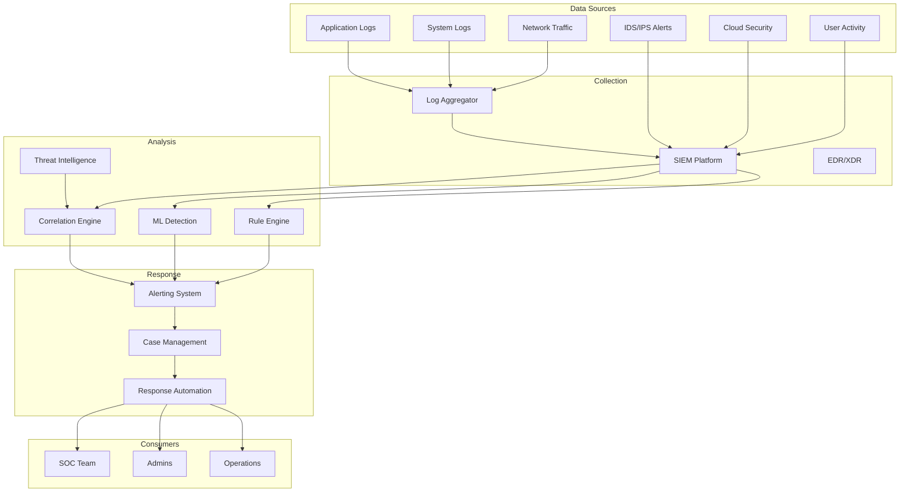

# Software Requirements Specification (SRS)

## Part 09C: Security Monitoring

**Module:** Security & Compliance Module (Part 10)
**Version:** 1.0.0
**Status:** Final / For Review
**Date:** 2026-06-30

---

## Chapter 1 – Overview

### Purpose

The Security Monitoring module defines the comprehensive framework for detecting, analyzing, and responding to security threats across the **[Platform Name]** platform. This encompasses real-time security monitoring, threat detection, incident response, vulnerability management, and security analytics.

Security monitoring is the active defense layer of the platform. Continuous monitoring enables rapid detection of security incidents, minimizes dwell time, and reduces the impact of breaches. This module ensures that the platform can identify and respond to security threats in real-time, protecting customer data and platform integrity.

### Objectives

- Monitor all systems for security threats in real-time
- Detect and alert on suspicious activities
- Enable rapid incident response
- Identify and remediate vulnerabilities
- Maintain security compliance
- Provide security analytics and reporting
- Continuous improvement of security posture
- Ensure 24/7 security coverage

---

## Chapter 2 – Security Monitoring Architecture

### SECMON-001 Architecture Overview

### SECMON-002 Monitoring Components

| Component | Description | Priority |
| :--- | :--- | :--- |
| **SIEM Platform** | Centralized security information and event management | **Required** |
| **EDR/XDR** | Endpoint detection and response | **Required** |
| **IDS/IPS** | Intrusion detection/prevention system | **Required** |
| **Log Aggregation** | Centralized log collection and storage | **Required** |
| **Correlation Engine** | Event correlation and pattern detection | **Required** |
| **ML Detection** | Machine learning-based anomaly detection | **Required** |
| **Threat Intelligence** | External threat intelligence integration | **Required** |
| **Alerting System** | Real-time alert generation and routing | **Required** |
| **Case Management** | Incident investigation and response | **Required** |

---

## Chapter 3 – Logging & Collection

### SECMON-003 Log Types

| Log Type | Source | Retention | Priority |
| :--- | :--- | :--- | :--- |
| **Application Logs** | All microservices | 90 days | **Required** |
| **System Logs** | Operating systems | 90 days | **Required** |
| **Security Logs** | Security devices | 365 days | **Required** |
| **Authentication Logs** | Auth service | 365 days | **Required** |
| **Access Logs** | API gateway, load balancers | 90 days | **Required** |
| **Database Logs** | Database servers | 90 days | **Required** |
| **Network Logs** | Firewalls, routers | 90 days | **Required** |
| **Cloud Logs** | Cloud provider logs | 90 days | **Required** |
| **Endpoint Logs** | EDR agents | 90 days | **Required** |

### SECMON-004 Log Collection Requirements

| Requirement | Specification | Priority |
| :--- | :--- | :--- |
| **Collection Method** | Agent-based, Syslog, API | **Required** |
| **Transport** | TLS 1.3 encrypted | **Required** |
| **Format** | Structured (JSON) | **Required** |
| **Timestamp** | ISO 8601 UTC | **Required** |
| **Aggregation** | Centralized SIEM | **Required** |
| **Backup** | Long-term cold storage | **Required** |
| **Immutable** | Write-once, append-only | **Required** |

### SECMON-005 Log Data Model

| Column | Type | Required | Description |
| :--- | :--- | :--- | :--- |
| `log_id` | UUID | Yes | Unique identifier |
| `source` | String | Yes | Log source (service, host) |
| `source_type` | String | Yes | APPLICATION/SYSTEM/SECURITY/NETWORK/ACCESS |
| `event_type` | String | Yes | Event category |
| `event_name` | String | Yes | Event name |
| `severity` | String | Yes | INFO/WARNING/ERROR/CRITICAL |
| `message` | Text | Yes | Log message |
| `user_id` | UUID | | Associated user |
| `ip_address` | String | | Client IP address |
| `session_id` | String | | Session identifier |
| `request_id` | String | | Request correlation ID |
| `metadata` | JSONB | | Additional context |
| `timestamp` | Timestamp | Yes | Event timestamp |
| `ingested_at` | Timestamp | | Ingestion timestamp |

---

## Chapter 4 – Threat Detection

### SECMON-006 Detection Methods

| Method | Description | Priority |
| :--- | :--- | :--- |
| **Signature-Based** | Known threat pattern matching | **Required** |
| **Anomaly Detection** | Baseline deviation identification | **Required** |
| **Behavioral Analysis** | User/entity behavior analytics | **Required** |
| **Machine Learning** | ML-based threat identification | **Required** |
| **Threat Intelligence** | External threat intelligence | **Required** |
| **Correlation** | Cross-event correlation | **Required** |

### SECMON-007 Detection Use Cases

| Use Case | Description | Priority |
| :--- | :--- | :--- |
| **Unusual Login** | Login from unusual location/time/device | **Required** |
| **Multiple Failed Logins** | Brute force detection | **Required** |
| **Privilege Escalation** | Unauthorized privilege changes | **Required** |
| **Data Exfiltration** | Large data transfers | **Required** |
| **Malware Detection** | Malware signature/behavior match | **Required** |
| **Unauthorized Access** | Access without authorization | **Required** |
| **Configuration Changes** | Unauthorized config changes | **Required** |
| **API Abuse** | Rate limit violations, suspicious patterns | **Required** |
| **Payment Fraud** | Suspicious payment patterns | **Required** |
| **Account Takeover** | Indicators of compromise | **Required** |

### SECMON-008 Alert Severity

| Severity | Description | Response Time | Priority |
| :--- | :--- | :--- | :--- |
| **Critical** | Confirmed breach, data loss | < 5 min | **Required** |
| **High** | Likely breach, significant risk | < 15 min | **Required** |
| **Medium** | Suspicious activity, potential risk | < 1 hour | **Required** |
| **Low** | Informational, minor risk | < 4 hours | **Required** |

### SECMON-009 Alert Data Model

| Column | Type | Constraints | Description |
| :--- | :--- | :--- | :--- |
| `alert_id` | UUID | PRIMARY KEY | Unique identifier |
| `alert_name` | VARCHAR(100) | NOT NULL | Alert name |
| `alert_type` | VARCHAR(50) | NOT NULL | Login/Privilege/Network/System/Fraud |
| `severity` | VARCHAR(20) | NOT NULL | CRITICAL/HIGH/MEDIUM/LOW |
| `description` | TEXT | NOT NULL | Alert description |
| `source` | VARCHAR(100) | | Source of alert |
| `affected_entity` | VARCHAR(100) | | Affected user/system |
| `indicator` | VARCHAR(255) | | Threat indicator |
| `status` | VARCHAR(20) | DEFAULT 'OPEN' | OPEN/INVESTIGATING/MITIGATED/RESOLVED/FALSE_POSITIVE |
| `assigned_to` | UUID | | Assigned analyst |
| `investigated_at` | TIMESTAMP | | Investigation timestamp |
| `mitigated_at` | TIMESTAMP` | | Mitigation timestamp |
| `resolved_at` | TIMESTAMP` | | Resolution timestamp |
| `created_at` | TIMESTAMP | DEFAULT NOW() | Creation timestamp |
| `updated_at` | TIMESTAMP | DEFAULT NOW() | Last update timestamp |

---

## Chapter 5 – Vulnerability Management

### SECMON-010 Vulnerability Management Program

| Phase | Description | Frequency | Priority |
| :--- | :--- | :--- | :--- |
| **Discovery** | Identify vulnerabilities | Continuous | **Required** |
| **Assessment** | Assess severity and risk | Continuous | **Required** |
| **Prioritization** | Prioritize remediation | Continuous | **Required** |
| **Remediation** | Fix vulnerabilities | Scheduled | **Required** |
| **Verification** | Verify fixes | Scheduled | **Required** |
| **Reporting** | Report on vulnerability status | Weekly | **Required** |

### SECMON-011 Vulnerability Scanning

| Scan Type | Description | Frequency | Priority |
| :--- | :--- | :--- | :--- |
| **Infrastructure** | Network, server, cloud infrastructure | Daily | **Required** |
| **Application** | Web applications, APIs | Daily | **Required** |
| **Container** | Container images | Per build | **Required** |
| **Dependency** | Software dependencies | Per build | **Required** |
| **Code** | Static application security testing (SAST) | Per build | **Required** |
| **Secret** | Secret and credential scanning | Per build | **Required** |

### SECMON-012 Vulnerability Severity

| Severity | Description | SLA | Priority |
| :--- | :--- | :--- | :--- |
| **Critical** | Remote code execution, data breach | < 24 hours | **Required** |
| **High** | Significant security impact | < 72 hours | **Required** |
| **Medium** | Moderate security impact | < 1 week | **Required** |
| **Low** | Minor security impact | < 1 month | **Required** |

### SECMON-013 Vulnerability Data Model

| Column | Type | Constraints | Description |
| :--- | :--- | :--- | :--- |
| `vulnerability_id` | UUID | PRIMARY KEY | Unique identifier |
| `cve_id` | VARCHAR(50) | | CVE identifier |
| `title` | VARCHAR(255) | NOT NULL | Vulnerability title |
| `description` | TEXT | | Vulnerability description |
| `severity` | VARCHAR(20) | NOT NULL | CRITICAL/HIGH/MEDIUM/LOW |
| `cvss_score` | DECIMAL(3, 1) | | CVSS score |
| `affected_asset` | VARCHAR(255) | | Affected asset |
| `affected_component` | VARCHAR(100) | | Affected component |
| `remediation` | TEXT` | | Remediation steps |
| `status` | VARCHAR(20) | DEFAULT 'OPEN' | OPEN/IN_PROGRESS/REMEDIATED/VERIFIED/WONT_FIX |
| `assigned_to` | UUID | | Assigned owner |
| `detected_at` | TIMESTAMP` | | Detection timestamp |
| `remediated_at` | TIMESTAMP` | | Remediation timestamp |
| `verified_at` | TIMESTAMP` | | Verification timestamp |
| `created_at` | TIMESTAMP | DEFAULT NOW() | Creation timestamp |
| `updated_at` | TIMESTAMP | DEFAULT NOW() | Last update timestamp |

---

## Chapter 6 – Incident Response

### SECMON-014 Incident Response Framework

| Phase | Description | Priority |
| :--- | :--- | :--- |
| **Preparation** | IR planning and readiness | **Required** |
| **Detection** | Detect security incidents | **Required** |
| **Containment** | Contain the incident | **Required** |
| **Eradication** | Remove the threat | **Required** |
| **Recovery** | Restore systems | **Required** |
| **Lessons Learned** | Post-incident review | **Required** |

### SECMON-015 Incident Severity

| Level | Description | Response | Priority |
| :--- | :--- | :--- | :--- |
| **S1** | Data breach, service outage | Immediate, all hands | **Required** |
| **S2** | Significant security incident | < 15 min | **Required** |
| **S3** | Moderate security incident | < 1 hour | **Required** |
| **S4** | Minor security incident | < 4 hours | **Required** |

### SECMON-016 Incident Response Plan

| Phase | Activities | Priority |
| :--- | :--- | :--- |
| **Detection** | Alert triage, verification, scoping | **Required** |
| **Containment** | Isolate affected systems, block threats | **Required** |
| **Eradication** | Remove malware, patch vulnerabilities | **Required** |
| **Recovery** | Restore systems, validate integrity | **Required** |
| **Notification** | Notify affected parties, authorities | **Required** |
| **Post-Incident** | Root cause analysis, lessons learned | **Required** |

### SECMON-017 Incident Data Model

| Column | Type | Constraints | Description |
| :--- | :--- | :--- | :--- |
| `incident_id` | UUID | PRIMARY KEY | Unique identifier |
| `incident_name` | VARCHAR(255) | NOT NULL | Incident name |
| `incident_type` | VARCHAR(50) | NOT NULL | BREACH/MALWARE/UNAUTHORIZED_ACCESS/DOS/DATA_LOSS/INSIDER |
| `severity` | VARCHAR(20) | NOT NULL | S1/S2/S3/S4 |
| `description` | TEXT | NOT NULL | Incident description |
| `status` | VARCHAR(20) | DEFAULT 'OPEN' | OPEN/INVESTIGATING/CONTAINING/ERADICATING/RECOVERING/RESOLVED |
| `detected_at` | TIMESTAMP | | Detection timestamp |
| `contained_at` | TIMESTAMP` | | Containment timestamp |
| `eradicated_at` | TIMESTAMP` | | Eradication timestamp |
| `recovered_at` | TIMESTAMP` | | Recovery timestamp |
| `resolved_at` | TIMESTAMP` | | Resolution timestamp |
| `response_lead` | UUID | | Response lead identifier |
| `response_team` | TEXT[] | | Response team members |
| `root_cause` | TEXT | | Root cause analysis |
| `impact` | TEXT | | Business impact |
| `remediation` | TEXT | | Remediation actions |
| `lessons_learned` | TEXT | | Lessons learned |
| `created_at` | TIMESTAMP | DEFAULT NOW() | Creation timestamp |
| `updated_at` | TIMESTAMP | DEFAULT NOW() | Last update timestamp |

---

## Chapter 7 – Threat Intelligence

### SECMON-018 Threat Intelligence Sources

| Source | Type | Priority |
| :--- | :--- | :--- |
| **STIX/TAXII Feeds** | Structured threat intelligence | **Required** |
| **OSINT** | Open source intelligence | **Required** |
| **ISACs** | Information sharing and analysis centers | **Required** |
| **Commercial Feeds** | Commercial threat intelligence | **Required** |
| **Internal Intelligence** | Platform-specific threat data | **Required** |

### SECMON-019 Threat Intelligence Integration

| Integration | Description | Priority |
| :--- | :--- | :--- |
| **Indicator Feed** | Import threat indicators | **Required** |
| **Correlation** | Correlate with platform events | **Required** |
| **Alert Enrichment** | Enrich alerts with intelligence | **Required** |
| **Blocklist** | Automatically block threats | **Required** |
| **Watchlist** | Monitor for threats | **Required** |

### SECMON-020 Threat Intelligence Data Model

| Column | Type | Constraints | Description |
| :--- | :--- | :--- | :--- |
| `intel_id` | UUID | PRIMARY KEY | Unique identifier |
| `indicator_type` | VARCHAR(30) | NOT NULL | IP/DOMAIN/URL/HASH/EMAIL |
| `indicator_value` | VARCHAR(255) | NOT NULL | Indicator value |
| `confidence` | INTEGER | | Confidence level (0-100) |
| `severity` | VARCHAR(20) | | Severity level |
| `source` | VARCHAR(50) | | Intelligence source |
| `reference` | VARCHAR(500) | | Reference URL |
| `first_seen` | TIMESTAMP | | First seen timestamp |
| `last_seen` | TIMESTAMP | | Last seen timestamp |
| `expires_at` | TIMESTAMP` | | Expiration timestamp |
| `is_active` | BOOLEAN | DEFAULT TRUE | Active status |
| `created_at` | TIMESTAMP | DEFAULT NOW() | Creation timestamp |
| `updated_at` | TIMESTAMP | DEFAULT NOW() | Last update timestamp |

---

## Chapter 8 – Compliance Monitoring

### SECMON-021 Compliance Monitoring Areas

| Area | Description | Priority |
| :--- | :--- | :--- |
| **PCI DSS** | Payment card industry compliance | **Required** |
| **SOC 2** | Service organization control | **Required** |
| **ISO 27001** | Information security management | **Required** |
| **GDPR** | Data protection compliance | **Required** |
| **CCPA** | California privacy compliance | **Required** |
| **Access Control** | Access control compliance | **Required** |
| **Data Protection** | Data protection compliance | **Required** |

### SECMON-022 Compliance Controls

| Control | Description | Monitoring | Priority |
| :--- | :--- | :--- | :--- |
| **Access Review** | Regular access review | Quarterly | **Required** |
| **Password Policy** | Password policy compliance | Continuous | **Required** |
| **MFA Enforcement** | MFA usage monitoring | Continuous | **Required** |
| **Data Encryption** | Encryption compliance | Continuous | **Required** |
| **Log Retention** | Log retention compliance | Continuous | **Required** |
| **Vulnerability Management** | VM program compliance | Continuous | **Required** |

---

## Chapter 9 – Database Tables

### security_alerts

| Column | Type | Constraints | Description |
| :--- | :--- | :--- | :--- |
| `alert_id` | UUID | PRIMARY KEY | Unique identifier |
| `alert_name` | VARCHAR(100) | NOT NULL | Alert name |
| `alert_type` | VARCHAR(50) | NOT NULL | Login/Privilege/Network/System/Fraud |
| `severity` | VARCHAR(20) | NOT NULL | CRITICAL/HIGH/MEDIUM/LOW |
| `description` | TEXT | NOT NULL | Alert description |
| `source` | VARCHAR(100) | | Source of alert |
| `affected_entity` | VARCHAR(100) | | Affected user/system |
| `indicator` | VARCHAR(255) | | Threat indicator |
| `status` | VARCHAR(20) | DEFAULT 'OPEN' | OPEN/INVESTIGATING/MITIGATED/RESOLVED/FALSE_POSITIVE |
| `assigned_to` | UUID | | Assigned analyst |
| `investigated_at` | TIMESTAMP` | | Investigation timestamp |
| `mitigated_at` | TIMESTAMP` | | Mitigation timestamp |
| `resolved_at` | TIMESTAMP` | | Resolution timestamp |
| `created_at` | TIMESTAMP | DEFAULT NOW() | Creation timestamp |
| `updated_at` | TIMESTAMP | DEFAULT NOW() | Last update timestamp |

### security_incidents

| Column | Type | Constraints | Description |
| :--- | :--- | :--- | :--- |
| `incident_id` | UUID | PRIMARY KEY | Unique identifier |
| `incident_name` | VARCHAR(255) | NOT NULL | Incident name |
| `incident_type` | VARCHAR(50) | NOT NULL | BREACH/MALWARE/UNAUTHORIZED_ACCESS/DOS/DATA_LOSS/INSIDER |
| `severity` | VARCHAR(20) | NOT NULL | S1/S2/S3/S4 |
| `description` | TEXT | NOT NULL | Incident description |
| `status` | VARCHAR(20) | DEFAULT 'OPEN' | OPEN/INVESTIGATING/CONTAINING/ERADICATING/RECOVERING/RESOLVED |
| `detected_at` | TIMESTAMP` | | Detection timestamp |
| `contained_at` | TIMESTAMP` | | Containment timestamp |
| `eradicated_at` | TIMESTAMP` | | Eradication timestamp |
| `recovered_at` | TIMESTAMP` | | Recovery timestamp |
| `resolved_at` | TIMESTAMP` | | Resolution timestamp |
| `response_lead` | UUID | | Response lead identifier |
| `response_team` | TEXT[] | | Response team members |
| `root_cause` | TEXT | | Root cause analysis |
| `impact` | TEXT | | Business impact |
| `remediation` | TEXT | | Remediation actions |
| `lessons_learned` | TEXT | | Lessons learned |
| `created_at` | TIMESTAMP | DEFAULT NOW() | Creation timestamp |
| `updated_at` | TIMESTAMP | DEFAULT NOW() | Last update timestamp |

### vulnerabilities

| Column | Type | Constraints | Description |
| :--- | :--- | :--- | :--- |
| `vulnerability_id` | UUID | PRIMARY KEY | Unique identifier |
| `cve_id` | VARCHAR(50) | | CVE identifier |
| `title` | VARCHAR(255) | NOT NULL | Vulnerability title |
| `description` | TEXT | | Vulnerability description |
| `severity` | VARCHAR(20) | NOT NULL | CRITICAL/HIGH/MEDIUM/LOW |
| `cvss_score` | DECIMAL(3, 1) | | CVSS score |
| `affected_asset` | VARCHAR(255) | | Affected asset |
| `affected_component` | VARCHAR(100) | | Affected component |
| `remediation` | TEXT` | | Remediation steps |
| `status` | VARCHAR(20) | DEFAULT 'OPEN' | OPEN/IN_PROGRESS/REMEDIATED/VERIFIED/WONT_FIX |
| `assigned_to` | UUID | | Assigned owner |
| `detected_at` | TIMESTAMP` | | Detection timestamp |
| `remediated_at` | TIMESTAMP` | | Remediation timestamp |
| `verified_at` | TIMESTAMP` | | Verification timestamp |
| `created_at` | TIMESTAMP | DEFAULT NOW() | Creation timestamp |
| `updated_at` | TIMESTAMP | DEFAULT NOW() | Last update timestamp |

### threat_intelligence

| Column | Type | Constraints | Description |
| :--- | :--- | :--- | :--- |
| `intel_id` | UUID | PRIMARY KEY | Unique identifier |
| `indicator_type` | VARCHAR(30) | NOT NULL | IP/DOMAIN/URL/HASH/EMAIL |
| `indicator_value` | VARCHAR(255) | NOT NULL | Indicator value |
| `confidence` | INTEGER | | Confidence level (0-100) |
| `severity` | VARCHAR(20) | | Severity level |
| `source` | VARCHAR(50) | | Intelligence source |
| `reference` | VARCHAR(500) | | Reference URL |
| `first_seen` | TIMESTAMP` | | First seen timestamp |
| `last_seen` | TIMESTAMP` | | Last seen timestamp |
| `expires_at` | TIMESTAMP` | | Expiration timestamp |
| `is_active` | BOOLEAN | DEFAULT TRUE | Active status |
| `created_at` | TIMESTAMP | DEFAULT NOW() | Creation timestamp |
| `updated_at` | TIMESTAMP | DEFAULT NOW() | Last update timestamp |

### security_scan_results

| Column | Type | Constraints | Description |
| :--- | :--- | :--- | :--- |
| `scan_id` | UUID | PRIMARY KEY | Unique identifier |
| `scan_type` | VARCHAR(30) | NOT NULL | INFRASTRUCTURE/APPLICATION/CONTAINER/DEPENDENCY/SAST/SECRET |
| `scan_target` | VARCHAR(255) | | Scan target |
| `status` | VARCHAR(20) | DEFAULT 'RUNNING' | PENDING/RUNNING/COMPLETED/FAILED |
| `total_findings` | INTEGER | | Total findings |
| `critical_findings` | INTEGER | | Critical findings |
| `high_findings` | INTEGER | | High findings |
| `medium_findings` | INTEGER` | | Medium findings |
| `low_findings` | INTEGER` | | Low findings |
| `report_url` | VARCHAR(500) | | Report URL |
| `started_at` | TIMESTAMP` | | Scan start timestamp |
| `completed_at` | TIMESTAMP` | | Scan completion timestamp |
| `created_at` | TIMESTAMP | DEFAULT NOW() | Creation timestamp |
| `updated_at` | TIMESTAMP | DEFAULT NOW() | Last update timestamp |

---

## Chapter 10 – REST APIs

### Alert APIs

| Method | Endpoint | Description |
| :--- | :--- | :--- |
| `GET` | `/api/v1/security/alerts` | List security alerts |
| `GET` | `/api/v1/security/alerts/{id}` | Get alert details |
| `PUT` | `/api/v1/security/alerts/{id}/status` | Update alert status |
| `PUT` | `/api/v1/security/alerts/{id}/assign` | Assign alert to analyst |
| `POST` | `/api/v1/security/alerts/{id}/investigate` | Investigate alert |
| `POST` | `/api/v1/security/alerts/{id}/mitigate` | Mitigate alert |
| `POST` | `/api/v1/security/alerts/{id}/resolve` | Resolve alert |

### Incident APIs

| Method | Endpoint | Description |
| :--- | :--- | :--- |
| `GET` | `/api/v1/security/incidents` | List security incidents |
| `GET` | `/api/v1/security/incidents/{id}` | Get incident details |
| `POST` | `/api/v1/security/incidents` | Create incident |
| `PUT` | `/api/v1/security/incidents/{id}` | Update incident |
| `PUT` | `/api/v1/security/incidents/{id}/status` | Update incident status |
| `POST` | `/api/v1/security/incidents/{id}/contain` | Contain incident |
| `POST` | `/api/v1/security/incidents/{id}/eradicate` | Eradicate threat |
| `POST` | `/api/v1/security/incidents/{id}/recover` | Recover systems |
| `POST` | `/api/v1/security/incidents/{id}/resolve` | Resolve incident |
| `POST` | `/api/v1/security/incidents/{id}/lessons` | Add lessons learned |

### Vulnerability APIs

| Method | Endpoint | Description |
| :--- | :--- | :--- |
| `GET` | `/api/v1/security/vulnerabilities` | List vulnerabilities |
| `GET` | `/api/v1/security/vulnerabilities/{id}` | Get vulnerability details |
| `PUT` | `/api/v1/security/vulnerabilities/{id}` | Update vulnerability |
| `PUT` | `/api/v1/security/vulnerabilities/{id}/assign` | Assign vulnerability |
| `PUT` | `/api/v1/security/vulnerabilities/{id}/remediate` | Remediate vulnerability |
| `PUT` | `/api/v1/security/vulnerabilities/{id}/verify` | Verify remediation |
| `POST` | `/api/v1/security/scan` | Initiate security scan |

### Threat Intelligence APIs

| Method | Endpoint | Description |
| :--- | :--- | :--- |
| `GET` | `/api/v1/security/threat-intel` | List threat intelligence |
| `GET` | `/api/v1/security/threat-intel/{id}` | Get intelligence details |
| `POST` | `/api/v1/security/threat-intel` | Add intelligence (admin) |
| `POST` | `/api/v1/security/threat-intel/import` | Import intelligence feed |
| `GET` | `/api/v1/security/threat-intel/check` | Check indicator against intel |

### Dashboard APIs

| Method | Endpoint | Description |
| :--- | :--- | :--- |
| `GET` | `/api/v1/security/dashboard` | Get security dashboard |
| `GET` | `/api/v1/security/metrics` | Get security metrics |
| `GET` | `/api/v1/security/reports` | Get security reports |

---

## Chapter 11 – Business Rules

| Rule ID | Rule Description | Priority |
| :--- | :--- | :--- |
| **BR-SECMON-001** | Security alerts must be triaged within 15 minutes. | **High** |
| **BR-SECMON-002** | Critical vulnerabilities must be remediated within 24 hours. | **High** |
| **BR-SECMON-003** | S1 incidents require immediate response (all hands). | **High** |
| **BR-SECMON-004** | Logs must be retained for 90 days (minimum). | **High** |
| **BR-SECMON-005** | Security events must be correlated in real-time. | **High** |
| **BR-SECMON-006** | Threat intelligence feeds must be updated daily. | **High** |
| **BR-SECMON-007** | Vulnerability scans must run daily. | **High** |
| **BR-SECMON-008** | Security training for employees must be completed annually. | **High** |
| **BR-SECMON-009** | Security incidents must have post-mortem within 7 days. | **High** |
| **BR-SECMON-010** | SIEM must be monitored 24/7. | **High** |

---

## Chapter 12 – Acceptance Tests

| Test ID | Test Description | Priority |
| :--- | :--- | :--- |
| **TEST-SECMON-001** | Security alert generated on suspicious login. | **High** |
| **TEST-SECMON-002** | Security alert triaged and assigned to analyst. | **High** |
| **TEST-SECMON-003** | Security incident created from multiple alerts. | **High** |
| **TEST-SECMON-004** | Incident contained and eradicated. | **High** |
| **TEST-SECMON-005** | Incident recovered and resolved. | **High** |
| **TEST-SECMON-006** | Vulnerability detected in security scan. | **High** |
| **TEST-SECMON-007** | Vulnerability assigned and remediated. | **High** |
| **TEST-SECMON-008** | Vulnerability verified. | **High** |
| **TEST-SECMON-009** | Threat intelligence feed imported. | **High** |
| **TEST-SECMON-010** | Threat intelligence correlated with alert. | **High** |
| **TEST-SECMON-011** | Security dashboard displays metrics. | **High** |
| **TEST-SECMON-012** | Security report generated. | **High** |
| **TEST-SECMON-013** | Logs ingested into SIEM. | **High** |
| **TEST-SECMON-014** | Logs searchable and queryable. | **High** |
| **TEST-SECMON-015** | Anomaly detection triggers alert. | **High** |
| **TEST-SECMON-016** | Unusual login triggers alert. | **High** |
| **TEST-SECMON-017** | Privilege escalation triggers alert. | **High** |
| **TEST-SECMON-018** | Data exfiltration triggers alert. | **High** |
| **TEST-SECMON-019** | Malware detection triggers alert. | **High** |
| **TEST-SECMON-020** | API abuse triggers alert. | **High** |

---

## Chapter 13 – Traceability Matrix

| Requirement | Database Table | API Endpoint(s) | Acceptance Test |
| :--- | :--- | :--- | :--- |
| SECMON-007 | security_alerts | GET /api/v1/security/alerts | TEST-SECMON-001, TEST-SECMON-002, TEST-SECMON-015, TEST-SECMON-016, TEST-SECMON-017, TEST-SECMON-018, TEST-SECMON-019, TEST-SECMON-020 |
| SECMON-016 | security_incidents | POST /api/v1/security/incidents | TEST-SECMON-003, TEST-SECMON-004, TEST-SECMON-005 |
| SECMON-011 | vulnerabilities | GET /api/v1/security/vulnerabilities | TEST-SECMON-006, TEST-SECMON-007, TEST-SECMON-008 |
| SECMON-018 | threat_intelligence | GET /api/v1/security/threat-intel | TEST-SECMON-009, TEST-SECMON-010 |
| SECMON-002 | security_incidents | GET /api/v1/security/dashboard | TEST-SECMON-011, TEST-SECMON-012 |
| SECMON-003 | security_logs | GET /api/v1/security/logs | TEST-SECMON-013, TEST-SECMON-014 |

---

## Chapter 14 – Summary

This document establishes the complete security monitoring capability for the **[Platform Name]** platform. Key takeaways:

- **Comprehensive Monitoring:** Log collection, SIEM, EDR/XDR, IDS/IPS, and threat intelligence integration.
- **Threat Detection:** Signature-based, anomaly detection, behavioral analysis, machine learning, and correlation methods.
- **Alerting:** Real-time alerting with severity-based prioritization (Critical/High/Medium/Low).
- **Incident Response:** Structured incident management with severity levels (S1/S2/S3/S4) and response phases.
- **Vulnerability Management:** Continuous scanning, severity-based remediation SLAs, and verification.
- **Threat Intelligence:** Integration of external intelligence feeds with correlation and enrichment.
- **Compliance Monitoring:** PCI DSS, SOC 2, ISO 27001, GDPR, CCPA, and access control monitoring.
- **Security Dashboard:** Real-time visibility into security posture, metrics, and reporting.

The security monitoring module provides the active defense layer, enabling rapid detection and response to security threats.

---

**Next Document:**

`Part_09D_Compliance_Framework.md`

*(This builds on security monitoring to define the comprehensive compliance framework.)*