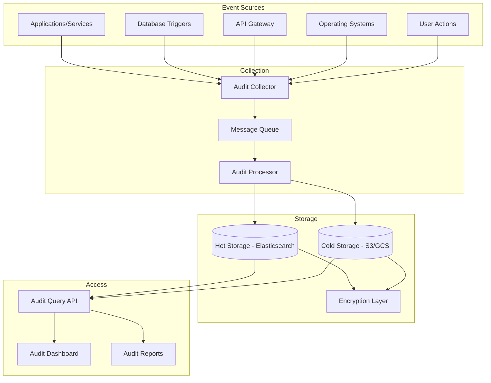

# Software Requirements Specification (SRS)

## Part 09F: Audit Trails

**Module:** Security & Compliance Module (Part 10)
**Version:** 1.0.0
**Status:** Final / For Review
**Date:** 2026-06-30

---

## Chapter 1 – Overview

### Purpose

The Audit Trails module defines the comprehensive framework for capturing, storing, and managing audit logs across the **[Platform Name]** platform. This encompasses audit event collection, secure storage, query capabilities, retention policies, and compliance reporting.

Audit trails are the foundation of accountability and compliance. Every action performed on the platform—by users, systems, and administrators—must be recorded in an immutable, verifiable manner. This module ensures that the platform can demonstrate compliance with regulatory requirements, investigate security incidents, and maintain operational transparency.

### Objectives

- Capture all significant platform events
- Maintain immutable, tamper-proof audit records
- Support compliance with regulatory requirements
- Enable security incident investigation
- Provide operational transparency
- Support real-time and historical audit queries
- Implement secure audit storage and access controls
- Define comprehensive retention and purging policies

---

## Chapter 2 – Audit Architecture

### AUDIT-001 Audit Architecture Overview



### AUDIT-002 Audit Components

| Component | Description | Priority |
| :--- | :--- | :--- |
| **Audit Collector** | Captures events from all sources | **Required** |
| **Message Queue** | Buffers audit events for processing | **Required** |
| **Audit Processor** | Validates, enriches, and stores events | **Required** |
| **Hot Storage** | Fast access storage (Elasticsearch) | **Required** |
| **Cold Storage** | Long-term archival storage (S3/GCS) | **Required** |
| **Encryption Layer** | Encrypts audit data at rest | **Required** |
| **Audit Query API** | Search and retrieve audit events | **Required** |
| **Audit Dashboard** | Visualize and monitor audit events | **Required** |
| **Audit Reports** | Generate compliance reports | **Required** |

---

## Chapter 3 – Audit Events

### AUDIT-003 Event Categories

| Category | Description | Priority |
| :--- | :--- | :--- |
| **Authentication** | Login, logout, authentication events | **Required** |
| **Authorization** | Permission checks, access denials | **Required** |
| **Data Access** | Create, read, update, delete operations | **Required** |
| **Financial** | Payments, settlements, refunds | **Required** |
| **User Management** | User creation, updates, deletion | **Required** |
| **System Configuration** | Configuration changes | **Required** |
| **Security** | Security events, alerts, incidents | **Required** |
| **Compliance** | Compliance events, policy violations | **Required** |
| **Administrative** | Admin actions | **Required** |
| **API Access** | API calls and responses | **Required** |

### AUDIT-004 Event Types

| Event Type | Description | Priority |
| :--- | :--- | :--- |
| `LOGIN_SUCCESS` | Successful login | **Required** |
| `LOGIN_FAILURE` | Failed login attempt | **Required** |
| `LOGOUT` | User logout | **Required** |
| `TOKEN_REFRESH` | Token refresh | **Required** |
| `TOKEN_REVOKE` | Token revocation | **Required** |
| `PASSWORD_CHANGE` | Password change | **Required** |
| `PASSWORD_RESET` | Password reset | **Required** |
| `MFA_ENROLL` | MFA enrollment | **Required** |
| `MFA_VERIFY` | MFA verification | **Required** |
| `USER_CREATE` | User creation | **Required** |
| `USER_UPDATE` | User update | **Required** |
| `USER_DELETE` | User deletion | **Required** |
| `USER_SUSPEND` | User suspension | **Required** |
| `USER_REACTIVATE` | User reactivation | **Required** |
| `ORDER_CREATE` | Order creation | **Required** |
| `ORDER_UPDATE` | Order update | **Required** |
| `ORDER_CANCEL` | Order cancellation | **Required** |
| `ORDER_COMPLETE` | Order completion | **Required** |
| `PAYMENT_AUTHORIZE` | Payment authorization | **Required** |
| `PAYMENT_CAPTURE` | Payment capture | **Required** |
| `PAYMENT_REFUND` | Payment refund | **Required** |
| `PAYMENT_FAIL` | Payment failure | **Required** |
| `SETTLEMENT_CREATE` | Settlement creation | **Required** |
| `SETTLEMENT_PROCESS` | Settlement processing | **Required** |
| `PAYOUT_CREATE` | Payout creation | **Required** |
| `PAYOUT_PROCESS` | Payout processing | **Required** |
| `MERCHANT_APPROVE` | Merchant approval | **Required** |
| `MERCHANT_SUSPEND` | Merchant suspension | **Required** |
| `DRIVER_APPROVE` | Driver approval | **Required** |
| `DRIVER_SUSPEND` | Driver suspension | **Required** |
| `CONFIG_CHANGE` | Configuration change | **Required** |
| `SECURITY_ALERT` | Security alert | **Required** |
| `SECURITY_INCIDENT` | Security incident | **Required** |
| `POLICY_VIOLATION` | Policy violation | **Required** |
| `API_ACCESS` | API access | **Required** |
| `DATA_EXPORT` | Data export | **Required** |
| `DATA_DELETE` | Data deletion | **Required** |
| `AUDIT_QUERY` | Audit query | **Required** |
| `SYSTEM_EVENT` | System event | **Required** |

---

## Chapter 4 – Audit Event Schema

### AUDIT-005 Core Audit Fields

| Field | Type | Required | Description |
| :--- | :--- | :--- | :--- |
| `event_id` | UUID | Yes | Unique event identifier |
| `event_type` | String | Yes | Type of event |
| `event_category` | String | Yes | Category of event |
| `timestamp` | Timestamp | Yes | Event timestamp |
| `user_id` | UUID | | User performing action |
| `user_type` | String | | CUSTOMER/MERCHANT/DRIVER/ADMIN/API |
| `user_email` | String | | User email |
| `user_roles` | TEXT[] | | User roles at time of event |
| `ip_address` | String | | Client IP address |
| `user_agent` | String | | Browser/user agent |
| `session_id` | UUID | | Session identifier |
| `request_id` | UUID | | Request correlation ID |
| `source` | String | | Source system |
| `service_name` | String | | Service name |
| `resource_type` | String | | Resource type (order, user, etc.) |
| `resource_id` | UUID | | Resource identifier |
| `action` | String | | Action performed (CREATE, READ, UPDATE, DELETE) |
| `status` | String | | SUCCESS/FAILURE |
| `before` | JSONB | | State before change |
| `after` | JSONB | | State after change |
| `changes` | JSONB | | Changes made |
| `error_code` | String | | Error code (if failure) |
| `error_message` | String | | Error message (if failure) |
| `metadata` | JSONB | | Additional context |
| `signature` | String | | Cryptographic signature |
| `created_at` | Timestamp | Yes | Record creation timestamp |

### AUDIT-006 Event Data Model

```json
{
  "event_id": "550e8400-e29b-41d4-a716-446655440000",
  "event_type": "ORDER_CANCEL",
  "event_category": "ORDER_MANAGEMENT",
  "timestamp": "2026-06-30T14:30:45.123Z",
  "user_id": "123e4567-e89b-12d3-a456-426614174000",
  "user_type": "CUSTOMER",
  "user_email": "john.doe@example.com",
  "user_roles": ["ROLE_CUSTOMER"],
  "ip_address": "192.168.1.100",
  "user_agent": "Mozilla/5.0 (iPhone; CPU iPhone OS 15_0)",
  "session_id": "987fcdeb-51a2-43b7-9c8d-5e6f7g8h9i0j",
  "request_id": "a1b2c3d4-e5f6-7890-abcd-ef1234567890",
  "source": "MOBILE_APP",
  "service_name": "order-service",
  "resource_type": "ORDER",
  "resource_id": "223e4567-e89b-12d3-a456-426614174000",
  "action": "DELETE",
  "status": "SUCCESS",
  "before": {
    "order_status": "CONFIRMED",
    "total_amount": 45.50
  },
  "after": {
    "order_status": "CANCELLED",
    "total_amount": 0.00
  },
  "changes": {
    "order_status": "CONFIRMED → CANCELLED",
    "total_amount": "45.50 → 0.00"
  },
  "error_code": null,
  "error_message": null,
  "metadata": {
    "cancellation_reason": "Customer requested",
    "cancelled_by": "customer"
  },
  "signature": "3045022100d4f8a7b6c5d4e3f2a1b2c3d4e5f6g7h8i9j0k1l2m3n4o5p6q7r8s9t0u1v2w3x4y5z6...",
  "created_at": "2026-06-30T14:30:45.123Z"
}
```

---

## Chapter 5 – Audit Collection

### AUDIT-007 Collection Methods

| Method | Description | Priority |
| :--- | :--- | :--- |
| **Application Logging** | Services log audit events | **Required** |
| **Database Triggers** | Database-level change tracking | **Required** |
| **API Gateway Logging** | API request/response logging | **Required** |
| **Message Queue** | Asynchronous event collection | **Required** |
| **File Monitoring** | System log file monitoring | **Required** |
| **Agent-Based** | Host-based audit agents | **Required** |

### AUDIT-008 Collection Requirements

| Requirement | Specification | Priority |
| :--- | :--- | :--- |
| **Latency** | < 1 second from event to collection | **Required** |
| **Throughput** | Support 10,000+ events/second | **Required** |
| **Reliability** | 99.99% event capture rate | **Required** |
| **Deduplication** | Detect and handle duplicate events | **Required** |
| **Validation** | Validate event schema on receipt | **Required** |
| **Enrichment** | Add context to events | **Required** |

---

## Chapter 6 – Audit Storage

### AUDIT-009 Storage Tiers

| Tier | Storage Type | Retention | Access SLA | Priority |
| :--- | :--- | :--- | :--- |
| **Hot** | Elasticsearch | 90 days | < 1 second | **Required** |
| **Warm** | Elasticsearch | 1 year | < 5 seconds | **Required** |
| **Cold** | S3/GCS | 7 years | < 1 minute | **Required** |
| **Archive** | Glacier/Archive | 10+ years | < 12 hours | **Required** |

### AUDIT-010 Storage Requirements

| Requirement | Specification | Priority |
| :--- | :--- | :--- |
| **Immutable** | Write-once, append-only | **Required** |
| **Encryption** | AES-256 at rest | **Required** |
| **Replication** | At least 2 copies (multi-AZ) | **Required** |
| **Backup** | Automated backups | **Required** |
| **Indexing** | Indexed for fast search | **Required** |
| **Partitioning** | Date-based partitioning | **Required** |

### AUDIT-011 Index Management

| Index Pattern | Description | Retention | Priority |
| :--- | :--- | :--- | :--- |
| `audit-{YYYY-MM-DD}` | Daily audit indices | 90 days (hot) | **Required** |
| `audit-warm-{YYYY-MM}` | Monthly warm indices | 1 year (warm) | **Required** |
| `audit-cold-{YYYY}` | Yearly cold indices | 7 years (cold) | **Required** |

---

## Chapter 7 – Audit Query

### AUDIT-012 Query Capabilities

| Feature | Description | Priority |
| :--- | :--- | :--- |
| **Event Search** | Search by event type, user, date, resource | **Required** |
| **Full-Text Search** | Search within event data | **Required** |
| **Faceted Search** | Filter by categories and attributes | **Required** |
| **Date Range** | Query by date range | **Required** |
| **Aggregation** | Group and aggregate events | **Required** |
| **Export** | Export query results (CSV, JSON, PDF) | **Required** |
| **Saved Queries** | Save and reuse queries | **Required** |
| **Alerts** | Real-time alert on query conditions | **Required** |

### AUDIT-013 Query API

| Method | Endpoint | Description |
| :--- | :--- | :--- |
| `POST` | `/api/v1/audit/query` | Execute audit query |
| `GET` | `/api/v1/audit/events/{id}` | Get event by ID |
| `GET` | `/api/v1/audit/events/user/{id}` | Get events for user |
| `GET` | `/api/v1/audit/events/resource/{type}/{id}` | Get events for resource |
| `POST` | `/api/v1/audit/export` | Export query results |
| `GET` | `/api/v1/audit/saved-queries` | List saved queries |
| `POST` | `/api/v1/audit/saved-queries` | Save a query |
| `DELETE` | `/api/v1/audit/saved-queries/{id}` | Delete saved query |

### AUDIT-014 Query Request Data Model

| Attribute | Type | Required | Description |
| :--- | :--- | :--- | :--- |
| `query_id` | UUID | Yes | Unique query identifier |
| `event_types` | TEXT[] | | Filter by event types |
| `event_categories` | TEXT[] | | Filter by event categories |
| `user_ids` | TEXT[] | | Filter by users |
| `user_types` | TEXT[] | | Filter by user types |
| `resource_types` | TEXT[] | | Filter by resource types |
| `resource_ids` | TEXT[] | | Filter by resource IDs |
| `status` | String | | Filter by status (SUCCESS/FAILURE) |
| `date_range_start` | Timestamp | | Start date |
| `date_range_end` | Timestamp` | | End date |
| `search_term` | String | | Full-text search term |
| `aggregations` | JSONB | | Aggregation configuration |
| `limit` | Integer | | Result limit (max 10,000) |
| `offset` | Integer | | Result offset |
| `sort_by` | String | | Sort field |
| `sort_order` | String | | ASC/DESC |
| `export_format` | String | | CSV/JSON/PDF |

### AUDIT-015 Query Response Data Model

| Attribute | Type | Description |
| :--- | :--- | :--- |
| `query_id` | UUID | Query identifier |
| `total` | Integer | Total matching events |
| `events` | JSONB[] | Audit events |
| `aggregations` | JSONB | Aggregation results |
| `query_time_ms` | Integer | Query execution time |
| `export_url` | String | URL for exported results |
| `has_more` | Boolean | More results available |
| `next_offset` | Integer | Offset for next page |

---

## Chapter 8 – Audit Retention & Purge

### AUDIT-016 Retention Policy

| Event Category | Retention | Purge Action | Priority |
| :--- | :--- | :--- | :--- |
| **Authentication** | 1 year | Delete | **Required** |
| **Authorization** | 1 year | Delete | **Required** |
| **Data Access** | 3 years | Anonymize/Delete | **Required** |
| **Financial** | 7 years | Archive | **Required** |
| **User Management** | 7 years | Archive | **Required** |
| **System Configuration** | 3 years | Delete | **Required** |
| **Security** | 7 years | Archive | **Required** |
| **Compliance** | 7 years | Archive | **Required** |
| **Administrative** | 7 years | Archive | **Required** |
| **API Access** | 90 days | Delete | **Required** |

### AUDIT-017 Purge Workflow

1.  Retention period expires.
2.  System identifies events for purging.
3.  Events moved to cold storage (if applicable).
4.  Events deleted from hot/warm storage.
5.  Purge logged for audit.
6.  Purge verified and confirmed.

### AUDIT-018 Purge Data Model

| Column | Type | Constraints | Description |
| :--- | :--- | :--- | :--- |
| `purge_id` | UUID | PRIMARY KEY | Unique identifier |
| `event_category` | VARCHAR(50) | NOT NULL | Category purged |
| `purge_date` | DATE | NOT NULL | Purge date |
| `events_purged` | INTEGER | | Number of events purged |
| `retention_period` | INTEGER | | Retention period (days) |
| `purge_reason` | VARCHAR(50) | | EXPIRED/COMPLIANCE/REQUEST |
| `archived` | BOOLEAN | | Whether archived before purge |
| `archived_location` | VARCHAR(500) | | Archive location |
| `performed_by` | UUID | | Performed by user |
| `verified_by` | UUID` | | Verified by user |
| `verified_at` | TIMESTAMP` | | Verification timestamp |
| `created_at` | TIMESTAMP | DEFAULT NOW() | Creation timestamp |
| `updated_at` | TIMESTAMP | DEFAULT NOW() | Last update timestamp |

---

## Chapter 9 – Audit Security

### AUDIT-019 Security Controls

| Control | Description | Priority |
| :--- | :--- | :--- |
| **Access Control** | Restrict audit data access | **Required** |
| **Encryption** | Encrypt audit data at rest and in transit | **Required** |
| **Immutable** | Prevent modification of audit data | **Required** |
| **Tamper Detection** | Detect tampering attempts | **Required** |
| **Audit of Audits** | Log all audit access | **Required** |
| **Separation of Duties** | Separate audit admin from data access | **Required** |
| **Data Masking** | Mask sensitive data in audit | **Required** |

### AUDIT-020 Access Control Roles

| Role | Access | Priority |
| :--- | :--- | :--- |
| **Audit Administrator** | Full access (manage retention, purge) | **Required** |
| **Security Team** | Read access (investigation) | **Required** |
| **Compliance Team** | Read access (compliance checks) | **Required** |
| **Auditor** | Read-only access (external audit) | **Required** |
| **Developer** | No access (exception for debugging) | **Required** |
| **Support** | Limited access (customer-specific) | **Required** |

### AUDIT-021 Tamper Detection

| Method | Description | Priority |
| :--- | :--- | :--- |
| **Hash Chain** | Cryptographic linkage of events | **Required** |
| **Digital Signatures** | Sign each event | **Required** |
| **Checksums** | Periodic checksum verification | **Required** |
| **Integrity Monitoring** | Monitor for unauthorized changes | **Required** |
| **Alerting** | Alert on integrity violations | **Required** |

---

## Chapter 10 – Compliance Reporting

### AUDIT-022 Compliance Reports

| Report | Description | Frequency | Priority |
| :--- | :--- | :--- | :--- |
| **Access Report** | User access history | Monthly | **Required** |
| **Data Access Report** | Data access patterns | Monthly | **Required** |
| **Financial Audit Trail** | Financial transactions | Monthly | **Required** |
| **Security Event Report** | Security events | Weekly | **Required** |
| **Compliance Summary** | Compliance status | Quarterly | **Required** |
| **User Activity Report** | User activity summary | Monthly | **Required** |
| **Administrative Actions** | Admin action audit | Monthly | **Required** |

### AUDIT-023 Report Data Model

| Column | Type | Constraints | Description |
| :--- | :--- | :--- | :--- |
| `report_id` | UUID | PRIMARY KEY | Unique identifier |
| `report_name` | VARCHAR(255) | NOT NULL | Report name |
| `report_type` | VARCHAR(50) | NOT NULL | ACCESS/DATA/FINANCIAL/SECURITY/COMPLIANCE |
| `report_period_start` | DATE | NOT NULL | Period start |
| `report_period_end` | DATE | NOT NULL | Period end |
| `report_data` | JSONB | NOT NULL | Report data |
| `format` | VARCHAR(10) | DEFAULT 'PDF' | PDF/CSV/JSON |
| `file_url` | VARCHAR(500) | | Report file URL |
| `generated_by` | UUID | | Generator identifier |
| `generated_at` | TIMESTAMP | | Generation timestamp |
| `created_at` | TIMESTAMP | DEFAULT NOW() | Creation timestamp |
| `updated_at` | TIMESTAMP | DEFAULT NOW() | Last update timestamp |

---

## Chapter 11 – Database Tables

### audit_events

| Column | Type | Constraints | Description |
| :--- | :--- | :--- | :--- |
| `event_id` | UUID | PRIMARY KEY | Unique event identifier |
| `event_type` | VARCHAR(50) | NOT NULL | Event type |
| `event_category` | VARCHAR(50) | NOT NULL | Event category |
| `timestamp` | TIMESTAMP | NOT NULL | Event timestamp |
| `user_id` | UUID | | User performing action |
| `user_type` | VARCHAR(20) | | CUSTOMER/MERCHANT/DRIVER/ADMIN/API |
| `user_email` | VARCHAR(255) | | User email |
| `user_roles` | TEXT[] | | User roles |
| `ip_address` | VARCHAR(45) | | Client IP address |
| `user_agent` | TEXT | | Browser/user agent |
| `session_id` | UUID | | Session identifier |
| `request_id` | UUID | | Request correlation ID |
| `source` | VARCHAR(50) | | Source system |
| `service_name` | VARCHAR(100) | | Service name |
| `resource_type` | VARCHAR(50) | | Resource type |
| `resource_id` | UUID | | Resource identifier |
| `action` | VARCHAR(20) | | CREATE/READ/UPDATE/DELETE |
| `status` | VARCHAR(20) | | SUCCESS/FAILURE |
| `before` | JSONB` | | State before change |
| `after` | JSONB` | | State after change |
| `changes` | JSONB` | | Changes made |
| `error_code` | VARCHAR(50) | | Error code |
| `error_message` | TEXT | | Error message |
| `metadata` | JSONB | | Additional context |
| `signature` | TEXT | | Cryptographic signature |
| `created_at` | TIMESTAMP | DEFAULT NOW() | Record creation timestamp |

### audit_query_logs

| Column | Type | Constraints | Description |
| :--- | :--- | :--- | :--- |
| `query_id` | UUID | PRIMARY KEY | Unique identifier |
| `user_id` | UUID | | User performing query |
| `query_params` | JSONB | NOT NULL | Query parameters |
| `result_count` | INTEGER | | Number of results |
| `query_time_ms` | INTEGER | | Query execution time |
| `status` | VARCHAR(20) | | SUCCESS/FAILURE |
| `ip_address` | VARCHAR(45) | | Client IP address |
| `created_at` | TIMESTAMP | DEFAULT NOW() | Creation timestamp |

### audit_purges

| Column | Type | Constraints | Description |
| :--- | :--- | :--- | :--- |
| `purge_id` | UUID | PRIMARY KEY | Unique identifier |
| `event_category` | VARCHAR(50) | NOT NULL | Category purged |
| `purge_date` | DATE | NOT NULL | Purge date |
| `events_purged` | INTEGER | | Number of events purged |
| `retention_period` | INTEGER | | Retention period (days) |
| `purge_reason` | VARCHAR(50) | | EXPIRED/COMPLIANCE/REQUEST |
| `archived` | BOOLEAN` | | Whether archived before purge |
| `archived_location` | VARCHAR(500) | | Archive location |
| `performed_by` | UUID | | Performed by user |
| `verified_by` | UUID | | Verified by user |
| `verified_at` | TIMESTAMP` | | Verification timestamp |
| `created_at` | TIMESTAMP | DEFAULT NOW() | Creation timestamp |
| `updated_at` | TIMESTAMP | DEFAULT NOW() | Last update timestamp |

### audit_reports

| Column | Type | Constraints | Description |
| :--- | :--- | :--- | :--- |
| `report_id` | UUID | PRIMARY KEY | Unique identifier |
| `report_name` | VARCHAR(255) | NOT NULL | Report name |
| `report_type` | VARCHAR(50) | NOT NULL | ACCESS/DATA/FINANCIAL/SECURITY/COMPLIANCE |
| `period_start` | DATE | NOT NULL | Period start |
| `period_end` | DATE | NOT NULL | Period end |
| `report_data` | JSONB | NOT NULL | Report data |
| `format` | VARCHAR(10) | DEFAULT 'PDF' | PDF/CSV/JSON |
| `file_url` | VARCHAR(500) | | Report file URL |
| `generated_by` | UUID | | Generator identifier |
| `generated_at` | TIMESTAMP | | Generation timestamp |
| `created_at` | TIMESTAMP | DEFAULT NOW() | Creation timestamp |
| `updated_at` | TIMESTAMP | DEFAULT NOW() | Last update timestamp |

### audit_saved_queries

| Column | Type | Constraints | Description |
| :--- | :--- | :--- | :--- |
| `saved_query_id` | UUID | PRIMARY KEY | Unique identifier |
| `user_id` | UUID | | User who saved query |
| `query_name` | VARCHAR(100) | NOT NULL | Query name |
| `query_params` | JSONB | NOT NULL | Query parameters |
| `is_public` | BOOLEAN | DEFAULT FALSE | Public query |
| `created_at` | TIMESTAMP | DEFAULT NOW() | Creation timestamp |
| `updated_at` | TIMESTAMP | DEFAULT NOW() | Last update timestamp |

---

## Chapter 12 – REST APIs

### Audit Query APIs

| Method | Endpoint | Description |
| :--- | :--- | :--- |
| `POST` | `/api/v1/audit/query` | Execute audit query |
| `GET` | `/api/v1/audit/events/{id}` | Get event by ID |
| `GET` | `/api/v1/audit/events/user/{id}` | Get events for user |
| `GET` | `/api/v1/audit/events/resource/{type}/{id}` | Get events for resource |
| `POST` | `/api/v1/audit/export` | Export query results |
| `GET` | `/api/v1/audit/saved-queries` | List saved queries |
| `POST` | `/api/v1/audit/saved-queries` | Save a query |
| `PUT` | `/api/v1/audit/saved-queries/{id}` | Update saved query |
| `DELETE` | `/api/v1/audit/saved-queries/{id}` | Delete saved query |

### Audit Report APIs

| Method | Endpoint | Description |
| :--- | :--- | :--- |
| `GET` | `/api/v1/audit/reports` | List reports |
| `POST` | `/api/v1/audit/reports/generate` | Generate report |
| `GET` | `/api/v1/audit/reports/{id}` | Get report details |
| `GET` | `/api/v1/audit/reports/{id}/download` | Download report |

### Admin APIs

| Method | Endpoint | Description |
| :--- | :--- | :--- |
| `GET` | `/api/v1/admin/audit/statistics` | Get audit statistics |
| `GET` | `/api/v1/admin/audit/retention` | Get retention status |
| `POST` | `/api/v1/admin/audit/purge` | Trigger purge (admin) |
| `GET` | `/api/v1/admin/audit/purges` | List purges |
| `GET` | `/api/v1/admin/audit/health` | Get audit system health |

### Dashboard APIs

| Method | Endpoint | Description |
| :--- | :--- | :--- |
| `GET` | `/api/v1/audit/dashboard` | Get audit dashboard |
| `GET` | `/api/v1/audit/metrics` | Get audit metrics |

---

## Chapter 13 – Business Rules

| Rule ID | Rule Description | Priority |
| :--- | :--- | :--- |
| **BR-AUDIT-001** | Audit events must be immutable (write-once, append-only). | **High** |
| **BR-AUDIT-002** | All audit events must be captured within 1 second. | **High** |
| **BR-AUDIT-003** | Audit data must be retained for minimum 90 days (hot storage). | **High** |
| **BR-AUDIT-004** | Financial audit data must be retained for 7 years. | **High** |
| **BR-AUDIT-005** | Audit access must be logged and audited. | **High** |
| **BR-AUDIT-006** | Audit data must be encrypted at rest (AES-256). | **High** |
| **BR-AUDIT-007** | Audit data must be encrypted in transit (TLS 1.3). | **High** |
| **BR-AUDIT-008** | Audit queries must be limited to 10,000 results (max). | **High** |
| **BR-AUDIT-009** | Audit purges must be logged and verified. | **High** |
| **BR-AUDIT-010** | Audit system must maintain > 99.99% event capture rate. | **High** |

---

## Chapter 14 – Acceptance Tests

| Test ID | Test Description | Priority |
| :--- | :--- | :--- |
| **TEST-AUDIT-001** | Audit event captured for user login. | **High** |
| **TEST-AUDIT-002** | Audit event captured for order creation. | **High** |
| **TEST-AUDIT-003** | Audit event captured for payment transaction. | **High** |
| **TEST-AUDIT-004** | Audit event captured for user update. | **High** |
| **TEST-AUDIT-005** | Audit event captured for configuration change. | **High** |
| **TEST-AUDIT-006** | Audit event captured for security alert. | **High** |
| **TEST-AUDIT-007** | Audit query returns correct events. | **High** |
| **TEST-AUDIT-008** | Audit query filters work correctly. | **High** |
| **TEST-AUDIT-009** | Audit query date range filtering works. | **High** |
| **TEST-AUDIT-010** | Audit query full-text search works. | **High** |
| **TEST-AUDIT-011** | Audit query aggregation works. | **High** |
| **TEST-AUDIT-012** | Audit query results exported to CSV. | **High** |
| **TEST-AUDIT-013** | Audit query results exported to JSON. | **High** |
| **TEST-AUDIT-014** | Saved query persists correctly. | **High** |
| **TEST-AUDIT-015** | Audit event retrieval by ID works. | **High** |
| **TEST-AUDIT-016** | Audit event retrieval by user works. | **High** |
| **TEST-AUDIT-017** | Audit event retrieval by resource works. | **High** |
| **TEST-AUDIT-018** | Audit purge removes expired events. | **High** |
| **TEST-AUDIT-019** | Audit integrity check passes. | **High** |
| **TEST-AUDIT-020** | Audit tampering detection works. | **High** |
| **TEST-AUDIT-021** | Audit report generated correctly. | **High** |
| **TEST-AUDIT-022** | Audit dashboard displays correctly. | **High** |
| **TEST-AUDIT-023** | Audit event capture rate > 99.99%. | **High** |
| **TEST-AUDIT-024** | Audit system handles 10,000 events/second. | **High** |
| **TEST-AUDIT-025** | Audit data encrypted at rest. | **High** |

---

## Chapter 15 – Traceability Matrix

| Requirement | Database Table | API Endpoint(s) | Acceptance Test |
| :--- | :--- | :--- | :--- |
| AUDIT-004 | audit_events | POST /api/v1/audit/query | TEST-AUDIT-001, TEST-AUDIT-002, TEST-AUDIT-003, TEST-AUDIT-004, TEST-AUDIT-005, TEST-AUDIT-006 |
| AUDIT-012 | audit_events | POST /api/v1/audit/query | TEST-AUDIT-007, TEST-AUDIT-008, TEST-AUDIT-009, TEST-AUDIT-010, TEST-AUDIT-011 |
| AUDIT-012 | audit_query_logs | POST /api/v1/audit/export | TEST-AUDIT-012, TEST-AUDIT-013 |
| AUDIT-012 | audit_saved_queries | POST /api/v1/audit/saved-queries | TEST-AUDIT-014 |
| AUDIT-013 | audit_events | GET /api/v1/audit/events/{id} | TEST-AUDIT-015 |
| AUDIT-013 | audit_events | GET /api/v1/audit/events/user/{id} | TEST-AUDIT-016 |
| AUDIT-013 | audit_events | GET /api/v1/audit/events/resource/{type}/{id} | TEST-AUDIT-017 |
| AUDIT-017 | audit_purges | POST /api/v1/admin/audit/purge | TEST-AUDIT-018 |
| AUDIT-021 | audit_events | GET /api/v1/admin/audit/health | TEST-AUDIT-019, TEST-AUDIT-020 |
| AUDIT-022 | audit_reports | POST /api/v1/audit/reports/generate | TEST-AUDIT-021 |
| AUDIT-020 | audit_events | GET /api/v1/audit/dashboard | TEST-AUDIT-022 |
| AUDIT-007 | audit_events | GET /api/v1/admin/audit/statistics | TEST-AUDIT-023, TEST-AUDIT-024 |
| AUDIT-019 | audit_events | GET /api/v1/admin/audit/health | TEST-AUDIT-025 |

---

## Chapter 16 – Summary

This document establishes the complete audit trail capability for the **[Platform Name]** platform. Key takeaways:

- **Comprehensive Audit Capture:** All significant platform events across authentication, authorization, data access, financial, user management, system configuration, security, compliance, and administrative categories.
- **Immutable Storage:** Write-once, append-only audit records with cryptographic signatures and tamper detection.
- **Multi-Tier Storage:** Hot storage (90 days), warm storage (1 year), cold storage (7 years), and archive (10+ years) with appropriate retention policies.
- **Powerful Query Capabilities:** Event search, full-text search, faceted search, date range filtering, aggregations, and saved queries.
- **Export Capabilities:** Export query results to CSV, JSON, and PDF formats.
- **Security Controls:** Access control, encryption, immutable storage, tamper detection, and audit of audits.
- **Compliance Reporting:** Scheduled and on-demand compliance reports (access, data, financial, security, compliance).
- **Retention & Purge:** Automated retention and purge workflows with verification and logging.
- **Scalability:** Support for 10,000+ events/second with 99.99% event capture rate.

The audit trails module provides the foundation for accountability, compliance, and security investigation across the platform.

---

**Next Document:**

`11_Notifications_Communications/Part_10A_Notification_Engine.md`

*(This transitions from security to notifications, starting with the notification engine.)*
